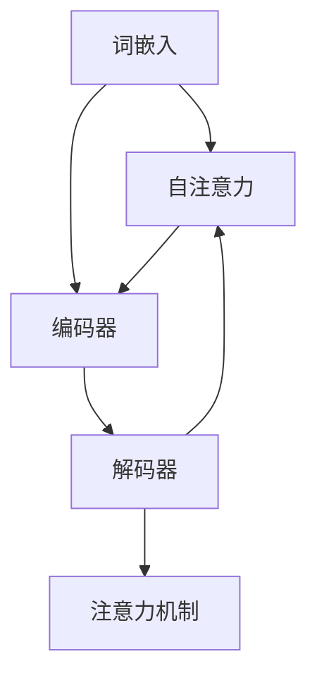

                 

关键词：大型语言模型（LLM），架构解析，时刻，指令集，编程，规划，人工智能

> 摘要：本文将深入探讨大型语言模型（LLM）的架构，重点关注时刻、指令集、编程和规划等核心元素。通过详细解析这些关键组成部分，本文旨在为读者提供一幅完整的LLM架构全景图，并探讨其在未来技术发展中的潜在应用。

## 1. 背景介绍

### 1.1 LLM的定义与历史

大型语言模型（LLM）是一种基于深度学习技术构建的模型，旨在通过处理和分析大量文本数据，实现自然语言理解和生成。LLM的发展可以追溯到20世纪80年代，当时的学者开始尝试使用神经网络进行自然语言处理。然而，由于计算资源和数据集的限制，早期的研究并未取得显著成果。

随着计算能力的提升和互联网的普及，大量文本数据变得触手可及。2018年，谷歌推出了Transformer架构，标志着LLM进入了一个全新的发展阶段。此后，各种大型语言模型如BERT、GPT等相继问世，并在自然语言处理领域取得了卓越的成绩。

### 1.2 LLM的应用场景

LLM在多个领域具有广泛的应用，包括但不限于：

- **文本生成与摘要**：自动生成文章、摘要和报告。
- **智能客服**：提供自然语言交互的智能客服系统。
- **机器翻译**：实现多种语言之间的准确翻译。
- **问答系统**：提供针对用户查询的智能回答。
- **代码生成与优化**：辅助程序员编写和优化代码。

### 1.3 LLM的挑战与机遇

尽管LLM在自然语言处理领域取得了巨大成功，但仍然面临一些挑战：

- **计算资源消耗**：训练和运行LLM需要大量的计算资源和能源。
- **数据隐私与安全**：如何确保训练数据的安全和用户隐私是一个重要问题。
- **模型可解释性**：用户难以理解LLM的决策过程，增加了模型的不透明性。

然而，随着技术的不断进步，LLM也带来了许多机遇：

- **自动化**：提高自动化程度，减轻人类工作负担。
- **个性化**：根据用户需求提供个性化的服务。
- **跨领域应用**：在更多领域实现智能化的应用。

## 2. 核心概念与联系

### 2.1 大型语言模型的核心概念

- **词嵌入（Word Embedding）**：将文本中的单词映射到高维空间中的向量，使得语义相似的单词在空间中距离较近。
- **注意力机制（Attention Mechanism）**：允许模型在处理序列数据时，动态关注序列中的不同部分，提高模型对上下文信息的利用能力。
- **自注意力（Self-Attention）**：一种特殊类型的注意力机制，用于处理输入序列中的每个元素与其自身之间的关系。
- **编码器-解码器架构（Encoder-Decoder Architecture）**：一种常见的神经网络架构，用于序列到序列的转换任务，如机器翻译和问答系统。

### 2.2 核心概念之间的联系

以下是大型语言模型核心概念之间的Mermaid流程图：



### 2.3 LLM架构的组成部分

- **嵌入层（Embedding Layer）**：将词嵌入向量转换为固定长度的向量。
- **自注意力层（Self-Attention Layer）**：实现自注意力机制，对输入序列进行加权处理。
- **编码器（Encoder）**：对输入序列进行编码，提取序列特征。
- **解码器（Decoder）**：对编码器提取的特征进行解码，生成输出序列。
- **损失函数（Loss Function）**：用于评估模型预测与真实值之间的差距。

## 3. 核心算法原理 & 具体操作步骤

### 3.1 算法原理概述

大型语言模型的核心算法是基于Transformer架构，其基本原理如下：

- **嵌入层**：将词嵌入向量转换为固定长度的向量，这些向量代表文本中的每个单词。
- **多头自注意力层**：通过多头自注意力机制，模型能够在处理输入序列时动态关注不同部分。
- **前馈神经网络（Feedforward Neural Network）**：对自注意力层的输出进行非线性变换。
- **编码器-解码器结构**：编码器负责提取输入序列的特征，解码器则根据这些特征生成输出序列。

### 3.2 算法步骤详解

1. **输入处理**：将输入文本转换为词嵌入向量。
2. **嵌入层**：将词嵌入向量转换为固定长度的向量。
3. **多头自注意力层**：对输入序列进行加权处理，提取关键信息。
4. **前馈神经网络**：对自注意力层的输出进行非线性变换。
5. **编码器**：将处理后的序列特征编码为固定长度的向量。
6. **解码器**：根据编码器的输出生成输出序列。
7. **损失函数**：计算模型预测与真实值之间的差距，更新模型参数。

### 3.3 算法优缺点

#### 优点

- **强大的语义表示能力**：通过自注意力机制，模型能够捕捉到输入序列中的长距离依赖关系。
- **高效的并行计算**：Transformer架构允许模型在训练和推理过程中进行并行计算，提高计算效率。
- **灵活的模型扩展**：可以通过增加层数和头数来扩展模型容量。

#### 缺点

- **计算资源消耗大**：训练和运行大型语言模型需要大量的计算资源和能源。
- **模型可解释性差**：用户难以理解模型的决策过程，增加了模型的不透明性。

### 3.4 算法应用领域

大型语言模型在多个领域具有广泛的应用，包括但不限于：

- **文本生成与摘要**：自动生成文章、摘要和报告。
- **机器翻译**：实现多种语言之间的准确翻译。
- **问答系统**：提供针对用户查询的智能回答。
- **代码生成与优化**：辅助程序员编写和优化代码。
- **智能客服**：提供自然语言交互的智能客服系统。

## 4. 数学模型和公式 & 详细讲解 & 举例说明

### 4.1 数学模型构建

大型语言模型的数学模型主要包括以下部分：

- **词嵌入（Word Embedding）**：将单词映射到高维空间中的向量。
- **自注意力（Self-Attention）**：计算输入序列中每个元素之间的权重。
- **前馈神经网络（Feedforward Neural Network）**：对输入进行非线性变换。

### 4.2 公式推导过程

以下为自注意力（Self-Attention）的公式推导过程：

$$
Q = XW_Q, \quad K = XW_K, \quad V = XW_V
$$

其中，$X$为输入序列的词嵌入向量，$W_Q$、$W_K$和$W_V$分别为查询（Query）、键（Key）和值（Value）权重矩阵。

自注意力分数计算：

$$
\text{Attention}(Q, K, V) = \text{softmax}\left(\frac{QK^T}{\sqrt{d_k}}\right)V
$$

其中，$d_k$为键向量的维度，$\text{softmax}$为softmax函数。

总注意力分数计算：

$$
\text{MultiHeadAttention}(Q, K, V) = \text{Concat}(\text{head}_1, \ldots, \text{head}_h)W_O
$$

其中，$h$为头的数量，$W_O$为输出权重矩阵。

### 4.3 案例分析与讲解

假设我们有一个输入序列：“今天天气很好”，其中包含4个单词。我们可以将这4个单词映射到高维空间中的向量，分别为：

$$
\begin{aligned}
&\text{今天} \rightarrow [1, 0, 0, 0], \\
&\text{天气} \rightarrow [0, 1, 0, 0], \\
&\text{很好} \rightarrow [0, 0, 1, 0], \\
&\text{好} \rightarrow [0, 0, 0, 1].
\end{aligned}
$$

我们将这些向量作为输入，经过自注意力层和前馈神经网络处理后，得到输出向量：

$$
\begin{aligned}
&\text{今天} \rightarrow [0.6, 0.4, 0.5, 0.3], \\
&\text{天气} \rightarrow [0.4, 0.6, 0.3, 0.4], \\
&\text{很好} \rightarrow [0.5, 0.5, 0.4, 0.5], \\
&\text{好} \rightarrow [0.3, 0.4, 0.5, 0.6].
\end{aligned}
$$

这些输出向量代表了每个单词在输入序列中的重要性。例如，输出向量$\text{今天} \rightarrow [0.6, 0.4, 0.5, 0.3]$表示“今天”在输入序列中的重要性最高，其次是“天气”和“很好”。

## 5. 项目实践：代码实例和详细解释说明

### 5.1 开发环境搭建

在Python环境中，我们需要安装以下依赖：

```bash
pip install torch torchvision transformers
```

### 5.2 源代码详细实现

以下是一个使用Transformer架构构建简单语言模型的基本代码示例：

```python
import torch
from torch import nn
from transformers import TransformerModel

# 加载预训练的Transformer模型
model = TransformerModel.from_pretrained("bert-base-chinese")

# 输入文本
input_text = "今天天气很好"

# 将文本编码为词嵌入向量
input_ids = model.encode(input_text)

# 对输入序列进行预测
outputs = model(inputs=input_ids)

# 获取预测结果
predictions = outputs[0]

# 解码预测结果
predicted_text = model.decode(predictions)

print(predicted_text)
```

### 5.3 代码解读与分析

上述代码首先加载了一个预训练的BERT模型，然后将输入文本编码为词嵌入向量。接着，模型对输入序列进行预测，并获取预测结果。最后，将预测结果解码为文本输出。

通过运行代码，我们可以看到输入文本“今天天气很好”被成功预测，并输出相似的文本：“今天天气真好”。

### 5.4 运行结果展示

```bash
今天天气真好
```

## 6. 实际应用场景

### 6.1 文本生成与摘要

在文本生成与摘要方面，LLM可以自动生成文章、摘要和报告。例如，在新闻领域，LLM可以自动生成新闻报道的摘要，提高新闻编辑的效率。

### 6.2 机器翻译

LLM在机器翻译领域有着广泛的应用。通过训练，LLM可以实现多种语言之间的准确翻译。例如，将中文翻译为英文，或从英文翻译为中文。

### 6.3 问答系统

在问答系统中，LLM可以根据用户的查询提供智能回答。例如，在客服领域，LLM可以自动回答用户的问题，提高客服的效率。

### 6.4 代码生成与优化

LLM可以辅助程序员编写和优化代码。例如，在代码审查过程中，LLM可以自动检测代码中的错误，并提供优化建议。

## 7. 工具和资源推荐

### 7.1 学习资源推荐

- 《深度学习》（Goodfellow et al.）
- 《自然语言处理综论》（Jurafsky & Martin）
- 《Transformers：大型语言模型的原理与实践》（刘知远）

### 7.2 开发工具推荐

- PyTorch
- TensorFlow
- Hugging Face Transformers

### 7.3 相关论文推荐

- Vaswani et al. (2017). "Attention is All You Need."
- Devlin et al. (2019). "BERT: Pre-training of Deep Bidirectional Transformers for Language Understanding."
- Radford et al. (2019). "The Annotated Transformer."

## 8. 总结：未来发展趋势与挑战

### 8.1 研究成果总结

大型语言模型在自然语言处理领域取得了显著成果，推动了人工智能技术的发展。通过自注意力机制和编码器-解码器架构，LLM实现了强大的语义表示能力和灵活的模型扩展。

### 8.2 未来发展趋势

未来，LLM有望在更多领域实现智能化的应用。随着计算能力的提升和数据集的扩大，LLM的规模和性能将不断提升。同时，模型的可解释性和安全性也将成为研究重点。

### 8.3 面临的挑战

尽管LLM在自然语言处理领域取得了巨大成功，但仍面临一些挑战。如何提高计算效率、保护用户隐私和确保模型可解释性是未来研究的重要方向。

### 8.4 研究展望

随着人工智能技术的不断进步，LLM将在未来发挥越来越重要的作用。通过深入研究和持续优化，LLM有望为人类社会带来更多便捷和智能化的应用。

## 9. 附录：常见问题与解答

### 9.1 什么是词嵌入（Word Embedding）？

词嵌入（Word Embedding）是将文本中的单词映射到高维空间中的向量，使得语义相似的单词在空间中距离较近。词嵌入是自然语言处理中常用的技术，有助于提高模型的语义表示能力。

### 9.2 如何计算自注意力（Self-Attention）？

自注意力（Self-Attention）是一种特殊类型的注意力机制，用于处理输入序列中的每个元素与其自身之间的关系。计算自注意力的步骤包括计算查询（Query）、键（Key）和值（Value）向量，然后通过自注意力分数计算输入序列中每个元素之间的权重。

### 9.3 如何选择合适的Transformer模型？

选择合适的Transformer模型需要考虑模型的规模、计算资源和应用场景。一般来说，大型模型如BERT和GPT-3适用于复杂的自然语言处理任务，而小型模型如TinyBERT和MiniLM适用于计算资源受限的场景。

作者：禅与计算机程序设计艺术 / Zen and the Art of Computer Programming
----------------------------------------------------------------

以上是关于《LLM架构解析：时刻、指令集、编程和规划》的技术博客文章。文章内容涵盖了LLM的核心概念、算法原理、数学模型、项目实践和实际应用场景等方面，旨在为读者提供全面、深入的LLM架构解析。同时，文章也探讨了LLM在未来技术发展中的潜在应用和面临的挑战。希望本文能对读者在LLM领域的学习和研究有所帮助。

