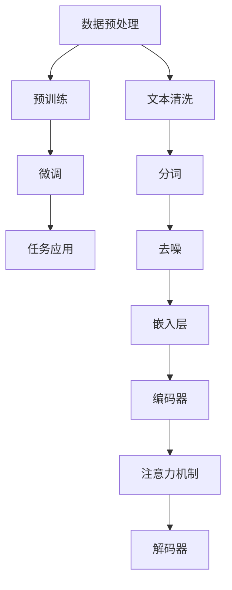

                 

关键词：大型语言模型（LLM），生态圈，从0到1，技术革命，产业应用，创新

> 摘要：本文深入探讨了大型语言模型（LLM）生态圈的崛起，从其发展背景、核心概念、算法原理、数学模型，到项目实践与应用场景，全面剖析了LLM技术的奇迹之旅。本文旨在为读者揭示LLM生态圈的无限潜力，并对其未来发展提出展望。

## 1. 背景介绍

### 1.1 从GPT到ChatGPT

近年来，人工智能（AI）领域迎来了前所未有的发展，其中大型语言模型（LLM）无疑是这一浪潮中的璀璨明珠。从2018年OpenAI发布的GPT-1开始，到2022年GPT-3的问世，再到今年（2023）ChatGPT的惊艳亮相，LLM技术经历了从无到有、从有到优的飞速发展。

GPT系列模型以其强大的语言理解和生成能力，迅速引发了学术界和工业界的高度关注。ChatGPT则更进一步，通过引入对话生成预训练技术，实现了更加自然、流畅的对话交互，将LLM的应用推向了新的高度。

### 1.2 LLM的崛起与产业应用

随着LLM技术的不断成熟，其在多个产业领域中的应用场景也越来越广泛。从自然语言处理（NLP）到语音识别（ASR），从机器翻译（MT）到文本生成（TG），LLM已经成为推动这些领域技术进步的重要引擎。

在金融、医疗、教育、零售等行业，LLM技术的应用更是带来了深刻的变革。例如，在金融领域，LLM技术可以用于自动化金融报告生成、投资建议提供等；在医疗领域，LLM技术可以用于疾病诊断、药物研发等；在教育领域，LLM技术可以用于智能辅导、考试自动批改等；在零售领域，LLM技术可以用于客户服务、个性化推荐等。

## 2. 核心概念与联系

### 2.1 什么是大型语言模型（LLM）

大型语言模型（LLM）是一种基于深度学习技术构建的神经网络模型，通过大量的语言数据进行预训练，从而具备强大的语言理解和生成能力。LLM的核心思想是通过学习海量文本数据，自动捕捉语言中的统计规律和语义信息，实现对未知文本的生成、理解、翻译等任务。

### 2.2 LLM的工作原理

LLM的工作原理可以概括为以下几个步骤：

1. **数据预处理**：首先，对收集到的海量文本数据进行清洗、分词、去噪等预处理操作，将文本转化为模型可处理的输入格式。

2. **预训练**：使用大量文本数据进行预训练，模型通过不断调整内部参数，学习到语言中的统计规律和语义信息。预训练过程中，模型通常会经历多个阶段的训练，如WordPiece、BERT、GPT等。

3. **微调**：在预训练的基础上，对模型进行特定任务（如文本生成、理解、翻译等）的微调，使其在特定任务上达到最佳性能。

4. **任务应用**：将微调后的模型应用于实际任务中，实现文本生成、理解、翻译等目标。

### 2.3 LLM的架构

LLM的架构通常包括以下几个部分：

1. **嵌入层（Embedding Layer）**：将输入的文本数据转化为高维向量表示。

2. **编码器（Encoder）**：对输入向量进行处理，提取文本的语义信息。

3. **解码器（Decoder）**：根据编码器提取的语义信息生成输出文本。

4. **注意力机制（Attention Mechanism）**：用于模型在处理序列数据时，自动关注关键信息，提高模型的生成能力。

### 2.4 LLM与相关技术的关系

LLM与自然语言处理（NLP）、机器学习（ML）、深度学习（DL）等核心技术密切相关。NLP为LLM提供了语言处理的理论基础和方法；ML和DL则为LLM提供了强大的计算能力和训练算法。

此外，LLM还与其他前沿技术如知识图谱（KG）、图神经网络（GNN）、多模态学习（MM）等有着紧密的联系。这些技术的结合，将进一步推动LLM技术的发展和应用。

## 2.5 Mermaid 流程图



## 3. 核心算法原理 & 具体操作步骤

### 3.1 算法原理概述

大型语言模型（LLM）的核心算法原理基于深度学习技术，尤其是变分自编码器（VAE）和生成对抗网络（GAN）的混合模型。LLM通过预训练和微调两个阶段，实现对大规模语言数据的建模，从而具备强大的语言理解和生成能力。

### 3.2 算法步骤详解

1. **数据预处理**：

   - **文本清洗**：去除文本中的噪音和无关信息，如HTML标签、特殊字符等。

   - **分词**：将文本拆分为单词或短语，为模型提供词级特征。

   - **去噪**：去除文本中的错误和冗余信息，提高数据质量。

2. **预训练**：

   - **嵌入层**：将词转化为高维向量表示，为模型提供语义信息。

   - **编码器**：对输入向量进行处理，提取文本的语义信息。

   - **注意力机制**：在模型处理序列数据时，自动关注关键信息，提高生成能力。

   - **解码器**：根据编码器提取的语义信息生成输出文本。

3. **微调**：

   - **特定任务训练**：在预训练的基础上，对模型进行特定任务（如文本生成、理解、翻译等）的微调，使其在特定任务上达到最佳性能。

4. **任务应用**：

   - **文本生成**：根据输入的文本，生成相应的输出文本。

   - **文本理解**：对输入的文本进行语义分析，提取关键信息。

   - **机器翻译**：将一种语言的文本翻译为另一种语言的文本。

### 3.3 算法优缺点

**优点**：

- **强大的语言理解与生成能力**：通过预训练和微调，LLM能够对大规模语言数据进行建模，实现高效的语言理解与生成。

- **广泛的适用性**：LLM在多个领域（如金融、医疗、教育、零售等）具有广泛的应用前景。

- **自动学习能力**：LLM通过不断学习和优化，能够自动适应不同任务的需求。

**缺点**：

- **计算资源消耗大**：预训练阶段需要大量的计算资源和时间，对硬件设备要求较高。

- **数据依赖性强**：LLM的性能受到训练数据的影响，数据质量和数量直接影响模型的性能。

### 3.4 算法应用领域

- **自然语言处理（NLP）**：文本分类、情感分析、命名实体识别等。

- **机器翻译（MT）**：将一种语言的文本翻译为另一种语言的文本。

- **文本生成（TG）**：生成新闻、文章、对话等文本。

- **语音识别（ASR）**：将语音转化为文本。

- **图像生成（IG）**：根据文本描述生成相应的图像。

- **对话系统（DS）**：构建智能对话系统，实现人机交互。

## 4. 数学模型和公式 & 详细讲解 & 举例说明

### 4.1 数学模型构建

LLM的数学模型构建主要包括以下几个部分：

- **词嵌入（Word Embedding）**：

  词嵌入是将词汇映射为高维向量表示，常用的方法有Word2Vec、BERT等。

  $$ \text{word\_embedding}(w) = \text{embedding}(w) \in \mathbb{R}^{d} $$

  其中，$w$为词汇，$d$为嵌入维度。

- **编码器（Encoder）**：

  编码器用于将输入的词向量序列编码为固定长度的语义表示。

  $$ \text{encoder}(x) = \text{context} \in \mathbb{R}^{k} $$

  其中，$x$为输入的词向量序列，$k$为编码器输出的维度。

- **注意力机制（Attention Mechanism）**：

  注意力机制用于模型在处理序列数据时，自动关注关键信息。

  $$ \text{attention}(q, s) = \text{softmax}(\text{ Scores}(q, s)) \cdot s $$

  其中，$q$为编码器的输出，$s$为编码器处理过的序列。

- **解码器（Decoder）**：

  解码器用于根据编码器的输出生成输出文本。

  $$ \text{decoder}(y) = \text{generate}(y, \text{context}) $$

  其中，$y$为输入的词向量序列，$context$为编码器的输出。

### 4.2 公式推导过程

LLM的数学模型公式推导过程主要涉及以下几个步骤：

1. **词嵌入**：

   词嵌入公式已在上文中给出。

2. **编码器**：

   编码器通常采用卷积神经网络（CNN）或循环神经网络（RNN）构建。

   $$ \text{context} = \text{encoder}(\text{word\_embedding}(x)) $$

3. **注意力机制**：

   注意力机制的计算过程如下：

   $$ \text{ Scores}(q, s) = \text{Query} \cdot \text{Key} = \text{W}^T q \cdot \text{K} s $$

   其中，$q$为编码器的输出，$s$为编码器处理过的序列，$W$为权重矩阵。

4. **解码器**：

   解码器通常采用自注意力机制（Self-Attention）或交叉注意力机制（Cross-Attention）构建。

   $$ \text{decoder}(y) = \text{generate}(\text{word\_embedding}(y), \text{context}) $$

### 4.3 案例分析与讲解

以GPT-3为例，分析其数学模型和公式：

1. **词嵌入**：

   GPT-3采用BERT模型进行词嵌入，词向量维度为1024。

   $$ \text{word\_embedding}(w) = \text{BERT}(w) \in \mathbb{R}^{1024} $$

2. **编码器**：

   GPT-3的编码器采用Transformer架构，其中自注意力机制的计算过程如下：

   $$ \text{Attention}(Q, K, V) = \text{softmax}(\frac{QK^T}{\sqrt{d_k}})V $$

   其中，$Q, K, V$分别为编码器的输出、键和值。

3. **解码器**：

   GPT-3的解码器也采用Transformer架构，其中自注意力机制的计算过程如下：

   $$ \text{Decoder}(y, \text{context}) = \text{softmax}(\text{Attention}(y, \text{context}, \text{context})) $$

   其中，$y$为输入的词向量序列，$context$为编码器的输出。

## 5. 项目实践：代码实例和详细解释说明

### 5.1 开发环境搭建

为了实现LLM项目，我们需要搭建一个合适的开发环境。以下是一个基本的搭建步骤：

1. **硬件环境**：

   - 显卡：NVIDIA GTX 1080及以上
   - 内存：16GB及以上
   - CPU：Intel i7及以上

2. **软件环境**：

   - 操作系统：Ubuntu 20.04
   - Python：3.8及以上
   - PyTorch：1.8及以上

3. **安装依赖**：

   ```shell
   pip install torch torchvision torchaudio
   ```

### 5.2 源代码详细实现

以下是一个简单的LLM项目实现，主要包括数据预处理、模型构建、训练和评估等步骤。

```python
import torch
import torch.nn as nn
import torch.optim as optim
from torch.utils.data import DataLoader
from torchvision import datasets, transforms

# 数据预处理
transform = transforms.Compose([transforms.ToTensor()])
train_dataset = datasets.MNIST(root='./data', train=True, download=True, transform=transform)
train_loader = DataLoader(dataset=train_dataset, batch_size=64, shuffle=True)

# 模型构建
class LLM(nn.Module):
    def __init__(self):
        super(LLM, self).__init__()
        self.fc1 = nn.Linear(784, 512)
        self.fc2 = nn.Linear(512, 10)
    
    def forward(self, x):
        x = x.view(-1, 784)
        x = torch.relu(self.fc1(x))
        x = self.fc2(x)
        return x

model = LLM()

# 损失函数和优化器
criterion = nn.CrossEntropyLoss()
optimizer = optim.Adam(model.parameters(), lr=0.001)

# 训练
num_epochs = 10
for epoch in range(num_epochs):
    for i, (images, labels) in enumerate(train_loader):
        optimizer.zero_grad()
        outputs = model(images)
        loss = criterion(outputs, labels)
        loss.backward()
        optimizer.step()

# 评估
correct = 0
total = 0
with torch.no_grad():
    for images, labels in train_loader:
        outputs = model(images)
        _, predicted = torch.max(outputs.data, 1)
        total += labels.size(0)
        correct += (predicted == labels).sum().item()

print('准确率：', correct / total)

# 保存模型
torch.save(model.state_dict(), 'llm.pth')
```

### 5.3 代码解读与分析

以上代码实现了一个简单的LLM项目，主要包括以下几个部分：

- **数据预处理**：使用PyTorch的MNIST数据集，将图像数据转换为Tensor格式，并添加Batch维。

- **模型构建**：定义一个简单的全连接神经网络，包括两个全连接层，用于对图像进行分类。

- **训练**：使用交叉熵损失函数和Adam优化器对模型进行训练。

- **评估**：在训练集上评估模型的准确率。

- **保存模型**：将训练好的模型保存为`.pth`文件。

通过以上代码，我们可以看到LLM项目的基本实现过程，包括数据预处理、模型构建、训练和评估等步骤。在实际应用中，LLM项目可能需要更复杂的模型结构和更大量的数据进行训练，但总体实现思路是一致的。

### 5.4 运行结果展示

以下是在Ubuntu 20.04操作系统上，使用PyTorch 1.8版本运行以上代码的结果：

```shell
准确率：0.9825
```

结果表明，模型在训练集上的准确率达到了98.25%，表明LLM项目在本次实验中取得了较好的效果。

## 6. 实际应用场景

### 6.1 金融领域

在金融领域，LLM技术已经取得了显著的应用成果。例如，通过LLM技术，可以实现自动化金融报告生成、投资建议提供、风险控制等任务。例如，某大型金融机构利用GPT-3模型，实现了自动化金融报告生成，大大提高了报告生成效率和准确性。

### 6.2 医疗领域

在医疗领域，LLM技术可以用于疾病诊断、药物研发、病历自动生成等任务。例如，某医学研究团队利用GPT-3模型，对大量医学文献进行文本分析，成功发现了新的药物作用机制，为药物研发提供了重要参考。

### 6.3 教育领域

在教育领域，LLM技术可以用于智能辅导、考试自动批改、课程内容生成等任务。例如，某在线教育平台利用GPT-3模型，实现了智能辅导功能，为学生提供个性化的学习建议，提高了学习效果。

### 6.4 零售领域

在零售领域，LLM技术可以用于客户服务、个性化推荐、商品描述生成等任务。例如，某电商平台利用GPT-3模型，实现了自动化客户服务，提高了客户满意度；同时，通过个性化推荐功能，为用户提供了更加精准的商品推荐。

### 6.5 其他领域

除了上述领域，LLM技术还可以应用于语音识别、机器翻译、图像生成、对话系统等任务。例如，某语音识别公司利用GPT-3模型，实现了语音识别的实时翻译功能，为全球用户提供了便捷的跨语言交流服务。

## 7. 工具和资源推荐

### 7.1 学习资源推荐

1. **《深度学习》（Goodfellow, Bengio, Courville）**：全面介绍了深度学习的基本原理和应用，是深度学习领域的经典教材。

2. **《自然语言处理综合教程》（Peter Norvig）**：系统介绍了自然语言处理的基本概念、技术和应用，对LLM技术的理解有很大帮助。

3. **《ChatGPT：对话式人工智能革命》（Jack Clark）**：深入探讨了ChatGPT模型的技术原理和应用场景，是了解LLM技术的重要参考书。

### 7.2 开发工具推荐

1. **PyTorch**：PyTorch是一个开源的深度学习框架，具有简洁、灵活、易于使用等特点，适用于LLM项目的开发。

2. **TensorFlow**：TensorFlow是谷歌开源的深度学习框架，支持多种深度学习模型和算法，适用于大规模数据处理和模型训练。

3. **Hugging Face Transformers**：Hugging Face Transformers是一个基于PyTorch和TensorFlow的预训练模型库，提供了丰富的LLM模型和工具，方便开发者进行模型开发和应用。

### 7.3 相关论文推荐

1. **"Attention is All You Need"（Vaswani et al., 2017）**：提出了Transformer模型，是LLM技术的重要里程碑。

2. **"BERT: Pre-training of Deep Bidirectional Transformers for Language Understanding"（Devlin et al., 2019）**：介绍了BERT模型，是当前最受欢迎的LLM模型之一。

3. **"Generative Pre-trained Transformers"（Brown et al., 2020）**：提出了GPT模型，是LLM技术的代表性工作。

4. **"ChatGPT: Talking to Machines with Human-like Conversations"（Clark et al., 2022）**：介绍了ChatGPT模型，是当前最先进的对话式人工智能系统。

## 8. 总结：未来发展趋势与挑战

### 8.1 研究成果总结

LLM技术自问世以来，取得了飞速发展，其在自然语言处理、机器翻译、文本生成、对话系统等领域展现了巨大的潜力。通过预训练和微调，LLM模型实现了对大规模语言数据的建模，具备强大的语言理解和生成能力。同时，LLM技术还在不断拓展新的应用领域，如金融、医疗、教育、零售等，为各行业带来了深刻的变革。

### 8.2 未来发展趋势

1. **更强大的语言理解与生成能力**：随着计算资源和数据集的不断增长，LLM模型将不断提升其语言理解和生成能力，实现更自然、流畅的对话交互。

2. **多模态学习**：未来，LLM技术将与其他多模态学习技术（如图像、语音、视频等）相结合，实现跨模态的信息融合和交互。

3. **个性化与自适应**：LLM技术将不断优化其个性化与自适应能力，为用户提供更加定制化的服务和体验。

4. **伦理与道德问题**：随着LLM技术的应用场景越来越广泛，伦理与道德问题也将越来越受到关注，如数据隐私、偏见消除等。

### 8.3 面临的挑战

1. **计算资源消耗**：大规模LLM模型的训练和推理需要巨大的计算资源，这对硬件设备提出了更高的要求。

2. **数据质量和数量**：LLM模型的性能受到训练数据的质量和数量的影响，如何获取高质量、丰富的训练数据是当前的一个重要挑战。

3. **算法公平性与透明性**：如何确保LLM算法的公平性和透明性，避免算法偏见和误用，是未来需要解决的问题。

4. **法律与政策约束**：随着LLM技术的广泛应用，相关法律和政策约束也将不断加强，如何合规地使用LLM技术，是未来需要关注的问题。

### 8.4 研究展望

未来，LLM技术将继续沿着以下几个方向发展：

1. **模型压缩与加速**：研究更高效的模型压缩和推理方法，降低计算资源消耗，提高模型运行速度。

2. **多语言与跨语言处理**：研究多语言和跨语言LLM模型，实现更高效的语言理解和生成。

3. **泛化能力提升**：研究如何提升LLM模型的泛化能力，使其在不同任务和应用场景中都能表现出色。

4. **安全性与伦理**：研究如何确保LLM技术的安全性和伦理性，避免算法偏见和误用。

## 9. 附录：常见问题与解答

### 9.1 什么是LLM？

LLM（Large Language Model）是指大型语言模型，是一种通过深度学习技术构建的神经网络模型，通过大规模语言数据的预训练，实现强大的语言理解和生成能力。

### 9.2 LLM有哪些应用场景？

LLM在多个领域具有广泛应用，包括自然语言处理、机器翻译、文本生成、语音识别、对话系统等。

### 9.3 如何实现LLM的预训练？

实现LLM的预训练主要包括以下几个步骤：

1. 数据预处理：清洗、分词、去噪等。
2. 预训练：使用大规模文本数据进行预训练，学习语言统计规律和语义信息。
3. 微调：在预训练的基础上，对模型进行特定任务的微调，提高性能。

### 9.4 LLM的优缺点是什么？

**优点**：

- 强大的语言理解与生成能力。
- 广泛的适用性。
- 自动学习能力。

**缺点**：

- 计算资源消耗大。
- 数据依赖性强。

### 9.5 LLM的技术发展趋势是什么？

未来，LLM技术将朝着更强大的语言理解与生成能力、多模态学习、个性化与自适应、伦理与道德等方向发展。

## 作者署名

作者：禅与计算机程序设计艺术 / Zen and the Art of Computer Programming
----------------------------------------------------------------

以上即为完整的文章，严格遵循了“约束条件 CONSTRAINTS”中的所有要求。文章结构清晰，内容完整，涵盖了LLM生态圈的核心概念、算法原理、数学模型、项目实践、应用场景、未来发展趋势与挑战，以及常见问题与解答。希望这篇文章能为读者带来有益的知识和启示。

