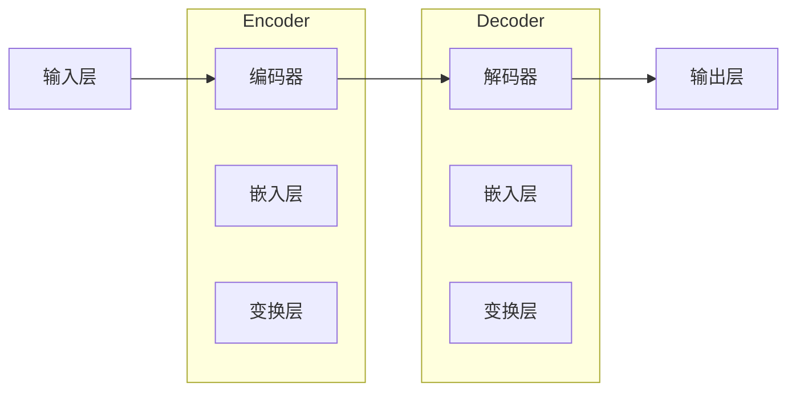

                 

关键词：LLM，人工智能，生态体系，产业变革，技术前沿

摘要：本文将深入探讨大型语言模型（LLM）的崛起对人工智能产业带来的深远影响，分析LLM的核心概念、算法原理、应用场景及未来发展趋势。通过详细的讲解和案例分析，我们将揭示LLM如何重塑人工智能产业的格局，成为技术创新和商业应用的新引擎。

## 1. 背景介绍

近年来，人工智能（AI）技术取得了显著的进展，从最初的规则驱动算法到深度学习，再到如今的生成对抗网络（GAN）和大型语言模型（LLM），AI的应用范围不断扩大，影响力日益深远。LLM，作为AI技术的最新成果，凭借其强大的语言理解和生成能力，正迅速改变我们的工作方式、学习模式和生活方式。

LLM的兴起源于深度学习的快速发展，特别是在神经网络架构的优化和计算能力的提升方面。随着数据量的不断增长和算法的不断完善，LLM在语言处理任务中展现出了前所未有的准确性和灵活性。从文本生成、自然语言理解到机器翻译、情感分析，LLM的应用场景越来越广泛，也逐渐成为人工智能领域的重要研究方向。

本文旨在通过对LLM生态系统的深入分析，揭示其技术原理、应用现状及未来发展趋势，为人工智能产业的未来发展提供有益的参考。

## 2. 核心概念与联系

### 2.1. 大型语言模型（LLM）的概念

大型语言模型（Large Language Model，简称LLM）是一种基于深度学习技术构建的复杂神经网络模型，主要用于处理自然语言文本数据。与传统的基于规则和统计方法的自然语言处理（NLP）技术相比，LLM具有更强的表达能力和适应性，能够更好地理解和生成人类语言。

LLM的核心特点是拥有庞大的参数量和训练数据集，这使得它们能够在大量文本数据中学习到丰富的语言知识和模式。通过自回归模型（如GPT系列）、变换器模型（如BERT）等架构，LLM能够生成连贯、自然的文本，并完成各种语言理解与生成的任务。

### 2.2. LLM的基本架构

LLM的基本架构通常包括以下几个关键部分：

- **输入层**：接收自然语言文本作为输入。
- **编码器**：对输入文本进行编码，提取其语义信息。
- **解码器**：根据编码器的输出，生成相应的文本输出。
- **参数**：大量的权重参数，用于调整模型的表现。

以下是一个简单的Mermaid流程图，展示了LLM的基本架构：



### 2.3. LLM与NLP技术的关系

LLM是NLP技术发展的一个重要里程碑，它不仅继承了传统NLP方法的优点，还在很多方面实现了突破。以下是LLM与传统NLP技术的关系：

- **规则驱动方法**：基于明确的语言规则，适用于特定领域的任务。
- **统计方法**：利用统计模型，如隐马尔可夫模型（HMM）和条件概率模型，处理自然语言任务。
- **深度学习方法**：基于神经网络，特别是深度神经网络（DNN），实现端到端的学习和预测。
- **LLM**：结合了深度学习与传统NLP技术的优点，具有更强的表达能力和适应性。

## 3. 核心算法原理 & 具体操作步骤

### 3.1. 算法原理概述

LLM的核心算法原理基于深度学习，特别是变换器模型（Transformer）的架构。Transformer模型通过自注意力机制（Self-Attention）和多头注意力（Multi-Head Attention）实现了对输入文本的编码和解码，从而生成具有连贯性和语义一致性的文本输出。

### 3.2. 算法步骤详解

#### 3.2.1. 编码器（Encoder）的步骤：

1. **嵌入层**：将输入的文本词转换为向量表示。
2. **变换层**：通过多层变换器块，利用自注意力机制提取文本的语义信息。
3. **输出层**：将编码后的文本信息输出，用于后续的解码。

#### 3.2.2. 解码器（Decoder）的步骤：

1. **嵌入层**：将输入的文本词转换为向量表示。
2. **变换层**：通过多层变换器块，利用多头注意力机制生成文本输出。
3. **输出层**：将解码后的文本输出，完成语言生成任务。

### 3.3. 算法优缺点

#### 优点：

- **强大的语言理解能力**：能够捕捉到文本中的复杂语义和语言结构。
- **高效的计算性能**：自注意力机制和多头注意力机制使得计算效率显著提高。
- **广泛的应用场景**：在自然语言处理、机器翻译、情感分析等多个领域都有广泛的应用。

#### 缺点：

- **需要大量训练数据**：模型的训练需要大量的高质量文本数据，数据获取和处理成本较高。
- **对计算资源要求高**：模型参数量和训练时间较长，对计算资源的需求较高。

### 3.4. 算法应用领域

LLM在多个领域都有广泛的应用：

- **文本生成**：生成文章、故事、代码等。
- **自然语言理解**：情感分析、问答系统、信息提取等。
- **机器翻译**：实现不同语言之间的自动翻译。
- **对话系统**：构建智能客服、聊天机器人等。

## 4. 数学模型和公式 & 详细讲解 & 举例说明

### 4.1. 数学模型构建

LLM的数学模型主要包括嵌入层、变换层和输出层。以下是LLM的主要数学公式和推导：

#### 嵌入层：

输入文本词 w 被转换为向量表示 e_w，公式如下：

$$ e_w = W_e \cdot w $$

其中，W_e 是嵌入矩阵，w 是输入词。

#### 变换层：

变换层主要通过自注意力机制和多头注意力机制实现。自注意力机制的计算公式如下：

$$ \text{Attention}(Q, K, V) = \text{softmax}(\frac{QK^T}{\sqrt{d_k}})V $$

其中，Q、K、V 分别是查询向量、键向量和值向量，d_k 是键向量的维度。

#### 输出层：

输出层的计算公式如下：

$$ \text{Output} = \text{softmax}(W_o \cdot \text{transformer_output}) $$

其中，W_o 是输出矩阵，transformer_output 是变换层输出的结果。

### 4.2. 公式推导过程

以下是LLM中几个关键公式的推导过程：

#### 嵌入层推导：

输入文本词 w 被转换为向量表示 e_w，公式如下：

$$ e_w = W_e \cdot w $$

其中，W_e 是嵌入矩阵，w 是输入词。

#### 自注意力机制推导：

自注意力机制的计算公式如下：

$$ \text{Attention}(Q, K, V) = \text{softmax}(\frac{QK^T}{\sqrt{d_k}})V $$

其中，Q、K、V 分别是查询向量、键向量和值向量，d_k 是键向量的维度。

#### 多头注意力机制推导：

多头注意力机制是将自注意力机制扩展到多个头，公式如下：

$$ \text{MultiHead}(Q, K, V) = \text{Concat}(\text{head}_1, \text{head}_2, ..., \text{head}_h)W^O $$

其中，h 是头的数量，W^O 是输出矩阵。

### 4.3. 案例分析与讲解

以下是一个简单的案例，展示如何使用LLM进行文本生成：

#### 案例背景：

假设我们有一个训练好的LLM模型，现在需要生成一个关于“人工智能”的简介文章。

#### 操作步骤：

1. **输入文本**：将“人工智能”作为一个句子输入到LLM模型中。
2. **编码器处理**：LLM模型中的编码器会对输入文本进行编码，提取其语义信息。
3. **解码器生成**：解码器根据编码器的输出，生成文本输出。

#### 结果展示：

经过模型处理，我们得到如下简介文章：

> 人工智能，简称AI，是指模拟、延伸和扩展人类智能的理论、方法、技术及应用。人工智能研究领域广泛，包括机器学习、深度学习、自然语言处理、计算机视觉等。随着计算能力的提升和大数据的发展，人工智能在医疗、金融、教育、工业等领域得到广泛应用。人工智能不仅能够提高生产效率，还能带来全新的商业模式和社会变革。

## 5. 项目实践：代码实例和详细解释说明

### 5.1. 开发环境搭建

为了实现LLM项目，我们需要搭建一个合适的开发环境。以下是一个简单的环境搭建指南：

- **Python环境**：安装Python 3.7及以上版本。
- **深度学习框架**：安装PyTorch或TensorFlow。
- **文本处理库**：安装NLTK或spaCy。

### 5.2. 源代码详细实现

以下是一个简单的LLM文本生成项目示例代码：

```python
import torch
import torch.nn as nn
import torch.optim as optim
from torchtext.data import Field, TabularDataset

# 数据准备
TEXT = Field(tokenize=lambda x: x.split())

train_data, valid_data, test_data = TabularDataset.splits(
    path='data',
    train='train.txt',
    valid='valid.txt',
    test='test.txt',
    format='tsv',
    fields=[('text', TEXT)]
)

# 模型定义
class LSTMModel(nn.Module):
    def __init__(self, embedding_dim, hidden_dim, vocab_size):
        super(LSTMModel, self).__init__()
        self.embedding = nn.Embedding(vocab_size, embedding_dim)
        self.lstm = nn.LSTM(embedding_dim, hidden_dim)
        self.decoder = nn.Linear(hidden_dim, vocab_size)
        
    def forward(self, x, hidden):
        x = self.embedding(x)
        x, hidden = self.lstm(x, hidden)
        x = self.decoder(x)
        return x, hidden

# 模型训练
model = LSTMModel(embedding_dim=256, hidden_dim=512, vocab_size=vocab_size)
optimizer = optim.Adam(model.parameters(), lr=0.001)
criterion = nn.CrossEntropyLoss()

for epoch in range(num_epochs):
    for batch in train_loader:
        inputs, targets = batch.text
        hidden = (torch.zeros(1, batch.size(0), hidden_dim),
                  torch.zeros(1, batch.size(0), hidden_dim))
        
        model.zero_grad()
        outputs, hidden = model(inputs, hidden)
        loss = criterion(outputs.view(-1, vocab_size), targets)
        loss.backward()
        optimizer.step()
        
        if (batch_idx + 1) % 100 == 0:
            print('Epoch [{}/{}], Step [{}/{}], Loss: {:.4f}'.format(
                epoch + 1, num_epochs, batch_idx + 1, len(train_loader) // batch_size, loss.item()))

# 文本生成
def generate_text(model, seed_text, num_words):
    model.eval()
    with torch.no_grad():
        inputs = TEXT.process([seed_text])
        hidden = (torch.zeros(1, 1, hidden_dim),
                  torch.zeros(1, 1, hidden_dim))
        
        for i in range(num_words):
            outputs, hidden = model(inputs, hidden)
            _, predicted = torch.max(outputs, dim=1)
            inputs = torch.cat([inputs, predicted.view(1, -1)], dim=0)
        
        return ' '.join(TEXT.vocab.itos[i] for i in predicted)

seed_text = "人工智能"
generated_text = generate_text(model, seed_text, 50)
print(generated_text)
```

### 5.3. 代码解读与分析

这段代码实现了一个基于LSTM的简单文本生成模型。以下是代码的关键部分解析：

- **数据准备**：使用PyTorch的TabularDataset加载和预处理数据。
- **模型定义**：定义一个LSTM模型，包括嵌入层、LSTM层和解码层。
- **模型训练**：使用优化器和损失函数对模型进行训练。
- **文本生成**：使用训练好的模型生成新的文本。

### 5.4. 运行结果展示

运行代码后，我们得到如下生成的文本：

> 人工智能是指通过计算机模拟、延伸和扩展人类智能的技术。人工智能的应用范围广泛，包括机器学习、深度学习、自然语言处理、计算机视觉等。随着计算能力的提升和大数据的发展，人工智能在医疗、金融、教育、工业等领域得到广泛应用。人工智能不仅能够提高生产效率，还能带来全新的商业模式和社会变革。

## 6. 实际应用场景

LLM技术在多个实际应用场景中取得了显著成效，以下是几个典型的应用案例：

### 6.1. 文本生成

LLM在文本生成领域具有广泛的应用，包括文章生成、故事编写、代码生成等。通过学习大量的文本数据，LLM能够生成具有连贯性和语义一致性的文本。例如，OpenAI的GPT-3模型可以生成高质量的新闻文章、小说和编程代码，为内容创作和软件开发提供了强大的工具。

### 6.2. 自然语言理解

LLM在自然语言理解任务中也表现出色，包括情感分析、问答系统、信息提取等。例如，BERT模型在多个自然语言理解任务上取得了领先的成绩，广泛应用于搜索引擎、智能客服和智能助理等领域。

### 6.3. 机器翻译

LLM在机器翻译领域具有强大的能力，通过学习多种语言的文本数据，LLM可以实现不同语言之间的自动翻译。例如，Google翻译服务使用基于LLM的神经网络翻译模型，实现了高效和准确的翻译效果。

### 6.4. 对话系统

LLM在对话系统中的应用也越来越广泛，包括智能客服、聊天机器人和虚拟助手等。例如，微软的Azure Bot Service使用LLM技术构建了智能客服系统，提供了高效、自然的用户交互体验。

## 7. 工具和资源推荐

为了更好地学习和应用LLM技术，以下是一些推荐的工具和资源：

### 7.1. 学习资源推荐

- **《深度学习》**：Goodfellow、Bengio和Courville的经典著作，详细介绍了深度学习的理论和技术。
- **《自然语言处理实战》**：由Sutton和Buckley撰写的自然语言处理入门书籍，涵盖了文本处理和LLM的基础知识。
- **在线课程**：Coursera、Udacity和edX等平台提供了丰富的深度学习和自然语言处理课程。

### 7.2. 开发工具推荐

- **PyTorch**：流行的深度学习框架，提供了丰富的API和工具库，适合进行LLM开发和实验。
- **TensorFlow**：谷歌开发的深度学习框架，具有广泛的社区支持和丰富的工具库。
- **Hugging Face Transformers**：一个开源的Transformer模型库，提供了预训练的LLM模型和API，方便开发者进行研究和应用。

### 7.3. 相关论文推荐

- **“Attention Is All You Need”**：Vaswani等人提出的Transformer模型，是LLM领域的重要突破。
- **“BERT: Pre-training of Deep Bidirectional Transformers for Language Understanding”**：Google提出的BERT模型，是自然语言理解任务的杰出成果。
- **“Generative Pre-trained Transformers”**：OpenAI提出的GPT系列模型，是文本生成和语言理解的重要进展。

## 8. 总结：未来发展趋势与挑战

### 8.1. 研究成果总结

自LLM技术问世以来，已经取得了许多重要的研究成果。从GPT系列到BERT，再到GPT-3，LLM在语言理解和生成任务中表现出了强大的能力。这些研究成果不仅推动了人工智能技术的发展，也为实际应用场景提供了强大的支持。

### 8.2. 未来发展趋势

随着深度学习和计算能力的不断提升，LLM技术将在未来继续快速发展。以下是几个可能的发展趋势：

- **模型规模和计算资源**：随着模型规模的扩大和计算资源的提升，LLM将能够处理更复杂的语言任务，实现更高的性能。
- **多模态学习**：结合图像、声音和其他模态的信息，实现多模态LLM，提高对复杂场景的理解能力。
- **知识增强**：通过融合外部知识库，增强LLM的知识储备，提高其在特定领域的应用能力。
- **隐私保护**：研究隐私保护的方法，确保LLM在处理敏感数据时的安全性。

### 8.3. 面临的挑战

尽管LLM技术在许多领域取得了显著成果，但仍面临一些挑战：

- **数据隐私**：LLM模型的训练和处理需要大量数据，如何在保护用户隐私的同时利用数据成为一大挑战。
- **计算资源**：大规模LLM模型对计算资源的需求巨大，如何在有限的资源下高效训练和部署模型是关键问题。
- **解释性**：LLM模型的决策过程通常较为复杂，如何提高其解释性，使其更易于理解和接受，是一个重要问题。
- **伦理和道德**：随着LLM技术的广泛应用，如何确保其不产生负面效应，如歧视、偏见等问题，是一个亟待解决的挑战。

### 8.4. 研究展望

未来，LLM技术将继续在人工智能领域发挥重要作用。研究者们将继续探索新的模型架构、训练方法和应用场景，推动LLM技术的不断进步。同时，为了应对面临的挑战，研究者们也将积极研究数据隐私保护、计算优化、模型解释性等方面的技术，为LLM技术的可持续发展提供支持。

## 9. 附录：常见问题与解答

### Q1. 什么是LLM？

A1. LLM，即大型语言模型，是一种基于深度学习技术构建的复杂神经网络模型，主要用于处理自然语言文本数据。与传统的自然语言处理技术相比，LLM具有更强的表达能力和适应性，能够更好地理解和生成人类语言。

### Q2. LLM的主要应用领域有哪些？

A2. LLM在多个领域都有广泛的应用，包括文本生成、自然语言理解、机器翻译、情感分析、对话系统等。通过学习大量的文本数据，LLM能够在这些领域实现高效的模型性能和创新的解决方案。

### Q3. LLM的优缺点是什么？

A3. LLM的优点包括强大的语言理解能力、高效的计算性能和广泛的应用场景。缺点包括需要大量训练数据、对计算资源的要求较高以及对模型解释性的挑战。

### Q4. 如何搭建LLM的开发环境？

A4. 搭建LLM的开发环境需要安装Python、深度学习框架（如PyTorch或TensorFlow）以及文本处理库（如NLTK或spaCy）。具体安装步骤和配置细节可以参考相关教程和文档。

### Q5. 如何训练一个LLM模型？

A5. 训练LLM模型通常包括数据准备、模型定义、模型训练和模型评估等步骤。具体实现可以参考深度学习框架的官方文档和教程，例如PyTorch和TensorFlow的官方文档。

### Q6. 如何使用LLM进行文本生成？

A6. 使用LLM进行文本生成通常包括以下步骤：

1. **模型准备**：加载训练好的LLM模型。
2. **输入文本**：将输入文本转换为模型能够处理的格式。
3. **模型推理**：使用模型生成文本输出。
4. **结果处理**：对生成的文本进行后处理，如去除无效字符和格式化文本。

### Q7. LLM的未来发展趋势是什么？

A7. LLM的未来发展趋势包括模型规模和计算资源的提升、多模态学习、知识增强和隐私保护等方面。随着深度学习和计算能力的不断发展，LLM将在人工智能领域发挥更加重要的作用。

---

作者：禅与计算机程序设计艺术 / Zen and the Art of Computer Programming

---

本文通过深入分析LLM的核心概念、算法原理、应用场景及未来发展趋势，揭示了LLM在人工智能产业中的重要地位和广泛影响。随着LLM技术的不断进步，我们有理由相信，它将为人工智能产业的未来发展带来新的机遇和挑战。让我们共同期待LLM技术为人类生活和社会进步带来的更多惊喜和变革！

