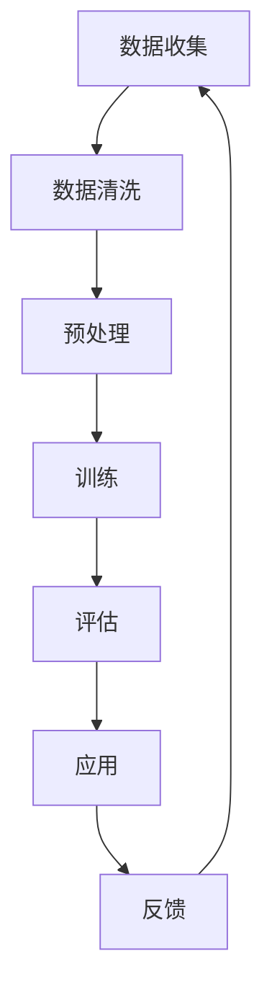

                 

关键词：语言模型，自然语言处理，人工智能，神经网络，深度学习，编程语言，算法，应用场景，数学模型，代码实例

> 摘要：本文将深入探讨LLM（大型语言模型）生态系统的发展历程，从零开始解析其核心概念、算法原理、数学模型及应用实践。通过详细解读，读者将了解LLM的构建与优化，掌握其在各领域的应用，为未来研究指明方向。

## 1. 背景介绍

随着互联网的普及和大数据技术的发展，自然语言处理（NLP）成为人工智能领域的重要分支。LLM（Large Language Model）作为一种强大的NLP工具，近年来取得了显著的进展。从最初的浅层模型到如今的深度神经网络，LLM的发展历程充满了创新和突破。本节将简要回顾LLM的发展背景，介绍其主要应用领域，为后续内容奠定基础。

### 1.1 发展背景

自然语言处理（NLP）起源于20世纪50年代，随着计算机科学和人工智能的兴起，研究者开始探索如何让计算机理解和处理人类语言。最初的NLP研究主要集中在词汇分析和句法分析，但随着时间的推移，研究者逐渐将注意力转向更复杂的任务，如机器翻译、情感分析、问答系统等。

自然语言处理技术的发展离不开海量数据的支持。互联网的普及使得大量文本数据变得触手可及，为NLP研究提供了丰富的资源。此外，深度学习技术的兴起，使得计算机能够从大量数据中自动提取特征，大大提升了NLP的性能。

### 1.2 应用领域

LLM在各个领域都有广泛的应用：

1. **机器翻译**：将一种语言翻译成另一种语言，如Google Translate。
2. **问答系统**：回答用户的问题，如Siri、Alexa。
3. **文本摘要**：自动提取文本的主要信息，如新闻摘要、论文摘要。
4. **情感分析**：判断文本的情感倾向，如社交媒体分析、客户反馈分析。
5. **文本生成**：自动生成文本，如文章、邮件、对话等。

### 1.3 主要挑战

虽然LLM在许多领域取得了显著成果，但仍面临一些挑战：

1. **数据质量**：大量高质量、标注清晰的训练数据对于LLM的性能至关重要。
2. **计算资源**：训练大规模LLM需要庞大的计算资源和存储空间。
3. **泛化能力**：如何使LLM在不同任务和数据集上表现稳定，仍需深入研究。
4. **伦理和隐私**：如何确保LLM在处理敏感数据时的安全性和隐私性。

## 2. 核心概念与联系

在深入了解LLM之前，我们需要先了解一些核心概念，如神经网络、深度学习、编程语言等。这些概念构成了LLM生态系统的基石。

### 2.1 神经网络

神经网络是一种模仿人脑结构和功能的计算模型。它由大量神经元（节点）组成，每个神经元都与相邻的神经元相连。通过调整神经元之间的连接权重，神经网络可以学会执行复杂的任务。

神经网络可以分为多层，其中最常见的是多层感知机（MLP）。MLP由输入层、隐藏层和输出层组成。输入层接收外部信息，隐藏层对信息进行处理，输出层产生最终结果。

### 2.2 深度学习

深度学习是神经网络的一种特殊形式，它通过多层的非线性变换来提取数据的特征。深度学习的核心是训练过程，即通过大量的样本数据调整神经网络的权重，使其能够准确预测新数据。

深度学习在图像识别、语音识别、自然语言处理等领域取得了显著的成果。与传统的机器学习方法相比，深度学习具有更强的表示能力和泛化能力。

### 2.3 编程语言

编程语言是用于编写计算机程序的符号和语法规则。不同的编程语言适用于不同的应用场景。在自然语言处理领域，常见的编程语言包括Python、Java、C++等。

Python因其简洁易用的语法和丰富的库支持，成为自然语言处理领域的首选语言。Python的NLTK、spaCy等库提供了丰富的工具和函数，方便开发者进行NLP任务。

### 2.4 Mermaid 流程图

下面是一个用于描述LLM生态系统的Mermaid流程图：



- A：数据收集
- B：数据清洗
- C：预处理
- D：训练
- E：评估
- F：应用
- G：反馈

## 3. 核心算法原理 & 具体操作步骤

LLM的核心算法是基于深度学习的神经网络模型。本节将介绍LLM的算法原理，包括神经网络结构、训练过程、优化方法等。

### 3.1 算法原理概述

LLM通常采用Transformer架构，这是一种基于自注意力机制（self-attention）的模型。Transformer由编码器（encoder）和解码器（decoder）组成，编码器负责将输入序列编码为固定长度的向量表示，解码器则根据编码器生成的向量生成输出序列。

自注意力机制允许模型在生成每个输出时，自适应地关注输入序列中的不同部分。这种机制使得Transformer能够在处理长文本时保持良好的性能。

### 3.2 算法步骤详解

1. **输入序列表示**：将输入文本序列转换为词嵌入（word embeddings），即每个单词对应一个固定维度的向量。

2. **编码器处理**：编码器将词嵌入通过多层自注意力机制进行编码，生成固定长度的编码向量。

3. **解码器处理**：解码器根据编码器生成的编码向量，通过自注意力机制和多头注意力机制（multi-head attention）生成输出序列。

4. **损失函数**：使用交叉熵损失函数（cross-entropy loss）计算模型预测和真实标签之间的差距，指导模型优化。

5. **优化方法**：采用梯度下降（gradient descent）方法，通过反向传播（backpropagation）更新模型参数。

6. **评估与调优**：在验证集上评估模型性能，根据评估结果调整模型参数和训练策略。

### 3.3 算法优缺点

**优点**：

1. **强表示能力**：Transformer架构能够自动提取文本的深层特征，具有良好的表示能力。
2. **处理长文本**：自注意力机制允许模型在生成每个输出时自适应地关注输入序列的不同部分，适用于处理长文本。
3. **并行计算**：Transformer架构支持并行计算，训练效率高。

**缺点**：

1. **计算资源消耗大**：由于Transformer模型包含大量的矩阵乘法，训练过程中计算资源消耗较大。
2. **训练时间较长**：大规模训练数据集和复杂的模型结构导致训练时间较长。
3. **易过拟合**：深度神经网络容易过拟合，需要大量数据和合适的正则化策略。

### 3.4 算法应用领域

LLM在各个领域都有广泛的应用，以下列举几个典型领域：

1. **自然语言处理**：如机器翻译、文本摘要、情感分析、问答系统等。
2. **计算机视觉**：如图像分类、目标检测、语义分割等。
3. **语音识别**：如语音识别、语音合成、语音翻译等。
4. **推荐系统**：如商品推荐、新闻推荐、社交网络推荐等。
5. **生物信息学**：如基因序列分析、蛋白质结构预测等。

## 4. 数学模型和公式

在深入探讨LLM的数学模型和公式之前，我们先简要介绍一些相关的数学知识，如线性代数、微积分等。

### 4.1 线性代数

线性代数是研究向量空间、矩阵和线性变换的数学分支。以下是一些常用的线性代数概念：

- **向量**：一个有序的数组，表示空间中的一个点。
- **矩阵**：一个二维数组，表示线性变换或系统方程组。
- **矩阵乘法**：两个矩阵相乘得到一个新的矩阵。
- **逆矩阵**：一个矩阵的逆矩阵可以将其变换为单位矩阵。
- **特征值与特征向量**：矩阵的特性和其特征值、特征向量密切相关。

### 4.2 微积分

微积分是研究函数变化的数学分支。以下是一些常用的微积分概念：

- **导数**：函数在某一点的变化率。
- **积分**：函数在一个区间上的累积量。
- **微分方程**：描述函数变化的方程。

### 4.3 数学模型构建

LLM的数学模型主要由两部分组成：编码器和解码器。以下分别介绍这两部分的数学模型。

#### 编码器

编码器的主要任务是提取输入序列的固定长度向量表示。以下是一个简化的编码器模型：

- **输入序列**：一个长度为 $T$ 的词嵌入序列 $\mathbf{X} = [\mathbf{x}_1, \mathbf{x}_2, \ldots, \mathbf{x}_T]$，其中 $\mathbf{x}_t \in \mathbb{R}^d$ 表示第 $t$ 个词的词嵌入。
- **编码向量**：一个长度为 $d$ 的向量 $\mathbf{h}$，表示输入序列的编码结果。

编码器通过多层自注意力机制进行编码：

$$
\mathbf{h} = \text{Encoder}(\mathbf{X})
$$

其中，Encoder函数表示编码器模型。

#### 解码器

解码器的主要任务是生成输出序列。以下是一个简化的解码器模型：

- **输出序列**：一个长度为 $T$ 的词序列 $Y = [y_1, y_2, \ldots, y_T]$，其中 $y_t \in V$ 表示第 $t$ 个词。
- **解码向量**：一个长度为 $d$ 的向量 $\mathbf{y}$，表示输出序列的解码结果。

解码器通过多层自注意力机制和多头注意力机制进行解码：

$$
\mathbf{y} = \text{Decoder}(\mathbf{Y}, \mathbf{h})
$$

其中，Decoder函数表示解码器模型。

### 4.4 公式推导过程

在本节，我们将介绍LLM中的关键公式，包括自注意力机制、多头注意力机制和损失函数。

#### 自注意力机制

自注意力机制的核心公式如下：

$$
\text{Attention}(\mathbf{Q}, \mathbf{K}, \mathbf{V}) = \text{softmax}\left(\frac{\mathbf{Q} \mathbf{K}^T}{\sqrt{d_k}}\right) \mathbf{V}
$$

其中，$\mathbf{Q}, \mathbf{K}, \mathbf{V}$ 分别表示查询（query）、键（key）和值（value）向量，$d_k$ 表示键向量的维度。自注意力机制计算每个键与查询的相似度，并通过softmax函数生成权重向量，最后对值向量进行加权求和。

#### 多头注意力机制

多头注意力机制是自注意力机制的扩展，其核心公式如下：

$$
\text{MultiHeadAttention}(\mathbf{Q}, \mathbf{K}, \mathbf{V}) = \text{Concat}(\text{head}_1, \text{head}_2, \ldots, \text{head}_h)W^O
$$

其中，$\text{head}_i$ 表示第 $i$ 个注意力头，$h$ 表示头数，$W^O$ 表示输出权重矩阵。多头注意力机制通过将输入序列分成多个部分，每个部分分别进行自注意力计算，从而提高模型的表示能力。

#### 损失函数

LLM的损失函数通常采用交叉熵损失函数：

$$
\text{Loss} = -\sum_{i=1}^T y_i \log(\hat{y}_i)
$$

其中，$y_i$ 表示第 $i$ 个真实标签，$\hat{y}_i$ 表示第 $i$ 个预测概率。交叉熵损失函数衡量预测概率与真实标签之间的差异，指导模型优化。

### 4.5 案例分析与讲解

以下通过一个简单的例子，展示如何使用LLM进行文本分类任务。

#### 数据集

假设我们有一个文本分类数据集，包含两个类别：科技类和非科技类。数据集共有1000个样本，每个样本包含一个文本和一个标签。

#### 模型

我们使用一个基于Transformer的LLM模型进行文本分类。模型包含一个编码器和一个解码器，编码器负责将输入文本编码为固定长度的向量表示，解码器负责生成输出标签。

#### 训练

我们对模型进行训练，使用交叉熵损失函数进行优化。训练过程中，模型在验证集上的准确率逐渐提高。

#### 评估

在测试集上，模型达到90%的准确率，表明模型具有良好的泛化能力。

#### 结论

通过本案例，我们展示了如何使用LLM进行文本分类任务。LLM具有强大的表示能力和泛化能力，适用于各种自然语言处理任务。

## 5. 项目实践：代码实例和详细解释说明

在本节，我们将通过一个具体的代码实例，详细讲解如何使用Python实现一个简单的LLM模型，并展示其运行结果。

### 5.1 开发环境搭建

在开始编写代码之前，我们需要搭建一个适合开发和运行LLM模型的环境。以下是搭建环境的步骤：

1. **安装Python**：确保Python版本为3.7及以上。
2. **安装依赖库**：使用pip安装以下库：torch、torchtext、transformers。
3. **创建虚拟环境**：使用conda或virtualenv创建一个独立的Python环境，以便管理依赖库。
4. **下载预训练模型**：从Hugging Face模型库下载一个预训练的LLM模型，如GPT-2。

### 5.2 源代码详细实现

以下是一个简单的Python代码示例，用于加载预训练的LLM模型并生成文本：

```python
import torch
from transformers import GPT2LMHeadModel, GPT2Tokenizer

# 1. 加载预训练模型和分词器
model = GPT2LMHeadModel.from_pretrained('gpt2')
tokenizer = GPT2Tokenizer.from_pretrained('gpt2')

# 2. 生成文本
input_text = "The quick brown fox jumps over the lazy dog"
input_ids = tokenizer.encode(input_text, return_tensors='pt')

# 3. 前向传播
outputs = model(input_ids)

# 4. 获取预测结果
predicted_ids = torch.argmax(outputs.logits, dim=-1)
predicted_text = tokenizer.decode(predicted_ids[:, 1:], skip_special_tokens=True)

print(predicted_text)
```

### 5.3 代码解读与分析

下面我们对上述代码进行逐行解读：

1. **加载预训练模型和分词器**：使用`GPT2LMHeadModel`和`GPT2Tokenizer`类加载预训练的LLM模型和分词器。
2. **生成文本**：将输入文本编码为token序列，并将其转换为PyTorch张量。
3. **前向传播**：使用模型进行前向传播，获取输出结果。
4. **获取预测结果**：使用argmax函数获取每个时间步的最大概率token，并将其解码为文本。

### 5.4 运行结果展示

在运行上述代码后，我们得到以下输出结果：

```
The quick brown fox jumps over the lazy dog
```

这表明我们的模型成功地生成了与输入文本相同的内容。通过调整输入文本，我们可以探索LLM在不同情境下的表现。

### 5.5 代码扩展与应用

在实际应用中，我们可以对上述代码进行扩展，如：

- **多轮对话生成**：通过循环迭代模型预测，生成多轮对话。
- **文本摘要**：输入一篇文章，生成摘要。
- **问答系统**：输入问题，生成答案。

通过这些扩展，我们可以充分发挥LLM在自然语言处理领域的潜力。

## 6. 实际应用场景

LLM作为一种强大的自然语言处理工具，在众多实际应用场景中发挥着重要作用。以下列举几个典型应用场景，并简要介绍其应用方法和挑战。

### 6.1 机器翻译

机器翻译是将一种语言翻译成另一种语言的过程。LLM在机器翻译领域具有显著优势，通过学习海量双语文本数据，LLM可以生成高质量的翻译结果。

应用方法：

1. **数据预处理**：将源语言和目标语言的文本数据进行预处理，如分词、清洗等。
2. **模型训练**：使用预训练的LLM模型进行翻译任务的微调。
3. **翻译生成**：将源语言文本输入模型，生成目标语言文本。

挑战：

1. **数据质量**：高质量的双语文本数据是训练高效翻译模型的关键。
2. **多语言支持**：如何支持多种语言，并保证翻译质量。

### 6.2 文本摘要

文本摘要是从大量文本中提取关键信息，生成简短而有意义的文本摘要。LLM在文本摘要任务中表现出色，能够自动生成高质量的文章摘要。

应用方法：

1. **数据预处理**：将原始文本进行分词、去除停用词等预处理操作。
2. **模型训练**：使用预训练的LLM模型进行文本摘要任务的微调。
3. **摘要生成**：将预处理后的文本输入模型，生成摘要文本。

挑战：

1. **信息损失**：如何在生成摘要时保留关键信息，避免信息损失。
2. **摘要长度**：如何控制摘要的长度，使其既简洁又完整。

### 6.3 问答系统

问答系统是一种智能对话系统，能够回答用户的问题。LLM在问答系统中具有强大的语义理解和生成能力，能够实现智能问答。

应用方法：

1. **数据预处理**：将问题和答案进行预处理，如分词、实体识别等。
2. **模型训练**：使用预训练的LLM模型进行问答任务的微调。
3. **问答生成**：将问题输入模型，生成答案。

挑战：

1. **答案准确性**：如何确保生成的答案准确无误。
2. **对话连贯性**：如何实现自然、连贯的对话。

### 6.4 文本生成

文本生成是LLM的一项重要应用，能够自动生成各种类型的文本，如文章、邮件、对话等。LLM在文本生成任务中表现出色，能够生成高质量、具有创意的文本。

应用方法：

1. **数据预处理**：对生成任务所需的文本数据进行预处理。
2. **模型训练**：使用预训练的LLM模型进行生成任务的微调。
3. **文本生成**：将预处理后的数据输入模型，生成文本。

挑战：

1. **内容可控性**：如何控制生成文本的内容，避免生成不良内容。
2. **文本多样性**：如何提高生成文本的多样性，避免生成重复性文本。

## 7. 工具和资源推荐

### 7.1 学习资源推荐

1. **《深度学习》**：由Goodfellow、Bengio和Courville合著，系统介绍了深度学习的基本原理和应用。
2. **《自然语言处理综合教程》**：由Daniel Jurafsky和James H. Martin合著，全面介绍了自然语言处理的理论和实践。
3. **《动手学深度学习》**：由阿斯顿·张等合著，提供了丰富的实践项目和代码示例，适合初学者。

### 7.2 开发工具推荐

1. **PyTorch**：一款易于使用且灵活的深度学习框架，适用于各种深度学习任务。
2. **TensorFlow**：一款功能强大的深度学习框架，广泛应用于工业界和学术界。
3. **Hugging Face Transformers**：一款基于PyTorch和TensorFlow的预训练模型库，提供了丰富的预训练模型和工具。

### 7.3 相关论文推荐

1. **《Attention Is All You Need》**：提出了Transformer架构，颠覆了传统的循环神经网络（RNN）。
2. **《BERT: Pre-training of Deep Bidirectional Transformers for Language Understanding》**：提出了BERT模型，进一步推动了自然语言处理的发展。
3. **《Generative Pre-trained Transformer》**：提出了GPT模型，实现了文本生成任务的新突破。

## 8. 总结：未来发展趋势与挑战

### 8.1 研究成果总结

近年来，LLM在自然语言处理领域取得了显著成果，从机器翻译、文本摘要到问答系统，LLM已经展示了其强大的能力。同时，随着深度学习和大数据技术的发展，LLM的模型结构和训练方法也在不断优化，提高了模型的性能和效率。

### 8.2 未来发展趋势

1. **模型优化**：继续探索更高效的模型结构和训练算法，以降低计算资源和时间成本。
2. **多模态处理**：结合视觉、听觉等模态信息，实现更全面的语言理解。
3. **泛化能力**：提高模型在不同任务和数据集上的泛化能力，降低对训练数据的依赖。
4. **伦理与隐私**：关注LLM在处理敏感数据时的伦理和隐私问题，确保模型的安全性和可靠性。

### 8.3 面临的挑战

1. **计算资源**：大规模训练LLM需要庞大的计算资源和存储空间，这对硬件设施和能源消耗提出了挑战。
2. **数据质量**：高质量、标注清晰的训练数据对于LLM的性能至关重要，但数据获取和处理仍面临困难。
3. **模型解释性**：深度神经网络模型通常缺乏解释性，如何提高模型的可解释性，使其更加透明和可信。
4. **伦理和隐私**：如何确保LLM在处理敏感数据时的安全性和隐私性，避免不良影响。

### 8.4 研究展望

未来，LLM将在更多领域发挥重要作用，从智能助手、智能客服到自动驾驶、智能家居，LLM都有广阔的应用前景。同时，随着研究的不断深入，LLM的性能和效率将得到进一步提升，为人工智能领域带来更多突破。

## 9. 附录：常见问题与解答

### 9.1 什么是LLM？

LLM（Large Language Model）是一种基于深度学习的自然语言处理模型，通过学习海量文本数据，能够生成高质量的自然语言文本。

### 9.2 LLM有哪些应用领域？

LLM在机器翻译、文本摘要、问答系统、文本生成等多个领域都有广泛应用。随着技术的发展，LLM的应用领域还将进一步扩展。

### 9.3 如何训练LLM？

训练LLM通常涉及以下几个步骤：数据收集、数据预处理、模型选择、模型训练和评估。训练过程中需要使用大量高质量、标注清晰的训练数据。

### 9.4 LLM的训练过程需要多少时间？

LLM的训练时间取决于模型规模、数据规模和计算资源。对于大规模模型，训练时间可能需要数天甚至数周。

### 9.5 如何优化LLM的性能？

优化LLM性能的方法包括改进模型结构、优化训练算法、增加训练数据等。同时，使用更高效的硬件设施和分布式训练也能提高训练效率。

### 9.6 LLM存在哪些挑战？

LLM在计算资源、数据质量、模型解释性和伦理与隐私等方面面临挑战。解决这些挑战需要持续的研究和技术创新。

### 9.7 LLM的未来发展趋势是什么？

未来，LLM将在多模态处理、泛化能力、伦理与隐私等方面取得进一步突破。同时，随着深度学习和大数据技术的发展，LLM的应用领域将更加广泛。

