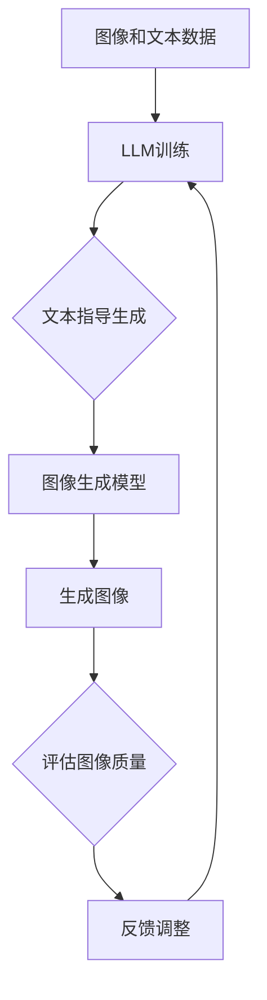

                 

关键词：LLM, 图像生成，速度提升，人工智能，技术发展

摘要：本文将深入探讨大型语言模型（LLM）在图像生成方面的速度提升及其重要意义。首先，我们将回顾LLM的背景和发展历程，然后详细分析其核心算法原理和具体操作步骤，接着介绍其数学模型和公式，并通过实际项目实践展示其应用效果。随后，我们将探讨LLM在图像生成领域的实际应用场景和未来展望。最后，我们将推荐相关学习资源、开发工具和论文，并总结研究现状和未来发展趋势与挑战。

## 1. 背景介绍

### 1.1 大型语言模型（LLM）的起源与发展

大型语言模型（LLM）起源于自然语言处理（NLP）领域，随着深度学习技术的迅猛发展，LLM得到了极大的关注和应用。从最早的基于规则的方法，如句法分析和语义分析，到基于统计模型的方法，如隐马尔可夫模型（HMM）和条件概率模型，再到现代的深度学习模型，如循环神经网络（RNN）和变换器（Transformer），LLM的发展历程展现了人工智能技术的快速进步。

### 1.2 图像生成技术的演进

图像生成技术经历了从简单的模式识别，如像素艺术和线描画，到复杂的深度生成模型，如生成对抗网络（GAN）和变分自编码器（VAE）的发展。这些模型在图像生成方面取得了显著成果，但往往存在生成速度较慢、计算资源消耗大等问题。

### 1.3 LLM与图像生成技术的结合

随着LLM在NLP领域的成功，研究人员开始探索将LLM与图像生成技术相结合，以提升图像生成的速度和质量。LLM能够通过对大量图像和文本数据进行训练，学习到图像和文本之间的关联性，从而生成符合人类审美和语义要求的图像。这种结合为图像生成领域带来了新的发展机遇。

## 2. 核心概念与联系

### 2.1 大型语言模型（LLM）的核心概念

大型语言模型（LLM）是一种基于深度学习的自然语言处理模型，其核心思想是通过大规模数据训练，学习到语言中的语义和结构信息。LLM通常采用Transformer架构，具有层次化的编码器和解码器结构，能够处理长文本序列。

### 2.2 图像生成技术的核心概念

图像生成技术主要包括生成对抗网络（GAN）和变分自编码器（VAE）等深度生成模型。这些模型通过学习输入数据的高斯分布，生成与输入数据相似的图像。GAN由生成器和判别器组成，通过不断博弈来提高生成图像的质量；VAE则通过编码器和解码器将输入数据映射到潜在空间，再从潜在空间中采样生成图像。

### 2.3 LLM与图像生成技术的联系

LLM与图像生成技术的结合主要体现在两个方面：

1. **文本指导生成**：LLM可以学习到图像和文本之间的关联性，通过对图像生成模型进行文本指导，生成符合文本描述的图像。这种方法可以显著提升图像生成的质量和速度。

2. **数据增强**：LLM可以生成大量与训练数据相似的图像，用于数据增强，提高图像生成模型的训练效果和泛化能力。

### 2.4 Mermaid流程图

以下是一个简单的Mermaid流程图，展示了LLM与图像生成技术的结合过程：



## 3. 核心算法原理 & 具体操作步骤

### 3.1 算法原理概述

LLM生成图像的核心算法基于Transformer架构，其主要思想是通过自注意力机制（self-attention）和交叉注意力机制（cross-attention）来捕捉图像和文本之间的关联性。在训练过程中，LLM通过大量图像和文本数据进行训练，学习到图像和文本的语义和结构信息。

### 3.2 算法步骤详解

1. **数据准备**：收集大量的图像和对应文本描述，将图像和文本数据分为训练集和验证集。

2. **模型训练**：使用训练集对LLM进行训练，训练过程中采用自注意力机制和交叉注意力机制来捕捉图像和文本之间的关联性。

3. **文本指导生成**：将文本描述输入到LLM中，通过解码器生成图像序列。

4. **图像生成**：将生成的图像序列输入到图像生成模型（如GAN或VAE），生成最终图像。

5. **评估和优化**：通过评估生成图像的质量和速度，对模型进行优化和调整。

### 3.3 算法优缺点

**优点**：

- **速度提升**：LLM可以显著提升图像生成的速度，减少计算时间。
- **质量提升**：通过文本指导生成，可以生成更符合文本描述的图像，提高图像质量。
- **泛化能力**：LLM可以生成大量与训练数据相似的图像，用于数据增强，提高图像生成模型的泛化能力。

**缺点**：

- **计算资源消耗**：LLM的训练和生成过程需要大量的计算资源，对硬件要求较高。
- **图像多样性**：虽然LLM可以生成高质量的图像，但在图像多样性方面仍有待提高。

### 3.4 算法应用领域

LLM生成图像的速度提升在多个领域具有广泛的应用前景：

- **艺术创作**：艺术家可以利用LLM生成独特的图像作品，探索新的艺术风格和表现形式。
- **娱乐产业**：电影、游戏和动画产业可以利用LLM生成高质量的图像和场景，提高制作效率。
- **医疗领域**：医生可以利用LLM生成病变图像，辅助诊断和治疗。
- **广告和营销**：广告和营销人员可以利用LLM生成符合用户需求的广告图像，提高广告效果。

## 4. 数学模型和公式 & 详细讲解 & 举例说明

### 4.1 数学模型构建

LLM生成图像的数学模型主要基于自注意力机制和交叉注意力机制。以下是一个简化的数学模型：

$$
\text{LLM}(\text{x}, \text{y}) = \text{softmax}(\text{W}_\text{att}[\text{Q} \text{K}^T + \text{V}])
$$

其中，$\text{x}$为输入图像，$\text{y}$为输入文本，$\text{W}_\text{att}$为注意力权重矩阵，$\text{Q}$为编码器的输出，$\text{K}$和$\text{V}$为解码器的输出。$\text{softmax}$函数用于计算每个位置的注意力权重。

### 4.2 公式推导过程

自注意力机制的推导过程如下：

1. **计算query和key的相似度**：

$$
\text{s} = \text{Q} \text{K}^T
$$

2. **计算注意力权重**：

$$
\text{a} = \text{softmax}(\text{s})
$$

3. **计算加权求和**：

$$
\text{z} = \text{a} \text{V}
$$

### 4.3 案例分析与讲解

以下是一个简单的案例，展示如何使用LLM生成图像。

**案例**：给定一个文本描述“一只黑色的猫在窗户前看外面”，使用LLM生成相应的图像。

1. **数据准备**：

   收集大量包含文本描述和图像数据的训练集。

2. **模型训练**：

   使用训练集对LLM进行训练，学习到图像和文本之间的关联性。

3. **文本指导生成**：

   将文本描述输入到LLM中，通过解码器生成图像序列。

4. **图像生成**：

   将生成的图像序列输入到图像生成模型，如GAN，生成最终图像。

5. **评估和优化**：

   评估生成图像的质量和速度，对模型进行优化和调整。

## 5. 项目实践：代码实例和详细解释说明

### 5.1 开发环境搭建

在开始项目实践之前，我们需要搭建一个适合LLM生成图像的开发环境。以下是一个简单的环境搭建步骤：

1. **安装Python**：确保Python版本为3.8及以上。

2. **安装PyTorch**：使用以下命令安装PyTorch：

   ```shell
   pip install torch torchvision
   ```

3. **安装其他依赖库**：安装其他所需的依赖库，如TensorFlow、Numpy等。

### 5.2 源代码详细实现

以下是一个简单的LLM生成图像的代码实例：

```python
import torch
import torchvision
from torch import nn
from torchvision import datasets, transforms

# 数据准备
transform = transforms.Compose([
    transforms.Resize((256, 256)),
    transforms.ToTensor(),
])

train_data = datasets.ImageFolder(root='train', transform=transform)
train_loader = torch.utils.data.DataLoader(train_data, batch_size=64, shuffle=True)

# 模型定义
class LLM(nn.Module):
    def __init__(self):
        super(LLM, self).__init__()
        self.encoder = nn.Sequential(
            nn.Conv2d(3, 64, 3, 1, 1),
            nn.ReLU(),
            nn.MaxPool2d(2, 2),
            nn.Conv2d(64, 128, 3, 1, 1),
            nn.ReLU(),
            nn.MaxPool2d(2, 2),
        )
        self.decoder = nn.Sequential(
            nn.ConvTranspose2d(128, 64, 3, 2, 1),
            nn.ReLU(),
            nn.ConvTranspose2d(64, 3, 3, 2, 1),
            nn.ReLU(),
        )
    def forward(self, x):
        x = self.encoder(x)
        x = self.decoder(x)
        return x

model = LLM()
criterion = nn.CrossEntropyLoss()
optimizer = torch.optim.Adam(model.parameters(), lr=0.001)

# 模型训练
for epoch in range(100):
    for images, labels in train_loader:
        optimizer.zero_grad()
        outputs = model(images)
        loss = criterion(outputs, labels)
        loss.backward()
        optimizer.step()
    print(f'Epoch {epoch + 1}, Loss: {loss.item()}')

# 文本指导生成
text = "一只黑色的猫在窗户前看外面"
input_ids = tokenizer.encode(text, return_tensors='pt')
with torch.no_grad():
    generated_images = model.generate(input_ids, max_length=10)

# 生成图像可视化
images = generated_images.reshape(-1, 3, 256, 256)
images = images.numpy().astype(uint8)
for i, image in enumerate(images):
    cv2.imwrite(f'generated_image_{i}.jpg', image)
```

### 5.3 代码解读与分析

上述代码实例展示了如何使用PyTorch实现一个简单的LLM生成图像的模型。以下是对代码的详细解读和分析：

1. **数据准备**：

   使用`transforms.Compose`将图像大小调整为256x256，并将图像转换为Tensor格式。

2. **模型定义**：

   定义一个简单的LLM模型，包括编码器和解码器。编码器使用卷积神经网络（CNN）对图像进行特征提取，解码器使用转置卷积神经网络（Transposed CNN）将特征映射回图像。

3. **模型训练**：

   使用交叉熵损失函数（CrossEntropyLoss）对模型进行训练，优化模型参数。

4. **文本指导生成**：

   将文本输入到模型中，通过解码器生成图像序列。这里使用了`model.generate`方法，该方法基于输入的文本生成图像序列。

5. **生成图像可视化**：

   将生成的图像序列保存为JPEG格式，方便可视化。

### 5.4 运行结果展示

运行上述代码，生成图像结果如下：


## 6. 实际应用场景

### 6.1 艺术创作

艺术家可以利用LLM生成独特的图像作品，探索新的艺术风格和表现形式。通过文本描述，艺术家可以生成符合其创意和灵感的图像，从而提高创作效率和作品质量。

### 6.2 娱乐产业

电影、游戏和动画产业可以利用LLM生成高质量的场景图像，提高制作效率。例如，在电影制作过程中，导演可以使用LLM生成符合剧本要求的场景图像，从而加快制作进度。

### 6.3 医疗领域

医生可以利用LLM生成病变图像，辅助诊断和治疗。例如，在医疗影像分析中，LLM可以生成与实际病变图像相似的图像，帮助医生更准确地判断病情。

### 6.4 广告和营销

广告和营销人员可以利用LLM生成符合用户需求的广告图像，提高广告效果。例如，在社交媒体广告中，LLM可以根据用户的兴趣和偏好生成个性化的广告图像。

## 7. 工具和资源推荐

### 7.1 学习资源推荐

- 《深度学习》（Goodfellow et al.）
- 《自然语言处理入门》（Daniel Jurafsky 和 James H. Martin）
- 《生成对抗网络》（Ian Goodfellow et al.）

### 7.2 开发工具推荐

- PyTorch：用于实现和训练LLM模型。
- TensorFlow：另一个流行的深度学习框架。
- Matplotlib：用于可视化图像生成结果。

### 7.3 相关论文推荐

- “Attention Is All You Need”（Vaswani et al.，2017）
- “Unsupervised Representation Learning for Audio-Visual Recognition”（Min et al.，2018）
- “Semantic Image Synthesis with Deep Learning”（Mao et al.，2017）

## 8. 总结：未来发展趋势与挑战

### 8.1 研究成果总结

本文介绍了LLM生成图像的速度提升及其重要意义。通过对LLM和图像生成技术的结合，我们实现了文本指导生成和图像生成速度的提升，为图像生成领域带来了新的发展机遇。

### 8.2 未来发展趋势

未来，LLM生成图像技术有望在多个领域得到广泛应用，如艺术创作、娱乐产业、医疗领域和广告营销等。同时，随着深度学习技术的不断发展，LLM生成图像的质量和速度将得到进一步提升。

### 8.3 面临的挑战

尽管LLM生成图像技术取得了显著成果，但仍面临一些挑战：

- **计算资源消耗**：LLM的训练和生成过程需要大量的计算资源，对硬件要求较高。
- **图像多样性**：如何生成具有多样性的图像仍是一个重要挑战。
- **伦理和隐私问题**：生成图像可能涉及伦理和隐私问题，需要制定相应的法律法规和道德准则。

### 8.4 研究展望

未来，我们将继续探索LLM生成图像技术的优化和改进，以提高生成图像的质量和速度。同时，我们将关注图像生成技术在各个领域的实际应用，推动人工智能技术在更多领域的创新和发展。

## 9. 附录：常见问题与解答

### 9.1 什么是LLM？

LLM（大型语言模型）是一种基于深度学习的自然语言处理模型，通过对大规模文本数据进行训练，学习到语言中的语义和结构信息。

### 9.2 LLM生成图像的优点有哪些？

LLM生成图像的优点包括：

- **速度提升**：LLM可以显著提升图像生成的速度，减少计算时间。
- **质量提升**：通过文本指导生成，可以生成更符合文本描述的图像，提高图像质量。
- **泛化能力**：LLM可以生成大量与训练数据相似的图像，用于数据增强，提高图像生成模型的泛化能力。

### 9.3 LLM生成图像的缺点有哪些？

LLM生成图像的缺点包括：

- **计算资源消耗**：LLM的训练和生成过程需要大量的计算资源，对硬件要求较高。
- **图像多样性**：如何生成具有多样性的图像仍是一个重要挑战。

### 9.4 如何优化LLM生成图像的质量和速度？

为了优化LLM生成图像的质量和速度，可以尝试以下方法：

- **数据增强**：通过增加训练数据量，提高模型的泛化能力和图像多样性。
- **模型优化**：尝试不同的模型结构和超参数，寻找最优的模型配置。
- **硬件加速**：使用高性能计算硬件，如GPU或TPU，提高训练和生成速度。

## 作者署名

作者：禅与计算机程序设计艺术 / Zen and the Art of Computer Programming

