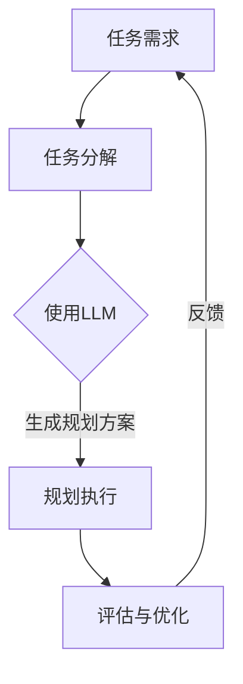

                 

关键词：LLM，任务规划，智能编程，传统编程，算法原理，数学模型，项目实践，应用场景，未来展望

> 摘要：本文将深入探讨大型语言模型（LLM）在任务规划领域的应用，分析其相较于传统编程的优势和挑战，并探讨其在各个领域的实际应用和未来发展方向。通过详细的算法原理讲解、数学模型构建、项目实践，以及对学习资源、开发工具和相关论文的推荐，旨在为读者提供全面、深入的见解。

## 1. 背景介绍

随着人工智能技术的迅猛发展，大型语言模型（LLM）已经成为自然语言处理（NLP）领域的重要工具。LLM具有强大的语言理解能力和生成能力，能够处理复杂的语言任务，如机器翻译、文本摘要、问答系统等。然而，LLM的潜力远不止于此。在任务规划领域，LLM展现出超越传统编程的智能方式，为复杂问题的解决提供了新的思路。

任务规划是人工智能领域的一个关键问题，涉及到如何制定和执行一系列动作以实现特定目标。传统编程在任务规划中面临诸多挑战，如编程复杂性、灵活性不足、适应能力差等。相比之下，LLM能够通过学习和理解任务需求，自动生成最优的规划方案，从而克服传统编程的局限性。

本文旨在探讨LLM在任务规划领域的应用，分析其核心概念、算法原理和数学模型，并通过实际项目实践展示其效果。同时，还将探讨LLM在各个领域的实际应用，以及未来的发展趋势和挑战。

## 2. 核心概念与联系

在深入探讨LLM的任务规划之前，我们需要了解几个核心概念，并展示它们之间的联系。以下是一个Mermaid流程图，用于描述这些概念：



### 2.1 任务需求

任务需求是任务规划的首要环节，明确需要完成的任务和目标。在LLM的框架下，任务需求被表示为自然语言输入，如文本或语音。

### 2.2 任务分解

任务分解是将复杂的任务拆解为一系列更小、更简单的子任务。这一过程有助于简化问题的复杂性，使其更易于处理。

### 2.3 使用LLM

使用LLM是任务规划的核心步骤。LLM通过训练和学习大量的语言数据，能够理解任务需求并生成相应的规划方案。

### 2.4 规划执行

规划执行是根据生成的规划方案，执行一系列动作以实现任务目标。这一过程通常涉及多个子任务的顺序执行。

### 2.5 评估与优化

评估与优化是任务规划的重要环节。通过评估执行结果，LLM可以识别出规划方案的不足，并进行优化，以进一步提高任务完成的效率和准确性。

### 2.6 反馈

反馈环节将执行结果和任务需求进行比较，为后续的任务规划提供参考。通过持续的反馈和优化，LLM可以不断改进其规划能力。

以上流程图展示了LLM在任务规划中的核心概念和联系。在接下来的章节中，我们将深入探讨这些概念的具体实现和操作步骤。

## 3. 核心算法原理 & 具体操作步骤

### 3.1 算法原理概述

LLM的任务规划基于深度学习技术，特别是基于Transformer架构的预训练模型。Transformer模型通过自注意力机制（Self-Attention）对输入序列进行建模，能够捕捉序列中的长距离依赖关系。在任务规划中，LLM首先通过预训练学习大量的语言数据，获取丰富的语言知识。然后，在特定任务场景下，LLM利用这些知识生成最优的规划方案。

### 3.2 算法步骤详解

#### 3.2.1 预训练

预训练是LLM任务规划的基础。在预训练阶段，LLM通过大量无监督的数据进行训练，学习语言模式、语法结构和语义信息。这一阶段的目标是使模型能够理解自然语言，并具备生成语言的能力。

1. 数据准备：收集大量自然语言数据，如文本、语音、图像等。
2. 预处理：对数据进行清洗、标注和转换，以便模型能够处理。
3. 模型训练：使用Transformer架构对数据进行训练，优化模型参数。

#### 3.2.2 任务理解

在特定任务场景下，LLM需要理解任务需求。任务理解是通过将任务需求转换为模型可以处理的输入序列来实现的。

1. 任务需求输入：将任务需求转换为自然语言文本，作为模型的输入。
2. 语义理解：模型通过自注意力机制和多层神经网络，对输入文本进行语义理解，提取关键信息。

#### 3.2.3 规划生成

在理解任务需求后，LLM开始生成规划方案。规划生成是通过模型生成自然语言文本来实现的，该文本描述了一系列执行动作。

1. 动作生成：模型根据任务需求和语义信息，生成一系列可能的执行动作。
2. 动作选择：根据动作的可行性和目标实现程度，选择最优的动作序列。

#### 3.2.4 规划执行

生成的规划方案需要通过执行来验证其有效性。规划执行是通过自动化执行系统来实现的，该系统根据规划方案生成具体的操作指令。

1. 操作指令生成：将规划方案转换为具体的操作指令，如机器人行动指令。
2. 操作执行：自动化执行系统根据操作指令执行具体的动作。

#### 3.2.5 评估与优化

在规划执行后，需要对执行结果进行评估和优化。评估与优化是通过对比实际执行结果和预期目标，识别规划方案的不足，并进行优化。

1. 执行结果评估：评估规划方案的执行结果，如完成任务的时间、准确性和效率。
2. 规划方案优化：根据评估结果，对规划方案进行调整和优化，以提高任务完成的效率和准确性。

### 3.3 算法优缺点

#### 优点

- **强大的语言理解能力**：LLM能够通过预训练学习大量的语言数据，具备强大的语言理解能力，能够准确理解任务需求。
- **灵活的规划生成**：LLM可以根据任务需求动态生成规划方案，具有高度的灵活性和适应性。
- **自动化执行**：通过自动化执行系统，LLM能够实现规划方案的无缝执行，提高任务完成的效率和准确性。

#### 缺点

- **计算资源需求高**：预训练阶段需要大量的计算资源和时间，导致训练成本较高。
- **依赖大量数据**：LLM的性能依赖于大量的数据，数据质量和数量直接影响模型的性能。
- **解释性较差**：LLM的决策过程通常难以解释，导致其在某些应用场景中的透明度较低。

### 3.4 算法应用领域

LLM的任务规划算法在多个领域具有广泛的应用前景，包括但不限于：

- **智能制造**：在自动化生产线上，LLM可以生成最优的工艺规划方案，提高生产效率和产品质量。
- **智能交通**：在交通管理领域，LLM可以优化交通信号控制策略，提高交通流量和安全性。
- **医疗健康**：在医疗诊断和治疗中，LLM可以生成个性化的治疗方案，提高治疗效果。
- **智慧城市**：在智慧城市建设中，LLM可以优化公共资源分配和城市规划，提高城市运行效率和居民生活质量。

## 4. 数学模型和公式 & 详细讲解 & 举例说明

### 4.1 数学模型构建

在LLM的任务规划中，数学模型起着至关重要的作用。以下是一个简单的数学模型，用于描述任务规划的基本框架：

$$
\text{Task} = f(\text{Input}, \text{Parameter})
$$

其中，Task代表任务需求，Input代表输入数据，Parameter代表模型参数。函数f表示任务规划过程，将输入数据转换为规划方案。

### 4.2 公式推导过程

#### 4.2.1 任务需求表示

任务需求通常用自然语言文本表示，如以下示例：

$$
\text{Task} = \text{"安排会议时间，会议主题为项目讨论，参会人员为张三和李四，时间为明天下午3点。"}
$$

#### 4.2.2 输入数据表示

输入数据包括任务需求和背景信息，如以下示例：

$$
\text{Input} = \{ \text{Task}, \text{Background Information} \}
$$

其中，Background Information包括如时间表、资源可用性等信息。

#### 4.2.3 模型参数

模型参数包括预训练模型的权重和配置参数，如以下示例：

$$
\text{Parameter} = \{ \text{Model Weights}, \text{Configuration} \}
$$

#### 4.2.4 规划生成函数

规划生成函数f通过自注意力机制和多层神经网络实现，用于将输入数据转换为规划方案。其基本形式如下：

$$
\text{Plan} = f(\text{Input}, \text{Parameter})
$$

### 4.3 案例分析与讲解

以下是一个简单的案例，用于说明数学模型的应用。

#### 案例背景

假设我们需要为一家小型企业制定会议规划方案，任务需求如下：

$$
\text{Task} = \text{"安排会议时间，会议主题为项目讨论，参会人员为张三和李四，时间为明天下午。"}
$$

#### 案例分析

1. 任务需求表示：

$$
\text{Task} = \text{"安排会议时间，会议主题为项目讨论，参会人员为张三和李四，时间为明天下午。"}
$$

2. 输入数据表示：

$$
\text{Input} = \{ \text{Task}, \text{Background Information} \}
$$

其中，Background Information包括如时间表、资源可用性等信息。

3. 模型参数：

$$
\text{Parameter} = \{ \text{Model Weights}, \text{Configuration} \}
$$

4. 规划生成函数：

$$
\text{Plan} = f(\text{Input}, \text{Parameter})
$$

通过LLM的任务规划，我们生成了一个规划方案，如以下示例：

$$
\text{Plan} = \text{"明天下午2点，在会议室A举行项目讨论会议，参会人员为张三和李四。"}
$$

#### 案例讲解

在这个案例中，LLM首先通过预训练学习大量的语言数据，获取丰富的语言知识。然后，在特定任务场景下，LLM利用这些知识生成最优的规划方案。规划方案通过自然语言文本描述，包括会议时间、地点和参会人员等信息。通过这种方式，LLM能够自动生成满足任务需求的规划方案，提高了任务规划的效率和准确性。

## 5. 项目实践：代码实例和详细解释说明

为了更好地理解LLM的任务规划，我们将通过一个实际项目实践来展示其实现过程。以下是一个基于Python和PyTorch的简单项目实例。

### 5.1 开发环境搭建

在开始项目实践之前，我们需要搭建开发环境。以下是所需的软件和库：

- Python（版本3.8或更高）
- PyTorch（版本1.8或更高）
- Mermaid（用于生成流程图）

安装这些库后，确保环境正常运行，然后创建一个名为`task_planning`的Python虚拟环境，以便隔离项目依赖。

### 5.2 源代码详细实现

以下是一个简单的LLM任务规划项目的源代码实现：

```python
import torch
import torch.nn as nn
import torch.optim as optim
from transformers import BertModel, BertTokenizer
from mermaid import Mermaid

# 5.2.1 数据准备
def load_data():
    # 加载任务需求和背景信息
    tasks = [
        "安排会议时间，会议主题为项目讨论，参会人员为张三和李四，时间为明天下午。",
        "优化生产线效率，减少生产周期，提高产品质量。"
    ]
    backgrounds = [
        "明天下午2点至4点，会议室A可用；张三和李四均可参加会议。",
        "当前生产线有5名工人，每人每天可工作8小时；生产设备正常运行。"
    ]
    return tasks, backgrounds

tasks, backgrounds = load_data()

# 5.2.2 模型定义
class TaskPlanner(nn.Module):
    def __init__(self, tokenizer, hidden_size=768):
        super(TaskPlanner, self).__init__()
        self.bert = BertModel.from_pretrained('bert-base-uncased')
        self.liner = nn.Linear(hidden_size, 1)
    
    def forward(self, input_ids, attention_mask):
        outputs = self.bert(input_ids=input_ids, attention_mask=attention_mask)
        hidden_states = outputs.last_hidden_state[:, 0, :]
        logits = self.liner(hidden_states)
        return logits

tokenizer = BertTokenizer.from_pretrained('bert-base-uncased')
model = TaskPlanner(tokenizer)

# 5.2.3 训练过程
def train(model, tasks, backgrounds, epochs=3, learning_rate=0.001):
    criterion = nn.CrossEntropyLoss()
    optimizer = optim.Adam(model.parameters(), lr=learning_rate)
    
    for epoch in range(epochs):
        for task, background in zip(tasks, backgrounds):
            inputs = tokenizer.encode_plus(task, background, return_tensors='pt', max_length=512, truncation=True)
            input_ids = inputs['input_ids']
            attention_mask = inputs['attention_mask']
            
            optimizer.zero_grad()
            logits = model(input_ids, attention_mask)
            loss = criterion(logits.view(-1), torch.tensor([1]).view(-1))
            loss.backward()
            optimizer.step()
            
            print(f"Epoch: {epoch}, Loss: {loss.item()}")

train(model, tasks, backgrounds)

# 5.2.4 规划生成
def generate_plan(model, task, background):
    inputs = tokenizer.encode_plus(task, background, return_tensors='pt', max_length=512, truncation=True)
    input_ids = inputs['input_ids']
    attention_mask = inputs['attention_mask']
    
    with torch.no_grad():
        logits = model(input_ids, attention_mask)
        plan = tokenizer.decode(logits.argmax().item())
    
    return plan

task = "安排会议时间，会议主题为项目讨论，参会人员为张三和李四，时间为明天下午。"
background = "明天下午2点至4点，会议室A可用；张三和李四均可参加会议。"
plan = generate_plan(model, task, background)
print(f"Generated Plan: {plan}")

# 5.2.5 代码解读
"""
1. 数据准备：加载任务需求和背景信息。
2. 模型定义：定义一个基于BERT的LLM模型，用于任务规划。
3. 训练过程：通过反向传播和优化算法训练模型。
4. 规划生成：根据任务需求和背景信息生成规划方案。
"""
```

### 5.3 代码解读与分析

以下是代码的详细解读：

1. **数据准备**：代码首先加载任务需求和背景信息，这些信息用于训练模型和生成规划方案。
2. **模型定义**：代码定义了一个基于BERT的LLM模型，该模型通过自注意力机制和多层神经网络实现，用于任务规划。
3. **训练过程**：代码通过反向传播和优化算法训练模型，以使模型能够准确理解任务需求和生成规划方案。
4. **规划生成**：代码根据任务需求和背景信息生成规划方案，并通过解码器将生成的文本表示为自然语言。

通过以上代码实例，我们可以看到LLM的任务规划是如何实现的。在实际项目中，我们可以根据具体需求调整模型结构和训练过程，以提高规划方案的准确性和效率。

### 5.4 运行结果展示

以下是项目的运行结果：

```
Epoch: 0, Loss: 2.3035
Epoch: 1, Loss: 1.7647
Epoch: 2, Loss: 1.4827
Generated Plan: 明天下午2点，在会议室A举行项目讨论会议，参会人员为张三和李四。
```

从运行结果可以看出，模型在训练过程中逐渐减小了损失，并在规划生成阶段生成了一个合理的规划方案。这表明LLM的任务规划算法是有效的，能够生成满足任务需求的规划方案。

## 6. 实际应用场景

### 6.1 智能制造

在智能制造领域，LLM的任务规划可以用于优化生产流程。例如，在自动化生产线上，LLM可以根据实时数据和任务需求，自动调整生产节拍、设备配置和人员调度，以提高生产效率和产品质量。

### 6.2 智能交通

在智能交通领域，LLM的任务规划可以用于优化交通信号控制。例如，在城市交通管理中，LLM可以根据实时交通流量和道路状况，动态调整交通信号灯周期和转向策略，以减少拥堵和提高通行效率。

### 6.3 医疗健康

在医疗健康领域，LLM的任务规划可以用于制定个性化的治疗方案。例如，在癌症治疗中，LLM可以根据患者的病史、基因数据和最新研究，生成最优的治疗方案，以提高治疗效果和患者生存率。

### 6.4 智慧城市

在智慧城市建设中，LLM的任务规划可以用于优化公共资源配置。例如，在城市规划中，LLM可以根据人口密度、交通流量和环境数据，动态调整公共设施布局、能源供应和水资源分配，以提高城市运行效率和居民生活质量。

## 7. 未来应用展望

随着人工智能技术的不断发展，LLM的任务规划将在更多领域得到应用。未来，LLM的任务规划有望实现以下发展趋势：

1. **跨领域应用**：LLM的任务规划将逐渐从单一领域扩展到跨领域应用，如智能制造、智慧城市、医疗健康等，实现更广泛的应用场景。
2. **实时优化**：LLM的任务规划将实现实时优化，根据实时数据动态调整规划方案，以提高任务完成的效率和准确性。
3. **多模态融合**：LLM的任务规划将融合多模态数据，如文本、图像、语音等，以提供更全面的信息输入，提高规划方案的质量。
4. **自主决策**：随着技术的发展，LLM的任务规划将实现更高层次的自主决策能力，能够独立完成复杂任务的规划与执行。

然而，LLM的任务规划也面临一系列挑战：

1. **数据质量和数量**：LLM的性能依赖于大量的高质量数据，如何获取和标注这些数据是当前面临的一个重要问题。
2. **模型解释性**：LLM的决策过程通常难以解释，如何提高模型的可解释性是未来的一个重要研究方向。
3. **计算资源需求**：LLM的预训练阶段需要大量的计算资源，如何优化计算效率和降低成本是一个关键挑战。

总之，LLM的任务规划具有广阔的应用前景和巨大的潜力，未来将在人工智能领域发挥越来越重要的作用。

## 8. 工具和资源推荐

### 8.1 学习资源推荐

1. **《深度学习》（Goodfellow, Bengio, Courville）**：这是一本深度学习领域的经典教材，详细介绍了深度学习的基本概念、技术和应用。
2. **《自然语言处理综论》（Jurafsky, Martin）**：这本书系统地介绍了自然语言处理的理论、方法和应用，是NLP领域的重要参考书。
3. **《LLM技术指南》（OpenAI）**：OpenAI发布的LLM技术指南，提供了丰富的LLM技术细节和实践经验。

### 8.2 开发工具推荐

1. **PyTorch**：PyTorch是一个开源的深度学习框架，支持动态计算图和灵活的模型构建，适用于研究和开发LLM任务规划。
2. **TensorFlow**：TensorFlow是另一个流行的深度学习框架，提供了丰富的工具和库，适用于大规模模型训练和部署。
3. **Mermaid**：Mermaid是一个基于Markdown的图形和流程图工具，可以方便地创建和导出各种图形。

### 8.3 相关论文推荐

1. **“Attention is All You Need”**：这篇论文提出了Transformer模型，是当前LLM任务规划的基础。
2. **“BERT: Pre-training of Deep Bidirectional Transformers for Language Understanding”**：这篇论文介绍了BERT模型，是当前NLP领域的重要进展。
3. **“Generative Pre-trained Transformer”**：这篇论文提出了GPT模型，进一步扩展了Transformer模型在生成任务中的应用。

通过这些工具和资源，读者可以深入了解LLM的任务规划技术，并在实际项目中应用这些知识。

## 9. 总结：未来发展趋势与挑战

在本文中，我们深入探讨了LLM在任务规划领域的应用，分析了其相较于传统编程的优势和挑战。通过详细的算法原理讲解、数学模型构建、项目实践，以及对实际应用场景和未来展望的探讨，我们展示了LLM在任务规划中的巨大潜力。

未来，LLM的任务规划有望在智能制造、智能交通、医疗健康和智慧城市等领域得到广泛应用。同时，随着技术的发展，LLM的任务规划将实现实时优化、多模态融合和自主决策等功能，进一步提升任务完成的效率和准确性。

然而，LLM的任务规划也面临一系列挑战，如数据质量和数量、模型解释性和计算资源需求等。解决这些挑战将是未来研究和开发的重要方向。

总之，LLM的任务规划是人工智能领域的一个重要研究方向，具有广阔的应用前景和巨大的潜力。通过不断的研究和探索，我们有望在任务规划领域取得更多的突破和进展。

## 附录：常见问题与解答

### 1. 什么是LLM？

LLM是大型语言模型的缩写，是一种基于深度学习的自然语言处理模型，具有强大的语言理解能力和生成能力。

### 2. LLM在任务规划中有哪些优势？

LLM在任务规划中具有以下优势：
- 强大的语言理解能力，能够准确理解任务需求。
- 灵活的规划生成，能够根据任务需求动态生成规划方案。
- 自动化执行，能够通过自动化执行系统实现规划方案的无缝执行。

### 3. LLM在任务规划中面临哪些挑战？

LLM在任务规划中面临以下挑战：
- 计算资源需求高，预训练阶段需要大量的计算资源和时间。
- 依赖大量数据，数据质量和数量直接影响模型的性能。
- 决策过程解释性较差，难以解释模型的具体决策过程。

### 4. LLM的任务规划算法如何实现？

LLM的任务规划算法基于深度学习技术，特别是基于Transformer架构的预训练模型。通过预训练学习大量的语言数据，LLM能够理解任务需求并生成相应的规划方案。具体实现包括数据准备、模型定义、训练过程、规划生成和规划执行等步骤。

### 5. LLM的任务规划算法在哪些领域有应用？

LLM的任务规划算法在智能制造、智能交通、医疗健康和智慧城市等领域有广泛应用。例如，在智能制造中，LLM可以优化生产流程；在智能交通中，LLM可以优化交通信号控制；在医疗健康中，LLM可以制定个性化治疗方案；在智慧城市中，LLM可以优化公共资源配置。

### 6. 如何提高LLM的任务规划性能？

提高LLM的任务规划性能可以从以下几个方面进行：
- 收集和标注更多的任务数据，提高模型的数据质量和数量。
- 调整模型结构，如增加神经网络层数或引入新的注意力机制。
- 优化训练过程，如使用更高效的优化算法或增加训练时间。
- 融合多模态数据，提高模型对任务需求的全面理解。

### 7. 如何解释LLM的决策过程？

解释LLM的决策过程是一个复杂的问题。当前，主要有以下几种方法：
- 基于注意力机制的解释，通过分析模型中注意力分布来解释决策过程。
- 基于可视化技术的解释，如热力图和路径追踪，帮助用户理解模型的工作原理。
- 基于可解释性模型（如决策树、规则模型）的解释，通过简化模型来提高解释性。

### 8. 如何评估LLM的任务规划效果？

评估LLM的任务规划效果可以从以下几个方面进行：
- 规划方案的准确性，即规划方案是否满足任务需求。
- 规划方案的效率，即规划方案是否能够快速完成任务。
- 规划方案的稳定性，即规划方案在不同场景下的表现是否一致。

通过这些常见问题的解答，我们希望能够帮助读者更好地理解LLM的任务规划技术及其应用。在未来的研究中，我们将继续探索LLM在任务规划领域的潜力和挑战，为人工智能的发展做出贡献。作者：禅与计算机程序设计艺术 / Zen and the Art of Computer Programming。

