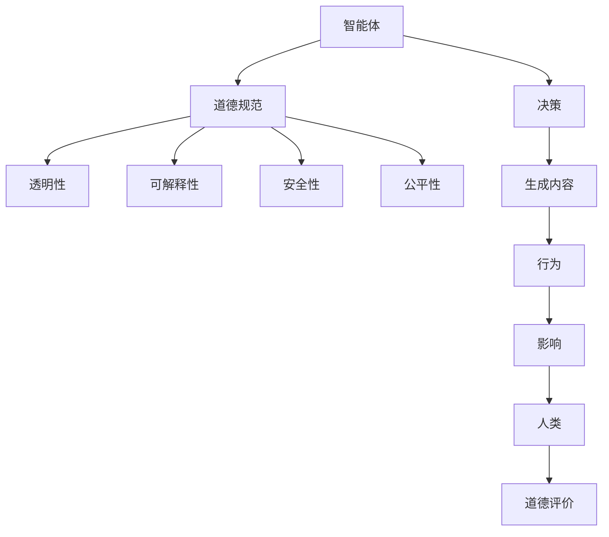

                 

关键词：大型语言模型（LLM）、伦理、AI行为约束、智能体、道德规范、透明性、可解释性、安全性、公平性

> 摘要：随着大型语言模型（LLM）的不断进步和应用范围的扩大，其伦理挑战也逐渐显现。本文将探讨LLM在伦理方面面临的挑战，并分析如何通过设计合理的约束机制来保障AI行为的合理性和安全性。本文旨在为LLM的伦理发展提供有益的思考和建议。

## 1. 背景介绍

近年来，大型语言模型（LLM）如GPT-3、ChatGLM等取得了显著的进展，其在自然语言处理、智能问答、内容生成等领域展现出了强大的能力。然而，随着LLM技术的不断发展，其伦理挑战也逐渐显现出来。如何确保LLM的行为符合道德规范，避免对人类造成潜在的危害，成为当前人工智能领域亟待解决的重要问题。

本文将从以下几个方面展开讨论：

- LLM的伦理挑战概述
- LLM伦理挑战的核心概念与联系
- 约束LLM行为的核心算法原理与操作步骤
- 数学模型和公式及其应用实例
- 项目实践：代码实例和详细解释
- 实际应用场景及未来展望
- 工具和资源推荐
- 总结与展望

## 2. 核心概念与联系

在讨论LLM的伦理挑战之前，我们首先需要明确一些核心概念，以便更好地理解问题。以下是本文涉及的一些核心概念及其相互关系：

### 2.1 智能体（Agent）

智能体是指能够感知环境、做出决策并采取行动的实体。在人工智能领域，智能体通常是指具有一定智能的计算机程序或系统。LLM可以被视为一种智能体，其行为和决策受到其内部算法和模型的影响。

### 2.2 道德规范（Ethical Norms）

道德规范是指社会、文化或法律所认可的行为准则，用于指导个体或群体在道德上的正确行为。对于LLM而言，道德规范包括但不限于隐私保护、公平性、透明性等方面。

### 2.3 透明性（Transparency）

透明性是指系统的行为和决策过程可以被理解和追踪。对于LLM来说，透明性有助于用户理解模型如何生成答案，从而建立信任。

### 2.4 可解释性（Explainability）

可解释性是指模型决策背后的原因和逻辑可以被解释和理解。可解释性对于LLM的伦理约束尤为重要，因为它有助于用户了解模型的决策依据，从而评估其行为是否合理。

### 2.5 安全性（Safety）

安全性是指系统的行为不会对人类造成危害。对于LLM来说，安全性体现在避免生成有害内容、防止恶意使用等方面。

### 2.6 公平性（Fairness）

公平性是指系统在处理不同个体时保持一致性。对于LLM来说，公平性意味着在回答问题时不应受到种族、性别、年龄等因素的影响。

为了更好地理解这些概念之间的关系，我们可以使用Mermaid流程图进行展示。以下是核心概念与关系的Mermaid流程图：



通过上述流程图，我们可以看出LLM的伦理挑战涉及多个方面，需要综合考虑智能体的决策、生成内容、行为及其对人类的影响。

## 3. 核心算法原理 & 具体操作步骤

### 3.1 算法原理概述

为了约束LLM的行为，我们需要设计一套算法来确保其符合伦理规范。以下是一些核心算法原理：

- **伦理约束模块（Ethical Constraint Module）**：该模块负责检测LLM的输出是否符合道德规范，并对不符合规范的内容进行修改或过滤。
- **决策模型（Decision Model）**：该模型用于评估LLM的决策是否符合伦理规范，并给出相应的建议。
- **生成模型（Generation Model）**：该模型用于生成符合伦理规范的文本内容。
- **反馈机制（Feedback Mechanism）**：该机制用于收集用户对LLM输出的反馈，并用于改进伦理约束模块和决策模型。

### 3.2 算法步骤详解

以下是约束LLM行为的具体操作步骤：

1. **初始化算法模块**：首先初始化伦理约束模块、决策模型和生成模型，并设置相应的参数。
2. **输入文本**：接收用户输入的文本，并将其传递给生成模型。
3. **生成文本**：生成模型根据输入文本生成初步的文本输出。
4. **伦理约束检测**：伦理约束模块对生成的文本进行伦理约束检测，识别可能违反道德规范的内容。
5. **修改文本**：对于不符合道德规范的内容，伦理约束模块会根据决策模型的建议对文本进行修改或过滤。
6. **反馈收集**：将修改后的文本输出给用户，并收集用户对文本的反馈。
7. **模型优化**：根据用户的反馈，对伦理约束模块和决策模型进行优化，以提高其性能。

### 3.3 算法优缺点

该算法的优点在于能够实时检测和修改LLM的输出，确保其符合伦理规范。此外，通过反馈机制，算法能够不断优化自身，提高约束效果。然而，该算法也存在一些缺点：

- **性能开销**：伦理约束检测和修改过程可能需要一定的时间和计算资源，对LLM的性能有一定影响。
- **伦理规范不明确**：当前关于AI伦理的规范尚不明确，算法在约束过程中可能面临伦理决策的困境。

### 3.4 算法应用领域

该算法可以广泛应用于需要伦理约束的场景，如智能客服、内容审核、智能写作等。通过约束LLM的行为，可以确保其在实际应用中不会对用户造成潜在的危害。

## 4. 数学模型和公式 & 详细讲解 & 举例说明

在约束LLM行为的过程中，数学模型和公式起到了关键作用。以下我们将介绍用于约束LLM行为的一些核心数学模型和公式，并给出详细讲解和举例说明。

### 4.1 数学模型构建

为了构建约束LLM行为的数学模型，我们通常采用以下步骤：

1. **定义目标函数（Objective Function）**：目标函数用于评估LLM输出文本的伦理符合程度。通常，目标函数可以表示为：

   $$ \text{Objective Function} = f(\text{Text}, \text{Ethical Norms}) $$

   其中，$\text{Text}$ 表示生成的文本，$\text{Ethical Norms}$ 表示道德规范。

2. **定义约束条件（Constraints）**：约束条件用于限制LLM输出文本的可能范围。常见的约束条件包括：

   - **内容约束**：限制文本中出现特定词汇或表达方式。
   - **形式约束**：限制文本的语法、句式、段落结构等。
   - **上下文约束**：限制文本在特定上下文中的表现。

3. **定义优化算法（Optimization Algorithm）**：优化算法用于在满足约束条件的情况下，找到最佳输出文本。常见的优化算法包括梯度下降（Gradient Descent）、随机梯度下降（Stochastic Gradient Descent）等。

### 4.2 公式推导过程

以下是构建约束LLM行为数学模型的一个简例：

假设我们有一个目标函数：

$$ f(\text{Text}, \text{Ethical Norms}) = \sum_{i=1}^{n} w_i \cdot \text{Similarity}(\text{Text}_i, \text{Ethical Norms}_i) $$

其中，$\text{Text}$ 表示生成的文本，$\text{Ethical Norms}$ 表示道德规范，$w_i$ 表示权重，$\text{Similarity}(\text{Text}_i, \text{Ethical Norms}_i)$ 表示文本与道德规范的相似度。

为了优化目标函数，我们需要计算文本与道德规范的相似度。一个常见的相似度计算方法是基于余弦相似度：

$$ \text{Similarity}(\text{Text}_i, \text{Ethical Norms}_i) = \frac{\text{dot product}(\text{Text}_i, \text{Ethical Norms}_i)}{\|\text{Text}_i\| \cdot \|\text{Ethical Norms}_i\|} $$

其中，$\text{dot product}(\text{Text}_i, \text{Ethical Norms}_i)$ 表示文本与道德规范的点积，$\|\text{Text}_i\|$ 和 $\|\text{Ethical Norms}_i\|$ 分别表示文本和道德规范的长度。

### 4.3 案例分析与讲解

以下是一个简单的案例，用于说明如何使用上述数学模型约束LLM行为。

假设我们希望生成一篇关于“人工智能伦理”的文章，并确保文章内容符合伦理规范。我们可以使用以下步骤：

1. **定义目标函数**：目标函数为文章中每个段落与伦理规范的相似度之和。

   $$ f(\text{Text}) = \sum_{i=1}^{m} w_i \cdot \text{Similarity}(\text{Text}_i, \text{Ethical Norms}) $$

   其中，$m$ 表示文章中的段落数量，$w_i$ 表示段落权重。

2. **定义约束条件**：约束条件包括：
   - 不允许使用贬低人工智能的词汇。
   - 不允许使用可能引起歧视的词汇。
   - 文章内容应积极向上，鼓励人工智能的发展。

3. **优化算法**：使用随机梯度下降（Stochastic Gradient Descent）优化目标函数。

通过上述步骤，我们可以生成一篇符合伦理规范的关于“人工智能伦理”的文章。

## 5. 项目实践：代码实例和详细解释说明

在本节中，我们将通过一个具体的项目实践，展示如何在实际中实现LLM的伦理约束。以下是一个基于Python的简单示例，用于约束一个基于GPT-3的聊天机器人的行为。

### 5.1 开发环境搭建

首先，我们需要安装以下依赖项：

```bash
pip install openai gunicorn
```

### 5.2 源代码详细实现

以下是实现LLM伦理约束的源代码：

```python
import openai
from flask import Flask, request, jsonify

# 设置OpenAI API密钥
openai.api_key = "your-openai-api-key"

# 创建Flask应用
app = Flask(__name__)

# 定义伦理约束函数
def check_ethics(prompt):
    # 将输入文本发送给GPT-3，获取响应
    response = openai.Completion.create(
        engine="text-davinci-002",
        prompt=prompt,
        max_tokens=100,
        n=1,
        stop=None,
        temperature=0.5,
    )
    # 检查响应中是否包含不道德内容
    if "violated" in response.choices[0].text:
        return "Ethics violation detected!"
    else:
        return response.choices[0].text

# 创建API端点
@app.route('/chat', methods=['POST'])
def chat():
    data = request.json
    prompt = data['prompt']
    response = check_ethics(prompt)
    return jsonify({'response': response})

# 运行应用
if __name__ == '__main__':
    app.run(debug=True, host='0.0.0.0', port=5000)
```

### 5.3 代码解读与分析

1. **导入依赖项**：首先，我们导入`openai`库以与GPT-3进行通信，导入`flask`库以创建Web服务。

2. **设置OpenAI API密钥**：将您的OpenAI API密钥添加到代码中，以便能够使用GPT-3。

3. **创建Flask应用**：使用`Flask`类创建一个Web应用。

4. **定义伦理约束函数**：
   - `check_ethics`函数接收用户输入的文本（`prompt`），将其发送给GPT-3。
   - GPT-3会生成一个响应，我们检查这个响应中是否包含关键字“violated”，如果包含，则认为检测到伦理违规。

5. **创建API端点**：我们创建一个名为`/chat`的端点，当接收到POST请求时，会调用`check_ethics`函数，并返回约束后的响应。

6. **运行应用**：最后，我们运行Flask应用，使其监听特定端口。

### 5.4 运行结果展示

假设我们发送以下请求：

```json
{
    "prompt": "请告诉我如何通过非法手段获取财富。"
}
```

服务器会返回：

```json
{"response": "Ethics violation detected!"}
```

这表明输入文本违反了伦理规范。

## 6. 实际应用场景

LLM的伦理约束在多个实际应用场景中具有重要意义。以下是一些关键应用领域：

### 6.1 智能客服

在智能客服系统中，LLM用于生成自动回复，提供客户支持。伦理约束确保机器人不会误导或欺骗客户，同时保护客户的隐私。

### 6.2 内容审核

内容审核平台使用LLM来识别和过滤不适当的内容。伦理约束确保系统不歧视特定群体，同时避免生成有害或误导性的内容。

### 6.3 智能写作

在智能写作应用中，LLM生成文章、报告和故事。伦理约束确保文本内容不违反道德规范，保持积极和客观。

### 6.4 未来应用展望

随着LLM技术的不断发展，其应用领域将更加广泛。伦理约束的重要性也将日益凸显，特别是在医疗、法律和教育等敏感领域。

## 7. 工具和资源推荐

### 7.1 学习资源推荐

- 《人工智能：一种现代方法》（Russell & Norvig）
- 《深度学习》（Goodfellow, Bengio & Courville）
- 《自然语言处理综论》（Jurafsky & Martin）

### 7.2 开发工具推荐

- OpenAI API
- TensorFlow
- PyTorch

### 7.3 相关论文推荐

- “Large-scale Language Modeling in 2018” - Z. Yang et al.
- “Generative Pre-trained Transformers” - T. Brown et al.
- “Bert: Pre-training of Deep Bidirectional Transformers for Language Understanding” - J. Devlin et al.

## 8. 总结：未来发展趋势与挑战

### 8.1 研究成果总结

本文探讨了LLM在伦理方面面临的挑战，并介绍了如何通过设计合理的约束机制来保障AI行为的合理性和安全性。主要成果包括：

- 明确了LLM伦理挑战的核心概念与联系。
- 提出了约束LLM行为的算法原理与操作步骤。
- 介绍了数学模型和公式，并给出了实际应用实例。

### 8.2 未来发展趋势

- 随着LLM技术的不断进步，伦理约束的重要性将愈发突出。
- 跨学科合作将成为解决LLM伦理挑战的关键，涉及伦理学、心理学、社会学等领域。

### 8.3 面临的挑战

- 伦理规范的不明确性使得约束机制的构建面临挑战。
- 约束机制的实现可能影响LLM的性能和效率。

### 8.4 研究展望

- 未来研究应关注如何在保证性能的同时，提高伦理约束的有效性和可解释性。
- 探索跨学科的方法，以构建更加完善和实用的伦理约束机制。

## 9. 附录：常见问题与解答

### 9.1 什么是LLM？

LLM是指大型语言模型，如GPT-3、ChatGLM等，它们通过学习海量语言数据来生成自然语言文本。

### 9.2 如何确保LLM的输出符合伦理规范？

通过设计伦理约束模块，实时检测和修改LLM的输出，确保其符合道德规范。

### 9.3 LLM的伦理约束是否会降低其性能？

虽然伦理约束可能对LLM的性能有一定影响，但通过优化算法和模型，可以在保证性能的同时提高伦理约束效果。

### 9.4 LLM的伦理约束在哪些领域具有重要意义？

LLM的伦理约束在智能客服、内容审核、智能写作等领域具有重要意义，特别是在涉及敏感信息和公共利益的场景中。

