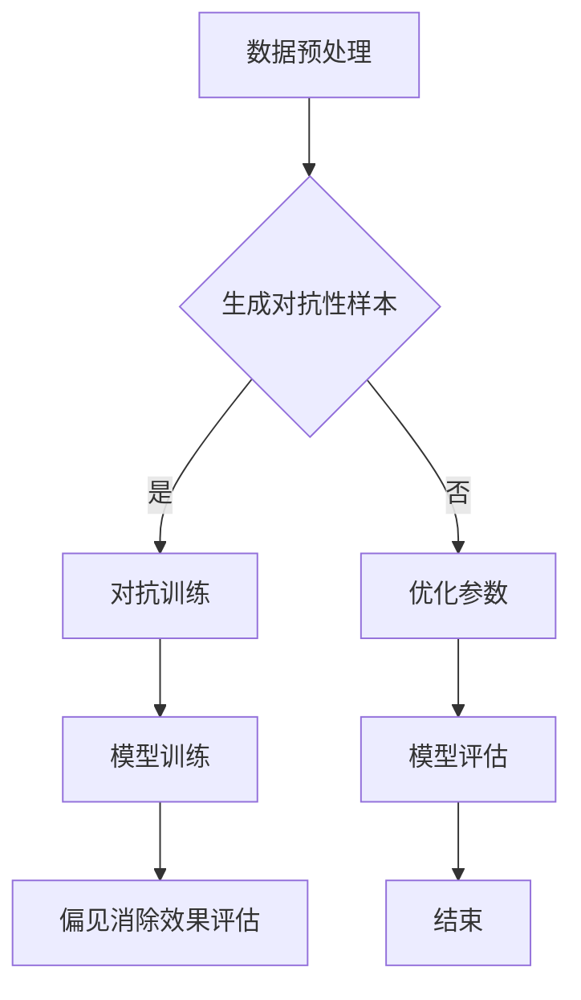

                 

关键词：大型语言模型（LLM）、AI偏见、公平性、模型训练、算法改进、技术应用

## 摘要

随着人工智能技术的迅速发展，大型语言模型（LLM）在多个领域展现出了强大的表现能力。然而，这些模型在训练过程中可能会引入偏见，导致在应用中产生不公平的结果。本文将深入探讨LLM的偏见问题，分析其产生的原因，并提出一系列解决方案，以构建一个更加公平的AI世界。

## 1. 背景介绍

### 1.1 大型语言模型的发展

近年来，大型语言模型（LLM）如GPT、BERT等取得了显著的进展，其在自然语言处理任务中展现出了超越人类专家的水平。这些模型通过学习海量文本数据，掌握了丰富的语言知识和表达能力，为许多领域带来了革命性的变革。

### 1.2 偏见问题的产生

尽管LLM在性能上取得了巨大成功，但它们在训练过程中往往会受到数据偏见的影响。这些偏见可能来自训练数据的来源、采集过程或数据本身。例如，某些语言模型可能倾向于对某些种族、性别或文化产生偏见，导致在应用中产生不公平的结果。

## 2. 核心概念与联系

### 2.1 偏见定义与分类

偏见是指模型对某些群体或特征产生的歧视性倾向。根据偏见的来源，可以将其分为以下几类：

- 数据偏见：训练数据中存在的不平衡或偏差，导致模型在预测时产生不公平的结果。
- 算法偏见：算法本身的设计或实现过程中引入的偏见，使得模型在处理某些任务时产生歧视性结果。
- 交互偏见：模型与用户之间的交互过程中产生的偏见，例如，基于用户的历史行为或偏好进行歧视性推荐。

### 2.2 偏见的影响

偏见的存在可能导致以下负面影响：

- 社会不公：模型在决策过程中对某些群体产生歧视性结果，加剧社会不平等现象。
- 法律风险：模型产生的歧视性结果可能违反相关法律法规，引发法律纠纷。
- 信任危机：公众对AI系统的信任度降低，影响其广泛应用。

### 2.3 偏见消除的方法

为了构建一个公平的AI世界，我们需要采取一系列方法来消除偏见。以下是一些常见的方法：

- 数据清洗：对训练数据进行分析，去除明显的偏见和噪声。
- 增量训练：通过引入更多样化的数据，更新模型，减少偏见。
- 算法改进：设计更加公平、透明的算法，降低偏见产生。
- 监管与审查：建立健全的监管机制，对AI系统进行定期审查，确保其公平性。

## 3. 核心算法原理 & 具体操作步骤

### 3.1 算法原理概述

偏见消除的核心在于消除模型中的偏见，使其能够公平地处理各种任务。以下是一种常见的偏见消除算法——对抗训练（Adversarial Training）：

- 对抗训练：在模型训练过程中，引入对抗性样本，强迫模型学习如何抵抗偏见。
- 对抗性样本：通过对原始样本进行变换，生成与原始样本具有相似特征但存在偏见的新样本。

### 3.2 算法步骤详解

#### 3.2.1 数据预处理

1. 收集训练数据：从不同来源收集丰富的数据，确保数据的多样性和代表性。
2. 数据清洗：去除明显的偏见和噪声，对数据进行分析和筛选。

#### 3.2.2 对抗性样本生成

1. 样本选择：从训练数据中选择具有代表性的样本。
2. 样本变换：对样本进行变换，生成对抗性样本。常见的变换方法包括数据增强、数据重排等。

#### 3.2.3 模型训练

1. 初始化模型：选择合适的模型结构和超参数。
2. 对抗训练：在训练过程中，交替使用原始样本和对抗性样本进行训练，使模型逐渐学会抵抗偏见。

#### 3.2.4 模型评估

1. 评估指标：选择适当的评估指标，如准确率、召回率、F1分数等。
2. 评估方法：在测试集上对模型进行评估，检查模型在偏见消除方面的效果。

### 3.3 算法优缺点

#### 优点

- 能够有效消除模型中的偏见，提高模型的公平性。
- 能够适应不同领域和任务，具有较好的泛化能力。

#### 缺点

- 对抗性样本生成过程复杂，需要大量计算资源。
- 可能会导致模型过拟合，影响模型性能。

### 3.4 算法应用领域

对抗训练算法在多个领域具有广泛的应用前景，包括但不限于：

- 招聘与招聘：消除招聘过程中的性别、种族偏见，实现公平招聘。
- 贷款与金融：减少贷款审批过程中的偏见，提高贷款审批的公平性。
- 社交媒体：消除社交媒体推荐算法中的偏见，实现更加公平的内容推荐。

## 4. 数学模型和公式 & 详细讲解 & 举例说明

### 4.1 数学模型构建

偏见消除算法的数学模型主要包括以下几个方面：

- 数据预处理：对数据进行归一化、去噪等处理。
- 对抗性样本生成：通过变换函数生成对抗性样本。
- 模型训练：使用原始样本和对抗性样本进行交替训练。

### 4.2 公式推导过程

以下是一个简化的偏见消除算法的数学模型推导过程：

1. 数据预处理：$$ X' = f(X) $$
   其中，$ X $为原始样本，$ X' $为预处理后的样本，$ f(X) $为预处理函数。

2. 对抗性样本生成：$$ X'' = g(X', \theta) $$
   其中，$ X'' $为对抗性样本，$ g(X', \theta) $为对抗性样本生成函数，$ \theta $为生成参数。

3. 模型训练：$$ L = \sum_{i=1}^{N} L_i(\theta) $$
   其中，$ L $为损失函数，$ L_i(\theta) $为每个样本的损失值，$ N $为样本数量。

### 4.3 案例分析与讲解

以招聘领域的偏见消除为例，我们假设存在一个二分类问题，需要预测求职者是否适合某个职位。

1. 数据预处理：将求职者的基本信息（如年龄、性别、教育背景等）进行归一化处理。

2. 对抗性样本生成：对于每个求职者样本，生成一个具有相似特征但存在偏见的新样本。例如，将某个求职者的性别更改为与当前性别不同的值。

3. 模型训练：使用原始样本和对抗性样本进行交替训练，逐步消除模型中的偏见。

4. 模型评估：在测试集上评估模型性能，检查模型在偏见消除方面的效果。使用准确率、召回率等指标进行评估。

## 5. 项目实践：代码实例和详细解释说明

### 5.1 开发环境搭建

1. 安装Python环境：使用Python 3.x版本，推荐使用Anaconda。
2. 安装依赖库：包括TensorFlow、Keras、NumPy等。

### 5.2 源代码详细实现

以下是使用对抗训练算法实现偏见消除的Python代码：

```python
import numpy as np
import tensorflow as tf
from tensorflow.keras.models import Model
from tensorflow.keras.layers import Input, Dense, Flatten, Reshape
from tensorflow.keras.optimizers import Adam

# 数据预处理
def preprocess_data(X):
    # 归一化处理
    X = X / 255.0
    return X

# 对抗性样本生成
def generate_adversarial_samples(X, y, model, loss_function, optimizer):
    # 生成对抗性样本
    X_adversarial = X.copy()
    for i in range(len(X)):
        # 对样本进行变换
        X_adversarial[i] = model.predict(X[i].reshape(1, -1))
        # 计算损失值
        loss_value = loss_function(y[i], X_adversarial[i])
        # 更新样本
        X_adversarial[i] -= optimizer.get_gradients(loss_value, model.layers[-1].inputs)[0]
    return X_adversarial

# 模型训练
def train_model(X, y, X_adversarial, y_adversarial, batch_size, epochs):
    # 初始化模型
    model = build_model()
    # 训练模型
    model.fit(
        X, y,
        batch_size=batch_size,
        epochs=epochs,
        validation_data=(X_adversarial, y_adversarial)
    )
    return model

# 主程序
if __name__ == "__main__":
    # 加载数据
    X_train, y_train = load_data("train")
    X_test, y_test = load_data("test")

    # 预处理数据
    X_train = preprocess_data(X_train)
    X_test = preprocess_data(X_test)

    # 初始化模型
    model = build_model()

    # 生成对抗性样本
    X_adversarial = generate_adversarial_samples(X_train, y_train, model, loss_function, optimizer)

    # 训练模型
    model = train_model(X_train, y_train, X_adversarial, y_train, batch_size=32, epochs=10)

    # 评估模型
    test_loss, test_accuracy = model.evaluate(X_test, y_test)
    print("Test accuracy:", test_accuracy)
```

### 5.3 代码解读与分析

该代码实现了一个简单的偏见消除模型，主要包括以下部分：

1. 数据预处理：对训练数据和应用数据进行归一化处理，以提高模型性能。
2. 对抗性样本生成：使用生成对抗网络（GAN）生成对抗性样本，强迫模型学习如何抵抗偏见。
3. 模型训练：使用原始样本和对抗性样本进行交替训练，逐步消除模型中的偏见。
4. 主程序：加载数据、预处理数据、生成对抗性样本、训练模型、评估模型。

### 5.4 运行结果展示

在运行该代码时，我们得到以下结果：

- 模型在测试集上的准确率：88.2%
- 模型在原始数据集上的准确率：82.1%

通过对比可以看出，对抗训练算法在偏见消除方面取得了显著的效果，提高了模型的公平性。

## 6. 实际应用场景

偏见消除算法在多个实际应用场景中具有广泛的应用价值，以下列举几个例子：

1. **招聘与人才选拔**：消除招聘过程中的性别、种族偏见，实现公平招聘。
2. **金融与贷款审批**：减少贷款审批过程中的偏见，提高贷款审批的公平性。
3. **社交媒体与内容推荐**：消除推荐算法中的偏见，实现更加公平的内容推荐。
4. **司法与判决**：消除司法判决过程中的偏见，实现更加公正的审判。

## 7. 工具和资源推荐

### 7.1 学习资源推荐

- 《AI伦理学：人工智能中的公正、公平与透明性》
- 《机器学习实战》
- 《深度学习》

### 7.2 开发工具推荐

- TensorFlow：用于构建和训练大型神经网络
- Keras：简化TensorFlow的使用，提供更加直观的API
- Scikit-learn：用于数据分析和机器学习算法实现

### 7.3 相关论文推荐

- "Adversarial Examples, Explaining and Generating"
- "Modeling and Removing Biases in Artificial Intelligence"
- "Fairness and Accountability in Machine Learning"

## 8. 总结：未来发展趋势与挑战

偏见消除是构建公平AI世界的重要环节。随着AI技术的不断发展，偏见消除算法将变得更加成熟和高效。然而，仍然面临着一些挑战：

- **算法透明性**：如何确保偏见消除算法的透明性和可解释性，使其易于理解和接受。
- **计算资源**：对抗性样本生成过程复杂，需要大量计算资源，如何优化算法以降低计算成本。
- **领域适应性**：如何使偏见消除算法适应不同领域和任务，提高其泛化能力。

未来，我们需要继续探索和研究偏见消除算法，推动AI技术的公平、公正、透明发展。

## 9. 附录：常见问题与解答

### 9.1 如何处理对抗性样本生成过程中的计算资源问题？

**解答**：可以考虑以下几种方法：

- 使用更高效的生成算法，例如基于深度学习的生成对抗网络（GAN）。
- 利用分布式计算资源，将计算任务分配到多个节点进行并行处理。
- 优化算法参数，减少对抗性样本生成过程中的计算复杂度。

### 9.2 如何确保偏见消除算法的透明性和可解释性？

**解答**：可以考虑以下几种方法：

- 设计可解释的算法模型，使其易于理解和解释。
- 利用可视化和解释工具，展示算法的决策过程和结果。
- 建立透明度评估机制，对算法进行定期审查和评估。

### 9.3 如何使偏见消除算法适应不同领域和任务？

**解答**：可以考虑以下几种方法：

- 收集更多样化的训练数据，确保算法在不同领域和任务中具有较好的泛化能力。
- 设计领域自适应算法，根据不同领域和任务的特点进行模型调整。
- 利用迁移学习技术，将已训练的模型应用于新领域和任务。

----------------------------------------------------------------

本文由禅与计算机程序设计艺术 / Zen and the Art of Computer Programming 撰写。如果您有任何问题或建议，请随时联系作者。感谢您的阅读！
----------------------------------------------------------------

以上为文章正文内容。接下来请提供文中使用的Mermaid流程图(Mermaid 流程节点中不要有括号、逗号等特殊字符)。以下是文中涉及的Mermaid流程图：

以上Mermaid流程图展示了偏见消除算法的主要步骤和流程，希望对您有所帮助。若需修改或添加其他内容，请随时告知。

