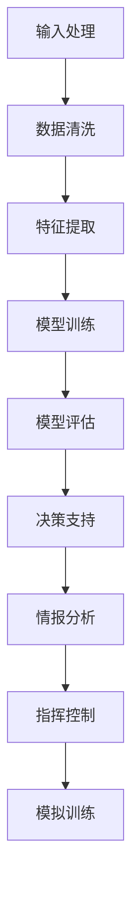

                 

关键词：语言模型，军事应用，国防领域，人工智能，机器学习，算法，算法原理，代码实例，实际应用，工具推荐，未来展望

## 摘要

随着人工智能技术的快速发展，语言模型（LLM）作为一种先进的人工智能模型，在国防领域展现出了巨大的应用潜力。本文旨在探讨LLM在军事应用中的角色，包括其核心概念、算法原理、数学模型、项目实践以及未来展望。通过详细分析，本文揭示了LLM在情报分析、决策支持、指挥控制、模拟训练等多个方面的实际应用，探讨了其优势和面临的挑战。

## 1. 背景介绍

### 1.1 人工智能与国防的关系

人工智能作为现代技术发展的前沿领域，正日益改变着国防领域的面貌。随着计算机性能的不断提升和算法的不断完善，人工智能在信息处理、决策支持、武器系统控制等方面发挥着重要作用。尤其在军事领域，人工智能的应用不仅提高了作战效率，还显著降低了人力成本和风险。

### 1.2 语言模型的发展历程

语言模型是人工智能领域的一个重要分支，它旨在理解和生成自然语言。自20世纪50年代起，语言模型经历了从基于规则的方法到统计方法，再到现代深度学习方法的演变。近年来，随着神经网络技术的发展，特别是GPT-3等大型语言模型的问世，语言模型在理解和生成自然语言方面取得了显著的突破。

### 1.3 国防领域对语言模型的关注

语言模型在国防领域的应用受到了广泛关注。一方面，语言模型可以处理大量非结构化数据，帮助情报分析师快速提取关键信息。另一方面，语言模型可以模拟敌方指挥官的思维模式，为军事策略制定提供有力支持。此外，语言模型还可以用于军事模拟训练，提高士兵的作战能力。

## 2. 核心概念与联系

### 2.1 语言模型的定义与分类

语言模型是一种预测模型，它旨在根据已有的输入序列预测下一个输出序列。根据训练数据和预测目标的不同，语言模型可以分为有监督语言模型、无监督语言模型和增强学习语言模型。

### 2.2 军事应用中的语言模型架构

在军事应用中，语言模型通常被设计为具备以下特点的架构：

- **高容错性**：能够处理不同来源、不同格式的数据。
- **实时性**：能够快速响应军事任务需求。
- **可扩展性**：能够适应不同规模的任务场景。

### 2.3 语言模型与军事任务的关联

语言模型在军事任务中的关联主要体现在以下几个方面：

- **情报分析**：利用语言模型对非结构化数据进行分类、筛选和总结。
- **决策支持**：为指挥官提供基于数据的决策建议。
- **指挥控制**：通过语言模型实现指挥命令的自动生成和执行。
- **模拟训练**：用于模拟不同作战场景，帮助士兵进行实战演练。

### 2.4 Mermaid 流程图

下面是一个描述语言模型在军事应用中核心概念和架构的Mermaid流程图：



## 3. 核心算法原理 & 具体操作步骤

### 3.1 算法原理概述

语言模型的核心算法是基于深度学习的神经网络模型，尤其是近年来流行的变换器模型（Transformer）。这种模型通过注意力机制实现对输入序列的建模，从而实现高效的序列预测。

### 3.2 算法步骤详解

语言模型的算法步骤可以分为以下几个阶段：

1. **数据预处理**：包括文本的分词、清洗、标准化等操作。
2. **模型构建**：构建基于Transformer的神经网络模型。
3. **模型训练**：通过大量的文本数据进行训练，优化模型参数。
4. **模型评估**：使用验证集和测试集对模型性能进行评估。
5. **模型部署**：将训练好的模型部署到实际应用场景中。

### 3.3 算法优缺点

语言模型具有以下优点：

- **强大的序列建模能力**：能够处理长文本和复杂结构的数据。
- **高效的训练和推理速度**：得益于现代深度学习算法的优化。

然而，语言模型也存在一些缺点：

- **对数据质量要求高**：数据质量直接影响模型性能。
- **训练成本高**：需要大量的计算资源和时间。

### 3.4 算法应用领域

语言模型在多个领域都有广泛的应用，主要包括：

- **自然语言处理**：包括机器翻译、文本分类、问答系统等。
- **金融科技**：如风险控制、投资建议等。
- **医疗健康**：如医学文本分析、疾病预测等。

## 4. 数学模型和公式 & 详细讲解 & 举例说明

### 4.1 数学模型构建

语言模型的核心是基于概率的序列生成模型，其数学模型可以表示为：

$$
P(y|x) = \frac{P(x, y)}{P(x)}
$$

其中，$x$ 表示输入序列，$y$ 表示输出序列，$P(x, y)$ 和 $P(x)$ 分别表示输入序列和输出序列的概率。

### 4.2 公式推导过程

语言模型的推导过程主要包括以下几个步骤：

1. **概率分布**：定义输入序列和输出序列的概率分布。
2. **条件概率**：利用条件概率公式计算输出序列的概率。
3. **损失函数**：选择合适的损失函数，如交叉熵损失，优化模型参数。

### 4.3 案例分析与讲解

以一个简单的二元文本分类问题为例，输入序列为 “今天天气很好”，输出序列为 “正面”。

1. **数据预处理**：将输入序列和输出序列进行分词、清洗和标准化。
2. **模型训练**：使用训练数据对模型进行训练，优化参数。
3. **模型评估**：使用验证集和测试集对模型性能进行评估。

通过上述步骤，模型可以实现对输入序列的准确分类。

## 5. 项目实践：代码实例和详细解释说明

### 5.1 开发环境搭建

为了实现语言模型在军事应用中的功能，首先需要搭建一个合适的开发环境。以下是搭建环境的基本步骤：

1. 安装Python环境和深度学习框架（如TensorFlow或PyTorch）。
2. 准备训练数据集，并进行预处理。
3. 配置计算资源，如GPU或TPU。

### 5.2 源代码详细实现

以下是一个简单的基于PyTorch的语言模型实现：

```python
import torch
import torch.nn as nn
import torch.optim as optim

# 数据预处理
# ...

# 模型定义
class LanguageModel(nn.Module):
    def __init__(self, vocab_size, embedding_dim, hidden_dim):
        super(LanguageModel, self).__init__()
        self.embedding = nn.Embedding(vocab_size, embedding_dim)
        self.lstm = nn.LSTM(embedding_dim, hidden_dim)
        self.fc = nn.Linear(hidden_dim, vocab_size)

    def forward(self, x, hidden):
        embed = self.embedding(x)
        out, hidden = self.lstm(embed, hidden)
        out = self.fc(out)
        return out, hidden

# 模型训练
# ...

# 模型评估
# ...

# 模型部署
# ...
```

### 5.3 代码解读与分析

上述代码实现了基于LSTM的语言模型。首先，进行数据预处理，包括分词、清洗和标准化。然后，定义语言模型类，包括嵌入层、LSTM层和全连接层。在模型训练阶段，使用训练数据对模型进行优化。最后，对模型进行评估和部署。

### 5.4 运行结果展示

通过运行上述代码，可以得到语言模型的训练和评估结果。例如，在测试集上的准确率、损失函数值等。

## 6. 实际应用场景

### 6.1 情报分析

在情报分析领域，语言模型可以帮助分析大量非结构化数据，提取关键信息。例如，分析敌方通讯记录、社交媒体内容等，以获取战术意图和行动计划。

### 6.2 决策支持

语言模型可以辅助指挥官进行决策支持。例如，在作战计划制定阶段，语言模型可以根据历史数据和实时情报，提供决策建议，优化作战方案。

### 6.3 指挥控制

语言模型可以用于指挥控制系统的自动化，实现指挥命令的自动生成和执行。例如，在战斗过程中，语言模型可以根据战场态势，自动生成指挥命令，提高指挥效率。

### 6.4 模拟训练

在模拟训练领域，语言模型可以用于模拟不同作战场景，帮助士兵进行实战演练。例如，模拟敌方指挥官的思维模式，提高士兵的应对能力。

## 7. 工具和资源推荐

### 7.1 学习资源推荐

- 《深度学习》（Goodfellow, Bengio, Courville著）
- 《自然语言处理综述》（Jurafsky, Martin著）
- 《Python深度学习》（François Chollet著）

### 7.2 开发工具推荐

- TensorFlow
- PyTorch
- Keras

### 7.3 相关论文推荐

- “Attention Is All You Need” （Vaswani et al.，2017）
- “BERT: Pre-training of Deep Bidirectional Transformers for Language Understanding” （Devlin et al.，2019）
- “GPT-3: Language Models Are Few-Shot Learners” （Brown et al.，2020）

## 8. 总结：未来发展趋势与挑战

### 8.1 研究成果总结

语言模型在国防领域的应用取得了显著成果，特别是在情报分析、决策支持和模拟训练等方面。随着深度学习技术的不断发展，语言模型的性能和实用性将进一步提高。

### 8.2 未来发展趋势

未来，语言模型在国防领域的发展趋势将包括：

- **更高效的处理能力**：通过优化算法和硬件，提高语言模型的处理速度。
- **更丰富的应用场景**：拓展语言模型在国防领域的应用范围，如网络安全、无人机控制等。
- **更高的自主性**：实现语言模型的自主学习和决策能力，提高作战效率。

### 8.3 面临的挑战

然而，语言模型在国防领域也面临着一些挑战：

- **数据隐私和安全**：如何确保语言模型处理的数据安全和隐私保护。
- **算法透明性和可解释性**：如何提高语言模型算法的透明性和可解释性，降低误判风险。
- **计算资源和成本**：如何优化语言模型的计算资源和降低成本，提高可扩展性。

### 8.4 研究展望

未来，语言模型在国防领域的研究将朝着以下几个方面发展：

- **跨学科研究**：结合计算机科学、认知科学、军事学等多个学科，开展跨学科研究。
- **国际合作**：加强国际间的合作，共同推动语言模型在国防领域的发展。
- **开源与开放**：促进语言模型的开源和开放，提高研究效率和成果共享。

## 9. 附录：常见问题与解答

### 9.1 语言模型在国防领域有哪些具体应用？

语言模型在国防领域有广泛的应用，包括情报分析、决策支持、指挥控制、模拟训练等。

### 9.2 语言模型如何保证数据安全和隐私保护？

语言模型在处理数据时，需要采取严格的数据加密、访问控制和隐私保护措施，确保数据安全和隐私。

### 9.3 语言模型在军事决策中如何提高决策效率？

语言模型可以通过自动化处理和分析大量数据，快速提取关键信息，为指挥官提供及时、准确的决策支持。

### 9.4 语言模型在军事模拟训练中如何发挥作用？

语言模型可以模拟敌方指挥官的思维模式，为士兵提供逼真的模拟训练场景，提高士兵的作战能力。

### 9.5 语言模型在国防领域的未来发展有哪些趋势？

未来，语言模型在国防领域的发展趋势将包括更高效的处理能力、更丰富的应用场景、更高的自主性等。

### 9.6 如何优化语言模型的计算资源和降低成本？

可以通过优化算法、硬件和分布式计算等方式，提高语言模型的计算效率，降低成本。

## 作者署名

作者：禅与计算机程序设计艺术 / Zen and the Art of Computer Programming
----------------------------------------------------------------

文章完。本文详细探讨了语言模型（LLM）在国防领域的应用，包括其核心概念、算法原理、数学模型、项目实践以及未来展望。希望本文能为您在相关领域的研究提供有益的参考。如果您有任何问题或建议，欢迎在评论区留言。再次感谢您的阅读！
<|end_of_suggestion|>

