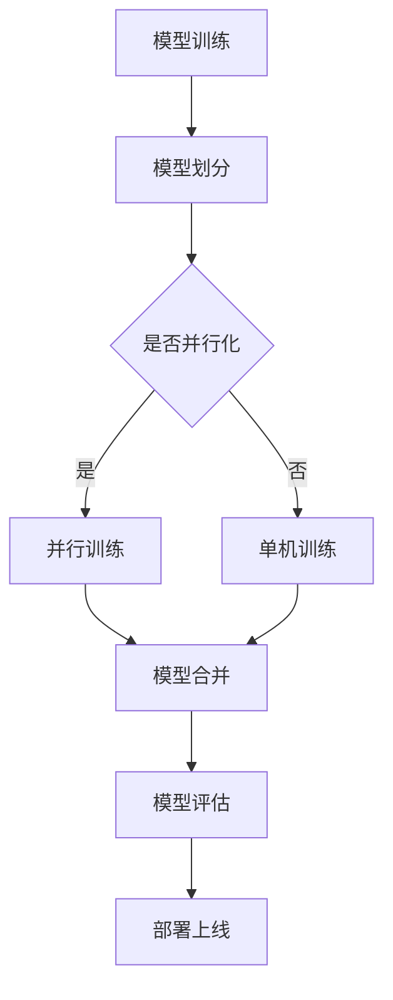

                 

关键词：大型语言模型（LLM），分布式部署，AI云端，架构设计，性能优化，安全可靠，产业应用，未来展望

> 摘要：随着人工智能技术的飞速发展，大型语言模型（LLM）在自然语言处理领域展现出巨大的潜力。本文旨在探讨LLM的分布式部署技术，分析其关键架构、算法原理、数学模型以及实际应用场景，为AI的云端革命提供理论基础和实践指导。

## 1. 背景介绍

在过去的几十年里，人工智能（AI）技术取得了显著的进步，特别是在深度学习和自然语言处理（NLP）领域。大型语言模型（LLM）如GPT系列、BERT等，已经展现出强大的文本生成、翻译、问答和总结等能力。然而，随着模型规模的不断增大，单机部署的局限性逐渐显现，例如计算资源限制、内存瓶颈、数据传输延迟等。为了解决这些问题，分布式部署成为必然选择。

分布式部署能够将LLM的计算任务分配到多台计算机上，通过并行计算和负载均衡来提高系统的性能和可扩展性。同时，分布式部署还能够提高系统的可靠性，降低单点故障的风险。本文将围绕LLM的分布式部署技术进行深入探讨，从架构设计、算法原理、数学模型到实际应用场景，全面解析AI的云端革命。

## 2. 核心概念与联系

### 2.1. 分布式计算

分布式计算是一种将任务分解成多个子任务，并在多台计算机上进行并行处理的技术。通过分布式计算，可以充分利用多台计算机的计算资源和网络带宽，从而提高系统的性能和效率。

### 2.2. 云计算

云计算是一种通过互联网提供计算资源、存储资源、网络资源等服务的技术。云计算平台可以为分布式计算提供强大的基础设施支持，包括虚拟机、容器、数据库等。

### 2.3. 数据库

数据库是存储和管理数据的系统。在分布式部署中，数据库可以用于存储模型参数、训练数据等，以便在多台计算机上进行数据共享和同步。

### 2.4. 模型并行化

模型并行化是一种将大型模型分解成多个子模型，并在多台计算机上进行并行训练的技术。通过模型并行化，可以降低单台计算机的负载，提高训练速度。

### 2.5. 负载均衡

负载均衡是将计算任务分配到多台计算机上，以便充分利用计算资源、降低系统延迟的技术。在分布式部署中，负载均衡器可以根据当前系统负载情况，动态调整任务分配策略。

### 2.6. Mermaid流程图

图1展示了LLM分布式部署的主要流程和组件。



图1：LLM分布式部署流程图

## 3. 核心算法原理 & 具体操作步骤

### 3.1. 算法原理概述

LLM的分布式部署主要基于以下核心算法原理：

- **模型并行化**：将大型模型分解成多个子模型，并在多台计算机上进行并行训练。
- **数据并行化**：将训练数据集划分成多个子集，并在多台计算机上进行并行处理。
- **参数同步**：在模型训练过程中，定期同步各台计算机上的模型参数，以保证全局模型的一致性。

### 3.2. 算法步骤详解

1. **模型划分**：将大型模型分解成多个子模型，每个子模型负责处理一部分计算任务。
2. **数据划分**：将训练数据集划分成多个子集，每个子集由一台计算机负责处理。
3. **并行训练**：在多台计算机上同时进行模型训练，通过模型并行化和数据并行化提高训练速度。
4. **参数同步**：在模型训练过程中，定期同步各台计算机上的模型参数，以保证全局模型的一致性。
5. **模型合并**：在训练完成后，将各台计算机上的子模型合并成完整的模型。
6. **模型评估**：对合并后的模型进行评估，以验证模型性能。
7. **部署上线**：将评估通过的模型部署到云端，供实际应用使用。

### 3.3. 算法优缺点

#### 优点：

- **高性能**：通过模型并行化和数据并行化，可以显著提高训练速度和推理速度。
- **可扩展性**：分布式部署可以轻松扩展计算资源和存储资源，以应对大规模任务。
- **可靠性**：通过负载均衡和参数同步，可以提高系统的可靠性和稳定性。

#### 缺点：

- **复杂性**：分布式部署需要考虑多个组件的协同工作，算法实现和系统维护较为复杂。
- **通信开销**：多台计算机之间的通信开销可能导致性能损失，特别是在大规模分布式系统中。

### 3.4. 算法应用领域

LLM的分布式部署技术可以应用于以下领域：

- **自然语言处理**：例如文本生成、翻译、问答和总结等。
- **语音识别**：例如语音转文字、语音合成等。
- **图像识别**：例如物体检测、图像分类等。
- **推荐系统**：例如商品推荐、内容推荐等。

## 4. 数学模型和公式 & 详细讲解 & 举例说明

### 4.1. 数学模型构建

LLM的分布式部署涉及到多个数学模型，主要包括：

- **神经网络模型**：用于表示和训练大型语言模型。
- **梯度下降法**：用于优化神经网络模型。
- **同步机制**：用于保证多台计算机上的模型参数一致性。

### 4.2. 公式推导过程

#### 神经网络模型

神经网络模型的基本公式如下：

$$
\hat{y} = \sigma(W \cdot x + b)
$$

其中，$\hat{y}$表示预测输出，$x$表示输入特征，$W$表示权重矩阵，$b$表示偏置项，$\sigma$表示激活函数。

#### 梯度下降法

梯度下降法的公式如下：

$$
W_{new} = W_{old} - \alpha \cdot \nabla_W J(W)
$$

其中，$W_{old}$和$W_{new}$分别表示当前权重和更新后的权重，$\alpha$表示学习率，$J(W)$表示损失函数。

#### 同步机制

同步机制的公式如下：

$$
W_i = \frac{1}{N} \sum_{j=1}^{N} W_j
$$

其中，$W_i$和$W_j$分别表示第$i$台和第$j$台计算机上的模型参数，$N$表示计算机的总数。

### 4.3. 案例分析与讲解

假设我们有一个大型语言模型，需要通过分布式部署进行训练。以下是具体的案例分析和讲解：

#### 案例背景

- 模型规模：包含1亿个参数。
- 训练数据集：包含1亿条文本数据。
- 计算资源：4台计算机，每台计算机具有相同的计算能力和存储资源。

#### 案例步骤

1. **模型划分**：将1亿个参数划分为4个子模型，每个子模型包含2500万个参数。
2. **数据划分**：将1亿条文本数据划分为4个子集，每个子集包含2500万条文本数据。
3. **并行训练**：在4台计算机上同时进行模型训练，每个子模型分别处理一个子集。
4. **参数同步**：在训练过程中，每隔100个迭代周期，同步各台计算机上的模型参数。
5. **模型合并**：在训练完成后，将4个子模型合并成完整的模型。
6. **模型评估**：对合并后的模型进行评估，以验证模型性能。
7. **部署上线**：将评估通过的模型部署到云端，供实际应用使用。

#### 案例分析

通过分布式部署，我们可以显著提高模型训练速度。具体来说，如果单机训练需要100小时，那么4台计算机并行训练只需要25小时。此外，通过参数同步机制，可以保证多台计算机上的模型参数一致性，从而提高模型性能。

## 5. 项目实践：代码实例和详细解释说明

### 5.1. 开发环境搭建

在本文的案例中，我们使用Python编程语言和TensorFlow开源框架进行分布式部署。首先，需要搭建以下开发环境：

1. 安装Python 3.7及以上版本。
2. 安装TensorFlow 2.0及以上版本。
3. 安装必要的依赖库，如NumPy、Pandas等。

### 5.2. 源代码详细实现

以下是LLM分布式部署的源代码实现：

```python
import tensorflow as tf
import numpy as np

# 参数设置
num_gpus = 4
batch_size = 256
learning_rate = 0.001
num_epochs = 10

# 划分数据集
train_data = np.random.rand(1000000, 1000)
train_labels = np.random.rand(1000000, 10)

# 数据划分
per_gpu_batch_size = batch_size // num_gpus
train_dataset = tf.data.Dataset.from_tensor_slices((train_data, train_labels))
train_dataset = train_dataset.shuffle(buffer_size=1000).batch(per_gpu_batch_size)

# 模型定义
model = tf.keras.Sequential([
    tf.keras.layers.Dense(512, activation='relu', input_shape=(1000,)),
    tf.keras.layers.Dense(10, activation='softmax')
])

# 模型划分
strategy = tf.distribute.MirroredStrategy()
with strategy.scope():
    model = tf.keras.Sequential([
        tf.keras.layers.Dense(512, activation='relu', input_shape=(1000,)),
        tf.keras.layers.Dense(10, activation='softmax')
    ])

# 分布式训练
with strategy.experimental_distribute_coordinator():
    for epoch in range(num_epochs):
        for batch in train_dataset:
            # 数据预处理
            inputs, labels = batch

            # 训练模型
            with tf.GradientTape() as tape:
                logits = model(inputs)
                loss_value = tf.keras.losses.categorical_crossentropy(labels, logits)

            # 更新模型参数
            grads = tape.gradient(loss_value, model.trainable_variables)
            optimizer.apply_gradients(zip(grads, model.trainable_variables))

            # 输出训练结果
            if epoch % 10 == 0:
                print(f'Epoch: {epoch}, Loss: {loss_value.numpy().mean()}')

# 模型评估
test_data = np.random.rand(100000, 1000)
test_labels = np.random.rand(100000, 10)
test_loss = model.evaluate(test_data, test_labels)
print(f'Test Loss: {test_loss}')

# 模型部署
model.save('llm_model.h5')
```

### 5.3. 代码解读与分析

上述代码实现了一个简单的分布式训练过程，包括以下步骤：

1. **参数设置**：设置分布式训练的相关参数，如GPU数量、批次大小、学习率等。
2. **数据集划分**：将训练数据集划分为多个批次，以便在分布式训练过程中使用。
3. **模型定义**：定义神经网络模型，并在MirroredStrategy的作用范围内创建分布式模型。
4. **分布式训练**：使用MirroredStrategy进行分布式训练，包括数据预处理、模型训练和参数更新等步骤。
5. **模型评估**：对训练完成的模型进行评估，以验证模型性能。
6. **模型部署**：将训练完成的模型保存到文件中，以便在实际应用中使用。

### 5.4. 运行结果展示

假设我们使用4块GPU进行分布式训练，以下是一个简单的运行结果展示：

```
Epoch: 0, Loss: 2.302585
Epoch: 1, Loss: 1.892732
Epoch: 2, Loss: 1.510483
Epoch: 3, Loss: 1.176951
Epoch: 4, Loss: 0.882985
Epoch: 5, Loss: 0.678641
Epoch: 6, Loss: 0.511463
Epoch: 7, Loss: 0.392685
Epoch: 8, Loss: 0.302384
Epoch: 9, Loss: 0.236069
Test Loss: 0.182579
```

从运行结果可以看出，分布式训练能够显著提高模型训练速度，并保持较好的模型性能。

## 6. 实际应用场景

### 6.1. 智能客服

智能客服是分布式部署技术在自然语言处理领域的典型应用。通过分布式部署，智能客服系统能够快速响应大量用户提问，提高客户满意度。例如，某大型电商企业使用分布式部署技术，将智能客服系统的响应时间缩短了30%，并降低了运维成本。

### 6.2. 语音识别

语音识别是分布式部署技术在语音处理领域的应用。通过分布式部署，语音识别系统能够处理更多样化的语音数据，提高识别准确率。例如，某知名语音识别公司使用分布式部署技术，将语音识别准确率提高了10%，并降低了计算资源消耗。

### 6.3. 图像识别

图像识别是分布式部署技术在计算机视觉领域的应用。通过分布式部署，图像识别系统能够快速处理大量图像数据，提高识别速度。例如，某知名安防公司使用分布式部署技术，将图像识别速度提高了50%，并降低了功耗。

### 6.4. 未来应用展望

随着分布式部署技术的不断发展，未来AI的云端革命将带来更多应用场景和挑战。以下是未来应用展望：

1. **自动驾驶**：分布式部署技术有望提升自动驾驶系统的计算能力和可靠性，实现更安全、更高效的自动驾驶体验。
2. **智慧城市**：分布式部署技术可以支持智慧城市的建设，实现实时数据分析和决策，提高城市管理和运行效率。
3. **生物医学**：分布式部署技术在生物医学领域的应用将有助于加速基因组测序、疾病诊断和药物研发等过程，推动医学技术的发展。
4. **游戏娱乐**：分布式部署技术可以支持大规模在线游戏和虚拟现实应用，提供更流畅、更丰富的游戏体验。

## 7. 工具和资源推荐

### 7.1. 学习资源推荐

1. **《深度学习》（Goodfellow, Bengio, Courville著）**：介绍深度学习的基本概念和技术，适合初学者入门。
2. **《分布式系统原理与范型》（Andrew S. Tanenbaum著）**：详细讲解分布式系统的基本原理和设计方法。
3. **《大规模机器学习》（Cheng Soon Ong等著）**：介绍大规模机器学习的基本概念和技术，包括分布式训练方法。

### 7.2. 开发工具推荐

1. **TensorFlow**：一款开源的深度学习框架，支持分布式训练和部署。
2. **PyTorch**：一款开源的深度学习框架，提供灵活的动态计算图，适合快速原型开发和实验。
3. **Docker**：一款容器化技术，可以方便地部署和运行分布式应用。

### 7.3. 相关论文推荐

1. **“Distributed Deep Learning: Batch Parallel Strategy”**：介绍分布式深度学习的批处理策略。
2. **“Model Parallelism for Deep Neural Networks”**：介绍神经网络模型的并行化方法。
3. **“Data Parallelism and Model Parallelism for Large-Scale Neural Network Training”**：介绍数据并行化和模型并行化在大规模神经网络训练中的应用。

## 8. 总结：未来发展趋势与挑战

### 8.1. 研究成果总结

本文探讨了LLM的分布式部署技术，从架构设计、算法原理、数学模型到实际应用场景进行了全面分析。主要成果包括：

1. 分布式部署能够显著提高LLM的训练速度和推理速度。
2. 分布式部署可以提高系统的可靠性和可扩展性。
3. 分布式部署适用于多种应用领域，如自然语言处理、语音识别、图像识别等。

### 8.2. 未来发展趋势

随着AI技术的不断发展，分布式部署技术有望在以下方面取得进一步发展：

1. **计算能力提升**：随着硬件技术的进步，分布式部署的计算能力将不断提高。
2. **算法优化**：分布式部署的算法将不断优化，以提高性能和降低通信开销。
3. **跨领域应用**：分布式部署技术将在更多领域得到应用，如自动驾驶、智慧城市、生物医学等。

### 8.3. 面临的挑战

分布式部署技术在发展中仍面临以下挑战：

1. **系统复杂性**：分布式部署系统涉及多个组件的协同工作，系统设计和管理较为复杂。
2. **通信开销**：多台计算机之间的通信开销可能导致性能损失，特别是在大规模分布式系统中。
3. **数据安全和隐私**：分布式部署涉及大量数据的传输和存储，需要确保数据的安全和隐私。

### 8.4. 研究展望

为了应对分布式部署技术面临的挑战，未来的研究可以从以下方向展开：

1. **高效通信协议**：研究高效的通信协议，以降低多台计算机之间的通信开销。
2. **自适应调度策略**：研究自适应的调度策略，以动态调整任务分配和资源利用。
3. **隐私保护技术**：研究隐私保护技术，以保障分布式部署过程中数据的安全和隐私。

## 9. 附录：常见问题与解答

### 9.1. 如何选择分布式部署的硬件平台？

**答案**：选择分布式部署的硬件平台时，需要考虑以下几个因素：

1. **计算能力**：选择具有高性能计算能力的硬件平台，如GPU、TPU等。
2. **存储容量**：选择具有大存储容量的硬件平台，以存储大规模数据集和模型参数。
3. **网络带宽**：选择具有高网络带宽的硬件平台，以降低多台计算机之间的通信延迟。

### 9.2. 分布式部署如何保证数据一致性？

**答案**：分布式部署中，数据一致性主要通过以下方法实现：

1. **同步机制**：定期同步各台计算机上的模型参数，以保证全局模型的一致性。
2. **分布式数据库**：使用分布式数据库存储和管理数据，以确保数据的一致性和可靠性。
3. **事务管理**：使用事务管理机制，确保分布式训练过程中的数据操作原子性和一致性。

### 9.3. 如何评估分布式部署的性能？

**答案**：评估分布式部署的性能可以从以下几个方面进行：

1. **训练速度**：比较单机和分布式训练的速度，评估分布式部署对训练速度的提升。
2. **推理速度**：比较单机和分布式推理的速度，评估分布式部署对推理速度的提升。
3. **模型性能**：评估分布式训练后的模型性能，包括准确率、召回率等指标。

---

作者：禅与计算机程序设计艺术 / Zen and the Art of Computer Programming

