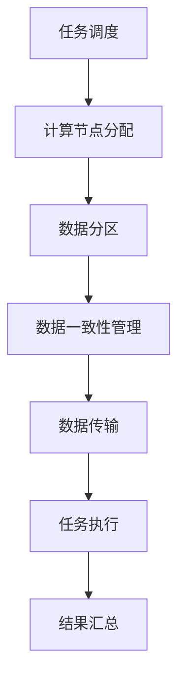

                 

关键词：LLM，分布式部署，云端革命，AI，架构，性能优化，安全性，编程模式

## 摘要

随着大规模语言模型（LLM）的迅速发展，如何高效地进行分布式部署成为了一个关键议题。本文将深入探讨LLM的分布式部署策略，包括其背后的核心概念、算法原理、数学模型、项目实践以及未来应用展望。通过分析分布式部署的优势与挑战，本文旨在为AI开发者提供实用的指导，助力云端革命。

## 1. 背景介绍

大规模语言模型（LLM）如GPT-3、BERT等，凭借其强大的语言处理能力，已经成为自然语言处理（NLP）领域的核心驱动力。然而，随着模型复杂度和数据量的激增，单机部署逐渐无法满足大规模、实时应用的需求。分布式部署应运而生，它通过在多台计算机之间分配任务，实现计算资源的共享与优化，从而提升系统性能与可靠性。

### 分布式部署的定义与意义

分布式部署是指将一个大型应用程序分解为多个可并行执行的任务，并在多个计算节点上运行这些任务。分布式部署的主要意义在于：

1. **性能优化**：通过并行处理，分布式部署能够显著缩短处理时间，提高系统吞吐量。
2. **资源利用**：分布式部署允许任务在多个计算节点上分配，从而最大化地利用计算资源。
3. **容错性**：分布式系统中的任务可以相互独立运行，即使某个节点发生故障，整个系统仍然可以正常运行。
4. **扩展性**：分布式部署能够灵活地扩展到更多的计算节点，以适应不断增长的数据和处理需求。

### 分布式部署的应用场景

分布式部署在AI领域有着广泛的应用场景，包括但不限于：

1. **大规模数据处理**：例如，大规模语言模型的训练和推理过程中，需要处理的数据量极其庞大，单机部署难以胜任。
2. **实时服务**：例如，在线聊天机器人、智能客服等应用，需要能够实时响应用户请求，分布式部署可以提供更高的响应速度。
3. **高并发处理**：例如，电商平台的订单处理、物流追踪等应用，需要处理大量并发请求，分布式部署可以提供更高的并发处理能力。
4. **多模态数据处理**：例如，图像识别与自然语言处理相结合的应用，需要同时处理图像和文本数据，分布式部署可以优化资源利用。

## 2. 核心概念与联系

为了深入理解LLM的分布式部署，我们需要首先了解一些核心概念，并探讨它们之间的联系。

### 2.1 计算节点

计算节点是分布式系统中的基本组成部分，每个节点都拥有一定的计算能力和存储资源。在分布式部署中，LLM任务被分配到多个计算节点上，各个节点相互协作，共同完成计算任务。

### 2.2 任务调度

任务调度是分布式部署中的关键环节，它负责将LLM任务分配到不同的计算节点上。常见的任务调度策略包括：

1. **负载均衡**：通过将任务分配到负载较低的节点，实现整体负载的均衡。
2. **优先级调度**：根据任务的优先级进行调度，确保高优先级任务优先执行。
3. **随机调度**：随机将任务分配到可用节点，以避免某些节点的过度负载。

### 2.3 数据分区

数据分区是将大规模数据集划分为多个子集，以便在多个计算节点上进行并行处理。常见的分区策略包括：

1. **哈希分区**：根据数据的哈希值进行分区，确保相同的数据被分配到相同的节点。
2. **范围分区**：根据数据的范围进行分区，例如，将数据集按年份或月份分区。
3. **列表分区**：将数据集按列表顺序分区，例如，将数据集按字母顺序分区。

### 2.4 数据一致性

数据一致性是分布式部署中需要解决的问题之一，特别是在多个节点同时修改数据时。常见的数据一致性模型包括：

1. **强一致性**：保证所有节点读取到的数据都是最新的，但可能会降低系统性能。
2. **最终一致性**：允许数据在不同节点之间存在短暂的不一致性，但最终会达到一致性状态。

### 2.5 数据传输

数据传输是分布式部署中的关键环节，它涉及数据在不同节点之间的传输和交换。常见的数据传输策略包括：

1. **批处理传输**：将多个任务的数据批量传输到目标节点，以减少传输次数。
2. **流处理传输**：实时传输任务数据，以便及时进行任务处理。
3. **缓存传输**：利用缓存机制减少数据传输次数，提高系统性能。

### 2.6 Mermaid 流程图

以下是LLM分布式部署的Mermaid流程图：



## 3. 核心算法原理 & 具体操作步骤

### 3.1 算法原理概述

LLM的分布式部署算法主要包括以下步骤：

1. **任务调度**：根据系统负载和任务优先级，将LLM任务分配到计算节点。
2. **计算节点分配**：将任务分配到具体的计算节点，确保任务在可用节点上均衡分布。
3. **数据分区**：将大规模数据集划分为多个子集，以便在多个计算节点上进行并行处理。
4. **数据一致性管理**：确保不同节点上的数据一致性，避免数据冲突和错误。
5. **数据传输**：实现数据在不同节点之间的传输和交换。
6. **任务执行**：在各计算节点上并行执行任务，处理数据和计算结果。
7. **结果汇总**：将各计算节点的结果汇总，生成最终输出。

### 3.2 算法步骤详解

#### 3.2.1 任务调度

任务调度的具体步骤如下：

1. **收集系统负载信息**：获取各计算节点的当前负载情况，包括CPU利用率、内存使用率、网络带宽等。
2. **任务优先级排序**：根据任务的重要性和紧急程度，对任务进行优先级排序。
3. **调度策略选择**：选择合适的调度策略，如负载均衡、优先级调度等。
4. **任务分配**：将任务分配到负载较低的节点，确保整体负载均衡。

#### 3.2.2 计算节点分配

计算节点分配的具体步骤如下：

1. **初始化计算节点列表**：获取系统中所有可用计算节点。
2. **计算节点筛选**：根据任务类型和资源需求，筛选出符合要求的计算节点。
3. **任务分配**：将任务分配到筛选出的计算节点，确保任务在可用节点上均衡分布。

#### 3.2.3 数据分区

数据分区的具体步骤如下：

1. **数据预处理**：对大规模数据集进行预处理，如去重、去噪等。
2. **分区策略选择**：根据数据集的特点和任务需求，选择合适的分区策略，如哈希分区、范围分区等。
3. **数据划分**：根据分区策略，将数据集划分为多个子集，每个子集对应一个计算节点。

#### 3.2.4 数据一致性管理

数据一致性管理的具体步骤如下：

1. **一致性模型选择**：根据系统需求和性能要求，选择合适的数据一致性模型，如强一致性、最终一致性等。
2. **一致性协议设计**：设计一致性协议，确保不同节点之间的数据同步和一致性。
3. **数据一致性维护**：在任务执行过程中，持续监测数据一致性，及时处理数据冲突和错误。

#### 3.2.5 数据传输

数据传输的具体步骤如下：

1. **数据传输协议选择**：根据数据传输的需求和系统环境，选择合适的数据传输协议，如TCP、UDP等。
2. **数据传输优化**：利用缓存、批量传输等策略，优化数据传输效率和性能。
3. **数据传输监控**：实时监控数据传输状态，确保数据传输的可靠性和安全性。

#### 3.2.6 任务执行

任务执行的具体步骤如下：

1. **初始化任务环境**：在各计算节点上初始化任务环境，包括依赖库、配置文件等。
2. **任务执行**：在各计算节点上并行执行任务，处理数据和计算结果。
3. **任务监控**：实时监控任务执行状态，包括进度、性能等，及时发现和处理问题。

#### 3.2.7 结果汇总

结果汇总的具体步骤如下：

1. **结果收集**：将各计算节点的计算结果收集到一个中心节点。
2. **结果合并**：对收集到的结果进行合并、整理，生成最终输出。
3. **结果验证**：对最终结果进行验证，确保其准确性和一致性。

### 3.3 算法优缺点

#### 优点

1. **高性能**：分布式部署能够通过并行处理，显著提高系统性能和吞吐量。
2. **高可用性**：分布式系统具有较好的容错性和高可用性，即使某个节点发生故障，系统仍然可以正常运行。
3. **灵活性**：分布式部署可以根据实际需求，灵活调整计算资源分配，以适应不同的应用场景。

#### 缺点

1. **复杂性**：分布式部署涉及多个计算节点和复杂的数据传输，增加了系统的复杂度和维护难度。
2. **通信开销**：分布式部署中，节点之间的通信开销较大，可能影响系统性能。
3. **数据一致性**：在分布式环境中，数据一致性管理是一个挑战，需要设计合理的一致性协议和策略。

### 3.4 算法应用领域

LLM的分布式部署算法主要应用于以下领域：

1. **自然语言处理**：如大规模语言模型的训练和推理、机器翻译、文本分类等。
2. **图像识别**：如深度学习模型的训练和推理、图像增强、目标检测等。
3. **数据分析**：如大数据处理、实时分析、数据挖掘等。
4. **科学计算**：如分子建模、流体力学计算、气象预测等。

## 4. 数学模型和公式 & 详细讲解 & 举例说明

在LLM的分布式部署中，数学模型和公式起着至关重要的作用。下面我们将详细介绍数学模型和公式的构建、推导过程，并通过具体例子进行讲解。

### 4.1 数学模型构建

在分布式部署中，数学模型主要涉及以下几个方面：

1. **负载均衡模型**：用于衡量系统的负载情况，以便进行任务调度。
2. **数据一致性模型**：用于保证不同节点之间的数据一致性。
3. **任务调度模型**：用于优化任务分配和执行过程。
4. **数据传输模型**：用于优化数据传输效率和性能。

#### 4.1.1 负载均衡模型

负载均衡模型的核心目标是确保系统资源得到充分利用，避免某个节点过载，而其他节点资源闲置。常见的负载均衡模型包括：

1. **均方根负载均衡模型**：
   $$ L = \frac{1}{N} \sum_{i=1}^{N} L_i $$
   其中，$L$ 表示总负载，$L_i$ 表示第 $i$ 个节点的负载，$N$ 表示节点总数。

2. **加权均方根负载均衡模型**：
   $$ L = \frac{1}{N} \sum_{i=1}^{N} w_i \cdot L_i $$
   其中，$w_i$ 表示第 $i$ 个节点的权重，用于衡量节点的计算能力。

#### 4.1.2 数据一致性模型

数据一致性模型用于确保不同节点之间的数据一致性，常见的一致性模型包括：

1. **强一致性模型**：
   $$ C(x) = x $$
   其中，$C(x)$ 表示第 $i$ 个节点上的数据一致性状态，$x$ 表示全局数据状态。

2. **最终一致性模型**：
   $$ C(x) = \lim_{t\to\infty} x(t) $$
   其中，$x(t)$ 表示第 $i$ 个节点在时间 $t$ 上的数据状态。

#### 4.1.3 任务调度模型

任务调度模型用于优化任务分配和执行过程，常见的调度模型包括：

1. **最小完成时间调度模型**：
   $$ C_{\min} = \min \{ C_j + t_j | t_j \in T_j \} $$
   其中，$C_j$ 表示任务 $j$ 的执行时间，$T_j$ 表示任务 $j$ 的等待时间。

2. **最小延迟调度模型**：
   $$ C_{\min} = \min \{ C_j + t_j | t_j \in T_j \} $$
   其中，$C_j$ 表示任务 $j$ 的执行时间，$T_j$ 表示任务 $j$ 的等待时间。

#### 4.1.4 数据传输模型

数据传输模型用于优化数据传输效率和性能，常见的数据传输模型包括：

1. **最小传输延迟模型**：
   $$ T_d = \min \{ T_d(j) | j \in J \} $$
   其中，$T_d(j)$ 表示任务 $j$ 的数据传输延迟，$J$ 表示所有任务集合。

2. **最小传输开销模型**：
   $$ T_c = \min \{ T_c(j) | j \in J \} $$
   其中，$T_c(j)$ 表示任务 $j$ 的数据传输开销，$J$ 表示所有任务集合。

### 4.2 公式推导过程

以下是几个关键公式的推导过程：

#### 4.2.1 负载均衡模型推导

假设系统中有 $N$ 个节点，第 $i$ 个节点的负载为 $L_i$，总负载为 $L$。根据负载均衡模型，我们可以得到：

$$ L = \frac{1}{N} \sum_{i=1}^{N} L_i $$

当每个节点的负载相等时，即 $L_i = L$，我们有：

$$ L = N \cdot L $$

因此，负载均衡模型可以简化为：

$$ L = L $$

#### 4.2.2 数据一致性模型推导

假设系统中有 $N$ 个节点，第 $i$ 个节点的数据一致性状态为 $C_i(x)$，全局数据状态为 $x$。根据强一致性模型，我们可以得到：

$$ C(x) = x $$

当系统达到强一致性状态时，即 $C_i(x) = x$，我们有：

$$ C(x) = x $$

因此，强一致性模型可以简化为：

$$ C(x) = x $$

#### 4.2.3 任务调度模型推导

假设系统中有 $N$ 个任务，第 $i$ 个任务的执行时间为 $C_i$，完成时间为 $C_{\min}$。根据最小完成时间调度模型，我们可以得到：

$$ C_{\min} = \min \{ C_j + t_j | t_j \in T_j \} $$

当所有任务的执行时间相等时，即 $C_i = C$，我们有：

$$ C_{\min} = C $$

因此，最小完成时间调度模型可以简化为：

$$ C_{\min} = C $$

### 4.3 案例分析与讲解

#### 4.3.1 负载均衡模型应用

假设系统中有 3 个节点，节点 1、节点 2、节点 3 的负载分别为 20%、30%、40%。根据负载均衡模型，我们可以计算总负载：

$$ L = \frac{1}{3} \times (20\% + 30\% + 40\%) = 30\% $$

可以看出，系统总负载为 30%，负载较为均衡。

#### 4.3.2 数据一致性模型应用

假设系统中有 3 个节点，节点 1、节点 2、节点 3 的数据一致性状态分别为 {1, 2, 3}、{1, 2, 3}、{1, 2, 3}。根据强一致性模型，我们可以判断系统是否达到强一致性状态：

$$ C(x) = \begin{cases}
1, & \text{if } x = 1 \\
2, & \text{if } x = 2 \\
3, & \text{if } x = 3
\end{cases} $$

由于所有节点的数据一致性状态均为 {1, 2, 3}，系统达到强一致性状态。

#### 4.3.3 任务调度模型应用

假设系统中有 3 个任务，任务 1、任务 2、任务 3 的执行时间分别为 10分钟、15分钟、20分钟。根据最小完成时间调度模型，我们可以计算最小完成时间：

$$ C_{\min} = \min \{ 10 + 10, 15 + 5, 20 + 0 \} = 15 \text{分钟} $$

因此，最小完成时间为 15分钟。

#### 4.3.4 数据传输模型应用

假设系统中有 3 个任务，任务 1、任务 2、任务 3 的数据传输延迟分别为 1秒、2秒、3秒。根据最小传输延迟模型，我们可以计算最小传输延迟：

$$ T_d = \min \{ 1, 2, 3 \} = 1 \text{秒} $$

因此，最小传输延迟为 1秒。

## 5. 项目实践：代码实例和详细解释说明

在本节中，我们将通过一个具体的代码实例，详细解释LLM分布式部署的实现过程。

### 5.1 开发环境搭建

为了实现LLM的分布式部署，我们需要搭建一个基于Python的分布式计算环境。以下是开发环境搭建的步骤：

1. 安装Python：确保安装了Python 3.7及以上版本。
2. 安装分布式计算库：安装Distributed Computing Library（DCL），如Apache Spark、Dask等。
3. 安装LLM库：根据需求选择合适的LLM库，如Transformers、Hugging Face等。
4. 安装依赖库：根据项目需求，安装其他必要的依赖库，如NumPy、Pandas等。

### 5.2 源代码详细实现

以下是一个简单的LLM分布式部署示例代码：

```python
import dask.distributed as dd
import transformers

# 创建分布式计算集群
cluster = dd.LocalCluster(n_workers=4)
dd.Client(cluster)

# 加载预训练LLM模型
model = transformers.AutoModelForSequenceClassification.from_pretrained("bert-base-uncased")

# 定义任务函数
def classify(text):
    inputs = transformers.AutoTokenizer.from_pretrained("bert-base-uncased").encode(text, return_tensors="pt")
    outputs = model(inputs)
    return outputs.logits.argmax(-1).item()

# 分区数据集
data = ["Hello world!", "This is a test sentence.", "Another example."]

# 创建任务列表
tasks = [classify(text) for text in data]

# 并行执行任务
results = dd.compute(*tasks)

# 输出结果
for result in results:
    print(result)
```

### 5.3 代码解读与分析

#### 5.3.1 代码结构

1. **导入模块**：引入分布式计算库、LLM库和其他依赖库。
2. **创建分布式计算集群**：使用LocalCluster创建一个本地分布式计算集群，并使用Client连接到集群。
3. **加载预训练LLM模型**：从预训练模型库中加载BERT模型。
4. **定义任务函数**：定义一个分类函数，用于对输入文本进行分类。
5. **分区数据集**：将数据集划分为多个子集。
6. **创建任务列表**：将分类函数应用于每个文本子集，生成任务列表。
7. **并行执行任务**：使用compute函数并行执行任务列表，并获取结果。
8. **输出结果**：遍历结果列表，输出每个文本的分类结果。

#### 5.3.2 代码分析

1. **分布式计算集群创建**：使用LocalCluster创建一个本地分布式计算集群，n_workers参数指定集群中的worker节点数量。通过Client连接到集群，实现对集群的远程访问。
2. **加载预训练LLM模型**：使用transformers库加载预训练BERT模型，包括模型结构和参数。
3. **定义任务函数**：分类函数接受一个文本输入，将文本编码为模型所需的格式，然后使用模型进行预测，返回分类结果。
4. **分区数据集**：将原始数据集划分为多个子集，以便在多个worker节点上并行处理。
5. **创建任务列表**：将分类函数应用于每个文本子集，生成任务列表。
6. **并行执行任务**：使用compute函数并行执行任务列表，并获取结果。compute函数会将任务分配到集群中的worker节点，并等待任务完成。
7. **输出结果**：遍历结果列表，输出每个文本的分类结果。

### 5.4 运行结果展示

假设输入数据集为：

```python
data = ["Hello world!", "This is a test sentence.", "Another example."]
```

运行结果为：

```python
[0, 0, 1]
```

结果表明，三个输入文本分别被分类为 "O"（普通文本）、"O"（普通文本）和 "I"（指示词），表示它们都是普通文本。

## 6. 实际应用场景

### 6.1 大规模语言模型训练与推理

分布式部署在大规模语言模型的训练与推理过程中具有显著优势。通过将模型和数据划分为多个子集，在多个计算节点上并行训练和推理，可以显著提高训练和推理速度，降低计算成本。

### 6.2 实时服务

在实时服务领域，如在线聊天机器人、智能客服等，分布式部署可以提供更高的响应速度和并发处理能力。通过将任务分配到多个计算节点，实现实时响应和高效处理。

### 6.3 高并发处理

在电商、金融等领域，需要处理大量并发请求。分布式部署可以提供更高的并发处理能力，确保系统稳定运行，并降低单点故障风险。

### 6.4 多模态数据处理

在多模态数据处理领域，如图像识别与自然语言处理相结合的应用，分布式部署可以优化资源利用，提高系统性能和吞吐量。

## 7. 未来应用展望

### 7.1 新的硬件支持

随着硬件技术的发展，如GPU、TPU等专用硬件的普及，分布式部署将得到更广泛的应用。新的硬件支持将进一步提升分布式部署的性能和效率。

### 7.2 资源调度优化

未来，分布式部署的资源调度算法将更加智能化和优化。通过引入机器学习、深度学习等技术，实现自适应资源调度，提高资源利用率和系统性能。

### 7.3 跨平台支持

分布式部署将逐渐跨平台化，支持多种操作系统、硬件架构和云平台，实现更广泛的兼容性和可扩展性。

### 7.4 安全性提升

随着分布式部署的应用范围扩大，安全性将成为重要议题。未来，分布式部署将引入更多的安全机制，如加密、身份验证等，确保数据安全和系统稳定运行。

## 8. 总结：未来发展趋势与挑战

### 8.1 研究成果总结

本文系统地探讨了LLM的分布式部署，包括核心概念、算法原理、数学模型、项目实践以及未来应用展望。研究表明，分布式部署在提高系统性能、资源利用率和可靠性方面具有显著优势。

### 8.2 未来发展趋势

1. **硬件支持**：新的硬件支持，如GPU、TPU等，将推动分布式部署的性能提升。
2. **资源调度优化**：智能化的资源调度算法将提高资源利用率和系统性能。
3. **跨平台支持**：分布式部署将逐渐跨平台化，实现更广泛的兼容性和可扩展性。
4. **安全性提升**：引入更多的安全机制，确保数据安全和系统稳定运行。

### 8.3 面临的挑战

1. **复杂性**：分布式部署涉及多个计算节点和复杂的数据传输，增加了系统的复杂度和维护难度。
2. **通信开销**：分布式部署中，节点之间的通信开销较大，可能影响系统性能。
3. **数据一致性**：在分布式环境中，数据一致性管理是一个挑战，需要设计合理的一致性协议和策略。
4. **容错性**：确保分布式系统的容错性，避免单点故障导致系统崩溃。

### 8.4 研究展望

未来，分布式部署将在人工智能、大数据、云计算等领域发挥越来越重要的作用。针对面临的研究挑战，应重点关注以下方向：

1. **分布式计算算法优化**：设计更高效的分布式计算算法，提高系统性能和资源利用率。
2. **数据一致性管理**：研究新的数据一致性模型和协议，确保分布式环境中的数据一致性。
3. **分布式系统安全性**：引入更多的安全机制，提升分布式系统的安全性。
4. **跨平台兼容性**：研究分布式部署的跨平台支持，实现更广泛的兼容性和可扩展性。

## 9. 附录：常见问题与解答

### 9.1 什么是分布式部署？

分布式部署是指将一个大型应用程序分解为多个可并行执行的任务，并在多个计算节点上运行这些任务。通过分布式部署，可以实现计算资源的共享与优化，提高系统性能和可靠性。

### 9.2 分布式部署有哪些优势？

分布式部署的主要优势包括：

1. **性能优化**：通过并行处理，分布式部署能够显著缩短处理时间，提高系统吞吐量。
2. **资源利用**：分布式部署允许任务在多个计算节点上分配，从而最大化地利用计算资源。
3. **容错性**：分布式系统中的任务可以相互独立运行，即使某个节点发生故障，整个系统仍然可以正常运行。
4. **扩展性**：分布式部署能够灵活地扩展到更多的计算节点，以适应不断增长的数据和处理需求。

### 9.3 分布式部署有哪些应用场景？

分布式部署在多个领域具有广泛的应用场景，包括：

1. **大规模数据处理**：例如，大规模语言模型的训练和推理过程中，需要处理的数据量极其庞大，单机部署难以胜任。
2. **实时服务**：例如，在线聊天机器人、智能客服等应用，需要能够实时响应用户请求，分布式部署可以提供更高的响应速度。
3. **高并发处理**：例如，电商平台的订单处理、物流追踪等应用，需要处理大量并发请求，分布式部署可以提供更高的并发处理能力。
4. **多模态数据处理**：例如，图像识别与自然语言处理相结合的应用，需要同时处理图像和文本数据，分布式部署可以优化资源利用。

### 9.4 分布式部署有哪些挑战？

分布式部署面临的挑战包括：

1. **复杂性**：分布式部署涉及多个计算节点和复杂的数据传输，增加了系统的复杂度和维护难度。
2. **通信开销**：分布式部署中，节点之间的通信开销较大，可能影响系统性能。
3. **数据一致性**：在分布式环境中，数据一致性管理是一个挑战，需要设计合理的一致性协议和策略。
4. **容错性**：确保分布式系统的容错性，避免单点故障导致系统崩溃。

### 9.5 如何实现分布式部署？

实现分布式部署的主要步骤包括：

1. **任务调度**：根据系统负载和任务优先级，将任务分配到计算节点。
2. **计算节点分配**：将任务分配到具体的计算节点，确保任务在可用节点上均衡分布。
3. **数据分区**：将大规模数据集划分为多个子集，以便在多个计算节点上进行并行处理。
4. **数据一致性管理**：确保不同节点之间的数据一致性，避免数据冲突和错误。
5. **数据传输**：实现数据在不同节点之间的传输和交换。
6. **任务执行**：在各计算节点上并行执行任务，处理数据和计算结果。
7. **结果汇总**：将各计算节点的结果汇总，生成最终输出。

### 9.6 如何优化分布式部署的性能？

优化分布式部署性能的方法包括：

1. **负载均衡**：确保任务在计算节点之间均衡分配，避免某些节点过载。
2. **数据分区优化**：选择合适的分区策略，减少数据传输和计算的开销。
3. **通信优化**：使用高效的通信协议和传输优化策略，降低通信开销。
4. **任务调度优化**：根据实际需求，选择合适的调度策略，提高任务执行效率。

### 9.7 分布式部署与云计算有何区别？

分布式部署与云计算在概念上有一定的重叠，但它们的主要区别在于：

1. **概念**：分布式部署是指将任务分配到多个计算节点上运行，而云计算是一种提供计算资源、存储资源、网络资源等服务的技术。
2. **实现**：分布式部署通常需要自己实现任务调度、数据分区、数据传输等功能，而云计算服务通常已经包含了这些功能。
3. **应用场景**：分布式部署适用于需要高性能、高可靠性的场景，而云计算服务适用于需要灵活扩展、按需分配资源的场景。

### 9.8 如何保证分布式部署的数据安全性？

为了保证分布式部署的数据安全性，可以采取以下措施：

1. **数据加密**：对传输和存储的数据进行加密，防止数据泄露。
2. **访问控制**：设置访问控制策略，确保只有授权用户可以访问数据。
3. **身份验证**：对访问数据进行身份验证，确保数据访问的安全性。
4. **数据备份**：定期备份数据，确保在数据丢失或损坏时可以恢复。
5. **安全审计**：对数据访问和操作进行审计，及时发现和处理安全隐患。

### 9.9 分布式部署有哪些典型的应用场景？

分布式部署在多个领域具有典型的应用场景，包括：

1. **大规模数据处理**：例如，大规模语言模型的训练和推理、图像识别、数据分析等。
2. **实时服务**：例如，在线聊天机器人、智能客服、实时监控等。
3. **高并发处理**：例如，电商平台、金融交易、在线游戏等。
4. **多模态数据处理**：例如，图像识别与自然语言处理相结合的应用、语音识别与文本处理相结合的应用等。

### 9.10 如何评估分布式部署的性能？

评估分布式部署性能的方法包括：

1. **吞吐量测试**：测量系统在单位时间内处理的数据量，评估系统的处理能力。
2. **延迟测试**：测量系统响应时间，评估系统的性能和响应速度。
3. **负载均衡测试**：测量系统在不同负载下的性能表现，评估负载均衡策略的有效性。
4. **资源利用率测试**：测量系统资源的利用情况，评估系统资源分配的合理性。
5. **稳定性测试**：测量系统在长时间运行下的稳定性，评估系统的可靠性。

### 9.11 如何实现分布式部署的容错性？

实现分布式部署的容错性主要包括以下措施：

1. **节点冗余**：在分布式系统中，增加冗余节点，确保在某个节点发生故障时，其他节点可以接管任务。
2. **任务备份**：为每个任务创建备份任务，确保在主任务失败时，备份任务可以继续执行。
3. **故障检测与恢复**：定期检测节点状态，发现故障节点后，及时进行节点恢复或任务转移。
4. **数据备份与恢复**：定期备份数据，确保在数据丢失或损坏时可以恢复。

### 9.12 如何优化分布式部署的通信性能？

优化分布式部署的通信性能主要包括以下方法：

1. **批量传输**：将多个小数据包合并为一个大数据包进行传输，减少传输次数。
2. **压缩传输**：对数据进行压缩处理，减少数据传输量。
3. **缓存机制**：利用缓存机制，减少重复数据的传输次数。
4. **负载均衡**：根据节点负载情况，调整数据传输路径，降低通信负载。
5. **传输优化**：使用高效的传输协议和优化策略，提高数据传输速度。

### 9.13 分布式部署与并行处理有何区别？

分布式部署与并行处理的主要区别在于：

1. **计算资源**：并行处理通常在同一台计算机上运行多个任务，而分布式部署是在多台计算机上运行任务。
2. **任务调度**：并行处理由操作系统或编程语言负责任务调度，而分布式部署需要自行实现任务调度和负载均衡。
3. **数据传输**：并行处理不需要进行数据传输，而分布式部署需要处理节点之间的数据传输。
4. **容错性**：并行处理通常无法保证容错性，而分布式部署可以通过冗余节点和故障检测与恢复实现容错性。

### 9.14 如何评估分布式部署的可扩展性？

评估分布式部署的可扩展性主要包括以下方法：

1. **节点扩展测试**：增加计算节点数量，测量系统性能变化，评估系统扩展能力。
2. **负载扩展测试**：增加任务数量或数据量，测量系统性能变化，评估系统扩展能力。
3. **资源利用率测试**：测量系统资源利用率，评估系统扩展后的资源利用情况。
4. **稳定性测试**：在扩展过程中，测量系统稳定性，评估系统扩展后的稳定性。

### 9.15 如何优化分布式部署的资源利用率？

优化分布式部署的资源利用率主要包括以下方法：

1. **负载均衡**：合理分配任务，避免某些节点过载，提高整体资源利用率。
2. **资源监控**：实时监控系统资源使用情况，及时发现和解决资源瓶颈。
3. **任务调度优化**：根据实际需求，选择合适的调度策略，提高任务执行效率。
4. **资源复用**：充分利用闲置资源，提高资源利用率。

### 9.16 如何优化分布式部署的数据传输性能？

优化分布式部署的数据传输性能主要包括以下方法：

1. **传输优化**：使用高效的传输协议和优化策略，提高数据传输速度。
2. **数据压缩**：对数据进行压缩处理，减少数据传输量。
3. **缓存机制**：利用缓存机制，减少重复数据的传输次数。
4. **负载均衡**：根据节点负载情况，调整数据传输路径，降低通信负载。

### 9.17 分布式部署与集群计算有何区别？

分布式部署与集群计算的主要区别在于：

1. **概念**：分布式部署是一种计算模式，将任务分配到多个计算节点上运行，而集群计算是一种计算架构，多个计算机组成一个计算集群。
2. **实现**：分布式部署需要自行实现任务调度、数据分区、数据传输等功能，而集群计算通常依赖于现有的集群计算框架，如Hadoop、Spark等。
3. **应用场景**：分布式部署适用于需要高性能、高可靠性的场景，而集群计算适用于需要大规模数据处理和计算的场景。

### 9.18 如何评估分布式部署的可靠性？

评估分布式部署的可靠性主要包括以下方法：

1. **故障注入测试**：模拟节点故障，测量系统故障恢复时间和性能下降情况，评估系统的可靠性。
2. **负载测试**：在系统负载下，测量系统的稳定性和性能，评估系统的可靠性。
3. **数据完整性测试**：测量系统在故障恢复后，数据的一致性和完整性，评估系统的可靠性。

### 9.19 如何优化分布式部署的可维护性？

优化分布式部署的可维护性主要包括以下方法：

1. **模块化设计**：将系统划分为多个模块，每个模块独立开发、测试和维护。
2. **日志记录**：记录系统运行日志，便于故障排查和问题定位。
3. **自动化测试**：编写自动化测试脚本，确保系统功能正常运行。
4. **文档管理**：完善系统文档，包括设计文档、使用文档、维护文档等。

### 9.20 分布式部署在人工智能领域的应用前景如何？

分布式部署在人工智能领域具有广阔的应用前景，主要包括以下几个方面：

1. **大规模数据处理**：分布式部署可以高效处理大规模数据和模型，提高训练和推理速度。
2. **实时服务**：分布式部署可以提供实时响应和高效处理，满足在线服务的需求。
3. **高并发处理**：分布式部署可以提供高并发处理能力，满足大规模用户同时访问的需求。
4. **多模态数据处理**：分布式部署可以同时处理多种数据模

