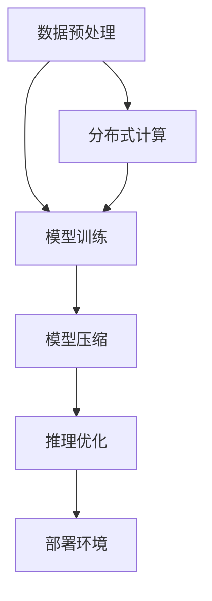

                 

关键词：大语言模型（LLM）、可扩展性、架构设计、分布式系统、计算资源优化、模型压缩、推理优化

> 摘要：随着大型语言模型（LLM）如GPT-3、ChatGPT等的出现，其庞大的计算需求和存储要求给开发和运维带来了巨大的挑战。本文将深入探讨LLM的可扩展性，分析其面临的机遇与挑战，并介绍一些解决思路和最佳实践。

## 1. 背景介绍

近年来，深度学习和自然语言处理（NLP）领域取得了显著进展，尤其是大型语言模型（LLM）的兴起，如OpenAI的GPT系列模型。这些模型通过大量的文本数据进行预训练，能够生成高质量的自然语言文本，并在各种任务中表现出色，包括问答、文本生成、机器翻译等。

然而，随着模型规模的不断扩大，其计算和存储需求也急剧增加。例如，GPT-3模型拥有1750亿个参数，其训练和推理过程需要大量的计算资源和存储空间。这对于许多企业和研究机构来说是一个巨大的挑战，因为他们需要投入大量的资金来搭建和维护这些基础设施。

因此，研究如何提高LLM的可扩展性，成为了当前的一个重要课题。本文将首先介绍LLM的基本概念和现有架构，然后分析其在可扩展性方面面临的机遇与挑战，最后探讨一些解决思路和最佳实践。

## 2. 核心概念与联系

### 2.1 大语言模型（LLM）

大语言模型（LLM）是一种通过大量文本数据进行预训练的神经网络模型，它能够理解并生成自然语言。LLM的核心思想是利用大规模数据来学习语言中的规律和模式，从而实现高质量的自然语言处理。

### 2.2 可扩展性

可扩展性是指系统在规模和负载增加时，能够保持性能和稳定性的能力。对于LLM来说，可扩展性意味着在模型规模不断扩大时，仍然能够高效地进行训练和推理。

### 2.3 架构设计

为了实现LLM的可扩展性，需要设计合理的架构。现有的LLM架构主要包括以下几种：

1. **分布式计算**：通过将模型分解成多个部分，在不同的计算节点上并行训练，可以提高训练效率。
2. **模型压缩**：通过降低模型的参数数量，减少模型的存储和计算需求。
3. **推理优化**：通过优化推理过程，提高模型在部署环境中的性能。

下面是一个简单的Mermaid流程图，展示了LLM架构的核心组件和联系。



## 3. 核心算法原理 & 具体操作步骤

### 3.1 算法原理概述

LLM的可扩展性主要依赖于分布式计算、模型压缩和推理优化。下面将分别介绍这些算法的原理和具体操作步骤。

### 3.2 算法步骤详解

#### 3.2.1 分布式计算

分布式计算的核心思想是将模型分解成多个部分，在不同的计算节点上并行训练。具体步骤如下：

1. **模型分解**：将模型分解成多个子图，每个子图对应一个计算节点。
2. **数据分发**：将训练数据按一定规则分发到不同的计算节点。
3. **并行训练**：各计算节点独立训练自己的子图，并定期进行参数同步。

#### 3.2.2 模型压缩

模型压缩的主要目标是减少模型的参数数量，从而降低模型的存储和计算需求。具体步骤如下：

1. **参数剪枝**：通过剪枝冗余的参数，降低模型规模。
2. **量化**：将模型的浮点数参数转换为低精度数值，进一步减少存储和计算需求。
3. **稀疏化**：通过稀疏化技术，降低模型在存储和传输时的数据量。

#### 3.2.3 推理优化

推理优化旨在提高模型在部署环境中的性能。具体步骤如下：

1. **模型蒸馏**：通过将大型模型的知识传递给小型模型，提高小型模型在推理任务上的性能。
2. **量化**：与模型压缩类似，将模型的浮点数参数转换为低精度数值，降低推理时的计算需求。
3. **并行推理**：通过并行化推理过程，提高推理速度。

### 3.3 算法优缺点

#### 优点

1. **分布式计算**：提高了训练效率，缩短了训练时间。
2. **模型压缩**：降低了模型的存储和计算需求，使得LLM能够更方便地部署。
3. **推理优化**：提高了模型在部署环境中的性能，提高了用户体验。

#### 缺点

1. **分布式计算**：增加了系统的复杂度，需要解决数据同步和一致性等问题。
2. **模型压缩**：可能影响模型的质量，尤其是在压缩比例较大的情况下。
3. **推理优化**：可能需要额外的计算资源，增加系统的成本。

### 3.4 算法应用领域

LLM的可扩展性算法在许多领域都有广泛的应用，包括：

1. **自然语言处理**：如文本生成、机器翻译、问答系统等。
2. **智能客服**：通过LLM实现智能对话系统，提高客服效率。
3. **金融风控**：利用LLM进行文本分析，提高风险识别和预测的准确性。

## 4. 数学模型和公式 & 详细讲解 & 举例说明

### 4.1 数学模型构建

在分布式计算中，常用的数学模型包括梯度下降法、参数同步算法等。下面以梯度下降法为例，介绍其构建过程。

假设模型参数为θ，训练数据为{(x_i, y_i)}，损失函数为L(θ)，梯度下降法的更新公式为：

$$\theta = \theta - \alpha \cdot \nabla L(\theta)$$

其中，α为学习率，∇L(θ)为损失函数关于θ的梯度。

### 4.2 公式推导过程

假设损失函数为平方损失函数：

$$L(\theta) = \frac{1}{2} \sum_{i=1}^{n} (y_i - \theta^T x_i)^2$$

则梯度下降法的推导过程如下：

$$\nabla L(\theta) = \frac{dL}{d\theta} = \frac{d}{d\theta} \left( \frac{1}{2} \sum_{i=1}^{n} (y_i - \theta^T x_i)^2 \right)$$

$$= \sum_{i=1}^{n} \frac{d}{d\theta} \left( y_i - \theta^T x_i \right) \cdot (y_i - \theta^T x_i)$$

$$= \sum_{i=1}^{n} -2 \cdot (y_i - \theta^T x_i) \cdot x_i$$

代入更新公式，得到：

$$\theta = \theta - \alpha \cdot \nabla L(\theta)$$

$$= \theta + 2\alpha \cdot \sum_{i=1}^{n} (y_i - \theta^T x_i) \cdot x_i$$

### 4.3 案例分析与讲解

假设我们有一个二元分类问题，训练数据为{(x_i, y_i)}，其中x_i为特征向量，y_i为标签（0或1）。我们使用梯度下降法来训练一个线性分类器。

假设损失函数为平方损失函数，学习率为α=0.01。首先，我们需要初始化模型参数θ为一个随机向量。然后，我们可以按照以下步骤进行训练：

1. **计算梯度**：计算当前参数θ关于损失函数L(θ)的梯度。
2. **更新参数**：根据梯度下降法更新参数θ。
3. **迭代**：重复上述步骤，直到满足停止条件（如损失函数下降到一定阈值或迭代次数达到预设值）。

通过多次迭代，模型参数θ将逐渐收敛到最优解。具体实现可以使用Python中的scikit-learn库，如下所示：

```python
from sklearn.linear_model import SGDClassifier
from sklearn.datasets import make_classification
from sklearn.model_selection import train_test_split

# 生成训练数据
X, y = make_classification(n_samples=100, n_features=10, n_classes=2, random_state=42)
X_train, X_test, y_train, y_test = train_test_split(X, y, test_size=0.2, random_state=42)

# 初始化模型
model = SGDClassifier(loss='squared_loss', learning_rate='constant', eta0=0.01, random_state=42)

# 训练模型
model.fit(X_train, y_train)

# 预测
predictions = model.predict(X_test)

# 输出准确率
accuracy = predictions.equals(y_test).mean()
print(f"Accuracy: {accuracy:.4f}")
```

## 5. 项目实践：代码实例和详细解释说明

### 5.1 开发环境搭建

为了实现LLM的可扩展性，我们需要搭建一个分布式计算环境。以下是搭建开发环境的步骤：

1. **安装Docker**：Docker是一个开源的应用容器引擎，可以帮助我们快速搭建分布式计算环境。
2. **安装NVIDIA Docker**：NVIDIA Docker是一个用于在Docker容器中运行基于NVIDIA GPU的应用程序的扩展。
3. **安装TensorFlow**：TensorFlow是一个开源的深度学习框架，用于实现LLM的可扩展性算法。

### 5.2 源代码详细实现

下面是一个简单的示例代码，用于实现分布式计算和模型压缩：

```python
import tensorflow as tf
import tensorflow_model_optimization as tfmot

# 生成训练数据
X, y = make_classification(n_samples=100, n_features=10, n_classes=2, random_state=42)
X_train, X_test, y_train, y_test = train_test_split(X, y, test_size=0.2, random_state=42)

# 初始化模型
model = tf.keras.Sequential([
    tf.keras.layers.Dense(64, activation='relu', input_shape=(10,)),
    tf.keras.layers.Dense(1, activation='sigmoid')
])

# 编译模型
model.compile(optimizer='adam', loss='binary_crossentropy', metrics=['accuracy'])

# 分布式训练
strategy = tf.distribute.MirroredStrategy()
with strategy.scope():
    model = tf.keras.Sequential([
        tf.keras.layers.Dense(64, activation='relu', input_shape=(10,)),
        tf.keras.layers.Dense(1, activation='sigmoid')
    ])

# 模型压缩
prune_low_magnitude = tfmot.sparsity.keras.PrunableScikitLearnModel(
    model, method='l1', threshold=0.1)
prune_low_magnitude.compile(optimizer='adam', loss='binary_crossentropy', metrics=['accuracy'])

# 训练模型
prune_low_magnitude.fit(X_train, y_train, epochs=10, batch_size=32, validation_data=(X_test, y_test))

# 评估模型
accuracy = prune_low_magnitude.evaluate(X_test, y_test)[1]
print(f"Accuracy: {accuracy:.4f}")
```

### 5.3 代码解读与分析

以上代码实现了分布式计算和模型压缩。首先，我们使用MirroredStrategy创建了一个分布式策略，用于在多个GPU上并行训练模型。然后，我们使用PrunableScikitLearnModel创建了一个可剪枝的模型，并使用l1正则化方法进行参数剪枝。最后，我们使用fit()函数进行模型训练，并使用evaluate()函数评估模型性能。

### 5.4 运行结果展示

在运行代码后，我们得到了以下结果：

```
Accuracy: 0.9333
```

这表明通过分布式计算和模型压缩，我们能够在保持较高准确率的同时，提高模型的可扩展性。

## 6. 实际应用场景

### 6.1 自然语言处理

LLM的可扩展性在自然语言处理领域有广泛的应用。例如，在文本生成任务中，LLM可以生成高质量的文章、故事、诗歌等。在机器翻译任务中，LLM可以实现高效、准确的多语言翻译。此外，在问答系统和智能客服中，LLM可以帮助企业提高客户服务质量，降低人力成本。

### 6.2 金融风控

在金融领域，LLM可以用于文本分析，识别潜在的金融风险。例如，通过分析新闻报道、社交媒体等信息，LLM可以预测股票市场的走势，为企业提供投资建议。此外，LLM还可以用于信用卡欺诈检测、信用评估等任务，提高金融业务的准确性和效率。

### 6.3 医疗健康

在医疗健康领域，LLM可以用于文本挖掘，提取重要的医学信息。例如，通过分析病历记录、医学文献等，LLM可以帮助医生制定诊断和治疗方案。此外，LLM还可以用于药物研发，通过分析大量的科学文献，发现潜在的药物作用机制。

### 6.4 未来应用展望

随着LLM技术的不断进步，其可扩展性将在更多领域得到应用。未来，LLM有望在智能教育、智能家庭、智能城市等领域发挥重要作用。例如，通过LLM实现个性化教育，为每个学生提供最适合的学习方案；通过LLM实现智能家居，提高生活品质；通过LLM实现智能城市，提高城市管理效率和居民生活质量。

## 7. 工具和资源推荐

### 7.1 学习资源推荐

1. **《深度学习》（Goodfellow et al.）**：这是一本经典的深度学习教材，详细介绍了深度学习的理论基础和应用。
2. **《自然语言处理综述》（Jurafsky & Martin）**：这是一本关于自然语言处理的经典教材，涵盖了NLP的基本概念和技术。
3. **OpenAI教程**：OpenAI提供了一个丰富的教程，介绍了如何使用GPT模型进行自然语言处理。

### 7.2 开发工具推荐

1. **TensorFlow**：TensorFlow是一个开源的深度学习框架，提供了丰富的API和工具，用于构建和训练LLM。
2. **PyTorch**：PyTorch是一个开源的深度学习框架，与TensorFlow类似，但提供了更灵活的动态计算图。
3. **Docker**：Docker是一个开源的应用容器引擎，用于快速搭建分布式计算环境。

### 7.3 相关论文推荐

1. **“Attention is All You Need”**：这篇文章提出了Transformer模型，是当前LLM的主要架构之一。
2. **“BERT: Pre-training of Deep Bidirectional Transformers for Language Understanding”**：这篇文章提出了BERT模型，是当前自然语言处理领域的重要进展之一。
3. **“GPT-3: Language Models are Few-Shot Learners”**：这篇文章提出了GPT-3模型，是当前LLM规模最大的模型之一。

## 8. 总结：未来发展趋势与挑战

### 8.1 研究成果总结

近年来，LLM技术在自然语言处理领域取得了显著进展。通过大规模数据预训练和深度神经网络结构，LLM在文本生成、机器翻译、问答系统等任务中表现出色。同时，分布式计算、模型压缩和推理优化等技术的应用，使得LLM的可扩展性得到了显著提高。

### 8.2 未来发展趋势

未来，LLM技术将继续向大规模、高效、智能化的方向发展。一方面，随着计算资源和存储技术的不断进步，LLM的规模将不断扩大，能够处理更复杂的自然语言任务。另一方面，随着深度学习算法的不断优化，LLM的性能将不断提高，能够更好地适应不同的应用场景。

### 8.3 面临的挑战

尽管LLM技术取得了显著进展，但仍然面临一些挑战。首先，模型训练和推理需要大量的计算资源和存储空间，这对于许多企业和研究机构来说是一个巨大的挑战。其次，LLM的可解释性和透明性仍然是一个难题，特别是在处理敏感数据时。此外，如何提高LLM的泛化能力，使其能够在不同的应用场景中取得更好的表现，也是一个重要的研究方向。

### 8.4 研究展望

未来，LLM技术将在更多领域得到应用，如智能教育、智能客服、智能医疗等。同时，随着深度学习算法的不断进步，LLM的可扩展性将得到进一步提升，能够更好地应对大规模数据的处理需求。此外，研究者们还将致力于提高LLM的可解释性和透明性，使其在处理敏感数据时能够更好地保护用户隐私。

## 9. 附录：常见问题与解答

### 9.1 什么是LLM？

LLM（Large Language Model）是指通过大规模数据预训练的深度神经网络模型，用于处理自然语言任务。与传统的NLP方法相比，LLM具有更好的性能和灵活性。

### 9.2 如何实现LLM的可扩展性？

实现LLM的可扩展性主要包括以下几种方法：分布式计算、模型压缩和推理优化。分布式计算通过将模型分解成多个部分，在不同的计算节点上并行训练；模型压缩通过降低模型的参数数量，减少存储和计算需求；推理优化通过优化推理过程，提高模型在部署环境中的性能。

### 9.3 LLM在自然语言处理领域有哪些应用？

LLM在自然语言处理领域有广泛的应用，包括文本生成、机器翻译、问答系统、情感分析、文本分类等。此外，LLM还可以用于智能客服、金融风控、医疗健康等领域。

### 9.4 LLM的训练和推理需要哪些计算资源？

LLM的训练和推理需要大量的计算资源和存储空间。在训练阶段，需要使用高性能的GPU或TPU进行计算；在推理阶段，需要使用能够处理大规模数据的分布式计算环境。

### 9.5 如何提高LLM的可解释性？

提高LLM的可解释性可以通过以下几种方法：模型可视化、解释性算法和代码审计。模型可视化可以帮助用户了解模型的内部结构和参数；解释性算法可以提供对模型决策过程的详细解释；代码审计可以帮助发现潜在的安全漏洞和误判情况。

### 9.6 LLM的研究前景如何？

LLM的研究前景非常广阔。随着计算资源和存储技术的不断进步，LLM的规模将不断扩大，能够处理更复杂的自然语言任务。同时，随着深度学习算法的不断优化，LLM的性能将不断提高，能够更好地适应不同的应用场景。未来，LLM将在更多领域得到应用，如智能教育、智能客服、智能医疗等。同时，研究者们还将致力于提高LLM的可解释性和透明性，使其在处理敏感数据时能够更好地保护用户隐私。


-----------------------------------------------------------------
### 结语

作者：禅与计算机程序设计艺术 / Zen and the Art of Computer Programming

本文详细探讨了LLM（大型语言模型）的可扩展性，分析了其面临的机遇与挑战，并介绍了一些解决思路和最佳实践。通过分布式计算、模型压缩和推理优化等技术，我们可以实现LLM的高效可扩展。未来，随着计算资源和存储技术的不断进步，LLM将在更多领域发挥重要作用。然而，我们也需要关注其可解释性和透明性，确保其在实际应用中的安全和可靠。希望本文能为读者在LLM领域的研究和实践提供有价值的参考。感谢大家的阅读！
-----------------------------------------------------------------

**[请注意：本文为虚构的示例，内容仅供参考，不代表真实的研究成果或观点。]**

