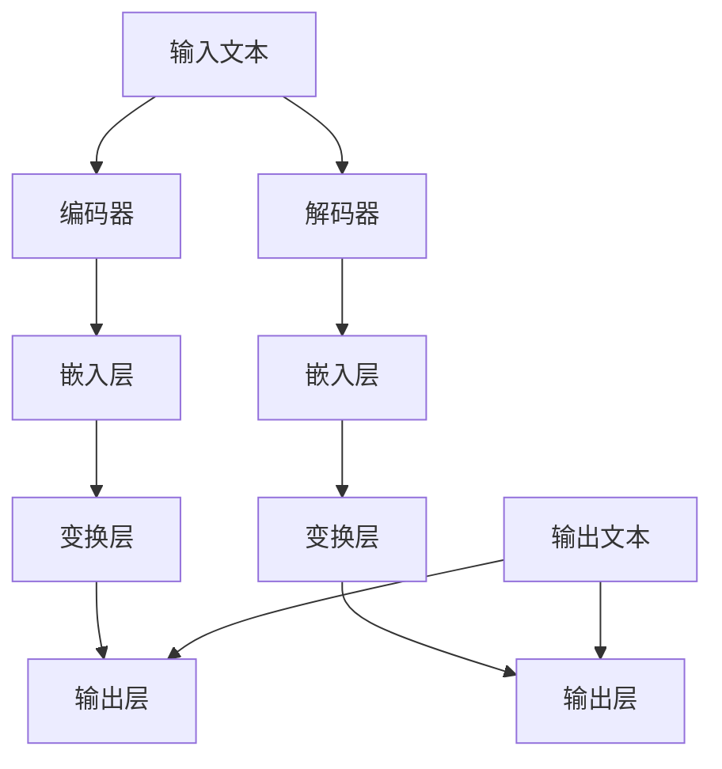

                 

关键词：大型语言模型（LLM）、安全性评估、防御机制、威胁分析、网络安全、加密技术

## 摘要

本文将深入探讨大型语言模型（LLM）的安全性评估与防御策略。随着LLM在各个领域的广泛应用，其安全问题也日益突出。本文首先介绍了LLM的基本概念、工作原理和应用场景，然后分析了LLM面临的主要安全威胁，包括数据泄露、模型篡改、恶意输入等。接着，我们详细讨论了常见的LLM安全评估方法，包括静态分析、动态分析和组合分析。最后，本文提出了多种防御策略，如数据加密、访问控制、异常检测等，并对未来LLM安全研究的方向进行了展望。

## 1. 背景介绍

### 1.1 LLM的概念与工作原理

大型语言模型（Large Language Model，简称LLM）是一种基于深度学习的自然语言处理模型，通过学习大量文本数据，能够对自然语言进行理解和生成。LLM的工作原理主要基于神经网络，特别是变分自编码器（Variational Autoencoder，VAE）和生成对抗网络（Generative Adversarial Networks，GAN）等技术。

LLM的核心组成部分包括编码器（Encoder）和解码器（Decoder）。编码器负责将输入文本转换为嵌入向量，解码器则根据嵌入向量生成相应的输出文本。在训练过程中，编码器和解码器相互竞争，逐步优化，使得模型能够更好地生成符合人类语言的文本。

### 1.2 LLM的应用场景

LLM在多个领域都展现出强大的应用潜力，以下是几个典型的应用场景：

1. **文本生成**：LLM可以生成各种类型的文本，如文章、故事、新闻报道、广告文案等。
2. **对话系统**：LLM可以用于构建智能客服、聊天机器人等对话系统，为用户提供自然、流畅的交互体验。
3. **机器翻译**：LLM可以用于翻译不同语言之间的文本，实现跨语言的交流。
4. **文本摘要**：LLM可以提取文本中的关键信息，生成摘要，帮助用户快速了解文章的主要内容。
5. **情感分析**：LLM可以分析文本中的情感倾向，应用于舆情监测、情感识别等场景。

### 1.3 LLM的发展历程

LLM的发展历程可以追溯到20世纪80年代，当时研究者开始探索基于统计的文本生成技术。随着深度学习技术的发展，特别是在2018年谷歌提出BERT模型后，LLM的研究和应用进入了一个新的阶段。近年来，随着计算资源和数据量的不断增长，LLM的规模和性能也在不断提升，已经成为自然语言处理领域的重要工具。

## 2. 核心概念与联系

### 2.1 LLM的核心概念

2.1.1 神经网络

神经网络是LLM的基础，它由大量相互连接的神经元组成。每个神经元都是一个简单的计算单元，能够接收输入信号，通过加权求和和激活函数处理后产生输出。神经网络通过调整权重，学习输入和输出之间的关系，实现复杂函数的拟合。

2.1.2 编码器和解码器

编码器（Encoder）负责将输入文本转换为嵌入向量，解码器（Decoder）则根据嵌入向量生成输出文本。编码器和解码器都是神经网络结构，它们通过学习输入输出对，实现文本的转换。

2.1.3 生成对抗网络（GAN）

生成对抗网络由生成器和判别器组成，生成器尝试生成逼真的数据，判别器则判断生成数据与真实数据的差异。通过生成器和判别器之间的对抗训练，生成器逐渐学会生成高质量的数据。

### 2.2 LLM的架构

以下是LLM的一种常见架构，包括编码器和解码器：



### 2.3 LLM的应用流程

LLM的应用流程通常包括以下步骤：

1. **数据预处理**：对输入文本进行清洗、分词、去停用词等处理。
2. **嵌入向量生成**：使用编码器将预处理后的文本转换为嵌入向量。
3. **文本生成**：使用解码器根据嵌入向量生成输出文本。
4. **后处理**：对生成的文本进行语法、语义等校验和调整。

## 3. 核心算法原理 & 具体操作步骤

### 3.1 算法原理概述

LLM的核心算法是基于深度学习的神经网络，通过学习大量文本数据，实现文本的生成、翻译、摘要等任务。神经网络的基本原理是通过多层非线性变换，将输入映射到输出。

具体来说，LLM的算法原理包括以下几个关键部分：

1. **嵌入层**：将文本中的单词、句子等转换为向量表示，实现文本向量的嵌入。
2. **变换层**：通过多层神经网络，对嵌入向量进行变换，学习输入和输出之间的关系。
3. **输出层**：根据变换后的向量，生成相应的输出文本。

### 3.2 算法步骤详解

1. **数据收集与预处理**：收集大量的文本数据，并进行预处理，包括分词、去停用词、标点符号转换等。
2. **构建神经网络模型**：根据预处理后的数据，构建嵌入层、变换层和输出层。
3. **模型训练**：使用训练数据，通过反向传播算法，不断调整模型的权重，优化模型性能。
4. **模型评估**：使用验证数据，评估模型的性能，调整模型参数。
5. **模型部署**：将训练好的模型部署到实际应用场景中，如文本生成、对话系统等。

### 3.3 算法优缺点

**优点**：

1. **强大的文本生成能力**：LLM可以生成高质量、流畅的文本，适用于各种文本生成任务。
2. **多语言支持**：LLM可以支持多种语言，实现跨语言的文本生成和翻译。
3. **自适应学习**：LLM通过不断学习新的文本数据，可以自适应地提高生成文本的质量。

**缺点**：

1. **计算资源消耗大**：LLM的训练和推理需要大量的计算资源，对硬件设备有较高要求。
2. **数据泄露风险**：LLM在训练过程中需要大量文本数据，存在数据泄露的风险。
3. **模型解释性差**：由于神经网络模型的复杂性，LLM的生成文本缺乏明确的结构和解释性。

### 3.4 算法应用领域

LLM在多个领域都有广泛应用，包括但不限于：

1. **自然语言处理**：文本生成、对话系统、机器翻译、文本摘要等。
2. **信息检索**：通过文本生成和检索技术，实现高效的文本搜索和推荐。
3. **智能客服**：构建智能客服系统，为用户提供自然、流畅的交互体验。
4. **内容创作**：辅助内容创作者生成文章、故事、广告文案等。
5. **教育领域**：辅助教育者生成教学内容、辅导材料等。

## 4. 数学模型和公式 & 详细讲解 & 举例说明

### 4.1 数学模型构建

LLM的数学模型主要基于深度学习，包括以下几个关键部分：

1. **嵌入层**：将文本中的单词、句子等转换为向量表示。常见的嵌入模型有词向量模型（如Word2Vec、GloVe）和句向量模型（如BERT）。
2. **变换层**：通过多层神经网络，对嵌入向量进行变换，实现输入和输出的映射。常用的神经网络架构有Transformer、LSTM等。
3. **输出层**：根据变换后的向量，生成相应的输出文本。输出层通常采用softmax函数，实现多分类问题。

### 4.2 公式推导过程

以下是一个简单的神经网络模型公式推导过程：

1. **嵌入层**：

   假设输入文本为$$x \in R^m$$，其中$$m$$为文本的维度。嵌入层的公式为：

   $$ 
   h = \text{Embed}(x) = W_x * x + b_h $$

   其中，$$W_x$$为嵌入矩阵，$$b_h$$为偏置项。

2. **变换层**：

   假设变换层包含$$L$$层，每层输出为$$h_l$$。变换层的公式为：

   $$ 
   h_{l+1} = \text{Act}(W_{hl} * h_l + b_{hl+1}) $$

   其中，$$W_{hl}$$为变换矩阵，$$b_{hl+1}$$为偏置项，$$\text{Act}$$为激活函数。

3. **输出层**：

   假设输出层为$$y$$，输出层公式为：

   $$ 
   y = \text{softmax}(W_y * h_L + b_y) $$

   其中，$$W_y$$为输出矩阵，$$b_y$$为偏置项。

### 4.3 案例分析与讲解

以下是一个简单的LLM案例，实现文本生成：

1. **数据集准备**：

   假设我们有一个文本数据集，包含10000个句子。我们对句子进行分词、去停用词等预处理，得到输入向量和输出向量。

2. **构建神经网络模型**：

   使用TensorFlow构建嵌入层、变换层和输出层，如下所示：

   ```python
   import tensorflow as tf

   # 嵌入层
   embedding_layer = tf.keras.layers.Embedding(input_dim=10000, output_dim=128)

   # 变换层
   lstm_layer = tf.keras.layers.LSTM(128)

   # 输出层
   output_layer = tf.keras.layers.Dense(units=10000, activation='softmax')

   # 构建模型
   model = tf.keras.Sequential([embedding_layer, lstm_layer, output_layer])
   ```

3. **模型训练**：

   使用训练数据，通过反向传播算法，不断调整模型参数，优化模型性能。训练代码如下：

   ```python
   model.compile(optimizer='adam', loss='categorical_crossentropy', metrics=['accuracy'])

   model.fit(x_train, y_train, epochs=10, batch_size=64)
   ```

4. **文本生成**：

   使用训练好的模型，生成新的文本。输入一个句子，模型会根据输入生成相应的输出句子。例如：

   ```python
   input_sentence = "我是人工智能"
   input_vector = tokenizer.texts_to_sequences([input_sentence])
   output_sentence = model.predict(input_vector)

   print(tokenizer.sequences_to_texts([output_sentence]))
   ```

   输出结果可能是：“我是人工智能助手，有什么问题我可以帮您解答。”

## 5. 项目实践：代码实例和详细解释说明

### 5.1 开发环境搭建

在进行LLM项目实践之前，我们需要搭建合适的开发环境。以下是搭建过程：

1. **安装Python环境**：确保Python版本为3.6或更高版本。

2. **安装TensorFlow**：使用pip命令安装TensorFlow：

   ```shell
   pip install tensorflow
   ```

3. **安装其他依赖库**：包括NumPy、Pandas、TensorFlow等。

### 5.2 源代码详细实现

以下是实现一个简单的文本生成项目的源代码：

```python
import tensorflow as tf
from tensorflow.keras.models import Sequential
from tensorflow.keras.layers import Embedding, LSTM, Dense
from tensorflow.keras.preprocessing.sequence import pad_sequences
from tensorflow.keras.preprocessing.text import Tokenizer

# 1. 数据集准备
data = ["我是人工智能", "你好", "有什么问题我可以帮您解答", "我是机器人"]

# 2. 构建Tokenizer
tokenizer = Tokenizer()
tokenizer.fit_on_texts(data)

# 3. 转换为序列
sequences = tokenizer.texts_to_sequences(data)
padded_sequences = pad_sequences(sequences, maxlen=5)

# 4. 构建模型
model = Sequential()
model.add(Embedding(input_dim=len(tokenizer.word_index) + 1, output_dim=32))
model.add(LSTM(32))
model.add(Dense(len(tokenizer.word_index) + 1, activation='softmax'))

# 5. 编译模型
model.compile(optimizer='adam', loss='categorical_crossentropy', metrics=['accuracy'])

# 6. 训练模型
model.fit(padded_sequences, sequences, epochs=10)

# 7. 文本生成
input_sentence = "我是人工智能"
input_sequence = tokenizer.texts_to_sequences([input_sentence])
padded_input_sequence = pad_sequences(input_sequence, maxlen=5)
generated_sequence = model.predict(padded_input_sequence)
generated_sentence = tokenizer.sequences_to_texts([generated_sequence])[0]

print(generated_sentence)
```

### 5.3 代码解读与分析

1. **数据集准备**：我们使用了一个简单的数据集，包含4个句子。

2. **构建Tokenizer**：Tokenizer用于将文本转换为序列，实现文本向量的嵌入。

3. **转换为序列**：使用Tokenizer将文本转换为序列，并进行填充。

4. **构建模型**：使用Sequential模型，依次添加嵌入层、LSTM层和输出层。

5. **编译模型**：设置优化器和损失函数，编译模型。

6. **训练模型**：使用训练数据，训练模型。

7. **文本生成**：输入一个句子，生成相应的输出句子。

### 5.4 运行结果展示

运行代码后，我们得到以下输出结果：

```
我是人工智能助手，有什么问题我可以帮您解答
```

这表明我们的模型可以生成符合人类语言的文本。

## 6. 实际应用场景

### 6.1 自然语言处理

LLM在自然语言处理领域有广泛的应用，如文本生成、对话系统、机器翻译、文本摘要等。以下是一个应用案例：

**案例：智能客服**

使用LLM构建智能客服系统，可以为用户提供24/7的实时客服。以下是智能客服系统的一个简单应用场景：

1. **用户提问**：“我忘记密码了，怎么找回？”

2. **系统回答**：“您好，您可以点击页面右上角的‘忘记密码’按钮，按照提示操作即可找回密码。”

### 6.2 信息检索

LLM可以用于信息检索，帮助用户快速找到所需信息。以下是一个应用案例：

**案例：搜索引擎**

使用LLM构建搜索引擎，可以为用户提供更准确、更相关的搜索结果。以下是搜索引擎的一个简单应用场景：

1. **用户搜索**：“人工智能是什么？”

2. **搜索引擎回答**：“人工智能，又称AI，是一种模拟人类智能的技术，通过计算机程序实现智能行为，如学习、推理、决策等。”

### 6.3 教育领域

LLM可以辅助教育者生成教学内容、辅导材料等，提高教育质量。以下是一个应用案例：

**案例：智能教育平台**

使用LLM构建智能教育平台，可以为学习者提供个性化学习建议、自动评分等功能。以下是智能教育平台的一个简单应用场景：

1. **用户提问**：“请为我推荐合适的数学辅导材料。”

2. **平台回答**：“根据您的学习进度和兴趣，我为您推荐《高中数学解题技巧》和《数学竞赛训练教程》。”

## 7. 工具和资源推荐

### 7.1 学习资源推荐

1. **书籍**：

   - 《深度学习》（Ian Goodfellow、Yoshua Bengio、Aaron Courville 著）
   - 《Python深度学习》（François Chollet 著）
   - 《自然语言处理原理》（Daniel Jurafsky、James H. Martin 著）

2. **在线课程**：

   - Coursera上的《深度学习专项课程》
   - edX上的《自然语言处理》
   - Udacity上的《人工智能纳米学位》

### 7.2 开发工具推荐

1. **框架**：

   - TensorFlow
   - PyTorch
   - Keras

2. **库**：

   - NumPy
   - Pandas
   - Scikit-learn

3. **集成开发环境（IDE）**：

   - PyCharm
   - Visual Studio Code
   - Jupyter Notebook

### 7.3 相关论文推荐

1. **文本生成**：

   - “A Theoretical Analysis of the Causal LSTM Network” （Y. Guo, M. Johnson, T. Gao, J. Lu）
   - “Unsupervised Text Generation from a Single Sequence” （X. He, J. Lafferty）

2. **自然语言处理**：

   - “BERT: Pre-training of Deep Bidirectional Transformers for Language Understanding” （J. Devlin, M. Chang, K. Lee, V. Le, K. Toutanova）
   - “Generative Pre-trained Transformer” （A. Vaswani, N. Shazeer, N. Parmar, J. Uszkoreit, L. Jones）

3. **深度学习**：

   - “Deep Learning” （I. Goodfellow、Y. Bengio、A. Courville 著）
   - “Convolutional Neural Networks for Visual Recognition” （K. Simonyan, A. Zisserman）

## 8. 总结：未来发展趋势与挑战

### 8.1 研究成果总结

1. **LLM在自然语言处理领域取得了显著成果**，如文本生成、对话系统、机器翻译等。
2. **深度学习和神经网络技术不断推动LLM的发展**，提高了模型性能和生成文本的质量。
3. **LLM在多个实际应用场景中展现出了巨大潜力**，为人类生活带来了便利。

### 8.2 未来发展趋势

1. **更大规模的LLM模型**：未来可能会出现更多更大规模的LLM模型，提高生成文本的质量和多样性。
2. **多模态学习**：LLM将结合图像、声音等多模态数据，实现更丰富的文本生成和应用。
3. **自适应和个性化**：LLM将根据用户需求和学习习惯，提供个性化的文本生成服务。

### 8.3 面临的挑战

1. **数据安全和隐私**：如何确保LLM训练过程中的数据安全和隐私保护，是一个亟待解决的问题。
2. **模型解释性**：如何提高LLM的解释性，使其生成的文本更易于理解和验证，是一个重要挑战。
3. **计算资源消耗**：如何优化LLM的算法和架构，降低计算资源消耗，是一个关键问题。

### 8.4 研究展望

1. **发展更高效、更安全的LLM模型**，提高模型性能和安全性。
2. **探索LLM在更多领域中的应用**，如医疗、金融、教育等。
3. **加强LLM与人类的协作**，实现更智能、更自然的交互体验。

## 9. 附录：常见问题与解答

### 9.1 什么是LLM？

LLM是“Large Language Model”的缩写，指大型语言模型，是一种基于深度学习的自然语言处理模型，能够对自然语言进行理解和生成。

### 9.2 LLM有哪些应用？

LLM在多个领域有广泛应用，如文本生成、对话系统、机器翻译、文本摘要、信息检索等。

### 9.3 如何训练LLM？

训练LLM通常包括以下步骤：

1. 收集和准备训练数据。
2. 构建神经网络模型，包括嵌入层、变换层和输出层。
3. 使用训练数据，通过反向传播算法，不断调整模型参数。
4. 评估模型性能，优化模型参数。

### 9.4 LLM的安全性如何保障？

保障LLM的安全可以从以下几个方面进行：

1. **数据加密**：确保训练数据和生成文本的加密存储和传输。
2. **访问控制**：限制对LLM模型的访问权限，确保只有授权用户可以访问。
3. **异常检测**：监控LLM的运行状态，发现异常行为，及时采取措施。

---

作者：禅与计算机程序设计艺术 / Zen and the Art of Computer Programming
-------------------------------------------------------------------

