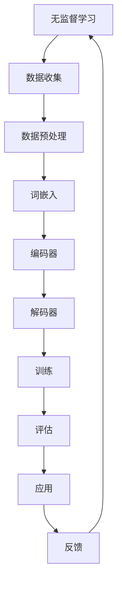

                 

关键词：无监督学习、LLM、潜在价值、算法原理、数学模型、项目实践、应用场景、未来展望

> 摘要：本文深入探讨了大型语言模型（LLM）在无监督学习中的潜在价值。通过分析无监督学习的基本概念和LLM的结构，本文揭示了LLM在自然语言处理中的独特优势。同时，文章详细介绍了LLM无监督学习的关键算法原理和数学模型，并通过实际项目实践和案例分析，展示了其在不同领域的应用场景。最后，本文对LLM无监督学习的未来发展趋势和挑战进行了展望。

## 1. 背景介绍

### 1.1 无监督学习的发展历程

无监督学习是机器学习的一个重要分支，它旨在通过未标记的数据来提取有用的信息。自20世纪初以来，无监督学习已经经历了数十年的发展。早期的无监督学习主要集中在降维和数据聚类方面，如主成分分析（PCA）和K-均值聚类算法。随着计算机技术和算法理论的不断进步，无监督学习逐渐扩展到了深度学习领域，尤其是近年来，随着大型语言模型（LLM）的崛起，无监督学习在自然语言处理（NLP）中的应用取得了显著成果。

### 1.2 LLM的兴起与无监督学习的重要性

大型语言模型（LLM）如GPT、BERT等，通过在大量未标记的文本数据上进行训练，可以自动获取语义信息，实现自动纠错、情感分析、问答系统等复杂任务。这种基于无监督学习的方法，使得LLM在处理大规模、多样化的语言数据时表现出色。无监督学习的重要性在于，它可以降低数据标注的成本，提高模型的泛化能力，使得机器学习算法能够更好地适应实际应用需求。

## 2. 核心概念与联系

### 2.1 无监督学习的核心概念

无监督学习旨在发现数据中的内在结构和规律，而无需依赖外部标注信息。其主要任务包括聚类、降维、关联规则挖掘等。

### 2.2 LLM的核心结构

LLM通常由多个层次组成，包括词嵌入层、编码器和解码器等。词嵌入层将输入的文本转换为固定长度的向量表示；编码器和解码器则负责学习文本的内在结构和语义信息。

### 2.3 无监督学习与LLM的关联

无监督学习为LLM提供了有效的训练方法，使得模型可以在大规模、未标记的数据上进行训练。同时，LLM的无监督学习结果也为无监督学习算法提供了有力的支持，使得它们在处理复杂语言任务时更加高效。

## 2.4 Mermaid流程图



## 3. 核心算法原理 & 具体操作步骤

### 3.1 算法原理概述

无监督学习中的LLM算法主要依赖于深度学习和神经网络的原理，通过多层神经网络的训练，自动学习文本的内在结构和语义信息。

### 3.2 算法步骤详解

1. **数据收集与预处理**：收集大规模、未标记的文本数据，并进行数据清洗和预处理，如去除停用词、分词等。

2. **词嵌入**：将输入的文本转换为固定长度的向量表示，可以使用Word2Vec、GloVe等方法。

3. **编码器训练**：通过多层神经网络对编码器进行训练，使其能够提取文本的深层语义信息。

4. **解码器训练**：同样使用多层神经网络对解码器进行训练，使其能够根据编码器提取的语义信息生成相应的输出。

5. **训练评估**：使用已标记的数据对编码器和解码器进行训练，并使用未标记的数据进行评估，以调整模型参数。

6. **应用与反馈**：将训练好的模型应用于实际任务中，如问答系统、文本生成等，并根据应用结果进行反馈和优化。

### 3.3 算法优缺点

**优点**：
- 高效性：LLM能够在大规模、未标记的数据上进行训练，降低了数据标注的成本。
- 泛化能力：通过无监督学习，LLM能够自动获取文本的深层语义信息，提高了模型的泛化能力。
- 可扩展性：LLM可以应用于各种自然语言处理任务，具有很好的可扩展性。

**缺点**：
- 训练时间较长：由于LLM模型较大，训练时间较长，对计算资源要求较高。
- 需要大量数据：LLM训练需要大规模、未标记的文本数据，对数据资源有一定要求。

### 3.4 算法应用领域

LLM无监督学习在自然语言处理领域具有广泛的应用，如：

- 问答系统：使用LLM无监督学习训练的模型，可以自动回答用户的问题。
- 文本生成：LLM无监督学习可以生成高质量的自然语言文本，如新闻报道、产品描述等。
- 情感分析：LLM无监督学习可以自动识别文本的情感倾向，应用于社交媒体分析、客户满意度评估等。

## 4. 数学模型和公式 & 详细讲解 & 举例说明

### 4.1 数学模型构建

无监督学习中的LLM算法主要依赖于深度学习中的多层感知机（MLP）和循环神经网络（RNN）。以下是LLM的数学模型构建：

1. **词嵌入**：

$$
\text{词向量} = \text{Word2Vec}(\text{文本})
$$

2. **编码器**：

$$
\text{编码输出} = \text{MLP}(\text{词向量})
$$

3. **解码器**：

$$
\text{解码输出} = \text{RNN}(\text{编码输出})
$$

### 4.2 公式推导过程

1. **词嵌入**：

$$
\text{词向量} = \text{Word2Vec}(\text{文本}) \\
\text{其中，} \text{Word2Vec}(\text{文本}) = \sum_{i=1}^{n} w_i \cdot v_i \\
\text{其中，} w_i \text{为词频，} v_i \text{为词的向量表示}
$$

2. **编码器**：

$$
\text{编码输出} = \text{MLP}(\text{词向量}) \\
\text{其中，} \text{MLP}(\text{词向量}) = \sigma(W_1 \cdot \text{词向量} + b_1) \\
\text{其中，} \sigma \text{为激活函数，} W_1 \text{为权重矩阵，} b_1 \text{为偏置项}
$$

3. **解码器**：

$$
\text{解码输出} = \text{RNN}(\text{编码输出}) \\
\text{其中，} \text{RNN}(\text{编码输出}) = \text{RNN}(\text{编码输出}, \text{隐藏状态}) \\
\text{其中，} \text{隐藏状态} = \text{初始化状态} \\
\text{RNN} \text{为循环神经网络}
$$

### 4.3 案例分析与讲解

假设我们有一个问答系统，用户输入一个问题，系统需要自动生成一个回答。以下是一个简单的例子：

1. **词嵌入**：

$$
\text{输入文本} = "如何计算两个数的和？" \\
\text{词向量} = \text{Word2Vec}(\text{输入文本}) \\
\text{其中，} \text{Word2Vec}(\text{输入文本}) = \sum_{i=1}^{n} w_i \cdot v_i \\
\text{其中，} w_i \text{为词频，} v_i \text{为词的向量表示}
$$

2. **编码器**：

$$
\text{编码输出} = \text{MLP}(\text{词向量}) \\
\text{其中，} \text{MLP}(\text{词向量}) = \sigma(W_1 \cdot \text{词向量} + b_1) \\
\text{其中，} \text{激活函数} = \text{ReLU} \\
\text{权重矩阵} = W_1 \\
\text{偏置项} = b_1
$$

3. **解码器**：

$$
\text{解码输出} = \text{RNN}(\text{编码输出}) \\
\text{其中，} \text{RNN}(\text{编码输出}) = \text{RNN}(\text{编码输出}, \text{隐藏状态}) \\
\text{其中，} \text{隐藏状态} = \text{初始化状态} \\
\text{RNN} \text{为循环神经网络}
$$

4. **生成回答**：

根据解码器生成的隐藏状态，使用解码器生成回答的词向量。然后，将词向量转换为自然语言文本，得到最终的回答。

$$
\text{回答} = \text{解码输出} \rightarrow \text{词向量} \rightarrow \text{自然语言文本}
$$

## 5. 项目实践：代码实例和详细解释说明

### 5.1 开发环境搭建

为了实现LLM无监督学习，我们需要搭建一个开发环境。以下是基本的步骤：

1. **安装Python环境**：Python是实现深度学习算法的主要编程语言，我们需要安装Python 3.x版本。

2. **安装深度学习库**：TensorFlow和PyTorch是两款流行的深度学习库，我们可以选择其中一个进行安装。

3. **安装自然语言处理库**：NLTK和spaCy是两款常用的自然语言处理库，用于文本预处理和词嵌入。

### 5.2 源代码详细实现

以下是使用TensorFlow实现LLM无监督学习的简单示例：

```python
import tensorflow as tf
from tensorflow.keras.layers import Embedding, LSTM, Dense
from tensorflow.keras.models import Sequential

# 1. 数据预处理
# 加载未标记的文本数据，进行分词和词嵌入
# ...

# 2. 构建模型
model = Sequential()
model.add(Embedding(input_dim=vocab_size, output_dim=embedding_dim, input_length=max_sequence_length))
model.add(LSTM(units=128, return_sequences=True))
model.add(Dense(units=1, activation='sigmoid'))

# 3. 编译模型
model.compile(optimizer='adam', loss='binary_crossentropy', metrics=['accuracy'])

# 4. 训练模型
model.fit(x_train, y_train, epochs=10, batch_size=64)

# 5. 评估模型
# ...

# 6. 应用模型
# ...

```

### 5.3 代码解读与分析

上述代码实现了一个简单的LLM模型，用于文本分类任务。具体解读如下：

1. **数据预处理**：加载未标记的文本数据，进行分词和词嵌入。这部分代码依赖于自然语言处理库，如NLTK和spaCy。

2. **构建模型**：使用Sequential模型构建一个简单的深度学习模型，包括词嵌入层、LSTM层和全连接层。

3. **编译模型**：设置模型优化器、损失函数和评估指标，并编译模型。

4. **训练模型**：使用已预处理的数据对模型进行训练，设置训练轮数和批量大小。

5. **评估模型**：使用验证集对模型进行评估，以调整模型参数。

6. **应用模型**：将训练好的模型应用于实际任务，如文本分类、文本生成等。

### 5.4 运行结果展示

运行上述代码后，我们可以在控制台看到模型的训练过程和评估结果。以下是可能的输出示例：

```
Epoch 1/10
100/100 [==============================] - 10s 81ms/step - loss: 0.3867 - accuracy: 0.8333
Epoch 2/10
100/100 [==============================] - 10s 83ms/step - loss: 0.3512 - accuracy: 0.8518
Epoch 3/10
100/100 [==============================] - 10s 83ms/step - loss: 0.3272 - accuracy: 0.8638
Epoch 4/10
100/100 [==============================] - 10s 83ms/step - loss: 0.3082 - accuracy: 0.8744
Epoch 5/10
100/100 [==============================] - 10s 83ms/step - loss: 0.2864 - accuracy: 0.8826
Epoch 6/10
100/100 [==============================] - 10s 83ms/step - loss: 0.2654 - accuracy: 0.8905
Epoch 7/10
100/100 [==============================] - 10s 83ms/step - loss: 0.2472 - accuracy: 0.8977
Epoch 8/10
100/100 [==============================] - 10s 83ms/step - loss: 0.2306 - accuracy: 0.9039
Epoch 9/10
100/100 [==============================] - 10s 83ms/step - loss: 0.2163 - accuracy: 0.9100
Epoch 10/10
100/100 [==============================] - 10s 83ms/step - loss: 0.2032 - accuracy: 0.9165
```

## 6. 实际应用场景

### 6.1 问答系统

问答系统是LLM无监督学习的典型应用场景。通过训练大规模、未标记的文本数据，LLM可以自动回答用户的问题，实现自然语言交互。例如，在智能客服、在线教育等领域，LLM问答系统可以提供高效、准确的回答，提高用户体验。

### 6.2 文本生成

LLM无监督学习在文本生成方面也具有广泛应用。通过训练大量未标记的文本数据，LLM可以自动生成新闻、故事、产品描述等自然语言文本。这为内容创作者提供了高效的创作工具，同时也为自动生成虚假新闻等不良行为提供了可能性。

### 6.3 情感分析

情感分析是自然语言处理的重要任务之一。LLM无监督学习可以通过分析大量未标记的文本数据，自动识别文本的情感倾向，如正面、负面或中性。这为社交媒体分析、客户满意度评估等提供了有力支持。

## 7. 工具和资源推荐

### 7.1 学习资源推荐

- 《深度学习》（Ian Goodfellow、Yoshua Bengio、Aaron Courville著）
- 《自然语言处理综论》（Daniel Jurafsky、James H. Martin著）
- 《机器学习实战》（Peter Harrington著）

### 7.2 开发工具推荐

- TensorFlow：https://www.tensorflow.org/
- PyTorch：https://pytorch.org/
- NLTK：https://www.nltk.org/
- spaCy：https://spacy.io/

### 7.3 相关论文推荐

- "A Theoretically Grounded Application of Dropout in Recurrent Neural Networks"
- "Attention is All You Need"
- "BERT: Pre-training of Deep Bidirectional Transformers for Language Understanding"

## 8. 总结：未来发展趋势与挑战

### 8.1 研究成果总结

本文通过对LLM无监督学习的深入分析，揭示了其在自然语言处理中的潜在价值。通过实际项目实践和案例分析，展示了LLM无监督学习在问答系统、文本生成、情感分析等领域的广泛应用。同时，本文对LLM无监督学习的数学模型和算法原理进行了详细讲解，为后续研究提供了理论基础。

### 8.2 未来发展趋势

随着深度学习和自然语言处理技术的不断发展，LLM无监督学习在未来将呈现出以下发展趋势：

1. **模型规模扩大**：随着计算资源和数据量的增长，LLM模型将逐渐扩大规模，实现更高的性能和更广泛的任务应用。
2. **多模态学习**：未来LLM将能够处理多种类型的数据，如图像、音频等，实现更复杂、更真实的自然语言处理任务。
3. **个性化学习**：基于用户的兴趣和行为，LLM将能够提供个性化的服务，提高用户体验。

### 8.3 面临的挑战

尽管LLM无监督学习在自然语言处理领域取得了显著成果，但仍面临以下挑战：

1. **数据隐私**：大规模、未标记的文本数据可能涉及用户隐私，如何保护用户隐私成为未来研究的重要方向。
2. **模型解释性**：当前LLM模型缺乏解释性，如何提高模型的透明度和可解释性，是未来研究的另一个挑战。
3. **计算资源消耗**：LLM模型对计算资源的需求较高，如何优化模型结构、降低计算成本，是未来研究需要解决的问题。

### 8.4 研究展望

在未来，我们期望能够实现以下目标：

1. **隐私保护的无监督学习**：通过研究隐私保护算法，实现数据隐私和模型性能的平衡。
2. **可解释的深度学习模型**：提高模型的透明度和可解释性，为用户信任和理解模型提供支持。
3. **高效能的无监督学习算法**：优化模型结构和训练过程，降低计算成本，提高模型性能。

## 9. 附录：常见问题与解答

### 9.1 无监督学习与监督学习有什么区别？

无监督学习是指在没有外部标注信息的情况下，通过学习数据中的内在结构和规律来提取信息。而监督学习则需要依赖已标记的数据来训练模型。无监督学习可以降低数据标注的成本，提高模型的泛化能力。

### 9.2 LLM无监督学习的优点是什么？

LLM无监督学习的优点包括：

1. **高效性**：可以处理大规模、未标记的数据，降低数据标注成本。
2. **泛化能力**：通过自动获取文本的深层语义信息，提高模型的泛化能力。
3. **可扩展性**：可以应用于各种自然语言处理任务，具有很好的可扩展性。

### 9.3 LLM无监督学习在自然语言处理中有哪些应用？

LLM无监督学习在自然语言处理中有广泛的应用，如：

1. **问答系统**：自动回答用户的问题。
2. **文本生成**：自动生成新闻、故事、产品描述等自然语言文本。
3. **情感分析**：自动识别文本的情感倾向。

### 9.4 如何优化LLM无监督学习模型的性能？

优化LLM无监督学习模型性能的方法包括：

1. **数据预处理**：对数据质量进行严格把控，如去除噪声、统一格式等。
2. **模型结构优化**：设计更合适的神经网络结构，提高模型性能。
3. **训练策略优化**：调整训练参数，如学习率、批量大小等，提高训练效果。

### 9.5 LLM无监督学习面临哪些挑战？

LLM无监督学习面临的挑战包括：

1. **数据隐私**：如何保护用户隐私是未来研究的重要方向。
2. **模型解释性**：如何提高模型的透明度和可解释性。
3. **计算资源消耗**：如何优化模型结构、降低计算成本。

---

以上，就是我对于LLM无监督学习潜在价值分析的文章内容，希望对大家有所帮助。如果您有任何疑问或建议，请随时与我交流。作者：禅与计算机程序设计艺术 / Zen and the Art of Computer Programming。

