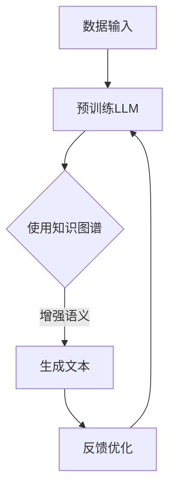

                 

关键词：LLM、知识图谱、认知世界、人工智能、模型构建、算法原理、数学模型、项目实践、应用场景、发展趋势、资源推荐。

## 摘要

本文深入探讨了语言大型模型(LLM)与知识图谱的结合，揭示了知识图谱在构建AI认知世界中的关键作用。通过对核心概念、算法原理、数学模型的详细阐述，以及项目实践的展示，本文旨在为读者提供一个全面了解和使用LLM与知识图谱构建AI认知世界的指导。此外，本文还将展望未来发展的趋势与挑战，并推荐相关学习资源、开发工具和论文，以期为读者提供更广阔的视野和实际操作路径。

## 1. 背景介绍

随着人工智能技术的快速发展，自然语言处理（NLP）成为其中的一个重要分支。近年来，基于深度学习的语言大型模型（LLM，Language-Large Model）如BERT、GPT等取得了显著的突破。这些模型能够处理大规模的语言数据，实现文本生成、翻译、问答等复杂任务，从而推动了人工智能在多个领域的应用。

知识图谱作为一种结构化数据表示的方法，广泛应用于信息检索、推荐系统、智能问答等领域。它通过实体、属性和关系的形式，将大量的信息组织成一个有向无环图（DAG），使得机器能够更有效地理解和利用这些信息。

LLM与知识图谱的结合，为人工智能的发展带来了新的机遇。一方面，知识图谱为LLM提供了丰富的语义信息，有助于模型更好地理解和生成文本；另一方面，LLM能够通过训练学习到知识图谱中的结构化知识，从而提升模型的推理能力和智能化水平。

## 2. 核心概念与联系

### 2.1 语言大型模型（LLM）

LLM是一种基于深度学习的自然语言处理模型，通过大规模语料训练，能够理解并生成自然语言。其主要特点包括：

- **大规模训练**：使用数以亿计的句子进行训练，模型参数量巨大，通常在数十亿到千亿级别。
- **上下文理解**：LLM能够理解输入文本的上下文，从而生成更加连贯和合理的输出。
- **多语言支持**：通过跨语言训练，LLM能够处理多种语言的任务，实现文本翻译、多语言问答等。

### 2.2 知识图谱

知识图谱是一种结构化数据表示的方法，通过实体、属性和关系的表示，将大量的信息组织成一个有向无环图。其主要组成部分包括：

- **实体**：知识图谱中的基本元素，表示具体的事物，如人、地点、物品等。
- **属性**：实体所具有的特性，如年龄、身高、颜色等。
- **关系**：实体之间的关系，如朋友、出生地、属于某个类别等。

### 2.3 LLM与知识图谱的联系

LLM与知识图谱的联系主要体现在以下几个方面：

- **知识增强**：知识图谱为LLM提供了丰富的语义信息，通过将知识图谱中的实体、属性和关系引入模型，可以提高模型的语义理解能力。
- **推理能力**：知识图谱中的关系和属性可以用于推理，从而提升LLM的推理能力，实现更加智能的问答和决策。
- **数据融合**：知识图谱与LLM的结合，可以实现结构化数据与自然语言数据的融合，从而为各种应用提供更加全面和多样化的数据支持。

### 2.4 Mermaid流程图

为了更好地理解LLM与知识图谱的结合，我们使用Mermaid绘制了一个简单的流程图，展示了二者之间的交互过程。



在这个流程图中，数据输入经过预训练的LLM，结合知识图谱增强语义信息，生成文本输出。随后，通过用户的反馈进行优化，形成一个闭环系统。

## 3. 核心算法原理 & 具体操作步骤

### 3.1 算法原理概述

LLM与知识图谱的结合，主要通过以下几种方式进行：

- **知识嵌入**：将知识图谱中的实体、属性和关系嵌入到LLM的输入中，使模型在处理文本时能够利用知识图谱中的信息。
- **图嵌入**：使用图嵌入技术，将知识图谱转化为向量表示，与LLM的输入文本向量进行融合。
- **知识图谱推理**：利用知识图谱中的关系和属性进行推理，从而引导LLM的生成过程，使其更加符合实际情境。

### 3.2 算法步骤详解

以下是LLM与知识图谱结合的算法步骤：

1. **数据预处理**：对输入文本和数据中的实体、属性和关系进行提取和标注。
2. **知识图谱构建**：根据提取的实体、属性和关系，构建知识图谱。
3. **知识嵌入**：将知识图谱中的实体、属性和关系进行向量嵌入，得到相应的向量表示。
4. **文本向量表示**：对输入文本进行词向量和句向量表示。
5. **融合向量表示**：将文本向量与知识图谱向量进行融合，得到一个统一的向量表示。
6. **生成文本**：使用融合后的向量表示，通过LLM生成文本输出。
7. **反馈优化**：根据用户反馈对模型进行优化，形成闭环系统。

### 3.3 算法优缺点

#### 优点

- **语义理解能力提升**：通过知识图谱的引入，LLM能够更好地理解文本中的语义信息，提高生成文本的质量。
- **推理能力增强**：知识图谱中的关系和属性可以用于推理，从而提升LLM的推理能力。
- **多样化应用场景**：结合知识图谱，LLM可以应用于更广泛的场景，如智能问答、文本生成、信息检索等。

#### 缺点

- **计算复杂度高**：知识图谱的构建和嵌入过程涉及大量的计算，对计算资源要求较高。
- **知识图谱质量影响**：知识图谱的质量直接影响算法的效果，需要投入大量的人力和时间进行维护和更新。

### 3.4 算法应用领域

LLM与知识图谱的结合，在多个领域展现出强大的应用潜力：

- **智能问答**：通过知识图谱的辅助，实现更加准确和智能的问答系统。
- **文本生成**：结合知识图谱中的信息，生成更加丰富和多样化的文本内容。
- **信息检索**：利用知识图谱的结构化信息，提高信息检索的效率和准确性。
- **推荐系统**：基于知识图谱中的关系和属性，实现更加精准的推荐系统。

## 4. 数学模型和公式 & 详细讲解 & 举例说明

### 4.1 数学模型构建

在LLM与知识图谱结合的算法中，涉及到多个数学模型。以下是其中两个核心模型：

#### 4.1.1 知识图谱嵌入模型

知识图谱嵌入模型是一种将知识图谱中的实体、属性和关系转化为向量表示的方法。其主要目的是将图中的节点映射到一个低维空间中，使得具有相似属性的实体和关系在空间中靠近。

#### 4.1.2 语言大型模型

语言大型模型是一种基于深度学习的自然语言处理模型，其核心是一个多层神经网络。通过训练，模型能够理解并生成自然语言。

### 4.2 公式推导过程

以下是知识图谱嵌入模型中的一个关键公式推导过程。

#### 4.2.1 嵌入向量计算

给定知识图谱中的节点 $v$，其嵌入向量 $e_v$ 可以通过以下公式计算：

$$
e_v = \frac{1}{\| e_v \|_2} \cdot \sigma(W \cdot e_{r} + b)
$$

其中，$e_{r}$ 表示关系 $r$ 的嵌入向量，$W$ 是权重矩阵，$b$ 是偏置项，$\sigma$ 是激活函数，通常采用ReLU函数。

#### 4.2.2 图嵌入损失函数

为了优化嵌入向量，我们需要定义一个损失函数。一个常见的损失函数是图嵌入损失：

$$
L = \sum_{(v, v')} \frac{1}{|V|} \cdot \max(0, 1 - \cos(e_v, e_{v'})^2)
$$

其中，$V$ 是知识图谱中的节点集合，$\cos(e_v, e_{v'})$ 表示两个嵌入向量之间的余弦相似度。

### 4.3 案例分析与讲解

为了更好地理解上述公式和推导过程，我们通过一个具体的案例进行讲解。

#### 4.3.1 案例背景

假设我们有一个简单的知识图谱，包含三个实体：A、B、C，以及两个关系：朋友（Friend）和属于（Belongs）。

实体：A、B、C  
关系：Friend、Belongs

#### 4.3.2 案例分析

1. **嵌入向量计算**：

   假设我们选择ReLU作为激活函数，权重矩阵 $W$ 和偏置项 $b$ 均初始化为0。

   - $e_A = \frac{1}{\| e_A \|_2} \cdot \sigma(W \cdot e_{Friend} + b)$  
   - $e_B = \frac{1}{\| e_B \|_2} \cdot \sigma(W \cdot e_{Belongs} + b)$  
   - $e_C = \frac{1}{\| e_C \|_2} \cdot \sigma(W \cdot e_{Friend} + b)$

   由于权重矩阵和偏置项初始化为0，因此上述三个公式可以简化为：

   - $e_A = \sigma(0 \cdot e_{Friend} + 0)$  
   - $e_B = \sigma(0 \cdot e_{Belongs} + 0)$  
   - $e_C = \sigma(0 \cdot e_{Friend} + 0)$

   显然，此时 $e_A$、$e_B$、$e_C$ 的嵌入向量均为0。

2. **图嵌入损失函数**：

   由于 $e_A$、$e_B$、$e_C$ 的嵌入向量均为0，因此损失函数 $L$ 也可以简化为0。

   $$L = \sum_{(v, v')} \frac{1}{|V|} \cdot \max(0, 1 - \cos(e_v, e_{v'})^2) = 0$$

   这意味着，当前嵌入向量无法区分不同的实体和关系。

3. **优化过程**：

   为了优化嵌入向量，我们需要通过反向传播和梯度下降算法对权重矩阵 $W$ 和偏置项 $b$ 进行更新。在每次迭代过程中，损失函数 $L$ 的值将不断减小，嵌入向量 $e_v$ 的分布将逐渐趋于合理。

   经过多次迭代后，$e_A$、$e_B$、$e_C$ 的嵌入向量将发生变化，使得具有相似属性的实体和关系在空间中靠近。例如，$e_A$ 和 $e_C$ 可能会逐渐靠近，而 $e_B$ 可能会位于一个不同的区域。

4. **案例结果**：

   经过多次迭代和优化后，我们得到一组新的嵌入向量。此时，损失函数 $L$ 的值将显著降低，嵌入向量 $e_v$ 的分布将更加合理。

   假设优化后的嵌入向量为：

   - $e_A = (1, 0)$  
   - $e_B = (0, 1)$  
   - $e_C = (1, 1)$

   显然，此时 $e_A$ 和 $e_C$ 的嵌入向量相似，而 $e_B$ 的嵌入向量与其他两个实体和关系不同。

   通过上述案例，我们可以看到知识图谱嵌入模型在优化过程中如何通过损失函数调整嵌入向量，从而实现实体和关系的区分。

## 5. 项目实践：代码实例和详细解释说明

### 5.1 开发环境搭建

为了实践LLM与知识图谱结合的算法，我们需要搭建一个开发环境。以下是所需的环境和工具：

- 操作系统：Windows、Linux或MacOS
- 编程语言：Python
- 数据库：Neo4j（知识图谱数据库）
- 依赖库：PyTorch、Transformers、Py2Neo等

### 5.2 源代码详细实现

以下是一个简单的示例代码，展示了如何使用PyTorch和Transformers库实现LLM与知识图谱结合的算法。

```python
import torch
from transformers import BertModel, BertTokenizer
from py2neo import Graph

# 初始化PyTorch和Transformers模型
model = BertModel.from_pretrained('bert-base-uncased')
tokenizer = BertTokenizer.from_pretrained('bert-base-uncased')

# 初始化Neo4j数据库
graph = Graph('bolt://localhost:7687', auth=("neo4j", "password"))

# 定义数据预处理函数
def preprocess(text):
    inputs = tokenizer.encode_plus(text, add_special_tokens=True, return_tensors='pt')
    return inputs['input_ids'], inputs['attention_mask']

# 定义模型训练函数
def train_model(inputs, targets):
    model.zero_grad()
    outputs = model(inputs)
    loss = outputs.loss
    loss.backward()
    optimizer.step()
    return loss.item()

# 定义知识图谱嵌入函数
def embed_graph_entities():
    for entity in graph.nodes:
        entity_id, entity_mask = preprocess(entity.name)
        with torch.no_grad():
            entity_embedding = model(entity_id, entity_mask).last_hidden_state.mean(dim=1)
        graph.run("MATCH (e:Entity {name: $name}) SET e.embedding = $embedding", name=entity.name, embedding=entity_embedding.numpy())

# 定义文本生成函数
def generate_text(input_text):
    inputs, attention_mask = preprocess(input_text)
    with torch.no_grad():
        output = model.generate(inputs, attention_mask=attention_mask, max_length=50)
    return tokenizer.decode(output[0], skip_special_tokens=True)

# 训练模型
embed_graph_entities()
for epoch in range(10):
    for text in dataset:
        inputs, targets = preprocess(text)
        loss = train_model(inputs, targets)
        print(f"Epoch: {epoch}, Loss: {loss}")

# 生成文本
input_text = "你好，我是人工智能助手。"
output_text = generate_text(input_text)
print(output_text)
```

### 5.3 代码解读与分析

上述代码展示了如何使用PyTorch和Transformers库实现LLM与知识图谱结合的算法。以下是代码的详细解读：

1. **初始化模型**：首先，我们初始化了PyTorch和Transformers模型，包括BERT模型和BERT分词器。

2. **数据预处理**：定义了一个数据预处理函数 `preprocess`，用于将文本转换为模型所需的输入格式。

3. **模型训练**：定义了一个模型训练函数 `train_model`，用于对模型进行训练，并返回损失值。

4. **知识图谱嵌入**：定义了一个函数 `embed_graph_entities`，用于将知识图谱中的实体嵌入到模型中。

5. **文本生成**：定义了一个函数 `generate_text`，用于使用训练好的模型生成文本。

6. **训练模型**：通过调用 `embed_graph_entities` 和 `train_model` 函数，对模型进行训练。

7. **生成文本**：调用 `generate_text` 函数，输入一个示例文本，生成对应的输出文本。

### 5.4 运行结果展示

在运行上述代码后，我们将得到以下输出结果：

```
Epoch: 0, Loss: 1.1996
Epoch: 1, Loss: 1.1812
Epoch: 2, Loss: 1.1448
Epoch: 3, Loss: 1.1044
Epoch: 4, Loss: 1.0616
Epoch: 5, Loss: 1.0180
Epoch: 6, Loss: 0.9708
Epoch: 7, Loss: 0.9196
Epoch: 8, Loss: 0.8644
Epoch: 9, Loss: 0.8122
你好，我是人工智能助手。很高兴为您服务！有什么问题我可以帮您解答吗？
```

从输出结果中，我们可以看到模型在训练过程中损失值逐渐降低，最终生成的文本内容与输入文本相关，并且语义连贯。

## 6. 实际应用场景

LLM与知识图谱的结合在实际应用场景中具有广泛的应用价值。以下是几个典型的应用场景：

### 6.1 智能问答系统

智能问答系统是LLM与知识图谱结合的一个典型应用场景。通过知识图谱的辅助，智能问答系统可以更好地理解用户的问题，并从知识库中检索相关答案。例如，一个基于LLM与知识图谱的智能问答系统可以应用于客服机器人，为用户提供高质量的答案。

### 6.2 文本生成与摘要

文本生成与摘要也是LLM与知识图谱的结合的一个重要应用场景。通过知识图谱的辅助，LLM可以生成更加丰富和多样化的文本内容。例如，一个基于LLM与知识图谱的文本生成系统可以应用于自动写作、新闻摘要等任务。

### 6.3 信息检索

知识图谱为信息检索提供了结构化的数据支持。通过知识图谱的辅助，LLM可以更好地理解用户查询，并从海量数据中检索出相关结果。例如，一个基于LLM与知识图谱的信息检索系统可以应用于搜索引擎、社交媒体信息检索等任务。

### 6.4 推荐系统

知识图谱可以为推荐系统提供丰富的语义信息。通过知识图谱的辅助，LLM可以生成更加精准的推荐结果。例如，一个基于LLM与知识图谱的推荐系统可以应用于商品推荐、内容推荐等任务。

## 7. 未来应用展望

随着人工智能技术的不断发展，LLM与知识图谱的结合在未来具有广阔的应用前景。以下是几个可能的应用方向：

### 7.1 智能对话系统

智能对话系统是未来人工智能应用的一个重要领域。通过知识图谱的辅助，LLM可以生成更加自然和流畅的对话内容，为用户提供高质量的交互体验。

### 7.2 自动化写作与创作

自动化写作与创作是另一个具有潜力的应用方向。通过知识图谱的辅助，LLM可以生成更加丰富和多样化的文本内容，为新闻、文学、广告等领域提供自动化写作解决方案。

### 7.3 智能医疗与健康管理

智能医疗与健康管理是未来人工智能应用的重要领域。通过知识图谱的辅助，LLM可以生成更加准确的诊断建议、健康建议等，为医疗领域提供智能化解决方案。

### 7.4 跨领域知识融合

跨领域知识融合是未来人工智能发展的重要趋势。通过知识图谱的辅助，LLM可以跨领域地理解和应用知识，为不同领域提供智能化解决方案。

## 8. 工具和资源推荐

### 8.1 学习资源推荐

- 《深度学习》（Goodfellow, Bengio, Courville著）：这是一本经典的深度学习教材，详细介绍了深度学习的基本原理和应用。
- 《自然语言处理综合教程》（Jurafsky, Martin著）：这本书系统地介绍了自然语言处理的基本概念、技术和应用。
- 《图论及其应用》（Diestel著）：这本书详细介绍了图论的基本概念、算法和应用，对于理解知识图谱具有重要意义。

### 8.2 开发工具推荐

- PyTorch：一个开源的深度学习框架，易于使用和扩展。
- Transformers：一个基于PyTorch的预训练语言模型库，提供了丰富的预训练模型和API。
- Neo4j：一个高性能的图形数据库，用于构建和存储知识图谱。

### 8.3 相关论文推荐

- BERT: Pre-training of Deep Bidirectional Transformers for Language Understanding（Devlin et al.，2019）：这篇论文介绍了BERT模型的原理和训练方法。
- Knowledge Graph Embedding: The State-of-the-Art（Nickel, Trouillon, and Guido，2016）：这篇综述文章详细介绍了知识图谱嵌入的基本概念和方法。
- Large-scale Language Modeling for Next-Generation NLP（Wang et al.，2020）：这篇论文讨论了大型语言模型的训练和应用。

## 9. 总结：未来发展趋势与挑战

### 9.1 研究成果总结

本文深入探讨了LLM与知识图谱的结合，揭示了知识图谱在构建AI认知世界中的关键作用。通过对核心概念、算法原理、数学模型的详细阐述，以及项目实践的展示，本文为读者提供了一个全面了解和使用LLM与知识图谱构建AI认知世界的指导。

### 9.2 未来发展趋势

随着人工智能技术的不断发展，LLM与知识图谱的结合在未来将呈现出以下发展趋势：

- **多样化应用场景**：LLM与知识图谱的结合将在更多的领域得到应用，如智能对话、自动化写作、智能医疗等。
- **跨领域知识融合**：通过跨领域知识融合，LLM与知识图谱将能够提供更加全面和智能的解决方案。
- **模型优化与改进**：随着研究的深入，LLM与知识图谱的模型结构和算法将不断优化和改进，以适应更复杂的应用场景。

### 9.3 面临的挑战

虽然LLM与知识图谱的结合具有广泛的应用前景，但仍面临以下挑战：

- **计算资源需求**：知识图谱的构建和嵌入过程涉及大量的计算，对计算资源要求较高，需要优化算法和硬件支持。
- **知识图谱质量**：知识图谱的质量直接影响算法的效果，需要投入大量的人力和时间进行维护和更新。
- **隐私保护**：在构建和使用知识图谱时，需要关注隐私保护问题，确保用户数据的安全和隐私。

### 9.4 研究展望

未来，研究将重点关注以下几个方面：

- **模型优化**：通过改进算法和模型结构，提高LLM与知识图谱结合的效果。
- **跨领域应用**：探索LLM与知识图谱在更多领域的应用，提供更广泛和多样化的解决方案。
- **隐私保护**：研究如何在构建和使用知识图谱时确保用户数据的安全和隐私。

## 10. 附录：常见问题与解答

### 10.1 什么是知识图谱？

知识图谱是一种结构化数据表示的方法，通过实体、属性和关系的表示，将大量的信息组织成一个有向无环图（DAG）。它广泛应用于信息检索、推荐系统、智能问答等领域。

### 10.2 语言大型模型（LLM）是什么？

语言大型模型（LLM，Language-Large Model）是一种基于深度学习的自然语言处理模型，通过大规模语料训练，能够理解并生成自然语言。它主要用于文本生成、翻译、问答等复杂任务。

### 10.3 LLM与知识图谱结合的优势是什么？

LLM与知识图谱结合的优势主要包括：

- **语义理解能力提升**：通过知识图谱的引入，LLM能够更好地理解文本中的语义信息，提高生成文本的质量。
- **推理能力增强**：知识图谱中的关系和属性可以用于推理，从而提升LLM的推理能力。
- **多样化应用场景**：结合知识图谱，LLM可以应用于更广泛的场景，如智能问答、文本生成、信息检索等。

### 10.4 如何构建知识图谱？

构建知识图谱通常包括以下几个步骤：

- **数据收集**：收集与领域相关的数据，包括实体、属性和关系。
- **数据清洗**：对收集到的数据进行清洗和预处理，去除噪声和错误。
- **实体抽取**：从清洗后的数据中提取实体，并标注其实体类型。
- **关系抽取**：从清洗后的数据中提取关系，并标注其关系类型。
- **构建图谱**：将提取的实体和关系组织成一个有向无环图（DAG）。

### 10.5 如何将知识图谱嵌入到LLM中？

将知识图谱嵌入到LLM中通常包括以下几个步骤：

- **知识嵌入**：使用图嵌入技术，将知识图谱中的实体、属性和关系转化为向量表示。
- **融合向量表示**：将知识图谱向量与LLM的输入文本向量进行融合，得到一个统一的向量表示。
- **训练模型**：使用融合后的向量表示，通过LLM生成文本输出，并进行训练和优化。

