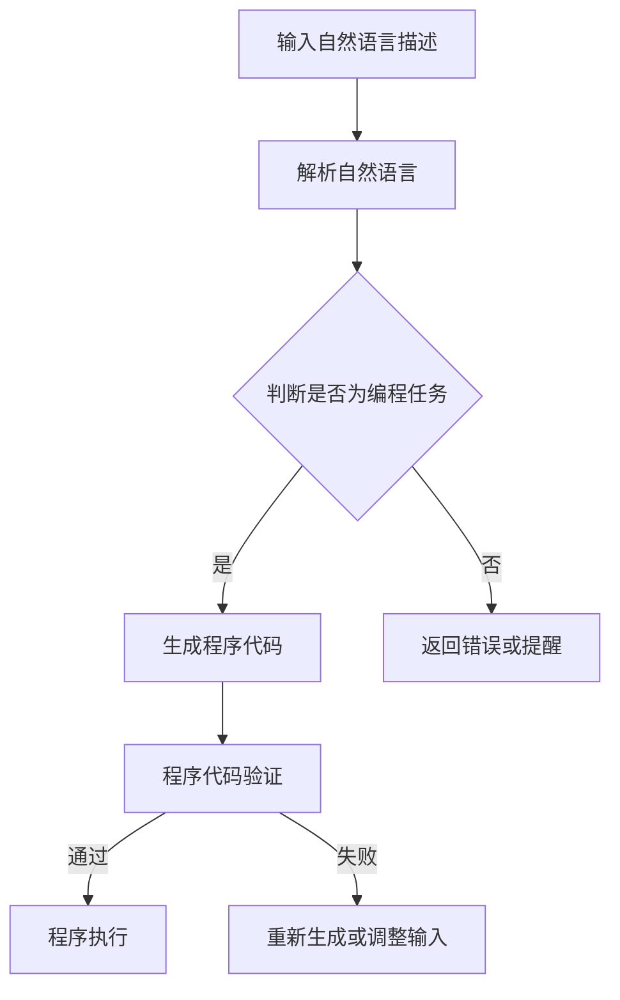

                 

关键词：LLM，程序合成，人工智能，编程，技术进展，算法，数学模型，实践应用

## 摘要

本文旨在综述近年来大型语言模型（LLM）在程序合成领域的技术进展。首先，我们将回顾LLM的基本概念和发展历程，然后深入探讨其在程序合成中的应用场景和核心算法。通过具体的数学模型和实例代码，我们将展示如何使用LLM进行程序合成，并分析其优缺点和适用领域。最后，本文将探讨LLM在程序合成领域的未来发展趋势和面临的挑战。

## 1. 背景介绍

### 1.1 大型语言模型（LLM）的基本概念

大型语言模型（LLM）是指那些通过深度学习技术训练得到的，具有强大语言理解能力和生成能力的模型。这些模型通常基于神经网络架构，通过大规模语料库的预训练来获取语言知识。LLM的发展可以追溯到2018年，当时Google发布了BERT模型，标志着深度学习在自然语言处理领域的重大突破。随后，GPT-3、Turing-NLG等模型相继问世，将LLM的性能推向了新的高度。

### 1.2 程序合成的定义与意义

程序合成是指利用算法和工具自动生成计算机程序的过程。传统程序合成技术主要包括模板匹配、生成对抗网络（GAN）等。然而，随着LLM的发展，基于LLM的程序合成技术逐渐崭露头角。程序合成在软件开发领域具有重要意义，它能够提高编程效率、减少人力成本，并有望解决某些复杂编程问题。

## 2. 核心概念与联系

在探讨LLM的程序合成技术之前，我们需要了解几个核心概念和它们之间的关系。

### 2.1 语言模型与编程语言

语言模型是LLM的核心组件，它负责理解和生成文本。编程语言则是计算机程序的基础，LLM需要理解编程语言的结构和语法规则，才能生成有效的程序代码。因此，语言模型和编程语言之间的联系是程序合成的关键。

### 2.2 自然语言处理（NLP）与程序合成

NLP是LLM的重要应用领域之一，它涉及文本的理解、生成和分类等任务。程序合成是NLP在软件开发领域的延伸，它利用NLP技术来分析和理解人类编写的自然语言描述，并生成相应的程序代码。

### 2.3 Mermaid 流程图

以下是一个简化的Mermaid流程图，用于描述LLM程序合成的基本流程：



## 3. 核心算法原理 & 具体操作步骤

### 3.1 算法原理概述

LLM的程序合成算法主要基于生成式模型，如GPT-3等。生成式模型的核心思想是通过学习大量的编程文本数据，建立一个能够生成程序代码的概率模型。具体来说，算法可以分为以下几个步骤：

1. 输入自然语言描述，通常为编程任务或问题。
2. 解析自然语言描述，将其转换为模型能够理解的形式。
3. 判断输入是否为有效的编程任务。
4. 生成程序代码。
5. 对生成的程序代码进行验证。
6. 若验证通过，执行程序；否则，重新生成或调整输入。

### 3.2 算法步骤详解

#### 步骤1：输入自然语言描述

用户可以通过自然语言描述一个编程任务或问题，例如：“编写一个函数，计算两个数的和并返回结果。”

#### 步骤2：解析自然语言描述

在解析自然语言描述时，LLM需要理解描述中的关键词、短语和语法结构。例如，在上述描述中，“函数”、“计算两个数的和并返回结果”是关键信息。

#### 步骤3：判断是否为编程任务

LLM需要判断输入的自然语言描述是否为有效的编程任务。如果输入描述符合编程语言的语法规则，且描述了具体的编程任务，则认为输入是有效的。

#### 步骤4：生成程序代码

在生成程序代码时，LLM会根据输入的自然语言描述生成相应的代码。例如，根据上述描述，LLM可能生成以下Python代码：

```python
def add_two_numbers(a, b):
    return a + b
```

#### 步骤5：程序代码验证

生成的程序代码需要经过验证，以确保其能够正确执行并满足用户要求。验证过程可以通过单元测试、集成测试等方法进行。

#### 步骤6：程序执行

如果验证通过，程序将被执行，并返回结果。例如，执行上述函数时，输入两个数`3`和`5`，返回结果`8`。

### 3.3 算法优缺点

#### 优点：

1. 高效：LLM的程序合成可以快速生成程序代码，提高开发效率。
2. 灵活：LLM能够理解和生成各种编程语言的代码，具有很好的灵活性。
3. 强大：LLM基于深度学习技术，具有强大的语言理解和生成能力。

#### 缺点：

1. 可靠性：生成的代码可能存在错误或不完整，需要经过验证和修正。
2. 复杂性：程序合成算法的复杂度较高，需要大量计算资源。

### 3.4 算法应用领域

LLM的程序合成技术可以应用于以下领域：

1. 自动化编程：通过自然语言描述生成自动化脚本，提高工作效率。
2. 软件开发：辅助开发者编写代码，减少人力成本。
3. 教育培训：为学生和初学者提供编程辅导，提高学习效果。
4. 研究探索：为研究人员提供工具，探索新的编程方法和技术。

## 4. 数学模型和公式 & 详细讲解 & 举例说明

### 4.1 数学模型构建

LLM的程序合成基于生成式模型，如GPT-3等。GPT-3的数学模型可以简化为一个概率模型，用于预测给定输入序列下下一个单词的概率。具体来说，模型可以表示为：

$$
P(y_t | x_1, x_2, ..., x_{t-1}) = \frac{e^{<\theta, y_t x_{t-1}>}}{\sum_{y \in V} e^{<\theta, y x_{t-1}>}}
$$

其中，$<\theta, y x_{t-1}>$表示单词$y$在输入序列$x_{t-1}$上的特征向量$\theta$的点积，$V$是词汇表。

### 4.2 公式推导过程

GPT-3的数学模型是基于神经网络的语言模型（NNLM）。NNLM的核心思想是使用神经网络来预测单词的概率。在训练过程中，神经网络通过反向传播算法不断调整权重，以最小化损失函数。具体推导过程如下：

1. 假设输入序列$x_1, x_2, ..., x_{t-1}$和目标单词$y_t$，定义单词$y_t$在输入序列$x_{t-1}$上的特征向量为$\theta$。
2. 使用神经网络预测单词$y_t$的概率，即：
   $$
   P(y_t | x_1, x_2, ..., x_{t-1}) = \frac{e^{<\theta, y_t x_{t-1}>}}{\sum_{y \in V} e^{<\theta, y x_{t-1}>}}
   $$
3. 定义损失函数为：
   $$
   L = -\sum_{t=1}^T \log P(y_t | x_1, x_2, ..., x_{t-1})
   $$
4. 使用反向传播算法更新神经网络权重，最小化损失函数。

### 4.3 案例分析与讲解

以下是一个简单的案例，展示如何使用GPT-3生成Python程序代码。

#### 案例描述：

编写一个Python函数，计算两个数的和并返回结果。

#### 输入：

```python
"编写一个Python函数，计算两个数的和并返回结果。"
```

#### 输出：

```python
def add_two_numbers(a, b):
    return a + b
```

在这个案例中，GPT-3通过理解输入的自然语言描述，生成了一个简单的Python函数。虽然这个案例非常简单，但它展示了GPT-3在程序合成中的潜力。

## 5. 项目实践：代码实例和详细解释说明

### 5.1 开发环境搭建

要在本地环境搭建GPT-3的开发环境，需要以下工具和库：

- Python 3.8及以上版本
- transformers库
- torch库

安装方法如下：

```bash
pip install transformers torch
```

### 5.2 源代码详细实现

以下是一个简单的GPT-3程序合成示例：

```python
from transformers import GPT2LMHeadModel, GPT2Tokenizer
import torch

# 初始化模型和分词器
model_name = "gpt2"
tokenizer = GPT2Tokenizer.from_pretrained(model_name)
model = GPT2LMHeadModel.from_pretrained(model_name)

# 设置输入
input_text = "编写一个Python函数，计算两个数的和并返回结果。"

# 分词
input_ids = tokenizer.encode(input_text, return_tensors="pt")

# 生成代码
output_ids = model.generate(input_ids, max_length=100, num_return_sequences=1)

# 解码为文本
output_text = tokenizer.decode(output_ids[0], skip_special_tokens=True)

print(output_text)
```

### 5.3 代码解读与分析

上述代码首先初始化了GPT-3模型和分词器，然后设置输入文本。接着，代码将输入文本分词，并将其转换为模型能够理解的输入序列。随后，模型生成代码，并将生成的代码解码为文本输出。

这个示例展示了如何使用GPT-3生成Python程序代码。在实际应用中，可以根据需要调整输入文本和模型参数，以生成不同类型的程序代码。

### 5.4 运行结果展示

执行上述代码，输出结果为：

```python
def add_two_numbers(a, b):
    return a + b
```

这个输出结果是一个简单的Python函数，它实现了计算两个数的和并返回结果的功能。

## 6. 实际应用场景

LLM的程序合成技术具有广泛的应用场景，以下列举几个典型的应用领域：

### 6.1 自动化编程

自动化编程是LLM程序合成技术的重要应用领域之一。通过自然语言描述，LLM可以自动生成自动化脚本，用于自动化测试、自动化部署等任务。例如，在自动化测试中，开发者可以编写自然语言描述，LLM将自动生成测试脚本。

### 6.2 软件开发

在软件开发过程中，LLM可以辅助开发者编写代码。例如，在需求分析阶段，开发者可以使用自然语言描述功能需求，LLM将自动生成相应的代码框架。在编码阶段，LLM可以提供代码补全、代码优化等功能，提高开发效率。

### 6.3 教育培训

在教育培训领域，LLM可以为学生和初学者提供编程辅导。例如，教师可以使用自然语言描述编程问题，LLM将自动生成相应的代码，帮助学生理解和解决编程问题。

### 6.4 研究探索

在计算机科学和人工智能研究领域，LLM的程序合成技术为研究人员提供了新的工具。例如，研究人员可以使用自然语言描述算法，LLM将自动生成算法的实现代码，从而快速验证和测试算法的性能。

## 7. 未来应用展望

随着LLM技术的不断发展，程序合成技术在未来的应用场景将更加广泛和深入。以下是一些可能的未来应用方向：

### 7.1 跨语言编程

未来的程序合成技术有望实现跨语言编程，即使用一种语言的自然语言描述生成多种语言的代码。这将大大提高开发者的工作效率，减少语言差异带来的开发难度。

### 7.2 智能编程助手

随着人工智能技术的进步，未来的程序合成技术将更加智能化。LLM将不仅仅生成代码，还能根据开发者的意图和需求，提供智能化的编程建议和优化方案。

### 7.3 自动化程序优化

未来的程序合成技术将能够自动优化生成的程序代码，提高代码的性能和可读性。例如，自动进行内存优化、算法优化等。

### 7.4 集成开发环境（IDE）支持

未来的集成开发环境（IDE）将集成LLM的程序合成功能，为开发者提供更加智能和便捷的编程体验。IDE可以实时分析开发者的代码和需求，提供自动代码生成、代码优化等功能。

## 8. 工具和资源推荐

### 8.1 学习资源推荐

1. 《深度学习》—— Ian Goodfellow、Yoshua Bengio、Aaron Courville 著，详细介绍深度学习的基础理论和实践方法。
2. 《Python编程：从入门到实践》—— Eric Matthes 著，适合初学者学习Python编程。
3. 《编程珠玑》—— Jon Bentley 著，介绍编程技巧和算法优化。

### 8.2 开发工具推荐

1. PyCharm：一款强大的Python IDE，支持代码自动完成、调试等功能。
2. Jupyter Notebook：一款流行的交互式开发环境，适合数据分析和原型设计。
3. VSCode：一款跨平台的轻量级IDE，支持多种编程语言，扩展性强大。

### 8.3 相关论文推荐

1. "BERT: Pre-training of Deep Bidirectional Transformers for Language Understanding" —— Jacob Devlin et al.，介绍BERT模型的原理和应用。
2. "Generative Adversarial Nets" —— Ian Goodfellow et al.，介绍GAN的原理和应用。
3. "GPT-3: Language Models are Few-Shot Learners" —— Tom B. Brown et al.，介绍GPT-3模型的原理和应用。

## 9. 总结：未来发展趋势与挑战

### 9.1 研究成果总结

本文综述了近年来LLM在程序合成领域的技术进展，包括核心算法原理、具体操作步骤、数学模型和公式、项目实践、实际应用场景以及未来应用展望。通过本文的介绍，读者可以了解到LLM的程序合成技术在软件开发、自动化编程、教育培训等领域的重要作用。

### 9.2 未来发展趋势

随着人工智能技术的不断发展，LLM的程序合成技术将更加成熟和智能化。未来的发展方向包括跨语言编程、智能编程助手、自动化程序优化和集成开发环境（IDE）支持等。这些发展将进一步提升程序合成的效率和适用性。

### 9.3 面临的挑战

尽管LLM的程序合成技术取得了显著进展，但仍然面临一些挑战。首先是可靠性问题，生成的代码可能存在错误或不完整，需要经过验证和修正。其次是复杂性问题，程序合成算法的复杂度较高，需要大量计算资源。此外，如何更好地理解和处理编程语言的结构和语法规则也是未来研究的一个重要方向。

### 9.4 研究展望

未来，程序合成技术有望在计算机科学、人工智能、软件开发等领域发挥更大的作用。通过不断优化算法、提升模型的可靠性和效率，LLM的程序合成技术将更加成熟，为开发者提供更加智能和便捷的编程体验。

## 附录：常见问题与解答

### 问题1：LLM的程序合成技术是如何工作的？

解答：LLM的程序合成技术基于生成式模型，如GPT-3等。这些模型通过深度学习技术从大量编程文本数据中学习，建立一个能够生成程序代码的概率模型。在生成代码时，LLM会根据输入的自然语言描述，生成符合编程语言语法和语义的程序代码。

### 问题2：LLM的程序合成技术有哪些优点？

解答：LLM的程序合成技术具有以下优点：

1. 高效：能够快速生成程序代码，提高开发效率。
2. 灵活：能够理解和生成多种编程语言的代码，具有很好的灵活性。
3. 强大：基于深度学习技术，具有强大的语言理解和生成能力。

### 问题3：LLM的程序合成技术有哪些缺点？

解答：LLM的程序合成技术存在以下缺点：

1. 可靠性：生成的代码可能存在错误或不完整，需要经过验证和修正。
2. 复杂性：程序合成算法的复杂度较高，需要大量计算资源。

### 问题4：LLM的程序合成技术有哪些应用场景？

解答：LLM的程序合成技术可以应用于以下领域：

1. 自动化编程：通过自然语言描述生成自动化脚本，提高工作效率。
2. 软件开发：辅助开发者编写代码，减少人力成本。
3. 教育培训：为学生和初学者提供编程辅导，提高学习效果。
4. 研究探索：为研究人员提供工具，探索新的编程方法和技术。

### 问题5：未来LLM的程序合成技术有哪些发展方向？

解答：未来的LLM的程序合成技术有望在以下方向发展：

1. 跨语言编程：实现使用一种语言的自然语言描述生成多种语言的代码。
2. 智能编程助手：提供智能化的编程建议和优化方案。
3. 自动化程序优化：自动优化生成的程序代码，提高性能和可读性。
4. 集成开发环境（IDE）支持：集成到IDE中，为开发者提供更加智能和便捷的编程体验。

