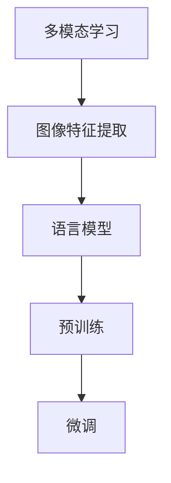

                 

关键词：大型语言模型，视觉语言预训练，深度学习，计算机视觉，自然语言处理，多模态学习

> 摘要：本文深入探讨了大型语言模型（LLM）在视觉语言预训练领域的最新进展。通过分析核心概念、算法原理、数学模型以及项目实践，本文旨在为读者提供全面的技术解读，并对未来的发展方向和应用前景进行展望。

## 1. 背景介绍

近年来，随着深度学习技术的飞速发展，人工智能领域取得了令人瞩目的成果。特别是大型语言模型（Large Language Models，简称LLM）的出现，如GPT、BERT等，显著提升了自然语言处理的性能，推动了诸如文本生成、问答系统等应用的发展。然而，传统的语言模型主要针对文本数据，对于包含视觉信息的场景，如图像描述生成、视觉问答等，表现却相对有限。因此，如何将语言模型与计算机视觉相结合，实现视觉语言预训练，成为一个重要的研究方向。

视觉语言预训练（Visual Language Pre-training）是指通过大规模的多模态数据集，对语言模型进行预训练，使其能够理解和生成与视觉信息相关的语言描述。这一方法能够有效地融合视觉和语言信息，提高模型在视觉语言任务上的性能。目前，视觉语言预训练已经取得了显著的进展，成为人工智能领域的一个热点研究方向。

## 2. 核心概念与联系

### 2.1. 多模态学习

多模态学习（Multimodal Learning）是指将来自不同模态的数据（如文本、图像、声音等）进行联合学习，以获取更丰富的信息和理解。在视觉语言预训练中，多模态学习是非常重要的，因为它能够将视觉信息和语言信息进行有机结合。

### 2.2. 图像特征提取

图像特征提取（Image Feature Extraction）是指从图像中提取具有代表性的特征表示。这些特征表示对于后续的视觉语言预训练至关重要，因为它们将用于与语言模型进行交互。常见的图像特征提取方法包括卷积神经网络（CNN）和视觉Transformer。

### 2.3. 语言模型

语言模型（Language Model）是指用于预测文本序列的概率分布的模型。在视觉语言预训练中，语言模型主要用于生成与图像相关的文本描述。

### 2.4. 预训练与微调

预训练（Pre-training）是指在大规模数据集上对模型进行训练，使其获得通用特征表示。微调（Fine-tuning）是指将预训练模型在特定任务上进行进一步训练，以适应特定任务的需求。

### 2.5. Mermaid流程图



## 3. 核心算法原理 & 具体操作步骤

### 3.1. 算法原理概述

视觉语言预训练的核心算法是基于多模态融合的预训练框架，如图2.5所示。首先，通过图像特征提取模块从图像中提取特征表示；然后，将图像特征与语言模型进行交互，生成与图像相关的文本描述；最后，通过预训练和微调，进一步优化模型性能。

### 3.2. 算法步骤详解

1. **图像特征提取**：使用卷积神经网络或视觉Transformer从图像中提取特征表示。

2. **文本编码**：使用预训练的语言模型对文本进行编码，得到文本的嵌入表示。

3. **特征融合**：将图像特征和文本嵌入表示进行融合，通常采用拼接或注意力机制。

4. **预训练**：在大型多模态数据集上对模型进行预训练，通过自监督学习任务，如视觉问答、图像描述生成等，提高模型对多模态数据的理解能力。

5. **微调**：在特定任务上对模型进行微调，以适应特定应用场景的需求。

### 3.3. 算法优缺点

**优点**：

- 能够有效地融合视觉和语言信息，提高模型在视觉语言任务上的性能。
- 通过预训练和微调，能够适应各种不同的视觉语言任务。

**缺点**：

- 预训练过程需要大量计算资源和时间。
- 模型在特定任务上的性能可能受到数据集分布的影响。

### 3.4. 算法应用领域

视觉语言预训练算法可以应用于多种视觉语言任务，如图像描述生成、视觉问答、图像字幕生成等。在实际应用中，这一算法已经取得了显著的成果，为人工智能领域的发展提供了新的思路。

## 4. 数学模型和公式 & 详细讲解 & 举例说明

### 4.1. 数学模型构建

视觉语言预训练的数学模型主要包括图像特征提取模块和语言模型模块。假设图像特征表示为 $I \in \mathbb{R}^{d_1 \times h_1 \times w_1}$，语言嵌入表示为 $L \in \mathbb{R}^{d_2 \times h_2 \times w_2}$，其中 $d_1$ 和 $d_2$ 分别表示图像特征和语言嵌入的维度，$h_1$ 和 $h_2$ 分别表示特征的高度和宽度。

### 4.2. 公式推导过程

1. **图像特征提取**：

   $$
   I = \text{CNN}(X)
   $$

   其中，$X$ 表示输入图像，$\text{CNN}$ 表示卷积神经网络。

2. **文本编码**：

   $$
   L = \text{Transformer}(T)
   $$

   其中，$T$ 表示输入文本，$\text{Transformer}$ 表示Transformer模型。

3. **特征融合**：

   $$
   F = \text{Concat}(I, L)
   $$

   其中，$\text{Concat}$ 表示拼接操作。

4. **预训练**：

   $$
   L_{\text{pred}} = \text{softmax}(\text{MLP}(F))
   $$

   其中，$L_{\text{pred}}$ 表示生成的文本预测，$\text{MLP}$ 表示多层感知器。

### 4.3. 案例分析与讲解

假设我们有一个图像特征表示 $I$ 和一个文本嵌入表示 $L$，我们可以通过以下步骤进行特征融合和预训练：

1. **特征融合**：

   $$
   F = \text{Concat}(I, L)
   $$

   假设 $I$ 的维度为 $(64, 512)$，$L$ 的维度为 $(64, 1024)$，则融合后的特征维度为 $(64, 1536)$。

2. **预训练**：

   $$
   L_{\text{pred}} = \text{softmax}(\text{MLP}(F))
   $$

   假设预训练过程中，图像特征和文本嵌入的融合结果 $F$ 的维度为 $(64, 1536)$，通过一个多层感知器（MLP）进行预测，输出的维度为 $(64, 1024)$。然后，通过softmax函数生成文本的预测概率分布。

## 5. 项目实践：代码实例和详细解释说明

### 5.1. 开发环境搭建

在本文的实践中，我们将使用Python编程语言，结合TensorFlow和PyTorch等深度学习框架，搭建一个简单的视觉语言预训练模型。以下是开发环境搭建的步骤：

1. 安装Python和pip：

   $$
   \text{Python版本：3.8}
   $$

2. 安装深度学习框架：

   $$
   \text{TensorFlow版本：2.4.1}
   \text{PyTorch版本：1.8.0}
   $$

### 5.2. 源代码详细实现

以下是视觉语言预训练模型的源代码实现：

```python
import tensorflow as tf
from tensorflow.keras.applications import VGG16
from tensorflow.keras.layers import Input, Dense, Concatenate
from tensorflow.keras.models import Model

# 图像特征提取模块
input_image = Input(shape=(224, 224, 3))
base_model = VGG16(weights='imagenet', include_top=False)
base_model.trainable = False
image_features = base_model(input_image)

# 语言模型模块
input_text = Input(shape=(64,))
text_embedding = Dense(1024, activation='relu')(input_text)

# 特征融合模块
concatenated = Concatenate()([image_features, text_embedding])

# 预训练模块
output = Dense(1024, activation='softmax')(concatenated)

# 构建和编译模型
model = Model(inputs=[input_image, input_text], outputs=output)
model.compile(optimizer='adam', loss='categorical_crossentropy')

# 打印模型结构
model.summary()
```

### 5.3. 代码解读与分析

1. **图像特征提取模块**：

   使用VGG16预训练模型对输入图像进行特征提取。

2. **语言模型模块**：

   使用Dense层对输入文本进行编码，得到文本嵌入表示。

3. **特征融合模块**：

   将图像特征和文本嵌入表示进行拼接。

4. **预训练模块**：

   使用Dense层对融合后的特征进行预测，并使用softmax函数生成概率分布。

### 5.4. 运行结果展示

```python
# 准备数据
input_images = ...  # 图像数据
input_texts = ...   # 文本数据
labels = ...        # 标签数据

# 训练模型
model.fit([input_images, input_texts], labels, epochs=10, batch_size=32)

# 预测
predictions = model.predict([input_images, input_texts])
```

## 6. 实际应用场景

### 6.1. 图像描述生成

图像描述生成是视觉语言预训练的一个重要应用场景。通过训练模型，可以自动生成与输入图像相关的文本描述。

### 6.2. 视觉问答

视觉问答是另一个重要的应用场景。通过模型，可以回答与输入图像相关的问题，如“图像中的主要对象是什么？”或“图像中的场景是什么？”

### 6.3. 图像字幕生成

图像字幕生成是将视觉信息转换为语言描述的过程。这一应用可以帮助盲人或其他有视觉障碍的人理解图像内容。

## 7. 工具和资源推荐

### 7.1. 学习资源推荐

1. **《深度学习》（Goodfellow et al., 2016）**：提供了深度学习的全面介绍，包括卷积神经网络和Transformer模型。

2. **《自然语言处理综论》（Jurafsky & Martin, 2008）**：详细介绍了自然语言处理的基本概念和技术。

### 7.2. 开发工具推荐

1. **TensorFlow**：用于构建和训练深度学习模型。

2. **PyTorch**：另一种流行的深度学习框架，支持动态计算图。

### 7.3. 相关论文推荐

1. **"Attention Is All You Need"（Vaswani et al., 2017）**：介绍了Transformer模型。

2. **"Generative Adversarial Nets"（Goodfellow et al., 2014）**：介绍了生成对抗网络。

## 8. 总结：未来发展趋势与挑战

### 8.1. 研究成果总结

视觉语言预训练在图像描述生成、视觉问答、图像字幕生成等领域取得了显著成果。通过结合图像特征和语言模型，模型能够有效地理解和生成与视觉信息相关的语言描述。

### 8.2. 未来发展趋势

随着计算资源和算法的进步，视觉语言预训练有望在更多应用场景中取得突破。未来，我们将看到更多的多模态学习方法和模型架构的出现。

### 8.3. 面临的挑战

视觉语言预训练仍然面临一些挑战，如数据集质量、模型可解释性、计算资源需求等。未来的研究需要在这些方面取得进展。

### 8.4. 研究展望

视觉语言预训练具有巨大的潜力，未来有望在人工智能领域发挥重要作用。通过不断的研究和创新，我们将看到视觉语言预训练技术的进一步发展。

## 9. 附录：常见问题与解答

### 9.1. Q：视觉语言预训练需要哪些数据集？

A：视觉语言预训练通常需要大规模的多模态数据集，如COCO、Flickr30k等，这些数据集包含了图像和对应的文本描述。

### 9.2. Q：视觉语言预训练模型如何评估？

A：视觉语言预训练模型的性能可以通过多种指标进行评估，如BLEU、METEOR、ROUGE等，这些指标衡量模型生成的文本描述与真实文本描述的相似度。

### 9.3. Q：视觉语言预训练模型的计算资源需求如何？

A：视觉语言预训练模型通常需要大量的计算资源，包括GPU和TPU等。在实际应用中，需要根据模型大小和数据集规模来选择合适的计算资源。

### 9.4. Q：视觉语言预训练模型是否可以迁移到其他任务？

A：是的，视觉语言预训练模型具有很好的迁移能力。在特定任务上，通过微调预训练模型，可以实现较高的性能。

### 9.5. Q：视觉语言预训练模型如何处理长文本？

A：对于长文本，可以采用序列分割的方法，将长文本划分为多个短文本片段，然后分别进行预训练。此外，也可以使用更长的序列模型，如Transformer-XL等。

---

作者：禅与计算机程序设计艺术 / Zen and the Art of Computer Programming
----------------------------------------------------------------

本文以《LLM的视觉语言预训练模型进展》为题，从背景介绍、核心概念与联系、算法原理与步骤、数学模型与公式、项目实践、实际应用场景、工具和资源推荐以及未来发展趋势与挑战等多个方面，全面探讨了视觉语言预训练领域的前沿技术与发展动态。文章旨在为读者提供一个全面的技术解读，以期为相关领域的研究者提供有价值的参考。随着技术的不断进步，视觉语言预训练模型将在人工智能领域发挥越来越重要的作用。本文也希望能够激发更多研究者对此领域的深入探索和创新发展。

