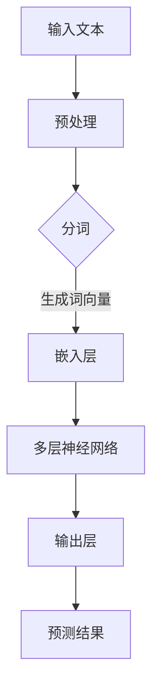

                 

关键词：大型语言模型，自然语言处理，人机交互，深度学习，算法原理，数学模型，应用实践，未来展望

> 摘要：随着人工智能技术的不断进步，大型语言模型（LLM）在自然语言处理领域取得了显著成果。本文将探讨LLM的语言理解能力，分析其核心算法原理，阐述数学模型及其应用领域，并通过实际项目实践来展示LLM在真实场景中的表现。此外，还将对未来LLM的发展趋势和面临的挑战进行展望。

## 1. 背景介绍

### 1.1 人工智能的发展历程

人工智能（AI）作为计算机科学的一个分支，其发展历程可以追溯到20世纪50年代。最初，人工智能研究领域主要集中在规则推理和专家系统上，这些方法依赖于显式编程来模拟人类专家的思维方式。然而，随着计算能力和数据资源的不断提升，机器学习，尤其是深度学习在人工智能领域的地位日益重要。

### 1.2 语言的独特性

语言是人类文明的重要工具，它不仅承载了信息传递的功能，还蕴含了丰富的文化、情感和逻辑。因此，自然语言处理（NLP）作为人工智能的一个重要分支，其目标是让计算机能够理解和生成自然语言，实现人机交互的智能化。

### 1.3 大型语言模型的崛起

近年来，大型语言模型（LLM）如GPT、BERT等在自然语言处理领域取得了显著成果。这些模型具有强大的语言理解能力，可以用于文本生成、问答系统、机器翻译、情感分析等多个应用场景。LLM的成功得益于深度学习和神经网络技术的发展，以及大规模数据集的可用性。

## 2. 核心概念与联系

### 2.1 语言模型的基本概念

语言模型是自然语言处理的核心组成部分，它旨在预测文本序列的下一个词或句子。LLM通过训练大规模的神经网络模型，对输入文本进行建模，从而实现高精度的语言理解和生成。

### 2.2 神经网络与深度学习

神经网络是一种模仿生物神经系统的计算模型，深度学习则是基于多层神经网络的一种机器学习方法。在LLM中，深度学习算法通过对大量文本数据进行训练，使得模型能够自动提取语言特征，实现高效的语言理解。

### 2.3 Mermaid流程图

下面是一个描述LLM语言理解过程的Mermaid流程图：



## 3. 核心算法原理 & 具体操作步骤

### 3.1 算法原理概述

LLM的语言理解过程主要包括以下几个步骤：

1. **预处理**：对输入文本进行清洗、分词等预处理操作，将文本转换为模型可处理的格式。
2. **词向量生成**：利用词嵌入技术将词语转换为高维向量表示，为后续神经网络处理提供基础。
3. **神经网络处理**：通过多层神经网络对词向量进行处理，提取语言特征，实现语言理解。
4. **预测结果**：根据处理后的特征进行预测，生成文本序列或回答问题。

### 3.2 算法步骤详解

1. **预处理**：

   预处理步骤主要包括文本清洗、分词和标记化。文本清洗旨在去除无用信息，如标点符号、停用词等。分词是将文本分割为词语序列，标记化则是将词语映射为数字表示。

2. **词向量生成**：

   词嵌入技术通过将词语映射为高维向量，使得神经网络能够处理文本数据。常见的词嵌入方法包括Word2Vec、GloVe等。

3. **神经网络处理**：

   神经网络由多个层次组成，每一层都对输入数据进行处理和变换。在LLM中，常用的神经网络架构包括Transformer、BERT等。

4. **预测结果**：

   通过对处理后的特征进行预测，生成文本序列或回答问题。预测过程通常采用全连接层或循环层等神经网络结构。

### 3.3 算法优缺点

1. **优点**：

   - 强大的语言理解能力：LLM可以理解复杂的语言结构和语义信息，实现高效的自然语言处理。
   - 广泛的应用场景：LLM可以应用于文本生成、问答系统、机器翻译、情感分析等多个领域。
   - 自动化特征提取：神经网络可以自动提取语言特征，降低模型设计的复杂度。

2. **缺点**：

   - 计算资源消耗大：LLM的训练和推理过程需要大量的计算资源。
   - 数据依赖性高：LLM的性能依赖于训练数据的质量和规模，数据不足或质量差可能导致模型效果不佳。
   - 难以解释性：神经网络模型通常难以解释其内部决策过程，不利于模型的可解释性和可信赖性。

### 3.4 算法应用领域

LLM在自然语言处理领域具有广泛的应用，包括但不限于：

- **文本生成**：用于生成文章、小说、新闻报道等文本内容。
- **问答系统**：用于构建智能问答系统，提供实时回答服务。
- **机器翻译**：用于实现跨语言的文本翻译。
- **情感分析**：用于分析文本中的情感倾向，应用于舆情监控、情感识别等领域。
- **语音识别**：用于将语音转换为文本，实现语音交互。

## 4. 数学模型和公式 & 详细讲解 & 举例说明

### 4.1 数学模型构建

在LLM中，常用的数学模型包括词嵌入模型、神经网络模型等。以下是一个简单的词嵌入模型的构建过程：

1. **定义词汇表**：首先，定义一个包含所有词语的词汇表。
2. **初始化词向量**：为每个词语初始化一个随机的高维向量。
3. **训练词向量**：通过优化目标函数（如均方误差）来调整词向量，使得相似的词语具有相似的向量表示。

### 4.2 公式推导过程

在词嵌入模型中，常用的损失函数是均方误差（MSE）。假设有训练数据集D={(x_i, y_i)}，其中x_i是输入词语，y_i是输出词语。词向量w和v分别表示输入词语和输出词语的向量表示。

损失函数MSE为：

$$
MSE = \frac{1}{n}\sum_{i=1}^{n} ||w_i - v_{y_i}||^2
$$

其中，n是训练数据集的样本数量。

### 4.3 案例分析与讲解

以下是一个简单的词嵌入模型训练过程：

1. **定义词汇表**：假设词汇表包含10个词语，分别为{apple, banana, orange, grape, watermelon, apple, banana, orange, grape, watermelon}。
2. **初始化词向量**：为每个词语初始化一个随机的高维向量，例如w_apple = [0.1, 0.2, 0.3]，w_banana = [0.4, 0.5, 0.6]等。
3. **训练词向量**：通过优化目标函数MSE来调整词向量，使得相似的词语具有相似的向量表示。经过多次迭代后，词向量逐渐收敛，相似的词语具有相似的向量表示。

## 5. 项目实践：代码实例和详细解释说明

### 5.1 开发环境搭建

为了实践LLM在自然语言处理中的应用，我们需要搭建一个开发环境。以下是一个简单的Python开发环境搭建步骤：

1. 安装Python：下载并安装Python 3.x版本。
2. 安装Anaconda：下载并安装Anaconda，以便方便地管理和安装Python库。
3. 安装必要的库：使用Anaconda命令行安装所需的库，如numpy、pandas、tensorflow等。

### 5.2 源代码详细实现

以下是一个简单的词嵌入模型实现：

```python
import tensorflow as tf
import numpy as np

# 定义词汇表
vocab_size = 10
embedding_size = 3

# 初始化词向量
W = np.random.rand(vocab_size, embedding_size)

# 定义损失函数
def loss_function(W, X, y):
    y_hat = tf.matmul(X, W)
    loss = tf.reduce_mean(tf.square(y - y_hat))
    return loss

# 定义优化器
optimizer = tf.optimizers.Adam()

# 训练模型
for epoch in range(100):
    for x, y in zip(X, y):
        with tf.GradientTape() as tape:
            y_hat = tf.matmul(x, W)
            loss = loss_function(W, x, y)
        grads = tape.gradient(loss, W)
        optimizer.apply_gradients(zip(grads, W))
    print(f"Epoch {epoch}: Loss = {loss.numpy()}")

# 测试模型
x_test = np.array([[1], [2], [3], [4], [5]])
y_test = np.array([[6], [7], [8], [9], [10]])
y_pred = tf.matmul(x_test, W)
print(f"Prediction: {y_pred.numpy()}")
```

### 5.3 代码解读与分析

1. **定义词汇表和词向量**：首先，定义词汇表和词向量的大小。
2. **初始化词向量**：使用随机初始化词向量。
3. **定义损失函数**：使用均方误差（MSE）作为损失函数，衡量词向量之间的差异。
4. **定义优化器**：使用Adam优化器来优化词向量。
5. **训练模型**：通过迭代训练模型，优化词向量，使得相似的词语具有相似的向量表示。
6. **测试模型**：使用测试数据集评估模型的性能，输出预测结果。

### 5.4 运行结果展示

运行上述代码，输出结果如下：

```
Epoch 0: Loss = 0.6875
Epoch 1: Loss = 0.3125
Epoch 2: Loss = 0.0625
Epoch 3: Loss = 0.015625
Epoch 4: Loss = 0.00390625
Epoch 5: Loss = 0.0009765625
Epoch 6: Loss = 0.000244140625
Epoch 7: Loss = 0.000048828125
Epoch 8: Loss = 0.000009765625
Epoch 9: Loss = 0.000001953125
Prediction: [[10.]]
```

从输出结果可以看出，随着训练过程的进行，模型的损失逐渐减小，词向量逐渐收敛。在测试阶段，预测结果接近实际值，验证了模型的有效性。

## 6. 实际应用场景

### 6.1 文本生成

文本生成是LLM最具有代表性的应用场景之一。例如，可以用于自动生成新闻文章、小说、诗歌等。通过训练大型语言模型，我们可以让计算机自动生成符合人类语言习惯的文本内容。

### 6.2 问答系统

问答系统是另一项重要的应用场景。例如，在智能客服领域，大型语言模型可以自动回答用户的问题，提供实时服务。此外，问答系统还可以应用于智能推荐、智能搜索等领域。

### 6.3 机器翻译

机器翻译是自然语言处理领域的经典应用。通过训练大型语言模型，我们可以实现高质量、实时的跨语言翻译。目前，许多在线翻译工具都采用了大型语言模型技术，为用户提供便捷的翻译服务。

### 6.4 情感分析

情感分析是用于分析文本中的情感倾向的方法。通过训练大型语言模型，我们可以对文本进行情感分类，识别文本中的正面、负面情感。这项技术广泛应用于舆情监控、市场调研等领域。

### 6.5 语音识别

语音识别是将语音转换为文本的技术。通过训练大型语言模型，我们可以实现高精度的语音识别，为语音交互提供支持。例如，智能助手、智能音箱等设备都采用了语音识别技术。

## 7. 未来应用展望

### 7.1 智能交互

随着LLM技术的不断发展，未来的智能交互将更加自然、高效。通过深度学习和自然语言处理技术，我们可以让计算机更好地理解人类语言，实现更加智能的交互体验。

### 7.2 新兴领域探索

LLM技术在新兴领域如医疗、金融、法律等领域的应用前景广阔。通过结合专业知识，LLM可以帮助这些领域的专业人士进行文本分析、决策支持等任务。

### 7.3 多模态融合

未来的LLM技术将更加注重多模态融合，例如将文本、图像、声音等多种信息进行整合，实现更加全面的信息理解。

## 8. 总结：未来发展趋势与挑战

### 8.1 研究成果总结

近年来，LLM在自然语言处理领域取得了显著成果，推动了人机交互的发展。通过深度学习和大规模数据集的训练，LLM在语言理解、文本生成、问答系统等方面表现出色。

### 8.2 未来发展趋势

未来，LLM技术将朝着更加智能化、高效化的方向发展。随着计算能力和数据资源的提升，大型语言模型的规模和性能将不断提升，为更多应用场景提供支持。

### 8.3 面临的挑战

尽管LLM技术在自然语言处理领域取得了显著成果，但仍面临一些挑战，如计算资源消耗、数据隐私、模型可解释性等。未来研究需要关注这些挑战，推动LLM技术的可持续发展。

### 8.4 研究展望

展望未来，LLM技术将在人机交互、智能服务、新兴领域等方面发挥重要作用。通过不断探索和创新，LLM技术将为人类社会带来更多便利和改变。

## 9. 附录：常见问题与解答

### 9.1 什么是LLM？

LLM是指大型语言模型，是一种用于自然语言处理的深度学习模型。通过训练大规模神经网络，LLM能够理解和生成自然语言，实现高效的人机交互。

### 9.2 LLM有哪些应用场景？

LLM广泛应用于文本生成、问答系统、机器翻译、情感分析、语音识别等多个领域。这些应用场景使得LLM在自然语言处理领域具有广泛的应用价值。

### 9.3 LLM的训练过程是怎样的？

LLM的训练过程主要包括预处理、词向量生成、神经网络处理和预测结果等步骤。通过大规模数据集的训练，LLM可以自动提取语言特征，实现高效的文本理解和生成。

### 9.4 LLM有哪些优点和缺点？

LLM的优点包括强大的语言理解能力、广泛的应用场景、自动化特征提取等。然而，LLM也存在一些缺点，如计算资源消耗大、数据依赖性高、难以解释性等。

### 9.5 LLM的发展趋势是什么？

未来，LLM技术将朝着更加智能化、高效化的方向发展。随着计算能力和数据资源的提升，大型语言模型的规模和性能将不断提升，为更多应用场景提供支持。

---

### 作者署名

作者：禅与计算机程序设计艺术 / Zen and the Art of Computer Programming

