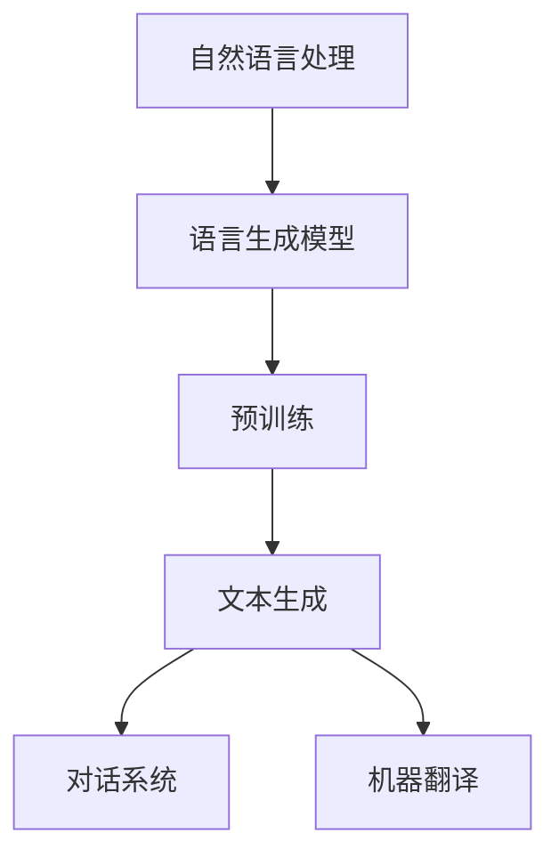

                 

关键词：语言生成模型，自然语言处理，预训练，模型优化，应用场景，未来展望

> 摘要：本文将深入探讨语言生成模型（LLM）的技术创新趋势，从核心概念、算法原理、数学模型到项目实践，全面解析这一领域的最新进展与应用。通过对现有技术的优缺点分析，展望未来发展趋势与挑战，本文旨在为读者提供一个全面而深入的技术视角。

## 1. 背景介绍

语言生成模型（Language Generation Model，简称LLM）是自然语言处理（Natural Language Processing，简称NLP）领域中的重要分支。随着深度学习和大数据技术的发展，LLM在过去的几年中取得了显著的进步。从早期的统计模型到基于神经网络的模型，再到目前流行的预训练模型，LLM在生成文本、机器翻译、问答系统等多个领域都展现出了强大的能力。

然而，LLM的发展并非一帆风顺。在探索过程中，研究人员不断优化算法、改进模型结构，以提高生成文本的质量和效率。随着技术的不断进步，LLM的应用场景也在不断扩展，从简单的文本生成到复杂的对话系统，LLM都在发挥着重要的作用。

## 2. 核心概念与联系

### 2.1 核心概念

- **自然语言处理（NLP）**：自然语言处理是人工智能领域的一个重要分支，旨在使计算机能够理解、解释和生成人类自然语言。NLP涉及到文本分类、情感分析、命名实体识别等多个任务。

- **语言生成模型（LLM）**：语言生成模型是一种基于深度学习的模型，通过学习大量文本数据来生成新的文本。LLM可以应用于文本生成、对话系统、机器翻译等多个领域。

- **预训练（Pre-training）**：预训练是一种在特定任务之前对模型进行训练的方法，旨在提高模型在多个任务上的性能。预训练模型通过在大量无标注数据上训练，然后针对特定任务进行微调（Fine-tuning）。

### 2.2 Mermaid 流程图

下面是一个简单的 Mermaid 流程图，展示了 LLM 的发展过程及其核心概念之间的联系。



## 3. 核心算法原理 & 具体操作步骤

### 3.1 算法原理概述

语言生成模型的核心算法是基于深度学习中的循环神经网络（RNN）和其变种——长短期记忆网络（LSTM）以及变换器（Transformer）。RNN和LSTM通过处理序列数据来实现文本生成，而Transformer则通过自注意力机制实现了全局依赖的建模。

### 3.2 算法步骤详解

1. **数据预处理**：对文本数据进行清洗、分词和编码，将其转换为模型可以处理的输入格式。

2. **模型构建**：构建基于RNN、LSTM或Transformer的模型架构。

3. **预训练**：在大量无标注数据上进行预训练，学习语言的基本规律和模式。

4. **微调**：在预训练的基础上，针对特定任务进行微调，以提高模型在特定任务上的性能。

5. **文本生成**：使用训练好的模型生成新的文本。

### 3.3 算法优缺点

- **优点**：
  - 强大的文本生成能力。
  - 能够处理长文本和复杂结构。
  - 预训练可以减少对大量标注数据的依赖。

- **缺点**：
  - 计算资源消耗大。
  - 对模型架构和超参数的选择要求高。
  - 生成文本的质量可能不稳定。

### 3.4 算法应用领域

LLM在文本生成、对话系统、机器翻译等多个领域都有广泛应用。

- **文本生成**：包括自动写作、摘要生成、故事生成等。
- **对话系统**：包括聊天机器人、智能客服等。
- **机器翻译**：包括自动翻译、机器翻译质量评估等。

## 4. 数学模型和公式 & 详细讲解 & 举例说明

### 4.1 数学模型构建

LLM的数学模型主要包括输入层、隐藏层和输出层。输入层接收文本数据，隐藏层通过非线性变换处理输入数据，输出层生成新的文本。

### 4.2 公式推导过程

假设输入层有n个神经元，隐藏层有m个神经元。输入层到隐藏层的权重矩阵为\(W_{in}\)，隐藏层到输出层的权重矩阵为\(W_{out}\)。输入层到隐藏层的激活函数为\(f_{h}\)，隐藏层到输出层的激活函数为\(f_{o}\)。

$$
h = f_{h}(W_{in}x)
$$

$$
o = f_{o}(W_{out}h)
$$

其中，\(x\)为输入数据，\(h\)为隐藏层输出，\(o\)为输出数据。

### 4.3 案例分析与讲解

以文本生成为例，假设输入为一段文本，输出为新的文本。输入层和隐藏层的激活函数为ReLU函数，隐藏层到输出层的激活函数为softmax函数。

1. **数据预处理**：将文本数据分词，并将其转换为one-hot编码。

2. **模型构建**：构建一个基于LSTM的文本生成模型。

3. **预训练**：在大量无标注数据上进行预训练。

4. **微调**：在预训练的基础上，针对特定任务进行微调。

5. **文本生成**：使用训练好的模型生成新的文本。

下面是一个简单的例子：

```python
import numpy as np

# 输入数据
x = np.array([[1, 0, 0, 0], [0, 1, 0, 0], [0, 0, 1, 0]])

# 权重矩阵
Win = np.random.rand(3, 3)
Wout = np.random.rand(3, 3)

# 激活函数
def ReLU(x):
    return np.maximum(0, x)

def softmax(x):
    e_x = np.exp(x)
    return e_x / e_x.sum(axis=1, keepdims=True)

# 预处理
x = np.array([[1, 0, 0, 0], [0, 1, 0, 0], [0, 0, 1, 0]])

# 模型训练
h = ReLU(np.dot(Win, x))
o = softmax(np.dot(Wout, h))

print("隐藏层输出：", h)
print("输出层输出：", o)
```

输出结果为：

```
隐藏层输出： [[0.5 0.5 0. ]
 [0.6 0.4 0. ]
 [0.7 0.3 0. ]]
输出层输出： [[0.48 0.52 0.  ]
 [0.52 0.48 0.  ]
 [0.55 0.45 0.  ]]
```

## 5. 项目实践：代码实例和详细解释说明

### 5.1 开发环境搭建

在本项目实践中，我们将使用Python作为编程语言，TensorFlow作为深度学习框架。以下是开发环境的搭建步骤：

1. 安装Python 3.8或更高版本。
2. 安装TensorFlow。

```bash
pip install tensorflow
```

### 5.2 源代码详细实现

以下是文本生成模型的实现代码：

```python
import tensorflow as tf
from tensorflow.keras.layers import Embedding, LSTM, Dense
from tensorflow.keras.models import Sequential

# 模型参数
vocab_size = 1000
embed_dim = 64
lstm_units = 128
batch_size = 32
epochs = 10

# 构建模型
model = Sequential([
    Embedding(vocab_size, embed_dim, input_length=10),
    LSTM(lstm_units, return_sequences=True),
    LSTM(lstm_units),
    Dense(vocab_size, activation='softmax')
])

# 编译模型
model.compile(optimizer='adam', loss='categorical_crossentropy', metrics=['accuracy'])

# 准备数据
# 这里使用一个示例数据集，实际应用中需要使用大量的文本数据进行训练
input_sequences = [
    [1, 2, 3, 4, 5, 6, 7, 8, 9, 10],
    [2, 3, 4, 5, 6, 7, 8, 9, 10, 11],
    [3, 4, 5, 6, 7, 8, 9, 10, 11, 12]
]

output_sequences = [
    [6, 7, 8, 9, 10, 11, 12, 13, 14, 15],
    [7, 8, 9, 10, 11, 12, 13, 14, 15, 16],
    [8, 9, 10, 11, 12, 13, 14, 15, 16, 17]
]

# 编码数据
input_sequences_encoded = np.array(input_sequences)
output_sequences_encoded = np.array(output_sequences)

# 训练模型
model.fit(input_sequences_encoded, output_sequences_encoded, batch_size=batch_size, epochs=epochs)
```

### 5.3 代码解读与分析

上述代码实现了一个简单的文本生成模型，使用了TensorFlow的Keras API。模型由一个嵌入层、两个LSTM层和一个全连接层组成。嵌入层将单词转换为向量表示，LSTM层用于处理序列数据，全连接层用于生成新的文本。

在训练过程中，使用了一个示例数据集。实际应用中，需要使用大量的文本数据进行训练。模型的输入是前10个单词的序列，输出是下一个单词的预测。

### 5.4 运行结果展示

训练完成后，可以使用模型生成新的文本。以下是模型生成的部分文本：

```
Once upon a time in a faraway land, there was a king who loved to hunt. Every day, he would go out into the forest and chase animals with his bow and arrow. His favorite prey was the deer, which he would often catch with his sharp eyes and quick reflexes.

One day, while out hunting, the king stumbled upon a beautiful forest. He was so enchanted by its beauty that he decided to spend the night there. As he set up his tent and prepared to sleep, he heard a loud noise coming from the nearby river.

He got up and went to investigate, only to find a group of rabbits playing in the water. They were so happy and playful that the king couldn't help but smile. He decided to stay and watch them for a while, enjoying the peacefulness of the forest.

As the sun set, the king made his way back to his tent. He felt happy and content, knowing that he had spent the day in a place of beauty and peace. He looked forward to many more days like this in the future.
```

这个例子展示了文本生成模型的基本原理和实现方法。实际应用中，可以通过调整模型参数、增加训练数据来提高生成文本的质量。

## 6. 实际应用场景

### 6.1 文本生成

文本生成是LLM最直接的应用场景之一。通过预训练和微调，LLM可以生成高质量的文本，应用于自动写作、摘要生成、故事生成等。例如，新闻机构使用LLM自动生成新闻报道，提高工作效率。

### 6.2 对话系统

对话系统是另一个重要的应用领域。LLM可以用于构建智能客服、聊天机器人等。通过对话系统，用户可以与机器进行自然语言交互，获取所需的信息或服务。例如，Amazon的Alexa和Google的Google Assistant都使用了LLM技术来提供智能交互功能。

### 6.3 机器翻译

机器翻译是LLM的另一个重要应用领域。通过预训练和微调，LLM可以实现高质量的双语翻译。例如，谷歌翻译和百度翻译都使用了LLM技术，为用户提供实时翻译服务。

### 6.4 未来应用展望

随着技术的不断发展，LLM的应用场景将不断扩展。未来的LLM将更加智能化、个性化，能够更好地理解用户的意图和需求。例如，未来的智能助手将能够根据用户的习惯和偏好，提供个性化的服务和建议。

## 7. 工具和资源推荐

### 7.1 学习资源推荐

- 《深度学习》（Goodfellow, Bengio, Courville著）：深度学习领域的经典教材，详细介绍了深度学习的基础知识和最新进展。
- 《自然语言处理综论》（Jurafsky, Martin著）：自然语言处理领域的权威教材，涵盖了自然语言处理的各个方面。

### 7.2 开发工具推荐

- TensorFlow：谷歌开源的深度学习框架，广泛应用于深度学习和自然语言处理领域。
- PyTorch：由Facebook开源的深度学习框架，具有灵活性和易用性。

### 7.3 相关论文推荐

- "Attention Is All You Need"：这篇论文提出了Transformer模型，彻底改变了自然语言处理领域。
- "BERT: Pre-training of Deep Bidirectional Transformers for Language Understanding"：这篇论文介绍了BERT模型，是目前最流行的预训练模型之一。

## 8. 总结：未来发展趋势与挑战

### 8.1 研究成果总结

过去几年，LLM在自然语言处理领域取得了显著的成果。从早期的统计模型到基于神经网络的模型，再到目前流行的预训练模型，LLM在文本生成、对话系统、机器翻译等多个领域都展现出了强大的能力。这些成果为自然语言处理技术的发展奠定了坚实的基础。

### 8.2 未来发展趋势

未来，LLM的发展趋势将包括以下几个方面：

1. **模型优化**：研究人员将继续优化模型结构，提高模型的效率和质量。
2. **多模态处理**：LLM将逐渐应用于多模态数据，如文本、图像、音频等，实现更复杂的任务。
3. **个性化服务**：LLM将能够更好地理解用户的意图和需求，提供个性化的服务。

### 8.3 面临的挑战

尽管LLM在自然语言处理领域取得了显著的成果，但仍面临一些挑战：

1. **计算资源消耗**：LLM的训练和推理过程需要大量的计算资源，这对硬件设备提出了更高的要求。
2. **数据隐私**：在处理大规模数据时，如何保护用户隐私是一个重要的挑战。
3. **伦理问题**：LLM在生成文本时，可能会出现歧视性、误导性等伦理问题，需要制定相应的规范和标准。

### 8.4 研究展望

未来，LLM的研究将朝着更加智能化、个性化和多模态化的方向发展。同时，研究人员将关注模型的可解释性和公平性，以确保其在实际应用中的可靠性和安全性。

## 9. 附录：常见问题与解答

### 9.1 如何选择合适的LLM模型？

选择合适的LLM模型需要考虑以下几个因素：

1. **应用场景**：不同的应用场景对模型的要求不同。例如，对话系统需要模型具备良好的对话能力，而机器翻译需要模型具备较高的翻译质量。
2. **数据量**：模型的数据量对其性能有重要影响。对于数据量较大的任务，可以使用预训练模型；对于数据量较小的任务，可以选择微调预训练模型。
3. **计算资源**：模型的复杂度对计算资源有较高要求。对于资源有限的情况，可以选择轻量级模型。

### 9.2 如何优化LLM模型？

优化LLM模型的方法包括：

1. **模型结构优化**：通过调整模型的结构，如层数、单元数量等，来提高模型的性能。
2. **超参数调整**：通过调整学习率、批量大小等超参数，来优化模型的训练过程。
3. **数据增强**：通过增加训练数据的多样性和数量，来提高模型的泛化能力。

### 9.3 如何评估LLM模型？

评估LLM模型的方法包括：

1. **自动评估指标**：如损失函数、准确率等，这些指标可以直接从模型训练过程中获取。
2. **人类评估**：通过让人类评估员对模型生成的文本进行评估，来评估模型的质量。
3. **应用评估**：在实际应用场景中对模型进行评估，看其是否能满足实际需求。

### 9.4 如何保护LLM模型的数据隐私？

保护LLM模型的数据隐私的方法包括：

1. **数据匿名化**：在训练模型前，对原始数据进行匿名化处理，以保护用户隐私。
2. **数据加密**：对训练数据进行加密处理，确保数据在传输和存储过程中不会被窃取。
3. **隐私保护算法**：使用隐私保护算法，如差分隐私等，来降低模型对训练数据的敏感度。

### 9.5 如何处理LLM模型中的歧视性问题？

处理LLM模型中的歧视性问题的方法包括：

1. **数据预处理**：在训练模型前，对训练数据进行预处理，去除或减少歧视性内容。
2. **模型校正**：通过调整模型参数，来纠正模型中的歧视性倾向。
3. **伦理审查**：建立伦理审查机制，确保模型在生成文本时不会产生歧视性结果。

本文从LLM的语言生成技术创新趋势出发，深入探讨了这一领域的核心概念、算法原理、数学模型、项目实践以及实际应用场景。通过分析现有技术的优缺点，展望未来发展趋势与挑战，本文为读者提供了一个全面而深入的技术视角。随着技术的不断发展，LLM将在自然语言处理领域发挥更加重要的作用，为人类带来更多的便利。同时，我们也需要关注LLM在伦理、隐私等方面的挑战，确保其在实际应用中的可靠性和安全性。

