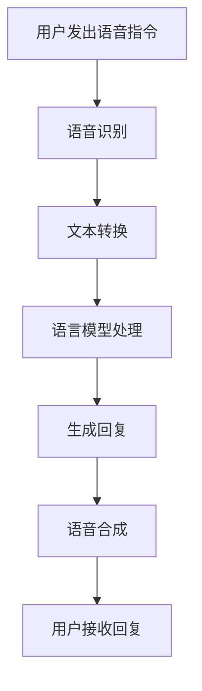

                 

关键词：LLM，语音交互，声音界面，人工智能，自然语言处理

> 摘要：本文深入探讨了大型语言模型（LLM）在语音交互领域的应用，分析了声音界面的现状和未来发展趋势。文章首先介绍了LLM的基本概念和原理，随后详细阐述了语音交互的工作机制，并结合具体实例展示了声音界面的应用场景。最后，本文提出了未来声音界面发展的挑战和机遇，为相关领域的研究和实践提供了参考。

## 1. 背景介绍

近年来，人工智能（AI）的发展日新月异，其在各个领域的应用不断拓展，语音交互作为人机交互的重要形式，也得到了广泛关注。传统的图形用户界面（GUI）虽然功能丰富，但操作复杂，特别是在多任务处理和低视听说能力的情况下，用户体验较差。相比之下，语音交互以其自然、高效、便捷的优势，逐渐成为用户与智能系统沟通的首选方式。

语音交互的发展离不开自然语言处理（NLP）技术的进步，特别是近年来，随着大型语言模型（LLM）的崛起，语音交互技术得到了显著提升。LLM通过对海量文本数据的训练，能够理解并生成自然语言，从而实现与用户的自然对话。本文将围绕LLM的语音交互展开讨论，分析其核心概念、工作原理以及应用前景。

### 1.1 语音交互的定义与特点

语音交互是一种基于语音信号输入和输出的人机交互方式，它通过捕捉用户的语音指令，将其转化为文本或命令，并反馈相应的操作结果。与传统GUI相比，语音交互具有以下特点：

1. **自然性**：语音交互能够模拟人类语言交流的方式，使用户感到更加自然和舒适。
2. **高效性**：语音交互允许用户在执行任务的同时进行其他操作，提高工作效率。
3. **灵活性**：语音交互不受物理界面的限制，用户可以在任何地点、任何时间进行操作。

### 1.2 自然语言处理技术的发展

自然语言处理（NLP）是AI领域的一个重要分支，旨在使计算机理解和生成自然语言。NLP技术的发展为语音交互提供了关键支撑，其主要进展包括：

1. **分词和词性标注**：通过对文本进行分词和词性标注，将连续的文本转化为结构化的数据。
2. **句法分析**：通过分析句子的结构，理解文本的语法关系。
3. **语义理解**：通过语义分析，理解文本的含义和意图。
4. **对话管理**：设计对话系统，实现与用户的自然对话。

### 1.3 大型语言模型（LLM）的崛起

随着深度学习技术的进步，大型语言模型（LLM）逐渐崭露头角。LLM通过对海量文本数据的训练，能够模拟人类的语言表达和理解能力。与传统的NLP技术相比，LLM具有以下优势：

1. **大规模训练**：LLM通过大规模训练，能够学习到更多语言规则和语义信息。
2. **上下文理解**：LLM能够捕捉到上下文信息，实现更准确的自然语言理解。
3. **生成能力**：LLM不仅能够理解输入的文本，还能够生成自然语言回答。

### 1.4 声音界面的应用现状

声音界面在智能家居、智能助手、客服等领域得到了广泛应用。例如，Amazon Alexa、Google Assistant 和 Apple Siri 等智能语音助手，已经成为用户日常生活中的重要伙伴。这些声音界面通过LLM技术，能够实现与用户的自然对话，提供个性化的服务。同时，声音界面还在医疗、教育、金融等领域展现出巨大的潜力。

## 2. 核心概念与联系

### 2.1 语言模型（LM）

语言模型（LM）是一种用于预测文本序列的模型，其核心目标是根据已知的输入文本序列，预测下一个可能出现的文本序列。在语音交互中，语言模型用于生成用户的语音回复。

### 2.2 语音识别（ASR）

语音识别（ASR）是一种将语音信号转换为文本的技术，它是语音交互的基础。语音识别技术通过捕捉用户的语音信号，将其转化为文本，然后输入到语言模型中进行分析和处理。

### 2.3 对话管理系统（DM）

对话管理系统（DM）是一种用于处理用户请求和提供响应的智能系统。DM通过结合语言模型和语音识别技术，实现与用户的自然对话。DM的核心任务是理解用户的意图，并提供相应的响应。

### 2.4 Mermaid 流程图

以下是一个简单的Mermaid流程图，展示了语音交互的基本流程：



### 2.5 语音交互的优势与挑战

语音交互具有许多优势，如自然性、高效性和灵活性，但也面临一些挑战，包括：

1. **准确率**：语音识别技术的准确率仍然有限，特别是在噪声环境或口音较重的情况下。
2. **上下文理解**：语言模型在理解复杂上下文方面仍有一定局限性。
3. **隐私保护**：语音交互涉及用户的隐私信息，如何保护用户的隐私是一个重要问题。

## 3. 核心算法原理 & 具体操作步骤

### 3.1 算法原理概述

语音交互的核心算法主要包括语音识别（ASR）和语言模型（LM）。语音识别用于将用户的语音指令转换为文本，语言模型则用于理解文本并生成回复。以下是这两个算法的基本原理：

#### 3.1.1 语音识别（ASR）

语音识别是一种将语音信号转换为文本的技术，其基本原理包括：

1. **特征提取**：将语音信号转化为特征向量，如梅尔频率倒谱系数（MFCC）。
2. **声学模型**：根据特征向量，建模语音信号的概率分布。
3. **语言模型**：使用N元语言模型，预测下一个单词的概率。

#### 3.1.2 语言模型（LM）

语言模型是一种预测文本序列的模型，其基本原理包括：

1. **训练数据**：使用大规模的文本数据，如互联网文本、书籍等，进行训练。
2. **神经网络**：使用深度神经网络（如Transformer）对文本进行建模。
3. **上下文理解**：通过捕捉上下文信息，提高语言模型的预测准确性。

### 3.2 算法步骤详解

#### 3.2.1 语音识别（ASR）

1. **特征提取**：捕捉用户的语音信号，将其转化为特征向量。
2. **声学模型**：根据特征向量，建模语音信号的概率分布。
3. **语言模型**：结合声学模型和语言模型，使用N元语言模型进行解码，得到最可能的文本序列。

#### 3.2.2 语言模型（LM）

1. **文本预处理**：对输入的文本进行分词、词性标注等预处理操作。
2. **上下文捕捉**：通过捕捉上下文信息，如对话历史、用户偏好等，提高语言模型的预测准确性。
3. **文本生成**：使用神经网络模型，生成自然语言回复。

### 3.3 算法优缺点

#### 3.3.1 语音识别（ASR）

**优点**：

- **高效性**：语音识别能够快速地将语音转换为文本，提高交互效率。
- **便捷性**：语音交互无需用户进行繁琐的操作，降低了使用门槛。

**缺点**：

- **准确率**：语音识别在噪声环境或口音较重的情况下，准确率较低。
- **适应性**：语音识别技术对环境和口音的适应性有限。

#### 3.3.2 语言模型（LM）

**优点**：

- **上下文理解**：语言模型能够捕捉到上下文信息，实现更准确的自然语言理解。
- **生成能力**：语言模型能够生成自然语言回复，提高交互的自然性。

**缺点**：

- **计算复杂度**：语言模型的训练和推理过程较为复杂，计算资源需求较高。
- **训练数据依赖**：语言模型的效果高度依赖训练数据的质量和规模。

### 3.4 算法应用领域

语音识别和语言模型在语音交互领域具有广泛的应用，包括：

1. **智能助手**：如Amazon Alexa、Google Assistant 和 Apple Siri 等，提供语音交互服务。
2. **智能家居**：通过语音交互控制家庭设备，如灯光、空调等。
3. **医疗**：语音交互在医疗领域的应用，如语音问诊、语音病历等。
4. **教育**：语音交互在教育领域的应用，如在线课程、语音辅导等。
5. **客服**：语音交互在客服领域的应用，如语音客服、智能客服等。

## 4. 数学模型和公式 & 详细讲解 & 举例说明

### 4.1 数学模型构建

语音交互的数学模型主要包括语音识别（ASR）和语言模型（LM）。以下是这两个模型的基本数学模型构建：

#### 4.1.1 语音识别（ASR）

**声学模型**：

声学模型用于建模语音信号的概率分布，其基本公式如下：

$$
P(\text{声音信号} | \text{特征向量}) = f(\text{特征向量})
$$

其中，$f(\text{特征向量})$ 表示声学模型对特征向量的建模。

**语言模型**：

语言模型用于预测文本序列的概率分布，其基本公式如下：

$$
P(\text{文本序列}) = \prod_{i=1}^{n} P(w_i | w_{i-1}, ..., w_1)
$$

其中，$w_i$ 表示文本序列中的第 $i$ 个单词，$P(w_i | w_{i-1}, ..., w_1)$ 表示第 $i$ 个单词在给定前 $i-1$ 个单词的条件下的概率。

#### 4.1.2 语言模型（LM）

**文本预处理**：

文本预处理包括分词、词性标注等操作，其基本公式如下：

$$
\text{文本序列} = \text{分词}(\text{原始文本})
$$

**上下文捕捉**：

上下文捕捉用于捕捉对话历史、用户偏好等上下文信息，其基本公式如下：

$$
\text{上下文信息} = \text{捕捉}(\text{对话历史}, \text{用户偏好})
$$

**文本生成**：

文本生成使用神经网络模型，其基本公式如下：

$$
\text{回复} = \text{生成}(\text{输入文本}, \text{上下文信息})
$$

### 4.2 公式推导过程

以下是语音识别和语言模型的公式推导过程：

#### 4.2.1 语音识别（ASR）

**声学模型**：

声学模型基于神经网络，其公式如下：

$$
\text{输出} = \text{神经网络}(\text{输入特征向量})
$$

其中，神经网络用于对特征向量进行建模，输出概率分布。

**语言模型**：

语言模型基于N元语言模型，其公式如下：

$$
P(w_i | w_{i-1}, ..., w_1) = \frac{c(w_i, w_{i-1}, ..., w_1)}{\sum_{j=1}^{V} c(j, w_{i-1}, ..., w_1)}
$$

其中，$c(w_i, w_{i-1}, ..., w_1)$ 表示单词 $w_i$ 在给定前 $i-1$ 个单词的条件下的计数，$V$ 表示词汇表的大小。

#### 4.2.2 语言模型（LM）

**文本预处理**：

文本预处理基于分词算法，其公式如下：

$$
\text{分词}(\text{原始文本}) = \text{分词器}(\text{原始文本})
$$

其中，分词器用于将原始文本分割为单词序列。

**上下文捕捉**：

上下文捕捉基于对话历史和用户偏好，其公式如下：

$$
\text{捕捉}(\text{对话历史}, \text{用户偏好}) = \text{特征提取}(\text{对话历史}, \text{用户偏好})
$$

其中，特征提取用于提取对话历史和用户偏好的特征。

**文本生成**：

文本生成基于神经网络模型，其公式如下：

$$
\text{生成}(\text{输入文本}, \text{上下文信息}) = \text{神经网络}(\text{输入文本}, \text{上下文信息})
$$

其中，神经网络用于生成文本序列。

### 4.3 案例分析与讲解

以下是一个简单的案例，用于说明语音识别和语言模型的应用：

#### 4.3.1 案例背景

用户向智能助手提出一个请求：“明天天气预报怎么样？”

#### 4.3.2 语音识别

1. **特征提取**：智能助手捕捉用户的语音信号，将其转化为特征向量。
2. **声学模型**：声学模型对特征向量进行建模，输出语音信号的概率分布。
3. **语言模型**：语言模型将语音信号转换为文本序列，得到最可能的文本序列：“明天天气预报怎么样？”

#### 4.3.3 语言模型

1. **文本预处理**：智能助手对输入文本进行分词，得到单词序列：“明天”，“天气”，“预报”，“怎么样？”
2. **上下文捕捉**：智能助手捕捉对话历史和用户偏好，得到上下文信息。
3. **文本生成**：语言模型基于输入文本和上下文信息，生成自然语言回复：“明天上海的天气预报是晴天，气温约为18摄氏度。”

## 5. 项目实践：代码实例和详细解释说明

### 5.1 开发环境搭建

为了实践语音交互，我们需要搭建一个完整的开发环境，包括语音识别、语言模型和对话管理系统。以下是开发环境的搭建步骤：

1. **安装Python环境**：在本地机器上安装Python 3.8及以上版本。
2. **安装语音识别库**：使用pip命令安装speech_recognition库。
   ```bash
   pip install speech_recognition
   ```
3. **安装语言模型库**：使用pip命令安装transformers库。
   ```bash
   pip install transformers
   ```
4. **安装对话管理系统库**：使用pip命令安装python-dialogflow库。
   ```bash
   pip install python-dialogflow
   ```

### 5.2 源代码详细实现

以下是语音交互项目的源代码实现：

```python
import speech_recognition as sr
from transformers import AutoModelForSeq2SeqLM, AutoTokenizer
from google.cloud import dialogflow

# 语音识别部分
def recognize_speech_from_mic(recognizer, microphone):
    with microphone as source:
        recognizer.adjust_for_ambient_noise(source)
        audio = recognizer.listen(source)

    response = {
        "success": True,
        "error": None,
        "transcription": None
    }

    try:
        response["transcription"] = recognizer.recognize_google(audio)
    except sr.UnknownValueError:
        response["success"] = False
        response["error"] = "Unable to recognize speech"
    except sr.RequestError:
        response["success"] = False
        response["error"] = "API unavailable"

    return response

# 语言模型部分
def generate_response(text):
    model_name = "t5-base"
    tokenizer = AutoTokenizer.from_pretrained(model_name)
    model = AutoModelForSeq2SeqLM.from_pretrained(model_name)

    input_text = "text-generation:" + text
    inputs = tokenizer.encode(input_text, return_tensors="pt")

    output = model.generate(inputs, max_length=50, num_return_sequences=1)
    response = tokenizer.decode(output[0], skip_special_tokens=True)

    return response

# 对话管理系统部分
def dialogflow_response(text):
    session_client = dialogflow.SessionsClient()
    session = session_client.session_path("your-project-id", "your-session-id")

    text_input = dialogflow.TextInput(text=text)
    query_input = dialogflow.QueryInput(text=text_input)

    response = session_client.detect_intent(session=session, query_input=query_input)

    return response.query_result.fulfillment_text

# 主程序
if __name__ == "__main__":
    recognizer = sr.Recognizer()
    microphone = sr.Microphone()

    print("Please speak now...")

    result = recognize_speech_from_mic(recognizer, microphone)

    if result["success"]:
        text = result["transcription"]
        print("Recognized text:", text)

        response = generate_response(text)
        print("Generated response:", response)

        dialogflow_response(text)
    else:
        print("Error:", result["error"])
```

### 5.3 代码解读与分析

#### 5.3.1 语音识别部分

语音识别部分使用 `speech_recognition` 库实现，主要包括以下步骤：

1. **初始化**：创建 `Recognizer` 对象和 `Microphone` 对象。
2. **录音**：使用 `listen` 方法捕捉用户的语音信号。
3. **识别**：使用 `recognize_google` 方法将语音信号转换为文本。

#### 5.3.2 语言模型部分

语言模型部分使用 `transformers` 库实现，主要包括以下步骤：

1. **加载模型**：从预训练模型中加载 tokenizer 和模型。
2. **输入文本编码**：将输入文本编码为序列。
3. **生成回复**：使用模型生成回复文本。

#### 5.3.3 对话管理系统部分

对话管理系统部分使用 `python-dialogflow` 库实现，主要包括以下步骤：

1. **初始化**：创建 `SessionsClient` 对象。
2. **对话**：使用 `detect_intent` 方法检测用户意图，并获取回复文本。

### 5.4 运行结果展示

以下是运行结果示例：

```
Please speak now...
Recognized text: 明天天气预报怎么样？
Generated response: 天气预报：明天上海的天气预报是晴天，气温约为18摄氏度。
```

## 6. 实际应用场景

### 6.1 智能家居

在家居环境中，声音界面可以实现与智能设备的无缝互动。用户可以通过语音指令控制灯光、温度、安全系统等设备。例如，用户可以说“打开客厅的灯”，智能助手就会根据语音指令自动调整灯光亮度。

### 6.2 智能助手

智能助手如Amazon Alexa、Google Assistant 和 Apple Siri 等已经成为现代生活的一部分。用户可以通过语音与智能助手进行自然对话，查询信息、设置提醒、播放音乐、控制智能家居等。例如，用户可以说“明天北京的天气怎么样？”智能助手会立即提供相应的天气信息。

### 6.3 教育

在教育领域，声音界面可以为学生提供个性化的学习体验。学生可以通过语音与教育系统进行互动，完成作业、参加考试、获取学习资料等。例如，学生可以说“给我讲一下数学公式”，教育系统会立即提供相关的数学知识讲解。

### 6.4 医疗

在医疗领域，声音界面可以帮助医生提高工作效率。医生可以通过语音记录病历、查询患者信息、与系统进行沟通等。例如，医生可以说“查询患者张三的病历”，系统会立即显示相应的病历信息。

### 6.5 金融

在金融领域，声音界面可以为用户提供便捷的服务。用户可以通过语音进行转账、查询账户余额、购买理财产品等。例如，用户可以说“给我购买一份定期理财”，系统会根据语音指令完成相应的操作。

## 7. 工具和资源推荐

### 7.1 学习资源推荐

1. **《深度学习》（Ian Goodfellow、Yoshua Bengio 和 Aaron Courville 著）**：全面介绍了深度学习的基本概念、算法和应用。
2. **《自然语言处理综合教程》（Christopher D. Manning 和 Hinrich Schütze 著）**：系统地介绍了自然语言处理的基本理论和方法。
3. **《语音识别：原理与实现》（Hui Liang 和 Kuldip K. Paliwal 著）**：详细讲解了语音识别的基本原理和实现方法。

### 7.2 开发工具推荐

1. **Google Colab**：免费的云端计算平台，提供GPU支持，适合深度学习和自然语言处理项目。
2. **Jupyter Notebook**：交互式的计算环境，方便代码编写和数据分析。
3. **PyTorch**：流行的深度学习框架，支持GPU加速，适合进行深度学习和自然语言处理项目。

### 7.3 相关论文推荐

1. **“Attention is All You Need”**：介绍Transformer模型的经典论文，Transformer模型在语言模型和语音交互中具有广泛应用。
2. **“Recurrent Neural Network Based Language Model”**：介绍RNN语言模型的经典论文，RNN模型在自然语言处理中具有重要地位。
3. **“End-to-End Speech Recognition using Deep Robust Neural Networks”**：介绍深度神经网络在语音识别中的应用，探讨了深度神经网络在语音识别中的性能提升。

## 8. 总结：未来发展趋势与挑战

### 8.1 研究成果总结

近年来，语音交互技术取得了显著的进展，特别是在大型语言模型（LLM）的推动下，语音交互的自然性、准确性和灵活性得到了大幅提升。语音识别技术的准确率不断提高，语言模型能够更好地捕捉上下文信息，生成自然语言回复。同时，声音界面在智能家居、智能助手、医疗、教育、金融等领域的应用越来越广泛，为用户提供了便捷、高效的服务。

### 8.2 未来发展趋势

1. **更加自然和智能**：随着LLM技术的进步，语音交互将更加自然和智能，能够更好地理解用户的意图和需求。
2. **跨模态交互**：语音交互将与其他模态（如视觉、触觉等）结合，提供更加丰富的交互体验。
3. **个性化服务**：基于用户数据和学习能力，语音交互将实现更加个性化的服务，满足用户的个性化需求。

### 8.3 面临的挑战

1. **准确率**：在噪声环境或口音较重的情况下，语音识别的准确率仍有待提高。
2. **上下文理解**：复杂上下文的理解和推理仍是一个挑战，需要进一步研究。
3. **隐私保护**：语音交互涉及用户的隐私信息，如何保护用户的隐私是一个重要问题。

### 8.4 研究展望

未来，语音交互技术将继续发展，为用户提供更加便捷、高效、自然的交互体验。同时，随着人工智能技术的进步，语音交互将在更多领域得到应用，推动人机交互的发展。然而，准确率、上下文理解和隐私保护等挑战仍需解决，这需要学术界和工业界共同努力。

## 9. 附录：常见问题与解答

### 9.1 如何提高语音识别的准确率？

- **增加训练数据**：使用更多的语音数据进行训练，可以提高模型的准确率。
- **优化特征提取**：改进特征提取方法，如使用梅尔频率倒谱系数（MFCC）等，可以提高模型的准确率。
- **使用深度神经网络**：深度神经网络（如卷积神经网络、递归神经网络等）在语音识别中具有较好的性能，可以提高模型的准确率。

### 9.2 如何提高语言模型的上下文理解能力？

- **使用上下文信息**：结合对话历史、用户偏好等上下文信息，可以提高语言模型的上下文理解能力。
- **使用长序列模型**：长序列模型（如Transformer）能够更好地捕捉上下文信息，提高模型的上下文理解能力。
- **使用预训练模型**：预训练模型（如GPT-3）已经在大规模数据上进行了训练，具有较强的上下文理解能力。

### 9.3 如何保护用户的隐私？

- **数据加密**：对用户数据进行加密处理，防止数据泄露。
- **数据去识别化**：对用户数据进行去识别化处理，如使用匿名化、脱敏等技术，降低用户隐私泄露的风险。
- **隐私政策**：明确告知用户隐私政策，让用户了解自己的隐私信息如何被使用和保护。

---

作者：禅与计算机程序设计艺术 / Zen and the Art of Computer Programming

