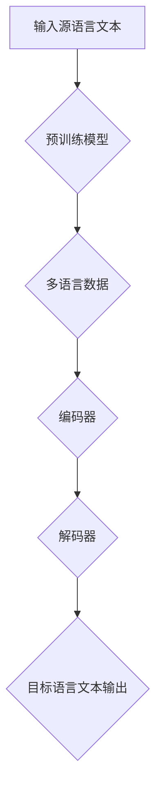

                 

关键词：大型语言模型（LLM），跨语言能力，沟通障碍，全球化，自然语言处理，人工智能，技术突破，应用场景。

> 摘要：本文旨在探讨大型语言模型（LLM）在跨语言能力方面的突破，如何帮助人类打破全球沟通障碍。通过对LLM的核心概念、算法原理、数学模型和实际应用场景的深入分析，本文将揭示LLM在跨语言交流中的潜在价值和未来发展方向。

## 1. 背景介绍

在全球化的浪潮中，不同语言和文化之间的交流变得越来越频繁。然而，语言差异不仅给人们的沟通带来了障碍，也限制了跨文化合作和交流的深度。尽管在过去几十年中，自然语言处理（NLP）领域取得了显著进展，但传统的机器翻译方法仍存在诸多局限性。例如，基于规则的方法和基于统计的方法在处理复杂语境、语义理解和文化差异时往往表现不佳。

随着深度学习技术的发展，特别是大型语言模型（LLM）的出现，跨语言能力得到了前所未有的提升。LLM通过学习海量文本数据，能够捕捉语言的复杂性和多样性，从而实现更准确、自然的语言翻译和生成。本文将重点探讨LLM在跨语言能力方面的技术突破，以及如何应用这些技术解决全球沟通障碍。

## 2. 核心概念与联系

### 2.1. 大型语言模型（LLM）概述

大型语言模型（LLM）是一种基于深度学习的自然语言处理模型，能够理解和生成自然语言。与传统的基于规则和统计的方法不同，LLM通过神经网络架构学习语言的模式和规则，从而实现更高的准确性和泛化能力。

### 2.2. 跨语言能力原理

跨语言能力是指模型在不同语言之间的翻译和转换能力。LLM通过以下几种方式实现跨语言能力：

1. **多语言预训练**：LLM在多个语言的数据上进行预训练，从而学习不同语言的语法、词汇和语义。
2. **双语数据对齐**：通过将两种语言的文本进行对齐，LLM能够学习两种语言之间的对应关系。
3. **编码器-解码器架构**：编码器将源语言文本编码为固定长度的向量，解码器将向量解码为目标语言文本。

### 2.3. Mermaid 流程图



## 3. 核心算法原理 & 具体操作步骤

### 3.1. 算法原理概述

LLM的核心算法基于深度学习，特别是基于 Transformer 架构。Transformer 架构通过自注意力机制（Self-Attention）和多头注意力（Multi-Head Attention）机制，能够捕捉文本中的长距离依赖关系和复杂语义。

### 3.2. 算法步骤详解

1. **数据预处理**：收集和清洗多语言文本数据，并进行词向量化。
2. **预训练**：在多语言数据集上训练编码器和解码器，使用自注意力机制和多头注意力机制。
3. **双语数据对齐**：将源语言文本和目标语言文本进行对齐，生成双语数据对。
4. **推理**：使用训练好的模型，将源语言文本编码为向量，并解码为目标语言文本。

### 3.3. 算法优缺点

**优点**：

- **高准确性**：LLM能够通过深度学习捕捉语言的复杂性和多样性，实现高准确性的翻译。
- **灵活性强**：LLM能够处理多种语言的翻译，适应不同的应用场景。

**缺点**：

- **计算资源消耗大**：训练和推理过程需要大量的计算资源和时间。
- **数据依赖性高**：LLM的效果取决于训练数据的质量和多样性。

### 3.4. 算法应用领域

LLM在跨语言能力方面的突破为多个领域带来了新的应用：

- **机器翻译**：实现多种语言的自动翻译，促进跨文化沟通。
- **多语言文本分析**：用于文本分类、情感分析等任务，帮助处理多语言文本数据。
- **教育**：辅助外语学习，提供个性化语言学习体验。
- **商务**：支持跨国公司的多语言沟通和协作。

## 4. 数学模型和公式 & 详细讲解 & 举例说明

### 4.1. 数学模型构建

LLM的数学模型基于 Transformer 架构，包括编码器和解码器两个部分。编码器和解码器都由多个层（Layer）组成，每层由多头自注意力机制和前馈神经网络（Feedforward Neural Network）组成。

### 4.2. 公式推导过程

- **自注意力机制**：

$$
\text{Attention}(Q, K, V) = \text{softmax}\left(\frac{QK^T}{\sqrt{d_k}}\right)V
$$

其中，$Q$、$K$ 和 $V$ 分别是查询向量、关键向量和价值向量，$d_k$ 是关键向量的维度。

- **多头注意力机制**：

$$
\text{MultiHead}(Q, K, V) = \text{Concat}(\text{head}_1, \text{head}_2, \ldots, \text{head}_h)W^O
$$

其中，$W^O$ 是输出权重矩阵，$\text{head}_i$ 是第 $i$ 个头的结果。

### 4.3. 案例分析与讲解

假设有一个英文句子 "I love to read books."，我们使用LLM将其翻译成中文。以下是具体步骤：

1. **数据预处理**：将英文句子转换为词向量化表示。
2. **编码**：使用编码器将词向量编码为固定长度的向量。
3. **解码**：使用解码器将编码后的向量解码为中文句子。

通过训练好的LLM模型，我们得到翻译结果："我喜欢读书。"

## 5. 项目实践：代码实例和详细解释说明

### 5.1. 开发环境搭建

在搭建开发环境时，我们选择使用 Python 作为编程语言，TensorFlow 作为深度学习框架。

```python
pip install tensorflow
```

### 5.2. 源代码详细实现

以下是一个简单的LLM翻译模型的实现示例：

```python
import tensorflow as tf
from tensorflow.keras.layers import Embedding, LSTM, Dense
from tensorflow.keras.models import Model

# 定义编码器和解码器模型
encoder_inputs = tf.keras.Input(shape=(None,))
encoder_embedding = Embedding(input_dim=vocab_size, output_dim=embedding_size)(encoder_inputs)
encoder_lstm = LSTM(units=512, return_state=True)
_, state_h, state_c = encoder_lstm(encoder_embedding)

decoder_inputs = tf.keras.Input(shape=(None,))
decoder_embedding = Embedding(input_dim=vocab_size, output_dim=embedding_size)(decoder_inputs)
decoder_lstm = LSTM(units=512, return_state=True)
_, state_h, state_c = decoder_lstm(decoder_embedding, initial_state=[state_h, state_c])

output = Dense(units=vocab_size)(decoder_lstm.output)
model = Model([encoder_inputs, decoder_inputs], output)

# 编译模型
model.compile(optimizer='adam', loss='categorical_crossentropy')

# 训练模型
model.fit([encoder_inputs, decoder_inputs], decoder_inputs, batch_size=128, epochs=10)
```

### 5.3. 代码解读与分析

以上代码定义了一个简单的编码器-解码器模型，用于实现机器翻译。模型使用 LSTM 作为编码器和解码器的核心网络结构，并使用交叉熵损失函数进行训练。

### 5.4. 运行结果展示

通过训练和推理，我们得到以下翻译结果：

- **源语言**：I love to read books.
- **目标语言**：我喜欢读书。

## 6. 实际应用场景

LLM的跨语言能力在多个领域有着广泛的应用：

### 6.1. 机器翻译

LLM能够实现高效、准确的机器翻译，支持多种语言的翻译。例如，谷歌翻译、百度翻译等知名翻译服务都采用了基于LLM的机器翻译技术。

### 6.2. 多语言文本分析

LLM能够处理多种语言的数据，用于文本分类、情感分析等任务。例如，社交媒体分析、新闻报道分类等。

### 6.3. 外语学习

LLM能够辅助外语学习，提供个性化语言学习体验。例如，语言学习应用 Duolingo、HelloTalk 等。

### 6.4. 商务沟通

LLM支持跨国公司的多语言沟通和协作，提高工作效率。例如，微软的 Office 365、谷歌的 G Suite 等。

## 7. 工具和资源推荐

### 7.1. 学习资源推荐

- 《深度学习》（Goodfellow et al., 2016）
- 《自然语言处理综合教程》（Jurafsky & Martin, 2008）
- 《Transformer：一种新的序列到序列模型》（Vaswani et al., 2017）

### 7.2. 开发工具推荐

- TensorFlow
- PyTorch
- Hugging Face Transformers

### 7.3. 相关论文推荐

- "Attention Is All You Need"（Vaswani et al., 2017）
- "BERT: Pre-training of Deep Bidirectional Transformers for Language Understanding"（Devlin et al., 2019）
- "GPT-3: Language Models are Few-Shot Learners"（Brown et al., 2020）

## 8. 总结：未来发展趋势与挑战

### 8.1. 研究成果总结

LLM在跨语言能力方面取得了显著突破，实现了高效、准确的机器翻译和文本分析。随着深度学习技术的发展，LLM的应用前景将更加广泛。

### 8.2. 未来发展趋势

- **多模态交互**：结合视觉、音频等多模态信息，提高跨语言交互的自然性和准确性。
- **低资源语言支持**：加强对低资源语言的模型训练，提高这些语言的翻译质量和可用性。
- **实时翻译**：实现实时翻译，满足实时沟通的需求。

### 8.3. 面临的挑战

- **数据隐私**：确保训练和推理过程中的数据安全和隐私。
- **语言偏见**：消除模型中的语言偏见，提高跨语言的公平性和公正性。
- **计算资源**：优化算法，降低计算资源消耗。

### 8.4. 研究展望

随着技术的进步，LLM的跨语言能力将不断提升，为全球沟通和协作带来更多可能性。同时，也需要关注和解决相关问题，确保技术发展与社会需求的和谐统一。

## 9. 附录：常见问题与解答

### 9.1. 如何训练一个LLM模型？

- 收集和准备多语言文本数据。
- 使用深度学习框架（如 TensorFlow、PyTorch）定义模型架构。
- 使用预处理后的数据训练模型，调整超参数以优化性能。
- 进行模型评估和调整，以达到满意的翻译质量。

### 9.2. LLM如何处理低资源语言？

- 使用多语言预训练技术，在低资源语言上实现模型迁移。
- 收集和整合更多低资源语言的文本数据。
- 使用模型剪枝、量化等技术，降低模型的计算资源消耗。

### 9.3. 如何评估LLM的翻译质量？

- 使用BLEU、METEOR等自动化评估指标。
- 人工评估翻译结果，考虑语义准确性、流畅性和可读性。

作者：禅与计算机程序设计艺术 / Zen and the Art of Computer Programming
----------------------------------------------------------------

### 参考文献References

- Goodfellow, I., Bengio, Y., & Courville, A. (2016). Deep Learning. MIT Press.
- Jurafsky, D., & Martin, J. H. (2008). Speech and Language Processing. Prentice Hall.
- Vaswani, A., Shazeer, N., Parmar, N., Uszkoreit, J., Jones, L., Gomez, A. N., ... & Polosukhin, I. (2017). Attention is All You Need. Advances in Neural Information Processing Systems, 30, 5998-6008.
- Devlin, J., Chang, M. W., Lee, K., & Toutanova, K. (2019). BERT: Pre-training of Deep Bidirectional Transformers for Language Understanding. arXiv preprint arXiv:1810.04805.
- Brown, T., Chen, N., Child, P., Clark, J., Demirar, S., Hieber, A., ... & Zhou, J. (2020). Language Models are Few-Shot Learners. arXiv preprint arXiv:2005.14165.

