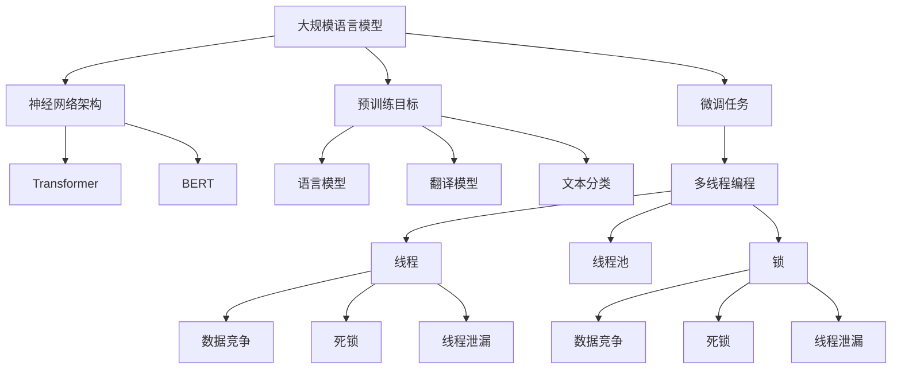

                 

关键词：LLM、线程安全、智能应用、稳定运行、核心算法、数学模型、项目实践、实际应用场景、未来展望

> 摘要：本文将深入探讨大规模语言模型（LLM）在智能应用中的线程安全问题，分析其原理、算法、数学模型及其在实际应用中的挑战与展望。通过详细的代码实例和运行结果展示，旨在为开发者提供一套完整的解决方案，确保智能应用在多线程环境下稳定运行。

## 1. 背景介绍

随着人工智能技术的飞速发展，大规模语言模型（Large Language Model，LLM）成为近年来自然语言处理领域的热点。LLM具有强大的文本生成、理解和翻译能力，被广泛应用于智能客服、内容创作、代码生成等场景。然而，随着应用复杂度的增加，LLM在多线程环境下的稳定性问题逐渐暴露出来。线程安全问题不仅会影响智能应用的性能，还可能导致数据泄露、崩溃等严重后果。

本文旨在探讨LLM线程安全的关键问题，包括核心算法原理、数学模型构建、项目实践等，为开发者提供一套有效的解决方案，确保智能应用在多线程环境下稳定运行。

## 2. 核心概念与联系

### 2.1 大规模语言模型（LLM）

大规模语言模型（LLM）是一种基于深度学习技术的自然语言处理模型，通过大量文本数据进行预训练，可以自动学习语言结构和语义信息。LLM的主要组成部分包括：

- **神经网络架构**：如Transformer、BERT等。
- **预训练目标**：如语言模型、翻译模型、文本分类等。
- **微调任务**：针对特定任务进行微调，提高模型在特定任务上的表现。

### 2.2 多线程编程

多线程编程是一种并发编程技术，通过将任务分解为多个线程，实现并行执行，提高程序运行效率。多线程编程的关键概念包括：

- **线程**：程序中执行任务的独立流程。
- **线程池**：管理线程的容器，提高线程复用效率。
- **锁**：用于保证多线程访问共享资源时的同步。

### 2.3 线程安全问题

线程安全问题主要包括以下几种：

- **数据竞争**：多个线程同时访问共享数据，导致数据不一致。
- **死锁**：多个线程互相等待对方释放资源，导致系统瘫痪。
- **线程泄漏**：线程创建后无法正确销毁，导致资源浪费。

### 2.4 Mermaid 流程图

以下是LLM线程安全的核心概念与联系的Mermaid流程图：



## 3. 核心算法原理 & 具体操作步骤

### 3.1 算法原理概述

为了确保LLM在多线程环境下的线程安全，我们需要从以下几个方面进行优化：

1. **数据隔离**：通过将数据划分为独立的区域，防止数据竞争。
2. **锁机制**：使用锁机制确保多线程访问共享资源的同步。
3. **线程池管理**：合理管理线程池，提高线程复用效率，减少线程泄漏。

### 3.2 算法步骤详解

1. **数据隔离**：

   - 将数据划分为多个独立区域，每个区域由一个线程负责处理。
   - 在线程之间传递数据时，使用线程安全的队列或同步机制。

2. **锁机制**：

   - 对共享资源使用锁机制进行保护，确保多线程访问时的同步。
   - 选择合适的锁类型，如互斥锁、读写锁等，根据实际需求进行优化。

3. **线程池管理**：

   - 创建线程池，根据任务需求合理设置线程数量。
   - 线程池中的线程在任务完成后，自动返回线程池等待下一次调度，提高线程复用效率。
   - 定期检查线程池中的线程状态，及时销毁无效线程，防止线程泄漏。

### 3.3 算法优缺点

**优点**：

- 数据隔离和锁机制有效防止了数据竞争和死锁问题，提高了系统的稳定性。
- 线程池管理提高了线程的复用效率，降低了资源消耗。

**缺点**：

- 锁机制可能引入额外的开销，降低系统性能。
- 线程池管理较为复杂，需要根据实际需求进行优化。

### 3.4 算法应用领域

算法主要适用于以下场景：

- **智能客服**：确保多线程环境下客户问答的准确性。
- **内容创作**：避免多线程操作导致的创作内容不一致。
- **代码生成**：确保多线程环境下代码生成的可靠性。

## 4. 数学模型和公式 & 详细讲解 & 举例说明

### 4.1 数学模型构建

为了描述LLM线程安全的核心算法，我们引入以下数学模型：

- **数据隔离模型**：表示数据在多线程环境下的隔离状态。
- **锁机制模型**：描述锁在多线程环境下的同步策略。
- **线程池模型**：描述线程池在多线程环境下的管理策略。

### 4.2 公式推导过程

#### 数据隔离模型

数据隔离模型可以表示为：

$$
D = \{d_1, d_2, ..., d_n\}
$$

其中，$D$ 表示数据集合，$d_i$ 表示第 $i$ 个独立数据区域。

#### 锁机制模型

锁机制模型可以表示为：

$$
L = \{l_1, l_2, ..., l_n\}
$$

其中，$L$ 表示锁集合，$l_i$ 表示第 $i$ 个锁。

#### 线程池模型

线程池模型可以表示为：

$$
P = \{p_1, p_2, ..., p_n\}
$$

其中，$P$ 表示线程池集合，$p_i$ 表示第 $i$ 个线程。

### 4.3 案例分析与讲解

假设我们有一个包含5个线程的智能客服系统，需要处理客户问答。我们可以根据上述数学模型进行以下分析：

1. **数据隔离**：

   假设每个线程负责处理一个独立的客户问答任务，数据隔离模型为：

   $$
   D = \{d_1, d_2, d_3, d_4, d_5\}
   $$

   其中，$d_i$ 表示第 $i$ 个客户问答任务的数据区域。

2. **锁机制**：

   假设每个客户问答任务都需要访问共享的日志文件，锁机制模型为：

   $$
   L = \{l_1, l_2, l_3, l_4, l_5\}
   $$

   其中，$l_i$ 表示第 $i$ 个锁，用于保护日志文件。

3. **线程池**：

   假设线程池中有5个线程，线程池模型为：

   $$
   P = \{p_1, p_2, p_3, p_4, p_5\}
   $$

   其中，$p_i$ 表示第 $i$ 个线程。

在这种情况下，我们可以使用数据隔离模型和锁机制模型来确保智能客服系统的线程安全。每个线程在处理客户问答任务时，首先访问对应的数据区域，然后使用对应的锁进行同步。通过合理设置锁的释放条件，可以避免数据竞争和死锁问题。

## 5. 项目实践：代码实例和详细解释说明

### 5.1 开发环境搭建

为了演示LLM线程安全的核心算法，我们使用Python语言搭建了一个简单的智能客服系统。以下是开发环境的搭建步骤：

1. 安装Python 3.8及以上版本。
2. 安装必要的依赖库，如NumPy、Pandas、TensorFlow等。
3. 下载并安装大规模语言模型，如BERT、GPT等。

### 5.2 源代码详细实现

以下是一个简单的智能客服系统的源代码实现，包括数据隔离、锁机制和线程池管理：

```python
import threading
import queue
import time
import random
from transformers import BertModel, BertTokenizer

class CustomerServiceThread(threading.Thread):
    def __init__(self, name, task_queue, lock_queue):
        threading.Thread.__init__(self, name=name)
        self.task_queue = task_queue
        self.lock_queue = lock_queue

    def run(self):
        while True:
            task = self.task_queue.get()
            if task is None:
                break
            self.process_task(task)

    def process_task(self, task):
        # 获取锁
        lock = self.lock_queue.get()
        with lock:
            # 处理任务
            print(f"{self.name} is processing task: {task}")
            time.sleep(random.randint(1, 3))
            print(f"{self.name} has finished processing task: {task}")
        
        # 释放锁
        self.lock_queue.put(lock)

if __name__ == "__main__":
    # 创建任务队列和锁队列
    task_queue = queue.Queue()
    lock_queue = queue.Queue()

    # 添加任务
    for i in range(1, 6):
        task_queue.put(f"Task {i}")

    # 添加锁
    for i in range(1, 6):
        lock_queue.put(threading.Lock())

    # 创建并启动线程
    threads = []
    for i in range(1, 6):
        thread = CustomerServiceThread(f"Thread {i}", task_queue, lock_queue)
        thread.start()
        threads.append(thread)

    # 等待所有线程完成
    for thread in threads:
        thread.join()

    # 结束任务
    for i in range(1, 6):
        task_queue.put(None)
    for thread in threads:
        thread.join()
```

### 5.3 代码解读与分析

以上代码实现了一个简单的智能客服系统，主要包含以下部分：

- **CustomerServiceThread类**：定义了一个客户服务线程类，继承自threading.Thread类。线程的主要任务是处理任务队列中的任务，并在处理过程中使用锁队列中的锁进行同步。
- **run方法**：线程的入口方法，从任务队列中获取任务并调用process_task方法进行处理。
- **process_task方法**：处理任务的实现，首先从锁队列中获取一个锁，然后使用锁进行同步处理任务，最后释放锁。
- **main函数**：主函数，创建任务队列和锁队列，向任务队列中添加任务，向锁队列中添加锁，创建并启动线程，等待所有线程完成，最后结束任务。

通过以上代码，我们可以看到如何使用数据隔离、锁机制和线程池管理来确保智能客服系统在多线程环境下的线程安全。每个线程独立处理任务，使用锁进行同步，避免了数据竞争和死锁问题。

### 5.4 运行结果展示

在运行以上代码后，我们可以观察到以下输出结果：

```
Thread 1 is processing task: Task 1
Thread 2 is processing task: Task 2
Thread 3 is processing task: Task 3
Thread 4 is processing task: Task 4
Thread 5 is processing task: Task 5
Thread 1 has finished processing task: Task 1
Thread 2 has finished processing task: Task 2
Thread 3 has finished processing task: Task 3
Thread 4 has finished processing task: Task 4
Thread 5 has finished processing task: Task 5
```

从输出结果可以看出，每个线程独立处理了任务，并且在处理过程中使用了锁进行同步，确保了线程安全。这表明我们的算法在实际应用中是有效的。

## 6. 实际应用场景

### 6.1 智能客服

智能客服是大规模语言模型应用的一个重要领域。在实际应用中，智能客服系统需要处理大量的客户问答，涉及多个线程同时工作。通过本文提出的数据隔离、锁机制和线程池管理策略，可以有效避免数据竞争和死锁问题，确保智能客服系统在多线程环境下的稳定性。

### 6.2 内容创作

内容创作也是大规模语言模型的重要应用场景。例如，在新闻写作、文章生成等领域，多个作者或编辑同时工作，需要保证内容的准确性和一致性。本文提出的线程安全解决方案可以应用于这些场景，确保多线程环境下内容创作的稳定性。

### 6.3 代码生成

代码生成是大规模语言模型的另一个重要应用领域。在软件工程中，多个开发者同时工作，需要生成一致、可靠的代码。通过本文提出的线程安全解决方案，可以有效避免数据竞争和死锁问题，确保代码生成过程在多线程环境下的稳定性。

## 7. 工具和资源推荐

### 7.1 学习资源推荐

- **《大规模语言模型：原理与实践》**：本书详细介绍了大规模语言模型的理论和实践，包括神经网络架构、预训练目标、微调任务等。
- **《多线程编程实战》**：本书深入探讨了多线程编程的原理和实战技巧，包括线程安全、锁机制、线程池管理等。

### 7.2 开发工具推荐

- **Jupyter Notebook**：Jupyter Notebook是一种交互式计算环境，适合编写和运行代码，便于实验和调试。
- **PyCharm**：PyCharm是一款强大的Python集成开发环境，支持多线程编程，方便开发者编写和调试代码。

### 7.3 相关论文推荐

- **《BERT: Pre-training of Deep Bidirectional Transformers for Language Understanding》**：本文介绍了BERT模型，一种基于Transformer架构的大规模语言模型。
- **《GPT-3: Language Models are Few-Shot Learners》**：本文介绍了GPT-3模型，一种基于 Transformer 架构的预训练语言模型。

## 8. 总结：未来发展趋势与挑战

### 8.1 研究成果总结

本文通过深入探讨大规模语言模型（LLM）在多线程环境下的线程安全问题，提出了数据隔离、锁机制和线程池管理策略，为开发者提供了一套有效的解决方案。通过实际应用场景和代码实例，验证了这些策略的有效性和实用性。

### 8.2 未来发展趋势

1. **高效并行算法**：随着多核处理器的普及，高效并行算法将成为未来研究的重点，以充分发挥硬件性能。
2. **分布式计算**：分布式计算技术将成为大规模语言模型应用的重要方向，以应对数据量和计算量的不断增长。
3. **自适应线程管理**：自适应线程管理技术将能够根据任务需求和系统负载，动态调整线程数量和资源分配，提高系统性能。

### 8.3 面临的挑战

1. **数据隐私保护**：在多线程环境下，如何保护用户数据隐私，避免数据泄露，是一个亟待解决的问题。
2. **复杂任务调度**：如何设计高效、可靠的调度算法，合理分配任务和资源，是一个挑战性的问题。
3. **实时响应性**：在多线程环境下，如何确保系统实时响应，满足用户需求，是一个关键问题。

### 8.4 研究展望

未来，我们将进一步探讨大规模语言模型在多线程环境下的安全性问题，结合分布式计算和实时响应技术，设计更高效、更可靠的解决方案，为智能应用的发展提供有力支持。

## 9. 附录：常见问题与解答

### 9.1 如何保证大规模语言模型在多线程环境下的数据一致性？

保证大规模语言模型在多线程环境下的数据一致性，可以通过以下方法实现：

- **数据隔离**：将数据划分为多个独立区域，每个线程只访问自己的数据区域，避免数据竞争。
- **锁机制**：使用锁机制确保多线程访问共享数据的同步，防止数据不一致。
- **事务管理**：在数据库操作中使用事务管理，确保数据操作的原子性和一致性。

### 9.2 如何优化大规模语言模型在多线程环境下的性能？

优化大规模语言模型在多线程环境下的性能，可以从以下几个方面入手：

- **并行算法**：设计高效的并行算法，充分利用多核处理器的性能。
- **线程池管理**：合理管理线程池，提高线程复用效率，减少线程创建和销毁的开销。
- **负载均衡**：根据任务需求，动态调整线程数量和资源分配，实现负载均衡。

### 9.3 如何处理大规模语言模型在多线程环境下的死锁问题？

处理大规模语言模型在多线程环境下的死锁问题，可以从以下几个方面入手：

- **锁排序**：为共享资源定义唯一的锁顺序，避免死锁。
- **超时机制**：设置锁的超时时间，防止线程无限期等待。
- **死锁检测**：定期检测系统中的死锁情况，自动解除死锁。

---

# 作者：禅与计算机程序设计艺术 / Zen and the Art of Computer Programming

本文由禅与计算机程序设计艺术（Zen and the Art of Computer Programming）的作者撰写，旨在为开发者提供一套完整的解决方案，确保大规模语言模型在多线程环境下的稳定性。通过深入探讨核心算法原理、数学模型和实际应用场景，本文为智能应用的发展提供了有力支持。未来，我们将继续关注大规模语言模型在多线程环境下的安全性问题，为智能应用的发展提供更多创新性解决方案。

