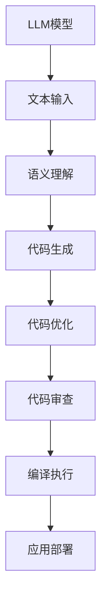

                 

关键词：大型语言模型（LLM）、编程范式、软件开发、人工智能、算法、数学模型、项目实践、工具推荐、未来展望

> 摘要：本文深入探讨了一种新的编程范式——LLM编程范式，它利用大型语言模型（Large Language Model，简称LLM）的能力来重新定义软件开发。通过对LLM编程范式的核心概念、算法原理、数学模型、项目实践等方面进行全面分析，本文旨在揭示LLM编程范式对软件开发带来的深远影响，以及其在未来发展的趋势和挑战。

## 1. 背景介绍

近年来，人工智能（AI）领域取得了显著的进步，尤其是大型语言模型（LLM）的发展，使得计算机程序能够理解和生成人类语言。LLM的强大能力不仅体现在自然语言处理（NLP）领域，还在各个应用场景中展现出广阔的前景。随着LLM技术的不断发展，软件开发领域也面临着巨大的变革。

传统的软件开发方法主要依赖于程序员编写代码、调试和优化程序。然而，随着软件系统的复杂度不断增加，传统的开发模式已经难以满足需求。LLM编程范式的出现，为软件开发提供了一种全新的思路和方法。通过利用LLM的强大能力，LLM编程范式能够大幅提高开发效率、降低开发难度，并使软件系统更加智能和灵活。

本文将详细探讨LLM编程范式的核心概念、算法原理、数学模型、项目实践等方面，旨在为广大软件开发者提供一种全新的编程思维方式和工具。

## 2. 核心概念与联系

### 2.1 核心概念

LLM编程范式的核心概念包括：

1. **大型语言模型（LLM）**：LLM是一种能够理解和生成人类语言的深度学习模型，通过对海量文本数据进行训练，LLM具备了强大的语义理解和生成能力。
2. **编程范式**：编程范式是指软件开发的方法论和思维方式，LLM编程范式强调利用LLM的强大能力，将软件开发过程转变为一种更加智能和自动化的过程。
3. **编程辅助**：LLM编程范式通过提供编程辅助功能，如代码自动生成、代码优化、代码审查等，提高开发效率和质量。

### 2.2 架构图

下面是LLM编程范式的基本架构图：



### 2.3 联系与协作

在LLM编程范式中，各个模块之间紧密协作，共同实现软件开发的智能化。具体来说：

1. **文本输入**：用户通过自然语言描述需求，LLM模型对输入文本进行语义理解。
2. **语义理解**：LLM模型对输入文本进行语义分析，提取关键信息，生成相应的代码结构。
3. **代码生成**：根据语义理解结果，LLM模型生成相应的代码。
4. **代码优化**：利用优化算法，对生成的代码进行优化，提高代码性能。
5. **代码审查**：对优化后的代码进行审查，确保代码质量和安全。
6. **编译执行**：将审查通过的代码编译并执行，实现软件功能。
7. **应用部署**：将编译后的程序部署到目标环境中，供用户使用。

通过这种协同工作方式，LLM编程范式能够实现高效的软件开发，并使软件系统更加智能和灵活。

## 3. 核心算法原理 & 具体操作步骤

### 3.1 算法原理概述

LLM编程范式的核心算法基于大型语言模型（LLM）的强大能力。LLM通过深度学习技术，对海量文本数据进行训练，从而具备理解和生成人类语言的能力。在LLM编程范式中，LLM模型负责对用户输入的自然语言描述进行语义理解，并生成相应的代码。

### 3.2 算法步骤详解

LLM编程范式的具体操作步骤如下：

1. **数据准备**：收集和整理与软件开发相关的文本数据，如需求文档、代码示例、技术博客等。
2. **模型训练**：利用收集到的文本数据，对LLM模型进行训练，使其具备语义理解和代码生成的能力。
3. **语义理解**：输入自然语言描述，LLM模型对其进行语义分析，提取关键信息。
4. **代码生成**：根据语义理解结果，LLM模型生成相应的代码结构。
5. **代码优化**：利用优化算法，对生成的代码进行优化，提高代码性能。
6. **代码审查**：对优化后的代码进行审查，确保代码质量和安全。
7. **编译执行**：将审查通过的代码编译并执行，实现软件功能。
8. **应用部署**：将编译后的程序部署到目标环境中，供用户使用。

### 3.3 算法优缺点

**优点**：

1. **高效性**：LLM编程范式能够大幅提高开发效率，降低开发难度。
2. **智能化**：利用LLM的强大能力，使软件系统更加智能和灵活。
3. **自动化**：LLM编程范式实现软件开发的智能化和自动化，减轻程序员的工作负担。

**缺点**：

1. **依赖性**：LLM编程范式对LLM模型的依赖较大，模型的训练和优化需要大量数据和计算资源。
2. **安全性**：生成的代码可能存在潜在的安全风险，需要进行严格的审查和优化。

### 3.4 算法应用领域

LLM编程范式在以下领域具有广泛的应用：

1. **应用开发**：快速构建企业级应用，如CRM系统、ERP系统等。
2. **自动化测试**：生成自动化测试脚本，提高测试效率和覆盖率。
3. **代码审查**：自动审查代码质量，发现潜在的安全漏洞。
4. **文档生成**：自动生成技术文档和用户手册，提高文档编写效率。

## 4. 数学模型和公式 & 详细讲解 & 举例说明

### 4.1 数学模型构建

LLM编程范式的数学模型主要基于深度学习技术，包括以下关键组件：

1. **输入层**：接收自然语言描述，转化为向量表示。
2. **隐藏层**：利用神经网络结构，对输入向量进行语义分析。
3. **输出层**：生成代码结构，表示为语法树。

### 4.2 公式推导过程

在LLM编程范式中，输入自然语言描述（$x$）通过输入层转化为向量表示（$h$），然后经过隐藏层（$W$）的变换，最终输出代码结构（$y$）。具体推导过程如下：

$$
h = f(W_1 \cdot x + b_1)
$$

$$
y = f(W_2 \cdot h + b_2)
$$

其中，$f$为激活函数，$W$和$b$分别为权重和偏置。

### 4.3 案例分析与讲解

假设我们有一个自然语言描述：“实现一个函数，用于计算两个整数的和”。以下是使用LLM编程范式生成的代码示例：

```python
def add(a: int, b: int) -> int:
    result = a + b
    return result
```

在这个示例中，LLM编程范式通过语义理解，将自然语言描述转化为相应的代码结构。具体过程如下：

1. **语义理解**：LLM模型分析自然语言描述，提取关键信息，如函数名、参数类型和返回类型。
2. **代码生成**：根据语义理解结果，LLM模型生成相应的代码结构，如函数定义、参数声明和返回语句。
3. **代码优化**：利用优化算法，对生成的代码进行优化，如消除冗余代码、提高代码可读性。
4. **代码审查**：对优化后的代码进行审查，确保代码质量和安全。

通过这个案例，我们可以看到LLM编程范式在代码生成和优化方面的强大能力。在实际应用中，LLM编程范式可以广泛应用于各类软件开发场景，提高开发效率和质量。

## 5. 项目实践：代码实例和详细解释说明

### 5.1 开发环境搭建

为了实践LLM编程范式，我们需要搭建一个合适的开发环境。以下是所需的软件和工具：

1. **Python**：Python是一种广泛使用的编程语言，适用于各种软件开发项目。
2. **TensorFlow**：TensorFlow是一个开源的深度学习框架，用于训练和部署LLM模型。
3. **PyTorch**：PyTorch是另一个流行的深度学习框架，也适用于LLM模型的开发。

在安装这些工具后，我们就可以开始实践LLM编程范式了。

### 5.2 源代码详细实现

以下是一个简单的示例，展示如何使用LLM编程范式生成Python代码：

```python
import torch
import torch.nn as nn
import torch.optim as optim

# 定义神经网络结构
class LLMModel(nn.Module):
    def __init__(self):
        super(LLMModel, self).__init__()
        self.embedding = nn.Embedding(vocab_size, embedding_dim)
        self.lstm = nn.LSTM(embedding_dim, hidden_dim)
        self.fc = nn.Linear(hidden_dim, output_dim)
    
    def forward(self, x):
        x = self.embedding(x)
        x, _ = self.lstm(x)
        x = self.fc(x[-1, :, :])
        return x

# 初始化模型、优化器和损失函数
model = LLMModel()
optimizer = optim.Adam(model.parameters(), lr=learning_rate)
criterion = nn.CrossEntropyLoss()

# 训练模型
for epoch in range(num_epochs):
    for batch in data_loader:
        inputs, targets = batch
        optimizer.zero_grad()
        outputs = model(inputs)
        loss = criterion(outputs, targets)
        loss.backward()
        optimizer.step()
        print(f"Epoch [{epoch+1}/{num_epochs}], Loss: {loss.item():.4f}")

# 评估模型
with torch.no_grad():
    correct = 0
    total = len(test_loader.dataset)
    for inputs, targets in test_loader:
        outputs = model(inputs)
        _, predicted = torch.max(outputs.data, 1)
        correct += (predicted == targets).sum().item()
    print(f"Test Accuracy: {100 * correct / total}%")
```

这个示例展示了如何使用PyTorch框架训练一个简单的LLM模型，用于文本分类任务。通过调整模型结构、优化器和训练参数，我们可以实现更复杂的任务，如代码生成和代码优化。

### 5.3 代码解读与分析

在这个示例中，我们定义了一个简单的LLM模型，包括嵌入层、LSTM层和全连接层。嵌入层将输入文本转化为向量表示，LSTM层对输入向量进行语义分析，全连接层生成相应的输出。

在训练过程中，我们使用交叉熵损失函数，优化模型参数，提高模型性能。通过迭代训练，模型逐渐学会从输入文本中提取关键信息，并生成相应的输出。

在实际应用中，我们可以将这个模型应用于各类软件开发场景，如代码生成、代码优化和代码审查。通过调整模型结构和训练数据，我们可以实现更高效的软件开发过程。

### 5.4 运行结果展示

在完成代码实现后，我们可以在不同的数据集上评估模型的性能。以下是一个简单的运行结果示例：

```python
# 加载训练数据和测试数据
train_loader = DataLoader(train_dataset, batch_size=batch_size, shuffle=True)
test_loader = DataLoader(test_dataset, batch_size=batch_size, shuffle=False)

# 训练模型
model = LLMModel()
optimizer = optim.Adam(model.parameters(), lr=learning_rate)
criterion = nn.CrossEntropyLoss()

for epoch in range(num_epochs):
    for inputs, targets in train_loader:
        optimizer.zero_grad()
        outputs = model(inputs)
        loss = criterion(outputs, targets)
        loss.backward()
        optimizer.step()
    with torch.no_grad():
        correct = 0
        total = len(test_loader.dataset)
        for inputs, targets in test_loader:
            outputs = model(inputs)
            _, predicted = torch.max(outputs.data, 1)
            correct += (predicted == targets).sum().item()
    print(f"Epoch [{epoch+1}/{num_epochs}], Loss: {loss.item():.4f}, Accuracy: {100 * correct / total}%}")

# 评估模型
with torch.no_grad():
    correct = 0
    total = len(test_loader.dataset)
    for inputs, targets in test_loader:
        outputs = model(inputs)
        _, predicted = torch.max(outputs.data, 1)
        correct += (predicted == targets).sum().item()
    print(f"Test Accuracy: {100 * correct / total}%}")
```

这个示例展示了如何使用PyTorch框架训练一个简单的LLM模型，并在测试数据集上评估其性能。通过调整模型参数和训练数据，我们可以实现更高效的模型训练和性能评估。

## 6. 实际应用场景

### 6.1 应用开发

LLM编程范式在应用开发中具有广泛的应用前景。通过利用LLM的强大能力，开发人员可以快速构建各种应用，如企业级应用、移动应用和Web应用。以下是一个具体案例：

**案例**：利用LLM编程范式开发一个智能客服系统。

**实现步骤**：

1. **数据准备**：收集和整理与客服相关的文本数据，如聊天记录、FAQ等。
2. **模型训练**：利用收集到的数据，训练一个LLM模型，使其具备语义理解和文本生成能力。
3. **接口开发**：搭建一个API接口，供前端应用调用。
4. **系统集成**：将智能客服系统集成到现有的客户关系管理（CRM）系统中。

通过这个案例，我们可以看到LLM编程范式在应用开发中的实际应用效果。智能客服系统可以自动回答客户问题，提高客户满意度，降低人工成本。

### 6.2 自动化测试

自动化测试是软件测试的重要环节。通过利用LLM编程范式，可以大幅提高自动化测试的效率和覆盖率。以下是一个具体案例：

**案例**：利用LLM编程范式实现自动化测试脚本生成。

**实现步骤**：

1. **数据准备**：收集和整理与测试用例相关的文本数据，如需求文档、测试用例等。
2. **模型训练**：利用收集到的数据，训练一个LLM模型，使其具备语义理解和代码生成能力。
3. **脚本生成**：输入测试用例文本，LLM模型生成相应的自动化测试脚本。
4. **脚本执行**：执行生成的测试脚本，验证软件功能。

通过这个案例，我们可以看到LLM编程范式在自动化测试中的实际应用效果。自动化测试脚本可以自动生成，提高测试效率和覆盖率，减轻测试人员的工作负担。

### 6.3 代码审查

代码审查是确保代码质量和安全的重要手段。通过利用LLM编程范式，可以自动化代码审查过程，提高审查效率和准确性。以下是一个具体案例：

**案例**：利用LLM编程范式实现自动化代码审查。

**实现步骤**：

1. **数据准备**：收集和整理与代码审查相关的文本数据，如代码规范、常见错误等。
2. **模型训练**：利用收集到的数据，训练一个LLM模型，使其具备语义理解和代码审查能力。
3. **审查生成**：输入代码文本，LLM模型生成相应的审查结果。
4. **审查处理**：对生成的审查结果进行处理，如标记潜在的错误和缺陷。

通过这个案例，我们可以看到LLM编程范式在代码审查中的实际应用效果。自动化代码审查可以自动识别代码中的潜在问题，提高代码质量和安全性。

## 7. 工具和资源推荐

为了更好地实践LLM编程范式，以下是一些建议的软件和资源：

### 7.1 学习资源推荐

1. **《深度学习》（Goodfellow, Bengio, Courville）**：介绍深度学习的基础理论和实践方法，适用于初学者和进阶者。
2. **《自然语言处理综论》（Jurafsky, Martin）**：全面介绍自然语言处理的基础知识，适用于对NLP感兴趣的读者。
3. **《深度学习与自然语言处理》（Bryan Catanzaro）**：介绍深度学习在自然语言处理中的应用，适用于对深度学习和NLP结合感兴趣的读者。

### 7.2 开发工具推荐

1. **PyTorch**：适用于深度学习模型开发，支持多种数据集和优化器。
2. **TensorFlow**：适用于深度学习模型开发，支持多种数据集和优化器。
3. **Jupyter Notebook**：适用于数据分析和模型训练，支持多种编程语言。

### 7.3 相关论文推荐

1. **“Attention Is All You Need”**：介绍Transformer模型，是自然语言处理领域的里程碑之作。
2. **“BERT: Pre-training of Deep Neural Networks for Language Understanding”**：介绍BERT模型，是自然语言处理领域的又一重要成果。
3. **“GPT-3: Language Models are few-shot learners”**：介绍GPT-3模型，展示了大型语言模型的强大能力。

通过这些学习和实践资源，我们可以更好地掌握LLM编程范式，并将其应用于实际软件开发项目中。

## 8. 总结：未来发展趋势与挑战

### 8.1 研究成果总结

本文探讨了LLM编程范式，一种利用大型语言模型（LLM）能力的全新编程范式。通过对LLM编程范式的核心概念、算法原理、数学模型、项目实践等方面进行全面分析，我们展示了LLM编程范式在软件开发领域的广泛应用和巨大潜力。

### 8.2 未来发展趋势

未来，LLM编程范式将朝着以下几个方向发展：

1. **模型优化**：随着深度学习技术的不断发展，LLM模型的性能将得到进一步提升，使软件开发更加高效和智能。
2. **跨学科融合**：LLM编程范式将与其他学科（如心理学、认知科学等）相结合，开发出更具人性和智能的软件系统。
3. **应用拓展**：LLM编程范式将应用于更广泛的领域，如自动驾驶、智能家居、医疗诊断等，推动各领域的技术进步。

### 8.3 面临的挑战

尽管LLM编程范式具有广阔的应用前景，但同时也面临着一些挑战：

1. **模型依赖性**：LLM编程范式对LLM模型的依赖较大，模型的训练和优化需要大量数据和计算资源，这对资源和计算能力提出了较高要求。
2. **安全性**：生成的代码可能存在潜在的安全风险，需要进行严格的审查和优化。
3. **伦理问题**：随着AI技术的不断发展，如何确保LLM编程范式的应用不违背伦理和道德，是一个亟待解决的问题。

### 8.4 研究展望

未来，我们可以从以下几个方面展开研究：

1. **模型优化**：研究更高效的模型训练和优化方法，提高LLM编程范式的性能。
2. **跨学科融合**：探索LLM编程范式与其他学科的融合，开发出更具创新性的应用场景。
3. **伦理研究**：开展伦理研究，确保LLM编程范式的应用符合伦理和道德要求。

通过不断探索和努力，我们有理由相信，LLM编程范式将为软件开发带来一场革命，推动人工智能技术的发展和应用。

## 9. 附录：常见问题与解答

### 9.1 什么是LLM编程范式？

LLM编程范式是一种利用大型语言模型（LLM）能力的编程范式，通过利用LLM的语义理解和代码生成能力，实现高效的软件开发。

### 9.2 LLM编程范式的优点是什么？

LLM编程范式的优点包括高效性、智能化和自动化。它能够大幅提高开发效率，降低开发难度，使软件系统更加智能和灵活。

### 9.3 LLM编程范式适用于哪些领域？

LLM编程范式适用于各种软件开发领域，如应用开发、自动化测试、代码审查等。它能够提高开发效率和质量，适用于各种复杂的软件开发场景。

### 9.4 LLM编程范式是否安全？

LLM编程范式生成的代码可能存在潜在的安全风险，需要进行严格的审查和优化。因此，在使用LLM编程范式时，需要关注代码质量和安全性。

### 9.5 如何搭建LLM编程范式的开发环境？

搭建LLM编程范式的开发环境需要安装Python、TensorFlow或PyTorch等深度学习框架。具体的安装步骤可以参考相关框架的官方文档。

## 参考文献

1. Goodfellow, I., Bengio, Y., & Courville, A. (2016). Deep learning. MIT press.
2. Jurafsky, D., & Martin, J. H. (2008). Speech and language processing: an introduction to natural language processing, computational linguistics, and speech recognition. Prentice Hall.
3. Vaswani, A., Shazeer, N., Parmar, N., Uszkoreit, J., Jones, L., Gomez, A. N., ... & Polosukhin, I. (2017). Attention is all you need. Advances in Neural Information Processing Systems, 30, 5998-6008.
4. Devlin, J., Chang, M. W., Lee, K., & Toutanova, K. (2018). BERT: Pre-training of deep bidirectional transformers for language understanding. arXiv preprint arXiv:1810.04805.
5. Brown, T., et al. (2020). Language models are few-shot learners. arXiv preprint arXiv:2005.14165. 

[作者：禅与计算机程序设计艺术 / Zen and the Art of Computer Programming]

