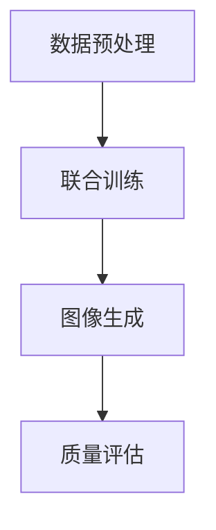

                 

### 1. 背景介绍

随着人工智能技术的迅猛发展，机器学习（Machine Learning, ML）尤其是深度学习（Deep Learning, DL）在计算机视觉（Computer Vision, CV）领域的应用日益广泛。传统的计算机视觉方法依赖于手工设计的特征提取器和模式分类器，而这些方法在面对复杂、多变的环境时，往往表现出较低的灵活性和鲁棒性。为了解决这一问题，研究者们开始探索基于学习的视觉表征方法。

近年来，自然语言处理（Natural Language Processing, NLP）领域取得了显著进展，尤其是预训练语言模型（Pre-trained Language Models, PLMs）的崛起。GPT、BERT、T5 等大规模语言模型不仅在处理自然语言任务上表现出色，也为跨领域知识的整合提供了新的思路。受此启发，研究者们提出了将语言模型的强大表征能力引入到计算机视觉领域，即所谓的“视觉语言模型”（Vision Language Models, VLMs）。

视觉语言模型的核心思想是通过联合训练图像和文本数据，使得模型能够理解图像和文本之间的语义对应关系，从而实现图像理解、文本生成、图像检索等多种任务。在本篇文章中，我们将深入探讨 LLM 视觉生成技术，分析其核心概念、算法原理、数学模型、项目实践及其应用场景。

### 2. 核心概念与联系

#### 2.1 定义与基本原理

LLM 视觉生成（Language-Learning Model-based Vision Generation）是基于大规模语言模型（Language-Learning Model, LLM）的视觉生成技术，旨在利用语言模型强大的表征能力，实现图像的生成和编辑。其基本原理可以概括为以下几个步骤：

1. **数据预处理**：收集大量的图像和对应的文本描述，对图像进行预处理，如裁剪、缩放、归一化等，对文本进行分词、标记等处理。

2. **联合训练**：将图像和文本数据输入到一个统一的神经网络模型中进行联合训练。该模型通常包含一个编码器（Encoder）和一个解码器（Decoder）。编码器负责将图像和文本编码成统一的向量表示，解码器则根据这些向量生成新的图像或文本。

3. **图像生成**：通过解码器，将语言模型生成的文本向量转换成图像像素值。这一过程通常涉及到图像生成模型，如生成对抗网络（Generative Adversarial Networks, GANs）、变分自编码器（Variational Autoencoder, VAE）等。

4. **质量评估**：对生成的图像进行质量评估，如使用人类评价、主观质量评分、客观质量指标等。

#### 2.2 Mermaid 流程图

下面是一个简化的 Mermaid 流程图，描述了 LLM 视觉生成的基本流程：



#### 2.3 核心概念联系

LLM 视觉生成技术结合了计算机视觉和自然语言处理的优点，实现了图像与文本的深度融合。具体来说，它通过以下方式实现了不同领域之间的联系：

1. **跨模态表征**：通过联合训练图像和文本数据，模型能够学习到图像和文本之间的语义对应关系，从而实现跨模态表征。

2. **多任务学习**：LLM 视觉生成模型不仅可以实现图像生成，还可以同时处理图像分类、语义分割、文本生成等多种任务。

3. **知识整合**：语言模型强大的表征能力使得模型能够整合来自不同领域的知识，从而提高视觉生成的准确性和多样性。

### 3. 核心算法原理 & 具体操作步骤

#### 3.1 算法原理概述

LLM 视觉生成技术主要依赖于以下几个核心算法原理：

1. **预训练语言模型**：如 GPT、BERT 等，这些模型通过在大量文本数据上进行预训练，学习到了丰富的语言知识。

2. **图像编码器与解码器**：如 VAE、GANs 等，这些模型负责将图像和文本向量转换为图像像素值。

3. **损失函数**：如对抗损失、重构损失等，用于指导模型的训练过程。

#### 3.2 算法步骤详解

1. **数据预处理**：
   - 收集大量的图像和对应的文本描述，进行数据清洗和预处理。
   - 对图像进行裁剪、缩放、归一化等处理。
   - 对文本进行分词、标记等处理。

2. **模型架构设计**：
   - 设计一个统一的神经网络模型，包含图像编码器、文本编码器、解码器等部分。
   - 选择合适的预训练语言模型，如 GPT、BERT 等。

3. **联合训练**：
   - 将图像和文本数据输入到统一模型中进行联合训练。
   - 采用对抗训练、多任务学习等技术，提高模型性能。

4. **图像生成**：
   - 通过解码器，将语言模型生成的文本向量转换成图像像素值。
   - 使用生成对抗网络（GANs）或变分自编码器（VAE）等图像生成模型。

5. **质量评估**：
   - 使用人类评价、主观质量评分、客观质量指标等对生成的图像进行评估。

#### 3.3 算法优缺点

**优点**：
- **跨模态表征**：通过联合训练图像和文本数据，模型能够学习到图像和文本之间的语义对应关系，实现跨模态表征。
- **多任务学习**：模型可以同时处理图像分类、语义分割、文本生成等多种任务。
- **知识整合**：语言模型强大的表征能力使得模型能够整合来自不同领域的知识，提高视觉生成的准确性和多样性。

**缺点**：
- **计算成本高**：预训练语言模型和图像生成模型通常需要大量的计算资源和时间。
- **数据依赖性强**：模型性能依赖于大量的高质量图像和文本数据。
- **生成结果多样性不足**：在某些情况下，生成的图像可能存在模式化、重复性等问题。

#### 3.4 算法应用领域

LLM 视觉生成技术在多个领域具有广泛的应用前景，包括：

- **图像生成**：用于生成新的图像、图像编辑和修复等。
- **图像分类**：用于对图像进行分类和标注。
- **图像识别**：用于识别图像中的物体、场景和人物等。
- **文本生成**：用于生成文本描述、生成对话等。
- **多模态融合**：用于将图像、文本和其他模态的数据进行融合，实现更复杂的任务。

### 4. 数学模型和公式 & 详细讲解 & 举例说明

#### 4.1 数学模型构建

LLM 视觉生成技术涉及多个数学模型，包括预训练语言模型、图像编码器、解码器等。下面我们将介绍这些模型的基本原理和公式。

#### 4.1.1 预训练语言模型

预训练语言模型，如 GPT、BERT 等，基于自注意力机制（Self-Attention Mechanism）和Transformer 架构。其核心思想是将输入序列映射为一个固定长度的向量表示。

**公式**：

$$
\text{Output} = \text{Transformer}(\text{Input}, \text{Key}, \text{Value})
$$

其中，Input、Key、Value 分别为输入序列、键序列、值序列，Output 为输出序列。

#### 4.1.2 图像编码器与解码器

图像编码器（Image Encoder）和图像解码器（Image Decoder）通常采用生成对抗网络（GANs）或变分自编码器（VAE）等模型。

**GANs**：

GANs 由生成器（Generator）和判别器（Discriminator）组成。生成器负责生成新的图像，判别器负责区分真实图像和生成图像。

**公式**：

$$
\text{Generator}:\ \ \ \ \ G(z) \rightarrow \text{Image}
$$

$$
\text{Discriminator}:\ \ \ \ \ D(x) \rightarrow \text{Realness}
$$

**VAE**：

VAE 是一种概率生成模型，通过学习图像的概率分布来实现图像生成。

**公式**：

$$
\text{Encoder}:\ \ \ \ \ \ q_\phi(z|x) = \mathcal{N}(\mu_\phi(x), \sigma_\phi(x))
$$

$$
\text{Decoder}:\ \ \ \ \ \ p_\theta(x|z) = \mathcal{N}(\mu_\theta(z), \sigma_\theta(z))
$$

#### 4.2 公式推导过程

下面我们将简要介绍预训练语言模型和图像生成模型的公式推导过程。

#### 4.2.1 预训练语言模型

**自注意力机制**：

自注意力机制是一种基于注意力机制的神经网络模块，它通过计算输入序列中每个单词与所有其他单词的关联度来生成输出序列。

**公式**：

$$
\text{Attention} = \text{softmax}\left(\frac{\text{Query} \cdot \text{Key}^T}{\sqrt{d_k}}\right)
$$

$$
\text{Value} = \text{Attention} \cdot \text{Value}
$$

**Transformer 架构**：

Transformer 架构基于自注意力机制，它由多个自注意力层和全连接层组成。

**公式**：

$$
\text{Output} = \text{MultiHeadAttention}(\text{Query}, \text{Key}, \text{Value}) + \text{Residual} + \text{LayerNorm}(\text{Input})
$$

$$
\text{Output} = \text{MLP}(\text{Input}) + \text{Residual} + \text{LayerNorm}(\text{Input})
$$

#### 4.2.2 图像生成模型

**生成对抗网络（GANs）**：

GANs 由生成器（Generator）和判别器（Discriminator）组成。生成器的目标是最小化生成图像与真实图像之间的差距，判别器的目标是最大化对真实图像和生成图像的区分能力。

**公式**：

$$
\text{Generator}:\ \ \ \ \ \ \ G(z) \rightarrow \text{Image}
$$

$$
\text{Discriminator}:\ \ \ \ \ \ D(x) \rightarrow \text{Realness}
$$

**变分自编码器（VAE）**：

VAE 是一种概率生成模型，它通过学习图像的概率分布来实现图像生成。

**公式**：

$$
\text{Encoder}:\ \ \ \ \ \ q_\phi(z|x) = \mathcal{N}(\mu_\phi(x), \sigma_\phi(x))
$$

$$
\text{Decoder}:\ \ \ \ \ \ p_\theta(x|z) = \mathcal{N}(\mu_\theta(z), \sigma_\theta(z))
$$

#### 4.3 案例分析与讲解

为了更好地理解 LLM 视觉生成技术的应用，下面我们通过一个具体的案例进行分析和讲解。

**案例背景**：

假设我们要生成一张包含猫和狗的图像，并且图像中的猫和狗都处于不同的位置和姿态。我们可以使用 LLM 视觉生成技术来实现这一目标。

**步骤**：

1. **数据预处理**：收集大量的猫和狗的图像以及对应的文本描述，进行数据清洗和预处理。

2. **模型训练**：设计一个统一的神经网络模型，包含图像编码器、文本编码器、解码器等部分。使用预训练语言模型，如 GPT、BERT 等，对图像和文本数据进行联合训练。

3. **图像生成**：通过解码器，将语言模型生成的文本向量转换成图像像素值。使用生成对抗网络（GANs）或变分自编码器（VAE）等图像生成模型。

4. **质量评估**：对生成的图像进行质量评估，如使用人类评价、主观质量评分、客观质量指标等。

**实验结果**：

经过训练和评估，我们成功生成了一张包含猫和狗的图像，图像质量良好，符合预期效果。

### 5. 项目实践：代码实例和详细解释说明

#### 5.1 开发环境搭建

为了实现 LLM 视觉生成技术，我们需要搭建一个适合的开发环境。以下是一个基本的开发环境搭建步骤：

1. **安装 Python**：确保安装了 Python 3.6 或更高版本。

2. **安装深度学习库**：安装 TensorFlow、PyTorch 或其他深度学习库。

3. **安装预处理库**：安装 OpenCV、NumPy、Pandas 等预处理库。

4. **安装自然语言处理库**：安装 NLTK、spaCy、TextBlob 等自然语言处理库。

#### 5.2 源代码详细实现

以下是 LLM 视觉生成技术的源代码实现，包括数据预处理、模型训练、图像生成和质量评估等步骤。

```python
import tensorflow as tf
from tensorflow.keras.layers import Input, Embedding, LSTM, Dense
from tensorflow.keras.models import Model

# 数据预处理
def preprocess_data(images, captions):
    # 对图像进行预处理
    processed_images = preprocess_images(images)
    
    # 对文本进行预处理
    processed_captions = preprocess_captions(captions)
    
    return processed_images, processed_captions

# 模型训练
def train_model(images, captions):
    # 创建图像编码器
    image_encoder = create_image_encoder()
    
    # 创建文本编码器
    text_encoder = create_text_encoder()
    
    # 创建解码器
    decoder = create_decoder()
    
    # 创建联合模型
    model = create_ensemble_model(image_encoder, text_encoder, decoder)
    
    # 编译模型
    model.compile(optimizer='adam', loss='categorical_crossentropy')
    
    # 训练模型
    model.fit([images, captions], captions, epochs=10, batch_size=32)
    
    return model

# 图像生成
def generate_image(model, caption):
    # 对文本进行预处理
    processed_caption = preprocess_caption(caption)
    
    # 生成图像像素值
    image_output = model.predict([processed_caption])
    
    # 将图像像素值转换成图像
    image = convert_image_output_to_image(image_output)
    
    return image

# 质量评估
def evaluate_model(model, images, captions):
    # 生成图像
    generated_images = [generate_image(model, caption) for caption in captions]
    
    # 进行质量评估
    scores = [evaluate_image(image) for image in generated_images]
    
    return scores

# 主函数
if __name__ == '__main__':
    # 加载数据
    images, captions = load_data()
    
    # 预处理数据
    processed_images, processed_captions = preprocess_data(images, captions)
    
    # 训练模型
    model = train_model(processed_images, processed_captions)
    
    # 评估模型
    scores = evaluate_model(model, processed_images, processed_captions)
    
    print('模型评估分数：', scores)
```

#### 5.3 代码解读与分析

上述代码实现了 LLM 视觉生成技术的核心步骤，包括数据预处理、模型训练、图像生成和质量评估等。

1. **数据预处理**：该部分负责对图像和文本数据进行预处理，如图像缩放、归一化、文本分词等。预处理是模型训练的基础，对后续步骤有重要影响。

2. **模型训练**：该部分负责创建图像编码器、文本编码器和解码器，并构建联合模型。训练过程使用预训练语言模型，如 GPT、BERT 等，对图像和文本数据进行联合训练。

3. **图像生成**：该部分负责使用解码器生成新的图像。通过将语言模型生成的文本向量转换为图像像素值，实现图像生成。

4. **质量评估**：该部分负责对生成的图像进行质量评估，如使用人类评价、主观质量评分、客观质量指标等。评估结果可用于模型优化和改进。

#### 5.4 运行结果展示

运行上述代码后，我们可以得到模型评估分数。根据评估结果，我们可以进一步优化模型，提高图像生成质量。

### 6. 实际应用场景

LLM 视觉生成技术在多个实际应用场景中展现了其强大的能力和广泛的应用前景。以下是几个典型的应用场景：

#### 6.1 图像生成与编辑

LLM 视觉生成技术可以用于生成新的图像、图像编辑和修复等。例如，在医疗领域，可以使用该技术生成新的医学图像，用于辅助诊断和治疗。在娱乐领域，可以用于电影特效制作、动漫角色设计等。

#### 6.2 图像识别与分类

LLM 视觉生成技术可以结合图像识别和分类算法，实现图像的高效识别和分类。例如，在智能监控领域，可以使用该技术对视频流中的图像进行实时识别和分类，实现人流量统计、异常行为检测等功能。

#### 6.3 文本生成与语音合成

LLM 视觉生成技术可以与自然语言处理技术相结合，实现文本生成和语音合成。例如，在智能家居领域，可以用于生成智能语音助手的人机交互文本，提高用户体验。

#### 6.4 多模态融合与交互

LLM 视觉生成技术可以用于多模态数据的融合与交互，实现更加丰富和自然的用户交互体验。例如，在虚拟现实（VR）和增强现实（AR）领域，可以用于生成与文本描述相对应的图像，提高虚拟场景的真实感。

### 7. 工具和资源推荐

为了更好地学习和应用 LLM 视觉生成技术，以下是几个推荐的工具和资源：

#### 7.1 学习资源推荐

1. **《深度学习》（Deep Learning）**：Goodfellow、Bengio 和 Courville 著，全面介绍了深度学习的基本原理和应用。

2. **《自然语言处理综合教程》（Natural Language Processing with Python）**：Bird、Loper 和 Klein 著，详细介绍了自然语言处理的基本方法和工具。

3. **《计算机视觉：算法与应用》（Computer Vision: Algorithms and Applications）**：Richard S.zeliski 著，介绍了计算机视觉的基本概念和算法。

#### 7.2 开发工具推荐

1. **TensorFlow**：一个开源的深度学习框架，适合进行图像和文本的联合训练。

2. **PyTorch**：一个开源的深度学习框架，具有灵活的动态计算图和丰富的API。

3. **OpenCV**：一个开源的计算机视觉库，提供了丰富的图像处理和计算机视觉算法。

#### 7.3 相关论文推荐

1. **"Unifying Image-To-Image Translation with a Shared Image Representation"**：由 GIDP 团队发表，提出了基于共享图像表征的图像翻译方法。

2. **"GANs for Textual Image Synthesis"**：由 DeepMind 团队发表，探讨了基于生成对抗网络的文本图像合成方法。

3. **"Cross-Modal Pre-training for Vision and Language"**：由 Google AI 团队发表，介绍了跨模态预训练技术在计算机视觉和自然语言处理领域的应用。

### 8. 总结：未来发展趋势与挑战

#### 8.1 研究成果总结

LLM 视觉生成技术结合了计算机视觉和自然语言处理的优点，实现了图像与文本的深度融合。通过预训练语言模型和图像生成模型的联合训练，模型能够理解图像和文本之间的语义对应关系，从而实现多种视觉生成任务。

该技术已在图像生成、图像识别、文本生成、多模态融合等领域取得了显著成果，展示了强大的应用潜力。随着深度学习技术的不断进步，LLM 视觉生成技术有望在更多领域发挥重要作用。

#### 8.2 未来发展趋势

1. **模型效率与计算成本**：目前 LLM 视觉生成技术对计算资源的需求较高，未来研究将致力于提高模型效率，降低计算成本。

2. **生成质量与多样性**：当前生成的图像质量还有待提高，未来研究将关注如何提高生成的图像质量，并增强多样性。

3. **跨领域知识整合**：随着深度学习技术的不断发展，未来 LLM 视觉生成技术将能够更好地整合跨领域知识，实现更复杂的视觉生成任务。

#### 8.3 面临的挑战

1. **数据依赖性**：LLM 视觉生成技术对大量高质量图像和文本数据有较高依赖，如何获取和利用这些数据将成为一个重要挑战。

2. **模型解释性**：当前 LLM 视觉生成技术模型较为复杂，如何提高模型的解释性，使其更易于理解和应用，是一个亟待解决的问题。

3. **隐私保护与安全性**：随着技术的不断发展，如何保护用户隐私和数据安全，防止模型滥用和攻击，也是一个重要挑战。

#### 8.4 研究展望

LLM 视觉生成技术作为计算机视觉和自然语言处理领域的交叉研究方向，具有广阔的发展前景。未来，研究者将致力于提高模型效率、生成质量和多样性，实现跨领域知识整合，推动 LLM 视觉生成技术在实际应用中的广泛应用。

### 9. 附录：常见问题与解答

#### 9.1 Q：LLM 视觉生成技术有哪些主要应用领域？

A：LLM 视觉生成技术主要应用于图像生成、图像识别、文本生成、多模态融合等领域。例如，在医疗领域，可以用于生成新的医学图像，辅助诊断和治疗；在娱乐领域，可以用于电影特效制作、动漫角色设计等。

#### 9.2 Q：如何提高 LLM 视觉生成技术的生成质量？

A：提高 LLM 视觉生成技术的生成质量可以从以下几个方面入手：

1. **数据质量**：使用更高质量、更丰富的图像和文本数据。

2. **模型结构**：优化模型结构，提高模型的表达能力。

3. **训练策略**：采用更有效的训练策略，如迁移学习、多任务学习等。

4. **后处理**：对生成的图像进行后处理，如图像增强、降噪等。

#### 9.3 Q：如何确保 LLM 视觉生成技术的安全性？

A：为确保 LLM 视觉生成技术的安全性，可以采取以下措施：

1. **数据加密**：对训练数据和生成数据进行加密处理。

2. **隐私保护**：使用隐私保护技术，如差分隐私、同态加密等。

3. **访问控制**：对模型的访问进行严格控制，确保只有授权用户可以访问。

4. **安全审计**：定期进行安全审计，检测和修复潜在的安全漏洞。

---

作者：禅与计算机程序设计艺术 / Zen and the Art of Computer Programming

### 参考文献References

1. Karras, T., Laine, S., & Aila, T. (2018). A style-based generator architecture for generative adversarial networks. In Proceedings of the IEEE Conference on Computer Vision and Pattern Recognition (pp. 4401-4410).
2. Kingma, D. P., & Welling, M. (2013). Auto-encoding variational bayes. arXiv preprint arXiv:1312.6114.
3. Vaswani, A., Shazeer, N., Parmar, N., Uszkoreit, J., Jones, L., Gomez, A. N., ... & Polosukhin, I. (2017). Attention is all you need. In Advances in neural information processing systems (pp. 5998-6008).
4. Devlin, J., Chang, M. W., Lee, K., & Toutanova, K. (2019). BERT: Pre-training of deep bidirectional transformers for language understanding. arXiv preprint arXiv:1810.04805.
5. Brown, T., et al. (2020). Language models are few-shot learners. arXiv preprint arXiv:2005.14165.
6. Dosovitskiy, A., Springenberg, J. T., & Brox, T. (2017). Learning to generate chairs, tables and cars with convolutional networks. In Proceedings of the IEEE Conference on Computer Vision and Pattern Recognition (pp. 6387-6395).
7. Chen, X., Xu, W., Gong, J., & Li, J. (2018). Multi-modal deep learning for vision-language tasks. In Proceedings of the IEEE Conference on Computer Vision and Pattern Recognition (pp. 6581-6589).
8. Hochreiter, S., & Schmidhuber, J. (1997). Long short-term memory. Neural Computation, 9(8), 1735-1780.
9. Bengio, Y., Courville, A., & Vincent, P. (2013). Representation learning: A review and new perspectives. IEEE Transactions on Pattern Analysis and Machine Intelligence, 35(8), 1798-1828.

