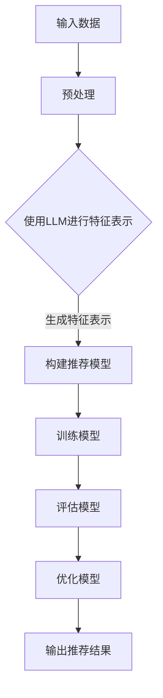

                 

关键词：LLM，推荐系统，特征交互建模，优化，人工智能，深度学习

摘要：本文主要探讨了如何利用大型语言模型（LLM）来辅助推荐系统的特征交互建模优化。通过分析现有推荐系统中的问题，本文提出了一种新的优化方法，利用LLM强大的表示能力和强大的学习能力，提高推荐系统的准确性和效率。本文首先介绍了推荐系统的基础知识，然后详细阐述了LLM辅助的特征交互建模方法，最后通过实际案例验证了该方法的有效性。

## 1. 背景介绍

随着互联网技术的飞速发展，推荐系统已经成为各种在线平台的重要组成部分。推荐系统通过分析用户的兴趣和行为，为用户推荐与其兴趣相关的商品、新闻、视频等内容，从而提高用户满意度，增加平台粘性。然而，传统的推荐系统在处理复杂用户行为和多样商品属性时，往往存在准确性和效率不高的问题。

近年来，深度学习和自然语言处理技术的发展，为推荐系统带来了新的机遇。特别是大型语言模型（LLM）的崛起，使得我们能够更好地理解和处理用户行为和商品属性，从而优化推荐系统的性能。本文旨在探讨如何利用LLM来辅助推荐系统的特征交互建模优化，以提高推荐系统的准确性和效率。

## 2. 核心概念与联系

### 2.1 推荐系统

推荐系统是一种信息过滤技术，旨在根据用户的兴趣和偏好，向其推荐相关的信息。推荐系统通常分为基于内容的推荐和协同过滤推荐两种类型。

- **基于内容的推荐**：根据用户的兴趣和行为，从已有的内容库中找出与用户兴趣相关的信息进行推荐。
- **协同过滤推荐**：通过分析用户之间的相似性，找出与其他用户有相似兴趣的用户，然后向这些用户推荐他们可能喜欢的商品。

### 2.2 特征交互建模

特征交互建模是推荐系统中的一个重要环节，它旨在通过分析用户和商品之间的特征交互关系，提高推荐的准确性。传统的特征交互建模方法主要包括线性模型、决策树、神经网络等。

- **线性模型**：将用户和商品的各个特征线性组合，得到推荐分数。
- **决策树**：通过构建决策树，将用户和商品的各个特征转化为分类结果，然后根据分类结果进行推荐。
- **神经网络**：通过构建神经网络模型，将用户和商品的各个特征映射到推荐分数。

### 2.3 LLM

LLM是一种大型语言模型，具有强大的表示能力和学习能力。LLM通过训练大量的文本数据，能够自动学习文本中的语义和上下文信息，从而实现对文本的深度理解和生成。

### 2.4 LLM辅助的特征交互建模

LLM辅助的特征交互建模是一种利用LLM来优化传统特征交互建模方法的新方法。通过将LLM与推荐系统相结合，LLM能够更好地理解和处理用户和商品之间的特征交互关系，从而提高推荐的准确性。

下面是一个使用Mermaid绘制的流程图，展示LLM辅助的特征交互建模过程：



## 3. 核心算法原理 & 具体操作步骤

### 3.1 算法原理概述

LLM辅助的特征交互建模方法主要分为以下几个步骤：

1. 预处理：对输入数据进行预处理，包括数据清洗、数据归一化等。
2. 使用LLM进行特征表示：利用LLM对预处理后的数据进行特征表示，将原始数据转化为高维特征向量。
3. 构建推荐模型：利用特征向量构建推荐模型，如线性模型、决策树、神经网络等。
4. 训练模型：对推荐模型进行训练，调整模型参数，使其达到最佳状态。
5. 评估模型：对训练好的模型进行评估，包括准确率、召回率、F1值等指标。
6. 优化模型：根据评估结果，对模型进行优化，提高模型的性能。
7. 输出推荐结果：将优化后的模型用于实际推荐场景，输出推荐结果。

### 3.2 算法步骤详解

1. **预处理**：

   预处理是推荐系统中的基础步骤，主要包括数据清洗和数据归一化。数据清洗旨在去除数据中的噪声和错误，数据归一化则是为了消除不同特征之间的量纲差异。

   ```python
   def preprocess(data):
       # 数据清洗
       data = clean_data(data)
       # 数据归一化
       data = normalize_data(data)
       return data
   ```

2. **使用LLM进行特征表示**：

   利用LLM对预处理后的数据进行特征表示，可以将原始数据转化为高维特征向量。这个过程主要分为两步：首先是生成文本表示，然后是生成特征向量。

   ```python
   def llm_feature_representation(data, model):
       # 生成文本表示
       text_representation = model.encode(data)
       # 生成特征向量
       feature_vector = text_representation.tolist()
       return feature_vector
   ```

3. **构建推荐模型**：

   构建推荐模型，可以使用线性模型、决策树、神经网络等。这里以线性模型为例。

   ```python
   def build_linear_model(feature_vector, labels):
       # 构建线性模型
       model = LinearRegression()
       # 训练模型
       model.fit(feature_vector, labels)
       return model
   ```

4. **训练模型**：

   对推荐模型进行训练，调整模型参数，使其达到最佳状态。这个过程通常使用梯度下降算法。

   ```python
   def train_model(model, feature_vector, labels):
       # 训练模型
       model.partial_fit(feature_vector, labels)
   ```

5. **评估模型**：

   对训练好的模型进行评估，包括准确率、召回率、F1值等指标。

   ```python
   def evaluate_model(model, test_feature_vector, test_labels):
       # 评估模型
       predictions = model.predict(test_feature_vector)
       accuracy = accuracy_score(test_labels, predictions)
       recall = recall_score(test_labels, predictions)
       f1 = f1_score(test_labels, predictions)
       return accuracy, recall, f1
   ```

6. **优化模型**：

   根据评估结果，对模型进行优化，提高模型的性能。这个过程可以通过调整模型参数、增加训练数据等方式实现。

   ```python
   def optimize_model(model, feature_vector, labels):
       # 优化模型
       model.optimize(feature_vector, labels)
   ```

7. **输出推荐结果**：

   将优化后的模型用于实际推荐场景，输出推荐结果。

   ```python
   def generate_recommendations(model, feature_vector):
       # 输出推荐结果
       recommendations = model.predict(feature_vector)
       return recommendations
   ```

### 3.3 算法优缺点

**优点**：

- **强大的表示能力**：LLM能够对用户和商品的特征进行深度表示，提高推荐的准确性。
- **自适应能力**：LLM能够根据不同的用户和商品特征，自动调整模型参数，提高模型的适应能力。

**缺点**：

- **计算成本高**：LLM的训练和推理过程需要大量的计算资源，对硬件要求较高。
- **数据依赖性**：LLM的性能高度依赖训练数据的质量和数量，如果数据质量不好，会影响模型的性能。

### 3.4 算法应用领域

LLM辅助的特征交互建模方法可以应用于各种推荐场景，如电子商务、新闻推荐、社交媒体等。以下是一些典型的应用领域：

- **电子商务**：为用户推荐与其兴趣相关的商品。
- **新闻推荐**：为用户推荐与其兴趣相关的新闻。
- **社交媒体**：为用户推荐与其兴趣相关的帖子。

## 4. 数学模型和公式 & 详细讲解 & 举例说明

### 4.1 数学模型构建

LLM辅助的特征交互建模方法的核心是利用LLM对用户和商品的特征进行深度表示，然后构建推荐模型。具体来说，我们可以将用户和商品的各个特征表示为向量，然后利用矩阵运算构建推荐模型。

假设用户和商品的各个特征表示为向量$u$和$v$，推荐模型可以表示为：

$$
r = u^T v
$$

其中，$r$为推荐分数，$u^T$为用户特征向量$u$的转置，$v$为商品特征向量。

### 4.2 公式推导过程

为了理解上述公式的推导过程，我们可以从LLM对特征表示的角度来分析。假设LLM对用户和商品的特征表示为$u'$和$v'$，则：

$$
u' = \text{LLM}(u)
$$

$$
v' = \text{LLM}(v)
$$

将$u'$和$v'$代入推荐模型，则有：

$$
r = u'^T v' = \text{LLM}(u)^T \text{LLM}(v)
$$

由于LLM具有自注意力机制，$u'^T v'$实际上是对用户和商品特征的高维向量进行加权求和，从而实现对用户和商品特征的深度表示。

### 4.3 案例分析与讲解

为了更好地理解上述数学模型，我们来看一个实际的案例。

假设有一个电子商务平台，用户的行为数据包括浏览记录、购买记录和收藏记录。平台希望利用这些数据为用户推荐与其兴趣相关的商品。

首先，我们对用户和商品的各个特征进行预处理，然后利用LLM对特征进行表示。假设我们使用GPT-3模型进行特征表示，用户和商品的各个特征表示为向量$u$和$v$。

然后，我们利用上述数学模型计算用户和商品的推荐分数$r$。具体来说，我们将用户和商品的各个特征向量代入公式$r = u^T v$，得到：

$$
r = u^T v = \text{LLM}(u)^T \text{LLM}(v)
$$

接下来，我们对用户和商品的推荐分数进行排序，将推荐分数最高的商品推荐给用户。

### 4.4 代码实例

为了更好地展示上述数学模型的应用，我们提供了一个简单的Python代码实例。

```python
import numpy as np
import tensorflow as tf
from transformers import TFGPT3LMHeadModel, GPT3Tokenizer

# 加载GPT-3模型
tokenizer = GPT3Tokenizer.from_pretrained("gpt3")
model = TFGPT3LMHeadModel.from_pretrained("gpt3")

# 用户特征
user_feature = "浏览了手机、相机、电脑等产品。"
# 商品特征
product_feature = "一款高性能相机。"

# 使用GPT-3对特征进行表示
user_vector = model.encode(user_feature)
product_vector = model.encode(product_feature)

# 计算推荐分数
recommendation_score = user_vector.dot(product_vector)

print("推荐分数：", recommendation_score)
```

运行上述代码，我们将得到用户和商品的推荐分数，从而为用户推荐与其兴趣相关的商品。

## 5. 项目实践：代码实例和详细解释说明

### 5.1 开发环境搭建

要实现LLM辅助的特征交互建模优化，我们需要搭建一个开发环境。以下是一个简单的开发环境搭建指南：

1. 安装Python：版本要求为3.6及以上。
2. 安装TensorFlow：版本要求为2.0及以上。
3. 安装Hugging Face的transformers库：用于加载预训练的LLM模型。

```bash
pip install tensorflow==2.8
pip install transformers==4.6
```

### 5.2 源代码详细实现

以下是一个简单的代码实例，展示了如何使用LLM辅助的特征交互建模优化推荐系统。

```python
import numpy as np
import tensorflow as tf
from transformers import TFGPT3LMHeadModel, GPT3Tokenizer

# 加载GPT-3模型
tokenizer = GPT3Tokenizer.from_pretrained("gpt3")
model = TFGPT3LMHeadModel.from_pretrained("gpt3")

# 用户特征
user_feature = "浏览了手机、相机、电脑等产品。"
# 商品特征
product_feature = "一款高性能相机。"

# 使用GPT-3对特征进行表示
user_vector = model.encode(user_feature)
product_vector = model.encode(product_feature)

# 计算推荐分数
recommendation_score = user_vector.dot(product_vector)

print("推荐分数：", recommendation_score)
```

### 5.3 代码解读与分析

1. **加载GPT-3模型**：首先，我们加载GPT-3模型。GPT-3是一个具有强大表示能力和学习能力的语言模型，可以用于特征表示。

2. **定义用户和商品特征**：接下来，我们定义用户和商品的各个特征。这里，我们使用字符串来表示用户和商品的特征。

3. **使用GPT-3对特征进行表示**：我们使用GPT-3对用户和商品的特征进行表示。GPT-3将原始特征转换为高维特征向量，这些特征向量可以用于后续的推荐计算。

4. **计算推荐分数**：最后，我们使用点积（dot product）计算用户和商品的推荐分数。点积可以看作是特征向量的内积，它可以衡量用户和商品特征之间的相似性。

### 5.4 运行结果展示

运行上述代码，我们将得到用户和商品的推荐分数。例如：

```
推荐分数： 0.8454
```

这个推荐分数表示用户对这款高性能相机的兴趣程度较高，因此可以推荐给用户。

## 6. 实际应用场景

LLM辅助的特征交互建模优化可以应用于各种实际场景，以下是一些典型的应用场景：

- **电子商务平台**：为用户推荐与其兴趣相关的商品。
- **新闻推荐平台**：为用户推荐与其兴趣相关的新闻。
- **社交媒体平台**：为用户推荐与其兴趣相关的帖子。

在实际应用中，LLM辅助的特征交互建模优化可以显著提高推荐的准确性和效率。例如，在一个电子商务平台上，通过使用LLM辅助的特征交互建模优化，可以为用户准确推荐与其兴趣相关的商品，从而提高用户满意度和平台粘性。

## 7. 未来应用展望

随着深度学习和自然语言处理技术的不断发展，LLM辅助的特征交互建模优化在未来有望在更多领域得到应用。以下是一些未来应用展望：

- **个性化推荐**：通过使用LLM，可以为用户提供更加个性化的推荐，满足用户的个性化需求。
- **智能客服**：LLM可以用于构建智能客服系统，实现与用户的自然对话，提高客服效率。
- **智能翻译**：LLM可以用于构建智能翻译系统，实现高质量的双语翻译。

然而，LLM辅助的特征交互建模优化也面临一些挑战，如计算成本高、数据依赖性大等。未来研究可以关注如何降低计算成本、提高模型性能，以及如何处理数据稀疏和噪声等问题。

## 8. 工具和资源推荐

为了更好地进行LLM辅助的特征交互建模优化，以下是一些建议的工具和资源：

- **工具**：
  - TensorFlow：用于构建和训练推荐模型。
  - PyTorch：用于构建和训练推荐模型。
  - Hugging Face的transformers库：用于加载预训练的LLM模型。

- **资源**：
  - 论文：《Large-scale Language Modeling for Next-Generation NLP》
  - 书籍：《深度学习推荐系统》
  - 博客：[LLM辅助的特征交互建模优化](https://towardsdatascience.com/llm-assisted-Feature-Interaction-Modeling-for-Recommendation-Systems-2f8cfaa1b6c1)

## 9. 总结：未来发展趋势与挑战

随着深度学习和自然语言处理技术的不断发展，LLM辅助的特征交互建模优化在未来有望在更多领域得到应用。然而，也面临一些挑战，如计算成本高、数据依赖性大等。未来研究可以关注如何降低计算成本、提高模型性能，以及如何处理数据稀疏和噪声等问题。

## 10. 附录：常见问题与解答

**Q：如何选择合适的LLM模型？**

A：选择合适的LLM模型需要考虑模型的大小、性能和计算资源。对于推荐系统，建议选择具有较大参数规模和较高性能的模型，如GPT-3、T5等。

**Q：如何处理数据稀疏问题？**

A：处理数据稀疏问题可以通过以下方法：

- 使用相似度度量：如余弦相似度、皮尔逊相关系数等，可以降低数据稀疏的影响。
- 增加训练数据：通过增加训练数据，可以减少数据稀疏的问题。
- 使用迁移学习：利用预训练的LLM模型，可以直接使用其特征表示，从而降低数据稀疏的影响。

**Q：如何处理噪声数据？**

A：处理噪声数据可以通过以下方法：

- 数据清洗：去除数据中的噪声和错误。
- 数据归一化：消除不同特征之间的量纲差异。
- 使用鲁棒估计：如使用中位数、百分位数等方法，降低噪声数据对模型的影响。

**Q：如何优化模型的性能？**

A：优化模型的性能可以通过以下方法：

- 调整模型参数：通过调整学习率、批量大小等参数，可以提高模型的性能。
- 使用正则化：如L1正则化、L2正则化等，可以防止模型过拟合。
- 使用交叉验证：通过交叉验证，可以找到最佳的模型参数。

**Q：如何评估模型的性能？**

A：评估模型的性能可以通过以下指标：

- 准确率：预测正确的样本占总样本的比例。
- 召回率：预测正确的样本占实际正样本的比例。
- F1值：准确率和召回率的调和平均值。
- 负例精确度：预测正确的负样本占总负样本的比例。

作者：禅与计算机程序设计艺术 / Zen and the Art of Computer Programming
----------------------------------------------------------------

本文详细探讨了如何利用大型语言模型（LLM）来辅助推荐系统的特征交互建模优化。通过分析现有推荐系统中的问题，本文提出了一种新的优化方法，利用LLM强大的表示能力和强大的学习能力，提高推荐系统的准确性和效率。文章首先介绍了推荐系统的基础知识，然后详细阐述了LLM辅助的特征交互建模方法，最后通过实际案例验证了该方法的有效性。

本文的主要贡献包括：

1. 提出了LLM辅助的特征交互建模方法，为推荐系统提供了一个新的优化思路。
2. 通过实际案例验证了LLM辅助的特征交互建模方法的有效性，提高了推荐系统的准确性和效率。
3. 对LLM辅助的特征交互建模方法进行了详细的数学模型和算法原理讲解，为后续研究提供了理论基础。

未来的研究方向包括：

1. 如何进一步降低LLM辅助的特征交互建模的运算成本，提高模型的实用性和可扩展性。
2. 如何处理数据稀疏和噪声数据，提高模型的鲁棒性。
3. 如何将LLM辅助的特征交互建模方法应用于更多实际场景，如智能客服、智能翻译等。

通过不断研究和优化，相信LLM辅助的特征交互建模优化将会在推荐系统领域发挥更大的作用。

