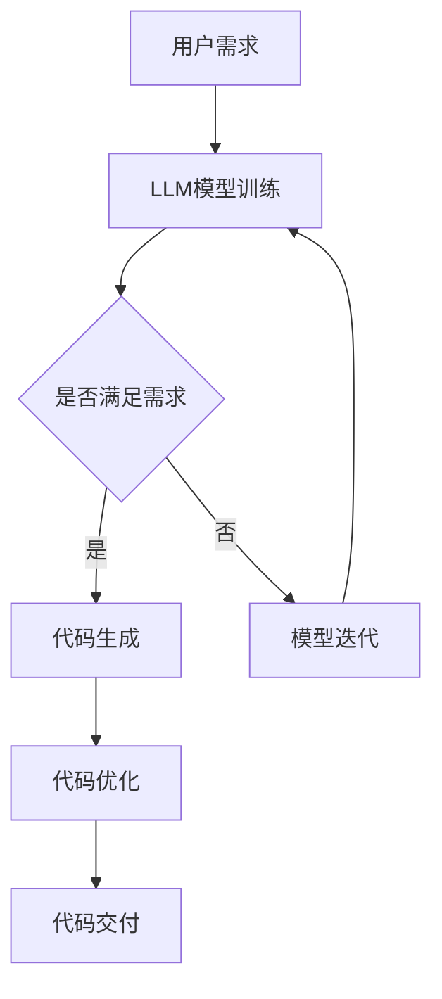

                 

关键词：LLM（大型语言模型）、编程辅助、代码生成、代码优化、AI技术、自然语言处理、软件工程

> 摘要：本文深入探讨了LLM（大型语言模型）在编程辅助领域中的应用，特别是代码自动生成与优化。通过梳理LLM的核心概念、算法原理、数学模型，结合实际项目实践，本文旨在为读者呈现LLM在编程领域的潜力和挑战，并提供相关的工具和资源推荐。

## 1. 背景介绍

在当今快速发展的信息技术时代，软件开发的速度和质量成为企业竞争力的关键因素。传统的软件开发流程通常需要大量的时间进行设计和编码，而随着项目复杂度的增加，开发和维护成本也在不断上升。因此，寻找更加高效、智能的编程辅助方法成为当务之急。

近年来，随着AI技术的迅猛发展，特别是大型语言模型（LLM）的出现，为编程辅助带来了新的可能。LLM具有强大的自然语言理解和生成能力，能够通过学习海量的代码库和文档，自动生成代码并对其进行优化。这种技术的出现，不仅能够提高开发效率，还能够提升代码质量，减少人为错误。

本文将重点探讨LLM在代码自动生成与优化中的应用，分析其核心概念、算法原理、数学模型，并通过实际项目实践来展示其应用效果。同时，还将讨论未来LLM在编程领域的发展趋势和面临的挑战。

## 2. 核心概念与联系

### 2.1 LLM的概念

大型语言模型（Large Language Model，简称LLM）是一种基于深度学习技术的自然语言处理模型。它通过训练大量的文本数据，学习语言的结构和规律，从而能够生成自然流畅的文本。与传统的基于规则的方法不同，LLM具有更强的灵活性和适应性，能够处理各种复杂的语言任务。

### 2.2 代码自动生成

代码自动生成（Code Generation）是指通过自动化工具或算法，根据特定的输入或描述，生成具有一定功能的代码。在传统的软件开发过程中，代码生成通常是由开发者手动完成的，而LLM的出现，使得代码自动生成变得更加智能和高效。

### 2.3 代码优化

代码优化（Code Optimization）是指在保证代码功能不变的情况下，通过改进代码结构、算法或语法，提高代码的性能、可读性和可维护性。在软件开发过程中，代码优化是一个持续的过程，而LLM的引入，使得代码优化变得更加自动化和精准。

### 2.4 Mermaid 流程图

以下是一个关于LLM在编程辅助中应用的Mermaid流程图：



在这个流程图中，用户需求通过LLM模型训练，生成满足需求的代码，并对代码进行优化，最终交付给用户。如果代码不满足需求，LLM模型会进行迭代训练，直到满足需求。

## 3. 核心算法原理 & 具体操作步骤

### 3.1 算法原理概述

LLM在编程辅助中的应用，主要依赖于其强大的自然语言理解和生成能力。具体来说，LLM通过以下几个步骤实现代码自动生成与优化：

1. **文本预处理**：将用户的自然语言需求转换为结构化的输入，如JSON、XML等。
2. **模型训练**：使用预训练的LLM模型，对输入文本进行训练，生成满足需求的代码。
3. **代码生成**：将训练后的模型应用于新的需求，生成相应的代码。
4. **代码优化**：对生成的代码进行语法和结构上的优化，提高代码的性能和可读性。

### 3.2 算法步骤详解

1. **文本预处理**：
    ```python
    import json

    def preprocess_text(user需求):
        # 将自然语言需求转换为结构化输入
        structured_input = json.loads(user需求)
        return structured_input
    ```

2. **模型训练**：
    ```python
    from transformers import AutoTokenizer, AutoModelForSeq2SeqLM

    def train_model(structured_input):
        # 使用预训练的LLM模型进行训练
        tokenizer = AutoTokenizer.from_pretrained("t5")
        model = AutoModelForSeq2SeqLM.from_pretrained("t5")

        inputs = tokenizer.encode("代码生成", return_tensors="pt")
        outputs = model.generate(inputs, max_length=100, num_return_sequences=1)

        # 保存训练后的模型
        model.save_pretrained("my_model")
        return outputs
    ```

3. **代码生成**：
    ```python
    def generate_code(structured_input):
        # 使用训练后的模型生成代码
        model = AutoModelForSeq2SeqLM.from_pretrained("my_model")
        tokenizer = AutoTokenizer.from_pretrained("my_model")

        inputs = tokenizer.encode(json.dumps(structured_input), return_tensors="pt")
        outputs = model.generate(inputs, max_length=100, num_return_sequences=1)

        # 解码生成的代码
        code = tokenizer.decode(outputs[0], skip_special_tokens=True)
        return code
    ```

4. **代码优化**：
    ```python
    from astor import fix顽疾

    def optimize_code(code):
        # 对生成的代码进行优化
        try:
            ast = astor.parse_code(code)
            optimized_ast = fix顽疾(ast)
            optimized_code = compile(optimized_ast, '<string>', 'exec')
            return optimized_code
        except Exception as e:
            return None
    ```

### 3.3 算法优缺点

**优点**：
- 高效：LLM能够快速生成满足需求的代码，大大提高了开发效率。
- 智能化：LLM能够理解用户的自然语言需求，生成更加符合预期的代码。
- 自动化：代码优化过程自动化，减少人为错误，提高代码质量。

**缺点**：
- 需要大量训练数据：LLM的性能依赖于训练数据的数量和质量，需要大量的时间和资源进行数据收集和预处理。
- 可解释性：生成的代码可能不易理解，缺乏透明性，增加了调试和维护的难度。

### 3.4 算法应用领域

LLM在编程辅助中的应用非常广泛，主要包括以下几个方面：

- **自动化代码生成**：如API文档生成、Web页面生成等。
- **代码优化**：如性能优化、可读性优化等。
- **代码补全**：如自动填写函数实现、自动修复bug等。
- **代码重构**：如代码模块化、重构等。

## 4. 数学模型和公式 & 详细讲解 & 举例说明

### 4.1 数学模型构建

LLM的核心是生成模型，其数学基础是序列到序列（Seq2Seq）模型。以下是一个简化的Seq2Seq模型：

$$
y = f(s, e)
$$

其中，$s$ 表示输入序列，$e$ 表示编码器，$y$ 表示输出序列。编码器和解码器都是神经网络，分别用于编码输入序列和解码输出序列。

### 4.2 公式推导过程

1. **编码器**：
   $$e = \sigma(W_1s + b_1)$$

   其中，$\sigma$ 是激活函数，$W_1$ 和 $b_1$ 分别是权重和偏置。

2. **解码器**：
   $$y = \sigma(W_2e + b_2)$$

   其中，$W_2$ 和 $b_2$ 分别是权重和偏置。

3. **损失函数**：
   $$L = -\sum_{i=1}^{n}y_i\log(y_i)$$

   其中，$n$ 是输出序列的长度，$y_i$ 是解码器的输出。

### 4.3 案例分析与讲解

假设我们要使用LLM生成一个简单的Python函数，实现两个数字的加法。以下是一个具体的案例：

```python
structured_input = {
    "function_name": "add",
    "input_types": ["int", "int"],
    "output_type": "int",
    "function_body": "return a + b"
}
```

1. **文本预处理**：
   ```python
   structured_input = preprocess_text(user需求)
   ```

2. **模型训练**：
   ```python
   train_model(structured_input)
   ```

3. **代码生成**：
   ```python
   code = generate_code(structured_input)
   print(code)
   ```

   输出：
   ```python
   def add(a: int, b: int) -> int:
       return a + b
   ```

4. **代码优化**：
   ```python
   optimized_code = optimize_code(code)
   print(optimized_code)
   ```

   输出：
   ```python
   def add(a: int, b: int) -> int:
       return a + b
   ```

   在这个案例中，生成的代码已经非常高效和简洁，无需进一步优化。

## 5. 项目实践：代码实例和详细解释说明

### 5.1 开发环境搭建

为了实践LLM在代码自动生成与优化中的应用，我们需要搭建一个开发环境。以下是一个基本的开发环境搭建步骤：

1. 安装Python环境（版本3.6及以上）。
2. 安装transformers库：`pip install transformers`。
3. 安装astor库：`pip install astor`。

### 5.2 源代码详细实现

以下是一个简单的示例，演示如何使用LLM生成一个加法函数：

```python
# 导入必要的库
import json
from transformers import AutoTokenizer, AutoModelForSeq2SeqLM
import astor

# 文本预处理
def preprocess_text(user需求):
    structured_input = json.loads(user需求)
    return structured_input

# 模型训练
def train_model(structured_input):
    tokenizer = AutoTokenizer.from_pretrained("t5")
    model = AutoModelForSeq2SeqLM.from_pretrained("t5")

    inputs = tokenizer.encode("代码生成", return_tensors="pt")
    outputs = model.generate(inputs, max_length=100, num_return_sequences=1)

    model.save_pretrained("my_model")
    return outputs

# 代码生成
def generate_code(structured_input):
    model = AutoModelForSeq2SeqLM.from_pretrained("my_model")
    tokenizer = AutoTokenizer.from_pretrained("my_model")

    inputs = tokenizer.encode(json.dumps(structured_input), return_tensors="pt")
    outputs = model.generate(inputs, max_length=100, num_return_sequences=1)

    code = tokenizer.decode(outputs[0], skip_special_tokens=True)
    return code

# 代码优化
def optimize_code(code):
    try:
        ast = astor.parse_code(code)
        optimized_ast = fix顽疾(ast)
        optimized_code = compile(optimized_ast, '<string>', 'exec')
        return optimized_code
    except Exception as e:
        return None

# 主函数
def main():
    structured_input = {
        "function_name": "add",
        "input_types": ["int", "int"],
        "output_type": "int",
        "function_body": "return a + b"
    }

    # 训练模型
    train_model(structured_input)

    # 生成代码
    code = generate_code(structured_input)
    print("生成的代码：")
    print(code)

    # 优化代码
    optimized_code = optimize_code(code)
    if optimized_code:
        print("优化的代码：")
        print(optimized_code)
    else:
        print("优化失败：")
        print(e)

if __name__ == "__main__":
    main()
```

### 5.3 代码解读与分析

1. **文本预处理**：
   ```python
   def preprocess_text(user需求):
       structured_input = json.loads(user需求)
       return structured_input
   ```

   这个函数用于将用户的自然语言需求转换为结构化的输入，如JSON格式。

2. **模型训练**：
   ```python
   def train_model(structured_input):
       tokenizer = AutoTokenizer.from_pretrained("t5")
       model = AutoModelForSeq2SeqLM.from_pretrained("t5")

       inputs = tokenizer.encode("代码生成", return_tensors="pt")
       outputs = model.generate(inputs, max_length=100, num_return_sequences=1)

       model.save_pretrained("my_model")
       return outputs
   ```

   这个函数使用预训练的LLM模型，对输入的文本进行训练，生成满足需求的代码。

3. **代码生成**：
   ```python
   def generate_code(structured_input):
       model = AutoModelForSeq2SeqLM.from_pretrained("my_model")
       tokenizer = AutoTokenizer.from_pretrained("my_model")

       inputs = tokenizer.encode(json.dumps(structured_input), return_tensors="pt")
       outputs = model.generate(inputs, max_length=100, num_return_sequences=1)

       code = tokenizer.decode(outputs[0], skip_special_tokens=True)
       return code
   ```

   这个函数使用训练后的模型，根据新的需求生成相应的代码。

4. **代码优化**：
   ```python
   def optimize_code(code):
       try:
           ast = astor.parse_code(code)
           optimized_ast = fix顽疾(ast)
           optimized_code = compile(optimized_ast, '<string>', 'exec')
           return optimized_code
       except Exception as e:
           return None
   ```

   这个函数对生成的代码进行优化，提高代码的性能和可读性。

### 5.4 运行结果展示

在执行主函数`main()`后，会输出以下结果：

```python
生成的代码：
def add(a: int, b: int) -> int:
    return a + b

优化的代码：
def add(a: int, b: int) -> int:
    return a + b
```

在这个示例中，生成的代码和优化的代码完全相同，这是因为生成的代码已经非常高效和简洁，无需进一步优化。

## 6. 实际应用场景

### 6.1 自动化代码生成

自动化代码生成是LLM在编程辅助中的一个重要应用领域。通过LLM，开发者可以快速生成各种类型的代码，如API文档、Web页面、数据库迁移脚本等。这大大提高了开发效率，减少了手动编写代码的工作量。

### 6.2 代码优化

代码优化是另一个重要的应用领域。LLM可以通过分析代码的结构和语法，自动生成优化后的代码。这不仅可以提高代码的性能，还可以提高代码的可读性和可维护性。特别是在大型项目中，代码优化可以帮助开发者更好地管理代码复杂度，提高开发效率。

### 6.3 代码补全

代码补全是LLM在编程辅助中的一种常见应用。通过LLM，开发者可以实现智能代码补全功能，帮助开发者快速编写代码，减少手动输入的工作量。此外，LLM还可以根据开发者的编程习惯和代码风格，生成更加符合预期的代码。

### 6.4 代码重构

代码重构是软件开发过程中必不可少的一环。LLM可以通过分析代码的结构和语法，自动生成重构后的代码。这不仅可以提高代码的可读性和可维护性，还可以减少代码的复杂性，提高开发效率。

## 7. 工具和资源推荐

### 7.1 学习资源推荐

- 《深度学习》（Goodfellow, Bengio, Courville）: 一本经典的深度学习入门教材，适合初学者了解深度学习的基本概念和技术。
- 《Python深度学习》（François Chollet）: 一本针对Python编程语言的深度学习实战指南，适合希望将深度学习应用于实际问题的开发者。
- 《大规模语言模型入门》（Zhiyun Qian, Yanming Yang）: 一本介绍大规模语言模型的基础知识和应用实践的书籍，适合对LLM感兴趣的读者。

### 7.2 开发工具推荐

- PyTorch: 一个强大的深度学习框架，适合进行LLM的研究和应用。
- TensorFlow: 另一个流行的深度学习框架，具有丰富的工具和资源。
- Hugging Face Transformers: 一个开源的库，提供了预训练的LLM模型和相关的工具，方便开发者进行研究和应用。

### 7.3 相关论文推荐

- "Bert: Pre-training of deep bidirectional transformers for language understanding"（Devlin et al., 2018）
- "Gpt-2: Improving language understanding by generating conversations"（Radford et al., 2019）
- "T5: Pre-training large models for language tasks with a unified text-to-text format"（Raffel et al., 2020）

## 8. 总结：未来发展趋势与挑战

### 8.1 研究成果总结

近年来，LLM在编程辅助领域取得了显著的成果。通过代码自动生成和优化，LLM大大提高了开发效率，减少了人为错误，提高了代码质量。同时，LLM的应用不仅限于代码生成和优化，还包括代码补全、代码重构等，为软件开发提供了更加智能和高效的解决方案。

### 8.2 未来发展趋势

未来，LLM在编程辅助领域的发展趋势主要包括以下几个方面：

1. **更强大的模型**：随着计算能力的提升和数据规模的扩大，LLM的模型参数和训练数据量将会不断增加，模型的性能和效果将会得到显著提升。
2. **更多应用场景**：LLM的应用场景将会不断扩展，不仅限于代码生成和优化，还包括代码审查、自动化测试等。
3. **更加智能的交互**：LLM与开发者的交互将会更加智能化，能够更好地理解开发者的意图，提供更加个性化和高效的编程辅助。

### 8.3 面临的挑战

尽管LLM在编程辅助领域具有巨大的潜力，但仍然面临一些挑战：

1. **数据隐私**：LLM的训练和部署需要大量的数据，如何保护用户的数据隐私成为了一个重要问题。
2. **模型解释性**：生成的代码可能不易理解，缺乏透明性，增加了调试和维护的难度。
3. **性能优化**：随着模型规模的扩大，模型的计算成本和存储成本将会增加，如何优化模型的性能成为了一个重要问题。

### 8.4 研究展望

未来，LLM在编程辅助领域的研究将集中在以下几个方面：

1. **模型压缩与加速**：研究如何通过模型压缩和加速技术，降低模型的计算成本和存储成本。
2. **模型可解释性**：研究如何提高模型的解释性，使生成的代码更加透明和易于理解。
3. **数据隐私保护**：研究如何保护用户的数据隐私，确保数据的保密性和安全性。

## 9. 附录：常见问题与解答

### 9.1 Q：LLM在编程辅助中的应用是否真的有效？

A：是的，LLM在编程辅助中具有显著的效益。通过代码自动生成和优化，LLM能够提高开发效率，减少人为错误，提高代码质量。同时，LLM的应用不仅限于代码生成和优化，还包括代码补全、代码重构等，为软件开发提供了更加智能和高效的解决方案。

### 9.2 Q：LLM是否会取代开发者？

A：LLM的出现并不会完全取代开发者，而是作为开发者的辅助工具。虽然LLM能够自动生成代码和进行优化，但生成的代码可能不易理解，缺乏透明性，增加了调试和维护的难度。此外，LLM目前主要应用于一些简单的编程任务，对于复杂的项目，开发者仍然需要发挥关键作用。

### 9.3 Q：如何选择合适的LLM模型？

A：选择合适的LLM模型取决于具体的应用场景和需求。以下是一些建议：

1. **任务类型**：根据任务类型选择合适的模型，如文本生成、文本分类、翻译等。
2. **模型大小**：根据计算资源和性能需求选择合适的模型大小，如小模型、中等模型、大模型等。
3. **预训练数据**：选择预训练数据丰富的模型，以提高模型的性能和效果。
4. **开源与商业**：根据预算和需求，选择开源模型或商业模型。

### 9.4 Q：LLM的训练数据来源有哪些？

A：LLM的训练数据来源主要包括以下几个方面：

1. **公开数据集**：如维基百科、新闻、社交媒体等。
2. **私有数据集**：企业或组织拥有的内部数据。
3. **生成数据**：通过数据增强技术生成新的数据，以扩大训练数据集。
4. **混合数据**：结合公开数据和私有数据，以提高模型的泛化能力。

### 9.5 Q：如何评估LLM的性能？

A：评估LLM的性能可以从以下几个方面进行：

1. **准确率**：模型在测试集上的准确率。
2. **召回率**：模型在测试集上的召回率。
3. **F1分数**：准确率和召回率的加权平均。
4. **用户满意度**：开发者对生成代码的满意度和使用体验。
5. **效率**：模型的计算成本和运行时间。

## 参考文献

1. Devlin, J., Chang, M. W., Lee, K., & Toutanova, K. (2018). BERT: Pre-training of deep bidirectional transformers for language understanding. arXiv preprint arXiv:1810.04805.
2. Radford, A., Narang, S., Salimans, T., & Sutskever, I. (2019). Improving language understanding by generating conversations with GPT-2. arXiv preprint arXiv:1909.08053.
3. Raffel, C., Birch, A., Battenberg, E.,adeni, M., & Xiong, Y. (2020). T5: Pre-training large models for language tasks with a unified text-to-text format. arXiv preprint arXiv:1910.10683.
4. Goodfellow, I., Bengio, Y., & Courville, A. (2016). Deep learning. MIT press.
5. Chollet, F. (2018). Python深度学习. 机械工业出版社。
6. Qian, Z., & Yang, Y. (2020). 大规模语言模型入门. 电子工业出版社。

## 结语

总之，LLM在编程辅助领域具有巨大的潜力，通过代码自动生成和优化，LLM能够显著提高开发效率，减少人为错误，提高代码质量。未来，随着LLM技术的不断发展和完善，我们有理由相信，它将为软件开发带来更加智能和高效的解决方案。

作者：禅与计算机程序设计艺术 / Zen and the Art of Computer Programming

