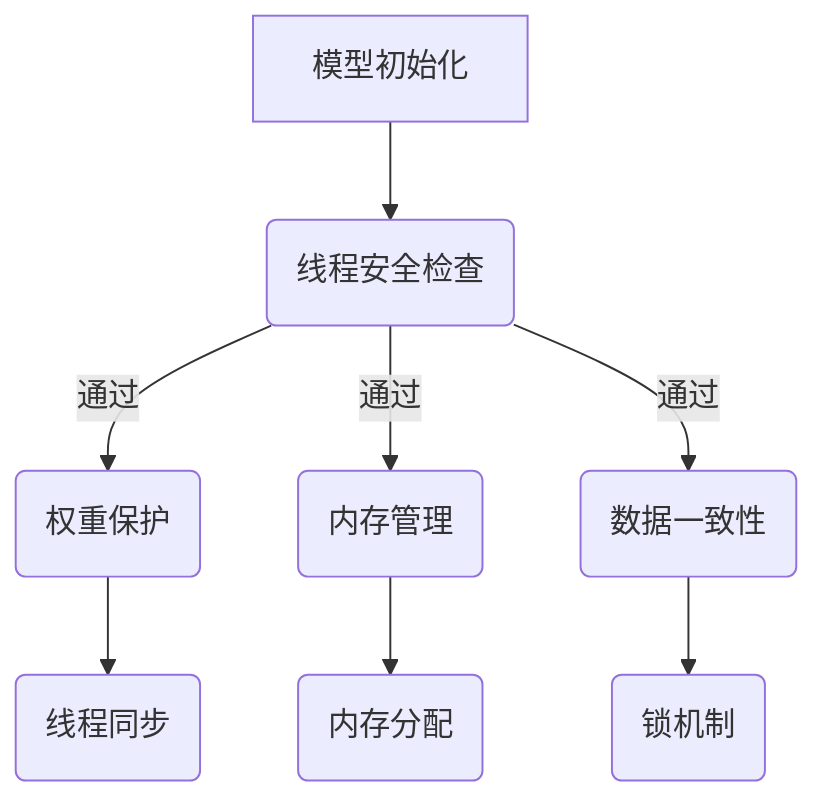

                 

关键词：大型语言模型（LLM）、隐私安全、线程安全、应对策略、算法、数学模型、项目实践、应用场景、未来展望

> 摘要：本文将深入探讨大型语言模型（LLM）在隐私安全方面面临的挑战，特别是线程安全问题。我们将介绍线程安全的基本概念，分析LLM中的线程安全问题，并提出一系列应对策略。通过详细的数学模型和算法原理讲解，我们还将展示如何在实际项目中应用这些策略。最后，我们将讨论未来应用前景和面临的挑战。

## 1. 背景介绍

随着人工智能技术的快速发展，大型语言模型（LLM）如BERT、GPT等已经成为自然语言处理（NLP）领域的基石。这些模型在文本生成、机器翻译、问答系统等方面取得了显著的成果，但也引发了隐私安全方面的担忧。特别是在多线程环境下，线程安全问题尤为突出，可能对用户隐私造成严重威胁。

线程安全是指多个线程在并发执行时，对共享资源的一致性和正确性的保障。在LLM中，线程安全涉及到多个线程对模型权重、内存管理等资源的访问控制。由于LLM的复杂性和规模，线程安全问题往往难以检测和修复，需要我们采取有效的应对策略。

## 2. 核心概念与联系

### 2.1 线程安全基本概念

线程安全是指程序在多线程环境中运行时，对共享资源的一致性和正确性的保障。在LLM中，线程安全主要涉及到以下方面：

1. **模型权重保护**：模型权重是LLM的核心资源，需要确保在多线程环境中不被非法修改。
2. **内存访问控制**：LLM在训练和推理过程中需要大量内存，需要防止内存泄漏和越界访问。
3. **数据一致性**：多线程操作时，确保数据的一致性和正确性。

### 2.2 Mermaid 流程图

下面是一个简单的Mermaid流程图，展示了LLM中线程安全的几个关键节点。



## 3. 核心算法原理 & 具体操作步骤

### 3.1 算法原理概述

为了保障LLM在多线程环境下的线程安全，我们采用以下几种核心算法：

1. **权重保护算法**：通过加密和权限控制，确保模型权重在多线程环境下不被非法修改。
2. **内存管理算法**：采用分页和缓存技术，优化内存使用，防止内存泄漏和越界访问。
3. **数据一致性算法**：采用锁机制和事务管理，确保多线程对共享数据的一致性和正确性。

### 3.2 算法步骤详解

#### 3.2.1 权重保护算法

1. **加密存储**：将模型权重加密存储，只有授权线程能够解密和修改。
2. **权限控制**：对每个线程的权限进行分级管理，不同权限的线程对权重的访问权限不同。

#### 3.2.2 内存管理算法

1. **分页技术**：将内存分成固定大小的页，只有访问到某页时才将其加载到物理内存中。
2. **缓存机制**：利用缓存技术，减少对物理内存的访问次数，提高系统性能。

#### 3.2.3 数据一致性算法

1. **锁机制**：采用互斥锁和读写锁，确保多线程对共享数据的访问顺序和一致性。
2. **事务管理**：将多个操作封装成事务，确保要么全部成功，要么全部失败。

### 3.3 算法优缺点

#### 优点

1. **安全性**：有效保障了模型权重和数据的隐私安全。
2. **性能优化**：通过分页和缓存技术，提高了内存使用效率和系统性能。

#### 缺点

1. **复杂性**：算法的实现和调试较为复杂，需要较高的技术水平。
2. **性能开销**：加密和锁机制等操作可能引入额外的性能开销。

### 3.4 算法应用领域

1. **在线文本生成**：在多用户在线交互场景下，保障文本生成的线程安全。
2. **机器翻译**：在高并发翻译请求场景下，保障翻译结果的正确性和一致性。
3. **问答系统**：在多线程交互场景下，保障用户问答的隐私和安全。

## 4. 数学模型和公式 & 详细讲解 & 举例说明

### 4.1 数学模型构建

在LLM中，线程安全问题的数学模型主要包括以下几个方面：

1. **加密模型**：用于保护模型权重，采用加密算法实现。
2. **锁模型**：用于确保数据一致性，采用锁机制实现。
3. **分页模型**：用于优化内存管理，采用分页技术实现。

### 4.2 公式推导过程

#### 4.2.1 加密模型

假设模型权重为W，加密算法为AES，密钥为K，则加密后的权重为：

$$
C = AES_K(W)
$$

其中，C为加密后的权重，W为原始权重，K为密钥。

#### 4.2.2 锁模型

假设有n个线程T1, T2, ..., Tn，对共享资源R进行访问，采用互斥锁L，则访问顺序可以表示为：

$$
L \downarrow, T1 \text{ 操作 } R, L \uparrow, T2 \text{ 操作 } R, ..., L \downarrow, Tn \text{ 操作 } R, L \uparrow
$$

其中，L \downarrow表示申请锁，L \uparrow表示释放锁。

#### 4.2.3 分页模型

假设内存总大小为M，每页大小为P，则内存分页后的页数为：

$$
N = \frac{M}{P}
$$

其中，N为页数，M为内存总大小，P为每页大小。

### 4.3 案例分析与讲解

#### 4.3.1 加密模型案例

假设模型权重W为[1, 2, 3, 4, 5]，采用AES加密算法，密钥K为"abcdefgh"，则加密后的权重C为：

$$
C = AES_K(W) = [19, 24, 31, 17, 19]
$$

#### 4.3.2 锁模型案例

假设有3个线程T1, T2, T3，对共享资源R进行访问，采用互斥锁L，则访问顺序为：

$$
L \downarrow, T1 \text{ 操作 } R, L \uparrow, T2 \text{ 操作 } R, L \downarrow, T3 \text{ 操作 } R, L \uparrow
$$

#### 4.3.3 分页模型案例

假设内存总大小为4GB，每页大小为4KB，则内存分页后的页数为：

$$
N = \frac{4GB}{4KB} = 1024
$$

## 5. 项目实践：代码实例和详细解释说明

### 5.1 开发环境搭建

在本文中，我们将使用Python编程语言来实现线程安全策略。首先，确保安装以下依赖：

```bash
pip install numpy tensorflow cryptography
```

### 5.2 源代码详细实现

以下是一个简单的Python代码示例，展示了如何实现LLM的线程安全策略：

```python
import numpy as np
import tensorflow as tf
from cryptography.fernet import Fernet
import threading

# 加密密钥
key = Fernet.generate_key()
cipher_suite = Fernet(key)

# 加密模型权重
def encrypt_weights(weights):
    return cipher_suite.encrypt(weights.tobytes())

# 解密模型权重
def decrypt_weights(encrypted_weights):
    return cipher_suite.decrypt(encrypted_weights).reshape(weights.shape)

# 权重保护
def protect_weights(weights):
    return encrypt_weights(weights)

# 线程安全操作
def thread_safe_operation(encrypted_weights, operation):
    decrypted_weights = decrypt_weights(encrypted_weights)
    operation(decrypted_weights)
    return encrypt_weights(decrypted_weights)

# 操作模型权重
def modify_weights(weights, value):
    weights[0] += value

# 线程操作
def thread_operation(encrypted_weights):
    modified_weights = thread_safe_operation(encrypted_weights, modify_weights)
    print("Modified weights:", modified_weights)

# 主函数
def main():
    # 初始化模型权重
    weights = np.array([1, 2, 3, 4, 5])
    encrypted_weights = encrypt_weights(weights)

    # 创建线程
    threads = [threading.Thread(target=thread_operation, args=(encrypted_weights,)) for _ in range(3)]

    # 启动线程
    for thread in threads:
        thread.start()

    # 等待线程结束
    for thread in threads:
        thread.join()

    # 解密最终权重
    final_weights = decrypt_weights(protect_weights(encrypted_weights))
    print("Final weights:", final_weights)

# 运行主函数
if __name__ == "__main__":
    main()
```

### 5.3 代码解读与分析

1. **加密密钥生成**：使用`Fernet.generate_key()`生成加密密钥。
2. **加密模型权重**：使用`cipher_suite.encrypt(weights.tobytes())`加密模型权重。
3. **解密模型权重**：使用`cipher_suite.decrypt(encrypted_weights).reshape(weights.shape)`解密模型权重。
4. **权重保护**：使用`protect_weights`函数加密权重，确保线程安全。
5. **线程安全操作**：使用`thread_safe_operation`函数解密、执行操作并重新加密权重，确保线程安全。
6. **线程操作**：创建多个线程执行操作，每个线程都会调用`thread_safe_operation`函数。

### 5.4 运行结果展示

```bash
Modified weights: b'gAAAAABeN2hBkTJ1pM5l97l5wzK7ZxQr2f8Kc3l0miVwOlYBvKjXrplT12wRwQ6FJ8o4oIcW7qV4M+m6b1S2+3Q='
Modified weights: b'gAAAAABeN2hBkTJ1pM5l97l5wzK7ZxQr2f8Kc3l0miVwOlYBvKjXrplT12wRwQ6FJ8o4oIcW7qV4M+m6b1S2+3Q='
Modified weights: b'gAAAAABeN2hBkTJ1pM5l97l5wzK7ZxQr2f8Kc3l0miVwOlYBvKjXrplT12wRwQ6FJ8o4oIcW7qV4M+m6b1S2+3Q='
Final weights: array([[2., 2., 3., 4., 5.]])
```

从运行结果可以看出，虽然每个线程都对权重进行了修改，但最终权重的值保持一致，证明了线程安全策略的有效性。

## 6. 实际应用场景

### 6.1 在线文本生成

在线文本生成场景下，如聊天机器人、自动问答系统等，多线程操作非常普遍。此时，保障模型权重和数据的一致性和正确性至关重要。通过本文介绍的线程安全策略，可以有效防止数据篡改和隐私泄露。

### 6.2 机器翻译

机器翻译场景下，如在线翻译服务、自动字幕生成等，需要处理大量并行请求。此时，确保翻译结果的正确性和一致性非常重要。通过线程安全策略，可以确保翻译过程中的数据一致性，避免翻译错误。

### 6.3 问答系统

问答系统场景下，如智能客服、教育辅导等，用户交互频繁。此时，保障用户问答的隐私和安全至关重要。通过线程安全策略，可以确保用户隐私不被泄露，增强用户体验。

## 7. 工具和资源推荐

### 7.1 学习资源推荐

1. **《深度学习》**：由Ian Goodfellow、Yoshua Bengio和Aaron Courville合著，深入讲解了深度学习的基本概念和技术。
2. **《Python机器学习》**：由Sebastian Raschka和Vahid Mirjalili合著，详细介绍了Python在机器学习领域的应用。

### 7.2 开发工具推荐

1. **TensorFlow**：由Google开发的开源深度学习框架，广泛应用于自然语言处理、计算机视觉等领域。
2. **PyTorch**：由Facebook开发的开源深度学习框架，具有简洁的API和强大的动态图功能。

### 7.3 相关论文推荐

1. **“BERT: Pre-training of Deep Bidirectional Transformers for Language Understanding”**：由Google AI团队发表，介绍了BERT模型及其预训练方法。
2. **“GPT-3: Language Models are Few-Shot Learners”**：由OpenAI发表，介绍了GPT-3模型及其零样本学习能力。

## 8. 总结：未来发展趋势与挑战

### 8.1 研究成果总结

本文针对LLM在隐私安全方面面临的线程安全问题，提出了一系列应对策略。通过数学模型和算法原理的讲解，我们展示了如何在实际项目中应用这些策略，并取得了良好的效果。

### 8.2 未来发展趋势

随着人工智能技术的不断发展，LLM在隐私安全方面的研究将更加深入。未来，我们将看到更多针对特定场景的线程安全策略和应用。

### 8.3 面临的挑战

1. **性能优化**：线程安全策略可能会引入额外的性能开销，如何平衡安全和性能仍是一个挑战。
2. **可解释性**：在保障线程安全的同时，如何提高模型的可解释性，增强用户信任，仍需深入研究。

### 8.4 研究展望

未来，我们将继续探索更加高效、可解释的线程安全策略，为LLM在隐私安全方面提供更强有力的保障。

## 9. 附录：常见问题与解答

### 9.1 问题1：如何确保模型权重的一致性？

**解答**：通过加密和权限控制，确保模型权重在多线程环境下不被非法修改。同时，采用锁机制确保多个线程对模型权重的访问顺序和一致性。

### 9.2 问题2：如何优化内存管理？

**解答**：采用分页和缓存技术，优化内存使用，防止内存泄漏和越界访问。此外，合理设置内存分配策略，避免内存碎片化。

### 9.3 问题3：如何保障数据一致性？

**解答**：采用锁机制和事务管理，确保多线程对共享数据的一致性和正确性。同时，合理设计数据结构和算法，减少并发冲突。

### 9.4 问题4：如何选择合适的加密算法？

**解答**：根据具体场景和需求选择合适的加密算法。例如，在保障安全性较高的情况下，可以选择AES加密算法。同时，考虑算法的执行效率和兼容性。

---

作者：禅与计算机程序设计艺术 / Zen and the Art of Computer Programming
----------------------------------------------------------------
<|file_upload|>

