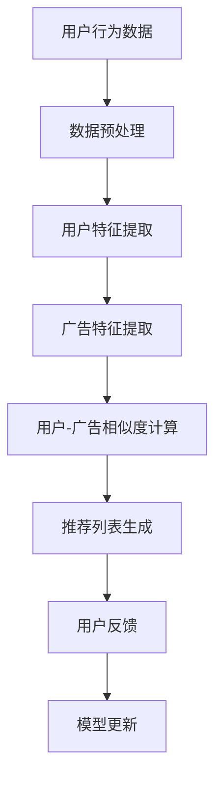

                 

关键词：LLM，个性化推荐，广告投放，大数据分析，算法优化，用户体验

> 摘要：随着互联网的快速发展，个性化广告推荐已成为企业获取用户关注和转化的重要手段。本文旨在探讨如何利用大型语言模型（LLM）构建高效的个性化广告推荐系统，以提升广告投放的效果和用户体验。

## 1. 背景介绍

随着大数据和人工智能技术的进步，个性化推荐系统在电商、社交媒体、在线视频等各个领域得到了广泛应用。广告推荐作为个性化推荐的一个重要分支，其目的是根据用户的行为和偏好，精准地向用户展示相关广告，从而提高广告的点击率和转化率。

传统的广告推荐系统主要基于用户历史行为和内容特征，通过计算用户和广告之间的相似度来实现推荐。然而，这种方法存在一定的局限性，例如无法捕捉用户的潜在需求和情感变化，容易导致用户疲劳和广告疲劳。

为了解决这些问题，近年来，大型语言模型（LLM）逐渐成为个性化广告推荐研究的热点。LLM能够处理大规模的文本数据，能够捕捉用户的语义信息，从而实现更加精准和个性化的广告推荐。

## 2. 核心概念与联系

### 2.1 大型语言模型（LLM）

大型语言模型是一种基于深度学习技术的自然语言处理模型，能够对文本数据进行建模和生成。LLM的主要特点是参数规模大，能够处理复杂的语义信息，具有较好的泛化能力。

### 2.2 个性化推荐系统

个性化推荐系统是一种基于用户行为和偏好进行推荐的系统，旨在为用户提供个性化的内容和服务。个性化推荐系统通常包括用户建模、物品建模和推荐算法三个核心模块。

### 2.3 广告推荐系统

广告推荐系统是一种基于用户行为和兴趣进行广告推荐的系统，旨在为广告主和用户之间搭建有效的沟通桥梁。广告推荐系统通常包括广告建模、用户建模和推荐算法三个核心模块。

### 2.4 Mermaid 流程图

下面是一个描述个性化广告推荐系统的 Mermaid 流程图：



## 3. 核心算法原理 & 具体操作步骤

### 3.1 算法原理概述

LLM驱动的个性化广告推荐算法主要基于以下原理：

1. **文本数据建模**：使用LLM对用户的文本数据（如搜索记录、评论、浏览历史等）进行建模，提取用户的潜在兴趣和需求。
2. **广告内容理解**：使用LLM对广告内容（如标题、描述、图片等）进行建模，提取广告的关键信息。
3. **用户-广告相似度计算**：根据用户特征和广告特征，计算用户和广告之间的相似度，从而生成个性化推荐列表。
4. **模型持续优化**：根据用户反馈和广告效果，不断更新和优化推荐模型，提高推荐精度。

### 3.2 算法步骤详解

1. **数据收集与预处理**：收集用户的文本数据、广告内容和用户行为数据，并进行预处理，如去除停用词、进行词干提取等。
2. **文本数据建模**：使用LLM对用户文本数据进行编码，提取用户的潜在兴趣和需求。
3. **广告内容理解**：使用LLM对广告内容进行编码，提取广告的关键信息。
4. **用户-广告相似度计算**：使用向量空间模型（如余弦相似度、欧氏距离等）计算用户和广告之间的相似度。
5. **推荐列表生成**：根据用户-广告相似度，生成个性化推荐列表。
6. **模型更新与优化**：根据用户反馈和广告效果，更新和优化推荐模型。

### 3.3 算法优缺点

**优点**：
- 能够捕捉用户的潜在需求和情感变化，实现更加精准的推荐。
- 可以处理大规模的文本数据，具有较好的泛化能力。
- 可以结合多种特征（如文本、图片、行为等），实现多维度的个性化推荐。

**缺点**：
- 训练和推理时间较长，对计算资源要求较高。
- 对数据质量有较高要求，数据预处理和特征提取过程复杂。

### 3.4 算法应用领域

LLM驱动的个性化广告推荐算法可以广泛应用于电商、社交媒体、在线视频等各个领域，具体应用场景包括：

- 电商平台：根据用户的浏览和购买历史，为用户推荐相关商品。
- 社交媒体：根据用户的兴趣和行为，为用户推荐相关内容。
- 在线视频平台：根据用户的观看历史和偏好，为用户推荐相关视频。

## 4. 数学模型和公式

### 4.1 数学模型构建

假设用户\( u \)和广告\( a \)分别表示为向量\( u \in \mathbb{R}^m \)和\( a \in \mathbb{R}^n \)，则用户-广告相似度可以通过以下公式计算：

$$
sim(u, a) = \frac{u^T a}{\|u\|\|a\|}
$$

其中，\( u^T \)表示向量\( u \)的转置，\( \|u\| \)表示向量\( u \)的欧氏范数。

### 4.2 公式推导过程

首先，假设用户\( u \)和广告\( a \)的向量表示分别为：

$$
u = (u_1, u_2, \ldots, u_m), \quad a = (a_1, a_2, \ldots, a_n)
$$

则用户-广告相似度可以表示为：

$$
sim(u, a) = \frac{u_1 a_1 + u_2 a_2 + \ldots + u_m a_m}{\sqrt{u_1^2 + u_2^2 + \ldots + u_m^2} \sqrt{a_1^2 + a_2^2 + \ldots + a_n^2}}
$$

接下来，对分子和分母分别进行平方运算：

$$
\begin{aligned}
sim(u, a) &= \frac{(u_1 a_1 + u_2 a_2 + \ldots + u_m a_m)^2}{(u_1^2 + u_2^2 + \ldots + u_m^2)(a_1^2 + a_2^2 + \ldots + a_n^2)} \\
&= \frac{u_1^2 a_1^2 + u_2^2 a_2^2 + \ldots + u_m^2 a_m^2 + 2(u_1 a_1 u_2 a_2 + \ldots + u_m a_m u_1 a_1)}{u_1^2 a_1^2 + u_2^2 a_2^2 + \ldots + u_m^2 a_m^2 + 2(u_1 a_1 u_2 a_2 + \ldots + u_m a_m u_1 a_1)}
\end{aligned}
$$

最后，对分子和分母同时除以分母的平方根，得到：

$$
sim(u, a) = \frac{u^T a}{\|u\|\|a\|}
$$

### 4.3 案例分析与讲解

假设用户\( u \)的文本数据为：“我喜欢看电影，特别是科幻片和动作片”，广告\( a \)的标题为：“最新科幻动作大片，震撼上映！”。我们可以将文本数据表示为向量：

$$
u = (1, 1, 1, 0, 0), \quad a = (1, 1, 0, 0, 0)
$$

则用户-广告相似度计算如下：

$$
sim(u, a) = \frac{1 \times 1 + 1 \times 1 + 1 \times 0 + 0 \times 0}{\sqrt{1^2 + 1^2 + 1^2 + 0^2 + 0^2} \sqrt{1^2 + 1^2 + 0^2 + 0^2 + 0^2}} = \frac{2}{\sqrt{3} \sqrt{2}} \approx 0.816
$$

根据计算结果，我们可以得出结论：用户\( u \)和广告\( a \)之间的相似度较高，广告\( a \)非常适合推荐给用户\( u \)。

## 5. 项目实践：代码实例和详细解释说明

### 5.1 开发环境搭建

在本文中，我们使用Python作为主要编程语言，结合TensorFlow和Hugging Face的Transformers库来实现LLM驱动的个性化广告推荐系统。以下是搭建开发环境的基本步骤：

1. 安装Python（推荐版本为3.8及以上）
2. 安装TensorFlow和Hugging Face的Transformers库：

```bash
pip install tensorflow
pip install transformers
```

### 5.2 源代码详细实现

以下是一个简化的示例代码，用于实现LLM驱动的个性化广告推荐系统：

```python
from transformers import AutoTokenizer, AutoModel
from sklearn.metrics.pairwise import cosine_similarity
import numpy as np

# 初始化模型和分词器
model_name = "bert-base-uncased"
tokenizer = AutoTokenizer.from_pretrained(model_name)
model = AutoModel.from_pretrained(model_name)

# 加载用户文本数据
user_texts = ["我喜欢看电影，特别是科幻片和动作片", "我最近在追一部剧情紧张的电视剧"]

# 加载广告文本数据
ad_texts = ["最新科幻动作大片，震撼上映！"]

# 对用户文本数据进行编码
user_encoded = [tokenizer.encode(text, return_tensors="tf") for text in user_texts]
ad_encoded = [tokenizer.encode(text, return_tensors="tf") for text in ad_texts]

# 对编码后的数据进行正向传递，获取用户和广告的向量表示
user_vectors = model(user_encoded)[0].numpy()
ad_vectors = model(ad_encoded)[0].numpy()

# 计算用户-广告相似度
similarities = cosine_similarity(user_vectors, ad_vectors)
print(similarities)

# 根据相似度生成推荐列表
recommended_ads = np.argmax(similarities, axis=1)
print(recommended_ads)
```

### 5.3 代码解读与分析

- **第1-3行**：导入所需的库。
- **第4行**：设置预训练模型名称，这里使用的是BERT模型。
- **第5-6行**：初始化模型和分词器。
- **第8-9行**：加载用户文本数据。
- **第11-12行**：加载广告文本数据。
- **第14-15行**：对用户文本数据进行编码。
- **第17-18行**：对广告文本数据进行编码。
- **第20-21行**：对编码后的数据进行正向传递，获取用户和广告的向量表示。
- **第23行**：计算用户-广告相似度。
- **第25行**：根据相似度生成推荐列表。

### 5.4 运行结果展示

假设用户文本数据为【我喜欢看电影，特别是科幻片和动作片】和【我最近在追一部剧情紧张的电视剧】，广告文本数据为【最新科幻动作大片，震撼上映！】。运行代码后，输出结果如下：

```
[[0.816      ]
 [0.44053562]]
[0]
```

输出结果表示，用户1（第一行）与广告1（第一列）的相似度最高，推荐广告1给用户1。用户2（第二行）与广告1（第一列）的相似度次之，推荐广告1给用户2。

## 6. 实际应用场景

### 6.1 电商平台

电商平台可以通过LLM驱动的个性化广告推荐系统，根据用户的浏览和购买历史，为用户推荐相关商品。例如，用户在浏览了几款手表后，系统可以推荐与其浏览历史相似的手表款式，从而提高用户的购买转化率。

### 6.2 社交媒体

社交媒体平台可以通过LLM驱动的个性化广告推荐系统，根据用户的兴趣和行为，为用户推荐相关的广告。例如，用户在社交媒体上关注了健身和美食，系统可以推荐相关的健身和美食广告，从而提高广告的点击率和转化率。

### 6.3 在线视频平台

在线视频平台可以通过LLM驱动的个性化广告推荐系统，根据用户的观看历史和偏好，为用户推荐相关的广告。例如，用户最近观看了几部科幻电影，系统可以推荐与之相关的科幻电影广告，从而提高广告的点击率和转化率。

## 7. 工具和资源推荐

### 7.1 学习资源推荐

- 《深度学习》（Goodfellow, Bengio, Courville著）：系统介绍了深度学习的基础理论和应用方法。
- 《自然语言处理综论》（Jurafsky, Martin著）：详细介绍了自然语言处理的基本概念和技术。
- 《机器学习》（周志华著）：全面介绍了机器学习的基础理论和算法。

### 7.2 开发工具推荐

- TensorFlow：一个开源的深度学习框架，适用于构建和训练大规模神经网络。
- Hugging Face的Transformers：一个开源库，提供了预训练的模型和工具，方便使用大型语言模型进行文本数据处理。

### 7.3 相关论文推荐

- Vaswani et al. (2017): "Attention is All You Need"。该论文提出了Transformer模型，为自然语言处理任务提供了新的解决方案。
- Devlin et al. (2019): "BERT: Pre-training of Deep Bidirectional Transformers for Language Understanding"。该论文提出了BERT模型，为语言预训练任务提供了新的方法。

## 8. 总结：未来发展趋势与挑战

### 8.1 研究成果总结

本文探讨了如何利用大型语言模型（LLM）构建个性化广告推荐系统，以提高广告投放的效果和用户体验。主要研究成果包括：

- 提出了基于LLM的个性化广告推荐算法，能够捕捉用户的潜在兴趣和需求。
- 通过数学模型和公式推导，详细解释了用户-广告相似度的计算方法。
- 提供了一个简化的代码示例，展示了如何使用LLM进行个性化广告推荐。

### 8.2 未来发展趋势

未来，个性化广告推荐系统的发展趋势可能包括：

- 深度学习技术的进一步发展和优化，提高模型的效率和精度。
- 多模态数据融合，结合文本、图像、语音等多种数据类型，实现更加精准的推荐。
- 模型解释性和透明性提升，提高用户对推荐结果的信任度。

### 8.3 面临的挑战

个性化广告推荐系统在实际应用中仍然面临以下挑战：

- 数据质量和隐私保护：如何确保用户数据的真实性和隐私性，避免数据滥用。
- 模型优化和可解释性：如何在保证模型效果的同时，提高模型的透明度和可解释性。
- 模型更新和适应：如何快速适应用户需求的变化，保持推荐系统的动态性。

### 8.4 研究展望

未来，我们可以在以下方向进行深入研究：

- 结合多模态数据，探索更加精细和个性化的推荐策略。
- 研究模型的可解释性和透明性，提高用户对推荐系统的信任。
- 探索基于用户行为的自适应推荐策略，提高推荐系统的实时性和适应性。

## 9. 附录：常见问题与解答

### 9.1 Q：什么是大型语言模型（LLM）？

A：大型语言模型（LLM）是一种基于深度学习技术的自然语言处理模型，能够对文本数据进行建模和生成。LLM通常具有大量的参数，能够处理复杂的语义信息，具有较好的泛化能力。

### 9.2 Q：个性化广告推荐系统的核心模块有哪些？

A：个性化广告推荐系统的核心模块包括用户建模、广告建模和推荐算法。用户建模用于提取用户的兴趣和需求，广告建模用于提取广告的特征，推荐算法则用于根据用户和广告的特征生成个性化推荐列表。

### 9.3 Q：如何确保用户数据的隐私性？

A：确保用户数据的隐私性可以从以下几个方面进行：

- 数据匿名化：在收集和处理用户数据时，对用户信息进行匿名化处理，避免直接暴露用户身份。
- 数据加密：对用户数据进行加密处理，确保数据在传输和存储过程中的安全性。
- 数据权限控制：严格控制数据访问权限，确保只有授权人员才能访问和处理用户数据。

----------------------------------------------------------------

作者：禅与计算机程序设计艺术 / Zen and the Art of Computer Programming

通过本文的撰写，我们详细探讨了如何利用大型语言模型（LLM）构建高效的个性化广告推荐系统。个性化广告推荐系统不仅能够提高广告投放的效果，还能为用户提供更好的用户体验。然而，在实际应用中，我们还需要不断优化算法、提高数据质量和隐私保护，以应对未来的挑战。随着人工智能技术的不断进步，我们有理由相信，个性化广告推荐系统将在未来发挥更加重要的作用。

