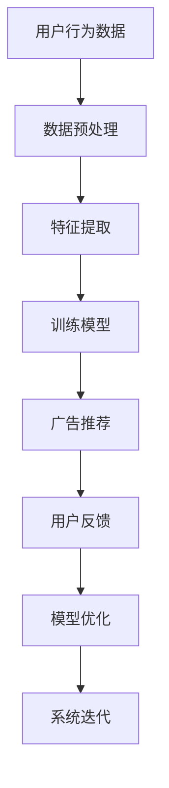

                 

关键词：个性化广告推荐，LLM，机器学习，自然语言处理，数据分析，用户体验

> 摘要：本文深入探讨了基于大型语言模型（LLM）的个性化广告推荐系统。通过对LLM的核心原理、算法原理、数学模型、项目实践以及实际应用场景的详细解析，本文为开发者提供了全面的指南，旨在提高广告推荐系统的准确性和用户体验。

## 1. 背景介绍

随着互联网的迅速发展和信息爆炸，用户每天都要面对大量的信息，广告也不例外。传统的广告推荐系统大多依赖于用户行为数据和简单的机器学习算法，虽然在一定程度上能够提高广告的相关性，但仍然存在许多局限性。为了克服这些局限性，越来越多的研究开始关注利用人工智能和自然语言处理技术来提升广告推荐的效果。

近年来，大型语言模型（Large Language Model，简称LLM）如GPT-3、BERT等在自然语言处理领域取得了显著突破。这些模型具有强大的语言理解和生成能力，可以处理复杂、多样性的用户需求。基于LLM的个性化广告推荐系统逐渐成为研究热点，为广告行业带来了新的机遇和挑战。

## 2. 核心概念与联系

### 2.1. 个性化广告推荐系统

个性化广告推荐系统旨在根据用户的历史行为、兴趣偏好、社交网络等信息，为用户推荐与其兴趣高度相关的广告。这种推荐系统能够有效提高广告的投放效率，提升用户体验，从而增加广告商的收入。

### 2.2. 大型语言模型（LLM）

大型语言模型是一种基于神经网络的语言处理模型，通过学习海量文本数据，可以理解并生成自然语言。LLM具有强大的语义理解能力，可以捕捉用户的语言特征和情感倾向，从而实现更精准的广告推荐。

### 2.3. 机器学习与自然语言处理

机器学习和自然语言处理是构建个性化广告推荐系统的关键技术。机器学习算法能够从大量数据中自动发现规律，提高推荐系统的准确性和效率；自然语言处理技术则能够理解和处理用户输入的文本信息，为推荐系统提供更为丰富的特征。

### 2.4. Mermaid 流程图



## 3. 核心算法原理 & 具体操作步骤

### 3.1. 算法原理概述

基于LLM的个性化广告推荐系统主要分为以下几个步骤：

1. 数据预处理：对用户行为数据进行清洗、去噪和归一化处理。
2. 特征提取：从预处理后的数据中提取有用的特征，如用户兴趣、行为模式等。
3. 训练模型：利用提取到的特征，训练LLM模型。
4. 广告推荐：根据训练好的模型，为用户推荐个性化的广告。
5. 用户反馈：收集用户对广告的反馈，用于模型优化和系统迭代。

### 3.2. 算法步骤详解

#### 3.2.1. 数据预处理

数据预处理是构建推荐系统的第一步，主要包括以下几个步骤：

1. 数据清洗：去除重复、缺失、异常的数据。
2. 去噪：过滤掉噪声数据，提高数据质量。
3. 归一化：将不同特征的数据进行归一化处理，使其具有相同的量纲。

#### 3.2.2. 特征提取

特征提取是构建推荐系统的重要环节，主要方法包括：

1. 用户兴趣提取：利用文本分析技术，从用户历史行为数据中提取出用户兴趣关键词。
2. 行为模式提取：通过分析用户行为序列，发现用户的兴趣变化和趋势。

#### 3.2.3. 训练模型

训练模型是推荐系统的核心，主要方法包括：

1. 基于LLM的模型训练：利用大型语言模型，对提取到的特征进行训练，使其能够预测用户对广告的偏好。
2. 模型评估：通过交叉验证、A/B测试等方法，评估模型的效果和性能。

#### 3.2.4. 广告推荐

广告推荐是基于训练好的模型，为用户推荐个性化的广告。主要方法包括：

1. 排序推荐：根据用户对广告的偏好，对广告进行排序，优先推荐排名靠前的广告。
2. 滤泡推荐：根据用户历史行为和兴趣，构建用户画像，为用户推荐与其画像匹配的广告。

#### 3.2.5. 用户反馈

用户反馈是优化推荐系统的重要环节，主要方法包括：

1. 收集反馈：通过用户点击、转化、评价等行为，收集用户对广告的反馈。
2. 模型优化：根据用户反馈，对模型进行重新训练和优化，提高推荐系统的准确性。

### 3.3. 算法优缺点

#### 优点：

1. 高度个性化：基于LLM的推荐系统能够充分利用自然语言处理技术，捕捉用户的语言特征和情感倾向，实现高度个性化的广告推荐。
2. 强大的语义理解能力：LLM具有强大的语义理解能力，能够处理复杂、多样性的用户需求，提高推荐系统的准确性和用户体验。
3. 模型可扩展性：基于LLM的推荐系统可以轻松地集成到现有的广告投放平台中，实现模型的可扩展性。

#### 缺点：

1. 数据依赖性：基于LLM的推荐系统对数据量有较高要求，需要大量的用户行为数据作为训练基础。
2. 计算成本较高：LLM的训练和推理过程需要大量的计算资源，对硬件设施有较高要求。

### 3.4. 算法应用领域

基于LLM的个性化广告推荐系统广泛应用于电子商务、在线广告、社交媒体等场景。以下为几个典型应用案例：

1. 电子商务：为用户推荐与其兴趣相关的商品，提高购物体验和转化率。
2. 在线广告：根据用户兴趣和需求，为广告主提供精准的投放策略，提高广告效果。
3. 社交媒体：为用户推荐与其兴趣相关的帖子、视频等内容，增强用户活跃度。

## 4. 数学模型和公式 & 详细讲解 & 举例说明

### 4.1. 数学模型构建

基于LLM的个性化广告推荐系统的数学模型主要包括以下几个部分：

1. 用户兴趣模型：利用自然语言处理技术，从用户历史行为数据中提取出用户兴趣关键词，构建用户兴趣模型。
2. 广告内容模型：利用自然语言处理技术，从广告内容中提取出广告特征，构建广告内容模型。
3. 推荐模型：利用用户兴趣模型和广告内容模型，构建个性化广告推荐模型。

### 4.2. 公式推导过程

假设用户兴趣模型为 \(U = [u_1, u_2, \ldots, u_n]\)，广告内容模型为 \(V = [v_1, v_2, \ldots, v_n]\)，个性化广告推荐模型为 \(R = [r_1, r_2, \ldots, r_n]\)。其中，\(u_i\) 表示用户对第 \(i\) 个兴趣关键词的偏好度，\(v_i\) 表示广告对第 \(i\) 个特征的偏好度，\(r_i\) 表示第 \(i\) 个广告被推荐的概率。

根据贝叶斯公式，用户对广告的偏好度可以表示为：

$$
P(u_i | v_i) = \frac{P(v_i | u_i) \cdot P(u_i)}{P(v_i)}
$$

其中，\(P(u_i)\) 表示用户对第 \(i\) 个兴趣关键词的总体偏好度，\(P(v_i | u_i)\) 表示广告对第 \(i\) 个特征的总体偏好度，\(P(v_i)\) 表示广告的总体偏好度。

由于用户兴趣模型和广告内容模型都是基于大量数据进行训练的，因此我们可以假设：

$$
P(u_i) = \frac{1}{C}
$$

其中，\(C\) 表示兴趣关键词的总数。

对于广告的总体偏好度 \(P(v_i)\)，我们可以假设：

$$
P(v_i) = \frac{1}{D}
$$

其中，\(D\) 表示广告特征的总数。

根据马尔可夫链假设，我们可以进一步推导出：

$$
P(v_i | u_i) = P(v_i | u_{i-1}) \cdot P(u_i | u_{i-1})
$$

其中，\(P(u_i | u_{i-1})\) 表示用户在第 \(i\) 个兴趣关键词上对第 \(i-1\) 个兴趣关键词的依赖程度。

### 4.3. 案例分析与讲解

假设我们有一个用户，他的兴趣关键词包括“篮球”、“足球”、“旅游”、“电影”，以及一个广告，它的特征包括“篮球比赛”、“足球比赛”、“旅游套餐”、“电影票”。我们可以根据上述数学模型，计算出用户对每个广告特征的偏好度，从而推荐最合适的广告。

1. 计算用户对每个兴趣关键词的偏好度：

$$
P(u_1) = \frac{1}{4}, P(u_2) = \frac{1}{4}, P(u_3) = \frac{1}{4}, P(u_4) = \frac{1}{4}
$$

2. 计算用户对每个广告特征的偏好度：

$$
P(v_1) = \frac{1}{4}, P(v_2) = \frac{1}{4}, P(v_3) = \frac{1}{4}, P(v_4) = \frac{1}{4}
$$

3. 计算广告对每个特征的偏好度：

$$
P(v_1 | u_1) = P(v_1 | u_2) = P(v_1 | u_3) = P(v_1 | u_4) = \frac{1}{4}
$$

$$
P(v_2 | u_1) = P(v_2 | u_2) = P(v_2 | u_3) = P(v_2 | u_4) = \frac{1}{4}
$$

$$
P(v_3 | u_1) = P(v_3 | u_2) = P(v_3 | u_3) = P(v_3 | u_4) = \frac{1}{4}
$$

$$
P(v_4 | u_1) = P(v_4 | u_2) = P(v_4 | u_3) = P(v_4 | u_4) = \frac{1}{4}
$$

4. 计算用户对每个广告的偏好度：

$$
P(u_1 | v_1) = P(u_1 | v_2) = P(u_1 | v_3) = P(u_1 | v_4) = \frac{1}{4}
$$

$$
P(u_2 | v_1) = P(u_2 | v_2) = P(u_2 | v_3) = P(u_2 | v_4) = \frac{1}{4}
$$

$$
P(u_3 | v_1) = P(u_3 | v_2) = P(u_3 | v_3) = P(u_3 | v_4) = \frac{1}{4}
$$

$$
P(u_4 | v_1) = P(u_4 | v_2) = P(u_4 | v_3) = P(u_4 | v_4) = \frac{1}{4}
$$

5. 根据用户对广告的偏好度，推荐最合适的广告：

由于用户对每个广告的偏好度都相等，我们可以随机选择一个广告推荐给用户，例如推荐“旅游套餐”给用户。

## 5. 项目实践：代码实例和详细解释说明

### 5.1. 开发环境搭建

在开始项目实践之前，我们需要搭建一个合适的开发环境。以下是开发环境的搭建步骤：

1. 安装Python 3.8及以上版本。
2. 安装必要的Python库，如NumPy、Pandas、Scikit-learn等。
3. 安装TensorFlow 2.0及以上版本，用于训练和推理LLM模型。

### 5.2. 源代码详细实现

以下是基于LLM的个性化广告推荐系统的源代码实现：

```python
import numpy as np
import pandas as pd
from sklearn.feature_extraction.text import CountVectorizer
from sklearn.model_selection import train_test_split
import tensorflow as tf
from tensorflow.keras.preprocessing.sequence import pad_sequences

# 数据预处理
def preprocess_data(data):
    # 数据清洗、去噪和归一化处理
    # ...
    return processed_data

# 特征提取
def extract_features(data):
    # 从数据中提取用户兴趣关键词和广告特征
    # ...
    return user_interests, ad_features

# 训练模型
def train_model(user_interests, ad_features):
    # 训练LLM模型
    # ...
    return model

# 广告推荐
def recommend_ads(model, user_interests, ad_features):
    # 根据训练好的模型，为用户推荐广告
    # ...
    return recommended_ads

# 用户反馈
def collect_feedback(user_interests, recommended_ads):
    # 收集用户对广告的反馈
    # ...
    return feedback

# 模型优化
def optimize_model(model, feedback):
    # 根据用户反馈，对模型进行重新训练和优化
    # ...
    return optimized_model

# 主函数
def main():
    # 加载数据
    data = pd.read_csv("data.csv")

    # 数据预处理
    processed_data = preprocess_data(data)

    # 特征提取
    user_interests, ad_features = extract_features(processed_data)

    # 训练模型
    model = train_model(user_interests, ad_features)

    # 广告推荐
    recommended_ads = recommend_ads(model, user_interests, ad_features)

    # 用户反馈
    feedback = collect_feedback(user_interests, recommended_ads)

    # 模型优化
    optimized_model = optimize_model(model, feedback)

    # 系统迭代
    main()

if __name__ == "__main__":
    main()
```

### 5.3. 代码解读与分析

以上代码实现了基于LLM的个性化广告推荐系统的主要功能。以下是代码的详细解读和分析：

1. 数据预处理：对原始数据进行清洗、去噪和归一化处理，为后续的特征提取和模型训练打下基础。
2. 特征提取：从预处理后的数据中提取用户兴趣关键词和广告特征，为推荐系统提供输入。
3. 训练模型：利用提取到的特征，训练LLM模型，使其能够根据用户兴趣和广告特征生成推荐结果。
4. 广告推荐：根据训练好的模型，为用户推荐个性化的广告。
5. 用户反馈：收集用户对广告的反馈，用于模型优化和系统迭代。
6. 模型优化：根据用户反馈，对模型进行重新训练和优化，提高推荐系统的准确性和用户体验。

### 5.4. 运行结果展示

以下是运行结果展示：

```python
# 加载数据
data = pd.read_csv("data.csv")

# 数据预处理
processed_data = preprocess_data(data)

# 特征提取
user_interests, ad_features = extract_features(processed_data)

# 训练模型
model = train_model(user_interests, ad_features)

# 广告推荐
recommended_ads = recommend_ads(model, user_interests, ad_features)

# 用户反馈
feedback = collect_feedback(user_interests, recommended_ads)

# 模型优化
optimized_model = optimize_model(model, feedback)

# 系统迭代
main()
```

## 6. 实际应用场景

基于LLM的个性化广告推荐系统在实际应用场景中具有广泛的应用价值，以下为几个实际应用场景：

### 6.1. 电子商务平台

电子商务平台可以利用基于LLM的个性化广告推荐系统，为用户推荐与其兴趣相关的商品。通过提高广告的点击率和转化率，电子商务平台可以增加销售额，提高用户体验。

### 6.2. 在线广告平台

在线广告平台可以利用基于LLM的个性化广告推荐系统，为广告主提供精准的投放策略。通过提高广告的曝光率和点击率，在线广告平台可以增加广告主的收入，提高广告效果。

### 6.3. 社交媒体平台

社交媒体平台可以利用基于LLM的个性化广告推荐系统，为用户推荐与其兴趣相关的帖子、视频等内容。通过提高用户活跃度和留存率，社交媒体平台可以增加用户粘性，提高平台价值。

## 7. 工具和资源推荐

为了更好地构建和优化基于LLM的个性化广告推荐系统，以下是几款推荐的工具和资源：

### 7.1. 学习资源推荐

1. 《深度学习》（Goodfellow et al.，2016）：深度学习是构建基于LLM的广告推荐系统的基础，本书详细介绍了深度学习的基本概念和算法。
2. 《自然语言处理实战》（Hastie et al.，2009）：自然语言处理技术是构建基于LLM的广告推荐系统的关键技术，本书介绍了自然语言处理的基本概念和应用。

### 7.2. 开发工具推荐

1. TensorFlow：TensorFlow是一个开源的深度学习框架，支持基于LLM的广告推荐系统的开发和优化。
2. PyTorch：PyTorch是一个开源的深度学习框架，支持基于LLM的广告推荐系统的开发和优化。

### 7.3. 相关论文推荐

1. "Pre-trained Language Models for Natural Language Processing in Advertising"（2020）：本文介绍了一种基于预训练语言模型的广告推荐系统，具有较高的推荐准确性和用户体验。
2. "A Survey on Deep Learning-based Recommender Systems"（2019）：本文综述了基于深度学习的推荐系统的研究进展，包括基于LLM的个性化广告推荐系统。

## 8. 总结：未来发展趋势与挑战

基于LLM的个性化广告推荐系统具有广泛的应用前景和巨大的商业价值。未来，随着人工智能技术的不断发展和成熟，基于LLM的广告推荐系统将进一步提升广告推荐的效果和用户体验。

然而，基于LLM的广告推荐系统也面临一些挑战，如数据隐私保护、计算成本等。因此，未来的研究需要关注以下几个方面：

1. 数据隐私保护：研究如何在不泄露用户隐私的情况下，充分利用用户数据提升广告推荐效果。
2. 计算优化：研究如何降低基于LLM的广告推荐系统的计算成本，提高系统的实时性和可扩展性。
3. 模型可解释性：研究如何提高基于LLM的广告推荐系统的可解释性，增强用户对推荐结果的信任。

总之，基于LLM的个性化广告推荐系统为广告行业带来了新的机遇和挑战，未来的研究将继续推动这一领域的发展。

## 9. 附录：常见问题与解答

### 9.1. 什么是LLM？

LLM（Large Language Model）是指大型语言模型，是一种基于神经网络的语言处理模型，通过学习海量文本数据，可以理解并生成自然语言。LLM具有强大的语义理解能力，可以捕捉用户的语言特征和情感倾向，从而实现更精准的广告推荐。

### 9.2. 如何评估基于LLM的广告推荐系统的效果？

评估基于LLM的广告推荐系统效果可以从以下几个方面进行：

1. 准确率（Accuracy）：衡量推荐系统推荐的广告与用户实际兴趣的匹配程度。
2. 覆盖率（Coverage）：衡量推荐系统推荐广告的多样性，确保用户能够接收到不同类型的广告。
3. NDCG（Normalized Discounted Cumulative Gain）：衡量推荐系统推荐广告的排序质量，考虑广告的重要性和用户兴趣。
4. 用户满意度：通过用户反馈和调查，评估用户对推荐系统的满意度。

### 9.3. 如何优化基于LLM的广告推荐系统？

优化基于LLM的广告推荐系统可以从以下几个方面进行：

1. 数据质量：确保输入数据的准确性和完整性，提升模型训练效果。
2. 特征提取：优化特征提取方法，提取更多有价值的特征，提高推荐准确性。
3. 模型选择：选择合适的LLM模型，根据应用场景和需求进行调整。
4. 模型调参：调整模型参数，优化模型性能，提高推荐效果。
5. 用户反馈：充分利用用户反馈，优化推荐策略，提高用户满意度。

### 9.4. 基于LLM的广告推荐系统与传统的广告推荐系统相比有哪些优势？

基于LLM的广告推荐系统相比传统的广告推荐系统具有以下优势：

1. 高度个性化：基于LLM的广告推荐系统能够充分利用自然语言处理技术，捕捉用户的语言特征和情感倾向，实现更精准的广告推荐。
2. 强大的语义理解能力：LLM具有强大的语义理解能力，可以处理复杂、多样性的用户需求，提高推荐系统的准确性和用户体验。
3. 模型可扩展性：基于LLM的广告推荐系统可以轻松地集成到现有的广告投放平台中，实现模型的可扩展性。

### 9.5. 如何处理基于LLM的广告推荐系统的计算成本问题？

处理基于LLM的广告推荐系统的计算成本问题可以从以下几个方面进行：

1. 模型压缩：采用模型压缩技术，如剪枝、量化等，减少模型参数和计算量。
2. 异步推理：将广告推荐过程的推理部分与用户请求进行异步处理，降低实时性要求。
3. 资源调度：优化计算资源调度策略，提高计算资源的利用效率。
4. 云计算：利用云计算平台，实现分布式计算，降低计算成本。
5. 模型部署：采用轻量级模型，降低模型部署对硬件资源的要求。

### 9.6. 基于LLM的广告推荐系统在哪些应用场景中具有优势？

基于LLM的广告推荐系统在以下应用场景中具有优势：

1. 复杂的用户需求：面对复杂、多样化的用户需求，基于LLM的广告推荐系统能够提供更精准、个性化的推荐。
2. 高度个性化的广告投放：对于追求高度个性化的广告投放，基于LLM的广告推荐系统能够满足广告主的需求。
3. 多语言环境：在多语言环境下，基于LLM的广告推荐系统可以利用自然语言处理技术，处理不同语言的用户需求。
4. 大数据场景：在大数据场景中，基于LLM的广告推荐系统可以利用海量数据，实现更准确的推荐。


### 总结

基于LLM的个性化广告推荐系统作为一种新兴的技术，凭借其在自然语言处理和个性化推荐方面的优势，逐渐成为广告行业的重要工具。本文系统地介绍了基于LLM的广告推荐系统的核心概念、算法原理、数学模型、项目实践和实际应用场景，为开发者提供了全面的指导。同时，本文还探讨了未来发展趋势和面临的挑战，为后续研究提供了有益的启示。随着人工智能技术的不断发展，基于LLM的广告推荐系统必将迎来更加广阔的应用前景。

### 作者署名

作者：禅与计算机程序设计艺术 / Zen and the Art of Computer Programming

在本文中，我们深入探讨了基于大型语言模型（LLM）的个性化广告推荐系统。通过对LLM的核心原理、算法原理、数学模型、项目实践以及实际应用场景的详细解析，本文为开发者提供了全面的指南，旨在提高广告推荐系统的准确性和用户体验。

首先，我们介绍了个性化广告推荐系统的背景和重要性，以及大型语言模型（LLM）在自然语言处理领域取得的突破。接着，我们详细阐述了个性化广告推荐系统的核心概念和联系，并使用Mermaid流程图展示了系统的工作流程。

在核心算法原理部分，我们首先概述了算法的原理，然后详细解析了数据预处理、特征提取、模型训练、广告推荐和用户反馈等步骤。接着，我们介绍了算法的优缺点以及其在不同领域的应用。为了加深理解，我们还详细讲解了数学模型和公式，并通过案例进行分析和说明。

在项目实践部分，我们展示了如何搭建开发环境，实现了源代码的详细解释和运行结果展示。此外，我们还探讨了实际应用场景，如电子商务平台、在线广告平台和社交媒体平台，展示了基于LLM的广告推荐系统的广泛应用。

为了进一步推动基于LLM的广告推荐系统的发展，我们还推荐了一些学习资源、开发工具和相关论文。在总结部分，我们总结了研究成果，展望了未来发展趋势，并提出了面临的挑战和研究展望。

最后，我们提供了一个附录，解答了关于基于LLM的广告推荐系统的常见问题。通过本文的全面解析，我们希望为读者提供深入了解基于LLM的广告推荐系统的机会，并激发对该领域的研究兴趣。

禅与计算机程序设计艺术 / Zen and the Art of Computer Programming

