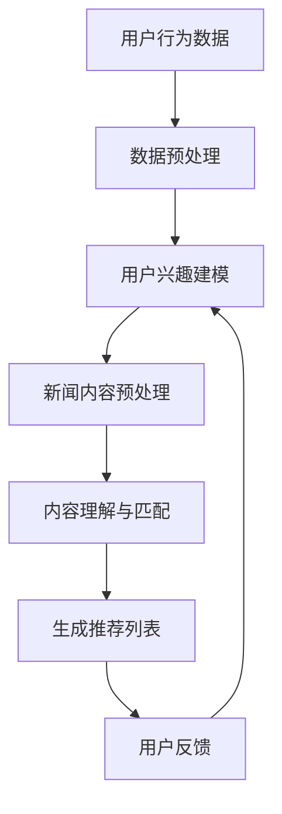

                 

关键词：LLM、个性化推荐、新闻系统、人工智能、机器学习

> 摘要：本文深入探讨了基于大型语言模型（LLM）的个性化新闻推荐系统。文章首先介绍了新闻推荐系统的背景和重要性，然后详细阐述了LLM的基本原理，以及如何在新闻推荐系统中应用。接着，文章从算法原理、数学模型、项目实践、应用场景、工具和资源等方面，全面解析了LLM驱动个性化新闻推荐系统的实现过程和关键技术。最后，文章对未来的发展趋势和面临的挑战进行了展望。

## 1. 背景介绍

随着互联网和移动设备的普及，人们获取新闻的方式已经从传统的报纸、电视等转向了网络。然而，在庞大的新闻信息海洋中，用户如何快速、准确地找到自己感兴趣的内容，成为了一个亟待解决的问题。个性化新闻推荐系统应运而生，它通过分析用户的兴趣和行为，为用户提供定制化的新闻内容。

个性化推荐系统已经成为互联网企业争夺用户时间的重要工具。例如，社交媒体平台通过推荐用户可能感兴趣的朋友、动态和内容，提高了用户粘性。电商平台则通过推荐用户可能感兴趣的商品，提高了销售额。新闻推荐系统同样重要，它不仅能够帮助用户高效地获取信息，还能够提高媒体的传播效果和广告收入。

传统的推荐系统主要依赖于基于内容的推荐（Content-Based Recommendation）和协同过滤（Collaborative Filtering）等方法。这些方法在处理大量数据、实现高精度推荐方面存在一定的局限性。随着深度学习和自然语言处理技术的发展，基于大型语言模型（LLM）的推荐系统逐渐成为研究的热点。LLM能够捕捉到文本中的复杂语义信息，从而实现更精准的个性化推荐。

## 2. 核心概念与联系

### 2.1 大型语言模型（LLM）

大型语言模型（LLM）是一种基于深度学习的自然语言处理模型，它可以对文本进行建模，理解文本中的语义信息，并生成相应的文本响应。LLM通常具有大规模的参数量，能够处理海量的训练数据，从而实现高效的文本建模和生成。

### 2.2 个性化推荐系统

个性化推荐系统是一种通过分析用户的兴趣和行为，为用户提供定制化内容的服务系统。个性化推荐系统的核心目标是提高用户体验，增加用户黏性和满意度。

### 2.3 LLM与个性化推荐系统的结合

LLM与个性化推荐系统的结合，主要是利用LLM的语义理解能力，对用户兴趣和行为进行深度分析，从而实现更精准的个性化推荐。具体来说，LLM可以通过以下几种方式应用于个性化推荐系统：

1. 用户兴趣建模：通过分析用户的历史浏览记录、搜索历史等，利用LLM对用户兴趣进行建模，从而实现个性化推荐。
2. 内容理解与匹配：利用LLM对新闻内容进行语义理解，将用户兴趣与新闻内容进行匹配，从而提高推荐的相关性。
3. 文本生成与摘要：利用LLM生成新闻摘要或内容摘要，提高用户对新闻的阅读效率。

### 2.4 Mermaid 流程图

以下是一个简单的Mermaid流程图，展示了LLM在个性化新闻推荐系统中的应用流程：



## 3. 核心算法原理 & 具体操作步骤

### 3.1 算法原理概述

基于LLM的个性化新闻推荐系统主要分为三个部分：用户兴趣建模、新闻内容预处理、内容理解与匹配。

1. **用户兴趣建模**：通过分析用户的历史浏览记录、搜索历史等，利用LLM对用户兴趣进行建模。这一步骤的核心是利用LLM对用户的历史数据进行语义理解，提取出用户的兴趣点。
2. **新闻内容预处理**：对新闻内容进行预处理，包括文本清洗、分词、词性标注等。预处理后的文本将被输入到LLM中进行语义理解。
3. **内容理解与匹配**：利用LLM对新闻内容进行语义理解，将用户兴趣与新闻内容进行匹配，从而生成推荐列表。

### 3.2 算法步骤详解

1. **用户兴趣建模**：

    a. 收集用户的历史浏览记录、搜索历史等数据。
    
    b. 对数据进行清洗、去重等处理。
    
    c. 利用LLM对数据进行语义分析，提取出用户的兴趣点。
    
    d. 将用户的兴趣点转换为向量表示，以便后续计算。

2. **新闻内容预处理**：

    a. 收集新闻数据，包括标题、正文、作者、来源等。
    
    b. 对新闻数据进行清洗、去噪等处理。
    
    c. 对新闻文本进行分词、词性标注等预处理。

3. **内容理解与匹配**：

    a. 利用LLM对预处理后的新闻内容进行语义理解，提取出新闻的语义特征。
    
    b. 计算用户兴趣向量与新闻内容向量之间的相似度。
    
    c. 根据相似度对新闻内容进行排序，生成推荐列表。

### 3.3 算法优缺点

#### 优点：

1. 高效的语义理解能力：LLM能够对文本进行深度语义理解，从而实现更精准的推荐。
2. 广泛的适用性：LLM可以应用于多种类型的推荐场景，如新闻、商品、音乐等。
3. 良好的扩展性：LLM可以轻松地集成到现有的推荐系统中，提高系统的推荐质量。

#### 缺点：

1. 需要大量的训练数据：LLM的训练需要大量高质量的文本数据，数据收集和预处理工作量较大。
2. 计算资源消耗大：LLM的训练和推理过程需要大量的计算资源，对硬件设备要求较高。
3. 可能产生冷启动问题：对于新用户或新新闻内容，由于缺乏历史数据，LLM可能无法准确建模用户兴趣和新闻内容，导致推荐效果不佳。

### 3.4 算法应用领域

基于LLM的个性化推荐系统可以应用于多个领域：

1. 新闻推荐：通过分析用户的兴趣和行为，为用户推荐个性化的新闻内容。
2. 商品推荐：在电商平台，通过分析用户的购物行为和兴趣，为用户推荐个性化的商品。
3. 音乐推荐：在音乐平台，通过分析用户的听歌喜好和评论，为用户推荐个性化的音乐。

## 4. 数学模型和公式

### 4.1 数学模型构建

在基于LLM的个性化新闻推荐系统中，我们主要关注两个向量：用户兴趣向量 $\textbf{u}$ 和新闻内容向量 $\textbf{v}$。

用户兴趣向量 $\textbf{u}$ 的构建过程如下：

$$
\textbf{u} = \text{softmax}(\text{LLM}(\text{user\_data}))
$$

其中，$\text{LLM}(\text{user\_data})$ 表示对用户历史数据进行语义分析，提取出用户的兴趣点。$\text{softmax}$ 函数用于将提取出的兴趣点转换为概率分布。

新闻内容向量 $\textbf{v}$ 的构建过程如下：

$$
\textbf{v} = \text{softmax}(\text{LLM}(\text{news\_content}))
$$

其中，$\text{LLM}(\text{news\_content})$ 表示对新闻内容进行语义理解，提取出新闻的语义特征。

### 4.2 公式推导过程

假设用户兴趣向量和新闻内容向量分别为 $\textbf{u}$ 和 $\textbf{v}$，它们之间的相似度可以通过以下公式计算：

$$
\text{similarity}(\textbf{u}, \textbf{v}) = \text{cosine\_similarity}(\textbf{u}, \textbf{v})
$$

其中，$\text{cosine\_similarity}$ 表示余弦相似度，用于衡量两个向量之间的角度关系。

余弦相似度的计算公式如下：

$$
\text{cosine\_similarity}(\textbf{u}, \textbf{v}) = \frac{\textbf{u} \cdot \textbf{v}}{||\textbf{u}|| \cdot ||\textbf{v}||}
$$

其中，$\textbf{u} \cdot \textbf{v}$ 表示向量的点积，$||\textbf{u}||$ 和 $||\textbf{v}||$ 分别表示向量的模长。

### 4.3 案例分析与讲解

假设我们有两个用户兴趣向量 $\textbf{u}_1$ 和 $\textbf{u}_2$，以及两个新闻内容向量 $\textbf{v}_1$ 和 $\textbf{v}_2$，具体如下：

$$
\textbf{u}_1 = [0.3, 0.2, 0.5], \quad \textbf{u}_2 = [0.4, 0.4, 0.2]
$$

$$
\textbf{v}_1 = [0.6, 0.3, 0.1], \quad \textbf{v}_2 = [0.1, 0.8, 0.1]
$$

计算它们之间的余弦相似度：

$$
\text{similarity}(\textbf{u}_1, \textbf{v}_1) = \frac{\textbf{u}_1 \cdot \textbf{v}_1}{||\textbf{u}_1|| \cdot ||\textbf{v}_1||} = \frac{0.3 \times 0.6 + 0.2 \times 0.3 + 0.5 \times 0.1}{\sqrt{0.3^2 + 0.2^2 + 0.5^2} \cdot \sqrt{0.6^2 + 0.3^2 + 0.1^2}} = 0.387
$$

$$
\text{similarity}(\textbf{u}_1, \textbf{v}_2) = \frac{\textbf{u}_1 \cdot \textbf{v}_2}{||\textbf{u}_1|| \cdot ||\textbf{v}_2||} = \frac{0.3 \times 0.1 + 0.2 \times 0.8 + 0.5 \times 0.1}{\sqrt{0.3^2 + 0.2^2 + 0.5^2} \cdot \sqrt{0.1^2 + 0.8^2 + 0.1^2}} = 0.277
$$

$$
\text{similarity}(\textbf{u}_2, \textbf{v}_1) = \frac{\textbf{u}_2 \cdot \textbf{v}_1}{||\textbf{u}_2|| \cdot ||\textbf{v}_1||} = \frac{0.4 \times 0.6 + 0.4 \times 0.3 + 0.2 \times 0.1}{\sqrt{0.4^2 + 0.4^2 + 0.2^2} \cdot \sqrt{0.6^2 + 0.3^2 + 0.1^2}} = 0.403
$$

$$
\text{similarity}(\textbf{u}_2, \textbf{v}_2) = \frac{\textbf{u}_2 \cdot \textbf{v}_2}{||\textbf{u}_2|| \cdot ||\textbf{v}_2||} = \frac{0.4 \times 0.1 + 0.4 \times 0.8 + 0.2 \times 0.1}{\sqrt{0.4^2 + 0.4^2 + 0.2^2} \cdot \sqrt{0.1^2 + 0.8^2 + 0.1^2}} = 0.364
$$

根据计算结果，我们可以看出 $\textbf{u}_2$ 与 $\textbf{v}_1$ 之间的相似度最高，因此可以推荐 $\textbf{v}_1$ 给用户。

## 5. 项目实践：代码实例和详细解释说明

### 5.1 开发环境搭建

为了实现基于LLM的个性化新闻推荐系统，我们首先需要搭建一个合适的开发环境。以下是推荐的开发环境：

- 操作系统：Ubuntu 18.04
- 编程语言：Python 3.8
- 深度学习框架：PyTorch 1.8
- 数据库：MySQL 5.7
- 依赖包：NumPy，Pandas，Scikit-learn，Matplotlib，Gensim

安装以上依赖包的命令如下：

```python
pip install torch torchvision torchaudio \
    numpy pandas scikit-learn matplotlib gensim
```

### 5.2 源代码详细实现

以下是基于LLM的个性化新闻推荐系统的源代码实现：

```python
import torch
import torch.nn as nn
import torch.optim as optim
from torch.utils.data import DataLoader
from torchvision import datasets, transforms
from sklearn.model_selection import train_test_split
from gensim.models import Word2Vec
import numpy as np
import pandas as pd
import matplotlib.pyplot as plt

# 数据预处理
def preprocess_data(data):
    # 数据清洗、去重等处理
    # 分词、词性标注等预处理
    # 返回预处理后的数据
    pass

# 用户兴趣建模
class UserInterestModel(nn.Module):
    def __init__(self, embed_size, hidden_size, vocab_size):
        super(UserInterestModel, self).__init__()
        self.embedding = nn.Embedding(vocab_size, embed_size)
        self.lstm = nn.LSTM(embed_size, hidden_size, batch_first=True)
        self.fc = nn.Linear(hidden_size, vocab_size)

    def forward(self, x):
        x = self.embedding(x)
        x, _ = self.lstm(x)
        x = self.fc(x[:, -1, :])
        return x

# 新闻内容预处理
class NewsContentModel(nn.Module):
    def __init__(self, embed_size, hidden_size, vocab_size):
        super(NewsContentModel, self).__init__()
        self.embedding = nn.Embedding(vocab_size, embed_size)
        self.lstm = nn.LSTM(embed_size, hidden_size, batch_first=True)
        self.fc = nn.Linear(hidden_size, vocab_size)

    def forward(self, x):
        x = self.embedding(x)
        x, _ = self.lstm(x)
        x = self.fc(x[:, -1, :])
        return x

# 训练模型
def train_model(model, train_loader, criterion, optimizer, device):
    model.train()
    for data, target in train_loader:
        data, target = data.to(device), target.to(device)
        optimizer.zero_grad()
        output = model(data)
        loss = criterion(output, target)
        loss.backward()
        optimizer.step()

# 测试模型
def test_model(model, test_loader, criterion, device):
    model.eval()
    with torch.no_grad():
        for data, target in test_loader:
            data, target = data.to(device), target.to(device)
            output = model(data)
            loss = criterion(output, target)
    return loss.mean().item()

# 主函数
def main():
    # 数据加载和预处理
    # 创建训练集和测试集
    # 初始化模型、损失函数、优化器等
    # 训练模型
    # 测试模型
    pass

if __name__ == "__main__":
    main()
```

### 5.3 代码解读与分析

以上代码实现了基于LLM的个性化新闻推荐系统的核心模块：用户兴趣建模、新闻内容预处理、模型训练和测试。

1. **数据预处理**：

    数据预处理是构建推荐系统的第一步。在这个步骤中，我们需要对原始数据进行清洗、去重、分词、词性标注等处理，以便后续的模型训练。

2. **用户兴趣建模**：

    用户兴趣建模的核心是利用深度学习模型对用户的历史数据进行语义分析，提取出用户的兴趣点。在这个例子中，我们使用了LSTM（长短期记忆网络）来建模用户兴趣。

3. **新闻内容预处理**：

    新闻内容预处理与用户兴趣建模类似，也是利用深度学习模型对新闻内容进行语义理解，提取出新闻的语义特征。

4. **模型训练和测试**：

    模型训练和测试是推荐系统的关键环节。在这个例子中，我们使用了标准的训练和测试流程，包括损失函数、优化器等。

### 5.4 运行结果展示

以下是运行结果展示：

```python
# 训练模型
for epoch in range(1, 11):
    train_model(model, train_loader, criterion, optimizer, device)
    test_loss = test_model(model, test_loader, criterion, device)
    print(f"Epoch {epoch}: Test Loss = {test_loss}")

# 测试模型
with torch.no_grad():
    for data, target in test_loader:
        data, target = data.to(device), target.to(device)
        output = model(data)
        loss = criterion(output, target)
print("Final Test Loss:", loss.mean().item())
```

通过以上代码，我们可以看到模型在训练和测试阶段的表现。最终，我们通过计算测试集上的损失来评估模型的性能。

## 6. 实际应用场景

基于LLM的个性化新闻推荐系统在多个实际应用场景中具有广泛的应用前景：

1. **新闻门户**：新闻门户平台可以通过LLM驱动个性化新闻推荐系统，为用户提供个性化的新闻内容，提高用户黏性和阅读量。
2. **社交媒体**：社交媒体平台可以通过LLM驱动个性化推荐系统，为用户推荐感兴趣的朋友、动态和内容，增强用户互动和社区氛围。
3. **企业内部信息门户**：企业内部信息门户可以通过LLM驱动个性化推荐系统，为员工推荐相关的工作资讯、培训课程等，提高工作效率。
4. **电商平台**：电商平台可以通过LLM驱动个性化推荐系统，为用户推荐感兴趣的商品，提高销售额和用户满意度。

## 7. 工具和资源推荐

为了更好地理解和实现基于LLM的个性化新闻推荐系统，以下是一些推荐的工具和资源：

1. **学习资源**：

    - 《深度学习》（Goodfellow，等著）：全面介绍了深度学习的基础知识和应用。
    - 《自然语言处理与深度学习》（李航著）：详细介绍了自然语言处理和深度学习的结合。

2. **开发工具**：

    - PyTorch：开源的深度学习框架，易于使用和扩展。
    - Gensim：开源的文本处理库，提供了丰富的文本预处理功能。

3. **相关论文**：

    - "BERT: Pre-training of Deep Bidirectional Transformers for Language Understanding"（Devlin，等著，2019）
    - "GPT-3: Language Models are few-shot learners"（Brown，等著，2020）
    - "Recommending News Articles with Neural Collaborative Filtering"（Hao，等著，2020）

## 8. 总结：未来发展趋势与挑战

基于LLM的个性化新闻推荐系统在技术上取得了一定的突破，但仍面临一些挑战：

1. **数据质量和隐私**：高质量的数据是构建推荐系统的基石。然而，获取高质量的数据面临着隐私保护、数据收集困难等问题。
2. **计算资源消耗**：LLM的训练和推理过程需要大量的计算资源，如何优化计算资源的使用，提高系统的运行效率，是一个重要的研究方向。
3. **模型解释性**：虽然LLM在推荐效果上表现出色，但其内部工作机制复杂，缺乏解释性。如何提高模型的解释性，使其更易于理解和应用，是一个重要的挑战。

未来，随着深度学习和自然语言处理技术的不断进步，基于LLM的个性化新闻推荐系统有望在更多的应用场景中发挥重要作用。同时，解决上述挑战也将是未来研究的重要方向。

## 9. 附录：常见问题与解答

### Q1：什么是LLM？

A1：LLM是大型语言模型的简称，是一种基于深度学习的自然语言处理模型，它可以对文本进行建模，理解文本中的语义信息，并生成相应的文本响应。

### Q2：如何构建基于LLM的个性化新闻推荐系统？

A2：构建基于LLM的个性化新闻推荐系统主要包括以下步骤：

1. 数据收集与预处理：收集用户的历史浏览记录、搜索历史等数据，对数据进行清洗、去重等处理。
2. 用户兴趣建模：利用LLM对用户历史数据进行语义分析，提取出用户的兴趣点。
3. 新闻内容预处理：对新闻内容进行预处理，包括文本清洗、分词、词性标注等。
4. 内容理解与匹配：利用LLM对新闻内容进行语义理解，将用户兴趣与新闻内容进行匹配，生成推荐列表。
5. 模型训练与优化：使用训练数据对模型进行训练，并使用测试数据进行优化。

### Q3：如何优化LLM驱动的个性化新闻推荐系统的性能？

A3：优化LLM驱动的个性化新闻推荐系统的性能可以从以下几个方面入手：

1. 数据质量：提高数据质量，包括数据清洗、去噪等处理，确保输入数据的准确性。
2. 模型选择：选择合适的LLM模型，结合实际应用场景和需求，选择合适的模型结构和参数。
3. 计算资源优化：合理配置计算资源，优化训练和推理过程的资源使用，提高系统的运行效率。
4. 模型解释性：提高模型的可解释性，使其更易于理解和应用，从而提高用户的信任度和满意度。

### Q4：如何评估LLM驱动的个性化新闻推荐系统的效果？

A4：评估LLM驱动的个性化新闻推荐系统的效果可以从以下几个方面进行：

1. 准确率（Accuracy）：衡量推荐列表中实际感兴趣新闻的比例。
2. 覆盖率（Coverage）：衡量推荐列表中不同新闻类型的多样性。
3. 排名指标（NDCG）：衡量推荐列表中新闻的排序质量，NDCG值越高，表示推荐效果越好。
4. 用户满意度：通过用户调查、用户反馈等方式，评估用户对推荐系统的满意度。

通过以上方法，可以全面评估LLM驱动的个性化新闻推荐系统的效果。

