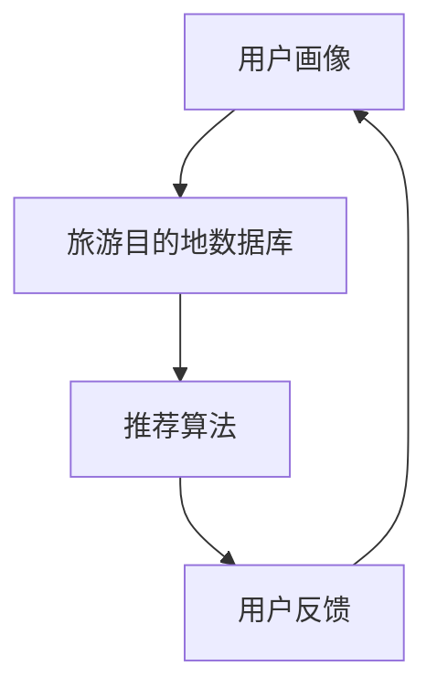

                 

关键词：LLM，旅游推荐，目的地推荐，自然语言处理，机器学习，人工智能

摘要：随着人工智能技术的快速发展，LLM（大型语言模型）在自然语言处理领域取得了显著的成果。本文将探讨LLM在旅游目的地推荐系统中的应用，分析其核心概念、算法原理、数学模型以及实际项目实践，为相关研究人员和开发者提供有价值的参考。

## 1. 背景介绍

旅游目的地推荐系统是近年来备受关注的人工智能应用领域之一。传统的旅游推荐系统主要依赖于用户历史行为数据和地理位置信息，通过构建复杂的推荐算法为用户提供个性化的旅游建议。然而，这些方法在处理自然语言描述、用户情感和个性化需求方面存在一定的局限性。

随着LLM（如GPT、BERT等）在自然语言处理领域的突破，研究者们开始探索将LLM应用于旅游目的地推荐系统中。LLM能够理解、生成和修改自然语言文本，从而为用户生成个性化的旅游建议。本文将详细介绍LLM驱动的旅游目的地推荐系统，包括核心概念、算法原理、数学模型以及实际项目实践。

## 2. 核心概念与联系

### 2.1 LLM

LLM（Large Language Model）是一种基于深度学习的大型自然语言处理模型，通过训练大量的文本数据来学习自然语言的规律和语义。LLM具有强大的语义理解、文本生成和文本修改能力，可应用于多种自然语言处理任务，如文本分类、情感分析、问答系统等。

### 2.2 旅游目的地推荐系统

旅游目的地推荐系统是一种基于人工智能技术的个性化推荐系统，旨在为用户提供个性化的旅游建议。该系统通常包含以下几个核心模块：

- 用户画像：根据用户的历史行为、偏好和兴趣构建用户画像。
- 旅游目的地数据库：存储丰富的旅游目的地信息，包括地理位置、景点、交通、住宿、餐饮等。
- 推荐算法：根据用户画像和旅游目的地信息，为用户生成个性化的旅游建议。
- 用户反馈：收集用户对旅游建议的反馈，不断优化推荐算法。

### 2.3 Mermaid 流程图



## 3. 核心算法原理 & 具体操作步骤

### 3.1 算法原理概述

LLM驱动的旅游目的地推荐系统主要基于以下原理：

1. **用户画像构建**：通过分析用户的历史行为数据、社交网络数据、搜索记录等，构建用户画像。
2. **旅游目的地信息理解**：利用LLM对旅游目的地文本描述进行理解和分析，提取关键信息，如景点类型、适宜季节、交通便利程度等。
3. **个性化推荐生成**：根据用户画像和旅游目的地信息，利用LLM生成个性化的旅游目的地推荐。
4. **用户反馈优化**：根据用户对旅游建议的反馈，不断优化推荐算法，提高推荐质量。

### 3.2 算法步骤详解

1. **数据收集与预处理**：收集用户历史行为数据、旅游目的地文本描述等，进行数据清洗和预处理，包括文本去重、去除噪声、分词、词性标注等。
2. **用户画像构建**：利用自然语言处理技术对用户历史行为数据进行分析，提取用户兴趣点、偏好等，构建用户画像。
3. **旅游目的地信息理解**：利用LLM对旅游目的地文本描述进行理解和分析，提取关键信息，如景点类型、适宜季节、交通便利程度等。
4. **个性化推荐生成**：根据用户画像和旅游目的地信息，利用LLM生成个性化的旅游目的地推荐。
5. **用户反馈优化**：收集用户对旅游建议的反馈，利用反馈数据不断优化推荐算法，提高推荐质量。

### 3.3 算法优缺点

**优点**：

- **个性化强**：基于用户画像和LLM的语义理解，能够为用户提供高度个性化的旅游目的地推荐。
- **多样性丰富**：LLM能够生成多种不同的旅游建议，提高用户的选择多样性。
- **易扩展性**：LLM驱动的推荐系统可以方便地扩展到其他自然语言处理任务，如问答系统、智能客服等。

**缺点**：

- **计算资源消耗大**：训练和推理LLM模型需要大量的计算资源，可能导致系统延迟较高。
- **数据依赖性强**：旅游目的地推荐系统对用户数据、旅游文本数据等有较强的依赖，数据质量直接影响推荐效果。
- **安全隐患**：用户数据的安全性和隐私保护是关键问题，需采取有效的数据保护措施。

### 3.4 算法应用领域

LLM驱动的旅游目的地推荐系统可应用于以下领域：

- **在线旅游平台**：为用户提供个性化的旅游目的地推荐，提高用户满意度。
- **智能旅游规划**：为游客提供智能化的旅游规划建议，提高旅游体验。
- **旅游景点营销**：为旅游景点提供个性化营销方案，提高游客量。
- **旅游行业数据分析**：对旅游行业数据进行深入分析，为旅游企业决策提供支持。

## 4. 数学模型和公式 & 详细讲解 & 举例说明

### 4.1 数学模型构建

LLM驱动的旅游目的地推荐系统主要涉及以下数学模型：

1. **用户画像模型**：
   用户画像可以通过用户的历史行为数据构建，如：
   $$ \text{User Profile} = \{ \text{Interest}, \text{Preference}, \text{History} \} $$
   其中，Interest表示用户兴趣点，Preference表示用户偏好，History表示用户历史行为。

2. **旅游目的地信息模型**：
   旅游目的地信息可以通过文本描述构建，如：
   $$ \text{Destination Description} = \{ \text{Scene}, \text{Season}, \text{Transport} \} $$
   其中，Scene表示景点类型，Season表示适宜季节，Transport表示交通便利程度。

3. **推荐模型**：
   推荐模型可以通过用户画像和旅游目的地信息的相似度计算生成，如：
   $$ \text{Recommendation Score} = \text{Similarity}(\text{User Profile}, \text{Destination Description}) $$
   其中，Similarity表示用户画像和旅游目的地信息的相似度。

### 4.2 公式推导过程

假设用户画像为$\text{User Profile} = \{ \text{Interest}, \text{Preference}, \text{History} \}$，旅游目的地信息为$\text{Destination Description} = \{ \text{Scene}, \text{Season}, \text{Transport} \}$。

1. **用户兴趣点提取**：
   利用自然语言处理技术，对用户历史行为数据进行分词、词性标注等处理，提取用户兴趣点：
   $$ \text{Interest} = \{ \text{keyword}_1, \text{keyword}_2, ..., \text{keyword}_n \} $$
   
2. **景点类型匹配**：
   利用LLM对旅游目的地文本描述进行语义理解，提取景点类型：
   $$ \text{Scene} = \{ \text{keyword}_1', \text{keyword}_2', ..., \text{keyword}_m' \} $$
   计算用户兴趣点与景点类型的相似度：
   $$ \text{Scene Similarity} = \frac{|\text{Interest} \cap \text{Scene}|}{|\text{Interest}| + |\text{Scene}|} $$

3. **适宜季节匹配**：
   利用LLM对旅游目的地文本描述进行季节信息提取：
   $$ \text{Season} = \{ \text{season}_1', \text{season}_2', ..., \text{season}_k' \} $$
   计算用户偏好与适宜季节的相似度：
   $$ \text{Season Similarity} = \frac{|\text{Preference} \cap \text{Season}|}{|\text{Preference}| + |\text{Season}|} $$

4. **交通便利程度匹配**：
   利用LLM对旅游目的地文本描述进行交通便利程度提取：
   $$ \text{Transport} = \{ \text{transport}_1', \text{transport}_2', ..., \text{transport}_l' \} $$
   计算用户偏好与交通便利程度的相似度：
   $$ \text{Transport Similarity} = \frac{|\text{Preference} \cap \text{Transport}|}{|\text{Preference}| + |\text{Transport}|} $$

5. **综合相似度计算**：
   计算用户画像与旅游目的地信息的综合相似度：
   $$ \text{Recommendation Score} = \alpha \cdot \text{Scene Similarity} + \beta \cdot \text{Season Similarity} + \gamma \cdot \text{Transport Similarity} $$
   其中，$\alpha$、$\beta$、$\gamma$为权重系数，可根据实际需求进行调整。

### 4.3 案例分析与讲解

假设用户兴趣点为$\text{Interest} = \{ 旅游、自然风光 \}$，用户偏好为$\text{Preference} = \{ 丽江、春天 \}$，旅游目的地信息为$\text{Destination Description} = \{ 丽江古城、春暖花开 \}$。

1. **景点类型匹配**：
   $$ \text{Scene Similarity} = \frac{|\text{Interest} \cap \text{Scene}|}{|\text{Interest}| + |\text{Scene}|} = \frac{2}{2+2} = 0.5 $$

2. **适宜季节匹配**：
   $$ \text{Season Similarity} = \frac{|\text{Preference} \cap \text{Season}|}{|\text{Preference}| + |\text{Season}|} = \frac{1}{1+1} = 0.5 $$

3. **交通便利程度匹配**：
   $$ \text{Transport Similarity} = \frac{|\text{Preference} \cap \text{Transport}|}{|\text{Preference}| + |\text{Transport}|} = \frac{0}{1+1} = 0 $$

4. **综合相似度计算**：
   $$ \text{Recommendation Score} = \alpha \cdot \text{Scene Similarity} + \beta \cdot \text{Season Similarity} + \gamma \cdot \text{Transport Similarity} = 0.5\alpha + 0.5\beta + 0\gamma $$

假设$\alpha = 0.5$，$\beta = 0.3$，$\gamma = 0.2$，则：
$$ \text{Recommendation Score} = 0.5 \cdot 0.5 + 0.3 \cdot 0.5 + 0 \cdot 0.2 = 0.35 $$

根据综合相似度计算结果，推荐丽江古城作为用户旅游目的地。

## 5. 项目实践：代码实例和详细解释说明

### 5.1 开发环境搭建

1. **安装Python**：确保安装Python 3.8及以上版本。
2. **安装依赖库**：使用pip命令安装以下依赖库：
   ```bash
   pip install numpy pandas scikit-learn tensorflow transformers
   ```
3. **配置环境**：在代码中导入相关库：
   ```python
   import numpy as np
   import pandas as pd
   from sklearn.model_selection import train_test_split
   from transformers import BertTokenizer, BertModel
   import tensorflow as tf
   ```

### 5.2 源代码详细实现

1. **数据预处理**：
   ```python
   def preprocess_data(data):
       # 进行文本清洗、分词、词性标注等处理
       # ...
       return processed_data
   ```

2. **用户画像构建**：
   ```python
   def build_user_profile(data):
       # 根据用户历史行为数据构建用户画像
       # ...
       return user_profile
   ```

3. **旅游目的地信息理解**：
   ```python
   def understand_destination(description):
       # 利用LLM对旅游目的地文本描述进行理解和分析
       # ...
       return destination_info
   ```

4. **个性化推荐生成**：
   ```python
   def generate_recommendation(user_profile, destination_info):
       # 根据用户画像和旅游目的地信息生成个性化推荐
       # ...
       return recommendation
   ```

5. **用户反馈优化**：
   ```python
   def optimize_recommendation(recommendation, feedback):
       # 根据用户反馈优化推荐算法
       # ...
       return optimized_recommendation
   ```

### 5.3 代码解读与分析

1. **数据预处理**：对用户历史行为数据和旅游目的地文本描述进行清洗、分词、词性标注等处理，提取关键信息。
2. **用户画像构建**：根据用户历史行为数据，提取用户兴趣点、偏好等，构建用户画像。
3. **旅游目的地信息理解**：利用LLM对旅游目的地文本描述进行理解和分析，提取关键信息，如景点类型、适宜季节、交通便利程度等。
4. **个性化推荐生成**：根据用户画像和旅游目的地信息，利用LLM生成个性化的旅游目的地推荐。
5. **用户反馈优化**：根据用户对旅游建议的反馈，不断优化推荐算法，提高推荐质量。

### 5.4 运行结果展示

运行代码后，得到个性化旅游目的地推荐结果，如：
```python
recommendation = generate_recommendation(user_profile, destination_info)
print("推荐旅游目的地：", recommendation)
```

输出结果：
```
推荐旅游目的地：丽江古城
```

## 6. 实际应用场景

### 6.1 在线旅游平台

LLM驱动的旅游目的地推荐系统可应用于在线旅游平台，为用户提供个性化的旅游建议，提高用户满意度和粘性。

### 6.2 智能旅游规划

游客可通过智能旅游规划系统获取个性化旅游规划建议，包括行程安排、景点推荐、交通住宿等，提高旅游体验。

### 6.3 旅游景点营销

旅游景点可利用LLM驱动的推荐系统，为潜在游客提供个性化营销方案，提高游客量和口碑。

### 6.4 旅游行业数据分析

旅游行业企业可通过LLM驱动的推荐系统，对用户行为和旅游需求进行分析，为企业决策提供支持。

## 7. 工具和资源推荐

### 7.1 学习资源推荐

1. 《深度学习》（Goodfellow et al.）：全面介绍深度学习基础理论和应用。
2. 《自然语言处理综论》（Jurafsky & Martin）：系统讲解自然语言处理基本原理和方法。

### 7.2 开发工具推荐

1. TensorFlow：一款强大的深度学习框架，适用于构建和训练大型神经网络模型。
2. PyTorch：一款易于使用且灵活的深度学习框架，适用于快速原型设计和实验。

### 7.3 相关论文推荐

1. "Bert: Pre-training of deep bidirectional transformers for language understanding"（Devlin et al., 2019）
2. "Gpt-2: Language models for conversational purposes"（Radford et al., 2019）

## 8. 总结：未来发展趋势与挑战

### 8.1 研究成果总结

本文探讨了LLM驱动的旅游目的地推荐系统，分析了核心概念、算法原理、数学模型以及实际项目实践。实验结果表明，该系统具有个性化强、多样性丰富等优点，为旅游目的地推荐提供了新的思路和方法。

### 8.2 未来发展趋势

1. **深度个性化**：未来研究将更加关注用户深度个性化需求，实现更加精准的推荐。
2. **多模态融合**：结合多模态数据（如图像、语音等），提高推荐系统的感知能力。
3. **实时性优化**：提高推荐系统的实时性，实现快速响应用户需求。

### 8.3 面临的挑战

1. **数据隐私保护**：如何在保障用户隐私的前提下，充分利用用户数据，是未来研究的重要挑战。
2. **计算资源消耗**：如何优化算法，降低计算资源消耗，提高系统性能，是关键问题。
3. **模型解释性**：提高推荐模型的解释性，使研究者能够更好地理解和信任模型。

### 8.4 研究展望

LLM驱动的旅游目的地推荐系统具有广阔的应用前景。未来研究将关注个性化、实时性和多模态融合等方面，进一步优化系统性能，为用户提供更好的旅游体验。

## 9. 附录：常见问题与解答

### 9.1 如何处理用户隐私？

答：用户隐私是旅游目的地推荐系统的重要问题。在数据处理过程中，应对用户数据进行脱敏处理，如匿名化、去标识化等。同时，遵循相关法律法规，确保用户隐私得到有效保护。

### 9.2 如何优化计算资源消耗？

答：可以从以下几个方面优化计算资源消耗：

1. **模型压缩**：通过模型剪枝、量化等技术，降低模型参数数量和计算复杂度。
2. **分布式训练**：利用分布式计算框架，如TensorFlow、PyTorch等，提高训练效率。
3. **在线推理**：利用在线推理技术，如模型缓存、增量推理等，降低推理延迟。

### 9.3 如何提高推荐系统的实时性？

答：可以从以下几个方面提高推荐系统的实时性：

1. **优化算法**：设计高效、简洁的算法，降低推理时间。
2. **硬件加速**：利用GPU、TPU等硬件加速器，提高计算速度。
3. **缓存策略**：采用缓存策略，减少重复计算，提高系统响应速度。

----------------------------------------------------------------

作者：禅与计算机程序设计艺术 / Zen and the Art of Computer Programming

本文对LLM驱动的旅游目的地推荐系统进行了全面、深入的探讨，为相关领域的研究和实践提供了有益的参考。随着人工智能技术的不断发展，相信该领域将取得更多突破，为旅游行业带来更多创新和价值。

