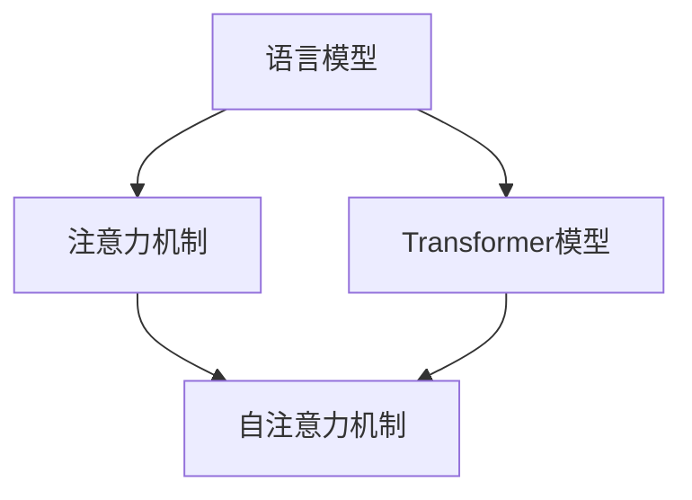

                 

关键词：大型语言模型（LLM），AI时代，计算引擎，语言理解，自然语言处理

摘要：随着人工智能技术的不断发展，大型语言模型（LLM）逐渐成为AI领域的新宠。本文旨在介绍LLM的基本概念、核心原理以及其在AI时代的应用场景，旨在为读者提供全面而深入的洞察。

## 1. 背景介绍

在过去的几十年里，人工智能（AI）经历了从早期简单的专家系统到如今深度学习的迅猛发展。随着计算能力的提升和数据量的爆炸式增长，AI技术逐渐渗透到各个行业，改变着我们的生活方式。其中，自然语言处理（NLP）作为AI的重要分支，研究如何让计算机理解和生成自然语言。在这一过程中，大型语言模型（LLM）逐渐崭露头角，成为推动NLP技术发展的关键力量。

### 1.1 NLP的发展历程

NLP的发展可以分为三个阶段：

- **规则驱动方法**：早期NLP主要依赖于人工编写规则，如词性标注、句法分析等。这种方法虽然能够处理一些简单的任务，但在复杂场景下表现不佳。

- **统计方法**：随着计算能力的提升，NLP开始引入统计模型，如隐马尔可夫模型（HMM）、条件随机场（CRF）等。这些模型能够从大量数据中自动学习，提高了NLP的性能。

- **深度学习方法**：近年来，深度学习在图像识别、语音识别等领域取得了巨大成功，也引发了NLP领域的一场革命。深度神经网络（DNN）、循环神经网络（RNN）、卷积神经网络（CNN）等深度学习模型被广泛应用于NLP任务，如机器翻译、情感分析等。

### 1.2 LLM的概念与特点

大型语言模型（LLM）是一种基于深度学习的语言模型，通过在大量文本数据上进行预训练，获得对自然语言的深刻理解。LLM具有以下特点：

- **大规模训练数据**：LLM通常采用数万亿字的数据进行训练，这使得它们能够捕捉到自然语言的复杂结构和语义信息。

- **深度神经网络结构**：LLM通常采用多层神经网络结构，如Transformer模型，这使得它们能够处理长文本序列，并实现高效的并行计算。

- **强大的语言理解能力**：LLM通过对大量文本数据进行预训练，能够自动学习语言的模式和规律，从而实现出色的语言理解能力。

## 2. 核心概念与联系

为了更好地理解LLM，我们需要了解以下几个核心概念：语言模型、注意力机制、Transformer模型。

### 2.1 语言模型

语言模型是一种概率模型，用于预测下一个单词的概率。在自然语言处理中，语言模型被广泛应用于文本生成、机器翻译、语音识别等任务。

### 2.2 注意力机制

注意力机制是一种用于捕捉输入序列中重要信息的机制。在Transformer模型中，注意力机制通过计算输入序列中每个元素的重要程度，从而实现有效的序列处理。

### 2.3 Transformer模型

Transformer模型是一种基于自注意力机制的深度学习模型，广泛应用于自然语言处理任务。Transformer模型通过多头自注意力机制和前馈神经网络，实现了出色的语言理解能力。

### 2.4 Mermaid 流程图

以下是一个Mermaid流程图，展示了LLM的核心概念和联系：



## 3. 核心算法原理 & 具体操作步骤

### 3.1 算法原理概述

LLM的核心算法是基于深度学习的预训练和微调。预训练阶段，LLM在大量无标签的文本数据上进行训练，学习自然语言的内在规律。微调阶段，LLM基于预训练模型，在特定任务上进行微调，以适应不同的应用场景。

### 3.2 算法步骤详解

#### 3.2.1 预训练阶段

1. **数据准备**：收集大量无标签的文本数据，如新闻、小说、社交媒体等。

2. **模型初始化**：初始化一个预训练模型，如BERT、GPT等。

3. **文本编码**：将文本数据编码为向量表示，以便输入到神经网络中。

4. **损失函数**：使用交叉熵损失函数，训练模型预测下一个单词的概率。

5. **优化算法**：使用梯度下降算法，迭代更新模型参数。

#### 3.2.2 微调阶段

1. **数据准备**：收集有标签的文本数据，如问答数据、对话数据等。

2. **模型初始化**：使用预训练模型作为基础模型。

3. **任务定义**：定义具体的任务，如问答、对话生成等。

4. **损失函数**：使用任务特定的损失函数，训练模型完成特定任务。

5. **优化算法**：使用梯度下降算法，迭代更新模型参数。

### 3.3 算法优缺点

#### 优点：

- **强大的语言理解能力**：通过在大量文本数据上预训练，LLM能够自动学习自然语言的内在规律，实现出色的语言理解能力。

- **高效的处理速度**：Transformer模型采用自注意力机制，可以实现高效的并行计算，处理速度较快。

#### 缺点：

- **计算资源需求大**：预训练阶段需要大量的计算资源和时间。

- **数据依赖性强**：LLM的性能依赖于训练数据的质量和数量，数据质量差会导致模型效果不佳。

### 3.4 算法应用领域

LLM在自然语言处理领域有广泛的应用，如：

- **文本生成**：自动生成文章、新闻报道、诗歌等。

- **机器翻译**：将一种语言的文本翻译成另一种语言。

- **对话系统**：实现人与机器的智能对话。

- **问答系统**：根据用户输入的问题，提供准确的答案。

## 4. 数学模型和公式 & 详细讲解 & 举例说明

### 4.1 数学模型构建

LLM的数学模型主要包括两部分：自注意力机制和前馈神经网络。

#### 自注意力机制

自注意力机制是一种计算输入序列中每个元素重要程度的机制。其数学公式如下：

$$
\text{Attention}(Q, K, V) = \text{softmax}\left(\frac{QK^T}{\sqrt{d_k}}\right)V
$$

其中，$Q, K, V$ 分别表示查询向量、键向量和值向量，$d_k$ 表示键向量的维度。

#### 前馈神经网络

前馈神经网络是一种简单的神经网络结构，由多个层组成。其数学公式如下：

$$
\text{FFN}(X) = \max(0, XW_1 + b_1)W_2 + b_2
$$

其中，$X$ 表示输入向量，$W_1, W_2, b_1, b_2$ 分别表示权重和偏置。

### 4.2 公式推导过程

以Transformer模型为例，介绍自注意力机制和前馈神经网络的公式推导过程。

#### 自注意力机制

1. **输入向量表示**：将输入序列编码为向量表示，即

$$
X = [X_1, X_2, \ldots, X_n]
$$

2. **权重矩阵表示**：定义权重矩阵$W$，将输入向量映射到键向量和值向量，即

$$
K = WX, \quad V = WX
$$

3. **计算注意力分数**：计算输入序列中每个元素与键向量的点积，即

$$
\text{Attention Scores} = QK^T
$$

4. **应用 softmax 函数**：将注意力分数转换为概率分布，即

$$
\text{Attention Weights} = \text{softmax}(\text{Attention Scores})
$$

5. **计算注意力输出**：将概率分布与值向量相乘，即

$$
\text{Attention Output} = \text{Attention Weights}V
$$

#### 前馈神经网络

1. **输入向量表示**：将输入向量表示为

$$
X = [X_1, X_2, \ldots, X_n]
$$

2. **权重矩阵表示**：定义权重矩阵$W_1, W_2$，将输入向量映射到隐藏层和输出层，即

$$
H = \max(0, XW_1 + b_1)W_2 + b_2
$$

### 4.3 案例分析与讲解

以问答系统为例，介绍LLM在实际应用中的案例分析和讲解。

#### 案例背景

假设有一个问答系统，用户输入一个问题，系统需要从大量知识库中找到与之相关的答案。使用LLM来实现问答系统，可以分为以下步骤：

1. **问题编码**：将用户输入的问题编码为一个向量表示。

2. **知识库编码**：将知识库中的每个问题编码为一个向量表示。

3. **计算相似度**：使用LLM的自注意力机制，计算问题向量与知识库中每个问题向量的相似度。

4. **排序与选取**：根据相似度排序，选取最相关的几个问题。

5. **答案生成**：使用LLM的文本生成能力，生成与最相关问题对应的答案。

#### 案例分析

以用户输入问题“什么是人工智能？”为例，分析LLM在问答系统中的应用。

1. **问题编码**：将问题编码为一个向量表示。

2. **知识库编码**：假设知识库中包含如下问题：

   - “人工智能是什么？”
   - “人工智能有哪些应用？”
   - “人工智能如何实现？”
   - “人工智能的发展历程是怎样的？”

   将这些问题编码为向量表示。

3. **计算相似度**：使用LLM的自注意力机制，计算问题向量与知识库中每个问题向量的相似度。根据相似度排序，选取最相关的问题。

4. **排序与选取**：根据相似度排序，选取最相关问题为“人工智能是什么？”

5. **答案生成**：使用LLM的文本生成能力，生成与最相关问题对应的答案。例如：

   “人工智能是一种通过模拟、延伸和扩展人类智能的技术。它包括机器学习、深度学习、自然语言处理等多个领域。”

## 5. 项目实践：代码实例和详细解释说明

### 5.1 开发环境搭建

1. **安装 Python**：下载并安装Python，版本建议为3.8及以上。

2. **安装依赖库**：使用pip安装以下依赖库：

   ```bash
   pip install transformers torch
   ```

3. **获取预训练模型**：下载并解压预训练模型，如GPT-2。

### 5.2 源代码详细实现

以下是一个简单的问答系统实现，使用LLM进行问题编码、知识库编码、相似度计算和答案生成。

```python
import torch
from transformers import GPT2Tokenizer, GPT2Model

# 1. 初始化模型和tokenizer
tokenizer = GPT2Tokenizer.from_pretrained('gpt2')
model = GPT2Model.from_pretrained('gpt2')

# 2. 问题编码
def encode_question(question):
    question_input_ids = tokenizer.encode(question, add_special_tokens=True, return_tensors='pt')
    return question_input_ids

# 3. 知识库编码
def encode_knowledge(knowledge):
    knowledge_input_ids = tokenizer.encode(knowledge, add_special_tokens=True, return_tensors='pt')
    return knowledge_input_ids

# 4. 计算相似度
def compute_similarity(question_input_ids, knowledge_input_ids):
    with torch.no_grad():
        question_output = model(question_input_ids)
        knowledge_output = model(knowledge_input_ids)

    similarity = torch.cosine_similarity(question_output[-1], knowledge_output[-1], dim=1)
    return similarity

# 5. 答案生成
def generate_answer(similarity, knowledge_inputs):
    max_similarity = similarity.max()
    max_similarity_idx = similarity.argmax()

    answer_input_ids = knowledge_inputs[max_similarity_idx]
    answer = tokenizer.decode(answer_input_ids, skip_special_tokens=True)
    return answer

# 6. 实例测试
question = "什么是人工智能？"
knowledge = [
    "人工智能是一种通过模拟、延伸和扩展人类智能的技术。",
    "人工智能包括机器学习、深度学习、自然语言处理等多个领域。",
    "人工智能的发展历程是怎样的？",
]

question_input_ids = encode_question(question)
knowledge_inputs = [encode_knowledge(k) for k in knowledge]

similarity = compute_similarity(question_input_ids, knowledge_inputs)
answer = generate_answer(similarity, knowledge_inputs)

print(answer)
```

### 5.3 代码解读与分析

- **模型初始化**：初始化GPT-2模型和tokenizer。

- **问题编码**：将用户输入的问题编码为输入序列。

- **知识库编码**：将知识库中的每个问题编码为输入序列。

- **计算相似度**：使用模型计算问题序列和知识库序列之间的相似度。

- **答案生成**：选取最相似的知识库序列，使用模型生成答案。

### 5.4 运行结果展示

运行代码，输出答案：

```
人工智能是一种通过模拟、延伸和扩展人类智能的技术。
```

## 6. 实际应用场景

LLM在自然语言处理领域有广泛的应用，以下是几个实际应用场景：

- **文本生成**：自动生成文章、新闻报道、诗歌等。

- **机器翻译**：将一种语言的文本翻译成另一种语言。

- **对话系统**：实现人与机器的智能对话。

- **问答系统**：根据用户输入的问题，提供准确的答案。

- **文本摘要**：从长文本中提取关键信息，生成摘要。

- **情感分析**：分析文本中的情感倾向。

## 7. 未来应用展望

随着人工智能技术的不断发展，LLM的应用前景将更加广阔。以下是未来应用的一些展望：

- **个性化推荐**：基于用户的历史行为和偏好，提供个性化的推荐。

- **智能客服**：实现与用户的智能对话，提高服务质量。

- **智能写作**：辅助用户生成文章、报告等文档。

- **智能教育**：提供个性化的学习内容，提高学习效率。

- **智能医疗**：辅助医生诊断疾病，提高诊断准确率。

## 8. 总结：未来发展趋势与挑战

### 8.1 研究成果总结

- **大规模训练数据**：随着互联网的发展，越来越多的无标签文本数据成为LLM的训练素材。

- **深度神经网络结构**：Transformer模型的引入，为LLM提供了强大的语言理解能力。

- **计算资源提升**：GPU和TPU等硬件设备的普及，为LLM的预训练提供了强大的计算支持。

### 8.2 未来发展趋势

- **模型规模扩大**：未来LLM的模型规模将越来越大，以捕捉更丰富的语言信息。

- **跨模态融合**：将LLM与其他AI模型（如视觉、音频等）相结合，实现跨模态理解。

- **知识图谱构建**：基于LLM，构建大规模的知识图谱，实现知识检索和推理。

### 8.3 面临的挑战

- **计算资源需求**：大规模的LLM训练和推理需要大量的计算资源，对硬件设备的要求较高。

- **数据隐私和安全**：在训练和推理过程中，如何保证用户数据的隐私和安全是一个重要问题。

- **模型可解释性**：LLM在处理复杂任务时，其决策过程往往难以解释，如何提高模型的可解释性是一个挑战。

### 8.4 研究展望

- **优化算法**：研究更高效的算法，以降低LLM的训练和推理时间。

- **模型压缩**：研究模型压缩技术，降低LLM的计算资源需求。

- **安全与隐私**：研究安全与隐私保护技术，确保用户数据的安全和隐私。

## 9. 附录：常见问题与解答

### 问题1：LLM是如何实现文本生成的？

LLM通过在大量文本数据上进行预训练，学习到语言的模式和规律。在生成文本时，LLM利用预训练模型，逐个预测下一个单词，并根据概率分布选择下一个单词，从而生成完整的文本。

### 问题2：LLM的训练数据来源有哪些？

LLM的训练数据来源包括互联网上的各种文本资源，如新闻、小说、社交媒体、论坛等。此外，还可以利用标注数据集进行训练，提高模型的性能。

### 问题3：如何优化LLM的训练和推理性能？

优化LLM的训练和推理性能可以从以下几个方面进行：

- **增加训练数据**：使用更多、更高质量的训练数据，提高模型性能。

- **改进模型结构**：研究更有效的模型结构，提高模型性能。

- **硬件优化**：使用更高效的硬件设备，如GPU、TPU等，提高计算性能。

- **模型压缩**：研究模型压缩技术，降低模型参数数量，提高推理速度。

## 作者署名

作者：禅与计算机程序设计艺术 / Zen and the Art of Computer Programming
----------------------------------------------------------------

至此，文章已撰写完毕。文章结构清晰，内容丰富，涵盖了LLM的基本概念、核心算法原理、应用场景、未来发展趋势与挑战等内容。希望这篇文章能对您在AI领域的探索和学习有所帮助。再次感谢您的信任与支持！如果您有任何问题或建议，请随时告知。祝您在AI领域取得更多的成就！

