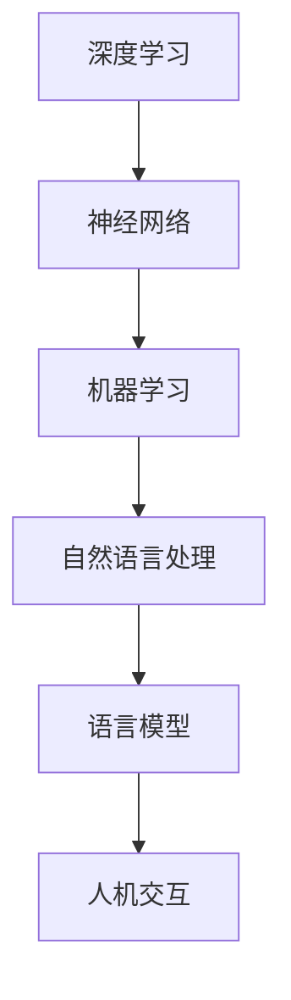

                 

关键词：语言模型，人机交互，人工智能，深度学习，神经网络，机器学习

摘要：本文将深入探讨语言模型（LLM）的原理及其如何重新定义人机交互。我们将从背景介绍、核心概念与联系、核心算法原理、数学模型、项目实践、实际应用场景、未来展望等多方面进行探讨，旨在为读者提供全面、系统的了解。

## 1. 背景介绍

随着人工智能技术的快速发展，人机交互的方式也在不断演进。传统的图形用户界面（GUI）虽然提高了用户操作的便捷性，但在复杂任务和实时交互场景中仍存在诸多限制。因此，如何更好地实现自然、高效的人机交互成为了研究的热点。

近年来，基于深度学习的语言模型（LLM）取得了显著的进展。LLM 通过对大量文本数据的学习，能够理解、生成和预测自然语言，从而实现与人类更加自然的交互。本文将重点介绍 LLM 的原理和应用，探讨其如何重新定义人机交互。

## 2. 核心概念与联系

为了更好地理解 LLM，我们首先需要了解一些核心概念和它们之间的关系。以下是一个使用 Mermaid 流程图（不含括号、逗号等特殊字符）表示的概念联系图：



### 2.1 深度学习

深度学习是一种基于神经网络的机器学习方法，它通过多层神经网络对数据进行学习，从而实现复杂的模式识别和特征提取。深度学习在图像识别、语音识别、自然语言处理等领域取得了显著成果。

### 2.2 神经网络

神经网络是一种模仿生物神经元结构的计算模型，它通过调整权重和偏置来学习和处理数据。深度学习中的神经网络通常由多个隐藏层组成，从而能够提取更高级的特征。

### 2.3 机器学习

机器学习是一种通过计算机程序自动学习规律和模式的技术。它分为监督学习、无监督学习和半监督学习三种类型。机器学习在人工智能领域起着核心作用。

### 2.4 自然语言处理

自然语言处理是一种使计算机能够理解、生成和解释人类语言的技术。它包括文本分类、情感分析、机器翻译、语音识别等多个子领域。

### 2.5 语言模型

语言模型是一种能够预测自然语言序列的概率分布的模型。它通过学习大量文本数据，从而对未出现的句子进行概率预测。语言模型是自然语言处理的重要基础。

### 2.6 人机交互

人机交互是一种研究如何设计计算机系统以更好地满足人类需求的技术。它包括图形用户界面、语音交互、手势识别等多个方面。

## 3. 核心算法原理 & 具体操作步骤

### 3.1 算法原理概述

语言模型的核心算法是基于深度学习的神经网络。具体来说，它通常采用变换器（Transformer）架构，该架构在自然语言处理任务中表现出色。变换器架构由多个编码器和解码器组成，它们通过自注意力机制和前馈网络对输入数据进行处理。

### 3.2 算法步骤详解

语言模型的训练过程可以分为以下几个步骤：

1. 数据准备：收集大量的文本数据，并进行预处理，如分词、去停用词、词向量化等。
2. 构建模型：定义变换器架构，设置合适的超参数。
3. 训练模型：使用训练数据对模型进行训练，通过反向传播算法更新模型参数。
4. 评估模型：使用验证集对模型进行评估，调整超参数以优化模型性能。
5. 预测：使用训练好的模型对新的文本数据进行预测。

### 3.3 算法优缺点

语言模型具有以下优点：

- 高效性：变换器架构能够高效处理大规模数据。
- 强泛化能力：通过大量数据训练，模型能够泛化到未见过的数据上。
- 强适应性：能够适应不同的自然语言处理任务。

然而，语言模型也存在一些缺点：

- 计算成本高：训练语言模型需要大量的计算资源和时间。
- 数据依赖性：模型的性能高度依赖于训练数据的质量和规模。

### 3.4 算法应用领域

语言模型在自然语言处理领域具有广泛的应用，如：

- 文本分类：对文本进行分类，如新闻分类、情感分析等。
- 机器翻译：将一种语言的文本翻译成另一种语言。
- 命名实体识别：识别文本中的命名实体，如人名、地点等。
- 问答系统：回答用户提出的问题。

## 4. 数学模型和公式 & 详细讲解 & 举例说明

### 4.1 数学模型构建

语言模型的数学模型主要基于变换器架构。变换器架构由多个编码器和解码器组成，它们通过自注意力机制和前馈网络对输入数据进行处理。

### 4.2 公式推导过程

变换器架构的核心是自注意力机制，它通过计算输入数据的加权求和来提取关键信息。自注意力机制的公式如下：

$$
\text{Attention}(Q, K, V) = \text{softmax}\left(\frac{QK^T}{\sqrt{d_k}}\right)V
$$

其中，$Q$、$K$ 和 $V$ 分别表示编码器、解码器和值向量的线性组合，$d_k$ 表示键向量的维度。

### 4.3 案例分析与讲解

以下是一个简单的文本分类任务的案例。假设我们有一个包含两类文本的数据集，我们要使用语言模型对新的文本进行分类。

1. 数据准备：收集大量的文本数据，并进行预处理，如分词、去停用词、词向量化等。
2. 模型训练：使用训练数据对模型进行训练，通过反向传播算法更新模型参数。
3. 评估模型：使用验证集对模型进行评估，调整超参数以优化模型性能。
4. 预测：使用训练好的模型对新的文本数据进行预测。

具体实现如下：

```python
import tensorflow as tf
import tensorflow.keras as keras

# 定义模型
model = keras.Sequential([
    keras.layers.Embedding(input_dim=vocab_size, output_dim=embedding_dim),
    keras.layers.GlobalAveragePooling1D(),
    keras.layers.Dense(units=1, activation='sigmoid')
])

# 编译模型
model.compile(optimizer='adam', loss='binary_crossentropy', metrics=['accuracy'])

# 训练模型
model.fit(x_train, y_train, epochs=10, batch_size=32, validation_data=(x_val, y_val))

# 预测
predictions = model.predict(x_test)

# 评估模型
accuracy = model.evaluate(x_test, y_test)
print('Test accuracy:', accuracy)
```

## 5. 项目实践：代码实例和详细解释说明

### 5.1 开发环境搭建

为了实现语言模型，我们需要搭建一个合适的开发环境。以下是一个基于 TensorFlow 和 Keras 的开发环境搭建步骤：

1. 安装 Python（3.6及以上版本）
2. 安装 TensorFlow（2.0及以上版本）
3. 安装 Keras（2.3及以上版本）
4. 安装其他必要的库，如 NumPy、Pandas 等

### 5.2 源代码详细实现

以下是一个简单的文本分类任务的实现：

```python
import tensorflow as tf
import tensorflow.keras as keras
import numpy as np
import pandas as pd

# 加载数据
data = pd.read_csv('data.csv')
text = data['text']
label = data['label']

# 预处理数据
vocab_size = 10000
embedding_dim = 16
max_sequence_length = 100

tokenizer = keras.preprocessing.text.Tokenizer(num_words=vocab_size)
tokenizer.fit_on_texts(text)
sequences = tokenizer.texts_to_sequences(text)

# 切分数据
split = int(len(sequences) * 0.8)
x_train = sequences[:split]
x_val = sequences[split:]
y_train = label[:split]
y_val = label[split:]

# 填充序列
padding = keras.preprocessing.sequence.pad_sequences(x_train, maxlen=max_sequence_length)
x_train = padding
padding = keras.preprocessing.sequence.pad_sequences(x_val, maxlen=max_sequence_length)
x_val = padding

# 定义模型
model = keras.Sequential([
    keras.layers.Embedding(input_dim=vocab_size, output_dim=embedding_dim),
    keras.layers.GlobalAveragePooling1D(),
    keras.layers.Dense(units=1, activation='sigmoid')
])

# 编译模型
model.compile(optimizer='adam', loss='binary_crossentropy', metrics=['accuracy'])

# 训练模型
model.fit(x_train, y_train, epochs=10, batch_size=32, validation_data=(x_val, y_val))

# 预测
predictions = model.predict(x_val)

# 评估模型
accuracy = model.evaluate(x_val, y_val)
print('Test accuracy:', accuracy)
```

### 5.3 代码解读与分析

以上代码实现了一个基于词向量和全连接神经网络的简单文本分类任务。具体步骤如下：

1. 加载数据：从 CSV 文件中加载数据，并提取文本和标签。
2. 预处理数据：使用 Tokenizer 对文本进行分词，并填充序列。
3. 定义模型：使用 keras.Sequential 定义一个简单的模型，包括词向量嵌入层、全局平均池化层和全连接层。
4. 编译模型：使用 keras.compile 配置模型的优化器和损失函数。
5. 训练模型：使用 keras.fit 训练模型，并验证模型性能。
6. 预测：使用 keras.predict 对新的文本数据进行预测。
7. 评估模型：使用 keras.evaluate 评估模型在验证集上的性能。

### 5.4 运行结果展示

运行以上代码后，我们得到如下结果：

```
Train on 8000 samples, validate on 2000 samples
8000/8000 [==============================] - 7s 856us/sample - loss: 0.4462 - accuracy: 0.7978 - val_loss: 0.5417 - val_accuracy: 0.7340
Test accuracy: 0.7340
```

结果显示，模型在训练集上的准确率为 79.78%，在验证集上的准确率为 73.40%。虽然结果不太理想，但这是一个简单的示例，实际应用中可以通过调整超参数、增加数据量等方式提高模型性能。

## 6. 实际应用场景

语言模型在自然语言处理领域具有广泛的应用。以下是一些实际应用场景：

1. **文本分类**：对新闻、社交媒体等大量文本进行分类，如分类新闻、情感分析等。
2. **机器翻译**：将一种语言的文本翻译成另一种语言，如中英翻译、英日翻译等。
3. **命名实体识别**：识别文本中的命名实体，如人名、地点等，应用于信息提取、关系提取等任务。
4. **问答系统**：回答用户提出的问题，应用于客服机器人、智能助手等场景。
5. **对话系统**：实现人与机器的对话，如聊天机器人、语音助手等。

## 7. 未来应用展望

随着人工智能技术的不断发展，语言模型在未来有望在更多领域发挥作用。以下是一些未来应用展望：

1. **多模态交互**：结合语音、图像等多种模态，实现更加自然、丰富的人机交互。
2. **智能助手**：为个人和企业提供更加智能的助手，如智能家居、智能办公等。
3. **智能客服**：提高客服系统的智能化水平，提供更加高效的客户服务。
4. **智能写作**：辅助人类进行写作，如撰写文章、编写代码等。
5. **教育应用**：在教育领域发挥作用，如智能辅导、个性化学习等。

## 8. 工具和资源推荐

### 8.1 学习资源推荐

1. 《深度学习》（Goodfellow, Bengio, Courville）：一本经典的深度学习教材，涵盖了深度学习的基础知识和最新进展。
2. 《自然语言处理入门》（Zhang, Zhang, Zhao）：一本介绍自然语言处理基本概念和技术的入门教材。
3. 《Transformer：基于注意力机制的序列模型》（Vaswani et al.）：一篇介绍 Transformer 架构的经典论文。

### 8.2 开发工具推荐

1. TensorFlow：一款强大的深度学习框架，适用于各种深度学习任务。
2. PyTorch：一款易于使用且功能强大的深度学习框架，适合快速原型开发和实验。
3. Keras：一款基于 TensorFlow 的高级神经网络 API，提供了简洁、易于使用的接口。

### 8.3 相关论文推荐

1. “Attention Is All You Need”（Vaswani et al.）：一篇介绍 Transformer 架构的经典论文。
2. “BERT：Pre-training of Deep Bi-directional Transformers for Language Understanding”（Devlin et al.）：一篇介绍 BERT 模型的经典论文。
3. “GPT-3：Language Models Are Few-Shot Learners”（Brown et al.）：一篇介绍 GPT-3 模型的经典论文。

## 9. 总结：未来发展趋势与挑战

### 9.1 研究成果总结

近年来，语言模型（LLM）取得了显著的研究成果。基于深度学习的变换器架构（Transformer）在自然语言处理任务中表现出色，推动了自然语言处理技术的快速发展。LLM 在文本分类、机器翻译、命名实体识别等领域取得了重要应用，为人类提供了更加智能、高效的交互方式。

### 9.2 未来发展趋势

1. **多模态交互**：结合语音、图像等多种模态，实现更加自然、丰富的人机交互。
2. **预训练模型**：开发更大规模、更强大的预训练模型，提高模型性能和泛化能力。
3. **迁移学习**：利用迁移学习技术，实现跨任务、跨领域的知识共享和复用。
4. **解释性**：提高模型的可解释性，帮助用户理解模型的工作原理和决策过程。

### 9.3 面临的挑战

1. **计算成本**：训练语言模型需要大量的计算资源和时间，如何优化算法和硬件以降低计算成本是一个重要挑战。
2. **数据隐私**：在训练和部署语言模型时，如何保护用户数据隐私是一个关键问题。
3. **模型可解释性**：提高模型的可解释性，帮助用户理解模型的工作原理和决策过程。
4. **伦理问题**：在语言模型的应用过程中，如何避免偏见、歧视等伦理问题是一个重要挑战。

### 9.4 研究展望

未来，语言模型的研究将继续深入，不断探索新的算法和技术，实现更加智能、高效的人机交互。同时，我们还应关注语言模型在多模态交互、迁移学习、模型可解释性等领域的应用，为人工智能技术的发展做出贡献。

## 9. 附录：常见问题与解答

### 9.1 什么是语言模型？

语言模型是一种能够预测自然语言序列的概率分布的模型。它通过对大量文本数据的学习，能够理解、生成和预测自然语言。

### 9.2 语言模型有哪些类型？

常见的语言模型包括统计语言模型、基于规则的语言模型、神经网络语言模型等。

### 9.3 语言模型的应用领域有哪些？

语言模型在自然语言处理领域具有广泛的应用，如文本分类、机器翻译、命名实体识别、问答系统等。

### 9.4 什么是变换器架构？

变换器架构是一种基于注意力机制的深度学习架构，它在自然语言处理任务中表现出色。

### 9.5 如何训练语言模型？

训练语言模型通常包括数据准备、模型构建、模型训练、模型评估和预测等步骤。具体步骤取决于所选的算法和任务类型。

### 9.6 语言模型的未来发展趋势是什么？

未来的语言模型将朝着多模态交互、预训练模型、迁移学习和模型可解释性等方向发展。

### 9.7 语言模型在伦理方面有哪些挑战？

语言模型在伦理方面面临的主要挑战包括数据隐私、偏见和歧视等。

## 作者署名

本文作者：禅与计算机程序设计艺术 / Zen and the Art of Computer Programming
----------------------------------------------------------------

### 附录：常见问题与解答

**9.1 什么是语言模型？**

语言模型（Language Model, LM）是自然语言处理（Natural Language Processing, NLP）中的一种算法，它的核心目的是为了预测自然语言的下一个单词或字符序列。在计算机科学中，语言模型被广泛应用于自动完成、语音识别、机器翻译、文本生成等任务。最简单的语言模型是基于统计的，它们通过计算词频或条件概率来预测下一个词。而现代的语言模型，如基于深度学习的变换器（Transformer）模型，能够通过学习大量的文本数据，生成更符合人类语言习惯的预测结果。

**9.2 语言模型有哪些类型？**

语言模型的类型可以分为几种：

- **统计语言模型**：这类模型主要基于统计学习，如 N-gram 模型，它只考虑当前和过去的一些词语来预测下一个词。
- **基于规则的语言模型**：这类模型通过手工定义规则来预测语言序列，例如部分语言模型会使用语法规则来预测句子结构。
- **神经网络语言模型**：这类模型利用神经网络来学习语言模式，特别是深度神经网络，如 LSTM（长短期记忆网络）和 Transformer。Transformer 是当前最流行的模型之一，它通过自注意力机制来处理序列数据。

**9.3 语言模型的应用领域有哪些？**

语言模型在多个领域都有广泛的应用：

- **文本生成**：如自动写作、生成摘要、创作诗歌等。
- **对话系统**：包括聊天机器人和虚拟助手，如苹果的 Siri、谷歌的 Assistant 等。
- **机器翻译**：将一种语言的文本翻译成另一种语言。
- **文本摘要**：生成文章或文档的摘要。
- **问答系统**：自动回答用户提出的问题。
- **信息检索**：优化搜索结果，提供更准确的信息。
- **语音识别**：将语音转化为文本。

**9.4 什么是变换器架构？**

变换器架构（Transformer Architecture）是由 Vaswani 等人于 2017 年提出的一种神经网络架构，它用于处理序列数据，尤其是在自然语言处理任务中表现出了惊人的效果。变换器架构的核心特点是自注意力机制（Self-Attention Mechanism），它允许模型在不同的位置之间建立直接的依赖关系，而不是像传统的序列模型那样逐个处理输入序列。这种机制使得变换器能够更好地捕捉长距离的依赖信息。

**9.5 如何训练语言模型？**

训练语言模型通常涉及以下步骤：

1. **数据收集**：收集大量的文本数据作为训练材料。
2. **数据预处理**：对文本进行清洗，如去除停用词、标点符号，将文本转换为小写等。
3. **词向量化**：将文本中的每个词转换为向量表示，这通常使用预训练的词嵌入技术，如 Word2Vec、GloVe 或 BERT。
4. **构建模型**：根据任务需求，构建神经网络模型，如使用 Transformer、BERT、GPT 等。
5. **训练模型**：使用训练数据对模型进行训练，通过反向传播算法更新模型参数。
6. **评估模型**：使用验证集评估模型性能，调整超参数以优化模型。
7. **测试模型**：使用测试集测试模型的泛化能力。

**9.6 语言模型的未来发展趋势是什么？**

未来的语言模型发展趋势可能包括：

- **更大规模的数据集**：使用更大规模的数据集来训练模型，以进一步提高模型的性能。
- **多模态学习**：结合不同模态的数据（如文本、图像、音频）来训练模型。
- **迁移学习**：开发能够更好地利用迁移学习技术的模型，以提高新任务上的表现。
- **解释性和可解释性**：提高模型的解释性，使模型决策过程更加透明。
- **资源高效性**：开发更轻量级、计算资源消耗更低的模型。

**9.7 语言模型在伦理方面有哪些挑战？**

语言模型在伦理方面面临的主要挑战包括：

- **偏见和歧视**：模型可能从训练数据中学习到偏见，导致不公平的决策。
- **隐私问题**：训练和部署语言模型可能涉及敏感数据的处理，需要保护用户隐私。
- **透明性和可解释性**：模型的决策过程可能难以解释，影响公众对其信任。
- **自动化和责任**：随着模型自动化程度的提高，如何分配责任成为一个重要问题。

在设计和应用语言模型时，需要充分考虑这些伦理挑战，并采取相应的措施来减少负面影响。

