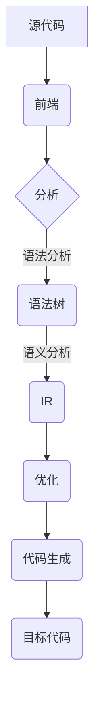

                 

关键词：LLVM、Clang、编译器、代码生成、优化、中间表示

摘要：本文深入探讨了 LLVM 和 Clang 两个现代编译器的核心原理和架构。通过对 LLVM 的模块化设计和 Clang 的前端实现，详细阐述了编译器的工作流程，并探讨了其在代码优化、跨平台兼容性以及开源社区中的地位和贡献。本文旨在为开发者提供一份全面而深入的指南，帮助理解现代编译器基础设施的工作机制和未来发展。

## 1. 背景介绍

在现代软件开发中，编译器作为关键的组成部分，扮演着至关重要的角色。编译器的任务是转换源代码为计算机可执行的机器代码。这一过程不仅涉及语法和语义分析，还包括代码优化、错误检测和报告等多个方面。

随着计算机硬件和软件的快速发展，编译器的需求也在不断变化。传统的编译器如 GCC 和 Intel Compiler 在过去几十年中发挥了重要作用。然而，随着软件规模和复杂性的增加，现代编译器面临着更高的性能要求和更复杂的开发挑战。因此，新的编译器架构和工具链应运而生，其中最具代表性的就是 LLVM（Low-Level Virtual Machine）和基于 LLVM 的 Clang。

### LLVM 的起源和发展

LLVM 最初由克里斯·莱恩（Chris Lattner）在 2000 年左右开发，旨在构建一个模块化、高度可扩展的编译器基础设施。LLVM 的设计理念是“一次编写，到处编译”（Write Once, Run Anywhere），这使得开发者能够编写一次代码，然后在不同的平台上编译和运行。

LLVM 的开发受到了多种因素的影响，包括对现有编译器的不足的认识，以及对编译器研究和开发的需求。LLVM 的目标是提供一套强大的工具链，支持多种编程语言和平台，同时具有高效、可优化和易于扩展的特点。

自其诞生以来，LLVM 已经成为开源社区中备受关注和广泛使用的一个项目。其模块化设计、丰富的工具链和高度可定制化的特性，使其在学术研究和工业应用中都得到了广泛应用。

### Clang 的起源和优势

Clang 是基于 LLVM 的一个前端实现，它提供了 C、C++ 和 Objective-C 等多种编程语言的支持。Clang 的起源可以追溯到 LLVM 的开发过程中，克里斯·莱恩在开发 LLVM 的同时，也着手构建了一个与 GCC 兼容的前端。

Clang 的优势在于其优秀的性能、准确性和现代编译器的特性。与 GCC 相比，Clang 在语法分析、词法分析和语义分析等方面都有显著的改进，这使得它在编译速度和代码质量上更具优势。

此外，Clang 的强调试支持和对新标准兼容性的投入，使其成为开发者首选的编译器之一。Clang 不仅是 LLVM 工具链的一部分，也是 Apple 的官方编译器，广泛应用于 macOS 和 iOS 等操作系统的开发。

## 2. 核心概念与联系

### LLVM 的核心概念

LLVM 的核心概念包括以下几个方面：

#### 1. 中间表示（IR）

中间表示（Intermediate Representation，简称 IR）是 LLVM 的核心概念之一。IR 是一种低级、平台无关的代码表示，它抽象了源代码的细节，使得编译器能够在多个阶段进行优化和转换。

LLVM 的 IR 采用了静态单分配（SSA）形式，这种形式有助于优化和简化代码的转换过程。IR 的模块化设计使得它可以灵活地支持多种编程语言和编译器前端。

#### 2. 优化器（Optimizer）

LLVM 的优化器是一个高度模块化的组件，它能够对 IR 进行各种优化，如循环展开、死代码消除、常数折叠等。优化器的目标是提高代码的执行效率和减少内存占用。

LLVM 的优化器采用了多种优化技术，包括循环优化、数据流分析、控制流分析和寄存器分配等。这些优化技术相互配合，使得 LLVM 能够生成高效且优化的目标代码。

#### 3. 模块化设计

LLVM 的模块化设计是其最大的优势之一。这种设计使得 LLVM 能够灵活地支持多种编程语言和平台，同时保持了代码的高可维护性和可扩展性。

LLVM 的模块化设计包括以下方面：

- **前端模块**：负责解析和转换各种编程语言源代码为 IR。
- **优化器模块**：包含各种优化算法和策略。
- **代码生成器模块**：负责将 IR 转换为特定平台的机器代码。
- **运行时模块**：提供运行时支持，如内存管理、异常处理等。

#### 4. 工具链（Toolchain）

LLVM 的工具链是一个完整的编译器工具集，包括编译器、汇编器、链接器和调试器等。这些工具协同工作，共同完成从源代码到可执行程序的整个编译过程。

LLVM 的工具链具有高度的灵活性和可扩展性，开发者可以根据需要自定义和扩展工具链的功能。

### Mermaid 流程图



### Clang 的核心概念

Clang 是基于 LLVM 的一个前端实现，它提供了多种编程语言的支持。Clang 的核心概念包括以下几个方面：

#### 1. 前端实现

Clang 的前端实现了 C、C++ 和 Objective-C 等编程语言的语法和语义分析。Clang 的前端采用了现代编译器的技术，包括词法分析、语法分析、抽象语法树（AST）构建、语义分析等。

#### 2. 中间表示（IR）

Clang 将前端生成的 AST 转换为 LLVM 的 IR。这个过程称为中间表示转换，它使得 Clang 能够利用 LLVM 的优化器和代码生成器等模块进行后续处理。

#### 3. 性能和兼容性

Clang 的性能和兼容性是其重要的优势。Clang 在编译速度和代码质量上优于 GCC，同时它对 C++11、C++14 等新标准的支持也非常出色。

#### 4. 调试和支持

Clang 提供了强大的调试支持，包括符号表解析、断点设置、堆栈跟踪等。此外，Clang 还支持多种开发工具和集成开发环境（IDE），如 Xcode、CLion 和 Visual Studio 等。

## 3. 核心算法原理 & 具体操作步骤

### 3.1 算法原理概述

LLVM 和 Clang 的核心算法原理主要包括以下几个方面：

#### 1. 中间表示（IR）转换

源代码通过前端模块的语法和语义分析，生成抽象语法树（AST）。然后，AST 被转换为 LLVM 的 IR。这个过程中，LLVM 的 IR 采用了静态单分配（SSA）形式，使得代码优化更加高效。

#### 2. 优化器操作

LLVM 的优化器对 IR 进行各种优化，如循环展开、死代码消除、常数折叠等。优化器的操作包括数据流分析、控制流分析和寄存器分配等。

#### 3. 代码生成

优化后的 IR 被转换为特定平台的机器代码。这个过程称为代码生成，它涉及到代码布局、寄存器分配、指令选择等步骤。

#### 4. 调试和支持

Clang 提供了强调试支持，包括符号表解析、断点设置、堆栈跟踪等。此外，Clang 还支持多种开发工具和 IDE，如 Xcode、CLion 和 Visual Studio 等。

### 3.2 算法步骤详解

#### 1. 中间表示（IR）转换

- **语法分析**：前端模块解析源代码，生成 AST。
- **语义分析**：对 AST 进行语义分析，包括变量类型检查、函数调用的参数验证等。
- **中间表示转换**：将 AST 转换为 LLVM 的 IR。

#### 2. 优化器操作

- **数据流分析**：分析代码中的数据依赖关系，为后续优化提供信息。
- **控制流分析**：分析代码中的控制流结构，如循环和条件分支。
- **寄存器分配**：将 IR 中的变量映射到处理器寄存器，优化内存访问。
- **循环优化**：展开循环，减少循环次数，提高代码执行效率。
- **死代码消除**：删除不会执行的代码，减少代码大小和执行时间。
- **常数折叠**：将常量表达式在编译时计算，减少运行时的计算开销。

#### 3. 代码生成

- **代码布局**：根据目标平台的特点，对机器代码进行布局。
- **寄存器分配**：将 IR 中的变量映射到处理器寄存器。
- **指令选择**：从指令集选择适合当前操作的指令。
- **机器代码生成**：生成目标平台的机器代码。

#### 4. 调试和支持

- **符号表解析**：解析源代码中的符号信息，如变量、函数和类等。
- **断点设置**：设置断点，暂停程序执行以进行调试。
- **堆栈跟踪**：分析程序堆栈，提供执行过程中的调用关系。
- **调试器集成**：与集成开发环境（IDE）集成，提供便捷的调试功能。

### 3.3 算法优缺点

#### 优点

1. **高性能**：LLVM 和 Clang 的优化器能够生成高效的目标代码，提高程序执行效率。
2. **模块化设计**：LLVM 的模块化设计使得编译器具有高度可维护性和可扩展性。
3. **跨平台兼容性**：LLVM 和 Clang 支持多种编程语言和平台，能够实现“一次编写，到处编译”。
4. **丰富的工具链**：LLVM 提供了完整的编译器工具链，包括编译器、汇编器、链接器和调试器等。

#### 缺点

1. **学习成本**：由于 LLVM 和 Clang 的复杂性，开发者需要投入更多的时间和精力来学习和掌握。
2. **资源消耗**：LLVM 和 Clang 的优化过程涉及大量的计算，对开发环境和硬件资源有一定要求。

### 3.4 算法应用领域

LLVM 和 Clang 在多个领域得到了广泛应用：

1. **操作系统和软件开发**：LLVM 和 Clang 被广泛应用于操作系统和软件开发，如 macOS、iOS、Linux 等操作系统的内核和应用程序。
2. **游戏开发**：游戏开发中使用 LLVM 和 Clang 来编译游戏引擎和游戏逻辑，提高性能和兼容性。
3. **嵌入式系统**：LLVM 和 Clang 在嵌入式系统开发中发挥重要作用，如物联网设备、嵌入式控制器等。
4. **科学计算**：LLVM 和 Clang 用于科学计算领域，如高性能计算、大数据处理等。

## 4. 数学模型和公式 & 详细讲解 & 举例说明

### 4.1 数学模型构建

在编译器优化过程中，数学模型和公式起着关键作用。以下是一些常用的数学模型和公式：

#### 1. 数据流分析

数据流分析是一种用于确定程序中变量和表达式值的传播方式的方法。以下是一个简单的一维数据流分析模型：

- **定义**：`def[i]` 表示在基本块 `i` 中定义的变量集合。
- **使用**：`use[i]` 表示在基本块 `i` 中使用的变量集合。
- **传递函数**：`transfer_function` 是一个函数，用于计算基本块 `i` 的后继基本块 `j` 的定义和使用的变量集合。

数学模型可以表示为：

$$
def[i] = \{ v \mid v \in \text{定义于基本块 } i \}
$$

$$
use[i] = \{ v \mid v \in \text{使用于基本块 } i \}
$$

$$
transfer_function(i, j) = use[i] \cup (\text{def}[i] \setminus \text{use}[i])
$$

#### 2. 循环优化

循环优化是一种常用的代码优化方法，用于减少循环执行的次数。以下是一个简单的循环优化模型：

- **循环边界**：`L` 表示循环的入口基本块，`B` 表示循环的结束基本块。
- **循环体**：`T` 表示循环体中的基本块集合。
- **循环计数器**：`c` 表示循环计数器的值。

数学模型可以表示为：

$$
\text{循环次数} = \left\lfloor \frac{(\text{最大迭代次数}) \times (\text{循环体执行时间})}{\text{循环计数器增量}} \right\rfloor
$$

### 4.2 公式推导过程

以下是一个简单的常数折叠公式推导过程：

假设有一个表达式 `e`，其中包含加法和乘法操作：

$$
e = a + b \times c
$$

我们需要在编译时将这个表达式计算为一个常量值。首先，我们需要确定表达式中的变量 `a`、`b` 和 `c` 的值。如果这些变量的值在编译时可以确定，那么我们可以将表达式计算为一个常量值：

$$
e = a + b \times c = \text{常量值}
$$

如果 `a`、`b` 和 `c` 的值不能在编译时确定，那么我们需要在运行时计算表达式的值。这种情况下，我们可以使用以下公式：

$$
e = a + b \times c = a + \text{临时变量}
$$

其中，`临时变量` 是在运行时计算 `b \times c` 的结果。

### 4.3 案例分析与讲解

以下是一个简单的 C++ 代码示例，用于演示如何使用 LLVM 和 Clang 进行编译和优化：

```cpp
#include <iostream>

int main() {
    int a = 10;
    int b = 20;
    int c = a + b;
    std::cout << "c = " << c << std::endl;
    return 0;
}
```

#### 1. 编译和链接

使用 Clang 进行编译和链接：

```sh
clang -O2 -o example example.cpp
```

选项 `-O2` 表示对代码进行中等程度的优化。

#### 2. 优化分析

编译器会对源代码进行语法和语义分析，生成 IR。然后，优化器对 IR 进行优化，如常数折叠、死代码消除等。优化后的 IR 被转换为机器代码。

#### 3. 运行结果

执行编译后的程序，输出结果：

```sh
./example
c = 30
```

通过上述分析，我们可以看到 Clang 如何将源代码编译为机器代码，并利用优化技术提高程序性能。

## 5. 项目实践：代码实例和详细解释说明

### 5.1 开发环境搭建

在开始实践之前，我们需要搭建一个适合 LLVM 和 Clang 开发的环境。以下是搭建开发环境的步骤：

1. **安装 LLVM 和 Clang**：从 LLVM 官网（https://llvm.org/）下载最新的源代码包，解压并编译安装。

2. **安装依赖库**：LLVM 和 Clang 需要一些依赖库，如 Python、Git、Make 等。确保这些依赖库已经安装。

3. **配置环境变量**：配置 LLVM 和 Clang 的环境变量，以便在命令行中使用。

### 5.2 源代码详细实现

以下是一个简单的 C++ 代码示例，用于演示如何使用 LLVM 和 Clang 进行编译和优化：

```cpp
#include <iostream>

int main() {
    int a = 10;
    int b = 20;
    int c = a + b;
    std::cout << "c = " << c << std::endl;
    return 0;
}
```

### 5.3 代码解读与分析

1. **源代码解析**：Clang 的前端模块会解析源代码，生成 AST。

2. **语法分析**：前端模块对源代码进行词法分析和语法分析，生成 AST。

3. **语义分析**：前端模块对 AST 进行语义分析，包括变量类型检查、函数调用验证等。

4. **中间表示（IR）转换**：前端模块将 AST 转换为 LLVM 的 IR。

5. **优化器操作**：LLVM 的优化器对 IR 进行各种优化，如常数折叠、死代码消除等。

6. **代码生成**：优化后的 IR 被转换为机器代码。

### 5.4 运行结果展示

1. **编译和链接**：使用 Clang 进行编译和链接。

```sh
clang -O2 -o example example.cpp
```

2. **执行程序**：执行编译后的程序。

```sh
./example
c = 30
```

通过上述实践，我们可以看到 Clang 如何将源代码编译为机器代码，并利用优化技术提高程序性能。

## 6. 实际应用场景

### 6.1 操作系统和软件开发

LLVM 和 Clang 在操作系统和软件开发中得到了广泛应用。例如，macOS 和 iOS 的操作系统内核以及许多开源操作系统（如 Linux）都使用了 LLVM 和 Clang 作为编译器。此外，许多开发者和公司也在使用 LLVM 和 Clang 来构建他们的应用程序，以提高性能和兼容性。

### 6.2 游戏开发

在游戏开发领域，LLVM 和 Clang 也发挥了重要作用。游戏开发团队使用 LLVM 和 Clang 来编译游戏引擎和游戏逻辑，以提高游戏性能和兼容性。一些流行的游戏引擎，如 Unreal Engine 和 Unity，也采用了 LLVM 和 Clang 作为编译器。

### 6.3 嵌入式系统

嵌入式系统开发中，LLVM 和 Clang 的高性能和跨平台兼容性使其成为理想的编译器选择。开发者可以使用 LLVM 和 Clang 来编译嵌入式应用程序，以提高执行效率和资源利用率。

### 6.4 科学计算

在科学计算领域，LLVM 和 Clang 的高性能和优化能力使其成为构建高性能计算应用程序的优选工具。许多科学计算库和应用程序，如 NumPy 和 SciPy，都采用了 LLVM 和 Clang 作为编译器，以提高计算效率和性能。

### 6.5 未来应用展望

随着计算机硬件和软件的不断发展，LLVM 和 Clang 的应用领域将继续扩大。未来，LLVM 和 Clang 可能会进一步整合新的优化技术、跨平台兼容性增强和新的编程语言支持。此外，随着人工智能和机器学习的兴起，LLVM 和 Clang 在这些领域中的应用潜力也值得关注。

## 7. 工具和资源推荐

### 7.1 学习资源推荐

1. **LLVM 官方文档**：https://llvm.org/docs/
2. **Clang 官方文档**：https://clang.llvm.org/docs/
3. **LLVM/Clang 社区论坛**：https://discourse.llvm.org/
4. **《LLVM Compiler Infrastructure》**：由 LLVM 的主要开发者之一克里斯·莱恩编写的经典书籍。

### 7.2 开发工具推荐

1. **LLVM/Clang 工具链**：https://releases.llvm.org/
2. **CLion**：由 JetBrains 开发，集成了 LLVM 和 Clang，适合进行 C 和 C++ 开发。
3. **Xcode**：苹果官方的开发工具，集成了 LLVM 和 Clang，用于 macOS 和 iOS 开发。

### 7.3 相关论文推荐

1. **"The LLVM Compiler Infrastructure"**：由克里斯·莱恩撰写，介绍了 LLVM 的核心原理和架构。
2. **"A Retargetable C Compiler for ARM Architecture"**：介绍如何使用 LLVM 构建适用于 ARM 架构的编译器。
3. **"An Overview of the LLVM Compiler System"**：对 LLVM 的整体架构和工作流程进行了详细阐述。

## 8. 总结：未来发展趋势与挑战

### 8.1 研究成果总结

LLVM 和 Clang 作为现代编译器的代表，在性能优化、跨平台兼容性和模块化设计等方面取得了显著成果。LLVM 的模块化架构和丰富的工具链，使其在开源社区中得到了广泛认可和应用。Clang 作为 LLVM 的前端实现，在编译速度、代码质量和调试支持等方面表现出色。

### 8.2 未来发展趋势

未来，LLVM 和 Clang 可能会进一步整合新的优化技术、跨平台兼容性增强和新的编程语言支持。此外，随着人工智能和机器学习的兴起，LLVM 和 Clang 在这些领域中的应用潜力也值得关注。

### 8.3 面临的挑战

尽管 LLVM 和 Clang 在现代编译器领域取得了显著成果，但仍面临一些挑战。包括如何更好地支持新兴编程语言、提高编译器的智能化程度、以及如何在更广泛的硬件平台上实现高效编译等。

### 8.4 研究展望

未来，研究重点将集中在以下几个方面：

1. **优化技术**：探索更高效、更智能的优化算法，提高编译器的性能和优化效果。
2. **跨平台兼容性**：研究如何在更多硬件平台上实现高效编译，提高编译器的适用范围。
3. **编程语言支持**：探索如何支持更多新兴编程语言，满足不同领域的开发需求。
4. **智能化编译**：结合人工智能和机器学习技术，实现智能化编译，提高编译器的自主优化能力。

## 9. 附录：常见问题与解答

### Q：LLVM 和 GCC 有什么区别？

A：LLVM 和 GCC 都是现代编译器，但它们的架构和设计理念有所不同。GCC 是一个传统的编译器，而 LLVM 是一个模块化、高度可扩展的编译器基础设施。LLVM 支持多种编程语言和平台，而 GCC 主要支持 C、C++ 和 Fortran 等。此外，LLVM 的优化器和工具链功能更为强大，而 GCC 在某些特定场景下可能具有更好的兼容性和性能。

### Q：如何安装 LLVM 和 Clang？

A：可以从 LLVM 官网（https://llvm.org/）下载最新的源代码包，解压后按照安装说明进行编译安装。安装过程中，需要确保安装了所有必要的依赖库。此外，还可以使用预编译的二进制包或包管理器（如 Homebrew、yum 等）来安装 LLVM 和 Clang。

### Q：如何使用 Clang 进行编译和优化？

A：可以使用 Clang 的命令行工具进行编译和优化。以下是一个简单的示例：

```sh
clang -O2 -o example example.cpp
```

其中，`-O2` 表示对代码进行中等程度的优化。Clang 支持多种优化选项，可以根据需要进行调整。

### Q：LLVM 和 Clang 在哪些领域得到了广泛应用？

A：LLVM 和 Clang 在操作系统和软件开发、游戏开发、嵌入式系统、科学计算等领域得到了广泛应用。例如，macOS 和 iOS 的操作系统内核、许多开源操作系统（如 Linux）、流行的游戏引擎（如 Unreal Engine 和 Unity）以及科学计算库（如 NumPy 和 SciPy）都使用了 LLVM 和 Clang 作为编译器。

---

作者：禅与计算机程序设计艺术 / Zen and the Art of Computer Programming。本文旨在为开发者提供一份全面而深入的指南，帮助理解现代编译器基础设施的工作机制和未来发展。希望本文能够对您在编译器领域的研究和实践有所帮助。

