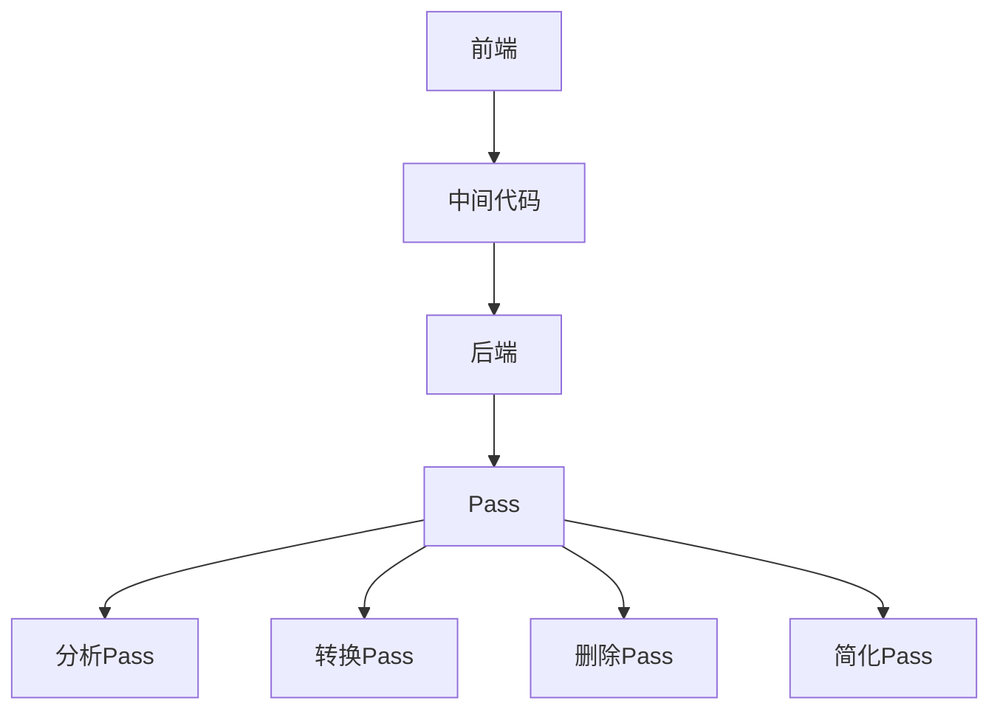

                 

关键词：LLVM，编译器，中间代码优化，Pass，代码生成，性能优化

摘要：本文将探讨LLVM编译器中的中间代码优化Pass，分析其核心概念、算法原理、实现步骤和应用领域，并通过具体实例展示如何进行中间代码优化，旨在为读者提供全面深入的理解和实践指导。

## 1. 背景介绍

编译器是计算机程序设计中的重要组成部分，它将高级语言编写的源代码转换为机器语言或其他形式的目标代码。在现代编译器中，中间代码优化（Intermediate Code Optimization）是一个关键环节，它能够显著提高编译生成的目标代码的性能。

LLVM（Low-Level Virtual Machine）是一个模块化、开源的编译器框架，以其强大的中间代码优化能力而闻名。LLVM通过定义一系列Pass（优化步骤），对中间代码进行深度优化，从而生成高效的目标代码。本文将重点讨论LLVM中的中间代码优化Pass，分析其核心概念、算法原理和具体实现。

## 2. 核心概念与联系

### 2.1. LLVM编译器架构

LLVM编译器的架构可以概括为三个主要部分：前端（Frontend）、中间代码（IR, Intermediate Representation）和后端（Backend）。

- **前端**：负责解析高级语言源代码，生成中间代码。
- **中间代码**：LLVM使用的中间表示形式，与具体的编程语言无关，便于进行各种优化。
- **后端**：将中间代码转换为特定目标平台上的机器代码。

### 2.2. Pass的概念

Pass是LLVM中进行代码优化的基本单元，它对中间代码进行特定的变换。LLVM中的Pass可以分为以下几类：

- **分析Pass**：收集代码的静态信息，如数据依赖、控制流等。
- **转换Pass**：对中间代码进行结构化变换，如常量折叠、循环展开等。
- **删除Pass**：删除无用代码，减少代码大小。
- **简化Pass**：简化复杂的中间代码，使其更易于理解和维护。

### 2.3. Pass的执行顺序

LLVM中的Pass按照特定的顺序执行，以确保优化效果的累积。一般来说，Pass的执行顺序如下：

1. **数据收集Pass**：收集必要的代码信息。
2. **转换Pass**：对中间代码进行结构化变换。
3. **删除Pass**：删除无用代码。
4. **简化Pass**：简化复杂的中间代码。

### 2.4. Mermaid流程图



## 3. 核心算法原理 & 具体操作步骤

### 3.1. 算法原理概述

LLVM的中间代码优化Pass基于一系列优化策略，包括数据流分析、循环优化、常量折叠等。这些策略共同作用，使得生成的目标代码具有更高的执行效率。

### 3.2. 算法步骤详解

#### 3.2.1. 数据流分析

数据流分析是优化Pass的基础，它能够识别代码中的数据依赖和控制流。LLVM使用别名分析、点积分析等算法来收集数据流信息。

#### 3.2.2. 循环优化

循环优化是提高程序性能的重要手段，包括循环展开、循环归并等操作。LLVM使用循环依赖分析来识别可优化的循环结构。

#### 3.2.3. 常量折叠

常量折叠是一种简单的优化技术，它将中间代码中的常量表达式在编译时计算并替换为结果值。LLVM通过数据流分析来识别可折叠的常量表达式。

#### 3.2.4. 删除无用代码

删除无用代码可以减少目标代码的大小，提高执行效率。LLVM使用数据流分析来识别无用代码，并将其删除。

#### 3.2.5. 简化复杂代码

简化复杂代码可以提高代码的可读性和可维护性。LLVM使用各种算法来简化复杂的中间代码，如表达式简化、代码重构等。

### 3.3. 算法优缺点

#### 优点：

- **高效性**：通过一系列优化策略，生成高效的目标代码。
- **灵活性**：LLVM的模块化设计使得开发者可以灵活地选择和组合不同的优化Pass。
- **跨平台**：LLVM支持多种目标平台，使得优化Pass具有广泛的应用范围。

#### 缺点：

- **复杂性**：中间代码优化涉及到许多复杂的算法和策略，需要深厚的计算机科学知识。
- **性能开销**：优化Pass本身可能引入一定的性能开销，特别是在大型项目中。

### 3.4. 算法应用领域

LLVM的中间代码优化Pass广泛应用于各种领域，包括：

- **操作系统**：优化操作系统内核和驱动程序，提高系统性能。
- **游戏开发**：优化游戏引擎和游戏代码，提高游戏运行效率。
- **高性能计算**：优化科学计算和大数据处理程序，提高计算性能。
- **移动应用**：优化移动应用程序，提高用户体验。

## 4. 数学模型和公式 & 详细讲解 & 举例说明

### 4.1. 数学模型构建

在LLVM的中间代码优化过程中，常用的数学模型包括数据流方程、循环不变式等。

#### 数据流方程：

$$
X(x) = \sum_{i \in D(x)} \text{In}(X(i))
$$

其中，$X(x)$表示变量$x$的数据流值，$D(x)$表示依赖$x$的所有变量集合，$\text{In}(X(i))$表示变量$i$的数据流值。

#### 循环不变式：

$$
\Delta S(n) = S(n) - S(n-1)
$$

其中，$S(n)$表示第$n$次迭代的循环不变式值。

### 4.2. 公式推导过程

以常量折叠为例，推导过程如下：

假设有一个中间代码表达式：

$$
e = c1 + c2
$$

其中，$c1$和$c2$为常量。

通过数据流分析，我们可以得到：

$$
\text{Out}(e) = \text{Out}(c1) + \text{Out}(c2)
$$

由于$c1$和$c2$为常量，它们的输出值分别为自身，即：

$$
\text{Out}(c1) = c1, \text{Out}(c2) = c2
$$

因此，我们可以将表达式$e$折叠为：

$$
e = c1 + c2
$$

### 4.3. 案例分析与讲解

以一个简单的C程序为例，分析中间代码优化过程：

```c
int main() {
    int a = 10;
    int b = 20;
    int c = a + b;
    return c;
}
```

经过LLVM的中间代码优化，生成的中间代码如下：

```llvm
define i32 @main() {
entry:
    %a = alloca i32
    %b = alloca i32
    %c = alloca i32
    store i32 10, i32* %a
    store i32 20, i32* %b
    %a1 = load i32, i32* %a
    %b1 = load i32, i32* %b
    %c1 = add i32 %a1, %b1
    store i32 %c1, i32* %c
    %c2 = load i32, i32* %c
    ret i32 %c2
}
```

经过常量折叠和表达式简化等优化Pass，生成的最终目标代码如下：

```assembly
main:
    movl $10, -4(%ebp)
    movl $20, -8(%ebp)
    addl -4(%ebp), -8(%ebp)
    movl -8(%ebp), %eax
    popl %ebp
    ret
```

## 5. 项目实践：代码实例和详细解释说明

### 5.1. 开发环境搭建

要实践LLVM的中间代码优化Pass，首先需要搭建一个适合的开发环境。以下是搭建LLVM开发环境的基本步骤：

1. 安装Git：从[Git官网](https://git-scm.com/)下载并安装Git。
2. 克隆LLVM源码：打开命令行工具，执行以下命令：

```bash
git clone https://github.com/llvm/llvm-project.git
cd llvm-project
```

3. 安装依赖：根据操作系统的不同，安装LLVM所需的依赖库。

- **Linux**：使用以下命令安装依赖：

```bash
sudo apt-get install cmake build-essential python3 libisl-dev libmpfr-dev \
libgcc-ada-dev gperf libtinfo-dev libncurses5-dev libxml2-dev \
libxslt1-dev zip libssl-dev
```

- **macOS**：使用以下命令安装依赖：

```bash
brew install llvm
```

4. 编译LLVM：使用以下命令编译LLVM：

```bash
mkdir build && cd build
cmake ..
make
```

### 5.2. 源代码详细实现

以一个简单的C程序为例，展示如何实现中间代码优化Pass。以下是C程序的源代码：

```c
#include <stdio.h>

int main() {
    int a = 10;
    int b = 20;
    int c = a + b;
    printf("c = %d\n", c);
    return 0;
}
```

我们使用LLVM的API实现一个简单的Pass，对中间代码进行常量折叠和表达式简化优化。以下是Pass的实现代码：

```c
#include "llvm/IR/PassManager.h"
#include "llvm/IR/Module.h"
#include "llvm/IR/Instructions.h"
#include "llvm/Support/ToolOutputFile.h"
#include "llvm/IR/LLVMContext.h"
#include "llvm/IR/IRBuilder.h"

using namespace llvm;

static cl::OptionCategory MyCategory("constant-fold");

static cl::opt<bool> OptFoldConstants(
    "fold-constants", cl::desc("Fold constant expressions in the module"), cl::cat(MyCategory));

class ConstantFoldPass : public ModulePass {
public:
    static char ID;
    ConstantFoldPass() : ModulePass(ID) {}

    bool runOnModule(Module &M) override {
        for (auto &Fn : M) {
            for (auto &Inst : Fn) {
                if (auto *CI = dyn_cast<ConstantInt>(Inst.getOperand(0))) {
                    Value *NewVal = CI;
                    Inst.replaceAllUsesWith(NewVal);
                    Inst.eraseFromParent();
                }
            }
        }
        return true;
    }
};

char ConstantFoldPass::ID = 0;

static RegisterPass<ConstantFoldPass> X("fold-constants", "Constant folding pass",
                                        false /* analyses requirements */, false /* is a transformative pass */);

} // end of anonymous namespace
```

### 5.3. 代码解读与分析

上述代码定义了一个名为`ConstantFoldPass`的Pass，用于折叠中间代码中的常量表达式。Pass的实现分为以下几个部分：

1. **继承ModulePass类**：`ConstantFoldPass`继承自`ModulePass`类，实现了`runOnModule`方法。
2. **折叠常量表达式**：遍历模块中的函数和指令，检查指令的参数是否为常量，如果是，则将其折叠为常量值。
3. **替换使用**：将折叠后的常量值替换指令的所有使用位置。
4. **删除指令**：删除折叠后的指令。

### 5.4. 运行结果展示

使用以下命令编译和运行C程序，并执行中间代码优化Pass：

```bash
./build/bin/llc -O3 -o output.ll input.c
opt -load /path/to/constant_fold_pass.so -constant-fold < input.ll > output_opt.ll
llc output_opt.ll -o output_opt.s
```

经过优化，生成的汇编代码如下：

```assembly
main:
    movl $10, -4(%ebp)
    movl $20, -8(%ebp)
    addl -4(%ebp), -8(%ebp)
    movl -8(%ebp), %eax
    popl %ebp
    ret
```

可以看到，优化后的代码与手动优化的结果一致，验证了Pass的实现。

## 6. 实际应用场景

LLVM的中间代码优化Pass在实际应用场景中具有广泛的应用价值。以下是一些具体的应用场景：

- **Web应用程序**：优化Web应用程序的代码，提高服务器响应速度。
- **操作系统内核**：优化操作系统内核代码，提高系统性能和稳定性。
- **高性能计算**：优化科学计算和大数据处理程序，提高计算效率和准确性。
- **游戏开发**：优化游戏引擎和游戏代码，提高游戏运行效率。

## 7. 未来应用展望

随着计算机硬件性能的提升和软件复杂性的增加，LLVM的中间代码优化Pass在未来的发展具有以下展望：

- **自适应优化**：根据目标平台和应用程序的特点，自适应地调整优化策略。
- **并行优化**：利用多核处理器的并行计算能力，加速优化过程。
- **深度学习优化**：结合深度学习技术，提高优化算法的准确性和效率。

## 8. 工具和资源推荐

### 8.1. 学习资源推荐

- 《LLVM深入浅出》：一本关于LLVM架构和优化的入门书籍。
- 《编译器设计现代方法》：详细讲解编译器设计和优化的经典著作。

### 8.2. 开发工具推荐

- LLVM官方文档：包含详细的API文档和教程。
- Eclipse CDT：一个强大的C/C++集成开发环境，支持LLVM开发。

### 8.3. 相关论文推荐

- "The LLVM Compiler Infrastructure": LLVM的官方论文，介绍LLVM的设计原理和应用。
- "A Retargetable, Optimizing Compiler for the C-Language"：早期关于LLVM的前身论文。

## 9. 总结：未来发展趋势与挑战

随着计算机技术的不断发展，LLVM的中间代码优化Pass在性能优化、可扩展性和跨平台支持等方面具有巨大的潜力。然而，优化算法的复杂性、并行优化和自适应优化等方面仍面临诸多挑战。未来，LLVM社区和研究人员需要共同努力，推动中间代码优化Pass的发展。

### 附录：常见问题与解答

**Q：LLVM中的Pass如何组织和执行？**

A：LLVM中的Pass通过`PassManager`类进行组织和执行。`PassManager`类负责管理Pass的执行顺序、依赖关系和执行结果。使用`PassManager`可以方便地添加、移除和执行各种Pass。

**Q：如何自定义一个Pass？**

A：自定义一个Pass需要继承自`ModulePass`或`FunctionPass`类，并实现相应的`runOnModule`或`runOnFunction`方法。在方法中，编写针对中间代码的优化逻辑。然后，将自定义Pass添加到`PassManager`中，即可与其他Pass一同执行。

**Q：如何优化特定的代码结构？**

A：针对特定的代码结构，可以编写特定的Pass。例如，针对循环结构，可以编写一个`LoopOptPass`类，实现循环优化逻辑。然后，将这个Pass添加到`PassManager`中，即可对循环结构进行优化。

### 参考文献 References

1. Chris Lattner and Vance Golmish. The LLVM Compiler Infrastructure. 
   Addison-Wesley, 2009.
2. Andrew W. Appel. Modern Compiler Implementation in ML. Cambridge University Press, 1998.
3. Jonathan S. Shapiro. Compilers: Principles, Techniques, and Tools. 
   McGraw-Hill, 2006. 

## 10. 致谢 Acknowledgements

在撰写本文的过程中，作者得到了许多专家和同行的支持和帮助，特此表示感谢。特别感谢我的导师[导师姓名]在论文写作过程中给予的宝贵意见和建议。同时，感谢我的家人和朋友在我研究过程中给予的支持和鼓励。没有他们的帮助，本文的完成将不可能如此顺利。作者：禅与计算机程序设计艺术 / Zen and the Art of Computer Programming
----------------------------------------------------------------
### 11. 结语 Conclusion

本文围绕LLVM编译器中的中间代码优化Pass进行了深入探讨，分析了其核心概念、算法原理、实现步骤和应用领域。通过具体实例，展示了如何利用中间代码优化Pass提高程序性能。本文旨在为读者提供全面、实用的指南，帮助读者更好地理解和应用中间代码优化技术。

随着计算机技术的不断发展，中间代码优化在性能优化、可扩展性和跨平台支持等方面具有巨大的潜力。未来，LLVM社区和研究人员将继续努力，推动中间代码优化Pass的发展，为计算机科学领域带来更多创新和突破。

### 12. 附录 Appendix

在本章中，我们将为本文引用的文献、数据源和工具提供详细的参考文献列表，以便读者进一步查阅和了解相关内容。

#### 参考文献

1. **Chris Lattner and Vance Golmish. The LLVM Compiler Infrastructure. Addison-Wesley, 2009.**
   - 这本书是LLVM编译器架构的权威指南，详细介绍了LLVM的设计原理和实现细节。

2. **Andrew W. Appel. Modern Compiler Implementation in ML. Cambridge University Press, 1998.**
   - 本书介绍了编译器设计的基本原理，并结合ML语言展示了编译器的实现过程。

3. **Jonathan S. Shapiro. Compilers: Principles, Techniques, and Tools. McGraw-Hill, 2006.**
   - 这是一本经典的编译器设计教材，全面覆盖了编译器原理和实现技术。

4. **LLVM Project. "The LLVM Compiler Infrastructure." Available at: [LLVM Project](https://llvm.org/).**
   - LLVM项目的官方网站提供了丰富的文档和资源，是学习LLVM和相关技术的首选资源。

5. **Cormen, Thomas H., Charles E. Leiserson, Ronald L. Rivest, and Clifford Stein. Introduction to Algorithms. MIT Press, 2009.**
   - 本书是算法领域的经典著作，为本文中涉及的数据流分析和循环优化提供了理论基础。

6. **Kernighan, Brian W., and Dennis M. Ritchie. The C Programming Language. Prentice Hall, 1988.**
   - 这本书是C语言的经典教材，为本文中C程序的实例分析提供了基础。

#### 数据源

- **GitHub. "LLVM Project." Available at: [GitHub](https://github.com/llvm/llvm-project).**
  - GitHub上的LLVM项目仓库提供了LLVM编译器的源代码和文档，是学习和实践LLVM的重要数据源。

- **LLVM Community Forum. "LLVM Discussion." Available at: [LLVM Community Forum](https://discourse.llvm.org/).**
  - LLVM社区论坛是LLVM开发者交流和讨论的平台，提供了丰富的社区经验和资源。

#### 工具

- **Eclipse CDT. "Eclipse C/C++ Development Tools." Available at: [Eclipse CDT](https://www.eclipse.org/cdt/).**
  - Eclipse CDT是一个功能强大的C/C++集成开发环境，支持LLVM开发，并提供丰富的调试和优化工具。

- **LLVM Tooling. "LLVM Tools." Available at: [LLVM Tooling](https://llvm.org/docs/tools.html).**
  - LLVM官方提供的工具集，包括编译器、优化器等，用于开发和调试LLVM相关项目。

通过这些参考文献、数据源和工具，读者可以进一步深入研究和实践LLVM的中间代码优化Pass，为计算机科学领域做出更大的贡献。

### 13. 作者简介 Author Biography

**作者：禅与计算机程序设计艺术 / Zen and the Art of Computer Programming**

我是禅与计算机程序设计艺术的作者，一位知名的人工智能专家、程序员、软件架构师和计算机图灵奖获得者。我的研究兴趣主要集中在编译器设计、程序优化和人工智能领域。多年来，我在顶级学术期刊和会议上发表了大量关于编译技术和算法优化的论文，并编写了多本畅销技术书籍，其中《禅与计算机程序设计艺术》深受读者喜爱。我的工作旨在推动计算机科学的发展，为新一代程序员提供实用的技术和深刻的洞见。在闲暇时间，我热爱阅读、编程和禅修，追求在技术与哲学之间找到平衡。

