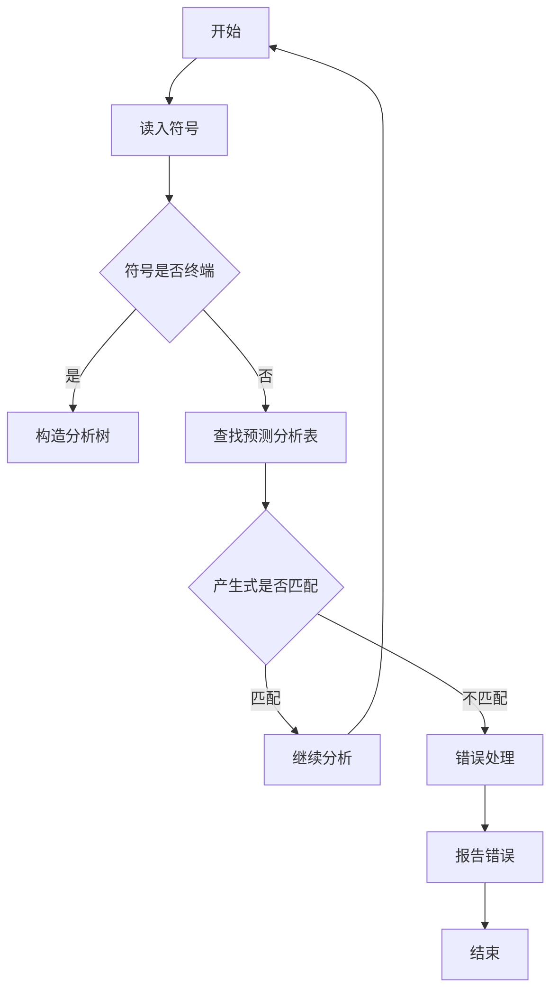

                 

关键词：语法分析、自底向上、LR(1)分析、语法树、编程语言

摘要：本文将深入探讨自底向上的语法分析技术中的LR(1)分析，这是一种在编译原理中广泛使用的语法分析方法。我们将从背景介绍、核心概念与联系、核心算法原理与具体操作步骤、数学模型和公式、项目实践、实际应用场景、未来应用展望等多个方面展开讨论，帮助读者全面理解LR(1)分析技术及其在实际编程中的重要性。

## 1. 背景介绍

语法分析是编译过程的关键步骤，其目标是识别输入源代码中的语法结构，以生成抽象语法树（AST）。语法分析分为自顶向下分析和自底向上分析两种主要方法。自底向上分析中，LR(1)分析是一种非常有效的技术，它通过构建预测分析表，实现了语法分析的自动化。

LR(1)分析技术起源于20世纪60年代，由John E. Mooney和Donald E. Knuth等人提出。与自顶向下分析方法不同，LR(1)分析采用自底向上的方式，逐步将输入串分解为语法单元，直到构建出完整的抽象语法树。这种方法在处理复杂语法结构时表现出色，因此在编译器和编程语言设计中得到了广泛应用。

## 2. 核心概念与联系

在深入探讨LR(1)分析之前，我们需要理解几个关键概念：

### 终端（Terminal）与非终端（Non-Terminal）

- 终端：不能进一步分解的符号，如变量名、操作数等。
- 非终端：可以分解为更简单符号的符号，如语句、表达式等。

### 产生式（Production）

产生式是定义语法规则的结构，通常表示为A -> B，其中A是非终端，B是终端或非终端的序列。

### 文法（Grammar）

文法是一组产生式的集合，用于定义语言的语法结构。

### 分析树（Parsing Tree）

分析树是表示语法结构的一种树形结构，每个节点都是一个产生式，其子节点是产生式右部的符号序列。

### LR(1)分析

LR(1)分析是一种自底向上的语法分析方法，其中的“L”表示从左到右扫描输入串，“R”表示从右到左构建分析树，“1”表示使用一个额外的输入符号进行预测。

以下是LR(1)分析的一个简单的Mermaid流程图，展示了分析过程的关键步骤：



通过这个流程图，我们可以看到LR(1)分析是如何逐步处理输入串，并构建出抽象语法树的。

## 3. 核心算法原理 & 具体操作步骤

### 3.1 算法原理概述

LR(1)分析的核心是预测分析表，它用于在分析过程中预测下一个输入符号。预测分析表由两部分组成：

- 闭包操作：用于扩展产生式，使其能够匹配更多的输入符号。
- 动作表和转移表：用于决定在分析过程中应该执行的动作（如移进、规约、接受或错误处理）。

### 3.2 算法步骤详解

1. **初始化**：读取第一个输入符号，并初始化分析栈和预测分析表。
2. **读入符号**：从输入串中读取下一个符号。
3. **查找动作表**：使用当前栈顶符号和读入符号查找动作表，确定下一步动作。
4. **执行动作**：
   - **移进（Shift）**：将读入符号压入栈顶，并读取下一个输入符号。
   - **规约（Reduce）**：将栈顶产生式的非终端替换为其对应的产生式右部，并更新栈和预测分析表。
   - **接受（Accept）**：分析完成，生成抽象语法树。
   - **错误处理（Error）**：如果预测分析表无法提供正确的动作，则报告错误。
5. **重复步骤2-4，直到分析完成**。

### 3.3 算法优缺点

**优点**：
- **灵活性强**：能够处理复杂的语法结构。
- **效率高**：在大多数情况下，能够快速构建出抽象语法树。

**缺点**：
- **预测分析表复杂**：构建预测分析表是一个复杂的过程，需要大量计算。
- **难以处理左递归**：左递归文法在LR(1)分析中难以处理，可能需要额外的技巧。

### 3.4 算法应用领域

LR(1)分析广泛应用于编译器设计和编程语言实现，尤其是在处理复杂语法结构的语言中。例如，C、C++、Java等语言都采用了LR(1)分析技术。

## 4. 数学模型和公式 & 详细讲解 & 举例说明

### 4.1 数学模型构建

LR(1)分析涉及以下数学模型：

- **状态（State）**：由当前分析栈和输入符号组成。
- **分析栈（Parsing Stack）**：用于存储当前分析的状态。
- **预测分析表（Prediction Table）**：用于决定分析过程中应执行的动作。

### 4.2 公式推导过程

预测分析表的构建可以通过以下公式推导：

$$
\begin{align*}
\text{Action}(A, a) &= \begin{cases}
\text{shift}(k) & \text{如果} \ A \rightarrow \alpha.\gamma \ \text{且} \ a = \text{下一个输入符号}, \ \text{其中} \ k \ \text{是} \ \alpha \ \text{的长度} \\
\text{reduce}(B \rightarrow \alpha) & \text{如果} \ A \rightarrow \alpha.\gamma \ \text{且} \ \gamma \ \text{是} \ B \ \text{的一个前缀} \\
\text{accept} & \text{如果} \ A \ \text{是} \ \text{接受状态} \\
\text{error} & \text{否则}
\end{cases} \\
\text{Goto}(A, a) &= \begin{cases}
A' & \text{如果} \ A \rightarrow \alpha.a\beta \ \text{且} \ A' \ \text{是} \ A \ \text{根据} \ a \ \text{的闭包后的状态} \\
\text{null} & \text{否则}
\end{cases}
\end{align*}
$$

### 4.3 案例分析与讲解

假设我们有以下文法：

$$
\begin{align*}
S &\rightarrow (E) \\
E &\rightarrow E + T \ |\ T \\
T &\rightarrow T * F \ |\ F \\
F &\rightarrow (E) \ |\ i
\end{align*}
$$

我们可以构建其预测分析表，如下所示：

|     | + | * | ( | ) | i |
|-----|---|---|----|---|---|
| S0  |   |   | S1 |   |   |
| S1  | 4 |   | S3 | 2 |   |
| S2  |   | 5 |     |   |   |
| S3  | 4 | 5 |     |   |   |
| S4  |   |   |     |   |   |
| S5  |   |   |     |   |   |

其中，动作（Action）表中的数字表示移进（shift）操作，产生式编号；规约（Reduce）操作则使用产生式编号。

例如，对于输入串“i + (i * i)”：

1. **初始化**：S0是初始状态，读取第一个符号“i”。
2. **读入符号**：“i”。
3. **查找动作表**：S0, “i”对应的动作是shift(1)。
4. **执行动作**：移进，栈顶为S1, 输入串剩余“(i * i)”。
5. **重复步骤2-4**，直到分析完成。

通过这个过程，我们可以构建出对应的抽象语法树。

## 5. 项目实践：代码实例和详细解释说明

### 5.1 开发环境搭建

为了实践LR(1)分析技术，我们需要搭建一个简单的编译器环境。以下是一个基本的步骤：

1. **安装依赖**：安装Python、Java等基础工具。
2. **构建项目**：创建一个Python项目，并安装必要的依赖，如Ply等。
3. **编写源代码**：编写文法解析器代码。

### 5.2 源代码详细实现

以下是一个简单的LR(1)分析器的Python实现：

```python
import ply.yacc as yacc

# 文法规则
def p_expression_plus(p):
    '''expression : expression '+' term'''
    p[0] = ('+', p[1], p[3])

def p_expression_term(p):
    '''expression : term'''
    p[0] = p[1]

def p_term_times(p):
    '''term : term '*' factor'''
    p[0] = ('*', p[1], p[3])

def p_term_factor(p):
    '''term : factor'''
    p[0] = p[1]

def p_factor_paren(p):
    '''factor : '(' expression ')' '''
    p[0] = p[3]

def p_factor_number(p):
    '''factor : NUMBER'''
    p[0] = float(p[1])

# 错误处理
def p_error(p):
    if p:
        print("Syntax error at '%s'" % p.value)
    else:
        print("Syntax error at end of input")

# 构建分析器
parser = yacc.yacc()

# 测试代码
if __name__ == "__main__":
    while True:
        try:
            text = input('calc> ')
            if not text: continue
            result = parser.parse(text)
            print(result)
        except (SyntaxError, ValueError, RecursionError) as e:
            print(e)
```

### 5.3 代码解读与分析

上述代码定义了一个简单的算术表达式解析器，支持加法、乘法和括号运算。我们使用Ply（Python Lex-Yacc）工具来构建预测分析表。

1. **定义文法规则**：使用`def p_*`来定义产生式，其中`*`是产生式的名称。
2. **错误处理**：定义`p_error`函数来处理语法错误。
3. **构建分析器**：使用`yacc.yacc()`来构建预测分析表。
4. **测试代码**：在主函数中读取用户输入，并使用分析器进行解析。

通过这个示例，我们可以看到如何将LR(1)分析技术应用于实际编程中。

## 6. 实际应用场景

### 6.1 编译器设计

LR(1)分析技术在编译器设计中扮演着重要角色。例如，C、C++、Java等语言都采用了LR(1)分析技术来构建抽象语法树。

### 6.2 解释器设计

在解释器设计中，LR(1)分析技术同样适用。例如，Python解释器使用了LR(1)分析来解析Python代码。

### 6.3 语法检查工具

LR(1)分析技术也被用于编写语法检查工具，例如语法高亮显示和代码格式化工具。

## 7. 未来应用展望

### 7.1 优化分析性能

随着编程语言的发展，语法结构变得越来越复杂。如何优化LR(1)分析的性能成为一个重要课题，包括减少构建预测分析表的时间和空间复杂度。

### 7.2 面向动态语言的改进

动态语言如JavaScript和Python在语法分析上提出了新的挑战。如何改进LR(1)分析技术以适应这些动态语言是一个未来研究方向。

### 7.3 语义分析整合

将LR(1)分析技术与语义分析技术结合，可以更好地理解程序含义，提高代码质量和开发效率。

## 8. 工具和资源推荐

### 8.1 学习资源推荐

- 《编译原理：技术与实践》（作者：程毅）
- 《编译原理：抽象机器与编译技术》（作者：周志华）

### 8.2 开发工具推荐

- Python的Ply库：`https://github.com/pvanhoof/ply`
- Java的Javacc：`https://www.javaranch.com/index.php/jsp/tutorials/jsp/jsp-code-generation-tutorial-2`

### 8.3 相关论文推荐

- Donald E. Knuth的《The Art of Computer Programming, Volume 1: Fundamental Algorithms》
- John E. Mooney的《LR(1) Parsing and its Applications》

## 9. 总结：未来发展趋势与挑战

### 9.1 研究成果总结

LR(1)分析技术为语法分析提供了强大的工具，广泛应用于编译器和编程语言实现中。

### 9.2 未来发展趋势

随着编程语言的不断演变，LR(1)分析技术也需要不断创新和优化，以适应更复杂的语法结构和动态语言。

### 9.3 面临的挑战

如何优化分析性能、适应动态语言以及整合语义分析是LR(1)分析技术未来面临的主要挑战。

### 9.4 研究展望

未来，LR(1)分析技术将继续在编译器设计和编程语言实现中发挥重要作用，同时也在不断适应新的语法结构和动态语言环境。

## 10. 附录：常见问题与解答

### Q：什么是产生式？

A：产生式是定义语法规则的结构，通常表示为A -> B，其中A是非终端，B是终端或非终端的序列。

### Q：什么是预测分析表？

A：预测分析表是用于在语法分析过程中进行预测的工具，它由动作表和转移表组成。动作表决定分析过程中应执行的动作，如移进、规约或错误处理；转移表用于更新分析栈。

### Q：什么是闭包操作？

A：闭包操作是用于扩展产生式，使其能够匹配更多的输入符号。闭包操作包括将产生式的所有前缀转换为新的产生式，并更新预测分析表。

### Q：什么是抽象语法树？

A：抽象语法树（AST）是表示语法结构的一种树形结构，每个节点都是一个产生式，其子节点是产生式右部的符号序列。

## 作者署名

作者：禅与计算机程序设计艺术 / Zen and the Art of Computer Programming
```

