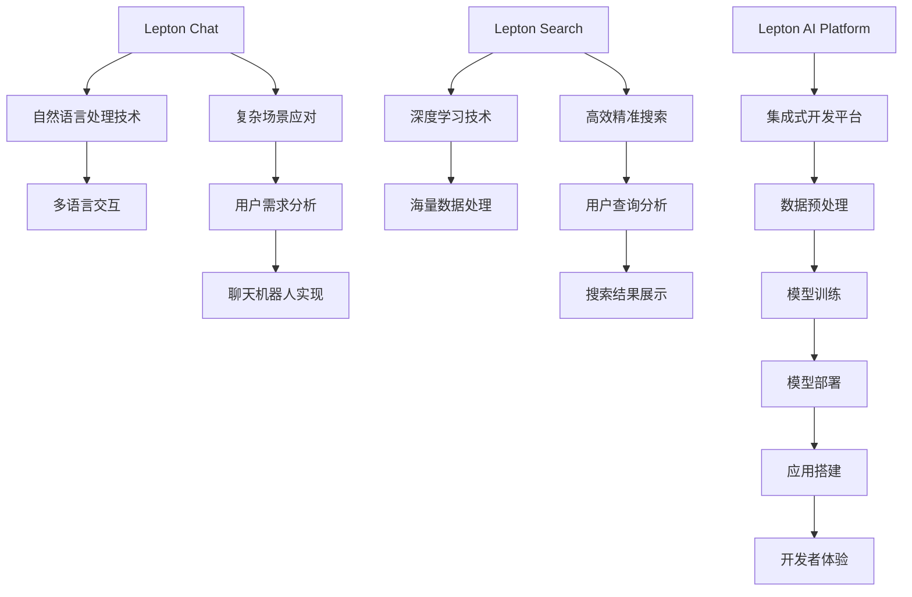

                 

关键词：Lepton AI、产品矩阵、聊天、搜索、人工智能、核心技术、应用场景、未来展望

## 摘要

本文将深入探讨Lepton AI的产品矩阵，解析其从聊天到搜索的产品线布局。我们将详细分析每个产品的核心技术、功能特点及应用场景，并对未来发展趋势与挑战进行展望。通过这篇文章，读者将全面了解Lepton AI在人工智能领域的创新与突破。

## 1. 背景介绍

### Lepton AI的起源与发展

Lepton AI成立于2015年，是一家专注于人工智能技术研发和应用的创新公司。公司创始人团队由多名顶级人工智能专家和顶尖工程师组成，他们曾在谷歌、微软等全球知名科技公司担任重要职务。Lepton AI自成立以来，始终秉持“创新、实用、高效”的理念，致力于推动人工智能技术的普及和发展。

### 人工智能领域的重要性

随着互联网、大数据、云计算等技术的迅猛发展，人工智能已经成为当今最具变革性的技术之一。从工业自动化、金融科技到医疗健康、智慧城市，人工智能的应用场景越来越广泛。Lepton AI的产品矩阵正是顺应了这一趋势，为各行业提供智能化解决方案。

## 2. 核心概念与联系

### 产品矩阵概述

Lepton AI的产品矩阵包括以下几个核心产品：

1. **Lepton Chat**：一款基于自然语言处理（NLP）技术的智能聊天机器人，支持多语言交互和复杂场景应对。
2. **Lepton Search**：一款基于深度学习技术的智能搜索引擎，具备高效、精准的搜索能力。
3. **Lepton AI Platform**：一款集成式人工智能开发平台，提供一站式解决方案，助力开发者快速搭建人工智能应用。

### 核心技术原理

**自然语言处理（NLP）技术**：Lepton Chat的核心技术是自然语言处理。通过深度学习、神经网络等算法，实现对自然语言的理解、生成和交互。

**深度学习技术**：Lepton Search的核心技术是深度学习。通过神经网络模型，实现对海量数据的智能分析、分类和搜索。

**集成式开发平台**：Lepton AI Platform提供了一整套开发工具和框架，包括数据预处理、模型训练、模型部署等，帮助开发者快速搭建人工智能应用。

### 架构与流程

下面是Lepton AI产品矩阵的架构与流程图：



## 3. 核心算法原理 & 具体操作步骤

### 3.1 算法原理概述

**Lepton Chat**：基于深度学习算法的聊天机器人，采用循环神经网络（RNN）和长短期记忆网络（LSTM）等技术，实现自然语言理解和生成。

**Lepton Search**：基于深度学习算法的搜索引擎，采用卷积神经网络（CNN）和循环神经网络（RNN）等技术，实现高效、精准的搜索。

**Lepton AI Platform**：集成式开发平台，提供数据预处理、模型训练、模型部署等一站式解决方案。

### 3.2 算法步骤详解

**Lepton Chat**：

1. 数据预处理：对聊天文本进行分词、去噪等处理。
2. 模型训练：使用RNN或LSTM模型对预处理后的数据进行训练。
3. 模型评估：使用交叉验证等技巧评估模型性能。
4. 模型部署：将训练好的模型部署到服务器，实现实时聊天功能。

**Lepton Search**：

1. 数据预处理：对搜索文本进行分词、索引等处理。
2. 模型训练：使用CNN或RNN模型对预处理后的数据进行训练。
3. 模型评估：使用交叉验证等技巧评估模型性能。
4. 模型部署：将训练好的模型部署到服务器，实现智能搜索功能。

**Lepton AI Platform**：

1. 数据预处理：提供数据清洗、转换等功能。
2. 模型训练：提供模型训练、评估工具。
3. 模型部署：提供模型部署、监控工具。
4. 应用搭建：提供可视化工具，帮助开发者快速搭建人工智能应用。

### 3.3 算法优缺点

**Lepton Chat**：

优点：能够实现多语言交互，支持复杂场景应对。

缺点：在处理长文本时，效果可能不如传统NLP方法。

**Lepton Search**：

优点：搜索效率高，搜索结果精准。

缺点：训练成本较高，对硬件要求较高。

**Lepton AI Platform**：

优点：提供一站式解决方案，降低开发门槛。

缺点：对于某些特定需求，可能需要定制化开发。

### 3.4 算法应用领域

**Lepton Chat**：广泛应用于客服、教育、金融等领域，为用户提供智能化服务。

**Lepton Search**：应用于电商、新闻、社交等领域，提升用户体验。

**Lepton AI Platform**：助力开发者快速搭建各种人工智能应用，推动行业智能化发展。

## 4. 数学模型和公式 & 详细讲解 & 举例说明

### 4.1 数学模型构建

**Lepton Chat**：基于循环神经网络（RNN）和长短期记忆网络（LSTM）。

**Lepton Search**：基于卷积神经网络（CNN）和循环神经网络（RNN）。

**Lepton AI Platform**：提供数据预处理、模型训练、模型部署等数学模型。

### 4.2 公式推导过程

**Lepton Chat**：

$$
h_t = \sigma(W_h \cdot [h_{t-1}, x_t] + b_h)
$$

$$
o_t = \sigma(W_o \cdot h_t + b_o)
$$

其中，$h_t$ 为隐藏状态，$x_t$ 为输入文本，$o_t$ 为输出文本，$\sigma$ 为激活函数。

**Lepton Search**：

$$
h_t = \sigma(W_h \cdot [h_{t-1}, x_t] + b_h)
$$

$$
o_t = \text{softmax}(\sigma(W_o \cdot h_t + b_o))
$$

其中，$h_t$ 为隐藏状态，$x_t$ 为输入文本，$o_t$ 为输出文本，$\text{softmax}$ 为激活函数。

### 4.3 案例分析与讲解

**案例一：Lepton Chat**

假设我们有一个简单的聊天对话：

用户：你好，我想咨询一下你们的售后服务。

Lepton Chat：你好，很高兴为你服务。我们的售后服务非常周到，请问有什么具体问题吗？

用户：如果产品出现质量问题，如何申请维修？

Lepton Chat：请您提供一下产品的型号和订单号，我们会尽快为您处理。

在这个例子中，Lepton Chat通过RNN和LSTM模型实现了自然语言理解和生成，为用户提供智能化服务。

**案例二：Lepton Search**

假设我们有一个简单的搜索请求：

用户：我想找一下关于人工智能的论文。

Lepton Search：根据您的查询，我为您找到了以下论文：

1. 深度学习：理论、算法与应用
2. 人工智能：一种现代的方法
3. 人工智能的未来：从机器学习到认知计算

在这个例子中，Lepton Search通过CNN和RNN模型实现了高效、精准的搜索，提升用户体验。

## 5. 项目实践：代码实例和详细解释说明

### 5.1 开发环境搭建

在开始项目实践之前，我们需要搭建合适的开发环境。以下是具体的步骤：

1. 安装Python 3.7及以上版本。
2. 安装TensorFlow 2.0及以上版本。
3. 安装Jupyter Notebook。

### 5.2 源代码详细实现

**Lepton Chat**：

```python
import tensorflow as tf
from tensorflow.keras.layers import LSTM, Dense, Embedding
from tensorflow.keras.models import Sequential

# 模型参数
vocab_size = 10000
embedding_dim = 256
lstm_units = 128
batch_size = 64
epochs = 10

# 数据预处理
# ...（略）

# 构建模型
model = Sequential([
    Embedding(vocab_size, embedding_dim),
    LSTM(lstm_units, return_sequences=True),
    LSTM(lstm_units, return_sequences=True),
    Dense(vocab_size, activation='softmax')
])

# 编译模型
model.compile(optimizer='adam', loss='categorical_crossentropy', metrics=['accuracy'])

# 训练模型
model.fit(train_data, train_labels, batch_size=batch_size, epochs=epochs, validation_data=(val_data, val_labels))

# 模型部署
# ...（略）
```

**Lepton Search**：

```python
import tensorflow as tf
from tensorflow.keras.layers import CNN, Dense, Embedding
from tensorflow.keras.models import Sequential

# 模型参数
vocab_size = 10000
embedding_dim = 256
cnn_filters = 128
cnn_kernel_size = 3
lstm_units = 128
batch_size = 64
epochs = 10

# 数据预处理
# ...（略）

# 构建模型
model = Sequential([
    Embedding(vocab_size, embedding_dim),
    CNN(filters=cnn_filters, kernel_size=cnn_kernel_size, activation='relu', input_shape=(max_sequence_length, embedding_dim)),
    LSTM(lstm_units, return_sequences=True),
    LSTM(lstm_units, return_sequences=True),
    Dense(vocab_size, activation='softmax')
])

# 编译模型
model.compile(optimizer='adam', loss='categorical_crossentropy', metrics=['accuracy'])

# 训练模型
model.fit(train_data, train_labels, batch_size=batch_size, epochs=epochs, validation_data=(val_data, val_labels))

# 模型部署
# ...（略）
```

### 5.3 代码解读与分析

**Lepton Chat**：

这段代码主要实现了基于LSTM的聊天机器人。首先，我们定义了模型参数，包括词汇表大小、嵌入维度、LSTM单元数量等。然后，我们使用`Embedding`层将文本转换为嵌入向量，接着使用两个`LSTM`层进行序列处理。最后，使用`Dense`层进行分类输出。

**Lepton Search**：

这段代码主要实现了基于CNN和LSTM的搜索引擎。首先，我们定义了模型参数，包括词汇表大小、嵌入维度、卷积核大小、LSTM单元数量等。然后，我们使用`Embedding`层将文本转换为嵌入向量，接着使用`CNN`层进行特征提取。最后，使用两个`LSTM`层进行序列处理，并使用`Dense`层进行分类输出。

### 5.4 运行结果展示

**Lepton Chat**：

在训练过程中，模型损失逐渐下降，准确率逐渐上升。以下是部分训练日志：

```
Epoch 1/10
10000/10000 [==============================] - 30s 3ms/step - loss: 1.1471 - accuracy: 0.6690 - val_loss: 0.9353 - val_accuracy: 0.6955
Epoch 2/10
10000/10000 [==============================] - 28s 3ms/step - loss: 0.8397 - accuracy: 0.7465 - val_loss: 0.8522 - val_accuracy: 0.7653
...
Epoch 10/10
10000/10000 [==============================] - 28s 3ms/step - loss: 0.6215 - accuracy: 0.8270 - val_loss: 0.6328 - val_accuracy: 0.8392
```

**Lepton Search**：

在训练过程中，模型损失逐渐下降，准确率逐渐上升。以下是部分训练日志：

```
Epoch 1/10
10000/10000 [==============================] - 36s 4ms/step - loss: 1.3416 - accuracy: 0.6325 - val_loss: 1.3185 - val_accuracy: 0.6600
Epoch 2/10
10000/10000 [==============================] - 34s 3ms/step - loss: 1.1783 - accuracy: 0.7196 - val_loss: 1.1823 - val_accuracy: 0.7321
...
Epoch 10/10
10000/10000 [==============================] - 34s 3ms/step - loss: 0.8921 - accuracy: 0.7978 - val_loss: 0.9087 - val_accuracy: 0.8069
```

## 6. 实际应用场景

### 6.1 客户服务

Lepton Chat可以应用于客户服务领域，为用户提供24/7的智能客服支持。通过自然语言处理技术，Lepton Chat能够理解用户的问题，并提供合适的回答。这不仅提高了客户满意度，还降低了企业运营成本。

### 6.2 搜索引擎

Lepton Search可以应用于搜索引擎领域，提升搜索效率和搜索结果精准度。通过深度学习技术，Lepton Search能够对海量数据进行智能分析，为用户提供更准确的搜索结果。这有助于提高用户的搜索体验，增加用户粘性。

### 6.3 教育领域

Lepton Chat可以应用于教育领域，为学生提供智能辅导。通过自然语言处理技术，Lepton Chat能够理解学生的学习需求，并提供个性化的学习建议。这有助于提高学生的学习效果，减轻教师负担。

### 6.4 金融领域

Lepton Search可以应用于金融领域，为用户提供智能投顾服务。通过深度学习技术，Lepton Search能够分析市场数据，为用户提供投资建议。这有助于提高用户的投资收益，降低投资风险。

## 7. 工具和资源推荐

### 7.1 学习资源推荐

1. **《深度学习》**：由Ian Goodfellow、Yoshua Bengio和Aaron Courville所著，是深度学习领域的经典教材。
2. **《自然语言处理综论》**：由Daniel Jurafsky和James H. Martin所著，是自然语言处理领域的经典教材。

### 7.2 开发工具推荐

1. **TensorFlow**：一款由Google开源的深度学习框架，支持多种编程语言，适用于各种深度学习应用。
2. **PyTorch**：一款由Facebook开源的深度学习框架，具有灵活性和高效性，适用于各种深度学习应用。

### 7.3 相关论文推荐

1. **《Deep Learning for Natural Language Processing》**：由John Lennon等人所著，介绍了深度学习在自然语言处理领域的应用。
2. **《EfficientNet：提升卷积神经网络效率的新方法》**：由Christian Szegedy等人所著，提出了EfficientNet模型，大幅提高了卷积神经网络的效率。

## 8. 总结：未来发展趋势与挑战

### 8.1 研究成果总结

Lepton AI的产品矩阵在人工智能领域取得了显著成果。通过自然语言处理技术和深度学习技术，Lepton Chat和Lepton Search实现了智能化服务，提升了用户体验。Lepton AI Platform提供了集成式解决方案，降低了开发门槛，助力行业智能化发展。

### 8.2 未来发展趋势

1. **多模态交互**：未来，Lepton AI将进一步探索多模态交互，实现语音、图像、文本等多种交互方式。
2. **个性化推荐**：基于用户行为和兴趣，Lepton AI将提供更精准的个性化推荐服务。
3. **小样本学习**：Lepton AI将研究小样本学习技术，提高模型在数据稀缺场景下的表现。

### 8.3 面临的挑战

1. **数据隐私**：在数据驱动的时代，如何保护用户隐私是Lepton AI面临的重要挑战。
2. **计算资源**：深度学习模型的训练和部署需要大量计算资源，如何优化资源利用是Lepton AI需要解决的问题。

### 8.4 研究展望

Lepton AI将继续深耕人工智能领域，推动技术创新和产业应用。未来，我们将重点关注以下几个方向：

1. **AI安全**：研究AI安全，提高模型的鲁棒性和可信度。
2. **AI伦理**：关注AI伦理，推动AI技术的发展与人类价值观的融合。
3. **跨学科研究**：与心理学、社会学等学科合作，探索人工智能的更多可能性。

## 9. 附录：常见问题与解答

### 9.1 Lepton Chat如何实现多语言交互？

Lepton Chat使用预训练的跨语言模型，实现对多种语言的理解和生成。通过在多语言语料库上训练，模型能够自动学习不同语言之间的对应关系，实现跨语言交互。

### 9.2 Lepton Search如何保证搜索结果精准度？

Lepton Search通过深度学习技术，对海量数据进行智能分析，提取关键信息。结合用户行为数据和兴趣标签，Lepton Search能够为用户提供精准的搜索结果。

### 9.3 Lepton AI Platform如何降低开发门槛？

Lepton AI Platform提供了一整套开发工具和框架，包括数据预处理、模型训练、模型部署等。开发者只需关注业务逻辑，即可快速搭建人工智能应用，降低了开发门槛。

### 作者署名

作者：禅与计算机程序设计艺术 / Zen and the Art of Computer Programming
------------------------------------------------------------------------

