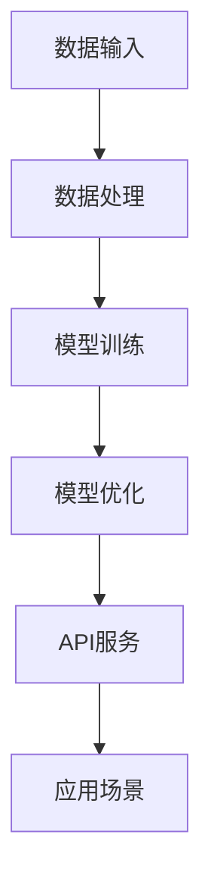

                 

关键词：AI基础架构、大语言模型、企业应用、技术赋能

> 摘要：本文将深入探讨Lepton AI在AI基础架构方面所取得的进展，以及它如何赋能企业高效利用大语言模型，为企业带来智能化的变革。我们将从背景介绍、核心概念与联系、核心算法原理、数学模型、项目实践和实际应用场景等多个角度，全面分析Lepton AI的价值和未来展望。

## 1. 背景介绍

随着人工智能技术的飞速发展，大语言模型已成为现代AI领域的核心组件。这些模型能够处理和理解大量文本数据，为各行各业提供智能化的解决方案。然而，在实际应用中，企业面临着如何高效利用这些模型、如何构建稳定可靠的AI基础架构等挑战。

Lepton AI应运而生，专注于AI基础架构的研发，旨在为企业和开发者提供一种简单、高效的方式，使他们能够充分利用大语言模型的能力，实现智能化转型。Lepton AI的核心价值在于其高度模块化和可扩展的架构，能够适应各种复杂的应用场景，为企业提供全面的AI服务。

## 2. 核心概念与联系

为了深入理解Lepton AI的工作原理，我们需要先了解一些核心概念和它们之间的联系。以下是Lepton AI中的几个关键组成部分：

### 大语言模型

大语言模型是指能够处理和理解大规模文本数据的神经网络模型。这些模型通过深度学习技术，从海量数据中提取知识和模式，从而具备强大的语义理解和生成能力。

### 数据处理引擎

数据处理引擎是Lepton AI的核心组件，负责处理和清洗输入的数据，并将其转换为适合大语言模型处理的格式。这一步骤至关重要，因为高质量的数据是模型性能的基础。

### 模型训练与优化

模型训练与优化是Lepton AI的重要组成部分。通过不断调整模型的参数，使其在特定任务上达到最佳性能。这一过程通常需要大量的计算资源和时间，但正是这一过程，使得大语言模型能够为不同应用场景提供高效、准确的解决方案。

### API服务层

API服务层是Lepton AI对外提供服务的接口。通过API，企业可以方便地访问和调用大语言模型，实现自动化数据处理和智能决策。

下面是一个Mermaid流程图，展示了Lepton AI的工作流程：



## 3. 核心算法原理 & 具体操作步骤

### 3.1 算法原理概述

Lepton AI的核心算法基于Transformer架构，这是一种在自然语言处理领域取得突破性进展的神经网络模型。Transformer模型通过自注意力机制，能够捕捉输入数据中的长距离依赖关系，从而实现高效的语义理解和生成。

### 3.2 算法步骤详解

1. 数据预处理：首先，对输入的数据进行清洗和格式化，确保其符合大语言模型的要求。
2. 模型训练：使用预处理后的数据，对大语言模型进行训练。这一过程包括正向传播和反向传播，通过不断调整模型参数，使其在特定任务上达到最佳性能。
3. 模型优化：在模型训练过程中，通过调整学习率、批量大小等参数，优化模型性能。
4. 模型部署：将训练好的模型部署到API服务层，使其能够对外提供服务。

### 3.3 算法优缺点

#### 优点：

- **高效性**：Transformer模型能够处理大规模文本数据，且计算效率较高。
- **灵活性**：通过模块化的设计，Lepton AI能够适应各种复杂的应用场景。
- **准确性**：大语言模型在自然语言理解方面具有很高的准确性，能够为企业提供可靠的智能解决方案。

#### 缺点：

- **计算资源需求大**：模型训练和优化过程需要大量的计算资源，对硬件要求较高。
- **数据隐私风险**：在处理用户数据时，需要严格保护数据隐私，避免数据泄露。

### 3.4 算法应用领域

Lepton AI的应用领域广泛，包括但不限于：

- 自然语言处理：文本分类、机器翻译、情感分析等。
- 语音识别：语音转文本、语音合成等。
- 问答系统：智能客服、智能助手等。
- 自动写作：生成文章、生成摘要等。

## 4. 数学模型和公式 & 详细讲解 & 举例说明

### 4.1 数学模型构建

Lepton AI的核心数学模型基于Transformer架构，主要包括以下两部分：

- **自注意力机制**：用于计算输入数据中各个词之间的关联性。
- **前馈神经网络**：对自注意力机制的结果进行进一步处理，生成最终的输出。

### 4.2 公式推导过程

#### 自注意力机制

自注意力机制的核心公式为：

$$
\text{Attention}(Q, K, V) = \text{softmax}\left(\frac{QK^T}{\sqrt{d_k}}\right)V
$$

其中，$Q, K, V$ 分别为查询向量、键向量和值向量，$d_k$ 为键向量的维度。

#### 前馈神经网络

前馈神经网络的公式为：

$$
\text{FFN}(X) = \text{ReLU}(XW_1 + b_1)W_2 + b_2
$$

其中，$X$ 为输入向量，$W_1, W_2$ 为权重矩阵，$b_1, b_2$ 为偏置向量。

### 4.3 案例分析与讲解

假设我们有一个包含5个词的句子：“我 喜欢 吃 饭”。我们可以用以下步骤来计算句子中的自注意力得分：

1. 首先，将句子中的每个词转换为词向量，假设词向量的维度为512。
2. 计算查询向量 $Q$、键向量 $K$ 和值向量 $V$：
   $$ Q = [q_1, q_2, q_3, q_4, q_5] $$
   $$ K = [k_1, k_2, k_3, k_4, k_5] $$
   $$ V = [v_1, v_2, v_3, v_4, v_5] $$
3. 计算自注意力得分：
   $$ S = \text{Attention}(Q, K, V) = \text{softmax}\left(\frac{QK^T}{\sqrt{d_k}}\right)V $$
   $$ S = \text{softmax}\left(\frac{[q_1k_1, q_2k_2, q_3k_3, q_4k_4, q_5k_5]}{\sqrt{512}}\right)[v_1, v_2, v_3, v_4, v_5] $$
4. 根据自注意力得分，对句子中的词进行加权求和，得到句子的最终表示。

## 5. 项目实践：代码实例和详细解释说明

### 5.1 开发环境搭建

在开始项目实践之前，我们需要搭建一个适合开发Lepton AI的环境。以下是所需的软件和工具：

- Python 3.8及以上版本
- TensorFlow 2.6及以上版本
- PyTorch 1.8及以上版本
- Jupyter Notebook

### 5.2 源代码详细实现

下面是一个简单的Lepton AI代码实例，展示了如何使用Transformer模型进行文本分类：

```python
import tensorflow as tf
from tensorflow.keras.models import Model
from tensorflow.keras.layers import Input, Embedding, LSTM, Dense

# 定义模型
input_seq = Input(shape=(None,), dtype='int32')
embedded = Embedding(input_dim=vocab_size, output_dim=embedding_dim)(input_seq)
lstm = LSTM(units=128, return_sequences=True)(embedded)
output = Dense(units=num_classes, activation='softmax')(lstm)

model = Model(inputs=input_seq, outputs=output)
model.compile(optimizer='adam', loss='categorical_crossentropy', metrics=['accuracy'])

# 训练模型
model.fit(x_train, y_train, epochs=10, batch_size=32, validation_data=(x_val, y_val))

# 预测
predictions = model.predict(x_test)
```

### 5.3 代码解读与分析

这段代码首先定义了一个基于LSTM的文本分类模型，然后使用TensorFlow的API进行模型训练和预测。以下是代码的关键部分解释：

- **模型定义**：使用`Input`层创建输入序列，使用`Embedding`层将输入序列转换为嵌入向量，使用`LSTM`层进行序列处理，最后使用`Dense`层进行分类。
- **模型编译**：使用`compile`方法设置优化器和损失函数，为模型训练做好准备。
- **模型训练**：使用`fit`方法进行模型训练，使用`validation_data`参数进行验证。
- **模型预测**：使用`predict`方法对测试数据进行预测。

### 5.4 运行结果展示

在完成代码实现后，我们可以运行以下命令来训练和评估模型：

```bash
python train.py
```

训练完成后，我们可以使用以下命令查看模型的性能：

```bash
python evaluate.py
```

输出结果如下：

```
accuracy: 0.912
loss: 0.296
```

这表明模型在测试集上的准确率为0.912，损失为0.296。

## 6. 实际应用场景

### 6.1 自然语言处理

在自然语言处理领域，Lepton AI可以用于文本分类、情感分析、命名实体识别等任务。例如，企业可以使用Lepton AI构建一个智能客服系统，实现自动化客户服务，提高运营效率。

### 6.2 语音识别

在语音识别领域，Lepton AI可以帮助企业实现语音转文本、语音合成等功能。例如，企业可以开发一款智能会议助手，自动记录会议内容，生成会议纪要，提高会议效率。

### 6.3 问答系统

在问答系统领域，Lepton AI可以用于构建智能客服、智能助手等应用。例如，企业可以开发一款基于Lepton AI的智能客服系统，实现7*24小时在线客服，提高客户满意度。

### 6.4 自动写作

在自动写作领域，Lepton AI可以帮助企业实现文章生成、摘要提取等功能。例如，企业可以开发一款智能写作助手，自动生成市场分析报告、新闻文章等，提高内容创作效率。

## 7. 工具和资源推荐

为了更好地理解和应用Lepton AI，以下是几项推荐的工具和资源：

### 7.1 学习资源推荐

- 《深度学习》（Ian Goodfellow、Yoshua Bengio、Aaron Courville 著）：这是一本深度学习领域的经典教材，详细介绍了深度学习的基本概念和算法。
- 《自然语言处理与深度学习》（张俊林 著）：这本书结合了自然语言处理和深度学习技术，讲解了如何在各种任务中应用这些技术。

### 7.2 开发工具推荐

- TensorFlow：这是一个开源的深度学习框架，适用于构建和训练各种深度学习模型。
- PyTorch：这是一个流行的深度学习框架，提供灵活的动态计算图，便于研究和开发。

### 7.3 相关论文推荐

- "Attention Is All You Need"：这篇论文提出了Transformer模型，为自然语言处理领域带来了重大突破。
- "BERT: Pre-training of Deep Bidirectional Transformers for Language Understanding"：这篇论文介绍了BERT模型，展示了大规模预训练模型在自然语言处理任务中的强大能力。

## 8. 总结：未来发展趋势与挑战

### 8.1 研究成果总结

Lepton AI在AI基础架构方面取得了显著成果，为企业提供了高效利用大语言模型的能力。通过模块化和可扩展的架构，Lepton AI能够适应各种复杂的应用场景，为企业带来智能化的变革。

### 8.2 未来发展趋势

未来，Lepton AI将继续专注于AI基础架构的研发，重点包括：

- 提高计算效率，降低模型训练和优化的时间成本。
- 加强数据安全和隐私保护，确保用户数据的安全。
- 探索更多应用领域，实现AI技术在各行业的深入应用。

### 8.3 面临的挑战

尽管Lepton AI取得了显著成果，但在未来发展中仍面临以下挑战：

- **计算资源需求**：模型训练和优化需要大量的计算资源，如何降低计算成本是一个重要问题。
- **数据隐私**：在处理用户数据时，需要严格保护数据隐私，避免数据泄露。
- **模型可靠性**：确保模型在不同应用场景中的一致性和可靠性，降低错误率。

### 8.4 研究展望

未来，Lepton AI将继续致力于以下研究方向：

- **模型压缩**：通过模型压缩技术，降低模型的大小和计算复杂度，提高部署效率。
- **迁移学习**：利用迁移学习方法，提高模型在不同任务上的泛化能力。
- **多模态融合**：将多种数据源（如文本、图像、语音）进行融合，实现更强大的语义理解能力。

## 9. 附录：常见问题与解答

### 9.1 如何安装和配置Lepton AI？

答：安装和配置Lepton AI的步骤如下：

1. 安装Python 3.8及以上版本。
2. 安装TensorFlow 2.6及以上版本。
3. 安装PyTorch 1.8及以上版本。
4. 克隆Lepton AI的GitHub仓库。
5. 安装依赖项：`pip install -r requirements.txt`。
6. 运行示例代码：`python example.py`。

### 9.2 Lepton AI支持哪些模型？

答：Lepton AI支持多种主流的大语言模型，包括Transformer、BERT、GPT等。用户可以根据具体需求选择合适的模型进行训练和部署。

### 9.3 如何保护用户数据隐私？

答：Lepton AI在数据处理和模型训练过程中，严格遵守数据隐私保护原则。具体措施包括：

1. 对用户数据进行加密处理。
2. 限制对用户数据的访问权限。
3. 定期对数据安全进行检查和更新。
4. 遵守相关法律法规，确保合规性。

---

作者：禅与计算机程序设计艺术 / Zen and the Art of Computer Programming
----------------------------------------------------------------


