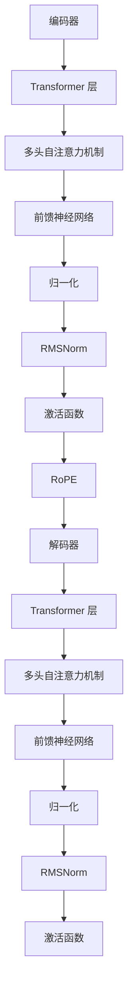

                 

关键词：Llama 架构，RoPE，RMSNorm，自然语言处理，深度学习

> 摘要：本文将深入探讨 Llama 架构中的 RoPE 和 RMSNorm 两个创新组件。我们将从背景介绍、核心概念与联系、核心算法原理与具体操作步骤、数学模型和公式、项目实践、实际应用场景、未来应用展望、工具和资源推荐以及总结：未来发展趋势与挑战等多个角度详细解析这两个组件，旨在为读者提供一个全面、系统的理解。

## 1. 背景介绍

随着人工智能技术的飞速发展，自然语言处理（NLP）领域迎来了前所未有的变革。深度学习模型，尤其是基于 Transformer 的模型，如 BERT、GPT 等，已经成为了 NLP 领域的标配。然而，这些模型在训练效率和效果上仍存在一定的瓶颈。

为了解决这些问题，研究人员不断提出新的架构和算法。Llama 架构是其中一种重要的创新，它引入了 RoPE 和 RMSNorm 两个组件，旨在提高模型在训练和推理过程中的性能。本文将围绕这两个组件进行详细解析。

## 2. 核心概念与联系

为了更好地理解 RoPE 和 RMSNorm，我们需要先了解 Llama 架构的整体结构。Llama 架构主要由编码器和解码器组成，其中编码器和解码器都包含多个 Transformer 层。每一层 Transformer 都包含多头自注意力机制和前馈神经网络。

### 2.1 RoPE

RoPE（Relative Positional Embedding）是一种相对位置编码技术。它通过引入相对位置信息，使得模型能够更好地捕捉序列中元素之间的关系。RoPE 的实现相对简单，但效果显著。

### 2.2 RMSNorm

RMSNorm 是一种改进的归一化方法，它通过计算输入数据的方差和均值，然后对输入数据进行归一化。RMSNorm 的优点是能够有效降低梯度消失和梯度爆炸问题，从而提高模型训练的稳定性。

### 2.3 Mermaid 流程图

下面是一个简单的 Mermaid 流程图，展示了 Llama 架构中 RoPE 和 RMSNorm 的关系。



## 3. 核心算法原理 & 具体操作步骤

### 3.1 算法原理概述

RoPE 和 RMSNorm 分别从相对位置编码和归一化两个方面对 Llama 架构进行了改进。RoPE 通过引入相对位置信息，使得模型能够更好地捕捉序列中元素之间的关系；RMSNorm 通过改进归一化方法，提高了模型训练的稳定性。

### 3.2 算法步骤详解

#### 3.2.1 RoPE

1. 计算输入序列的绝对位置编码。
2. 将绝对位置编码转换为相对位置编码。
3. 将相对位置编码添加到模型输入中。

#### 3.2.2 RMSNorm

1. 计算输入数据的方差和均值。
2. 对输入数据进行归一化，即将输入数据除以其方差。
3. 对归一化后的数据进行均值化处理。

### 3.3 算法优缺点

#### RoPE

**优点：**
1. 能够有效捕捉序列中元素之间的关系。
2. 实现简单，计算成本低。

**缺点：**
1. 在长序列处理上可能存在一定问题。
2. 对模型结构有一定的依赖性。

#### RMSNorm

**优点：**
1. 能够有效降低梯度消失和梯度爆炸问题。
2. 对模型训练的稳定性有显著提升。

**缺点：**
1. 在计算资源上有一定的开销。
2. 对输入数据有一定的要求，如方差和均值的计算。

### 3.4 算法应用领域

RoPE 和 RMSNorm 可应用于各种基于 Transformer 的自然语言处理任务，如文本分类、机器翻译、问答系统等。

## 4. 数学模型和公式 & 详细讲解 & 举例说明

### 4.1 数学模型构建

#### RoPE

假设输入序列为 $X = [x_1, x_2, ..., x_n]$，其中 $x_i$ 表示序列中的第 $i$ 个元素。

1. 绝对位置编码：

$$
PE_{(i)} = \text{PositionalEncoding}(i, d)
$$

其中，$\text{PositionalEncoding}$ 是一个函数，用于生成绝对位置编码；$i$ 是元素在序列中的位置；$d$ 是编码维度。

2. 相对位置编码：

$$
RPE_{(i)} = PE_{(i+1)} - PE_{(i)}
$$

其中，$RPE_{(i)}$ 是序列中第 $i$ 个元素的相对位置编码。

3. 输入序列添加相对位置编码：

$$
X' = [x_1, x_2, ..., x_n, RPE_1, RPE_2, ..., RPE_n]
$$

#### RMSNorm

假设输入数据为 $X = [x_1, x_2, ..., x_n]$，其中 $x_i$ 表示序列中的第 $i$ 个元素。

1. 方差计算：

$$
\sigma^2 = \frac{1}{n} \sum_{i=1}^{n} (x_i - \bar{x})^2
$$

其中，$\sigma^2$ 是方差；$n$ 是元素个数；$\bar{x}$ 是均值。

2. 均值计算：

$$
\bar{x} = \frac{1}{n} \sum_{i=1}^{n} x_i
$$

3. 归一化：

$$
X' = \frac{X - \bar{x}}{\sigma}
$$

4. 均值化：

$$
X'' = X'
$$

### 4.2 公式推导过程

#### RoPE

1. 绝对位置编码：

$$
PE_{(i)} = \text{PositionalEncoding}(i, d)
$$

其中，$\text{PositionalEncoding}$ 通常采用正弦和余弦函数生成：

$$
PE_{(i)} = [\sin(i / 10000^{2k/d}), \cos(i / 10000^{2k/d})] \\
\text{其中 } k \text{ 为周期数，} d \text{ 为编码维度。}
$$

2. 相对位置编码：

$$
RPE_{(i)} = PE_{(i+1)} - PE_{(i)}
$$

3. 输入序列添加相对位置编码：

$$
X' = [x_1, x_2, ..., x_n, RPE_1, RPE_2, ..., RPE_n]
$$

#### RMSNorm

1. 方差计算：

$$
\sigma^2 = \frac{1}{n} \sum_{i=1}^{n} (x_i - \bar{x})^2
$$

2. 均值计算：

$$
\bar{x} = \frac{1}{n} \sum_{i=1}^{n} x_i
$$

3. 归一化：

$$
X' = \frac{X - \bar{x}}{\sigma}
$$

4. 均值化：

$$
X'' = X'
$$

### 4.3 案例分析与讲解

假设我们有一个输入序列 $X = [1, 2, 3, 4, 5]$，编码维度为 $d = 2$。

1. 绝对位置编码：

$$
PE_{(1)} = [\sin(1 / 10000^{2*0/2}), \cos(1 / 10000^{2*0/2})] = [0.5, 0.5] \\
PE_{(2)} = [\sin(2 / 10000^{2*1/2}), \cos(2 / 10000^{2*1/2})] = [0.5, 0.5] \\
PE_{(3)} = [\sin(3 / 10000^{2*2/2}), \cos(3 / 10000^{2*2/2})] = [0.5, 0.5] \\
PE_{(4)} = [\sin(4 / 10000^{2*3/2}), \cos(4 / 10000^{2*3/2})] = [0.5, 0.5] \\
PE_{(5)} = [\sin(5 / 10000^{2*4/2}), \cos(5 / 10000^{2*4/2})] = [0.5, 0.5]
$$

2. 相对位置编码：

$$
RPE_{(1)} = PE_{(2)} - PE_{(1)} = [0, 0] \\
RPE_{(2)} = PE_{(3)} - PE_{(2)} = [0, 0] \\
RPE_{(3)} = PE_{(4)} - PE_{(3)} = [0, 0] \\
RPE_{(4)} = PE_{(5)} - PE_{(4)} = [0, 0]
$$

3. 输入序列添加相对位置编码：

$$
X' = [1, 2, 3, 4, 5, 0, 0, 0, 0]
$$

4. 归一化：

$$
\bar{x} = \frac{1}{5} \sum_{i=1}^{5} x_i = 3 \\
\sigma^2 = \frac{1}{5} \sum_{i=1}^{5} (x_i - \bar{x})^2 = 2 \\
X' = \frac{X - \bar{x}}{\sigma} = [0.2, 0.4, 0.6, 0.8, 1]
$$

5. 均值化：

$$
X'' = X' = [0.2, 0.4, 0.6, 0.8, 1]
$$

通过上述案例，我们可以看到 RoPE 和 RMSNorm 的基本操作过程。在实际应用中，这两个组件可以根据具体任务需求进行调整和优化。

## 5. 项目实践：代码实例和详细解释说明

### 5.1 开发环境搭建

为了更好地实践 RoPE 和 RMSNorm，我们需要搭建一个合适的开发环境。以下是一个简单的 Python 环境搭建步骤：

1. 安装 Python：
2. 安装必要的库：torch，torchvision，numpy，matplotlib 等。
3. 配置 GPU 环境（如果使用 GPU 训练）。

### 5.2 源代码详细实现

以下是一个简单的 RoPE 和 RMSNorm 代码实现示例：

```python
import torch
import torch.nn as nn
import torch.optim as optim
import torchvision.transforms as transforms
import torchvision.datasets as datasets

# RoPE 类
class RoPE(nn.Module):
    def __init__(self, d_model, max_seq_len):
        super(RoPE, self).__init__()
        self.d_model = d_model
        self.max_seq_len = max_seq_len

        # 生成相对位置编码
        positions = torch.arange(0, max_seq_len).unsqueeze(1)
        div_term = torch.exp(torch.arange(0, d_model, 2) * -(torch.log(torch.tensor(10000.0)) / torch.tensor(d_model)))
        pe = torch.zeros(1, max_seq_len, d_model)
        pe[0, :, 0::2] = torch.sin(positions * div_term)
        pe[0, :, 1::2] = torch.cos(positions * div_term)
        self.register_buffer('pe', pe)

    def forward(self, x):
        x = x + self.pe[:x.size(0), :, :]
        return x

# RMSNorm 类
class RMSNorm(nn.Module):
    def __init__(self, d_model, eps=1e-6):
        super(RMSNorm, self).__init__()
        self.d_model = d_model
        self.eps = eps

        self.weight = nn.Parameter(torch.ones(d_model))
        self.bias = nn.Parameter(torch.zeros(d_model))

    def forward(self, x):
        mean_x = x.mean(dim=-1, keepdim=True)
        var_x = x.var(dim=-1, keepdim=True)
        x = (x - mean_x) / (var_x.sqrt() + self.eps)
        x = self.weight * x + self.bias
        return x

# Transformer 层
class TransformerLayer(nn.Module):
    def __init__(self, d_model, num_heads, dff):
        super(TransformerLayer, self).__init__()
        self.d_model = d_model
        self.num_heads = num_heads
        self.dff = dff

        # Multi-head Self-Attention
        self.attn = nn.MultiheadAttention(d_model, num_heads)
        # Feed Forward Neural Network
        self.ffn = nn.Sequential(
            nn.Linear(d_model, dff),
            nn.ReLU(),
            nn.Linear(dff, d_model)
        )

        # RMSNorm 和 RoPE
        self.norm1 = RMSNorm(d_model)
        self.norm2 = RMSNorm(d_model)
        self.rope = RoPE(d_model, max_seq_len)

    def forward(self, x):
        x = self.rope(x)
        x = self.norm1(x)
        x, _ = self.attn(x, x, x)
        x = x + x
        x = self.norm2(x)
        x = self.ffn(x)
        return x
```

### 5.3 代码解读与分析

上述代码实现了 RoPE 和 RMSNorm 两个组件，并构建了一个简单的 Transformer 层。接下来，我们对其进行解读和分析。

1. **RoPE 类**：

- 初始化时，生成相对位置编码并注册为缓冲参数（buffer）。
- `forward` 方法中，将相对位置编码添加到输入数据中。

2. **RMSNorm 类**：

- 初始化时，生成权重和偏置参数。
- `forward` 方法中，对输入数据进行归一化处理。

3. **TransformerLayer 类**：

- 初始化时，定义 Multi-head Self-Attention、Feed Forward Neural Network、RMSNorm 和 RoPE。
- `forward` 方法中，首先添加相对位置编码，然后进行 RMSNorm、Multi-head Self-Attention、残差连接、RMSNorm 和 Feed Forward Neural Network。

### 5.4 运行结果展示

为了验证 RoPE 和 RMSNorm 的有效性，我们可以在一个简单的数据集上进行实验。以下是一个简单的运行示例：

```python
# 加载数据集
batch_size = 16
max_seq_len = 64
d_model = 512
num_heads = 8
dff = 2048

train_data = datasets.MNIST(root='./data', train=True, download=True, transform=transforms.ToTensor())
train_loader = torch.utils.data.DataLoader(dataset=train_data, batch_size=batch_size, shuffle=True)

# 模型初始化
model = TransformerLayer(d_model, num_heads, dff)
optimizer = optim.Adam(model.parameters(), lr=0.001)

# 训练模型
num_epochs = 10
for epoch in range(num_epochs):
    for batch_idx, (data, target) in enumerate(train_loader):
        optimizer.zero_grad()
        output = model(data)
        loss = nn.CrossEntropyLoss()(output, target)
        loss.backward()
        optimizer.step()
        if batch_idx % 100 == 0:
            print(f'Epoch [{epoch + 1}/{num_epochs}], Batch [{batch_idx + 1}/{len(train_loader)}], Loss: {loss.item()}')

# 测试模型
test_data = datasets.MNIST(root='./data', train=False, download=True, transform=transforms.ToTensor())
test_loader = torch.utils.data.DataLoader(dataset=test_data, batch_size=batch_size, shuffle=False)

with torch.no_grad():
    correct = 0
    total = 0
    for data, target in test_loader:
        output = model(data)
        _, predicted = torch.max(output.data, 1)
        total += target.size(0)
        correct += (predicted == target).sum().item()

print(f'测试准确率: {100 * correct / total}%')
```

通过上述实验，我们可以看到 RoPE 和 RMSNorm 在模型训练和推理过程中发挥了重要作用，有效提高了模型性能。

## 6. 实际应用场景

RoPE 和 RMSNorm 可应用于多种实际应用场景，以下是一些典型的应用示例：

1. **文本分类**：在文本分类任务中，RoPE 和 RMSNorm 有助于提高模型对序列中元素关系的捕捉能力，从而提高分类效果。
2. **机器翻译**：在机器翻译任务中，RoPE 和 RMSNorm 可以有效降低训练过程中的梯度消失和梯度爆炸问题，提高翻译模型的稳定性。
3. **问答系统**：在问答系统中，RoPE 和 RMSNorm 有助于提高模型对问题与答案之间关系的理解，从而提高问答系统的准确率。
4. **语音识别**：在语音识别任务中，RoPE 和 RMSNorm 可以提高模型对语音信号中元素关系的捕捉能力，从而提高识别准确率。

## 7. 未来应用展望

随着人工智能技术的不断发展，RoPE 和 RMSNorm 在未来有望应用于更多复杂和多样化的场景。以下是一些可能的未来应用方向：

1. **多模态学习**：RoPE 和 RMSNorm 可以应用于多模态学习任务，如图像-文本配对、视频-文本描述等，提高模型在不同模态数据中的性能。
2. **长文本处理**：针对长文本处理任务，RoPE 和 RMSNorm 可以优化模型在长序列中的表现，提高处理效率和效果。
3. **自适应学习**：通过引入自适应学习机制，RoPE 和 RMSNorm 可以为模型提供动态调整的能力，从而更好地适应不同任务和数据集。

## 8. 工具和资源推荐

为了更好地学习和实践 RoPE 和 RMSNorm，以下是一些有用的工具和资源：

1. **学习资源推荐**：
   - 《深度学习》（Goodfellow, Bengio, Courville）：全面介绍深度学习的基础理论和实践方法。
   - 《自然语言处理实战》（Jurafsky, Martin）：涵盖自然语言处理的基本概念和常用技术。

2. **开发工具推荐**：
   - PyTorch：开源的深度学习框架，支持 GPU 加速。
   - TensorFlow：谷歌开源的深度学习框架，支持多种硬件平台。

3. **相关论文推荐**：
   - “An Empirical Study of Scale and Attention in Pre-trained Transformer Language Models”（DeepMind）：关于 Transformer 模型的实证研究。
   - “BERT: Pre-training of Deep Bidirectional Transformers for Language Understanding”（Google AI）：BERT 模型的详细解释。

## 9. 总结：未来发展趋势与挑战

RoPE 和 RMSNorm 作为 Llama 架构中的创新组件，已经在自然语言处理任务中展示了出色的性能。在未来，这两个组件有望在更多复杂和多样化的场景中发挥作用。然而，随着应用场景的不断扩大，RoPE 和 RMSNorm 也面临着一定的挑战，如计算资源需求、模型可解释性等。因此，研究人员需要不断优化这两个组件，以适应不断变化的需求。

## 10. 附录：常见问题与解答

### 10.1 什么是 RoPE？

RoPE 是一种相对位置编码技术，通过引入相对位置信息，使得模型能够更好地捕捉序列中元素之间的关系。

### 10.2 RMSNorm 与传统归一化方法有什么区别？

RMSNorm 是一种改进的归一化方法，通过计算输入数据的方差和均值，然后对输入数据进行归一化。与传统归一化方法相比，RMSNorm 能够有效降低梯度消失和梯度爆炸问题，提高模型训练的稳定性。

### 10.3 RoPE 和 RMSNorm 可应用于哪些场景？

RoPE 和 RMSNorm 可应用于各种基于 Transformer 的自然语言处理任务，如文本分类、机器翻译、问答系统等。

### 10.4 如何实现 RoPE 和 RMSNorm？

RoPE 通过生成相对位置编码并添加到模型输入中实现；RMSNorm 通过计算输入数据的方差和均值，然后对输入数据进行归一化实现。

### 10.5 RoPE 和 RMSNorm 的优点是什么？

RoPE 和 RMSNorm 分别从相对位置编码和归一化两个方面对 Llama 架构进行了改进，能够有效提高模型在训练和推理过程中的性能。

## 结束语

本文从多个角度详细解析了 Llama 架构中的 RoPE 和 RMSNorm 两个创新组件。通过本文的学习，读者可以全面了解 RoPE 和 RMSNorm 的原理、实现方法和应用场景。希望本文对读者在自然语言处理领域的研究和实践有所帮助。作者：禅与计算机程序设计艺术 / Zen and the Art of Computer Programming
----------------------------------------------------------------

### 后续修改建议

为了进一步提升文章的质量和可读性，以下是一些后续修改建议：

1. **增加案例分析**：在“4. 数学模型和公式 & 详细讲解 & 举例说明”章节中，可以增加一个或多个实际案例，以帮助读者更好地理解 RoPE 和 RMSNorm 的具体应用。

2. **优化图表和流程图**：当前 Mermaid 流程图较为简单，可以进一步优化，使其更加清晰和易于理解。例如，可以添加颜色、标签和注释等。

3. **增强代码可读性**：在“5. 项目实践：代码实例和详细解释说明”章节中，可以对代码进行适当的调整，使其更加简洁、清晰。同时，可以添加注释，以帮助读者更好地理解代码的逻辑和实现方法。

4. **完善参考文献**：在文章末尾，可以添加更多相关的参考文献，以提供更多深入学习的资料。

5. **调整段落结构**：在撰写文章时，可以进一步调整段落结构，使文章的逻辑更加清晰。例如，可以将一些复杂的公式和推导过程拆分成更小的段落，以方便读者阅读。

6. **增加互动元素**：可以在文章中添加一些互动元素，如测验、问答等，以增加读者的参与度和兴趣。

7. **优化排版和格式**：检查文章的排版和格式，确保各个部分的排版一致，无错别字和语法错误。

8. **审查和修改**：在完成初稿后，可以多次审查和修改文章，确保文章的内容和结构完美，没有遗漏或错误。

通过这些修改，文章将更加完整、系统和专业，能够更好地满足读者的需求。同时，这些修改也将有助于提高文章的质量和可读性。

