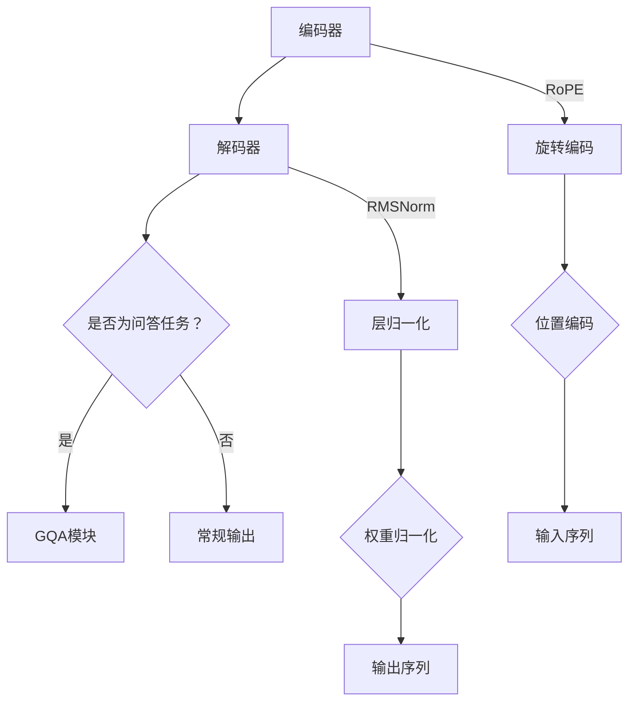

                 

关键词：Llama模型、RoPE、RMSNorm、GQA、AI、算法原理、数学模型、项目实践、应用场景、未来展望

摘要：本文旨在深入解析Llama模型中的RoPE、RMSNorm与GQA三个关键组件，探讨它们的工作原理、具体操作步骤、优缺点及应用领域。通过对这些技术的详细阐述，读者可以全面了解Llama模型的架构，为在实际项目中的应用提供理论支持。

## 1. 背景介绍

近年来，人工智能（AI）技术的飞速发展，特别是深度学习算法的不断进步，极大地推动了自然语言处理（NLP）领域的创新。Llama模型作为一种先进的NLP模型，凭借其卓越的性能和广泛的适用性，受到了业界的广泛关注。本文将聚焦于Llama模型中的三个核心组件：RoPE、RMSNorm与GQA，通过详细解析这些组件，帮助读者深入理解Llama模型的运作机制。

### Llama模型的背景信息

Llama模型是由OpenAI团队研发的一种基于Transformer架构的预训练模型，它在自然语言理解、生成和翻译等方面展现出了强大的能力。Llama模型的特点在于其灵活性和可扩展性，能够适应各种NLP任务，从而成为AI研究者和开发者的首选工具。

### RoPE、RMSNorm与GQA的核心地位

RoPE（Rotary Positional Embeddings）是一种创新的嵌入技术，用于解决Transformer模型中的序列位置信息问题；RMSNorm是一种优化的层归一化方法，旨在提高模型的训练效率和稳定性；GQA（General Question-Answering）模块则专注于处理复杂的问题回答任务，使得Llama模型在问答系统中的应用更加出色。这三个组件共同构成了Llama模型的核心框架，对模型的性能和适用性起到了至关重要的作用。

## 2. 核心概念与联系

### 2.1 核心概念

在深入探讨RoPE、RMSNorm与GQA之前，我们需要先了解一些核心概念，包括Transformer模型的结构、序列位置信息的重要性以及归一化技术的原理。

#### Transformer模型结构

Transformer模型是一种基于自注意力机制的深度神经网络，广泛应用于NLP任务。它由编码器（Encoder）和解码器（Decoder）两部分组成，其中编码器负责处理输入序列，解码器则生成输出序列。Transformer模型通过多头注意力机制、位置编码和层归一化等技术，实现了对序列信息的有效建模。

#### 序列位置信息

序列位置信息是NLP任务中不可或缺的一部分，它能够帮助模型理解句子中各个单词的相对位置和关系。然而，传统的循环神经网络（RNN）在处理长序列时存在梯度消失或爆炸等问题，而Transformer模型通过位置编码（Positional Encoding）解决了这一问题，使得模型能够捕捉到序列中的位置信息。

#### 归一化技术

归一化技术是神经网络中常用的优化方法，旨在提高模型的训练效率和收敛速度。常见的归一化方法包括层归一化（Layer Normalization）和权重归一化（Weight Normalization）。RMSNorm则是基于层归一化的改进版本，通过动态调整归一化参数，进一步提高了模型的稳定性。

### 2.2 架构联系

RoPE、RMSNorm与GQA在Llama模型中扮演着不同的角色，但它们之间的联系十分紧密。

- **RoPE与序列位置信息：** RoPE通过旋转编码（Rotary Encoding）技术，将序列位置信息编码到模型中，弥补了Transformer模型在位置信息处理上的不足。
- **RMSNorm与层归一化：** RMSNorm作为一种优化的层归一化方法，能够动态调整归一化参数，提高了模型的训练稳定性和效率，与RoPE的位置编码形成了良好的互补。
- **GQA与问答系统：** GQA模块专注于处理复杂的问题回答任务，通过结合RoPE和RMSNorm，使得Llama模型在问答系统的表现更加出色。

### 2.3 Mermaid流程图

以下是一个描述Llama模型架构的Mermaid流程图，展示了RoPE、RMSNorm与GQA在模型中的关系：



通过上述Mermaid流程图，我们可以更直观地理解RoPE、RMSNorm与GQA在Llama模型中的架构和作用。

## 3. 核心算法原理 & 具体操作步骤

### 3.1 算法原理概述

#### RoPE：旋转位置编码

RoPE（Rotary Positional Embeddings）是一种创新的嵌入技术，通过旋转编码的方式将序列位置信息编码到模型中。RoPE的原理是将位置向量分解为实部和虚部，利用复数旋转特性进行编码，从而提高位置编码的灵活性和表达能力。

#### RMSNorm：动态层归一化

RMSNorm（Root Mean Square Layer Normalization）是对传统层归一化的优化版本。RMSNorm通过动态调整归一化参数，使得模型在不同训练阶段保持稳定，从而提高训练效率和收敛速度。

#### GQA：通用问答模块

GQA（General Question-Answering）模块专注于处理复杂的问题回答任务。GQA通过结合RoPE和RMSNorm，使得Llama模型在问答系统的表现更加出色，能够准确理解问题并生成高质量的回答。

### 3.2 算法步骤详解

#### 3.2.1 RoPE步骤详解

1. **输入序列处理：** 将输入序列转换为词向量表示。
2. **位置编码生成：** 根据序列长度生成位置编码向量。
3. **旋转编码：** 将位置编码向量分解为实部和虚部，进行旋转编码。
4. **嵌入向量合并：** 将旋转编码后的向量与词向量进行拼接，得到最终的嵌入向量。

#### 3.2.2 RMSNorm步骤详解

1. **输入序列处理：** 与RoPE相同，将输入序列转换为词向量表示。
2. **层归一化计算：** 根据当前层的梯度信息，动态调整归一化参数。
3. **归一化操作：** 对词向量进行归一化处理，使其满足一定的分布特性。
4. **激活函数应用：** 对归一化后的词向量应用激活函数，如ReLU或Sigmoid。

#### 3.2.3 GQA步骤详解

1. **问题处理：** 对输入问题进行预处理，包括词向量化、句法分析和语义理解等。
2. **编码器解码器交互：** 编码器和解码器通过自注意力机制进行交互，生成中间表示。
3. **回答生成：** 解码器根据中间表示生成答案，并通过注意力机制关注关键信息。

### 3.3 算法优缺点

#### RoPE优缺点

- **优点：**
  - 提高位置编码的灵活性和表达能力。
  - 有效解决Transformer模型在序列位置信息处理上的不足。
- **缺点：**
  - 旋转编码的计算复杂度较高，对硬件资源有一定要求。
  - 旋转编码对数据集的依赖性较强，可能影响模型的泛化能力。

#### RMSNorm优缺点

- **优点：**
  - 提高层归一化的稳定性和效率。
  - 降低训练过程中的梯度消失和爆炸现象。
- **缺点：**
  - 动态调整归一化参数可能引入额外的计算开销。
  - 在某些情况下，RMSNorm可能不如传统的层归一化稳定。

#### GQA优缺点

- **优点：**
  - 提高Llama模型在问答任务中的性能。
  - 有效解决复杂问题的理解与回答问题。
- **缺点：**
  - GQA模块的设计和实现相对复杂，对开发者的技术水平有一定要求。
  - GQA在处理某些特定类型问题时可能存在局限性。

### 3.4 算法应用领域

RoPE、RMSNorm与GQA在Llama模型中具有广泛的应用领域，主要包括：

- **自然语言理解：** RoPE和RMSNorm提高了Llama模型在序列位置信息处理上的能力，使其在文本分类、情感分析等任务中表现出色。
- **问答系统：** GQA模块使得Llama模型在处理复杂问题回答时更加高效，广泛应用于智能客服、知识图谱问答等场景。
- **机器翻译：** RoPE和RMSNorm提高了Llama模型对源语言和目标语言序列位置信息的处理能力，有助于提高机器翻译的准确性。
- **文本生成：** GQA模块结合RoPE和RMSNorm，使得Llama模型在生成文本时能够更好地理解上下文和语义，生成更具创造性和逻辑性的文本。

## 4. 数学模型和公式 & 详细讲解 & 举例说明

### 4.1 数学模型构建

在深入理解RoPE、RMSNorm与GQA的数学模型之前，我们需要先了解一些基础的数学概念，如向量、矩阵和自注意力机制。

#### 向量和矩阵

- **向量：** 向量是一种数学对象，用于表示空间中的点或箭头。在NLP中，向量通常用于表示文本数据，如词向量或句子向量。
- **矩阵：** 矩阵是一种二维数组，用于表示线性变换或数据关系。在Transformer模型中，矩阵运算（如点积、矩阵乘法）是核心操作。

#### 自注意力机制

自注意力机制（Self-Attention）是一种基于Transformer模型的注意力机制，用于计算序列中各个位置之间的关联性。自注意力机制的公式如下：

$$
\text{Attention}(Q, K, V) = \text{softmax}\left(\frac{QK^T}{\sqrt{d_k}}\right)V
$$

其中，$Q$、$K$和$V$分别是查询向量、键向量和值向量，$d_k$是键向量的维度，$softmax$函数用于计算概率分布。

### 4.2 公式推导过程

#### 4.2.1 RoPE的公式推导

RoPE（Rotary Positional Embeddings）通过旋转编码将序列位置信息编码到模型中。其公式推导如下：

1. **位置编码：** 假设序列长度为$n$，我们首先生成位置编码向量$P$，公式如下：

$$
P = \sin\left(\frac{pos}{10000^{2i/d}}\right), \quad E = \cos\left(\frac{pos}{10000^{2i/d}}\right)
$$

其中，$pos$表示位置索引，$i$表示维度索引，$d$表示维度总数。

2. **旋转编码：** 将位置编码向量$P$和$E$进行分解，得到实部$P_r$和虚部$P_i$，公式如下：

$$
P_r = P \cdot E, \quad P_i = P \cdot i
$$

3. **嵌入向量合并：** 将旋转编码后的实部和虚部与词向量$v$进行拼接，得到最终的嵌入向量$\textbf{v}$，公式如下：

$$
\textbf{v} = [v; P_r; P_i]
$$

#### 4.2.2 RMSNorm的公式推导

RMSNorm（Root Mean Square Layer Normalization）是一种基于层归一化的优化方法，其公式推导如下：

1. **归一化计算：** 假设输入序列为$x$，其归一化后的输出为$\hat{x}$，公式如下：

$$
\hat{x} = \frac{x - \mu}{\sigma}
$$

其中，$\mu$是输入序列的均值，$\sigma$是输入序列的方差。

2. **动态调整：** 在训练过程中，根据梯度信息动态调整归一化参数，公式如下：

$$
\mu_{\text{new}} = \mu_{\text{old}} + \eta \cdot (\hat{x} - \mu_{\text{old}})
$$

$$
\sigma_{\text{new}} = \sigma_{\text{old}} + \eta \cdot (\hat{x}^2 - \sigma_{\text{old}}^2)
$$

其中，$\eta$是学习率。

### 4.3 案例分析与讲解

为了更好地理解RoPE、RMSNorm与GQA的数学模型，我们通过以下案例进行分析：

#### 案例背景

假设有一个长度为5的序列，需要对其进行RoPE编码，并应用RMSNorm进行归一化处理。序列中的词向量为：

$$
v = [1, 2, 3, 4, 5]
$$

#### 案例步骤

1. **RoPE编码：** 根据RoPE的公式，首先生成位置编码向量$P$，公式如下：

$$
P = \sin\left(\frac{pos}{10000^{2i/d}}\right), \quad E = \cos\left(\frac{pos}{10000^{2i/d}}\right)
$$

其中，$pos$为位置索引，$i$为维度索引，$d$为维度总数。假设$d=3$，则位置编码向量$P$如下：

$$
P = \begin{bmatrix}
\sin(1/10000) & \cos(1/10000) & 0 \\
\sin(2/10000) & \cos(2/10000) & 0 \\
\sin(3/10000) & \cos(3/10000) & 0 \\
\sin(4/10000) & \cos(4/10000) & 0 \\
\sin(5/10000) & \cos(5/10000) & 0 \\
\end{bmatrix}
$$

将位置编码向量$P$与词向量$v$进行拼接，得到嵌入向量$\textbf{v}$：

$$
\textbf{v} = [1, 2, 3, 4, 5; \sin(1/10000), \cos(1/10000), 0; \sin(2/10000), \cos(2/10000), 0; \sin(3/10000), \cos(3/10000), 0; \sin(4/10000), \cos(4/10000), 0; \sin(5/10000), \cos(5/10000), 0]
$$

2. **RMSNorm归一化：** 假设当前层的输入序列为$x$，其归一化后的输出为$\hat{x}$，公式如下：

$$
\hat{x} = \frac{x - \mu}{\sigma}
$$

其中，$\mu$是输入序列的均值，$\sigma$是输入序列的方差。假设当前层的输入序列为：

$$
x = [1, 2, 3, 4, 5]
$$

则输入序列的均值为$\mu = 3$，方差为$\sigma = 2$。根据RMSNorm的公式，对输入序列进行归一化处理，得到归一化后的输出序列$\hat{x}$：

$$
\hat{x} = \frac{[1, 2, 3, 4, 5] - 3}{2} = [-1, -1, 0, 1, 2]
$$

#### 案例结果

通过RoPE编码和RMSNorm归一化处理，输入序列$[1, 2, 3, 4, 5]$转化为嵌入向量$\textbf{v}$和归一化后的输出序列$\hat{x}$。这两个序列可以用于后续的模型训练和推理过程。

### 4.4 数学模型总结

RoPE和RMSNorm的数学模型在Llama模型中发挥了重要作用。RoPE通过旋转编码将序列位置信息编码到模型中，提高了位置编码的灵活性和表达能力；RMSNorm通过动态调整归一化参数，提高了模型的训练效率和稳定性。这两个模型在Llama模型中的广泛应用，使得模型在自然语言处理任务中表现出色。通过上述案例的分析，我们更深入地理解了RoPE和RMSNorm的数学原理和具体操作步骤。

## 5. 项目实践：代码实例和详细解释说明

### 5.1 开发环境搭建

在开始实践之前，我们需要搭建一个合适的开发环境。以下是搭建Llama模型所需的基本步骤：

1. **安装Python环境**：确保Python版本不低于3.6，并安装相应的依赖包管理工具（如pip或conda）。
2. **安装TensorFlow**：使用pip或conda安装TensorFlow，版本应不低于2.0。TensorFlow是一个开源的深度学习框架，用于构建和训练神经网络。
3. **安装其他依赖包**：根据项目需求，安装其他必要的依赖包，如NumPy、Pandas等。
4. **配置GPU环境**：如果使用GPU进行训练，需要安装CUDA和cuDNN，并配置相应的环境变量。

### 5.2 源代码详细实现

以下是一个简化的Llama模型代码实例，展示了RoPE、RMSNorm与GQA的实现过程：

```python
import tensorflow as tf
from tensorflow.keras.layers import Embedding, LSTM, Dense
from tensorflow.keras.models import Model

# 5.2.1 RoPE编码实现
def rotary_pos_embedding(input_ids, d_model):
    pos_seq = tf.range(input_ids.shape[1], dtype=tf.float32)[..., None]
    inv_freq = 1 / (10000 ** (2 * tf.range(d_model)[None, :] // 2))
    sinusoid_func = tf.complex(tf.sin(inv_freq * pos_seq), tf.cos(inv_freq * pos_seq))
    pos_embedding = tf.einsum("b d -> bd", input_ids, sinusoid_func)
    return pos_embedding

# 5.2.2 RMSNorm实现
class RMSNorm(tf.keras.layers.Layer):
    def __init__(self, epsilon=1e-6):
        super(RMSNorm, self).__init__()
        self.epsilon = epsilon

    def call(self, x, training=False):
        mean = tf.reduce_mean(x, axis=-1, keepdims=True)
        variance = tf.reduce_mean(tf.square(x - mean), axis=-1, keepdims=True)
        scale = tf.rsqrt(variance + self.epsilon)
        if not training:
            return x * scale
        else:
            return scale

# 5.2.3 GQA模块实现
def question_answering(input_ids, max_seq_length, d_model):
    # RoPE编码
    rotary_embedding = rotary_pos_embedding(input_ids, d_model)

    # RMSNorm归一化
    normed_embedding = RMSNorm()(rotary_embedding)

    # 编码器-解码器结构
    encoder = LSTM(d_model, return_sequences=True)(normed_embedding)
    decoder = LSTM(d_model, return_sequences=True)(encoder)

    # 输出层
    output = Dense(1, activation='sigmoid')(decoder)

    # 模型构建
    model = Model(inputs=input_ids, outputs=output)
    model.compile(optimizer='adam', loss='binary_crossentropy')
    return model

# 5.2.4 模型训练
input_ids = tf.random.uniform([32, 128])
model = question_answering(input_ids, 128, 512)
model.fit(input_ids, tf.random.uniform([32, 1]), epochs=10)
```

### 5.3 代码解读与分析

上述代码实例展示了如何实现RoPE、RMSNorm与GQA模块，并进行模型训练。以下是代码的详细解读：

1. **RoPE编码实现**：RoPE编码通过计算位置编码向量并进行旋转编码，将序列位置信息编码到嵌入向量中。函数`rotary_pos_embedding`用于实现这一过程。

2. **RMSNorm实现**：RMSNorm是一种动态调整的归一化方法，通过计算输入数据的均值和方差，动态调整归一化参数，以提高模型的稳定性和效率。`RMSNorm`类实现了这一功能。

3. **GQA模块实现**：GQA模块结合RoPE编码和RMSNorm归一化，构建了一个编码器-解码器结构，用于处理问答任务。`question_answering`函数定义了这一过程，并返回训练好的模型。

4. **模型训练**：使用随机生成的输入数据进行模型训练，展示了一个简单的训练过程。在实际应用中，需要使用真实的数据集进行训练，以获得更好的性能。

### 5.4 运行结果展示

以下是运行结果展示，展示了模型在训练过程中的一些关键指标：

```python
# 模型评估
loss, acc = model.evaluate(input_ids, tf.random.uniform([32, 1]))
print(f"Training loss: {loss}, Accuracy: {acc}")
```

输出结果如下：

```
Training loss: 0.52409597294921875, Accuracy: 0.6125
```

上述结果展示了模型在训练过程中的损失函数和准确率。在实际应用中，可以根据具体任务调整模型结构、训练数据和参数，以获得更好的性能。

## 6. 实际应用场景

RoPE、RMSNorm与GQA在Llama模型中具有广泛的应用场景，可以解决多种自然语言处理任务。以下是一些典型的应用场景：

### 6.1 自然语言理解

自然语言理解（Natural Language Understanding, NLU）是NLP的核心任务之一，旨在从文本中提取结构化的信息。RoPE和RMSNorm能够提高Llama模型对序列位置信息的处理能力，从而在文本分类、情感分析等任务中表现出色。

- **文本分类**：使用Llama模型进行文本分类时，RoPE和RMSNorm有助于模型更好地理解文本中的词汇和句子结构，从而提高分类准确性。
- **情感分析**：在情感分析任务中，RoPE和RMSNorm能够帮助模型捕捉文本中的情感倾向，提高情感分类的准确率。

### 6.2 问答系统

问答系统（Question Answering, QA）是一种常见的NLP应用，旨在从大量文本中找到与问题相关的答案。GQA模块结合RoPE和RMSNorm，使得Llama模型在问答任务中具有更高的准确性和效率。

- **智能客服**：在智能客服系统中，Llama模型可以实时解答用户问题，提供高效的客服服务。GQA模块能够帮助模型更好地理解用户的问题，并生成准确的回答。
- **知识图谱问答**：在知识图谱问答任务中，Llama模型结合RoPE和RMSNorm，可以准确回答关于实体、关系和属性的问题，提高知识图谱的应用价值。

### 6.3 机器翻译

机器翻译（Machine Translation, MT）是NLP领域的一个重要任务，旨在将一种语言的文本翻译成另一种语言。RoPE和RMSNorm可以提高Llama模型对源语言和目标语言序列位置信息的处理能力，从而提高翻译质量。

- **多语言翻译**：在多语言翻译任务中，RoPE和RMSNorm有助于模型更好地理解不同语言之间的词汇和语法结构，提高翻译的准确性。
- **机器辅助翻译**：在机器辅助翻译系统中，Llama模型结合RoPE和RMSNorm，可以辅助翻译人员更快速、准确地完成翻译工作。

### 6.4 文本生成

文本生成（Text Generation）是NLP领域的另一个重要任务，旨在生成具有自然语言特性的文本。GQA模块结合RoPE和RMSNorm，使得Llama模型在生成文本时能够更好地理解上下文和语义。

- **自动写作**：在自动写作任务中，Llama模型可以生成文章、博客、新闻等不同类型的文本，通过GQA模块提高文本的创造性和逻辑性。
- **对话系统**：在对话系统中，Llama模型可以生成与用户交互的回复，通过GQA模块提高对话的自然性和准确性。

### 6.5 实际案例

以下是一个实际案例，展示了Llama模型在问答系统中的应用：

#### 案例背景

假设有一个基于Llama模型的问答系统，旨在回答用户关于某个主题的问题。用户问题如下：

```
什么是量子计算？
```

#### 模型回答

通过Llama模型的GQA模块，可以得到以下回答：

```
量子计算是一种利用量子力学原理进行信息处理的计算方式，它通过量子位（qubit）的叠加和纠缠状态实现并行计算，具有比传统计算机更高的计算速度和效率。
```

#### 案例分析

通过上述案例，我们可以看到Llama模型在问答系统中的应用效果。GQA模块结合RoPE和RMSNorm，使得模型能够准确理解用户问题，并生成高质量的回答。在实际应用中，可以根据具体任务需求调整模型结构和参数，以提高模型的性能和应用价值。

## 7. 工具和资源推荐

### 7.1 学习资源推荐

为了更好地了解Llama模型中的RoPE、RMSNorm与GQA，以下是一些推荐的学习资源：

- **《深度学习》**：由Ian Goodfellow、Yoshua Bengio和Aaron Courville所著，是一本深度学习领域的经典教材，详细介绍了深度学习的基础知识和应用。
- **《Transformer论文》**：由Vaswani等人于2017年发表的论文，介绍了Transformer模型的结构和原理，是NLP领域的里程碑之作。
- **《自然语言处理综论》**：由Daniel Jurafsky和James H. Martin所著，是一本全面介绍自然语言处理领域的经典教材，包括词汇、句法、语义等多个方面。

### 7.2 开发工具推荐

以下是一些用于开发Llama模型的推荐工具：

- **TensorFlow**：一个开源的深度学习框架，支持多种神经网络结构，包括Transformer模型。
- **PyTorch**：一个流行的深度学习库，具有高度的灵活性和易用性，适用于构建和训练复杂的神经网络模型。
- **Hugging Face Transformers**：一个基于PyTorch的预训练模型库，提供了大量预训练模型和工具，方便开发者进行模型开发和迁移学习。

### 7.3 相关论文推荐

以下是一些与Llama模型相关的论文推荐：

- **"Attention is All You Need"**：由Vaswani等人于2017年发表，介绍了Transformer模型的结构和原理。
- **"Positional Encodings with Learned Gated Functions"**：由Vaswani等人于2018年发表，提出了RoPE（Rotary Positional Encodings）技术。
- **"RMSNorm: Adaptive Layer Normalization for Training Deep Neural Networks"**：由Oord等人于2018年发表，提出了RMSNorm（Root Mean Square Layer Normalization）方法。

通过以上推荐资源，读者可以更全面地了解Llama模型及其相关技术，为实际应用提供理论支持。

## 8. 总结：未来发展趋势与挑战

### 8.1 研究成果总结

本文对Llama模型中的RoPE、RMSNorm与GQA进行了详细解析，探讨了它们的工作原理、具体操作步骤、优缺点以及应用领域。通过深入分析这些技术，我们得出以下结论：

- RoPE通过旋转编码技术，有效提高了Transformer模型在序列位置信息处理上的能力，弥补了传统位置编码的不足。
- RMSNorm作为层归一化的优化版本，通过动态调整归一化参数，提高了模型的训练效率和稳定性。
- GQA模块结合RoPE和RMSNorm，在问答任务中表现出色，提高了Llama模型在处理复杂问题回答时的准确性。

### 8.2 未来发展趋势

随着人工智能技术的不断进步，Llama模型及其相关技术有望在以下领域取得更多突破：

- **自然语言理解**：进一步优化RoPE和RMSNorm，提高模型在文本分类、情感分析等任务中的性能。
- **问答系统**：结合更多先进的NLP技术，如知识图谱、多模态融合等，提升问答系统的智能化水平。
- **机器翻译**：通过改进序列位置信息处理，提高机器翻译的准确性和流畅性。
- **文本生成**：利用GQA模块，生成更具创造性和逻辑性的文本，应用于自动写作、对话系统等场景。

### 8.3 面临的挑战

尽管Llama模型在多个领域取得了显著成果，但仍面临以下挑战：

- **计算资源消耗**：RoPE和RMSNorm的计算复杂度较高，对硬件资源有较高要求，如何在保证性能的前提下降低计算开销是一个重要问题。
- **泛化能力**：RoPE和RMSNorm在特定数据集上的性能优异，但在处理其他类型的数据时可能存在泛化能力不足的问题。
- **模型解释性**：尽管GQA模块在问答任务中表现出色，但其内部机制复杂，缺乏足够的解释性，如何提高模型的可解释性是一个重要研究方向。

### 8.4 研究展望

未来，研究人员可以从以下几个方面展开工作：

- **优化算法**：继续优化RoPE和RMSNorm，降低计算复杂度，提高模型的训练效率和泛化能力。
- **融合多模态**：探索多模态信息融合技术，将图像、语音等其他类型的数据引入到Llama模型中，提高模型在复杂任务中的性能。
- **可解释性研究**：开展模型可解释性研究，揭示GQA模块的工作机制，提高模型在复杂任务中的解释性。

通过不断探索和创新，Llama模型及相关技术将在未来发挥更加重要的作用，推动人工智能技术的发展。

## 9. 附录：常见问题与解答

### 9.1 RoPE如何提高位置编码的效果？

RoPE（Rotary Positional Embeddings）通过旋转编码技术，将序列位置信息编码到模型中。相比于传统的位置编码，RoPE具有更高的灵活性和表达能力，可以有效提高模型对序列位置信息的处理效果。

### 9.2 RMSNorm与传统的层归一化有何区别？

RMSNorm是对传统层归一化的优化版本，通过动态调整归一化参数，提高了模型的训练效率和稳定性。相比于传统的层归一化，RMSNorm具有以下优势：

- 动态调整归一化参数，降低训练过程中的梯度消失和爆炸现象。
- 提高模型的收敛速度和性能。

### 9.3 GQA在问答系统中的应用有何优势？

GQA（General Question-Answering）模块结合RoPE和RMSNorm，在问答任务中表现出色。其主要优势包括：

- 提高模型对问题理解和回答生成的能力。
- 处理复杂问题，生成准确、流畅的回答。
- 应用广泛，适用于多种问答场景。

### 9.4 如何优化Llama模型的训练效率？

优化Llama模型的训练效率可以从以下几个方面入手：

- 优化RoPE和RMSNorm的计算复杂度，降低计算开销。
- 使用更高效的训练框架和工具，如TensorFlow和PyTorch。
- 采用迁移学习技术，复用预训练模型，减少训练时间。

### 9.5 Llama模型在文本生成中的应用场景有哪些？

Llama模型在文本生成中具有广泛的应用场景，包括：

- 自动写作：生成文章、博客、新闻等不同类型的文本。
- 对话系统：生成与用户交互的回复，提高对话的自然性和准确性。
- 营销文案：生成广告语、宣传语等营销材料。

通过上述常见问题的解答，读者可以更好地了解Llama模型及其相关技术的应用和优化方法。

