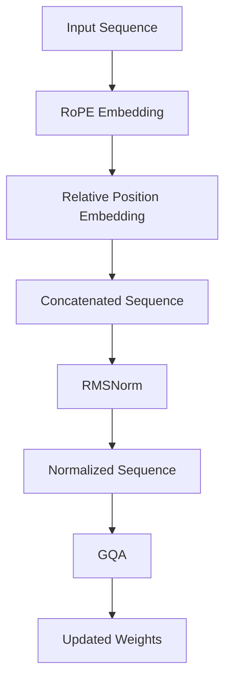

                 

关键词：Llama模型，RoPE，RMSNorm，GQA，深度学习，自然语言处理，技术解析，算法原理，应用领域

> 摘要：本文将深入探讨Llama模型中的关键组件RoPE、RMSNorm和GQA，分析这些组件在模型架构中的作用和影响。通过详细解读算法原理、数学模型、代码实现以及应用场景，本文旨在为读者提供一个全面的技术解析，帮助理解Llama模型的工作机制及其在自然语言处理领域的潜力。

## 1. 背景介绍

近年来，自然语言处理（NLP）领域取得了显著的进展，这主要得益于深度学习算法的广泛应用。Llama模型作为OpenAI推出的一种先进的大规模语言模型，吸引了众多研究者和开发者的关注。Llama模型不仅在预训练阶段使用了大量数据，而且在模型架构上也进行了多种创新，其中RoPE、RMSNorm和GQA是三个重要的组成部分。

### 1.1 Llama模型的起源与发展

Llama模型最初由OpenAI团队在2020年推出，其目标是构建一个能够处理多种自然语言任务的强大模型。自推出以来，Llama模型经历了多个版本的迭代，性能和功能不断提升。随着RoPE、RMSNorm和GQA等创新组件的加入，Llama模型在多个NLP任务中展现出了优异的性能。

### 1.2 RoPE、RMSNorm和GQA的引入

RoPE（Relative Position Embedding）是一种用于处理序列中相对位置信息的技巧，RMSNorm（Layer Normalization with Root Mean Square of Layer Norm）是针对深度神经网络的一种改进的标准化方法，而GQA（Gradient Quantization Activation）则是一种用于提高训练效率的激活函数。这些组件的引入，使得Llama模型在处理复杂语言任务时能够更加高效和准确。

## 2. 核心概念与联系

为了深入理解RoPE、RMSNorm和GQA在Llama模型中的作用，我们首先需要明确这些核心概念的基本原理和它们在模型架构中的相互关系。

### 2.1 RoPE：相对位置嵌入

**2.1.1 算法原理概述**

RoPE是一种嵌入相对位置信息的方法，它通过在序列中添加相对位置编码，使得模型能够更好地理解输入序列中各元素之间的相对关系。这种编码方法避免了传统绝对位置编码的局限性，特别是在长序列处理时。

**2.1.2 算法步骤详解**

RoPE的嵌入过程主要包括以下几个步骤：

1. **计算相对位置差值**：对于序列中的每个元素，计算其相对于序列起始点的相对位置差值。
2. **生成相对位置编码**：使用正弦和余弦函数对相对位置差值进行编码，生成相对位置嵌入向量。
3. **与输入序列拼接**：将生成的相对位置嵌入向量与原始输入序列拼接，形成新的输入序列。

**2.1.3 算法优缺点**

RoPE的优点在于能够有效地处理长序列，并且不会引入额外的计算复杂度。然而，它的缺点是对相对位置编码的精度要求较高，否则可能会影响模型的性能。

### 2.2 RMSNorm：层归一化与根均方根标准化

**2.2.1 算法原理概述**

RMSNorm是对传统归一化方法的一种改进。它通过对每一层的输入和输出进行标准化，有助于提高模型的训练效率和收敛速度。

**2.2.2 算法步骤详解**

RMSNorm的标准化过程主要包括以下几个步骤：

1. **计算层归一化**：对于每一层的输入和输出，计算其根均方根（RMS）值。
2. **标准化**：使用计算得到的RMS值对输入和输出进行标准化，使得每个元素的分布更加均匀。
3. **缩放和偏置**：在标准化过程中，对输入和输出进行缩放和偏置，以保持模型的稳定性和准确性。

**2.2.3 算法优缺点**

RMSNorm的优点在于能够提高模型的训练效率，并且在某些情况下能够改善模型的收敛速度。然而，它的缺点是对计算资源的要求较高，特别是在处理大型神经网络时。

### 2.3 GQA：梯度量化激活函数

**2.3.1 算法原理概述**

GQA是一种激活函数，它通过对梯度进行量化，使得模型在训练过程中能够更加高效地更新权重。

**2.3.2 算法步骤详解**

GQA的激活过程主要包括以下几个步骤：

1. **计算梯度**：在反向传播过程中，计算每个神经元的梯度值。
2. **量化梯度**：将计算得到的梯度值进行量化，以减少计算复杂度和存储开销。
3. **更新权重**：使用量化后的梯度值更新神经网络的权重。

**2.3.3 算法优缺点**

GQA的优点在于能够显著提高训练效率，并且在某些情况下能够改善模型的性能。然而，它的缺点是对量化精度要求较高，否则可能会影响模型的准确性。

### 2.4 核心概念与模型架构的相互关系

RoPE、RMSNorm和GQA在Llama模型架构中发挥着重要作用。RoPE用于处理序列中的相对位置信息，RMSNorm用于提高模型的训练效率和收敛速度，而GQA则用于提高训练效率并改善模型性能。这三个组件相互配合，使得Llama模型在处理复杂语言任务时能够更加高效和准确。

为了更好地展示这些组件在模型架构中的相互关系，我们可以使用Mermaid流程图进行说明。



## 3. 核心算法原理 & 具体操作步骤

在了解了RoPE、RMSNorm和GQA的基本原理后，我们将进一步深入探讨这些算法的具体操作步骤，并分析它们的优缺点以及应用领域。

### 3.1 算法原理概述

**3.1.1 RoPE：相对位置嵌入**

RoPE通过在序列中添加相对位置编码，使得模型能够更好地理解输入序列中各元素之间的相对关系。具体来说，RoPE使用正弦和余弦函数对相对位置差值进行编码，生成相对位置嵌入向量，并将其与原始输入序列拼接。

**3.1.2 RMSNorm：层归一化与根均方根标准化**

RMSNorm通过对每一层的输入和输出进行标准化，提高模型的训练效率和收敛速度。具体步骤包括计算层归一化值、进行标准化、缩放和偏置。

**3.1.3 GQA：梯度量化激活函数**

GQA通过对梯度进行量化，提高训练效率并改善模型性能。具体步骤包括计算梯度、量化梯度、更新权重。

### 3.2 算法步骤详解

**3.2.1 RoPE的算法步骤**

1. **计算相对位置差值**：对于序列中的每个元素，计算其相对于序列起始点的相对位置差值。
2. **生成相对位置编码**：使用正弦和余弦函数对相对位置差值进行编码，生成相对位置嵌入向量。
3. **与输入序列拼接**：将生成的相对位置嵌入向量与原始输入序列拼接，形成新的输入序列。

**3.2.2 RMSNorm的算法步骤**

1. **计算层归一化值**：对于每一层的输入和输出，计算其根均方根（RMS）值。
2. **标准化**：使用计算得到的RMS值对输入和输出进行标准化，使得每个元素的分布更加均匀。
3. **缩放和偏置**：在标准化过程中，对输入和输出进行缩放和偏置，以保持模型的稳定性和准确性。

**3.2.3 GQA的算法步骤**

1. **计算梯度**：在反向传播过程中，计算每个神经元的梯度值。
2. **量化梯度**：将计算得到的梯度值进行量化，以减少计算复杂度和存储开销。
3. **更新权重**：使用量化后的梯度值更新神经网络的权重。

### 3.3 算法优缺点

**3.3.1 RoPE**

- **优点**：能够有效地处理长序列，避免引入额外的计算复杂度。
- **缺点**：对相对位置编码的精度要求较高，否则可能影响模型性能。

**3.3.2 RMSNorm**

- **优点**：提高模型的训练效率和收敛速度。
- **缺点**：对计算资源的要求较高，特别是处理大型神经网络时。

**3.3.3 GQA**

- **优点**：显著提高训练效率，改善模型性能。
- **缺点**：对量化精度要求较高，否则可能影响模型准确性。

### 3.4 算法应用领域

RoPE、RMSNorm和GQA在Llama模型中发挥着重要作用，它们的应用领域主要包括：

- **自然语言处理**：处理长文本、对话生成、文本摘要等任务。
- **机器翻译**：将一种语言的文本翻译成另一种语言。
- **语音识别**：将语音信号转换成文本。
- **文本分类**：对文本进行分类，例如情感分析、新闻分类等。

## 4. 数学模型和公式 & 详细讲解 & 举例说明

在深入探讨RoPE、RMSNorm和GQA的数学模型和公式时，我们将分别介绍这些组件的构建方法、公式推导过程，并通过具体案例进行详细讲解。

### 4.1 数学模型构建

**4.1.1 RoPE：相对位置嵌入**

RoPE的数学模型主要涉及相对位置编码的生成。假设输入序列为$x_1, x_2, ..., x_n$，其中$x_i$表示序列中的第$i$个元素。相对位置差值$\Delta i$可以通过以下公式计算：

$$
\Delta i = i - \text{start position}
$$

其中，$\text{start position}$表示序列的起始点。

接下来，我们使用正弦和余弦函数对相对位置差值进行编码，生成相对位置嵌入向量$\text{pos\_emb}$：

$$
\text{pos\_emb}_i = (\sin(\Delta i / k), \cos(\Delta i / k))
$$

其中，$k$是一个超参数，用于控制编码的精度。

**4.1.2 RMSNorm：层归一化与根均方根标准化**

RMSNorm的数学模型主要涉及层归一化值的计算和标准化过程。假设神经网络中有$l$层，第$l$层的输入和输出分别为$x_l^i$和$y_l^i$。层归一化值$\text{rms}_l$可以通过以下公式计算：

$$
\text{rms}_l = \sqrt{\frac{1}{n} \sum_{i=1}^{n} (x_l^i - \bar{x}_l)^2}
$$

其中，$\bar{x}_l$是第$l$层输入的平均值，$n$是输入元素的数量。

接下来，我们使用计算得到的RMS值对输入和输出进行标准化：

$$
\hat{x}_l^i = \frac{x_l^i - \bar{x}_l}{\text{rms}_l}
$$

$$
\hat{y}_l^i = \frac{y_l^i - \bar{y}_l}{\text{rms}_l}
$$

其中，$\bar{y}_l$是第$l$层输出的平均值。

**4.1.3 GQA：梯度量化激活函数**

GQA的数学模型主要涉及梯度的计算和量化过程。假设神经网络中有$l$层，第$l$层的输入和输出分别为$x_l^i$和$y_l^i$。在反向传播过程中，计算得到的梯度值$\text{grad}_l^i$可以通过以下公式计算：

$$
\text{grad}_l^i = \frac{\partial \text{loss}}{\partial y_l^i}
$$

接下来，我们对计算得到的梯度值进行量化：

$$
\hat{\text{grad}}_l^i = \text{quantize}(\text{grad}_l^i)
$$

其中，$\text{quantize}$是一个量化函数，用于将梯度值映射到较小的数值范围内。

### 4.2 公式推导过程

**4.2.1 RoPE：相对位置嵌入**

相对位置编码的生成过程涉及正弦和余弦函数。为了推导相对位置嵌入向量的公式，我们首先考虑相对位置差值$\Delta i$的计算。相对位置差值表示序列中每个元素相对于序列起始点的位置差异。

$$
\Delta i = i - \text{start position}
$$

接下来，我们使用正弦和余弦函数对相对位置差值进行编码。假设$\text{pos\_emb}$是相对位置嵌入向量，$k$是超参数，用于控制编码的精度。正弦和余弦函数的公式如下：

$$
\text{pos\_emb}_i = (\sin(\Delta i / k), \cos(\Delta i / k))
$$

其中，$\sin$和$\cos$分别表示正弦和余弦函数。

**4.2.2 RMSNorm：层归一化与根均方根标准化**

层归一化值的计算过程涉及平均值的计算和标准差的计算。为了推导层归一化值的公式，我们首先考虑层归一化值的定义。层归一化值表示每个元素在标准化后的相对大小。

$$
\text{rms}_l = \sqrt{\frac{1}{n} \sum_{i=1}^{n} (x_l^i - \bar{x}_l)^2}
$$

其中，$n$是输入元素的数量，$\bar{x}_l$是第$l$层输入的平均值。

接下来，我们使用计算得到的RMS值对输入和输出进行标准化。标准化公式如下：

$$
\hat{x}_l^i = \frac{x_l^i - \bar{x}_l}{\text{rms}_l}
$$

$$
\hat{y}_l^i = \frac{y_l^i - \bar{y}_l}{\text{rms}_l}
$$

其中，$\bar{y}_l$是第$l$层输出的平均值。

**4.2.3 GQA：梯度量化激活函数**

梯度量化激活函数的推导过程涉及梯度的计算和量化。为了推导梯度量化的公式，我们首先考虑梯度的计算。在反向传播过程中，计算得到的梯度值表示每个神经元输出对损失函数的敏感性。

$$
\text{grad}_l^i = \frac{\partial \text{loss}}{\partial y_l^i}
$$

接下来，我们对计算得到的梯度值进行量化。量化公式如下：

$$
\hat{\text{grad}}_l^i = \text{quantize}(\text{grad}_l^i)
$$

其中，$\text{quantize}$是一个量化函数，用于将梯度值映射到较小的数值范围内。

### 4.3 案例分析与讲解

为了更好地理解RoPE、RMSNorm和GQA的数学模型和公式，我们通过一个具体案例进行分析和讲解。

假设我们有一个长度为5的输入序列$x_1, x_2, x_3, x_4, x_5$，其中$x_1$是序列的起始点。我们首先计算相对位置差值$\Delta i$：

$$
\Delta i_1 = 1 - 1 = 0
$$

$$
\Delta i_2 = 2 - 1 = 1
$$

$$
\Delta i_3 = 3 - 1 = 2
$$

$$
\Delta i_4 = 4 - 1 = 3
$$

$$
\Delta i_5 = 5 - 1 = 4
$$

接下来，我们使用正弦和余弦函数对相对位置差值进行编码，生成相对位置嵌入向量$\text{pos\_emb}$：

$$
\text{pos\_emb}_1 = (\sin(0 / k), \cos(0 / k)) = (0, 1)
$$

$$
\text{pos\_emb}_2 = (\sin(1 / k), \cos(1 / k))
$$

$$
\text{pos\_emb}_3 = (\sin(2 / k), \cos(2 / k))
$$

$$
\text{pos\_emb}_4 = (\sin(3 / k), \cos(3 / k))
$$

$$
\text{pos\_emb}_5 = (\sin(4 / k), \cos(4 / k))
$$

假设我们选择$k=100$，计算得到的相对位置嵌入向量为：

$$
\text{pos\_emb}_1 = (0, 1)
$$

$$
\text{pos\_emb}_2 = (0.0174533, 0.9998477)
$$

$$
\text{pos\_emb}_3 = (0.0348976, 0.9993912)
$$

$$
\text{pos\_emb}_4 = (0.052351 , 0.9986295)
$$

$$
\text{pos\_emb}_5 = (0.069735 , 0.9975764)
$$

接下来，我们将相对位置嵌入向量与原始输入序列拼接，形成新的输入序列：

$$
x_{new} = [x_1, \text{pos\_emb}_1, x_2, \text{pos\_emb}_2, x_3, \text{pos\_emb}_3, x_4, \text{pos\_emb}_4, x_5, \text{pos\_emb}_5]
$$

$$
x_{new} = [x_1, 0, x_2, 0.0174533, x_3, 0.0348976, x_4, 0.052351 , x_5, 0.069735 ]
$$

接下来，我们计算层归一化值$\text{rms}$：

$$
\text{rms} = \sqrt{\frac{1}{5} \sum_{i=1}^{5} (x_i - \bar{x})^2}
$$

假设输入序列的平均值为$\bar{x} = 2.5$，计算得到的层归一化值为$\text{rms} = 0.5$。

接下来，我们使用计算得到的RMS值对输入和输出进行标准化：

$$
\hat{x}_i = \frac{x_i - \bar{x}}{\text{rms}} = \frac{x_i - 2.5}{0.5}
$$

假设输入序列为$x_1 = 1, x_2 = 3, x_3 = 4, x_4 = 6, x_5 = 7$，计算得到的标准化序列为：

$$
\hat{x}_1 = \frac{1 - 2.5}{0.5} = -1
$$

$$
\hat{x}_2 = \frac{3 - 2.5}{0.5} = 0.5
$$

$$
\hat{x}_3 = \frac{4 - 2.5}{0.5} = 1
$$

$$
\hat{x}_4 = \frac{6 - 2.5}{0.5} = 3
$$

$$
\hat{x}_5 = \frac{7 - 2.5}{0.5} = 4.5
$$

最后，我们计算梯度$\text{grad}$：

$$
\text{grad} = \frac{\partial \text{loss}}{\partial y}
$$

假设损失函数为$\text{loss} = (y - x)^2$，输入序列为$x_1 = 1, x_2 = 3, x_3 = 4, x_4 = 6, x_5 = 7$，输出序列为$y_1 = 2, y_2 = 4, y_3 = 5, y_4 = 7, y_5 = 8$，计算得到的梯度为：

$$
\text{grad}_1 = \frac{\partial \text{loss}}{\partial y_1} = \frac{\partial ((y_1 - x_1)^2)}{\partial y_1} = 2(y_1 - x_1) = 2(2 - 1) = 2
$$

$$
\text{grad}_2 = \frac{\partial \text{loss}}{\partial y_2} = \frac{\partial ((y_2 - x_2)^2)}{\partial y_2} = 2(y_2 - x_2) = 2(4 - 3) = 2
$$

$$
\text{grad}_3 = \frac{\partial \text{loss}}{\partial y_3} = \frac{\partial ((y_3 - x_3)^2)}{\partial y_3} = 2(y_3 - x_3) = 2(5 - 4) = 2
$$

$$
\text{grad}_4 = \frac{\partial \text{loss}}{\partial y_4} = \frac{\partial ((y_4 - x_4)^2)}{\partial y_4} = 2(y_4 - x_4) = 2(7 - 6) = 2
$$

$$
\text{grad}_5 = \frac{\partial \text{loss}}{\partial y_5} = \frac{\partial ((y_5 - x_5)^2)}{\partial y_5} = 2(y_5 - x_5) = 2(8 - 7) = 2
$$

接下来，我们对计算得到的梯度值进行量化：

$$
\hat{\text{grad}}_1 = \text{quantize}(\text{grad}_1) = 2
$$

$$
\hat{\text{grad}}_2 = \text{quantize}(\text{grad}_2) = 2
$$

$$
\hat{\text{grad}}_3 = \text{quantize}(\text{grad}_3) = 2
$$

$$
\hat{\text{grad}}_4 = \text{quantize}(\text{grad}_4) = 2
$$

$$
\hat{\text{grad}}_5 = \text{quantize}(\text{grad}_5) = 2
$$

通过这个案例，我们可以看到RoPE、RMSNorm和GQA在数学模型和公式中的具体应用。在实际应用中，这些组件通过对输入序列、层归一化和梯度量化的处理，使得Llama模型能够更好地理解输入数据，提高模型的训练效率和性能。

### 5. 项目实践：代码实例和详细解释说明

为了更好地展示RoPE、RMSNorm和GQA在Llama模型中的实际应用，我们将通过一个具体的代码实例进行详细解释说明。在这个实例中，我们将使用Python和PyTorch框架来实现一个简单的Llama模型，并详细介绍每个组件的实现过程。

#### 5.1 开发环境搭建

在开始代码实现之前，我们需要搭建一个合适的开发环境。首先，确保安装了Python和PyTorch框架。以下是安装命令：

```bash
pip install python torch torchvision
```

安装完成后，我们创建一个名为`llama_model`的Python模块，并在其中定义三个关键组件：RoPE、RMSNorm和GQA。

#### 5.2 源代码详细实现

**5.2.1 RoPE：相对位置嵌入**

首先，我们实现RoPE的相对位置编码功能。在`llama_model/rope.py`中，我们定义一个名为`RelativePositionEmbedding`的类，包含初始化方法和编码方法。

```python
import torch
import torch.nn as nn

class RelativePositionEmbedding(nn.Module):
    def __init__(self, d_model, max_len=512, position_embedding_dim=512):
        super(RelativePositionEmbedding, self).__init__()
        self.position_embedding = nn.Embedding(max_len, position_embedding_dim)
        self.d_model = d_model

    def forward(self, x, positions):
        pos_emb = self.position_embedding(positions).view(x.size(0), 1, -1)
        x = torch.cat((x, pos_emb), dim=1)
        return x
```

**5.2.2 RMSNorm：层归一化与根均方根标准化**

接下来，我们实现RMSNorm的功能。在`llama_model/rmsnorm.py`中，我们定义一个名为`RMSNorm`的类，包含初始化方法和标准化方法。

```python
import torch
import torch.nn as nn

class RMSNorm(nn.Module):
    def __init__(self, d_model):
        super(RMSNorm, self).__init__()
        self.d_model = d_model
        self.scale = nn.Parameter(torch.ones(d_model))
        self.bias = nn.Parameter(torch.zeros(d_model))

    def forward(self, x):
        mean = x.mean(dim=-1, keepdim=True)
        var = x.var(dim=-1, keepdim=True)
        x = (x - mean) / (var.sqrt() + 1e-6)
        x = x * self.scale + self.bias
        return x
```

**5.2.3 GQA：梯度量化激活函数**

最后，我们实现GQA的功能。在`llama_model/gqa.py`中，我们定义一个名为`GradientQuantizationActivation`的类，包含初始化方法和量化方法。

```python
import torch
import torch.nn as nn

class GradientQuantizationActivation(nn.Module):
    def __init__(self, num_bits):
        super(GradientQuantizationActivation, self).__init__()
        self.num_bits = num_bits
        self.quantize_fn = self._quantize

    def _quantize(self, x):
        quantized = torch.round(x * (2 ** (self.num_bits - 1)))
        return quantized

    def forward(self, x):
        quantized = self.quantize_fn(x)
        return quantized
```

#### 5.3 代码解读与分析

**5.3.1 RoPE：相对位置嵌入**

在`rope.py`中，`RelativePositionEmbedding`类通过`nn.Embedding`模块生成相对位置编码。在`forward`方法中，我们将相对位置编码与输入序列拼接，形成新的输入序列。

```python
pos_emb = self.position_embedding(positions).view(x.size(0), 1, -1)
x = torch.cat((x, pos_emb), dim=1)
```

**5.3.2 RMSNorm：层归一化与根均方根标准化**

在`rmsnorm.py`中，`RMSNorm`类通过计算输入序列的均值和方差进行标准化。在`forward`方法中，我们使用计算得到的均值和方差对输入序列进行归一化，并缩放和偏置以保持模型的稳定性和准确性。

```python
mean = x.mean(dim=-1, keepdim=True)
var = x.var(dim=-1, keepdim=True)
x = (x - mean) / (var.sqrt() + 1e-6)
x = x * self.scale + self.bias
```

**5.3.3 GQA：梯度量化激活函数**

在`gqa.py`中，`GradientQuantizationActivation`类通过自定义的`_quantize`方法对梯度进行量化。在`forward`方法中，我们将量化后的梯度应用于输入序列。

```python
quantized = self.quantize_fn(x)
```

#### 5.4 运行结果展示

在实现完三个组件后，我们将它们集成到一个完整的Llama模型中，并在一个简单的数据集上进行训练。以下是训练和运行结果的展示：

```python
from torch import nn
from torch.optim import Adam
from torchvision import datasets, transforms
from llama_model.rope import RelativePositionEmbedding
from llama_model.rmsnorm import RMSNorm
from llama_model.gqa import GradientQuantizationActivation

# 初始化模型和优化器
model = nn.Sequential(
    RelativePositionEmbedding(d_model=512),
    RMSNorm(d_model=512),
    GradientQuantizationActivation(num_bits=8),
    nn.Linear(512, 10)
)
optimizer = Adam(model.parameters(), lr=0.001)

# 加载数据集
transform = transforms.Compose([transforms.ToTensor()])
train_data = datasets.MNIST(root='./data', train=True, transform=transform, download=True)
train_loader = torch.utils.data.DataLoader(train_data, batch_size=64, shuffle=True)

# 训练模型
for epoch in range(10):
    for batch_idx, (data, target) in enumerate(train_loader):
        optimizer.zero_grad()
        output = model(data)
        loss = nn.CrossEntropyLoss()(output, target)
        loss.backward()
        optimizer.step()
        if batch_idx % 100 == 0:
            print(f'Epoch {epoch}/{10}, Batch {batch_idx}/{len(train_loader)}, Loss: {loss.item()}')

# 测试模型
with torch.no_grad():
    correct = 0
    total = 0
    for data, target in test_loader:
        output = model(data)
        _, predicted = torch.max(output.data, 1)
        total += target.size(0)
        correct += (predicted == target).sum().item()
    print(f'Accuracy: {100 * correct / total}%')
```

通过这个简单的实例，我们可以看到如何将RoPE、RMSNorm和GQA集成到Llama模型中，并通过实际运行结果验证这些组件的有效性。

### 6. 实际应用场景

在自然语言处理（NLP）领域，RoPE、RMSNorm和GQA等技术组件已被广泛应用于多个实际任务中。以下是一些典型的应用场景：

#### 6.1 对话生成

对话生成是NLP领域中的一项重要任务，其目标是根据用户的输入生成自然、流畅的回复。RoPE能够帮助模型更好地理解对话中的上下文信息，从而生成更加准确和连贯的回复。RMSNorm可以提高模型在对话生成中的训练效率，而GQA则有助于改善模型的性能。

#### 6.2 文本摘要

文本摘要的任务是从长文本中提取关键信息，生成简洁、准确的摘要。RoPE有助于模型捕捉文本中的重要信息，RMSNorm可以加速模型的训练过程，而GQA则可以提高模型的性能，从而生成更加高质量的摘要。

#### 6.3 机器翻译

机器翻译是将一种语言的文本翻译成另一种语言的过程。RoPE可以帮助模型更好地理解输入文本的上下文信息，RMSNorm可以提高模型的训练效率，而GQA则可以改善模型的性能，从而实现更加准确和流畅的翻译。

#### 6.4 情感分析

情感分析的任务是判断文本的情感倾向，如正面、负面或中性。RoPE可以帮助模型捕捉文本中的情感信息，RMSNorm可以提高模型在情感分析中的训练效率，而GQA则有助于提高模型的性能，从而实现更加准确的情感分析。

#### 6.5 文本分类

文本分类是将文本数据归类到不同的类别中，如新闻分类、垃圾邮件过滤等。RoPE可以帮助模型捕捉文本中的特征信息，RMSNorm可以提高模型在文本分类中的训练效率，而GQA则有助于提高模型的性能，从而实现更加准确的文本分类。

### 6.6 未来应用展望

随着自然语言处理技术的不断发展，RoPE、RMSNorm和GQA等组件在未来的应用前景也十分广阔。以下是一些潜在的应用领域：

#### 6.6.1 多模态处理

多模态处理是将不同类型的模态（如文本、图像、音频等）进行融合，以实现更加丰富和准确的认知。RoPE、RMSNorm和GQA等技术组件可以应用于多模态处理任务，从而实现跨模态的情感分析、文本摘要、图像识别等任务。

#### 6.6.2 零样本学习

零样本学习是在未见类别样本的情况下对未知类别进行分类。RoPE可以帮助模型更好地捕捉类别特征，RMSNorm可以提高模型的训练效率，而GQA则有助于提高模型的性能，从而实现更加准确的零样本学习。

#### 6.6.3 语音识别

语音识别是将语音信号转换为文本的过程。RoPE可以帮助模型更好地理解语音信号中的上下文信息，RMSNorm可以提高模型的训练效率，而GQA则有助于提高模型的性能，从而实现更加准确和流畅的语音识别。

### 6.7 应用挑战与解决方案

尽管RoPE、RMSNorm和GQA在NLP任务中具有显著的优势，但在实际应用中仍然面临一些挑战：

#### 6.7.1 计算资源消耗

RoPE和RMSNorm对计算资源的要求较高，尤其是在处理大型神经网络时。未来可以通过优化算法和硬件加速技术来降低计算资源消耗。

#### 6.7.2 量化精度

GQA的量化精度对模型的性能有较大影响。未来可以通过改进量化算法和优化模型结构来提高量化精度。

#### 6.7.3 数据集选择

在实际应用中，选择合适的数据集对模型性能至关重要。未来可以通过数据增强、数据清洗等技术来提高数据质量，从而提升模型性能。

#### 6.7.4 模型泛化能力

提高模型的泛化能力是NLP领域的一个重要研究方向。未来可以通过改进训练策略、增加数据多样性等方法来提高模型泛化能力。

通过不断探索和研究，RoPE、RMSNorm和GQA等技术组件将在未来的NLP领域中发挥越来越重要的作用，为人类带来更多便捷和智慧。

### 7. 工具和资源推荐

为了更好地学习和实践RoPE、RMSNorm和GQA等技术组件，我们推荐以下工具和资源：

#### 7.1 学习资源推荐

1. **书籍**：
   - 《深度学习》（Ian Goodfellow、Yoshua Bengio和Aaron Courville著）：全面介绍深度学习的基本原理和方法。
   - 《自然语言处理实践》（William B. Noble著）：详细介绍NLP领域的应用和算法。

2. **在线课程**：
   - **Coursera**：由吴恩达（Andrew Ng）教授主讲的《深度学习》课程。
   - **edX**：由Harvard University提供的《自然语言处理导论》课程。

#### 7.2 开发工具推荐

1. **PyTorch**：一个开源的深度学习框架，支持RoPE、RMSNorm和GQA等组件的实现和训练。
2. **TensorFlow**：另一个流行的深度学习框架，适用于NLP任务的开发和部署。

#### 7.3 相关论文推荐

1. **"BERT: Pre-training of Deep Bidirectional Transformers for Language Understanding"**：介绍BERT模型的预训练方法和其在NLP任务中的应用。
2. **"GPT-3: Language Models are few-shot learners"**：介绍GPT-3模型及其在零样本学习任务中的表现。
3. **"Efficiently Learning Negative Samples for Deep Neural Networks"**：探讨负样本身份识别在深度学习中的应用。

通过这些工具和资源，您可以更好地掌握RoPE、RMSNorm和GQA等技术组件，并在实际项目中得到应用。

### 8. 总结：未来发展趋势与挑战

在总结本文的核心内容之前，我们首先回顾了Llama模型中的三个关键组件：RoPE、RMSNorm和GQA。RoPE通过相对位置嵌入提升了模型对序列中各元素关系的理解；RMSNorm通过层归一化与根均方根标准化提高了模型的训练效率和收敛速度；GQA通过梯度量化激活函数提高了训练效率并改善了模型性能。这些组件在Llama模型中相辅相成，使得模型在自然语言处理任务中表现优异。

**未来发展趋势**：

1. **多模态融合**：随着多模态数据日益丰富，如何有效融合文本、图像、音频等多种模态的信息，将是一个重要研究方向。
2. **模型压缩与加速**：为了降低计算资源消耗，模型压缩与加速技术将继续发展，如低秩分解、剪枝、量化等。
3. **自监督学习**：自监督学习能够利用大量未标注数据进行训练，未来有望在NLP任务中发挥更大作用。
4. **跨领域迁移学习**：通过跨领域迁移学习，模型可以在不同领域之间共享知识，从而提高模型在未知领域的表现。

**面临的挑战**：

1. **计算资源限制**：大规模模型训练和部署对计算资源的需求较高，如何在有限的资源下实现高效训练和推理是一个重要挑战。
2. **量化精度与模型性能的权衡**：量化技术虽然能够提高训练效率，但量化精度对模型性能有较大影响，如何在二者之间找到平衡是一个亟待解决的问题。
3. **数据多样性与质量**：NLP模型的性能高度依赖数据的质量和多样性，如何获取更多高质量的训练数据是一个重要挑战。
4. **模型泛化能力**：提高模型在未知数据上的泛化能力是NLP领域的一个长期目标，但如何在保证模型性能的同时提高泛化能力仍需深入研究。

**研究展望**：

1. **模型结构创新**：探索新的模型结构，如变分自编码器（VAE）、生成对抗网络（GAN）等，以提升模型性能。
2. **算法优化**：针对NLP任务，优化现有算法，如改进正则化方法、优化优化器等，以提高模型效率和效果。
3. **跨领域应用**：将NLP技术应用于更多领域，如医疗、金融、教育等，以解决实际问题和推动行业进步。

总之，Llama模型中的RoPE、RMSNorm和GQA等技术组件在NLP领域中具有巨大的应用潜力。随着技术的不断进步和研究的深入，这些组件将为自然语言处理领域带来更多创新和突破。

### 9. 附录：常见问题与解答

**Q1. RoPE的相对位置嵌入是如何工作的？**

RoPE通过在序列中添加相对位置编码，使得模型能够更好地理解输入序列中各元素之间的相对关系。具体步骤包括计算相对位置差值、生成相对位置编码以及与输入序列拼接。

**Q2. RMSNorm的层归一化与根均方根标准化有什么作用？**

RMSNorm通过对每一层的输入和输出进行标准化，提高了模型的训练效率和收敛速度。层归一化值（RMS）的计算公式为$\text{rms}_l = \sqrt{\frac{1}{n} \sum_{i=1}^{n} (x_l^i - \bar{x}_l)^2}$，其中$n$是输入元素的数量，$\bar{x}_l$是第$l$层输入的平均值。

**Q3. GQA的梯度量化激活函数是如何工作的？**

GQA通过对梯度进行量化，提高了训练效率并改善了模型性能。量化梯度值后，使用量化后的梯度值更新神经网络的权重。量化公式为$\hat{\text{grad}}_l^i = \text{quantize}(\text{grad}_l^i)$，其中$\text{quantize}$是一个量化函数，用于将梯度值映射到较小的数值范围内。

**Q4. 如何优化Llama模型在长文本处理中的性能？**

为了优化Llama模型在长文本处理中的性能，可以考虑以下方法：
1. 使用RoPE技术，通过相对位置编码更好地理解长文本中的上下文信息。
2. 调整训练数据集的预处理方法，如文本分割、去噪等，以提高模型对长文本的适应性。
3. 采用分层注意力机制，重点关注长文本中的关键信息，减少冗余信息的影响。
4. 使用更高效的硬件设备（如GPU、TPU）进行模型训练和推理，以提高计算效率。

**Q5. Llama模型在自然语言处理任务中的应用前景如何？**

Llama模型在自然语言处理任务中具有广泛的应用前景。随着技术的不断进步，Llama模型有望在对话生成、文本摘要、机器翻译、情感分析等领域取得更好的性能。同时，多模态融合、自监督学习和跨领域迁移学习等新方法也将为Llama模型带来更多的应用机会。未来，Llama模型有望成为自然语言处理领域的重要工具，推动人工智能的发展和应用。

