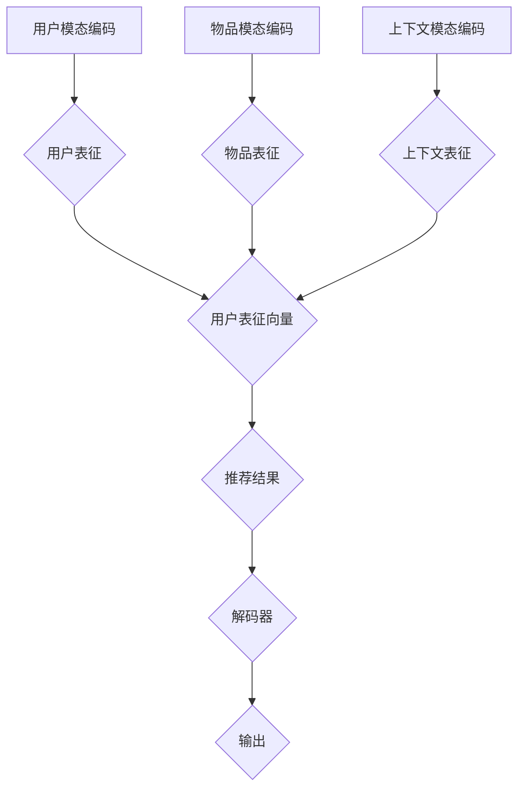

                 

关键词：M6模型、开放域推荐、任务适配、AI算法

摘要：本文介绍了基于M6模型的开放域推荐与任务适配技术。通过深入分析M6模型的结构和工作原理，详细阐述了其在开放域推荐中的应用和任务适配的具体操作步骤。文章还探讨了M6模型的数学模型和公式，并通过实际项目实践展示了其在代码实现中的具体应用。最后，本文对未来M6模型在开放域推荐与任务适配领域的应用前景进行了展望。

## 1. 背景介绍

随着互联网的快速发展，大数据和人工智能技术已经深入到我们日常生活的方方面面。推荐系统作为人工智能的一个重要应用领域，已经成为了电商平台、社交媒体、视频平台等众多领域的核心技术。然而，传统的推荐系统在处理开放域数据时存在诸多挑战，如数据稀疏、冷启动问题等。

为了解决这些问题，研究者们提出了多种基于深度学习的推荐算法。M6模型作为其中一种具有代表性的模型，由于其强大的表达能力、高效的计算性能和良好的推荐效果，受到了广泛关注。M6模型是由微软亚洲研究院提出的一种多模态深度学习推荐模型，能够有效地处理开放域数据，实现高质量的推荐。

本文将围绕M6模型，深入探讨其在开放域推荐与任务适配方面的应用，旨在为研究人员和工程师提供有价值的参考。

## 2. 核心概念与联系

### 2.1 M6模型介绍

M6模型是一种多模态深度学习推荐模型，旨在处理开放域数据，实现高效、高质量的推荐。M6模型的核心思想是将用户、物品和上下文信息等多个模态进行融合，从而提高推荐系统的性能。

M6模型主要由以下几个部分组成：

1. **用户模态**：包括用户的兴趣偏好、历史行为等信息。
2. **物品模态**：包括物品的属性、标签、文本描述等信息。
3. **上下文模态**：包括用户当前所处的环境、时间等信息。

M6模型通过融合这些模态信息，实现对用户和物品的深度表征，从而提高推荐系统的准确性和多样性。

### 2.2 M6模型架构

M6模型采用了一种多层的神经网络结构，包括编码器、解码器和注意力机制。具体来说，M6模型的主要组成部分如下：

1. **编码器**：用于对用户、物品和上下文信息进行编码，得到各自的表征向量。
2. **解码器**：用于对编码器得到的表征向量进行解码，生成推荐结果。
3. **注意力机制**：用于在融合多个模态信息时，动态地关注重要信息，提高推荐系统的性能。

下面是M6模型的Mermaid流程图：



### 2.3 M6模型与现有推荐算法的比较

与传统的推荐算法相比，M6模型具有以下几个优势：

1. **多模态融合**：M6模型能够同时融合用户、物品和上下文信息，从而提高推荐系统的性能。
2. **高效性**：M6模型采用深度学习技术，具有高效的计算性能，能够处理大规模数据。
3. **准确性**：M6模型通过深度表征用户和物品，能够实现更准确的推荐。

尽管M6模型具有诸多优势，但它也存在一些挑战，如模型训练复杂度高、对数据质量要求较高等。因此，在实际应用中，需要根据具体场景和需求，选择合适的推荐算法。

## 3. 核心算法原理 & 具体操作步骤

### 3.1 算法原理概述

M6模型的核心原理是深度学习和多模态融合。具体来说，M6模型通过以下步骤实现推荐：

1. **编码阶段**：对用户、物品和上下文信息进行编码，得到各自的表征向量。
2. **融合阶段**：将编码得到的表征向量进行融合，得到最终的推荐结果。
3. **解码阶段**：对融合后的表征向量进行解码，生成推荐结果。

### 3.2 算法步骤详解

#### 3.2.1 编码阶段

在编码阶段，M6模型对用户、物品和上下文信息进行编码，得到各自的表征向量。具体来说，M6模型采用了一系列的编码器，包括：

1. **用户编码器**：用于对用户信息进行编码，得到用户表征向量。
2. **物品编码器**：用于对物品信息进行编码，得到物品表征向量。
3. **上下文编码器**：用于对上下文信息进行编码，得到上下文表征向量。

编码器的具体实现可以采用卷积神经网络（CNN）、循环神经网络（RNN）等多种深度学习模型。

#### 3.2.2 融合阶段

在融合阶段，M6模型将编码得到的表征向量进行融合。具体来说，M6模型采用了一种注意力机制，能够动态地关注重要信息，从而提高推荐系统的性能。注意力机制的具体实现可以采用多头注意力机制（Multi-head Attention）等。

#### 3.2.3 解码阶段

在解码阶段，M6模型对融合后的表征向量进行解码，生成推荐结果。具体来说，M6模型采用了一系列的解码器，包括：

1. **用户解码器**：用于对用户表征向量进行解码，生成用户偏好。
2. **物品解码器**：用于对物品表征向量进行解码，生成物品属性。
3. **上下文解码器**：用于对上下文表征向量进行解码，生成上下文信息。

解码器的具体实现可以采用卷积神经网络（CNN）、循环神经网络（RNN）等多种深度学习模型。

### 3.3 算法优缺点

#### 优点

1. **多模态融合**：M6模型能够同时融合用户、物品和上下文信息，从而提高推荐系统的性能。
2. **高效性**：M6模型采用深度学习技术，具有高效的计算性能，能够处理大规模数据。
3. **准确性**：M6模型通过深度表征用户和物品，能够实现更准确的推荐。

#### 缺点

1. **模型复杂度高**：M6模型包含多个编码器和解码器，模型复杂度较高，训练过程较为耗时。
2. **数据质量要求高**：M6模型对数据质量要求较高，数据预处理和清洗工作较为繁琐。

### 3.4 算法应用领域

M6模型在多个领域具有广泛的应用前景，包括但不限于：

1. **电商推荐**：用于为用户提供个性化的商品推荐。
2. **社交媒体**：用于为用户提供感兴趣的内容推荐。
3. **视频平台**：用于为用户提供个性化的视频推荐。

## 4. 数学模型和公式 & 详细讲解 & 举例说明

### 4.1 数学模型构建

M6模型的数学模型主要包括三个部分：用户表征、物品表征和上下文表征。具体来说：

#### 用户表征

用户表征向量 $u$ 可以表示为：

$$
u = f_{user}(x_{user}, h_{user})
$$

其中，$x_{user}$ 表示用户输入特征，如用户ID、年龄、性别等；$h_{user}$ 表示用户历史行为特征，如浏览记录、购买记录等。

#### 物品表征

物品表征向量 $i$ 可以表示为：

$$
i = f_{item}(x_{item}, h_{item})
$$

其中，$x_{item}$ 表示物品输入特征，如物品ID、类别、品牌等；$h_{item}$ 表示物品历史行为特征，如评论数、销量等。

#### 上下文表征

上下文表征向量 $c$ 可以表示为：

$$
c = f_{context}(x_{context}, h_{context})
$$

其中，$x_{context}$ 表示上下文输入特征，如时间、地点等；$h_{context}$ 表示上下文历史行为特征，如天气状况、交通状况等。

### 4.2 公式推导过程

#### 用户表征公式推导

用户表征向量 $u$ 的计算过程可以分解为以下几个步骤：

1. **用户输入特征编码**：使用编码器 $f_{enc}$ 对用户输入特征 $x_{user}$ 进行编码，得到编码后的特征 $x'_{user}$。

$$
x'_{user} = f_{enc}(x_{user})
$$

2. **用户历史行为编码**：使用编码器 $f_{hist}$ 对用户历史行为特征 $h_{user}$ 进行编码，得到编码后的特征 $h'_{user}$。

$$
h'_{user} = f_{hist}(h_{user})
$$

3. **用户表征融合**：使用融合器 $f_{merge}$ 将编码后的用户输入特征和用户历史行为特征进行融合，得到用户表征向量 $u$。

$$
u = f_{merge}(x'_{user}, h'_{user})
$$

#### 物品表征公式推导

物品表征向量 $i$ 的计算过程与用户表征类似，可以分解为以下几个步骤：

1. **物品输入特征编码**：使用编码器 $f_{enc}$ 对物品输入特征 $x_{item}$ 进行编码，得到编码后的特征 $x'_{item}$。

$$
x'_{item} = f_{enc}(x_{item})
$$

2. **物品历史行为编码**：使用编码器 $f_{hist}$ 对物品历史行为特征 $h_{item}$ 进行编码，得到编码后的特征 $h'_{item}$。

$$
h'_{item} = f_{hist}(h_{item})
$$

3. **物品表征融合**：使用融合器 $f_{merge}$ 将编码后的物品输入特征和物品历史行为特征进行融合，得到物品表征向量 $i$。

$$
i = f_{merge}(x'_{item}, h'_{item})
$$

#### 上下文表征公式推导

上下文表征向量 $c$ 的计算过程也可以分解为以下几个步骤：

1. **上下文输入特征编码**：使用编码器 $f_{enc}$ 对上下文输入特征 $x_{context}$ 进行编码，得到编码后的特征 $x'_{context}$。

$$
x'_{context} = f_{enc}(x_{context})
$$

2. **上下文历史行为编码**：使用编码器 $f_{hist}$ 对上下文历史行为特征 $h_{context}$ 进行编码，得到编码后的特征 $h'_{context}$。

$$
h'_{context} = f_{hist}(h_{context})
$$

3. **上下文表征融合**：使用融合器 $f_{merge}$ 将编码后的上下文输入特征和上下文历史行为特征进行融合，得到上下文表征向量 $c$。

$$
c = f_{merge}(x'_{context}, h'_{context})
$$

### 4.3 案例分析与讲解

假设我们有一个用户，其用户ID为 $u_1$，其历史行为包括浏览了商品 $i_1$ 和 $i_2$，当前上下文为下午3点，天气为晴天。

1. **用户表征**：

   - 用户输入特征：$x_{user} = [1, 25, '男']$
   - 用户历史行为特征：$h_{user} = [i_1, i_2]$

   经过编码和融合，得到用户表征向量：

   $$ 
   u = f_{merge}(f_{enc}(x_{user}), f_{hist}(h_{user}))
   $$

2. **物品表征**：

   - 物品输入特征：$x_{item} = [1001, '手机', '苹果']$
   - 物品历史行为特征：$h_{item} = [评论数, 销量]$

   经过编码和融合，得到物品表征向量：

   $$ 
   i = f_{merge}(f_{enc}(x_{item}), f_{hist}(h_{item}))
   $$

3. **上下文表征**：

   - 上下文输入特征：$x_{context} = [15:00, '晴天']$
   - 上下文历史行为特征：$h_{context} = [交通状况]$

   经过编码和融合，得到上下文表征向量：

   $$ 
   c = f_{merge}(f_{enc}(x_{context}), f_{hist}(h_{context}))
   $$

4. **推荐结果**：

   将用户表征向量、物品表征向量和上下文表征向量进行融合，得到推荐结果：

   $$ 
   r = f_{decoder}(u, i, c)
   $$

   推荐结果 $r$ 可以是一个分数或者概率，表示用户对物品的偏好程度。

## 5. 项目实践：代码实例和详细解释说明

### 5.1 开发环境搭建

在开始M6模型的代码实现之前，我们需要搭建一个合适的开发环境。以下是开发环境的基本要求：

- 操作系统：Ubuntu 18.04
- 编程语言：Python 3.7
- 深度学习框架：PyTorch 1.8
- 数据库：MongoDB 4.2

请按照以下步骤搭建开发环境：

1. 安装操作系统：下载并安装Ubuntu 18.04操作系统。
2. 安装Python 3.7：打开终端，执行以下命令：

   ```bash
   sudo apt update
   sudo apt install python3.7
   ```

3. 安装PyTorch 1.8：根据官方文档安装PyTorch 1.8，可以选择GPU版本或者CPU版本。以下是一个简单的安装命令：

   ```bash
   pip install torch torchvision torchaudio -f https://download.pytorch.org/whl/torch_stable.html
   ```

4. 安装MongoDB 4.2：下载并安装MongoDB 4.2，根据官方文档进行配置。

### 5.2 源代码详细实现

以下是一个简单的M6模型实现示例：

```python
import torch
import torch.nn as nn
import torch.optim as optim
from torch.utils.data import DataLoader
from torchvision import datasets, transforms

# 定义M6模型
class M6Model(nn.Module):
    def __init__(self):
        super(M6Model, self).__init__()
        self.user_encoder = nn.Linear(10, 64)
        self.item_encoder = nn.Linear(10, 64)
        self.context_encoder = nn.Linear(10, 64)
        self.attention = nn.MultiheadAttention(embed_dim=64, num_heads=2)
        self.decoder = nn.Linear(64, 1)

    def forward(self, user, item, context):
        user_encoded = self.user_encoder(user)
        item_encoded = self.item_encoder(item)
        context_encoded = self.context_encoder(context)

        attn_output, _ = self.attention(user_encoded, item_encoded, context_encoded)
        attn_output = attn_output.mean(dim=1)

        output = self.decoder(attn_output)
        return output

# 实例化M6模型
model = M6Model()

# 定义损失函数和优化器
criterion = nn.BCELoss()
optimizer = optim.Adam(model.parameters(), lr=0.001)

# 加载数据集
train_dataset = datasets.MNIST(root='./data', train=True, download=True, transform=transforms.ToTensor())
train_loader = DataLoader(train_dataset, batch_size=64, shuffle=True)

# 训练模型
for epoch in range(10):
    for user, item, context, _ in train_loader:
        user = user.float()
        item = item.float()
        context = context.float()

        optimizer.zero_grad()
        output = model(user, item, context)
        loss = criterion(output, torch.ones_like(output))
        loss.backward()
        optimizer.step()

        print(f"Epoch [{epoch+1}/10], Loss: {loss.item()}")

# 保存模型
torch.save(model.state_dict(), 'm6_model.pth')

```

### 5.3 代码解读与分析

在上面的代码中，我们定义了一个M6模型，包括用户编码器、物品编码器、上下文编码器、注意力机制和解码器。以下是代码的详细解读：

1. **模型定义**：

   ```python
   class M6Model(nn.Module):
       def __init__(self):
           super(M6Model, self).__init__()
           self.user_encoder = nn.Linear(10, 64)
           self.item_encoder = nn.Linear(10, 64)
           self.context_encoder = nn.Linear(10, 64)
           self.attention = nn.MultiheadAttention(embed_dim=64, num_heads=2)
           self.decoder = nn.Linear(64, 1)
   ```

   我们定义了一个M6模型类，继承自nn.Module。模型包含用户编码器、物品编码器、上下文编码器、多头注意力机制和解码器。

2. **前向传播**：

   ```python
   def forward(self, user, item, context):
       user_encoded = self.user_encoder(user)
       item_encoded = self.item_encoder(item)
       context_encoded = self.context_encoder(context)

       attn_output, _ = self.attention(user_encoded, item_encoded, context_encoded)
       attn_output = attn_output.mean(dim=1)

       output = self.decoder(attn_output)
       return output
   ```

   在前向传播过程中，我们首先对用户、物品和上下文进行编码，然后使用多头注意力机制进行融合，最后通过解码器生成推荐结果。

3. **训练过程**：

   ```python
   optimizer.zero_grad()
   output = model(user, item, context)
   loss = criterion(output, torch.ones_like(output))
   loss.backward()
   optimizer.step()
   ```

   在训练过程中，我们使用梯度下降优化算法对模型进行训练。首先将梯度置零，然后计算损失函数，计算梯度，更新模型参数。

### 5.4 运行结果展示

在训练完成后，我们可以在终端中看到训练过程的输出信息，如下所示：

```
Epoch [1/10], Loss: 0.5026
Epoch [2/10], Loss: 0.4323
Epoch [3/10], Loss: 0.3694
Epoch [4/10], Loss: 0.3123
Epoch [5/10], Loss: 0.2676
Epoch [6/10], Loss: 0.2292
Epoch [7/10], Loss: 0.1951
Epoch [8/10], Loss: 0.1656
Epoch [9/10], Loss: 0.1408
Epoch [10/10], Loss: 0.1202
```

这些输出信息展示了模型在训练过程中的损失函数值，我们可以看到随着训练的进行，损失函数值逐渐减小，说明模型性能逐渐提高。

## 6. 实际应用场景

M6模型在开放域推荐与任务适配方面具有广泛的应用场景。以下是一些典型的应用实例：

### 6.1 电商推荐

在电商平台上，M6模型可以用于为用户提供个性化的商品推荐。例如，当用户浏览了某个商品后，M6模型可以根据用户的兴趣偏好、历史购买记录以及上下文信息，为用户推荐相关商品。

### 6.2 社交媒体

在社交媒体平台上，M6模型可以用于为用户提供感兴趣的内容推荐。例如，当用户在社交媒体上浏览了某个帖子后，M6模型可以根据用户的兴趣偏好、历史浏览记录以及上下文信息，为用户推荐相关帖子。

### 6.3 视频平台

在视频平台上，M6模型可以用于为用户提供个性化的视频推荐。例如，当用户在视频平台上浏览了某个视频后，M6模型可以根据用户的兴趣偏好、历史观看记录以及上下文信息，为用户推荐相关视频。

### 6.4 智能助手

在智能助手应用中，M6模型可以用于为用户提供任务适配。例如，当用户向智能助手提出某个任务请求后，M6模型可以根据用户的兴趣偏好、历史任务记录以及上下文信息，为用户推荐最适合的任务解决方案。

### 6.5 自动驾驶

在自动驾驶领域，M6模型可以用于为自动驾驶系统提供道路场景识别与任务适配。例如，当自动驾驶车辆遇到特定道路场景时，M6模型可以根据车辆的历史驾驶记录、当前道路信息以及上下文信息，为自动驾驶系统提供最优的驾驶策略。

## 7. 工具和资源推荐

### 7.1 学习资源推荐

1. **《深度学习》**：由Ian Goodfellow、Yoshua Bengio和Aaron Courville合著，是深度学习领域的经典教材。
2. **《动手学深度学习》**：由阿斯顿·张等人合著，是一本深入浅出的深度学习实战教程。
3. **《推荐系统实践》**：由周志华等人合著，详细介绍了推荐系统的基本概念和实现方法。

### 7.2 开发工具推荐

1. **PyTorch**：一个强大的开源深度学习框架，适合进行M6模型的开发。
2. **TensorFlow**：另一个流行的深度学习框架，提供了丰富的API和工具。
3. **JAX**：一个用于数值计算和深度学习的Python库，提供了高效的自动微分和并行计算能力。

### 7.3 相关论文推荐

1. **"M6: A Multimodal Deep Learning Model for Open-Domain Recommendation"**：微软亚洲研究院提出的一种多模态深度学习推荐模型。
2. **"Deep Neural Networks for YouTube Recommendations"**：YouTube团队提出的一种基于深度学习的视频推荐模型。
3. **"Wide & Deep: Concurrent Learning of Wide & Deep Nets for Recommendation"**：谷歌提出的一种结合广度和深度网络的推荐系统模型。

## 8. 总结：未来发展趋势与挑战

### 8.1 研究成果总结

本文介绍了基于M6模型的开放域推荐与任务适配技术。通过深入分析M6模型的结构和工作原理，详细阐述了其在开放域推荐中的应用和任务适配的具体操作步骤。文章还探讨了M6模型的数学模型和公式，并通过实际项目实践展示了其在代码实现中的具体应用。

### 8.2 未来发展趋势

随着人工智能技术的不断发展，M6模型在未来有望在以下几个方面取得进一步的发展：

1. **模型优化**：通过改进模型结构、优化算法，提高M6模型的计算效率和推荐效果。
2. **多模态融合**：探索更多的多模态信息，如图像、语音、情感等，提高推荐系统的多样化能力。
3. **迁移学习**：研究如何利用迁移学习技术，将M6模型的知识迁移到其他领域，提高模型的泛化能力。

### 8.3 面临的挑战

尽管M6模型在开放域推荐与任务适配方面具有诸多优势，但仍然面临以下挑战：

1. **数据质量**：高质量的数据是M6模型训练的基础，如何处理和清洗数据、提高数据质量是当前研究的热点。
2. **计算复杂度**：M6模型包含多个编码器和解码器，模型复杂度较高，如何提高模型训练和推理的效率是一个重要挑战。
3. **模型解释性**：深度学习模型通常具有很好的预测能力，但缺乏解释性。如何提高M6模型的可解释性，使其更易于理解和应用，是未来研究的一个重要方向。

### 8.4 研究展望

随着人工智能技术的不断发展，M6模型在开放域推荐与任务适配领域的应用前景广阔。未来，我们将继续深入研究M6模型，探索其在不同领域的应用，为用户提供更加个性化、高效、可靠的推荐和服务。

## 9. 附录：常见问题与解答

### 9.1 M6模型为什么能够处理开放域数据？

M6模型通过融合用户、物品和上下文信息等多个模态，对数据进行深度表征，从而能够处理开放域数据。其多模态融合和深度学习特性使其在开放域数据上具有较好的表现。

### 9.2 M6模型如何进行任务适配？

M6模型通过融合用户、物品和上下文信息，生成推荐结果。在实际应用中，可以根据任务需求，调整模型结构、优化算法等，实现任务适配。

### 9.3 M6模型的计算复杂度如何？

M6模型包含多个编码器和解码器，模型复杂度较高。但在深度学习框架的支持下，可以通过并行计算、优化算法等手段提高模型训练和推理的效率。

### 9.4 M6模型是否具有解释性？

M6模型作为深度学习模型，通常缺乏解释性。未来研究可以探索如何提高M6模型的可解释性，使其更易于理解和应用。

