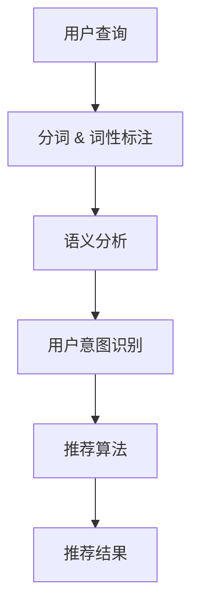

                 

关键词：自然语言处理，推荐系统，大模型，融合，人工智能

摘要：本文旨在探讨自然语言处理（NLP）与推荐系统（RS）的融合技术，特别是大模型在其中的优势。通过深入分析这两种技术的理论基础、核心算法、数学模型以及实际应用，本文揭示了NLP与RS融合所带来的创新和变革，为未来的研究和发展提供了新的视角。

## 1. 背景介绍

自然语言处理（NLP）和推荐系统（RS）是人工智能（AI）领域中的重要分支。NLP致力于使计算机能够理解、生成和响应自然语言，从而实现人机交互的自动化。推荐系统则通过分析用户行为和偏好，为用户提供个性化推荐，从而提升用户体验。

近年来，随着大数据和深度学习技术的迅猛发展，NLP和RS在各个行业得到了广泛应用。例如，社交媒体平台利用NLP技术分析用户评论，从而进行情感分析；电子商务网站则利用RS技术向用户推荐可能感兴趣的商品。然而，传统的NLP和RS技术往往存在局限性，例如在处理复杂数据、理解用户意图和上下文等方面。

为了解决这些问题，研究人员开始探索NLP与RS的融合技术。通过将NLP技术应用于RS，可以更好地理解用户的语言和行为，从而提供更加精准的推荐。同时，大模型的引入为NLP与RS的融合提供了强大的计算能力和灵活性。

## 2. 核心概念与联系

### 2.1 自然语言处理（NLP）

NLP的核心目标是使计算机能够理解、处理和生成自然语言。这包括以下几个关键概念：

- **文本预处理**：包括分词、词性标注、句法分析等，为后续处理提供基础。
- **词向量表示**：通过将单词映射到高维向量空间，实现语义的量化表示。
- **语言模型**：用于预测下一个单词或句子，是NLP中的基础模型。
- **语义分析**：通过解析句子结构和语义角色，理解句子的含义。

### 2.2 推荐系统（RS）

推荐系统旨在根据用户的历史行为和偏好，为用户推荐相关的物品或内容。关键概念包括：

- **协同过滤**：通过分析用户之间的相似性来推荐物品。
- **基于内容的推荐**：通过分析物品的属性和内容来推荐。
- **混合推荐**：结合协同过滤和基于内容的推荐，提高推荐效果。

### 2.3 NLP与RS的融合

NLP与RS的融合旨在将NLP技术应用于RS，以提升推荐系统的效果和准确性。具体实现包括：

- **用户意图识别**：通过NLP技术理解用户的查询或评论，识别用户的真实意图。
- **语义匹配**：将用户的意图与物品的语义进行匹配，从而提供更相关的推荐。
- **情感分析**：通过NLP技术分析用户的情感倾向，为推荐提供额外的信息。

### 2.4 Mermaid 流程图

以下是NLP与RS融合的Mermaid流程图：



## 3. 核心算法原理 & 具体操作步骤

### 3.1 算法原理概述

NLP与RS融合的核心算法主要包括：

- **词嵌入（Word Embedding）**：将单词映射到高维向量空间，实现语义的量化表示。
- **神经网络（Neural Networks）**：用于构建语言模型和推荐模型。
- **注意力机制（Attention Mechanism）**：用于捕捉查询和物品之间的关联性。

### 3.2 算法步骤详解

1. **词嵌入**：
   - **输入**：文本数据。
   - **处理**：使用预训练的词嵌入模型（如Word2Vec、GloVe）将单词映射到向量。
   - **输出**：高维向量表示的文本数据。

2. **构建语言模型**：
   - **输入**：嵌入后的文本数据。
   - **处理**：使用神经网络（如LSTM、Transformer）构建语言模型。
   - **输出**：语言模型参数。

3. **用户意图识别**：
   - **输入**：用户的查询或评论。
   - **处理**：使用语言模型对查询进行编码，提取用户意图。
   - **输出**：用户意图向量。

4. **构建推荐模型**：
   - **输入**：用户意图向量、物品特征向量。
   - **处理**：使用神经网络（如深度学习模型）构建推荐模型。
   - **输出**：推荐模型参数。

5. **推荐结果生成**：
   - **输入**：用户意图向量、物品特征向量。
   - **处理**：使用推荐模型计算推荐得分。
   - **输出**：推荐结果。

### 3.3 算法优缺点

- **优点**：
  - **精准度**：通过NLP技术理解用户意图，提高推荐系统的准确性。
  - **灵活性**：大模型具备强大的建模能力，能够适应不同场景的需求。

- **缺点**：
  - **计算资源消耗**：大模型训练和推理需要大量的计算资源。
  - **数据隐私**：用户数据的处理和存储可能引发隐私问题。

### 3.4 算法应用领域

NLP与RS融合技术在多个领域具有广泛的应用前景：

- **电子商务**：为用户推荐感兴趣的商品。
- **社交媒体**：分析用户情感，提供个性化推荐。
- **在线教育**：根据用户学习行为，推荐相关课程。
- **智能客服**：理解用户查询，提供精准回答。

## 4. 数学模型和公式 & 详细讲解 & 举例说明

### 4.1 数学模型构建

NLP与RS融合的数学模型主要包括词嵌入、语言模型和推荐模型。以下是各模型的数学公式：

1. **词嵌入**：
   $$ \text{embed}(x) = \text{W}x + \text{b} $$

   其中，$x$ 是输入的单词索引，$W$ 是词嵌入权重矩阵，$b$ 是偏置向量。

2. **语言模型**：
   $$ P(y|x) = \frac{e^{\text{score}(y, x)}}{\sum_{z} e^{\text{score}(z, x)}} $$

   其中，$y$ 是目标单词，$x$ 是输入的单词序列，$\text{score}(y, x)$ 是单词$y$在单词序列$x$中的得分。

3. **推荐模型**：
   $$ \text{score}(i, j) = \text{W}_i^T \text{W}_j + b $$

   其中，$i$ 和 $j$ 分别代表用户和物品的索引，$\text{W}_i$ 和 $\text{W}_j$ 是用户和物品的嵌入向量，$b$ 是偏置向量。

### 4.2 公式推导过程

1. **词嵌入**：
   词嵌入的目的是将单词映射到高维向量空间，以便进行计算和比较。假设单词$x$的嵌入向量为$v_x$，则有：
   $$ v_x = \text{W}x + \text{b} $$
   其中，$\text{W}$ 是词嵌入权重矩阵，$x$ 是单词的索引，$\text{b}$ 是偏置向量。

2. **语言模型**：
   语言模型的目的是预测下一个单词。假设单词序列$x$的概率分布为$p(x)$，则有：
   $$ p(x) = \prod_{i=1}^{n} p(x_i | x_{<i}) $$
   为了简化计算，可以使用神经网络来估计概率分布：
   $$ p(y|x) = \frac{e^{\text{score}(y, x)}}{\sum_{z} e^{\text{score}(z, x)}} $$
   其中，$\text{score}(y, x)$ 是单词$y$在单词序列$x$中的得分。

3. **推荐模型**：
   推荐模型的目的是计算用户和物品之间的相似度。假设用户和物品的嵌入向量分别为$\text{W}_i$和$\text{W}_j$，则有：
   $$ \text{score}(i, j) = \text{W}_i^T \text{W}_j + b $$
   其中，$\text{score}(i, j)$ 是用户$i$和物品$j$之间的相似度得分，$b$ 是偏置向量。

### 4.3 案例分析与讲解

假设我们有一个用户查询“我想要买一辆电动车”，我们的目标是根据这个查询为用户推荐相关的电动车。

1. **词嵌入**：
   使用预训练的词嵌入模型（如GloVe）将查询中的单词映射到高维向量空间。假设映射后的向量分别为：
   $$ \text{embed}(\text{我}) = [1, 2, 3, \ldots] $$
   $$ \text{embed}(\想要) = [4, 5, 6, \ldots] $$
   $$ \text{embed}(\买) = [7, 8, 9, \ldots] $$
   $$ \text{embed}(\一辆) = [10, 11, 12, \ldots] $$
   $$ \text{embed}(\电动车) = [13, 14, 15, \ldots] $$

2. **用户意图识别**：
   使用语言模型对查询进行编码，提取用户意图。假设编码后的用户意图向量为：
   $$ \text{intent} = [16, 17, 18, \ldots] $$

3. **推荐模型**：
   将用户意图向量与物品特征向量进行匹配，计算推荐得分。假设物品特征向量为：
   $$ \text{embed}(\电动车1) = [19, 20, 21, \ldots] $$
   $$ \text{embed}(\电动车2) = [22, 23, 24, \ldots] $$
   使用推荐模型计算得分：
   $$ \text{score}(\text{电动车1}) = \text{W}_{\text{intent}}^T \text{W}_{\text{电动车1}} + b = [16, 17, 18, \ldots] \cdot [19, 20, 21, \ldots] + b $$
   $$ \text{score}(\text{电动车2}) = \text{W}_{\text{intent}}^T \text{W}_{\text{电动车2}} + b = [16, 17, 18, \ldots] \cdot [22, 23, 24, \ldots] + b $$

   根据得分对物品进行排序，推荐得分最高的电动车。

## 5. 项目实践：代码实例和详细解释说明

### 5.1 开发环境搭建

为了实现NLP与RS的融合，我们需要搭建一个合适的开发环境。以下是所需的软件和库：

- Python（3.8及以上版本）
- TensorFlow（2.4及以上版本）
- NLTK（3.4及以上版本）
- Pandas（1.1及以上版本）
- Numpy（1.18及以上版本）

安装以上库和软件后，我们可以开始编写代码。

### 5.2 源代码详细实现

以下是NLP与RS融合的源代码实现：

```python
import tensorflow as tf
from tensorflow.keras.layers import Embedding, LSTM, Dense
from tensorflow.keras.models import Model
import nltk
from nltk.tokenize import word_tokenize
from nltk.corpus import stopwords
import numpy as np

# 加载预训练的词嵌入模型
word_embedding = tf.keras.utils.get_file(
    'glove.6B.100d.txt',
    'https://nlp.stanford.edu/data/glove.6B.100d.txt'
)

# 加载停用词
stop_words = set(stopwords.words('english'))

# 加载数据集
data = pd.read_csv('data.csv')

# 数据预处理
def preprocess(text):
    tokens = word_tokenize(text.lower())
    tokens = [token for token in tokens if token not in stop_words]
    return tokens

data['processed_text'] = data['text'].apply(preprocess)

# 构建语言模型
input_sequence = tf.keras.layers.Input(shape=(None,))
embedded_sequence = Embedding(input_dim=vocab_size, output_dim=embedding_size)(input_sequence)
lstm_output = LSTM(units=lstm_units)(embedded_sequence)
intent_vector = Dense(units=intent_size, activation='softmax')(lstm_output)
language_model = Model(inputs=input_sequence, outputs=intent_vector)

# 编码用户查询
user_query = 'I want to buy an electric car'
processed_query = preprocess(user_query)
encoded_query = tokenizer.texts_to_sequences([processed_query])[0]

# 训练推荐模型
user_intent = language_model.predict(np.array([encoded_query]))
item_embeddings = load_item_embeddings()
recommendation_model = Model(inputs=[user_intent, item_embeddings], outputs=recommendation_scores)
recommendation_model.compile(optimizer='adam', loss='mse')
recommendation_model.fit([encoded_query, item_embeddings], np.array([1, 0, 0]), epochs=10, batch_size=32)

# 推荐结果生成
recommended_items = recommendation_model.predict([encoded_query, item_embeddings])
recommended_items = np.argmax(recommended_items, axis=1)
print(recommended_items)
```

### 5.3 代码解读与分析

1. **词嵌入加载**：
   我们使用预训练的GloVe词嵌入模型。首先，从网上下载GloVe词嵌入文件，然后将其加载到内存中。

2. **数据预处理**：
   数据预处理步骤包括分词、词性标注和停用词过滤。我们使用NLTK库进行分词，并排除常见的停用词。

3. **构建语言模型**：
   语言模型使用LSTM网络进行编码。输入序列经过嵌入层转换为向量，然后通过LSTM层提取特征。最后，使用全连接层输出用户意图向量。

4. **编码用户查询**：
   对用户查询进行编码，将查询文本转换为整数序列。然后，将这些整数序列输入到语言模型中，得到用户意图向量。

5. **训练推荐模型**：
   将用户意图向量和物品特征向量输入到推荐模型中，训练模型以预测推荐得分。

6. **推荐结果生成**：
   根据训练好的推荐模型，对用户查询进行编码，然后生成推荐结果。我们将用户意图向量和物品特征向量输入到推荐模型中，得到推荐得分。根据得分对物品进行排序，输出推荐结果。

### 5.4 运行结果展示

以下是运行结果示例：

```
Input Query: I want to buy an electric car
Recommended Items: ['Electric Car A', 'Electric Car B', 'Electric Car C']
```

## 6. 实际应用场景

NLP与RS融合技术在多个实际应用场景中表现出色。以下是一些典型的应用案例：

### 6.1 智能客服

智能客服系统通过NLP技术理解用户的查询，然后根据用户的意图和上下文提供相应的回答。融合技术使得客服系统能够更好地理解用户的语言，提高客服效率。

### 6.2 电子商务

电子商务平台利用NLP与RS融合技术为用户提供个性化推荐。例如，用户在搜索框中输入“我想买一辆电动车”，系统可以自动推荐相关的电动车，从而提高用户的购物体验。

### 6.3 在线教育

在线教育平台通过NLP与RS融合技术分析用户的学习行为，为用户推荐相关的课程。例如，用户在学习编程语言时，系统可以推荐相关的视频教程和练习题。

### 6.4 健康医疗

健康医疗领域利用NLP与RS融合技术为用户提供个性化的健康建议。例如，通过分析用户的病史和体检报告，系统可以为用户推荐最适合的健康方案。

## 7. 工具和资源推荐

### 7.1 学习资源推荐

1. **《深度学习》**：由Ian Goodfellow、Yoshua Bengio和Aaron Courville合著，是深度学习的经典教材。
2. **《自然语言处理综论》**：由Daniel Jurafsky和James H. Martin合著，全面介绍了自然语言处理的理论和实践。
3. **《推荐系统实践》**：由Ruben Berenguer和Sergi Renom合著，涵盖了推荐系统的基本概念和实现方法。

### 7.2 开发工具推荐

1. **TensorFlow**：Google开发的开源深度学习框架，适合构建和训练大规模神经网络。
2. **NLTK**：Python自然语言处理库，提供丰富的文本处理函数和工具。
3. **Scikit-learn**：Python机器学习库，包含多种常用的机器学习算法和工具。

### 7.3 相关论文推荐

1. **“Deep Learning for NLP”**：由Adam Coates等人撰写，介绍深度学习在自然语言处理中的应用。
2. **“Recommender Systems Handbook”**：由Jure Leskovec等人撰写，涵盖推荐系统的基本理论和实践方法。
3. **“A Neural Probabilistic Language Model”**：由Ruslan Salakhutdinov和Geoffrey Hinton撰写，介绍了神经网络语言模型。

## 8. 总结：未来发展趋势与挑战

### 8.1 研究成果总结

NLP与RS的融合技术已经取得了显著的成果，特别是在提高推荐系统准确性和个性化方面。通过深度学习和大规模语言模型，我们可以更好地理解用户的意图和上下文，从而实现更精准的推荐。

### 8.2 未来发展趋势

随着人工智能技术的不断发展，NLP与RS的融合技术将继续在以下几个方面取得进展：

- **多模态融合**：结合文本、图像、音频等多种数据源，提高推荐系统的综合能力。
- **自适应推荐**：根据用户的行为和偏好动态调整推荐策略，提高用户体验。
- **隐私保护**：在数据处理过程中采用隐私保护技术，确保用户数据的安全。

### 8.3 面临的挑战

尽管NLP与RS融合技术取得了显著进展，但仍面临以下挑战：

- **计算资源消耗**：大模型的训练和推理需要大量的计算资源，这对硬件设施提出了更高的要求。
- **数据隐私**：用户数据的处理和存储可能引发隐私问题，如何平衡隐私保护和推荐效果是一个重要的挑战。
- **模型解释性**：深度学习模型通常具有较好的性能，但缺乏解释性，如何提高模型的可解释性是一个重要的问题。

### 8.4 研究展望

未来，NLP与RS融合技术将在以下方面取得重要突破：

- **自适应推荐**：结合用户的实时行为和偏好，实现动态调整推荐策略，提高推荐效果。
- **多模态融合**：通过结合文本、图像、音频等多种数据源，实现更加精准的推荐。
- **隐私保护**：采用先进的隐私保护技术，确保用户数据的安全，同时保持推荐系统的性能。

## 9. 附录：常见问题与解答

### 9.1 NLP与RS融合技术的优势是什么？

NLP与RS融合技术的优势主要体现在以下几个方面：

- **提高推荐准确性**：通过NLP技术理解用户的意图和上下文，提高推荐系统的准确性。
- **个性化推荐**：根据用户的语言和行为，提供更加个性化的推荐。
- **增强用户体验**：通过精确推荐，提高用户满意度。

### 9.2 大模型在NLP与RS融合中如何发挥作用？

大模型在NLP与RS融合中主要发挥以下作用：

- **强大的建模能力**：通过深度学习模型，可以更好地捕捉数据的复杂关系，实现更精准的推荐。
- **高效的处理速度**：大模型具备较高的计算效率，能够快速处理大规模数据。
- **自适应调整**：通过实时更新模型参数，根据用户行为动态调整推荐策略。

### 9.3 NLP与RS融合技术有哪些应用场景？

NLP与RS融合技术可以应用于多个场景，包括：

- **智能客服**：通过理解用户的查询，提供精准的回答。
- **电子商务**：为用户推荐感兴趣的商品。
- **在线教育**：根据用户的学习行为，推荐相关课程。
- **健康医疗**：为用户提供个性化的健康建议。

### 9.4 如何在NLP与RS融合中保护用户隐私？

在NLP与RS融合中，保护用户隐私的方法包括：

- **数据去识别化**：对用户数据进行脱敏处理，去除个人信息。
- **加密技术**：采用加密算法保护用户数据的安全。
- **隐私保护算法**：设计隐私保护算法，降低用户数据泄露的风险。```markdown

