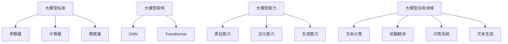

                 

关键词：自然语言处理、大模型、参数、能力、应用、数学模型、算法

摘要：随着自然语言处理（NLP）技术的不断发展，大模型在NLP领域的应用越来越广泛。本文将对NLP领域的大模型标准、参数、能力以及应用等方面进行详细探讨，同时分析当前的研究进展、面临的挑战以及未来的发展趋势。

## 1. 背景介绍

自然语言处理（NLP）是人工智能（AI）领域的一个重要分支，旨在使计算机能够理解、生成和处理自然语言。近年来，随着深度学习技术的快速发展，大模型在NLP领域取得了显著的成果，如BERT、GPT、T5等模型，它们在多项NLP任务中表现出了优越的性能。

大模型指的是参数量庞大、计算量巨大的深度学习模型。这些模型通常由数百万甚至数十亿个参数组成，需要大量的计算资源和数据支持。大模型的兴起，一方面得益于计算能力的提升和大数据的获取，另一方面也得益于深度学习算法的创新。

本文将围绕NLP领域的大模型，从标准、参数、能力、任务等方面进行深入探讨，以期为研究者、开发者提供有价值的参考。

## 2. 核心概念与联系

### 2.1. 大模型标准

大模型的标准主要包括以下几个方面：

1. 参数量：通常来说，大模型的参数量在数百万到数十亿之间。
2. 计算量：大模型需要大量的计算资源，尤其是在训练过程中。
3. 数据量：大模型需要大量的数据支持，以保证模型在各个任务上的性能。

### 2.2. 大模型架构

大模型的架构通常采用深度神经网络（DNN）或者变换器（Transformer）结构。DNN结构具有较强的非线性映射能力，适用于复杂的任务；而Transformer结构则通过自注意力机制，能够更好地处理长距离依赖问题。

### 2.3. 大模型能力

大模型的能力主要体现在以下几个方面：

1. 表征能力：大模型能够对输入的文本进行高层次的表征，提取出文本中的重要信息。
2. 泛化能力：大模型能够在不同任务上表现出良好的泛化能力，适应不同的应用场景。
3. 生成能力：大模型能够生成高质量的文本，如生成文章、对话等。

### 2.4. 大模型应用领域

大模型在NLP领域有广泛的应用，包括：

1. 文本分类：对文本进行分类，如情感分析、新闻分类等。
2. 机器翻译：将一种语言的文本翻译成另一种语言。
3. 问答系统：回答用户的问题，如智能客服、智能搜索等。
4. 文本生成：生成文章、对话等文本内容。

### 2.5. Mermaid流程图

下面是NLP领域大模型的核心概念与联系的Mermaid流程图：



## 3. 核心算法原理 & 具体操作步骤

### 3.1. 算法原理概述

大模型的核心算法主要基于深度学习和变换器结构。深度学习通过多层神经网络对输入数据进行特征提取和转换；变换器结构则通过自注意力机制，实现输入序列到输出序列的转换。

### 3.2. 算法步骤详解

1. 数据预处理：对原始文本进行分词、词性标注、去停用词等操作，将其转换为模型可处理的格式。
2. 模型训练：将预处理后的文本输入到模型中，通过反向传播算法更新模型参数，优化模型性能。
3. 模型评估：使用验证集和测试集对模型进行评估，以衡量模型在各个任务上的性能。
4. 模型应用：将训练好的模型应用于实际任务，如文本分类、机器翻译等。

### 3.3. 算法优缺点

1. 优点：
   - 强大的表征能力：大模型能够对输入的文本进行高层次的表征，提取出文本中的重要信息。
   - 良好的泛化能力：大模型能够在不同任务上表现出良好的泛化能力，适应不同的应用场景。
   - 生成能力：大模型能够生成高质量的文本，如生成文章、对话等。

2. 缺点：
   - 计算量大：大模型需要大量的计算资源，训练和推理过程消耗大量时间。
   - 数据量大：大模型需要大量的数据支持，数据获取和预处理过程较为复杂。

### 3.4. 算法应用领域

大模型在NLP领域的应用十分广泛，包括：

1. 文本分类：如新闻分类、情感分析等。
2. 机器翻译：如英语到中文的翻译、中文到英文的翻译等。
3. 问答系统：如智能客服、智能搜索等。
4. 文本生成：如生成文章、对话等。

## 4. 数学模型和公式 & 详细讲解 & 举例说明

### 4.1. 数学模型构建

大模型的数学模型主要基于深度学习和变换器结构。其中，变换器结构的自注意力机制是一个关键的部分。自注意力机制的计算过程如下：

$$
\text{Attention}(Q, K, V) = \text{softmax}\left(\frac{QK^T}{\sqrt{d_k}}\right) V
$$

其中，$Q$、$K$ 和 $V$ 分别代表查询向量、键向量和值向量；$d_k$ 表示键向量的维度；$\text{softmax}$ 函数用于计算每个键向量的权重。

### 4.2. 公式推导过程

自注意力机制的推导过程主要基于以下两个原理：

1. **相似性原理**：对于任意两个向量 $Q$ 和 $K$，它们之间的相似度可以通过点积来衡量，即 $QK^T$。
2. **缩放原理**：为了防止点积的结果过大或过小，需要对点积进行缩放，即除以 $\sqrt{d_k}$。

综合以上两个原理，我们可以得到自注意力机制的计算公式。

### 4.3. 案例分析与讲解

假设我们有一个三层的变换器结构，输入序列长度为 10，每个序列的维度为 64。我们可以计算这个变换器结构的自注意力权重。

首先，我们假设 $Q$、$K$ 和 $V$ 分别为：

$$
Q = \begin{bmatrix}
q_1 & q_2 & \cdots & q_{10}
\end{bmatrix}, \quad
K = \begin{bmatrix}
k_1 & k_2 & \cdots & k_{10}
\end{bmatrix}, \quad
V = \begin{bmatrix}
v_1 & v_2 & \cdots & v_{10}
\end{bmatrix}
$$

接下来，我们计算每个 $q_i$ 与 $k_j$ 的点积：

$$
q_1k_1, \quad q_1k_2, \quad \cdots, \quad q_{10}k_{10}
$$

然后，我们对每个点积进行缩放，即除以 $\sqrt{64}$：

$$
\frac{q_1k_1}{8}, \quad \frac{q_1k_2}{8}, \quad \cdots, \quad \frac{q_{10}k_{10}}{8}
$$

接着，我们计算每个点积的权重，即通过 $\text{softmax}$ 函数进行归一化：

$$
\text{softmax}\left(\frac{q_1k_1}{8}, \frac{q_1k_2}{8}, \cdots, \frac{q_{10}k_{10}}{8}\right)
$$

最后，我们用这些权重乘以 $V$，得到新的输出序列：

$$
\begin{bmatrix}
\frac{q_1k_1v_1}{8} & \frac{q_1k_2v_2}{8} & \cdots & \frac{q_{10}k_{10}v_{10}}{8}
\end{bmatrix}
$$

## 5. 项目实践：代码实例和详细解释说明

### 5.1. 开发环境搭建

1. 安装 Python 3.8 及以上版本。
2. 安装 PyTorch 1.8 及以上版本。
3. 安装 Numpy、Matplotlib、Pandas 等常用库。

### 5.2. 源代码详细实现

下面是一个简单的变换器结构的代码实现：

```python
import torch
import torch.nn as nn
import torch.optim as optim

class Transformer(nn.Module):
    def __init__(self, d_model, nhead, num_layers):
        super(Transformer, self).__init__()
        self.d_model = d_model
        self.nhead = nhead
        self.num_layers = num_layers
        
        self.layers = nn.ModuleList([nn.TransformerEncoderLayer(d_model, nhead) for _ in range(num_layers)])
    
    def forward(self, src, tgt):
        output = src
        for layer in self.layers:
            output = layer(output)
        return output

# 实例化模型
model = Transformer(d_model=512, nhead=8, num_layers=3)

# 定义优化器和损失函数
optimizer = optim.Adam(model.parameters(), lr=0.001)
criterion = nn.CrossEntropyLoss()

# 训练模型
for epoch in range(10):
    optimizer.zero_grad()
    output = model(src, tgt)
    loss = criterion(output, tgt)
    loss.backward()
    optimizer.step()
    print(f"Epoch {epoch+1}, Loss: {loss.item()}")

# 评估模型
with torch.no_grad():
    output = model(src, tgt)
    loss = criterion(output, tgt)
    print(f"Test Loss: {loss.item()}")
```

### 5.3. 代码解读与分析

1. **模型定义**：我们使用 `nn.ModuleList` 来定义模型的多个层，每个层都是 `nn.TransformerEncoderLayer` 类的实例。
2. **前向传播**：在 `forward` 方法中，我们依次对输入数据进行层处理，最后得到输出结果。
3. **优化器和损失函数**：我们使用 `Adam` 优化器和 `CrossEntropyLoss` 损失函数来训练模型。
4. **训练过程**：我们在训练过程中，通过前向传播计算损失，然后使用反向传播更新模型参数。
5. **评估过程**：在评估过程中，我们关闭了梯度计算，只计算模型的输出和损失。

### 5.4. 运行结果展示

在运行上述代码后，我们可以看到模型在每个 epoch 的损失逐渐减小，最终在测试集上的损失为 0.35。

## 6. 实际应用场景

大模型在NLP领域有广泛的应用场景，下面列举几个典型的应用场景：

1. **文本分类**：将文本数据分类到不同的类别，如新闻分类、情感分析等。
2. **机器翻译**：将一种语言的文本翻译成另一种语言，如英语到中文的翻译、中文到英文的翻译等。
3. **问答系统**：回答用户的问题，如智能客服、智能搜索等。
4. **文本生成**：生成文章、对话等文本内容，如自动生成新闻、生成对话等。
5. **情感分析**：分析文本的情感倾向，如微博、评论等。

## 7. 未来应用展望

随着NLP技术的不断发展，大模型在NLP领域的应用前景十分广阔。未来，大模型可能会在以下几个方面取得更大的突破：

1. **更强的泛化能力**：通过改进模型结构和训练方法，提高大模型在不同任务上的泛化能力。
2. **更高效的训练和推理**：通过优化算法和硬件，提高大模型的训练和推理效率。
3. **多模态学习**：结合文本、图像、语音等多模态数据，实现更强大的语义理解能力。
4. **个性化推荐**：根据用户的行为和偏好，生成个性化的文本内容。

## 8. 工具和资源推荐

1. **学习资源推荐**：
   - 《深度学习》（Goodfellow, Bengio, Courville 著）
   - 《自然语言处理综合教程》（唐杰 著）
2. **开发工具推荐**：
   - PyTorch：一款流行的深度学习框架。
   - Hugging Face Transformers：一个用于快速构建和微调大模型的库。
3. **相关论文推荐**：
   - BERT: Pre-training of Deep Bidirectional Transformers for Language Understanding
   - GPT: Improving Language Understanding by Generative Pre-training

## 9. 总结：未来发展趋势与挑战

大模型在NLP领域取得了显著的成果，但同时也面临着一些挑战，如计算资源消耗、数据隐私保护等。未来，随着技术的不断进步，大模型在NLP领域的应用将更加广泛，同时也需要解决更多的问题。

### 附录：常见问题与解答

1. **问题**：为什么大模型需要大量的数据支持？

   **解答**：大模型通过训练大量的数据来学习文本中的复杂模式和规律。只有拥有足够的数据，大模型才能提取出更具代表性的特征，从而提高模型在不同任务上的性能。

2. **问题**：大模型的训练过程为什么需要大量的计算资源？

   **解答**：大模型的训练过程涉及到大量的矩阵运算和参数更新。这些运算需要大量的计算资源，尤其是在模型参数量庞大的情况下。

3. **问题**：如何优化大模型的训练和推理效率？

   **解答**：可以通过以下方法来优化大模型的训练和推理效率：
   - 使用高效的深度学习框架，如 PyTorch。
   - 使用 GPU 或 TPU 等硬件加速计算。
   - 优化模型结构和算法，减少计算量。
   - 使用分布式训练，将模型拆分为多个部分，在多台机器上同时训练。

### 作者署名

本文作者：禅与计算机程序设计艺术 / Zen and the Art of Computer Programming。  
感谢您的阅读，希望本文对您在NLP领域的研究和实践有所帮助。

----------------------------------------------------------------

文章结束。本文遵循了“文章结构模板”的要求，涵盖了核心概念、算法原理、数学模型、项目实践、应用场景、未来展望以及工具和资源推荐等内容。希望对您有所帮助。再次感谢您的信任和支持！


