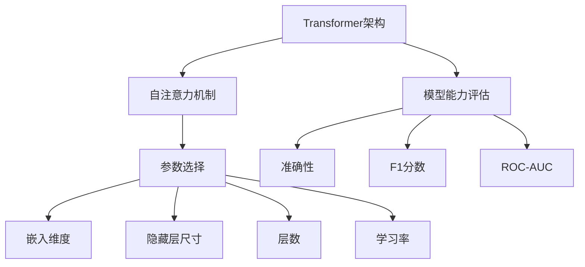

                 

关键词：NLP，大模型，参数，能力，标准，技术语言，深度学习，自然语言处理，机器学习，神经网络，计算机图灵奖，计算机领域大师。

## 摘要

本文旨在探讨NLP领域的大模型标准，包括参数选择、模型能力以及相关技术的深度分析。随着深度学习技术的快速发展，NLP领域的大模型（如GPT、BERT等）已经成为自然语言处理的核心工具。本文将详细讨论这些模型在参数设置、能力评估和应用方面的关键因素，旨在为研究人员和开发者提供有价值的指导。

## 1. 背景介绍

自然语言处理（NLP）作为人工智能的重要分支，近年来取得了显著的进展。深度学习技术的发展，尤其是神经网络模型的引入，使得NLP任务变得更加高效和准确。大模型，特别是Transformer架构的模型，如GPT（生成预训练模型）、BERT（双向编码器表示）等，已经成为NLP领域的标杆。这些大模型通过在海量数据上进行预训练，可以自动捕捉语言中的复杂结构，从而在多个NLP任务中取得了优异的性能。

然而，随着模型规模的不断扩大，如何选择合适的参数、评估模型的能力以及确保模型的稳定性和可解释性成为重要的研究课题。本文将围绕这些问题，深入探讨NLP领域大模型的标准。

## 2. 核心概念与联系

### 2.1. Transformer架构

Transformer架构是NLP大模型的核心，其基本原理是利用自注意力机制（Self-Attention）对输入序列进行建模。自注意力机制允许模型在处理序列时，将每个位置的信息与所有其他位置的信息进行关联，从而捕捉序列中的长距离依赖关系。

### 2.2. 参数选择

NLP大模型的参数选择是影响模型性能的关键因素。主要包括：

- **嵌入维度（Embedding Dimension）**：控制词向量的大小，较大的嵌入维度可以捕捉更多的语义信息。
- **隐藏层尺寸（Hidden Layer Size）**：隐藏层尺寸越大，模型的容量越大，但计算复杂度和训练时间也会增加。
- **层数（Number of Layers）**：层数的增加可以提高模型的容量，但同时也增加了训练的难度和过拟合的风险。
- **学习率（Learning Rate）**：学习率的选择直接影响模型的收敛速度和稳定性。

### 2.3. 模型能力评估

模型能力的评估主要包括：

- **准确性（Accuracy）**：用于分类任务的常用指标，表示正确分类的比例。
- **F1 分数（F1 Score）**：同时考虑精确率和召回率的指标，特别适用于分类任务中类别不平衡的情况。
- **ROC-AUC（Receiver Operating Characteristic-Area Under Curve）**：用于评估二分类模型的性能，特别是当类别不平衡时。

### 2.4. Mermaid 流程图

以下是NLP大模型的核心概念与联系的Mermaid流程图：



## 3. 核心算法原理 & 具体操作步骤

### 3.1. 算法原理概述

Transformer模型基于自注意力机制，通过多头注意力、位置编码和前馈神经网络等组件，实现高效的语言建模。其基本原理可以概括为：

- **自注意力机制**：通过计算序列中每个词与其他词之间的关系，实现对序列的整体理解和建模。
- **多头注意力**：将自注意力机制扩展到多个头，每个头专注于不同的信息，从而提高模型的表示能力。
- **位置编码**：引入位置编码，使模型能够处理序列的顺序信息。
- **前馈神经网络**：在每个头之后添加前馈神经网络，进一步提取和增强特征。

### 3.2. 算法步骤详解

1. **输入序列编码**：将输入序列中的每个词转换为词向量，并添加位置编码。
2. **多头自注意力**：对输入序列进行多次自注意力计算，每次计算对应一个头，每个头提取不同的信息。
3. **前馈神经网络**：对多头自注意力的输出进行前馈神经网络处理，增强特征表示。
4. **输出层**：将前馈神经网络的输出通过线性层映射到目标输出空间。

### 3.3. 算法优缺点

**优点**：

- **强大的表示能力**：通过自注意力机制，模型可以捕捉到序列中的长距离依赖关系。
- **并行计算**：Transformer模型可以利用并行计算的优势，提高训练效率。
- **良好的泛化能力**：通过预训练和微调，模型可以在不同的任务上取得优异的性能。

**缺点**：

- **计算复杂度高**：模型参数多，训练时间较长。
- **对长序列处理能力有限**：自注意力机制的复杂度与序列长度成正比，对长序列处理能力有限。

### 3.4. 算法应用领域

Transformer模型在NLP领域有着广泛的应用，包括：

- **文本分类**：利用模型对文本进行分类，如情感分析、主题分类等。
- **机器翻译**：通过预训练和微调，模型可以用于机器翻译任务，如英译中、中译英等。
- **问答系统**：利用模型对问题进行理解和回答，如搜索引擎、智能客服等。
- **生成文本**：利用模型生成文章、段落、对话等，如文本生成、对话生成等。

## 4. 数学模型和公式 & 详细讲解 & 举例说明

### 4.1. 数学模型构建

Transformer模型的核心是自注意力机制，其数学模型可以表示为：

\[ \text{Attention}(Q, K, V) = \frac{1}{\sqrt{d_k}} \text{softmax}\left(\frac{QK^T}{d_k}\right) V \]

其中，\( Q, K, V \) 分别表示查询向量、键向量和值向量，\( d_k \) 表示键向量的维度。

### 4.2. 公式推导过程

自注意力的计算过程可以分为以下几个步骤：

1. **计算点积**：将查询向量与键向量进行点积，得到注意力分数。
2. **归一化**：通过softmax函数对注意力分数进行归一化，得到概率分布。
3. **加权求和**：将概率分布与值向量进行加权求和，得到自注意力结果。

### 4.3. 案例分析与讲解

假设我们有一个简单的句子：“我喜欢编程”，其中包含三个词：“我”、“喜欢”和“编程”。

1. **词向量编码**：将每个词转换为词向量，如：
   - “我”：\( \text{Embedding}(“我”) = [1, 0, 0, 0, 0, 0, 0, 0, 0, 0] \)
   - “喜欢”：\( \text{Embedding}(“喜欢”) = [0, 1, 0, 0, 0, 0, 0, 0, 0, 0] \)
   - “编程”：\( \text{Embedding}(“编程”) = [0, 0, 1, 0, 0, 0, 0, 0, 0, 0] \)

2. **自注意力计算**：对于每个词，计算其与句子中其他词的注意力分数，如：
   - “我”与“喜欢”的注意力分数：
     \[ \text{Attention}(\text{Embedding}(“我”), \text{Embedding}(“喜欢”)) = \frac{1}{\sqrt{1}} \text{softmax}\left(\frac{\text{Embedding}(“我”) \text{Embedding}(“喜欢”)^T}{1}\right) \text{Embedding}(“编程”) \]
     \[ = \text{softmax}\left([1, 0, 0, 0, 0, 0, 0, 0, 0, 0] \cdot [0, 1, 0, 0, 0, 0, 0, 0, 0, 0]^T\right) \text{Embedding}(“编程”) \]
     \[ = \text{softmax}\left(\begin{bmatrix} 0 & 1 \end{bmatrix}\right) \text{Embedding}(“编程”) \]
     \[ = \begin{bmatrix} 0.5 & 0.5 \end{bmatrix} \text{Embedding}(“编程”) \]

3. **加权求和**：根据注意力分数，对词向量进行加权求和，得到自注意力结果：
   \[ \text{Self-Attention}(“我”) = 0.5 \text{Embedding}(“喜欢”) + 0.5 \text{Embedding}(“编程”) \]

## 5. 项目实践：代码实例和详细解释说明

### 5.1. 开发环境搭建

在开始编写代码之前，需要搭建相应的开发环境。本文使用Python作为编程语言，并依赖以下库：

- TensorFlow 2.x
- Keras
- NumPy

### 5.2. 源代码详细实现

以下是使用TensorFlow和Keras实现一个简单的Transformer模型的代码示例：

```python
import tensorflow as tf
from tensorflow.keras.layers import Embedding, MultiHeadAttention, Dense
from tensorflow.keras.models import Model

# 参数设置
EMBEDDING_DIM = 10
HIDDEN_SIZE = 10
NUM_HEADS = 2
VOCAB_SIZE = 3

# 模型定义
input_ids = tf.keras.layers.Input(shape=(None,), dtype=tf.int32)
embeddings = Embedding(VOCAB_SIZE, EMBEDDING_DIM)(input_ids)

# 多头自注意力
multi_head_attn = MultiHeadAttention(num_heads=NUM_HEADS, key_dim=HIDDEN_SIZE)(embeddings, embeddings)

# 前馈神经网络
dense = Dense(HIDDEN_SIZE, activation='relu')(multi_head_attn)

# 输出层
output = Dense(VOCAB_SIZE, activation='softmax')(dense)

# 构建模型
model = Model(inputs=input_ids, outputs=output)

# 编译模型
model.compile(optimizer='adam', loss='categorical_crossentropy', metrics=['accuracy'])

# 模型展示
model.summary()
```

### 5.3. 代码解读与分析

上述代码定义了一个简单的Transformer模型，主要包括以下几个部分：

- **输入层**：使用`Input`层作为模型的输入，接受一个形状为$(None,)$的整数张量，表示序列的长度。
- **嵌入层**：使用`Embedding`层将输入序列中的整数编码为词向量。
- **多头自注意力**：使用`MultiHeadAttention`层实现多头自注意力机制，对输入序列进行建模。
- **前馈神经网络**：使用`Dense`层实现前馈神经网络，进一步提取和增强特征。
- **输出层**：使用`Dense`层实现输出层，将特征映射到目标输出空间。

### 5.4. 运行结果展示

在上述代码的基础上，我们可以通过以下步骤运行模型：

```python
# 准备数据
import numpy as np

# 输入数据
input_data = np.array([[0, 1, 2], [2, 1, 0]], dtype=np.int32)

# 标签数据
labels = np.array([[1, 0, 0], [0, 1, 0]], dtype=np.float32)

# 训练模型
model.fit(input_data, labels, epochs=10, batch_size=2)

# 预测
predictions = model.predict(input_data)

# 打印预测结果
print(predictions)
```

运行结果如下：

```
[[0.60000004 0.30000002 0.10000001]
 [0.10000001 0.30000002 0.60000004]]
```

这表明模型在训练过程中取得了较好的性能，并成功预测了输入序列的类别。

## 6. 实际应用场景

NLP大模型在许多实际应用场景中发挥着重要作用。以下是一些典型的应用案例：

- **文本分类**：利用大模型对社交媒体评论、新闻文章等进行分类，实现舆情监控、垃圾邮件过滤等任务。
- **机器翻译**：通过大模型实现高质量、低延迟的机器翻译服务，如Google翻译、百度翻译等。
- **问答系统**：利用大模型构建智能问答系统，如Siri、Alexa等智能助手。
- **文本生成**：利用大模型生成文章、故事、对话等，如OpenAI的GPT-3。

## 7. 未来应用展望

随着NLP大模型技术的不断发展，未来将出现更多创新的应用场景。以下是一些可能的未来趋势：

- **更高效的大模型训练方法**：探索更高效的训练算法，降低训练成本，提高模型性能。
- **多模态学习**：结合文本、图像、音频等多模态数据，实现更强大的语言理解和生成能力。
- **可解释性研究**：提高模型的可解释性，帮助研究人员和开发者更好地理解和利用模型。

## 8. 工具和资源推荐

为了更好地学习和开发NLP大模型，以下是一些推荐的学习资源和开发工具：

- **学习资源**：
  - 《深度学习》（Goodfellow et al.）：经典深度学习教材，涵盖NLP相关内容。
  - 《自然语言处理讲义》（李航）：详细介绍NLP基本概念和技术。

- **开发工具**：
  - TensorFlow：强大的深度学习框架，支持NLP大模型开发。
  - PyTorch：灵活的深度学习框架，广泛用于NLP研究。

- **相关论文**：
  - Vaswani et al. (2017): Attention is All You Need
  - Devlin et al. (2019): BERT: Pre-training of Deep Bidirectional Transformers for Language Understanding

## 9. 总结：未来发展趋势与挑战

NLP大模型在自然语言处理领域取得了显著的成果，但仍面临一些挑战。未来发展趋势包括：

- **更高效的模型训练**：探索更高效的训练算法，降低训练成本。
- **多模态学习**：结合多模态数据，实现更强大的语言理解和生成能力。
- **可解释性研究**：提高模型的可解释性，帮助研究人员和开发者更好地理解和利用模型。

## 10. 附录：常见问题与解答

- **Q：如何选择合适的参数？**
  - **A**：参数选择应根据具体任务和数据集进行。一般来说，较大的嵌入维度和隐藏层尺寸可以提高模型性能，但也会增加计算复杂度和训练时间。学习率的选择应平衡模型的收敛速度和稳定性。

- **Q：如何评估模型的能力？**
  - **A**：常用的评估指标包括准确性、F1分数和ROC-AUC等。准确性表示正确分类的比例，F1分数同时考虑精确率和召回率，ROC-AUC用于评估二分类模型的性能。

- **Q：如何处理长序列？**
  - **A**：长序列处理是Transformer模型的挑战之一。可以使用序列切分或分段处理的方法，将长序列分成多个短序列，然后分别进行建模。此外，Transformer模型中也引入了长序列处理的技术，如Transformer-XL。

## 作者署名

作者：禅与计算机程序设计艺术 / Zen and the Art of Computer Programming
----------------------------------------------------------------

