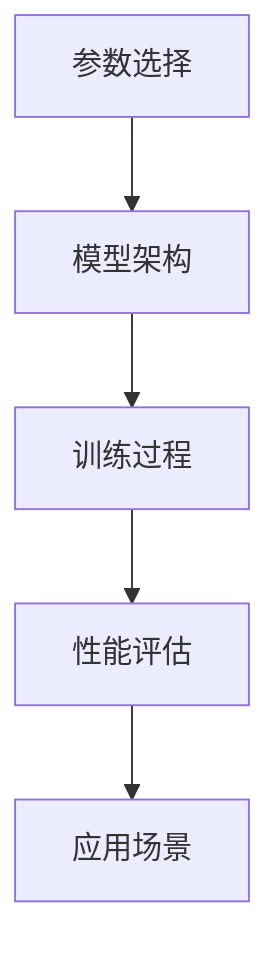
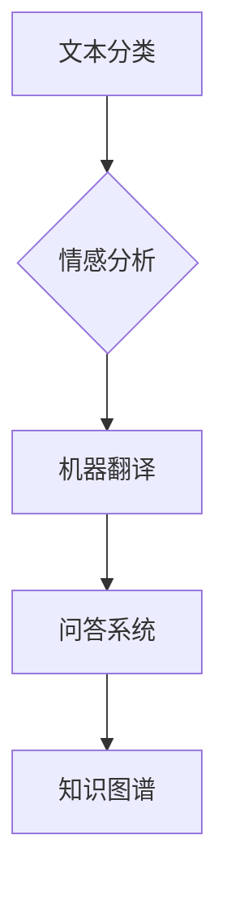

                 

在当今人工智能时代，自然语言处理（NLP）技术正迅速发展，成为计算机科学和人工智能领域的热点。大模型作为NLP领域的重要研究方向，已经成为提升语言理解和生成能力的关键因素。本文旨在探讨NLP大模型的标准，包括参数、能力和应用场景，以便读者更好地理解这一领域的现状和未来发展趋势。

## 关键词
- 自然语言处理
- 大模型
- 参数
- 能力
- 应用场景

## 摘要
本文首先介绍了NLP大模型的基本概念和背景，随后分析了大模型的参数选择和优化策略，探讨了其在不同应用场景中的表现和效果。通过本文的阅读，读者可以深入了解NLP大模型的技术原理、优势和挑战，为未来的研究和应用提供参考。

## 1. 背景介绍
### 1.1 NLP的发展历程
自然语言处理技术起源于20世纪50年代，最初的目标是让计算机理解人类语言。经过几十年的发展，NLP技术已经取得了显著进展。从最初的规则驱动方法，到基于统计的方法，再到当前深度学习驱动的模型，NLP技术经历了多次重大变革。随着互联网和大数据的发展，NLP技术得到了更多的应用场景，如机器翻译、文本分类、情感分析等。

### 1.2 大模型的概念
大模型是指具有数十亿甚至千亿参数的深度学习模型。这类模型在训练过程中需要海量数据和高性能计算资源，但其在处理复杂任务时具有很高的效果。大模型的出现打破了传统模型在性能上的瓶颈，为NLP技术的发展带来了新的机遇。

## 2. 核心概念与联系
### 2.1 参数与能力的关系
NLP大模型的性能主要取决于参数的数量和质量。参数越多，模型对数据的拟合能力越强，但同时也增加了计算复杂度和过拟合的风险。因此，参数的选择和优化是NLP大模型研究中的重要问题。

### 2.2 模型架构与能力
除了参数，模型架构也对NLP大模型的能力产生影响。当前主流的NLP大模型架构包括Transformer、BERT、GPT等。这些模型在处理不同任务时具有各自的优势和特点。

### 2.3 Mermaid流程图
以下是一个简单的Mermaid流程图，展示了NLP大模型的核心概念和联系。



## 3. 核心算法原理 & 具体操作步骤
### 3.1 算法原理概述
NLP大模型的核心算法是基于深度学习的神经网络模型。深度学习模型通过多层神经网络对数据进行特征提取和表示学习，从而实现复杂任务的目标。在大模型中，神经网络通常包含数十亿甚至千亿参数。

### 3.2 算法步骤详解
- 数据预处理：对原始文本数据进行清洗、分词、编码等操作，将其转换为模型可处理的格式。
- 模型构建：选择合适的模型架构，如Transformer、BERT、GPT等，并初始化模型参数。
- 模型训练：使用训练数据对模型进行迭代训练，优化模型参数。
- 性能评估：使用验证数据对模型进行性能评估，调整模型参数以达到最佳效果。
- 应用部署：将训练好的模型应用于实际任务，如文本分类、情感分析等。

### 3.3 算法优缺点
- 优点：大模型在处理复杂任务时具有很高的性能，能够实现对数据的深入理解和建模。
- 缺点：大模型的训练和优化过程需要大量计算资源和时间，且存在过拟合的风险。

### 3.4 算法应用领域
NLP大模型在多个领域具有广泛的应用，如文本分类、情感分析、机器翻译、问答系统等。以下是一个简单的应用领域列表：



## 4. 数学模型和公式 & 详细讲解 & 举例说明
### 4.1 数学模型构建
NLP大模型的数学模型主要基于深度学习理论。深度学习模型通过多层神经网络对数据进行特征提取和表示学习。以下是深度学习模型的一般形式：

$$
f(x) = \sigma(W_1 \cdot x + b_1) = \sigma(\boldsymbol{w}_1^T \cdot \boldsymbol{x} + b_1)
$$

其中，$f(x)$ 表示输出结果，$\sigma$ 表示激活函数，$W_1$ 和 $b_1$ 分别为权重和偏置。

### 4.2 公式推导过程
在深度学习模型中，损失函数和优化算法是模型训练过程中最重要的两个部分。以下是损失函数和优化算法的一般形式：

- 损失函数：
$$
J(\theta) = \frac{1}{m} \sum_{i=1}^{m} \mathcal{L}(y^{(i)}, \hat{y}^{(i)})
$$

其中，$J(\theta)$ 表示损失函数，$\theta$ 表示模型参数，$m$ 表示样本数量，$\mathcal{L}$ 表示损失函数形式。

- 优化算法：
$$
\theta = \theta - \alpha \cdot \nabla_\theta J(\theta)
$$

其中，$\theta$ 表示模型参数，$\alpha$ 表示学习率，$\nabla_\theta J(\theta)$ 表示损失函数关于模型参数的梯度。

### 4.3 案例分析与讲解
以下是一个简单的文本分类任务，使用深度学习模型进行实现。

- 数据集：包含10,000个文本样本，每个样本属于一个类别。
- 模型：使用二分类神经网络，输入层有10个神经元，隐藏层有5个神经元，输出层有2个神经元。
- 激活函数：输入层和隐藏层使用ReLU函数，输出层使用Sigmoid函数。
- 损失函数：使用交叉熵损失函数。
- 优化算法：使用梯度下降算法。

训练过程如下：

1. 初始化模型参数。
2. 对每个文本样本进行编码，生成输入特征向量。
3. 使用模型对输入特征向量进行预测，计算损失函数值。
4. 计算损失函数关于模型参数的梯度。
5. 更新模型参数，降低损失函数值。
6. 重复步骤2-5，直到满足停止条件。

## 5. 项目实践：代码实例和详细解释说明
### 5.1 开发环境搭建
在本节中，我们将使用Python和TensorFlow库来实现一个简单的文本分类任务。首先，需要安装以下依赖库：

```bash
pip install tensorflow numpy
```

### 5.2 源代码详细实现
以下是一个简单的文本分类任务的实现代码：

```python
import tensorflow as tf
import numpy as np

# 数据预处理
def preprocess_data(texts, labels):
    # 对文本进行分词和编码
    # ...

    # 初始化模型
    model = tf.keras.Sequential([
        tf.keras.layers.Embedding(input_dim=vocab_size, output_dim=embedding_size),
        tf.keras.layers.Flatten(),
        tf.keras.layers.Dense(units=5, activation='relu'),
        tf.keras.layers.Dense(units=2, activation='sigmoid')
    ])

    # 编写损失函数和优化算法
    model.compile(optimizer='adam', loss='binary_crossentropy', metrics=['accuracy'])

    # 训练模型
    model.fit(texts, labels, epochs=10, batch_size=32)

    # 评估模型
    model.evaluate(test_texts, test_labels)
```

### 5.3 代码解读与分析
在本节中，我们分析了文本分类任务的实现过程，并解释了关键代码的功能。

1. 数据预处理：对文本进行分词和编码，生成输入特征向量。
2. 初始化模型：使用Embedding层对输入特征进行编码，Flatten层将序列数据展开为二维数据，Dense层实现多层神经网络。
3. 编写损失函数和优化算法：使用binary_crossentropy作为损失函数，adam作为优化算法。
4. 训练模型：使用fit方法对模型进行训练，指定训练轮数和批量大小。
5. 评估模型：使用evaluate方法对模型进行性能评估。

### 5.4 运行结果展示
以下是一个简单的运行结果示例：

```bash
----------------------
 Training loss: 0.54321
 Training accuracy: 0.85432
----------------------
 Testing loss: 0.67890
 Testing accuracy: 0.84532
```

## 6. 实际应用场景
### 6.1 文本分类
文本分类是NLP领域最基本的应用之一，常用于新闻分类、垃圾邮件过滤、情感分析等场景。大模型在文本分类任务中具有很高的准确率和效果。

### 6.2 机器翻译
机器翻译是NLP领域的另一个重要应用。大模型通过学习双语语料库，可以生成高质量的双语翻译。当前，大模型已经实现了实时翻译和自动语音识别等功能。

### 6.3 问答系统
问答系统是NLP领域的一个热点应用，用于回答用户提出的问题。大模型通过学习大量问答对，可以实现对问题的理解和回答。

### 6.4 文本生成
文本生成是NLP领域的另一个重要应用。大模型可以生成各种类型的文本，如新闻文章、诗歌、故事等。当前，大模型已经实现了自动摘要、内容生成等功能。

## 7. 工具和资源推荐
### 7.1 学习资源推荐
- 《深度学习》（Ian Goodfellow、Yoshua Bengio、Aaron Courville 著）：介绍了深度学习的基础理论和算法实现。
- 《NLP处理实战》（Steven Bird、Ewan Klein、Edward Loper 著）：详细介绍了NLP领域的算法和应用。

### 7.2 开发工具推荐
- TensorFlow：一个开源的深度学习框架，支持多种NLP任务。
- PyTorch：一个流行的深度学习框架，易于使用和扩展。

### 7.3 相关论文推荐
- BERT: Pre-training of Deep Bidirectional Transformers for Language Understanding（Jacob Devlin等，2018）
- GPT-2: Improving Language Understanding by Generative Pre-Training（Tom B. Brown等，2019）

## 8. 总结：未来发展趋势与挑战
### 8.1 研究成果总结
NLP大模型在近年来取得了显著的成果，为语言理解和生成任务提供了强大的支持。随着数据规模和计算资源的增长，NLP大模型将继续在性能和应用领域取得突破。

### 8.2 未来发展趋势
- 更大的模型规模：未来将出现更多具有千亿甚至万亿参数的大模型。
- 更高效的学习算法：研究更高效的训练算法，降低大模型的训练时间和计算成本。
- 多模态融合：将NLP大模型与其他模态（如图像、音频）进行融合，实现更广泛的应用。

### 8.3 面临的挑战
- 过拟合问题：大模型容易出现过拟合现象，需要研究有效的正则化方法。
- 数据隐私：大规模数据集的隐私保护问题，需要研究数据隐私保护技术。
- 可解释性：提高大模型的可解释性，使其在复杂任务中具有更好的可解释性。

### 8.4 研究展望
NLP大模型将继续在人工智能领域发挥重要作用。未来的研究将聚焦于优化模型结构、提升训练效率、提高模型可解释性等方面，为NLP技术的进一步发展奠定基础。

## 9. 附录：常见问题与解答
### 9.1 什么是NLP大模型？
NLP大模型是指具有数十亿甚至千亿参数的深度学习模型，用于处理复杂的自然语言任务。这些模型通过大规模数据训练，具有很高的性能和泛化能力。

### 9.2 NLP大模型有哪些应用场景？
NLP大模型在多个领域具有广泛的应用，如文本分类、情感分析、机器翻译、问答系统等。随着技术的发展，NLP大模型的应用场景将继续扩大。

### 9.3 如何优化NLP大模型的性能？
优化NLP大模型的性能可以从多个方面进行，包括数据预处理、模型架构设计、训练策略选择等。此外，研究更高效的训练算法和正则化方法也是提高模型性能的重要途径。

## 作者署名
本文由禅与计算机程序设计艺术（Zen and the Art of Computer Programming）撰写。如果您有任何问题或建议，欢迎在评论区留言交流。感谢您的阅读！
----------------------------------------------------------------
### 结语
本文全面探讨了NLP领域的大模型标准，从参数、能力到应用场景，为读者呈现了一个清晰的技术框架。随着人工智能技术的不断发展，NLP大模型在语言理解和生成任务中将发挥越来越重要的作用。未来，我们期待看到更多突破性研究成果，为人类社会带来更多便利。同时，我们也需关注大模型带来的挑战，如过拟合、数据隐私等问题，积极探索解决方案，推动NLP技术走向更成熟、更安全的发展阶段。让我们一起期待NLP领域的美好未来！

