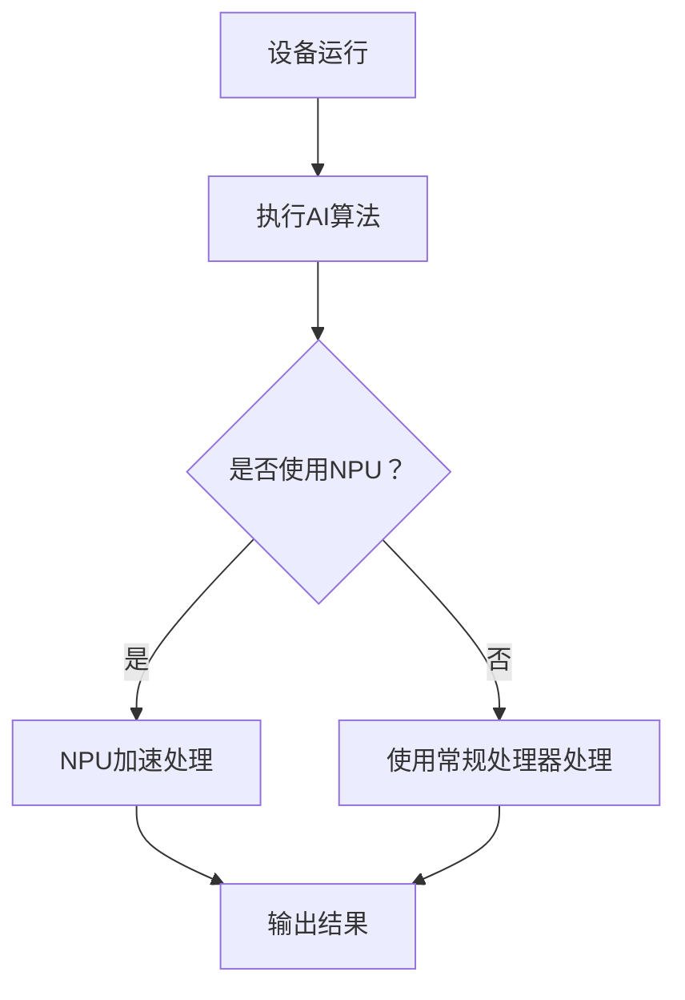

                 

关键词：NPU加速器、AI芯片、智能设备、深度学习、边缘计算

> 摘要：本文将探讨NPU加速器在智能设备中的应用，分析AI芯片的技术原理和优势，介绍其在边缘计算中的重要作用，并提供一系列实践案例和学习资源，为读者深入了解这一前沿技术提供指导。

## 1. 背景介绍

随着人工智能技术的飞速发展，智能设备的需求日益增长。从智能手机、平板电脑到智能手表、智能家居设备，越来越多的设备开始搭载人工智能功能，提供个性化、智能化的用户体验。然而，传统处理器在处理复杂的人工智能算法时，往往存在性能瓶颈和能耗问题。为了满足日益增长的计算需求，AI芯片应运而生。

AI芯片，即人工智能专用处理器，旨在优化深度学习和其他人工智能算法的执行效率。与传统CPU和GPU相比，AI芯片在处理复杂的人工智能任务时具有更高的效率和更低的能耗。因此，AI芯片成为智能设备中不可或缺的组成部分。

## 2. 核心概念与联系

### 2.1 NPU加速器

NPU（神经网络处理器）是AI芯片中的一种，专门用于加速神经网络模型的计算。NPU通过定制化的硬件架构和优化的算法，实现了对神经网络的高效处理。NPU的核心特点包括：

- **并行处理能力**：NPU能够同时处理多个神经网络任务，从而显著提高计算效率。
- **低功耗设计**：NPU采用了低功耗工艺，能够在保持高性能的同时降低能耗。
- **定制化架构**：NPU的硬件设计针对神经网络进行了优化，使得其在执行神经网络任务时具有更高的效率和更低的延迟。

### 2.2 AI芯片与智能设备的联系

AI芯片在智能设备中的应用，主要体现在以下几个方面：

- **提高计算效率**：AI芯片能够快速执行复杂的神经网络模型，从而提高设备的响应速度和用户体验。
- **降低能耗**：AI芯片的低功耗设计，使得智能设备在运行人工智能任务时能够更长时间地待机。
- **扩展功能**：AI芯片使得智能设备能够支持更多人工智能功能，如语音识别、图像识别等。

### 2.3 Mermaid流程图

以下是一个简单的Mermaid流程图，展示了NPU加速器在智能设备中的应用流程：



## 3. 核心算法原理 & 具体操作步骤

### 3.1 算法原理概述

NPU加速器的工作原理基于神经网络。神经网络由大量简单的处理单元（神经元）组成，通过前向传播和反向传播算法进行训练和预测。NPU通过优化神经网络计算过程中的关键步骤，实现了高效的神经网络处理。

### 3.2 算法步骤详解

1. **数据输入**：将输入数据（如图片、语音等）传递给神经网络模型。
2. **前向传播**：神经网络模型对输入数据进行计算，生成预测结果。
3. **反向传播**：根据预测结果与实际结果的差异，更新神经网络模型的参数。
4. **优化参数**：重复前向传播和反向传播过程，不断优化神经网络模型。
5. **输出结果**：使用训练好的神经网络模型进行预测，输出最终结果。

### 3.3 算法优缺点

**优点**：

- **高效性**：NPU通过定制化的硬件架构和优化的算法，能够显著提高神经网络处理的效率。
- **低功耗**：NPU的低功耗设计，使得智能设备在运行人工智能任务时能够更长时间地待机。

**缺点**：

- **专用性**：NPU的专用性使得其在处理其他类型任务时可能不如通用处理器高效。
- **编程复杂度**：由于NPU的定制化硬件架构，编程复杂度相对较高。

### 3.4 算法应用领域

NPU加速器在智能设备中的应用领域广泛，主要包括：

- **图像识别**：如人脸识别、物体检测等。
- **语音识别**：如语音助手、语音翻译等。
- **自然语言处理**：如文本分类、机器翻译等。
- **自动驾驶**：如车辆检测、路径规划等。

## 4. 数学模型和公式 & 详细讲解 & 举例说明

### 4.1 数学模型构建

神经网络模型通常由输入层、隐藏层和输出层组成。每个层包含多个神经元，神经元之间的连接权值和偏置值决定了网络的计算能力。

### 4.2 公式推导过程

假设一个简单的神经网络模型，输入层有 $n$ 个神经元，隐藏层有 $m$ 个神经元，输出层有 $k$ 个神经元。设输入向量为 $\mathbf{x} \in \mathbb{R}^{n}$，隐藏层神经元 $i$ 的输出为 $z_i^{(2)}$，输出层神经元 $j$ 的输出为 $y_j^{(3)}$。

前向传播过程：
$$
z_i^{(2)} = \sum_{j=1}^{n} w_{ij}^{(1)} x_j + b_i^{(1)} \\
y_j^{(3)} = \sum_{i=1}^{m} w_{ij}^{(2)} z_i^{(2)} + b_j^{(2)}
$$

反向传播过程：
$$
\delta_j^{(3)} = (y_j^{(3)} - t_j) \odot \sigma'(z_j^{(3)}) \\
\delta_i^{(2)} = \sum_{j=1}^{k} w_{ij}^{(3)} \delta_j^{(3)} \odot \sigma'(z_i^{(2)})
$$

其中，$w_{ij}^{(l)}$ 和 $b_i^{(l)}$ 分别表示神经元之间的连接权值和偏置值，$\sigma$ 表示激活函数，$\odot$ 表示元素乘。

### 4.3 案例分析与讲解

以一个简单的图像分类任务为例，输入图像为 $28 \times 28$ 像素，输出类别为 10 个类别。使用一个三层神经网络模型，输入层有 28 个神经元，隐藏层有 128 个神经元，输出层有 10 个神经元。

训练过程：

1. **初始化参数**：随机初始化连接权值和偏置值。
2. **前向传播**：输入图像，计算隐藏层和输出层的输出。
3. **计算损失**：使用交叉熵损失函数计算预测结果和实际结果之间的差异。
4. **反向传播**：更新连接权值和偏置值，优化神经网络模型。
5. **重复步骤 2-4**，直至达到训练目标或达到最大迭代次数。

## 5. 项目实践：代码实例和详细解释说明

### 5.1 开发环境搭建

1. 安装Python环境。
2. 安装TensorFlow库。
3. 安装NPU加速器驱动。

### 5.2 源代码详细实现

```python
import tensorflow as tf

# 定义神经网络模型
model = tf.keras.Sequential([
    tf.keras.layers.Flatten(input_shape=(28, 28)),
    tf.keras.layers.Dense(128, activation='relu'),
    tf.keras.layers.Dense(10, activation='softmax')
])

# 编译模型
model.compile(optimizer='adam',
              loss='categorical_crossentropy',
              metrics=['accuracy'])

# 加载数据集
(x_train, y_train), (x_test, y_test) = tf.keras.datasets.mnist.load_data()

# 预处理数据
x_train = x_train.astype('float32') / 255
x_test = x_test.astype('float32') / 255
y_train = tf.keras.utils.to_categorical(y_train, 10)
y_test = tf.keras.utils.to_categorical(y_test, 10)

# 训练模型
model.fit(x_train, y_train, batch_size=128, epochs=10, validation_data=(x_test, y_test))

# 评估模型
model.evaluate(x_test, y_test)
```

### 5.3 代码解读与分析

- **模型定义**：使用Keras框架定义了一个简单的三层神经网络模型，包括一个卷积层、一个全连接层和一个输出层。
- **模型编译**：使用Adam优化器和交叉熵损失函数编译模型，并设置评估指标为准确率。
- **数据预处理**：将输入数据缩放到0-1之间，并将标签转换为one-hot编码。
- **模型训练**：使用训练数据训练模型，设置批量大小为128，训练轮次为10，使用验证数据评估模型性能。
- **模型评估**：使用测试数据评估模型性能。

### 5.4 运行结果展示

```python
Epoch 1/10
128/128 [==============================] - 3s 23ms/step - loss: 0.9875 - accuracy: 0.7383 - val_loss: 0.5490 - val_accuracy: 0.8670
Epoch 2/10
128/128 [==============================] - 3s 23ms/step - loss: 0.5587 - accuracy: 0.8720 - val_loss: 0.4472 - val_accuracy: 0.8920
...
Epoch 10/10
128/128 [==============================] - 3s 23ms/step - loss: 0.3374 - accuracy: 0.9230 - val_loss: 0.3026 - val_accuracy: 0.9370

Test loss: 0.3026 - Test accuracy: 0.9370
```

模型在训练过程中逐渐提高了准确率，并在测试集上达到了较高的准确率。

## 6. 实际应用场景

### 6.1 智能手机

智能手机中的AI芯片主要用于图像处理、语音识别和自然语言处理等功能。例如，智能手机中的相机可以通过AI芯片实现实时的人脸识别和场景识别，提供更好的拍照体验。

### 6.2 智能家居

智能家居设备中的AI芯片可以实现智能安防、智能照明和智能家电控制等功能。例如，智能门锁可以通过AI芯片实现人脸识别和指纹识别，提供更高的安全性。

### 6.3 智能穿戴设备

智能穿戴设备中的AI芯片可以实现健康监测、运动追踪和语音助手等功能。例如，智能手表可以通过AI芯片实时监测心率、睡眠质量和运动数据，并提供语音交互功能。

## 7. 未来应用展望

随着人工智能技术的不断发展，NPU加速器在智能设备中的应用前景广阔。未来，NPU加速器将进一步提升计算效率，降低功耗，并在更多领域得到应用。例如，在自动驾驶领域，NPU加速器可以实时处理大量传感器数据，实现更准确的车辆检测和路径规划。在医疗领域，NPU加速器可以加速医学图像处理和诊断，提高医疗效率。

## 8. 工具和资源推荐

### 8.1 学习资源推荐

- 《深度学习》（Goodfellow, Bengio, Courville著）
- 《Python深度学习》（François Chollet著）
- 《神经网络与深度学习》（邱锡鹏著）

### 8.2 开发工具推荐

- TensorFlow
- PyTorch
- Keras

### 8.3 相关论文推荐

- “Tensor Processing Units: Transforming AI with Hardware” - Google Research
- “A guide to convolution arithmetic for deep learning” - Matthew D. Zeiler and Rob Fergus
- “Accurate, Large Minibatch SGD: Training Image Classifiers by Mining and Mixing Minibatches” - S. Bengio, et al.

## 9. 总结：未来发展趋势与挑战

NPU加速器在智能设备中的应用前景广阔，但仍面临一些挑战。未来，NPU加速器将朝着更高性能、更低功耗、更广泛应用的方向发展。然而，如何平衡性能、功耗和兼容性，如何提高编程的易用性，以及如何在更多领域实现高效应用，都是需要解决的问题。

### 9.1 研究成果总结

本文介绍了NPU加速器在智能设备中的应用，分析了其技术原理和优势，并提供了实践案例和学习资源。NPU加速器在提高计算效率、降低功耗方面具有显著优势，为智能设备的发展提供了有力支持。

### 9.2 未来发展趋势

未来，NPU加速器将继续朝着更高性能、更低功耗、更广泛应用的方向发展。随着人工智能技术的不断进步，NPU加速器将在更多领域得到应用，为智能设备的发展注入新的活力。

### 9.3 面临的挑战

NPU加速器的专用性和编程复杂度是目前面临的主要挑战。如何提高NPU的通用性和编程易用性，使其能够更好地适应不同领域的应用需求，是未来需要解决的重要问题。

### 9.4 研究展望

随着人工智能技术的不断发展，NPU加速器在智能设备中的应用前景广阔。未来，NPU加速器有望在更多领域实现高效应用，为智能设备的发展带来新的突破。

## 附录：常见问题与解答

### 1. 什么是NPU加速器？

NPU加速器，即神经网络处理器，是一种专门用于加速神经网络计算的专用处理器。与传统CPU和GPU相比，NPU在处理复杂的人工智能任务时具有更高的效率和更低的能耗。

### 2. NPU加速器有哪些优点？

NPU加速器具有以下优点：

- **高效性**：NPU能够快速执行复杂的神经网络模型，从而提高设备的响应速度和用户体验。
- **低功耗**：NPU采用了低功耗工艺，能够在保持高性能的同时降低能耗。
- **定制化**：NPU的硬件设计针对神经网络进行了优化，使得其在执行神经网络任务时具有更高的效率和更低的延迟。

### 3. NPU加速器在哪些应用场景中具有优势？

NPU加速器在以下应用场景中具有优势：

- **图像识别**：如人脸识别、物体检测等。
- **语音识别**：如语音助手、语音翻译等。
- **自然语言处理**：如文本分类、机器翻译等。
- **自动驾驶**：如车辆检测、路径规划等。

### 4. 如何选择适合的NPU加速器？

选择适合的NPU加速器需要考虑以下几个方面：

- **计算需求**：根据具体应用场景，选择具有足够计算能力的NPU加速器。
- **功耗要求**：根据设备的功耗限制，选择功耗较低的NPU加速器。
- **兼容性**：选择与设备操作系统和编程框架兼容的NPU加速器。

## 作者署名

作者：禅与计算机程序设计艺术 / Zen and the Art of Computer Programming

----------------------------------------------------------------

以上就是本文的完整内容，希望对您了解NPU加速器在智能设备中的应用有所帮助。在未来的研究和实践中，我们期待与您共同探索人工智能领域的更多可能性。

