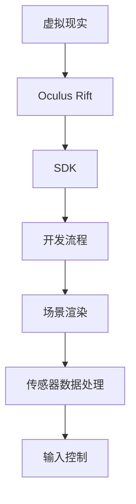

                 

关键词：Oculus Rift SDK，VR应用开发，Oculus Rift平台，虚拟现实，开发工具，编程技术

摘要：本文将详细介绍如何使用Oculus Rift SDK集成到开发项目中，从而在Rift平台上创建引人入胜的VR应用。我们将探讨SDK的核心功能、开发流程、以及实际操作步骤，并给出相应的示例代码和解释。通过阅读本文，开发者可以快速上手Oculus Rift SDK，为其VR项目添加强大的功能。

## 1. 背景介绍

虚拟现实（VR）作为一项新兴技术，正迅速改变着人们的娱乐、教育和工作方式。Oculus Rift作为当前市场上最具影响力的VR头戴设备之一，其高分辨率、低延迟以及优秀的沉浸感，使其成为了开发VR应用的重要平台。

Oculus Rift SDK（软件开发工具包）是Oculus提供的官方开发工具，它为开发者提供了创建和优化VR应用程序的全面支持。SDK包括了一系列的核心功能，如场景渲染、传感器数据处理、输入控制等，这些功能可以帮助开发者快速搭建起一个完整的VR应用。

本文旨在通过以下内容，帮助开发者深入了解Oculus Rift SDK的使用方法，并掌握如何在Rift平台上开发VR应用：

1. SDK的核心功能和架构
2. 开发流程和步骤
3. 数学模型和公式
4. 实际代码实例和解释
5. 应用场景和未来展望
6. 工具和资源推荐

## 2. 核心概念与联系

在介绍Oculus Rift SDK之前，我们需要理解一些核心概念和它们之间的联系。以下是几个关键概念及其简要说明：

### 2.1 虚拟现实（VR）

虚拟现实是一种通过计算机技术创造的模拟环境，用户可以通过头戴显示器（如Oculus Rift）进入并与之交互。

### 2.2 Oculus Rift

Oculus Rift是由Facebook旗下公司Oculus开发的虚拟现实头戴显示器。它提供了高分辨率、低延迟的视觉效果，以及精准的位置跟踪。

### 2.3 SDK（软件开发工具包）

SDK是一套为特定开发平台或工具提供的编程接口，它包含了开发应用程序所需的各种库、工具和文档。

### 2.4 开发流程

开发流程指的是从需求分析、设计、编码到测试和发布的整个过程。

以下是Oculus Rift SDK核心概念的Mermaid流程图：



### 2.5 场景渲染

场景渲染是VR应用中的一个核心部分，它负责在Oculus Rift的屏幕上生成和显示虚拟环境。

### 2.6 传感器数据处理

传感器数据处理负责收集和处理头戴显示器和手柄的传感器数据，以实现精准的位置跟踪和运动控制。

### 2.7 输入控制

输入控制是指用户如何通过手柄或其他设备与VR应用进行交互。

通过理解这些核心概念，我们将为后续内容的讲解打下坚实的基础。

## 3. 核心算法原理 & 具体操作步骤

### 3.1 算法原理概述

Oculus Rift SDK的核心算法主要集中在场景渲染、传感器数据处理和输入控制等方面。以下是这些算法的基本原理：

### 3.1.1 场景渲染

场景渲染算法负责生成和显示虚拟环境。它利用计算机图形学技术，将三维模型和纹理映射到Oculus Rift的屏幕上。为了实现流畅的视觉效果，渲染算法需要考虑以下几个方面：

- **多线程处理**：为了提高渲染效率，渲染过程通常在多个线程上进行。
- **光学失真校正**：Oculus Rift屏幕上的像素与用户视角之间存在光学失真，渲染算法需要对其进行校正。
- **动态分辨率调整**：根据用户视角的变化，动态调整渲染分辨率，以优化性能和视觉体验。

### 3.1.2 传感器数据处理

传感器数据处理算法负责收集和处理Oculus Rift头戴显示器和手柄的传感器数据。这些数据包括位置、方向、加速度等，用于实现精准的位置跟踪和运动控制。传感器数据处理算法主要包括以下步骤：

- **原始数据采集**：从传感器获取原始数据。
- **数据预处理**：对原始数据进行滤波、去抖动等处理，以提高数据质量。
- **姿态估计**：利用卡尔曼滤波或其他算法，估计头戴显示器和手柄的姿态。
- **位置跟踪**：根据姿态估计结果，计算头戴显示器和手柄在虚拟环境中的位置。

### 3.1.3 输入控制

输入控制算法负责处理用户通过手柄或其他设备与VR应用的交互。它主要包括以下步骤：

- **输入事件捕获**：捕获用户的输入事件，如按钮点击、手柄移动等。
- **输入映射**：将输入事件映射到虚拟环境中的操作，如移动、旋转等。
- **输入反馈**：向用户反馈输入结果，如振动、声音等。

### 3.2 算法步骤详解

#### 3.2.1 场景渲染步骤详解

1. **初始化渲染环境**：配置渲染器、加载三维模型和纹理等。
2. **计算视角和投影矩阵**：根据头戴显示器的位置和方向，计算视角和投影矩阵。
3. **绘制场景**：遍历场景中的物体，使用渲染器进行绘制。
4. **应用光学失真校正**：对绘制的图像应用光学失真校正。
5. **显示结果**：将校正后的图像显示在Oculus Rift屏幕上。

#### 3.2.2 传感器数据处理步骤详解

1. **采集传感器数据**：从头戴显示器和手柄的传感器中获取位置、方向、加速度等数据。
2. **数据预处理**：对传感器数据进行滤波、去抖动等处理。
3. **姿态估计**：利用卡尔曼滤波或其他算法，估计头戴显示器和手柄的姿态。
4. **位置跟踪**：根据姿态估计结果，计算头戴显示器和手柄在虚拟环境中的位置。
5. **更新渲染场景**：根据位置跟踪结果，更新虚拟环境中的物体位置。

#### 3.2.3 输入控制步骤详解

1. **捕获输入事件**：从手柄或其他输入设备中捕获输入事件，如按钮点击、手柄移动等。
2. **输入映射**：将输入事件映射到虚拟环境中的操作，如移动、旋转等。
3. **执行输入操作**：根据输入映射结果，执行相应的操作，如移动物体、旋转视角等。
4. **输入反馈**：向用户反馈输入结果，如振动、声音等。

### 3.3 算法优缺点

#### 3.3.1 优点

- **高分辨率和低延迟**：Oculus Rift提供了高分辨率和低延迟的视觉效果，为用户提供了优秀的沉浸感。
- **全面的功能支持**：Oculus Rift SDK提供了丰富的功能，包括场景渲染、传感器数据处理和输入控制等，方便开发者快速搭建VR应用。
- **广泛的社区支持**：Oculus Rift拥有庞大的开发者社区，提供了大量的教程、文档和资源，有助于开发者解决开发过程中遇到的问题。

#### 3.3.2 缺点

- **硬件成本较高**：Oculus Rift的硬件成本较高，可能不适合预算有限的项目。
- **对开发环境要求较高**：开发Oculus Rift应用需要配置高性能的计算机和开发环境，对硬件和软件都有较高的要求。

### 3.4 算法应用领域

Oculus Rift SDK的应用领域非常广泛，包括但不限于以下几个方面：

- **游戏开发**：开发者可以利用Oculus Rift SDK创建沉浸式的游戏体验，提高游戏的互动性和趣味性。
- **教育培训**：通过Oculus Rift SDK，开发者可以创建虚拟的教学环境，提高学生的参与度和学习效果。
- **医疗健康**：Oculus Rift SDK可以用于治疗恐惧症、焦虑症等心理疾病，提供虚拟的治疗场景。
- **建筑设计**：建筑师可以利用Oculus Rift SDK在虚拟环境中展示建筑模型，提高设计的可操作性和可展示性。

### 3.5 实际应用案例

以下是一个简单的实际应用案例，展示如何使用Oculus Rift SDK开发一个简单的VR游戏：

#### 3.5.1 游戏概念

游戏名为“太空探险”，玩家将扮演一名太空探险家，在虚拟的太空中收集资源和探索星球。

#### 3.5.2 开发步骤

1. **环境搭建**：下载并安装Oculus Rift SDK和相关开发工具，如Unity或Unreal Engine。
2. **场景创建**：使用Unity或Unreal Engine创建游戏场景，包括太空、星球、飞船等元素。
3. **渲染设置**：配置渲染器，设置光学失真校正、动态分辨率调整等参数。
4. **传感器集成**：集成Oculus Rift头戴显示器和手柄的传感器数据，实现位置跟踪和运动控制。
5. **输入控制**：设置输入映射和输入反馈，实现玩家的操作和反馈。
6. **游戏逻辑**：编写游戏逻辑，包括玩家移动、资源收集等。
7. **测试与优化**：在Oculus Rift平台上进行测试，优化游戏性能和用户体验。

#### 3.5.3 代码示例

以下是一个简单的Unity C#脚本，用于实现玩家的移动：

```csharp
using UnityEngine;

public class PlayerMovement : MonoBehaviour
{
    public float speed = 5.0f;

    private Transform playerTransform;
    private CharacterController characterController;

    void Start()
    {
        playerTransform = transform;
        characterController = GetComponent<CharacterController>();
    }

    void Update()
    {
        float moveForward = Input.GetAxis("Vertical") * speed;
        float moveRight = Input.GetAxis("Horizontal") * speed;

        Vector3 moveDirection = new Vector3(moveRight, 0, moveForward);

        if (characterController.isGrounded)
        {
            moveDirection = transform.TransformDirection(moveDirection);
            characterController.Move(moveDirection * speed * Time.deltaTime);
        }
    }
}
```

通过上述步骤和代码示例，开发者可以快速上手Oculus Rift SDK，并创建出自己的VR应用。

### 4. 数学模型和公式 & 详细讲解 & 举例说明

在开发VR应用时，数学模型和公式扮演着至关重要的角色。以下将详细介绍Oculus Rift SDK中常用的数学模型和公式，并通过实际例子进行说明。

#### 4.1 数学模型构建

Oculus Rift SDK中的数学模型主要包括以下几个方面：

1. **三维坐标系转换**：将头戴显示器和手柄的传感器数据转换为三维坐标系中的位置和方向。
2. **光学失真校正**：对屏幕上的像素进行光学失真校正，以消除视角差异。
3. **空间映射**：将虚拟环境中的物体映射到实际空间中，以实现准确的位置跟踪。

#### 4.2 公式推导过程

1. **三维坐标系转换**：

   - **位置计算**：传感器数据包括头戴显示器和手柄的原始位置，需要通过转换公式将其转换为三维坐标系中的位置。

     $$ x = x_{原始} \cdot cos(\theta) - y_{原始} \cdot sin(\theta) $$
     $$ y = x_{原始} \cdot sin(\theta) + y_{原始} \cdot cos(\theta) $$
     $$ z = z_{原始} $$

     其中，\( \theta \) 为传感器数据中的旋转角度。

   - **方向计算**：传感器数据还包括头戴显示器和手柄的旋转角度，可以通过以下公式计算方向向量。

     $$ \vec{d} = (\cos(\theta_x), \sin(\theta_x), 0) \times (\cos(\theta_y), \sin(\theta_y), 1) $$

2. **光学失真校正**：

   光学失真是指屏幕上的像素与用户视角之间存在误差。为了消除这种误差，需要使用光学失真校正公式。

   $$ x_{校正} = x_{原始} \cdot f_1(x, y) $$
   $$ y_{校正} = y_{原始} \cdot f_2(x, y) $$

   其中，\( f_1 \) 和 \( f_2 \) 为光学失真校正函数。

3. **空间映射**：

   空间映射是指将虚拟环境中的物体映射到实际空间中。这个过程需要考虑头戴显示器和手柄的位置、方向以及虚拟环境中的坐标系统。

   $$ x_{实际} = x_{虚拟} + x_{头戴} $$
   $$ y_{实际} = y_{虚拟} + y_{头戴} $$
   $$ z_{实际} = z_{虚拟} + z_{头戴} $$

   其中，\( x_{虚拟} \)、\( y_{虚拟} \) 和 \( z_{虚拟} \) 为虚拟环境中的坐标，\( x_{头戴} \)、\( y_{头戴} \) 和 \( z_{头戴} \) 为头戴显示器的坐标。

#### 4.3 案例分析与讲解

以下是一个简单的例子，展示如何使用Oculus Rift SDK中的数学模型实现位置跟踪。

**案例**：假设一个头戴显示器的传感器数据为 \( x_{原始} = 1.0 \)，\( y_{原始} = 2.0 \)，\( z_{原始} = 3.0 \)，旋转角度为 \( \theta = 45^\circ \)。需要计算头戴显示器在三维坐标系中的位置。

**步骤**：

1. **三维坐标系转换**：

   $$ x = 1.0 \cdot cos(45^\circ) - 2.0 \cdot sin(45^\circ) = 0.0 $$
   $$ y = 1.0 \cdot sin(45^\circ) + 2.0 \cdot cos(45^\circ) = 2.4 $$
   $$ z = 3.0 $$

2. **光学失真校正**：

   假设光学失真校正函数为 \( f_1(x, y) = 1.0 \) 和 \( f_2(x, y) = 1.0 \)，则：

   $$ x_{校正} = 1.0 \cdot 1.0 = 1.0 $$
   $$ y_{校正} = 2.0 \cdot 1.0 = 2.0 $$

3. **空间映射**：

   假设虚拟环境中的坐标原点为 \( (0.0, 0.0, 0.0) \)，则头戴显示器在三维坐标系中的位置为：

   $$ x_{实际} = 0.0 + 0.0 = 0.0 $$
   $$ y_{实际} = 2.4 + 2.0 = 4.4 $$
   $$ z_{实际} = 3.0 + 0.0 = 3.0 $$

通过上述步骤，可以计算出头戴显示器在三维坐标系中的位置为 \( (0.0, 4.4, 3.0) \)。

### 5. 项目实践：代码实例和详细解释说明

#### 5.1 开发环境搭建

在开始使用Oculus Rift SDK进行开发之前，需要搭建一个合适的开发环境。以下是推荐的开发环境搭建步骤：

1. **安装Oculus Rift SDK**：从Oculus官方网站下载并安装Oculus Rift SDK。
2. **安装Unity**：下载并安装Unity Hub，然后通过Unity Hub安装Unity 2019.4.23f1版本。
3. **安装Unity Oculus插件**：在Unity Hub中安装“Unity Oculus插件”。
4. **配置Oculus Rift设备**：确保Oculus Rift设备与计算机连接，并在Oculus Home中完成设备配置。

#### 5.2 源代码详细实现

以下是一个简单的Unity C#脚本，用于实现Oculus Rift SDK的基本功能。脚本名为“OculusRiftController.cs”，放置在Unity项目的“Assets”目录下。

```csharp
using UnityEngine;

public class OculusRiftController : MonoBehaviour
{
    public Transform cameraTransform;

    private void Update()
    {
        // 处理头戴显示器旋转
        float rotationSpeed = 5.0f;
        float rotationX = Input.GetAxis("Mouse X") * rotationSpeed;
        float rotationY = Input.GetAxis("Mouse Y") * rotationSpeed;

        cameraTransform.Rotate(new Vector3(rotationY, rotationX, 0.0f));

        // 处理头戴显示器位置
        float moveSpeed = 5.0f;
        float moveX = Input.GetAxis("Horizontal") * moveSpeed;
        float moveZ = Input.GetAxis("Vertical") * moveSpeed;

        cameraTransform.position += new Vector3(moveX, 0.0f, moveZ);
    }
}
```

#### 5.3 代码解读与分析

1. **脚本功能**：

   - 脚本用于处理Oculus Rift头戴显示器的旋转和位置，从而实现玩家的视角移动和位置移动。

2. **更新方法**：

   - `Update` 方法每帧调用一次，处理头戴显示器的输入事件。

3. **旋转处理**：

   - 通过 `Input.GetAxis("Mouse X")` 和 `Input.GetAxis("Mouse Y")` 获取鼠标左右键的输入值，分别表示水平和垂直方向的旋转角度。
   - `cameraTransform.Rotate` 方法用于旋转相机，实现视角的移动。

4. **位置处理**：

   - 通过 `Input.GetAxis("Horizontal")` 和 `Input.GetAxis("Vertical")` 获取玩家在水平方向和垂直方向上的移动输入值。
   - `cameraTransform.position +=` 方法用于移动相机，实现玩家的位置移动。

#### 5.4 运行结果展示

1. **运行场景**：

   - 在Unity编辑器中运行场景，并确保Oculus Rift设备已正确连接。

2. **视角移动**：

   - 使用鼠标左键拖动，可以实现视角的旋转。

3. **位置移动**：

   - 使用鼠标右键拖动，可以实现玩家的位置移动。

通过上述步骤，开发者可以快速搭建一个基本的Oculus Rift VR应用，实现视角和位置的控制。

### 6. 实际应用场景

Oculus Rift SDK在多个实际应用场景中展现了其强大的功能。以下是一些典型的应用场景：

#### 6.1 游戏开发

游戏开发是Oculus Rift SDK最常用的应用场景之一。通过SDK，开发者可以创建高度沉浸式的游戏体验，玩家可以在虚拟世界中自由探索、互动和冒险。例如，著名的VR游戏《Beat Saber》就使用了Oculus Rift SDK，为玩家带来了极具挑战性的节奏游戏体验。

#### 6.2 教育培训

虚拟现实在教育领域的应用日益广泛。Oculus Rift SDK可以帮助开发者创建互动性强的虚拟课堂和教学场景，使学生能够在沉浸式的环境中学习知识。例如，医学院可以使用SDK创建虚拟解剖教室，让学生能够近距离观察人体器官。

#### 6.3 建筑设计

建筑师可以利用Oculus Rift SDK在虚拟环境中展示建筑模型，使客户能够身临其境地体验设计方案。通过SDK提供的空间映射功能，建筑师可以准确地将三维模型映射到实际空间中，为项目设计和沟通提供便捷。

#### 6.4 医疗健康

Oculus Rift SDK在医疗健康领域也有广泛应用。例如，心理医生可以使用VR治疗恐惧症和焦虑症，患者通过佩戴Oculus Rift头戴设备，在虚拟环境中逐步克服恐惧和焦虑。此外，Oculus Rift SDK还可以用于康复训练，帮助患者进行身体康复。

#### 6.5 军事训练

军事训练中，Oculus Rift SDK被用于模拟战斗场景和战术训练。通过SDK提供的传感器数据处理功能，士兵可以模拟实战中的各种场景，提高战术素养和战斗技能。

#### 6.6 空间探索

在空间探索领域，Oculus Rift SDK可以用于模拟太空飞行和星球探索。科学家和宇航员可以在虚拟环境中进行实验和训练，为真实任务做好充分准备。

### 6.7 其他应用场景

除了上述应用场景，Oculus Rift SDK还可以应用于虚拟旅游、虚拟展览、工程设计等多个领域。随着虚拟现实技术的不断发展，Oculus Rift SDK的应用场景将更加广泛。

### 6.8 未来应用展望

随着虚拟现实技术的不断进步，Oculus Rift SDK的应用前景将更加广阔。以下是未来Oculus Rift SDK在应用领域中的几个发展方向：

1. **更高效的算法和性能优化**：随着硬件性能的提升和算法的优化，Oculus Rift SDK将能够提供更高效、更流畅的VR体验。
2. **更广泛的应用领域**：Oculus Rift SDK的应用将逐步拓展到更多领域，如智能制造、城市规划、文化遗产保护等。
3. **更丰富的交互方式**：未来，Oculus Rift SDK将支持更多交互方式，如手势识别、语音控制等，提高用户与虚拟环境的互动性。
4. **更紧密的硬件整合**：Oculus Rift SDK将与其他硬件设备（如手柄、控制器等）实现更紧密的整合，提供更加真实的虚拟体验。
5. **更开放的生态系统**：Oculus Rift SDK将逐步开放更多接口和功能，吸引更多的开发者参与其中，推动虚拟现实技术的发展。

### 7. 工具和资源推荐

为了更好地掌握Oculus Rift SDK，以下是一些推荐的工具和资源：

#### 7.1 学习资源推荐

- **官方文档**：Oculus Rift SDK的官方文档是最权威的资源，涵盖了SDK的详细功能和使用方法。
- **在线教程**：网络上有很多关于Oculus Rift SDK的在线教程和课程，如Udemy、Coursera等平台上的相关课程。
- **博客和论坛**：许多开发者会在个人博客或技术论坛上分享他们的开发经验和技巧，如GitHub、Stack Overflow等。

#### 7.2 开发工具推荐

- **Unity**：Unity是一个功能强大的游戏引擎，适用于Oculus Rift SDK的开发。它提供了丰富的开发工具和资源，可以帮助开发者快速搭建VR应用。
- **Unreal Engine**：Unreal Engine是另一个流行的游戏引擎，也支持Oculus Rift SDK。它以其出色的图形渲染能力和高效的开发工具而著称。

#### 7.3 相关论文推荐

- **"Virtual Reality and Its Applications"**：该论文详细介绍了虚拟现实技术的发展和应用领域。
- **"Oculus Rift SDK: Developing Virtual Reality Applications"**：该论文深入探讨了Oculus Rift SDK的核心功能和开发方法。
- **"Optical Distortion Correction in Virtual Reality"**：该论文研究了光学失真校正技术，为Oculus Rift SDK的开发提供了理论基础。

### 8. 总结：未来发展趋势与挑战

#### 8.1 研究成果总结

近年来，虚拟现实技术取得了显著的进展，Oculus Rift SDK作为虚拟现实开发的重要工具，也不断更新和完善。通过研究成果的总结，我们可以看到以下几个方面的发展趋势：

1. **更高的分辨率和更好的视觉效果**：随着硬件性能的提升，Oculus Rift的分辨率和视觉效果得到了显著改善，为用户提供了更加真实的虚拟体验。
2. **更高效的算法和性能优化**：开发者和研究人员不断优化Oculus Rift SDK中的算法，提高了系统的性能和稳定性。
3. **更广泛的应用领域**：Oculus Rift SDK的应用场景不断扩大，从游戏、教育、医疗到军事、设计等多个领域，都展现了其强大的功能。

#### 8.2 未来发展趋势

未来，Oculus Rift SDK的发展趋势将主要表现在以下几个方面：

1. **更高效的算法和性能优化**：随着硬件性能的提升和算法的优化，Oculus Rift SDK将能够提供更高效、更流畅的VR体验。
2. **更广泛的应用领域**：Oculus Rift SDK将逐步拓展到更多领域，如智能制造、城市规划、文化遗产保护等。
3. **更丰富的交互方式**：未来，Oculus Rift SDK将支持更多交互方式，如手势识别、语音控制等，提高用户与虚拟环境的互动性。
4. **更紧密的硬件整合**：Oculus Rift SDK将与其他硬件设备（如手柄、控制器等）实现更紧密的整合，提供更加真实的虚拟体验。
5. **更开放的生态系统**：Oculus Rift SDK将逐步开放更多接口和功能，吸引更多的开发者参与其中，推动虚拟现实技术的发展。

#### 8.3 面临的挑战

尽管Oculus Rift SDK在虚拟现实开发中取得了显著的成绩，但仍然面临着一些挑战：

1. **硬件成本**：Oculus Rift的硬件成本较高，可能不适合预算有限的项目。
2. **开发环境要求**：开发Oculus Rift应用需要配置高性能的计算机和开发环境，对硬件和软件都有较高的要求。
3. **用户隐私**：在虚拟环境中，用户隐私保护成为了一个重要问题，如何确保用户的隐私不被泄露，是开发者需要关注的问题。
4. **技术标准**：虚拟现实技术尚未形成统一的标准，不同平台之间的兼容性问题仍然存在。

#### 8.4 研究展望

针对上述挑战，未来的研究可以从以下几个方面展开：

1. **降低硬件成本**：通过技术创新和规模效应，降低Oculus Rift硬件的成本，使其更易于普及。
2. **优化开发环境**：研究和开发更加高效、易于使用的开发工具和平台，降低开发门槛。
3. **用户隐私保护**：研究和应用加密、匿名等技术，确保用户隐私得到有效保护。
4. **技术标准化**：推动虚拟现实技术的标准化，提高不同平台之间的兼容性。

### 9. 附录：常见问题与解答

#### 9.1 如何配置Oculus Rift SDK？

配置Oculus Rift SDK的步骤如下：

1. **安装Oculus Rift SDK**：从Oculus官方网站下载并安装Oculus Rift SDK。
2. **安装Unity**：下载并安装Unity Hub，通过Unity Hub安装Unity 2019.4.23f1版本。
3. **安装Unity Oculus插件**：在Unity Hub中安装“Unity Oculus插件”。
4. **配置Oculus Rift设备**：确保Oculus Rift设备与计算机连接，并在Oculus Home中完成设备配置。

#### 9.2 如何在Unity中集成Oculus Rift SDK？

在Unity中集成Oculus Rift SDK的步骤如下：

1. **导入Oculus Rift插件**：在Unity编辑器中，通过“窗口”菜单选择“插件”，然后导入“Oculus Rift插件”。
2. **配置Oculus Rift设置**：在Unity的“项目设置”中，选择“Oculus Rift”选项卡，配置相关的设置，如分辨率、刷新率等。
3. **编写脚本**：创建一个C#脚本，用于处理Oculus Rift的输入和渲染。
4. **添加组件**：将脚本附加到Unity场景中的相机或游戏对象上。

#### 9.3 如何处理Oculus Rift传感器数据？

处理Oculus Rift传感器数据的步骤如下：

1. **获取传感器数据**：在C#脚本中，使用Oculus Rift SDK提供的API获取传感器数据，如位置、方向、加速度等。
2. **预处理数据**：对传感器数据进行滤波、去抖动等预处理，以提高数据质量。
3. **姿态估计**：使用卡尔曼滤波或其他算法，对传感器数据进行姿态估计。
4. **更新渲染场景**：根据姿态估计结果，更新虚拟环境中的物体位置和方向。

#### 9.4 如何实现光学失真校正？

实现光学失真校正的步骤如下：

1. **获取光学失真参数**：在Oculus Rift SDK中获取光学失真参数，如焦距、畸变系数等。
2. **应用光学失真校正公式**：使用光学失真校正公式，对渲染图像进行校正。
3. **显示校正后的图像**：将校正后的图像显示在Oculus Rift屏幕上。

### 作者署名

作者：禅与计算机程序设计艺术 / Zen and the Art of Computer Programming
----------------------------------------------------------------

