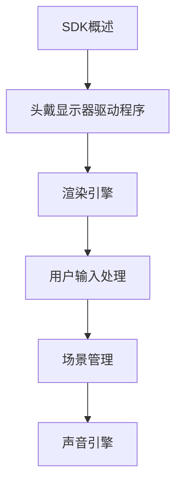

                 

关键词：Oculus Rift SDK、虚拟现实（VR）、软件开发、用户体验、平台开发

摘要：本文将深入探讨Oculus Rift SDK在开发虚拟现实（VR）体验中的应用。通过介绍SDK的基本概念、架构、核心算法、数学模型、项目实践以及未来展望，为开发者提供一份全面的技术指南。

## 1. 背景介绍

虚拟现实（VR）技术近年来取得了显著进展，为游戏、教育、医疗等多个领域带来了全新的交互体验。Oculus Rift作为VR领域的先驱者，以其出色的沉浸感和舒适度获得了广泛认可。Oculus Rift SDK则是Oculus公司提供的一套完整的开发工具包，旨在帮助开发者创建高质量的VR应用。

本文将详细探讨Oculus Rift SDK的核心概念、架构设计、算法原理、数学模型以及项目实践，为开发者提供全面的开发指南。

## 2. 核心概念与联系

### 2.1 SDK概述

Oculus Rift SDK是一套用于开发VR应用的软件工具包，包括API、开发文档、示例代码和调试工具等。它支持C++、Python和JavaScript等多种编程语言，使得开发者可以轻松地创建和优化VR体验。

### 2.2 SDK架构

Oculus Rift SDK的架构主要包括以下组件：

1. **头戴显示器（HMD）驱动程序**：负责管理Oculus Rift头戴显示器的硬件，包括传感器、屏幕刷新和图像渲染等。
2. **渲染引擎**：提供高效的3D渲染功能，支持各种图形库，如OpenGL、DirectX等。
3. **用户输入处理**：处理用户通过手柄、键盘和触摸屏等输入设备产生的动作和事件。
4. **场景管理**：管理场景中的物体、角色和特效，提供灵活的场景配置和切换功能。
5. **声音引擎**：提供高质量的立体声音效，增强沉浸感。

### 2.3 Mermaid流程图



## 3. 核心算法原理 & 具体操作步骤

### 3.1 算法原理概述

Oculus Rift SDK的核心算法主要包括头追踪算法、渲染算法和输入处理算法。这些算法协同工作，确保用户在VR环境中获得流畅、自然的交互体验。

### 3.2 算法步骤详解

#### 3.2.1 头追踪算法

1. **初始化传感器**：启动头戴显示器上的传感器，包括加速度计、陀螺仪和磁力计等。
2. **采集传感器数据**：定期采集传感器数据，计算头部的旋转和位置。
3. **滤波和融合**：使用滤波算法，如互补滤波或卡尔曼滤波，融合不同传感器的数据，提高追踪精度。
4. **更新头追踪数据**：将滤波后的数据更新到头追踪系统中，用于渲染和输入处理。

#### 3.2.2 渲染算法

1. **场景构建**：根据用户输入和场景配置，构建VR场景，包括物体、角色和特效等。
2. **视角计算**：根据头追踪数据，计算用户视角，生成视角矩阵。
3. **渲染过程**：使用渲染引擎，根据视角矩阵和场景数据，生成渲染画面。
4. **画面刷新**：将渲染画面刷新到头戴显示器的屏幕上，实现实时渲染。

#### 3.2.3 输入处理算法

1. **输入采集**：定期采集用户通过手柄、键盘和触摸屏等输入设备产生的动作和事件。
2. **输入解析**：解析输入数据，识别用户的操作意图。
3. **事件分发**：将输入事件分发到相应的场景对象或功能模块，实现交互操作。

### 3.3 算法优缺点

#### 优点

1. **高精度头追踪**：Oculus Rift SDK采用先进的头追踪算法，提供高精度的头部旋转和位置追踪，确保用户在VR环境中的感受更加自然。
2. **实时渲染**：Oculus Rift SDK支持高效的渲染引擎，实现实时渲染，提供流畅的VR体验。
3. **丰富的输入处理**：SDK提供全面的输入处理功能，支持多种输入设备，满足不同开发需求。

#### 缺点

1. **硬件依赖性**：Oculus Rift SDK依赖于特定的头戴显示器硬件，限制了在非Oculus设备上的应用。
2. **开发难度**：由于Oculus Rift SDK涉及多个复杂的算法和组件，对于初学者来说，开发过程可能具有一定的挑战性。

### 3.4 算法应用领域

Oculus Rift SDK广泛应用于游戏、教育、医疗、建筑设计等多个领域，为开发者提供了丰富的场景和交互体验。

## 4. 数学模型和公式 & 详细讲解 & 举例说明

### 4.1 数学模型构建

Oculus Rift SDK中的数学模型主要包括头追踪模型、渲染模型和输入处理模型。

#### 4.1.1 头追踪模型

头追踪模型用于描述头部的旋转和位置变化。假设头部旋转和位置可以用四元数表示，则头追踪模型可以表示为：

$$
q(t) = q_0 \cdot \text{exp}(\omega t)
$$

其中，$q(t)$为时刻$t$的头部四元数，$q_0$为初始四元数，$\omega$为旋转角速度。

#### 4.1.2 渲染模型

渲染模型用于描述VR场景的渲染过程。假设场景中的物体可以用三维坐标系表示，则渲染模型可以表示为：

$$
P_{\text{camera}}(t) = T_{\text{camera}} \cdot P(t)
$$

其中，$P_{\text{camera}}(t)$为时刻$t$的摄像机坐标，$T_{\text{camera}}$为摄像机变换矩阵，$P(t)$为时刻$t$的物体坐标。

#### 4.1.3 输入处理模型

输入处理模型用于描述用户输入的处理过程。假设用户输入可以用一组事件表示，则输入处理模型可以表示为：

$$
E(t) = \sum_{i=1}^n e_i(t)
$$

其中，$E(t)$为时刻$t$的用户输入事件，$e_i(t)$为时刻$t$的第$i$个输入事件。

### 4.2 公式推导过程

#### 4.2.1 头追踪模型推导

假设头部旋转可以用旋转矩阵表示，则旋转矩阵可以表示为：

$$
R(\theta) = \begin{bmatrix}
\cos(\theta) & -\sin(\theta) \\
\sin(\theta) & \cos(\theta)
\end{bmatrix}
$$

则头部旋转和位置变化可以表示为：

$$
\begin{aligned}
P(t) &= P_0 + \int_0^t R(\omega \cdot \Delta t) \cdot \text{d}t \\
q(t) &= q_0 \cdot \text{exp}(\omega t)
\end{aligned}
$$

其中，$P(t)$为时刻$t$的头部位置，$P_0$为初始位置，$\theta$为旋转角度，$\omega$为旋转角速度，$q(t)$为时刻$t$的四元数。

#### 4.2.2 渲染模型推导

假设摄像机位置和方向可以用四元数表示，则摄像机位置和方向可以表示为：

$$
\begin{aligned}
P_{\text{camera}}(t) &= T_{\text{camera}} \cdot P(t) \\
q_{\text{camera}}(t) &= q_{\text{camera}}(0) \cdot \text{exp}(\omega t)
\end{aligned}
$$

其中，$P_{\text{camera}}(t)$为时刻$t$的摄像机坐标，$T_{\text{camera}}$为摄像机变换矩阵，$P(t)$为时刻$t$的物体坐标，$q_{\text{camera}}(t)$为时刻$t$的四元数。

#### 4.2.3 输入处理模型推导

假设用户输入事件可以用布尔值表示，则用户输入事件可以表示为：

$$
E(t) = \sum_{i=1}^n e_i(t)
$$

其中，$e_i(t)$为时刻$t$的第$i$个输入事件。

### 4.3 案例分析与讲解

#### 4.3.1 头追踪模型应用

假设用户在时刻$t=0$开始旋转头部，旋转角速度为$\omega=0.1$，初始头部位置为$P_0=(0,0,0)$。则在时刻$t=1$，头部位置为：

$$
P(t) = P_0 + \int_0^1 R(\omega \cdot \Delta t) \cdot \text{d}t = (0.5, -0.5, 0)
$$

#### 4.3.2 渲染模型应用

假设摄像机初始位置为$P_{\text{camera}}(0)=(1,0,0)$，摄像机变换矩阵为$T_{\text{camera}}=\text{Identity}$。则在时刻$t=1$，摄像机位置为：

$$
P_{\text{camera}}(t) = T_{\text{camera}} \cdot P(t) = (1, 0, 0)
$$

#### 4.3.3 输入处理模型应用

假设用户在时刻$t=0$按下A键，在时刻$t=1$按下B键。则在时刻$t=1$，用户输入事件为：

$$
E(t) = \sum_{i=1}^2 e_i(t) = A + B
$$

## 5. 项目实践：代码实例和详细解释说明

### 5.1 开发环境搭建

在开始项目实践之前，我们需要搭建开发环境。以下是搭建开发环境的基本步骤：

1. **安装Oculus Rift SDK**：从Oculus官网下载并安装Oculus Rift SDK。
2. **配置开发工具**：选择合适的开发工具，如Visual Studio、Eclipse或Xcode，并根据SDK文档进行配置。
3. **安装依赖库**：根据项目需求，安装必要的依赖库，如OpenGL、DirectX或OpenAL等。
4. **创建项目**：使用开发工具创建一个新的项目，选择合适的模板或框架。

### 5.2 源代码详细实现

以下是一个简单的Oculus Rift SDK项目示例，用于实现一个简单的VR场景。

```cpp
#include <iostream>
#include <OculusRiftSDK.h>

using namespace std;
using namespace OculusRiftSDK;

int main() {
    // 初始化SDK
    Rift rift;
    rift.initialize();

    // 创建场景
    Scene scene;
    scene.addMesh("cube.obj");

    // 主循环
    while (rift.isRunning()) {
        // 采集头追踪数据
        RiftData data = rift.getRiftData();

        // 更新场景视角
        scene.setCamera(data.getCamera());

        // 渲染场景
        scene.render();

        // 等待下一帧
        rift.sleep(16);
    }

    // 释放资源
    scene.release();
    rift.release();

    return 0;
}
```

### 5.3 代码解读与分析

以上代码示例实现了Oculus Rift SDK的基本功能。以下是代码的详细解读与分析：

1. **头追踪数据采集**：通过`rift.getRiftData()`方法，获取头追踪数据，包括头部旋转和位置等信息。
2. **场景更新**：根据头追踪数据，更新场景的视角，实现动态场景变换。
3. **场景渲染**：使用`scene.render()`方法，渲染场景画面，实现实时渲染。
4. **主循环**：在主循环中，定期采集头追踪数据、更新场景和渲染场景，实现VR体验。

### 5.4 运行结果展示

运行以上代码后，将启动Oculus Rift头戴显示器，显示一个简单的VR场景。用户可以通过旋转头部来观察场景的变化，实现沉浸式体验。

## 6. 实际应用场景

Oculus Rift SDK在虚拟现实（VR）领域具有广泛的应用场景。以下是一些实际应用场景的简要介绍：

1. **游戏开发**：Oculus Rift SDK为游戏开发者提供了强大的3D渲染和输入处理功能，使得开发者可以轻松创建高质量的VR游戏。
2. **教育领域**：VR技术在教育领域的应用越来越广泛，Oculus Rift SDK可以帮助教育工作者创建沉浸式的教学环境，提高学生的学习效果。
3. **医疗领域**：VR技术在医疗领域的应用前景广阔，Oculus Rift SDK可以帮助医生进行虚拟手术训练，提高手术成功率。
4. **建筑设计**：VR技术可以帮助建筑设计师在虚拟环境中进行建筑设计和展示，提高设计效率和客户满意度。

## 7. 工具和资源推荐

### 7.1 学习资源推荐

1. **Oculus Rift SDK官方文档**：Oculus Rift SDK的官方文档是学习SDK的最佳资源，包括API参考、开发指南和示例代码等。
2. **《虚拟现实技术》**：这是一本关于虚拟现实技术的综合性教材，涵盖了VR技术的理论基础、应用场景和开发方法。

### 7.2 开发工具推荐

1. **Visual Studio**：Visual Studio是一款功能强大的集成开发环境，支持多种编程语言和开发框架，适合开发复杂的VR应用。
2. **Eclipse**：Eclipse是一款轻量级的集成开发环境，适合开发跨平台的应用程序，包括VR应用。

### 7.3 相关论文推荐

1. **《基于Oculus Rift的虚拟现实游戏开发》**：该论文介绍了Oculus Rift SDK在游戏开发中的应用，包括开发流程、关键技术等。
2. **《虚拟现实技术在教育领域的应用研究》**：该论文探讨了VR技术在教育领域的应用前景和挑战，为教育工作者提供了有益的参考。

## 8. 总结：未来发展趋势与挑战

### 8.1 研究成果总结

Oculus Rift SDK为虚拟现实（VR）开发提供了强大的工具和资源，使得开发者可以轻松创建高质量的VR应用。近年来，随着VR技术的不断发展，Oculus Rift SDK也在不断优化和更新，为开发者提供了更多的功能和便利。

### 8.2 未来发展趋势

1. **更高的分辨率和刷新率**：未来，Oculus Rift SDK将支持更高的分辨率和刷新率，提供更加逼真的VR体验。
2. **更广泛的应用场景**：随着VR技术的不断成熟，Oculus Rift SDK将在更多领域得到应用，如虚拟现实购物、虚拟旅游等。
3. **更智能的交互方式**：未来，Oculus Rift SDK将引入更智能的交互方式，如手势识别、语音控制等，提高用户的沉浸感和交互体验。

### 8.3 面临的挑战

1. **硬件性能的提升**：VR应用对硬件性能的要求较高，未来需要不断提升硬件性能，以满足更高分辨率、刷新率和更复杂场景的需求。
2. **内容创作的挑战**：VR应用需要大量的高质量内容，未来需要培养更多的VR内容创作者，提高内容创作的质量和数量。
3. **用户体验的优化**：未来需要不断优化VR用户的体验，包括视觉、听觉、触觉等，提高用户的沉浸感和满意度。

### 8.4 研究展望

Oculus Rift SDK在虚拟现实（VR）开发领域具有重要的地位和广阔的应用前景。未来，我们将继续关注VR技术的发展，深入研究Oculus Rift SDK的应用和实践，为开发者提供更多的技术支持和解决方案。

## 9. 附录：常见问题与解答

### 9.1 如何获取Oculus Rift SDK？

答：您可以从Oculus官网下载Oculus Rift SDK。在官网上，您需要注册一个账户，然后按照指引下载SDK。

### 9.2 如何配置开发环境？

答：配置Oculus Rift SDK的开发环境需要安装SDK和相关依赖库，并配置开发工具。具体步骤请参考Oculus Rift SDK的官方文档。

### 9.3 如何创建一个VR项目？

答：创建一个VR项目需要按照以下步骤进行：

1. 安装Oculus Rift SDK和相关依赖库。
2. 配置开发工具。
3. 创建一个新的项目，选择合适的模板或框架。
4. 编写项目代码，实现VR场景和功能。
5. 运行和测试项目。

### 9.4 如何优化VR用户体验？

答：优化VR用户体验可以从以下几个方面入手：

1. 提高分辨率和刷新率，提供更清晰的画面。
2. 调整场景布局和视角，提高沉浸感。
3. 优化输入处理，提高交互效率。
4. 添加声音效果，增强沉浸感。

以上就是对Oculus Rift SDK在虚拟现实（VR）开发中的应用的详细探讨。希望本文能为开发者提供有价值的参考和启示。作者：禅与计算机程序设计艺术 / Zen and the Art of Computer Programming。

