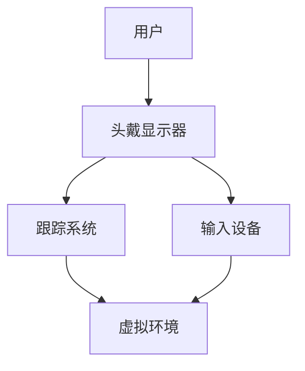

                 

关键词：Oculus Rift、虚拟现实、开发、技术、架构、算法、实例、应用场景

> 摘要：本文将深入探讨Oculus Rift的开发技术，从背景介绍、核心概念与联系、核心算法原理、数学模型与公式、项目实践到实际应用场景，全面解析虚拟现实技术的魅力与发展前景。

## 1. 背景介绍

虚拟现实（Virtual Reality，VR）技术是一种通过计算机生成模拟环境，使用户沉浸其中，并能与其进行交互的技术。Oculus Rift作为全球领先的VR头戴设备，其开发技术的不断创新推动了VR领域的快速发展。

Oculus Rift的开发历史可以追溯到2012年，当时Facebook收购了Oculus VR公司，并迅速投入大量资源进行研发。2016年，Oculus Rift正式上市，成为了VR市场的明星产品。自那以后，Oculus Rift不断更新迭代，从硬件规格到软件功能都取得了显著的进步。

本文将围绕Oculus Rift的开发技术，详细解析其核心概念与联系、核心算法原理、数学模型与公式、项目实践以及实际应用场景。

## 2. 核心概念与联系

### 2.1 虚拟现实技术基础

虚拟现实技术主要包括以下几个关键概念：

- **头戴显示器（Head-Mounted Display，HMD）**：Oculus Rift的头戴显示器是用户观察虚拟环境的主要设备。
- **跟踪系统**：Oculus Rift通过内置的传感器和外部摄像头，实现对头部的跟踪，确保虚拟环境与用户视角同步。
- **输入设备**：手柄、体感控制器等，用户通过这些设备与虚拟环境进行交互。

### 2.2 虚拟现实架构

Oculus Rift的虚拟现实架构可以概括为以下几个部分：

- **硬件层**：包括头戴显示器、跟踪传感器、输入设备等。
- **软件层**：运行在头戴显示器上的操作系统和应用软件，如Oculus Home。
- **应用层**：各种虚拟现实应用程序，如游戏、模拟、教育等。

### 2.3 Mermaid 流程图

下面是一个简化的Mermaid流程图，展示了Oculus Rift的核心概念与联系：



## 3. 核心算法原理 & 具体操作步骤

### 3.1 算法原理概述

Oculus Rift的开发涉及多个核心算法，主要包括：

- **3D空间重建**：通过摄像头获取用户周围环境的深度信息，重建虚拟环境。
- **运动跟踪**：实时计算用户头部的位置和方向，确保虚拟环境与用户视角同步。
- **图像渲染**：根据用户视角生成虚拟环境中的图像，显示在头戴显示器上。

### 3.2 算法步骤详解

#### 3.2.1 3D空间重建

1. 使用摄像头捕捉用户周围环境的图像。
2. 利用图像处理算法提取图像的深度信息。
3. 使用3D重建算法，如三角测量法，将深度信息转换为三维模型。

#### 3.2.2 运动跟踪

1. 使用内置传感器（如加速度计、陀螺仪）获取头部的运动数据。
2. 使用卡尔曼滤波等算法，对数据进行平滑处理，消除噪声。
3. 根据运动数据计算头部的位置和方向。

#### 3.2.3 图像渲染

1. 根据用户视角计算虚拟环境中每个点的视图。
2. 使用渲染引擎（如OpenGL、Vulkan）生成图像。
3. 将图像显示在头戴显示器的屏幕上。

### 3.3 算法优缺点

- **3D空间重建**：优点是能提供高度真实的虚拟环境，缺点是计算复杂度高，对硬件性能要求较高。
- **运动跟踪**：优点是实时性强，缺点是在高速运动时可能产生滞后。
- **图像渲染**：优点是图像质量高，缺点是渲染时间较长，对硬件性能要求较高。

### 3.4 算法应用领域

Oculus Rift的核心算法广泛应用于多个领域：

- **游戏**：提供高度沉浸式的游戏体验。
- **教育**：虚拟实验室、虚拟课堂等。
- **医疗**：心理治疗、手术模拟等。
- **娱乐**：虚拟旅游、音乐视频等。

## 4. 数学模型和公式 & 详细讲解 & 举例说明

### 4.1 数学模型构建

Oculus Rift的开发涉及多个数学模型，主要包括：

- **三角测量模型**：用于计算虚拟环境中的三维位置。
- **卡尔曼滤波模型**：用于平滑头部运动数据。

### 4.2 公式推导过程

#### 4.2.1 三角测量模型

三角测量模型的基本公式如下：

$$
x = \frac{p_x f}{z} \\
y = \frac{p_y f}{z}
$$

其中，$x$和$y$是三维空间中的坐标，$p_x$和$p_y$是图像上的像素坐标，$f$是焦距，$z$是深度信息。

#### 4.2.2 卡尔曼滤波模型

卡尔曼滤波模型的基本公式如下：

$$
x_{k+1} = x_k + u_k \\
P_{k+1} = P_k + Q_k \\
K_k = \frac{P_k H_k^T}{H_k P_k H_k^T + R_k} \\
x_{k+1} = x_k + K_k (z_{k+1} - H_k x_k) \\
P_{k+1} = (I - K_k H_k) P_k
$$

其中，$x_k$和$P_k$分别是当前状态估计和状态估计误差，$u_k$是控制输入，$z_{k+1}$是观测值，$H_k$是观测矩阵，$K_k$是卡尔曼增益，$Q_k$和$R_k$分别是过程噪声和观测噪声。

### 4.3 案例分析与讲解

#### 4.3.1 三角测量模型应用

假设我们有一个摄像头捕捉到的图像，其中的一个物体距离摄像头2米，图像上的像素坐标为（100, 100）。根据三角测量模型，我们可以计算出物体的三维坐标：

$$
x = \frac{100 f}{2} = 50f \\
y = \frac{100 f}{2} = 50f
$$

其中，$f$是摄像头的焦距，通常在几十毫米到几百毫米之间。

#### 4.3.2 卡尔曼滤波模型应用

假设我们有一个包含运动传感器的Oculus Rift头戴设备，当前时刻的头部位置为（1, 2），速度为（0.1, 0.2）。根据卡尔曼滤波模型，我们可以预测下一时刻的头部位置：

$$
x_{k+1} = x_k + u_k = 1 + 0.1 = 1.1 \\
y_{k+1} = y_k + u_k = 2 + 0.2 = 2.2
$$

其中，$u_k$是速度。

## 5. 项目实践：代码实例和详细解释说明

### 5.1 开发环境搭建

要开发Oculus Rift应用程序，首先需要搭建合适的开发环境。以下是搭建过程：

1. 安装Oculus Rift SDK。
2. 安装Unity或Unreal Engine开发工具。
3. 安装OpenGL或Vulkan渲染库。

### 5.2 源代码详细实现

以下是使用Unity开发Oculus Rift应用程序的基本源代码实现：

```csharp
using UnityEngine;

public class OculusRiftApp : MonoBehaviour
{
    public Camera camera;

    void Start()
    {
        // 设置摄像头参数
        camera.fieldOfView = 90.0f;
        camera.aspect = 16.0f / 9.0f;
    }

    void Update()
    {
        // 跟踪头部运动
        Transform headTransform = Camera.main.transform;
        Vector3 position = headTransform.position;
        Quaternion rotation = headTransform.rotation;

        // 更新虚拟环境
        UpdateVirtualEnvironment(position, rotation);
    }

    void UpdateVirtualEnvironment(Vector3 position, Quaternion rotation)
    {
        // 更新虚拟环境中的物体位置和旋转
        GameObject[] objects = FindObjectsOfType<GameObject>();
        foreach (GameObject obj in objects)
        {
            obj.transform.position = position;
            obj.transform.rotation = rotation;
        }
    }
}
```

### 5.3 代码解读与分析

上述代码是一个简单的Oculus Rift应用程序，其中：

- `Camera`组件用于渲染虚拟环境。
- `Start`方法用于设置摄像头的参数。
- `Update`方法用于实时跟踪头部运动，并更新虚拟环境。

### 5.4 运行结果展示

运行上述应用程序后，我们可以看到虚拟环境中的物体随着头部运动而实时更新位置和旋转，实现了Oculus Rift的基本功能。

## 6. 实际应用场景

Oculus Rift的应用场景非常广泛，包括：

- **游戏**：提供沉浸式的游戏体验。
- **教育**：虚拟实验室、虚拟课堂等。
- **医疗**：心理治疗、手术模拟等。
- **娱乐**：虚拟旅游、音乐视频等。

### 6.1 游戏应用

Oculus Rift在游戏领域的应用非常成功，许多游戏开发商推出了专门针对Oculus Rift的游戏。这些游戏提供了前所未有的沉浸式体验，用户可以在虚拟世界中自由探索、互动。

### 6.2 教育应用

虚拟现实技术在教育领域具有巨大的潜力。通过Oculus Rift，学生可以进入虚拟实验室，进行模拟实验，增强学习体验。

### 6.3 医疗应用

Oculus Rift在医疗领域的应用包括心理治疗、手术模拟等。通过虚拟现实技术，医生可以更直观地了解病情，提高手术成功率。

### 6.4 娱乐应用

Oculus Rift在娱乐领域的应用也非常丰富，包括虚拟旅游、音乐视频等。用户可以在虚拟世界中体验不同的场景和氛围，丰富娱乐生活。

## 7. 工具和资源推荐

### 7.1 学习资源推荐

- **《虚拟现实技术基础》**：详细介绍虚拟现实技术的基础知识。
- **《Oculus Rift 开发指南》**：针对Oculus Rift开发的具体指导。

### 7.2 开发工具推荐

- **Unity**：适用于游戏开发的强大引擎。
- **Unreal Engine**：适用于高端游戏和虚拟现实开发的引擎。

### 7.3 相关论文推荐

- **《基于Oculus Rift的虚拟现实游戏设计研究》**
- **《虚拟现实技术在医疗领域的应用》**

## 8. 总结：未来发展趋势与挑战

### 8.1 研究成果总结

近年来，Oculus Rift的开发技术取得了显著成果，包括硬件性能的提升、跟踪技术的改进、图像渲染的优化等。

### 8.2 未来发展趋势

随着技术的不断进步，Oculus Rift的未来发展将更加注重用户体验、硬件性能的提升以及跨领域应用的拓展。

### 8.3 面临的挑战

Oculus Rift在开发过程中仍然面临一些挑战，包括硬件成本、软件兼容性、用户体验优化等。

### 8.4 研究展望

未来，Oculus Rift的发展将继续围绕用户体验和性能提升展开，同时探索新的应用领域，为人类带来更加丰富和沉浸的虚拟世界体验。

## 9. 附录：常见问题与解答

### 9.1 如何搭建Oculus Rift开发环境？

答：搭建Oculus Rift开发环境需要安装Oculus Rift SDK、选择合适的开发工具（如Unity或Unreal Engine），以及安装必要的渲染库（如OpenGL或Vulkan）。

### 9.2 Oculus Rift在医疗领域的应用有哪些？

答：Oculus Rift在医疗领域的应用包括心理治疗、手术模拟、医学教育等，能够提供直观、沉浸式的医疗体验。

### 9.3 如何优化Oculus Rift应用程序的性能？

答：优化Oculus Rift应用程序的性能可以从以下几个方面入手：优化渲染流程、减少内存使用、提高计算效率等。

---

作者：禅与计算机程序设计艺术 / Zen and the Art of Computer Programming
-----------------------------------------------------------------------------

